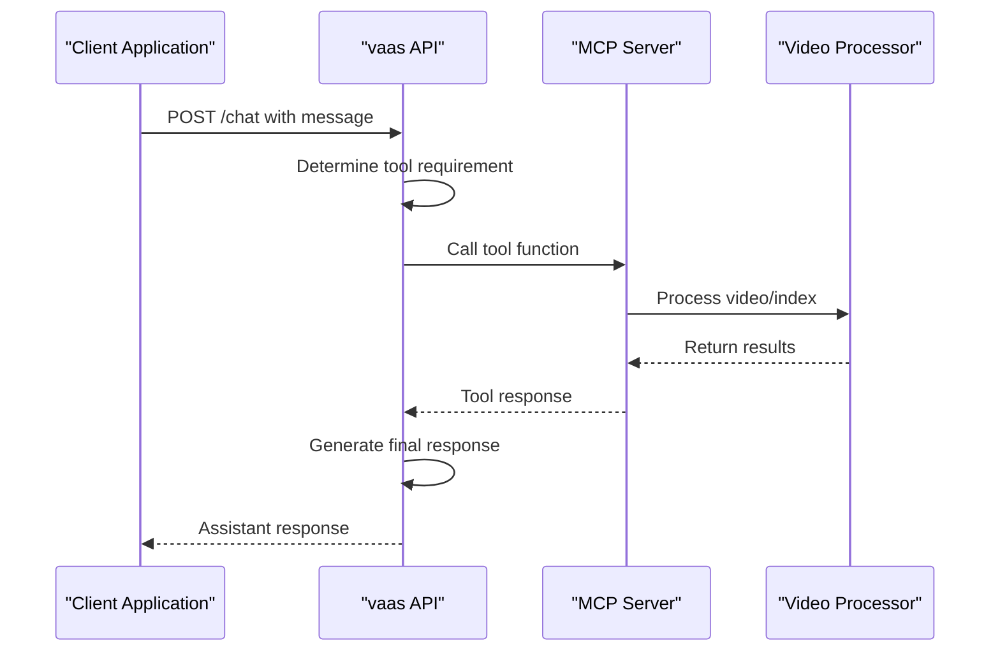

# API Reference

<cite>
**Referenced Files in This Document**
- [models.py](file://vaas-api/src/vaas_api/models.py)
- [api.py](file://vaas-api/src/vaas_api/api.py)
- [config.py](file://vaas-api/src/vaas_api/config.py)
- [tools.py](file://vaas-api/src/vaas_api/tools.py)
- [base_agent.py](file://vaas-api/src/vaas_api/agent/base_agent.py)
- [groq_agent.py](file://vaas-api/src/vaas_api/agent/groq/groq_agent.py)
- [server.py](file://vaas-mcp/src/vaas_mcp/server.py)
- [tools.py](file://vaas-mcp/src/vaas_mcp/tools.py)
- [functions.py](file://vaas-mcp/src/vaas_mcp/video/ingestion/functions.py)
- [pyproject.toml](file://vaas-api/pyproject.toml)
- [README.md](file://vaas-api/README.md)
</cite>

## Table of Contents
1. [Introduction](#introduction)
2. [Authentication and Configuration](#authentication-and-configuration)
3. [Core Endpoints](#core-endpoints)
4. [MCP Server Interface](#mcp-server-interface)
5. [Models and Data Structures](#models-and-data-structures)
6. [Client Implementation Guidelines](#client-implementation-guidelines)
7. [Error Handling](#error-handling)
8. [Rate Limiting and Performance](#rate-limiting-and-performance)
9. [API Versioning](#api-versioning)
10. [Troubleshooting](#troubleshooting)

## Introduction

The vaas API is a FastAPI-based service that serves as the primary interface for interacting with the vaas multimodal agent system. It exposes RESTful endpoints for video processing, chat interactions, and memory management, while integrating with the vaas MCP (Model Context Protocol) server for advanced video analysis capabilities.

The API is designed to handle asynchronous operations efficiently, particularly for video processing tasks that require significant computational resources. It supports both synchronous and asynchronous workflows, making it suitable for various client applications ranging from simple chat interfaces to complex video analysis systems.

## Authentication and Configuration

### Environment Variables

The API requires several environment variables for proper operation:

```bash
# Required for Groq API access
GROQ_API_KEY=your_groq_api_key_here

# Optional for observability
OPIK_API_KEY=your_opik_api_key_here
OPIK_PROJECT=vaas-api

# Memory configuration
AGENT_MEMORY_SIZE=20

# MCP server configuration
MCP_SERVER=http://vaas-mcp:9090/mcp
```

### Authentication Requirements

Currently, the API operates without explicit authentication mechanisms. All endpoints are publicly accessible, but clients should implement appropriate security measures for production deployments.

### Rate Limiting Policies

The API implements basic rate limiting through FastAPI's built-in mechanisms. The primary rate limiting consideration is the underlying Groq API limits, which apply to LLM requests.

**Section sources**
- [config.py](file://vaas-api/src/vaas_api/config.py#L1-L43)
- [README.md](file://vaas-api/README.md#L35-L50)

## Core Endpoints

### POST /upload-video

Uploads a video file to the server and returns the file path for subsequent processing.

#### Request

**Endpoint:** `POST http://localhost:8080/upload-video`

**Content-Type:** `multipart/form-data`

**Body Parameters:**
- `file` (required): Video file to upload (supports MP4 format)

#### Response

**Success Response:** `200 OK`
```json
{
  "message": "Video uploaded successfully",
  "video_path": "/path/to/uploaded/video.mp4",
  "task_id": "uuid-string"
}
```

**Error Responses:**
- `400 Bad Request`: No file uploaded
- `500 Internal Server Error`: Upload failure

#### cURL Example

```bash
curl -X POST "http://localhost:8080/upload-video" \
  -H "Content-Type: multipart/form-data" \
  -F "file=@/path/to/video.mp4"
```

### POST /process-video

Initiates asynchronous video processing through the MCP server.

#### Request

**Endpoint:** `POST http://localhost:8080/process-video`

**Headers:**
- `Content-Type: application/json`

**Body Schema:**
```json
{
  "video_path": "string"
}
```

#### Response

**Success Response:** `200 OK`
```json
{
  "message": "Task enqueued for processing",
  "task_id": "uuid-string"
}
```

#### Status Monitoring

**Endpoint:** `GET http://localhost:8080/task-status/{task_id}`

Returns the current status of a video processing task:

```json
{
  "task_id": "uuid-string",
  "status": "pending|in_progress|completed|failed|not_found"
}
```

#### cURL Examples

```bash
# Submit video for processing
curl -X POST "http://localhost:8080/process-video" \
  -H "Content-Type: application/json" \
  -d '{"video_path": "/path/to/video.mp4"}'

# Check processing status
curl -X GET "http://localhost:8080/task-status/uuid-string"
```

### POST /chat

Processes user messages with support for video and image context.

#### Request

**Endpoint:** `POST http://localhost:8080/chat`

**Headers:**
- `Content-Type: application/json`

**Body Schema:**
```json
{
  "message": "string",
  "video_path": "string | null",
  "image_base64": "string | null"
}
```

#### Response

**Success Response:** `200 OK`
```json
{
  "message": "Assistant's response",
  "clip_path": "/path/to/clip.mp4 | null"
}
```

#### cURL Example

```bash
# Basic chat
curl -X POST "http://localhost:8080/chat" \
  -H "Content-Type: application/json" \
  -d '{"message": "What happened in this video?"}'

# Chat with video context
curl -X POST "http://localhost:8080/chat" \
  -H "Content-Type: application/json" \
  -d '{
    "message": "Describe the action shown",
    "video_path": "/path/to/video.mp4"
  }'

# Chat with image context
curl -X POST "http://localhost:8080/chat" \
  -H "Content-Type: application/json" \
  -d '{
    "message": "What do you see?",
    "image_base64": "base64_encoded_image_data"
  }'
```

### POST /reset-memory

Resets the agent's memory state, clearing conversation history.

#### Request

**Endpoint:** `POST http://localhost:8080/reset-memory`

**Headers:**
- `Content-Type: application/json`

#### Response

**Success Response:** `200 OK`
```json
{
  "message": "Memory reset successfully"
}
```

#### cURL Example

```bash
curl -X POST "http://localhost:8080/reset-memory"
```

**Section sources**
- [api.py](file://vaas-api/src/vaas_api/api.py#L1-L198)
- [models.py](file://vaas-api/src/vaas_api/models.py#L1-L54)

## MCP Server Interface

The vaas API integrates with the vaas MCP (Model Context Protocol) server through FastMCP, exposing video processing tools and prompts.

### Tool Functions

#### process_video

**Signature:** `process_video(video_path: str) -> str`

**Description:** Processes a video file and prepares it for searching by creating video indexes and extracting relevant metadata.

**Parameters:**
- `video_path` (str): Path to the video file to process

**Returns:**
- `str`: Success message indicating the video was processed

#### get_video_clip_from_user_query

**Signature:** `get_video_clip_from_user_query(video_path: str, user_query: str) -> str`

**Description:** Extracts a video clip based on user query using speech and caption similarity search.

**Parameters:**
- `video_path` (str): Path to the video file
- `user_query` (str): User query to search for

**Returns:**
- `str`: Path to the extracted video clip

#### get_video_clip_from_image

**Signature:** `get_video_clip_from_image(video_path: str, user_image: str) -> str`

**Description:** Extracts a video clip based on similarity to a provided image.

**Parameters:**
- `video_path` (str): Path to the video file
- `user_image` (str): Base64 encoded query image

**Returns:**
- `str`: Path to the extracted video clip

#### ask_question_about_video

**Signature:** `ask_question_about_video(video_path: str, user_query: str) -> str`

**Description:** Retrieves relevant captions from the video based on the user's question.

**Parameters:**
- `video_path` (str): Path to the video file
- `user_query` (str): Question to search for relevant captions

**Returns:**
- `str`: Concatenated relevant captions from the video

### Prompt Management

The MCP server provides three main prompts:

1. **routing_system_prompt**: Determines whether a user question requires tool usage
2. **tool_use_system_prompt**: Guides the agent when using video processing tools
3. **general_system_prompt**: Provides general conversation context



**Diagram sources**
- [server.py](file://vaas-mcp/src/vaas_mcp/server.py#L1-L97)
- [tools.py](file://vaas-mcp/src/vaas_mcp/tools.py#L1-L105)

**Section sources**
- [server.py](file://vaas-mcp/src/vaas_mcp/server.py#L1-L97)
- [tools.py](file://vaas-mcp/src/vaas_mcp/tools.py#L1-L105)

## Models and Data Structures

### UserMessageRequest

Represents a user's message with optional multimedia context.

```python
class UserMessageRequest(BaseModel):
    message: str
    video_path: str | None = None
    image_base64: str | None = None
```

**Fields:**
- `message` (str): The user's text message
- `video_path` (str | None): Path to video file for context (optional)
- `image_base64` (str | None): Base64 encoded image data (optional)

### ProcessVideoRequest

Used for initiating video processing tasks.

```python
class ProcessVideoRequest(BaseModel):
    video_path: str
```

**Fields:**
- `video_path` (str): Path to the video file to process

### VideoUploadResponse

Response structure for video upload operations.

```python
class VideoUploadResponse(BaseModel):
    message: str
    video_path: str | None = None
    task_id: str | None = None
```

**Fields:**
- `message` (str): Status message
- `video_path` (str | None): Path to the uploaded video
- `task_id` (str | None): Unique identifier for the upload task

### AssistantMessageResponse

Response structure for chat interactions.

```python
class AssistantMessageResponse(BaseModel):
    message: str
    clip_path: str | None = None
```

**Fields:**
- `message` (str): Assistant's response text
- `clip_path` (str | None): Path to generated video clip (if applicable)

### ResetMemoryResponse

Response structure for memory reset operations.

```python
class ResetMemoryResponse(BaseModel):
    message: str
```

**Fields:**
- `message` (str): Confirmation message

### Structured Output Models

#### RoutingResponseModel

Determines whether a user question requires tool usage.

```python
class RoutingResponseModel(BaseModel):
    tool_use: bool = Field(
        description="Whether the user's question requires a tool call."
    )
```

#### GeneralResponseModel

Standard response format for general conversations.

```python
class GeneralResponseModel(BaseModel):
    message: str = Field(
        description="Your response to the user's question, that needs to follow vaas's style and personality"
    )
```

#### VideoClipResponseModel

Response format for video clip generation.

```python
class VideoClipResponseModel(BaseModel):
    message: str = Field(
        description="A fun and engaging message to the user, asking them to watch the video clip, that needs to follow vaas's style and personality"
    )
    clip_path: str = Field(description="The path to the generated clip.")
```

**Section sources**
- [models.py](file://vaas-api/src/vaas_api/models.py#L1-L54)

## Client Implementation Guidelines

### Asynchronous Operations

For video processing tasks, implement proper polling mechanisms:

```javascript
// Example JavaScript implementation
async function processVideo(videoPath) {
  // Step 1: Upload video
  const uploadResponse = await fetch('/upload-video', {
    method: 'POST',
    body: formData
  });
  
  const { task_id } = await uploadResponse.json();
  
  // Step 2: Process video asynchronously
  const processResponse = await fetch('/process-video', {
    method: 'POST',
    headers: { 'Content-Type': 'application/json' },
    body: JSON.stringify({ video_path: videoPath })
  });
  
  // Step 3: Poll for completion
  let status = 'pending';
  while (status !== 'completed' && status !== 'failed') {
    const statusResponse = await fetch(`/task-status/${task_id}`);
    const { status: newStatus } = await statusResponse.json();
    status = newStatus;
    
    if (status === 'pending' || status === 'in_progress') {
      await new Promise(resolve => setTimeout(resolve, 1000));
    }
  }
  
  return status === 'completed';
}
```

### Error Handling

Implement robust error handling for all endpoints:

```javascript
async function safeChat(message, videoPath = null, imageBase64 = null) {
  try {
    const response = await fetch('/chat', {
      method: 'POST',
      headers: { 'Content-Type': 'application/json' },
      body: JSON.stringify({ message, video_path: videoPath, image_base64: imageBase64 })
    });
    
    if (!response.ok) {
      throw new Error(`HTTP ${response.status}: ${await response.text()}`);
    }
    
    return await response.json();
  } catch (error) {
    console.error('Chat request failed:', error);
    return { message: 'Sorry, I encountered an error. Please try again.' };
  }
}
```

### Memory Management

Reset memory periodically to prevent context overflow:

```javascript
// Reset memory every hour or after significant conversation
setInterval(async () => {
  try {
    await fetch('/reset-memory', { method: 'POST' });
  } catch (error) {
    console.warn('Failed to reset memory:', error);
  }
}, 3600000); // 1 hour
```

### Media File Handling

Serve media files securely:

```javascript
// Generate secure URLs for media files
function getSecureMediaUrl(filePath) {
  // Sanitize file path to prevent directory traversal
  const sanitizedPath = filePath.replace(/[^a-zA-Z0-9.\-_]/g, '');
  return `/media/${encodeURIComponent(sanitizedPath)}`;
}
```

**Section sources**
- [api.py](file://vaas-api/src/vaas_api/api.py#L100-L150)

## Error Handling

### HTTP Status Codes

The API uses standard HTTP status codes:

- `200 OK`: Successful operation
- `400 Bad Request`: Invalid request parameters
- `404 Not Found`: Resource not found
- `500 Internal Server Error`: Server-side error

### Error Response Format

All error responses follow this structure:

```json
{
  "detail": "Error description"
}
```

### Common Error Scenarios

1. **Video File Not Found**: `404` when video_path doesn't exist
2. **Processing Failure**: `500` when video processing fails
3. **Invalid Upload**: `400` when no file is provided
4. **MCP Connection Error**: `500` when MCP server is unavailable

### Retry Mechanisms

Implement exponential backoff for transient failures:

```javascript
async function retryOperation(operation, maxRetries = 3) {
  let lastError;
  
  for (let i = 0; i < maxRetries; i++) {
    try {
      return await operation();
    } catch (error) {
      lastError = error;
      
      if (i < maxRetries - 1) {
        const delay = Math.pow(2, i) * 1000; // Exponential backoff
        await new Promise(resolve => setTimeout(resolve, delay));
      }
    }
  }
  
  throw lastError;
}
```

## Rate Limiting and Performance

### Performance Characteristics

The API is designed to handle concurrent requests efficiently:

- **Video Processing**: Asynchronous operations with progress tracking
- **Chat Requests**: Optimized for low-latency responses
- **Memory Management**: Configurable memory size (default: 20 items)

### Optimization Recommendations

1. **Batch Operations**: Group related requests when possible
2. **Connection Pooling**: Use persistent connections for multiple requests
3. **Caching**: Implement client-side caching for frequently accessed data
4. **Compression**: Enable gzip compression for large responses

### Resource Limits

- **Memory Size**: Configurable via `AGENT_MEMORY_SIZE` (default: 20)
- **Concurrent Tasks**: Limited by system resources and Groq API quotas
- **File Size**: Maximum video file size depends on available disk space

## API Versioning

### Current Version

The API follows semantic versioning principles:

- **Major Version**: Breaking changes to API structure
- **Minor Version**: New features and enhancements
- **Patch Version**: Bug fixes and minor improvements

### Backwards Compatibility

The API maintains backwards compatibility for:

- Existing endpoint signatures
- Response formats
- Error handling patterns
- Configuration options

### Migration Strategy

When breaking changes occur:

1. Deprecate old endpoints gradually
2. Provide migration guides
3. Maintain old endpoints for a grace period
4. Update documentation comprehensively

## Troubleshooting

### Common Issues

#### 1. MCP Server Connection Failures

**Symptoms:** `500 Internal Server Error` when calling video tools

**Solutions:**
- Verify MCP server is running: `curl http://vaas-mcp:9090/mcp`
- Check network connectivity between containers
- Review MCP server logs for errors

#### 2. Video Processing Timeout

**Symptoms:** Long delays or timeouts during video processing

**Solutions:**
- Increase timeout values for long videos
- Monitor system resources (CPU, memory, disk)
- Consider video preprocessing (compression, resolution reduction)

#### 3. Memory Overflow

**Symptoms:** Slow response times or memory errors

**Solutions:**
- Reduce `AGENT_MEMORY_SIZE` setting
- Implement periodic memory resets
- Monitor memory usage patterns

### Debugging Tools

#### Enable Debug Logging

Set environment variable:
```bash
export LOG_LEVEL=DEBUG
```

#### Health Check Endpoint

Access the health check:
```bash
curl http://localhost:8080/
```

#### Interactive Documentation

Explore endpoints with Swagger UI:
```
http://localhost:8080/docs
```

### Log Analysis

Monitor key log patterns:

```bash
# Check API logs
docker logs vaas-api

# Monitor MCP server
docker logs vaas-mcp

# Watch system resources
docker stats vaas-api vaas-mcp
```

**Section sources**
- [api.py](file://vaas-api/src/vaas_api/api.py#L150-L198)
- [base_agent.py](file://vaas-api/src/vaas_api/agent/base_agent.py#L80-L111)