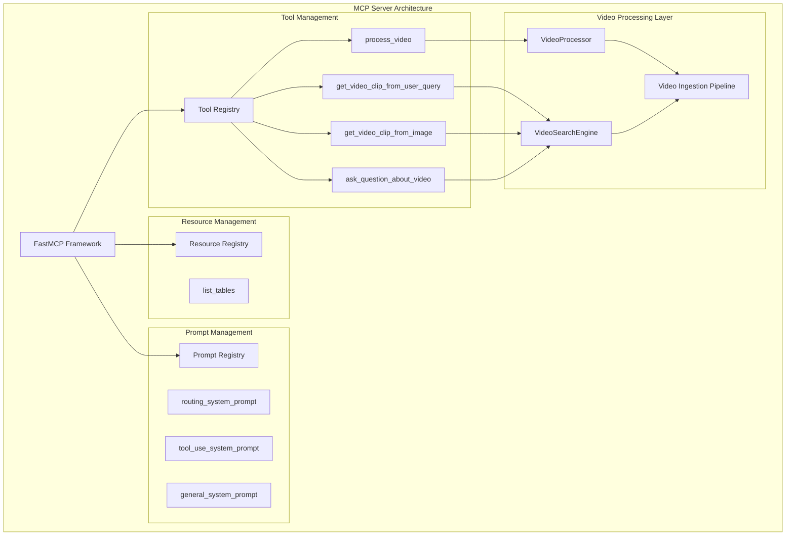
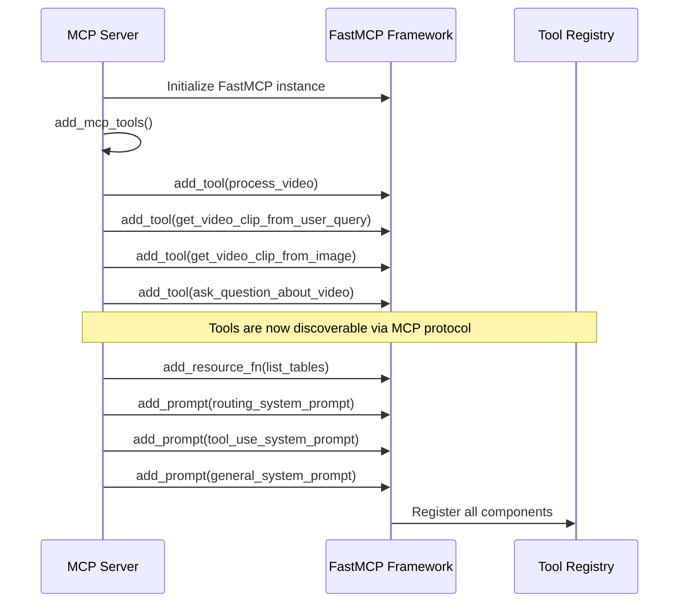
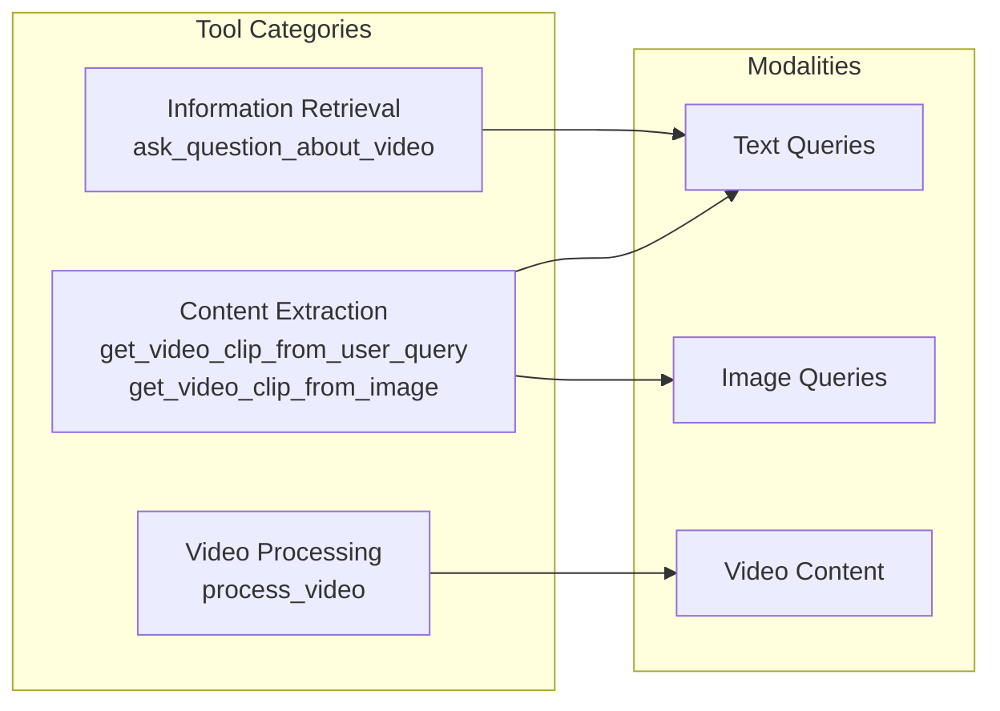
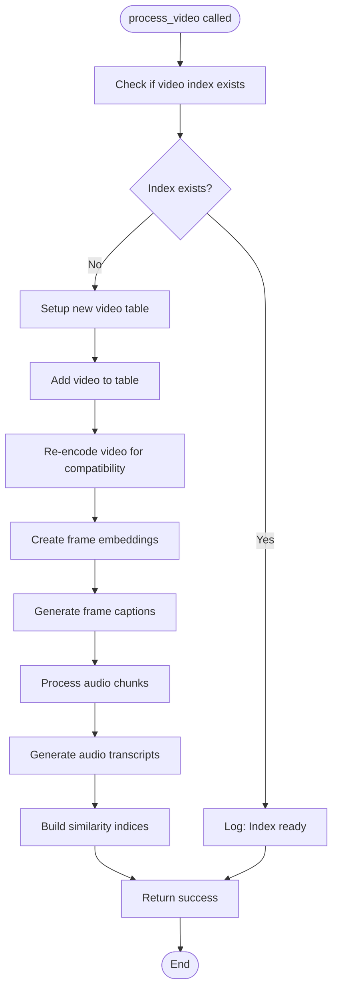
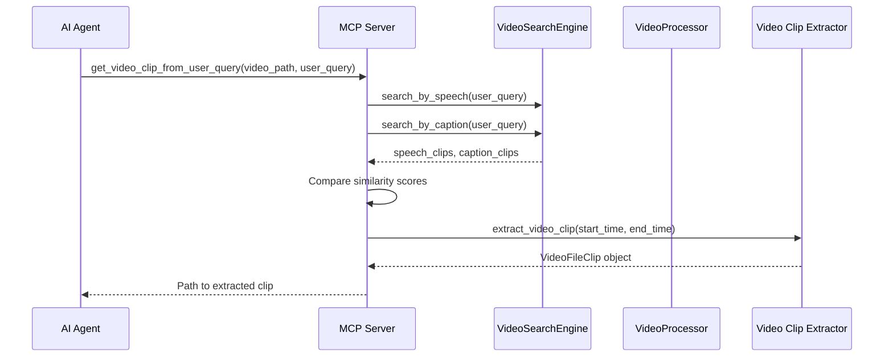
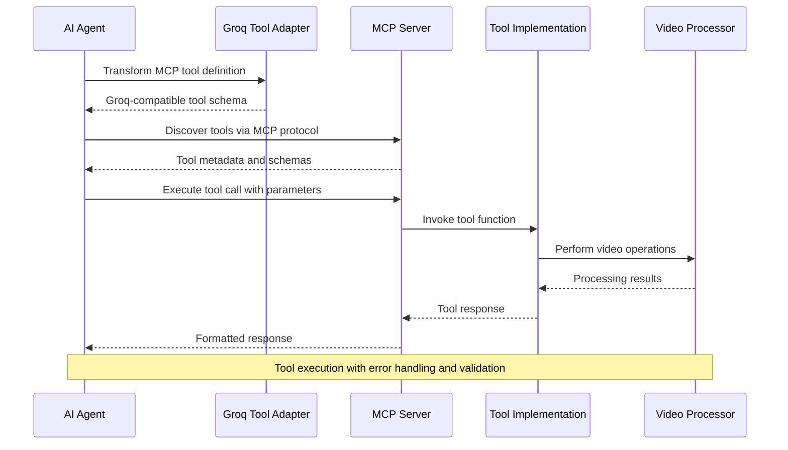
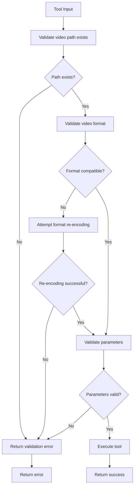
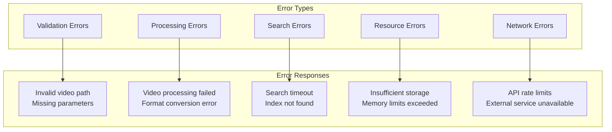

# MCP Tool Interface Documentation

<cite>
**Referenced Files in This Document**
- [server.py](file://vaas-mcp/src/vaas_mcp/server.py)
- [tools.py](file://vaas-mcp/src/vaas_mcp/tools.py)
- [video_processor.py](file://vaas-mcp/src/vaas_mcp/video/ingestion/video_processor.py)
- [video_search_engine.py](file://vaas-mcp/src/vaas_mcp/video/video_search_engine.py)
- [config.py](file://vaas-mcp/src/vaas_mcp/config.py)
- [tools.py](file://vaas-mcp/src/vaas_mcp/video/ingestion/tools.py)
- [groq_agent.py](file://vaas-api/src/vaas_api/agent/groq/groq_agent.py)
- [groq_tool.py](file://vaas-api/src/vaas_api/agent/groq/groq_tool.py)
- [models.py](file://vaas-api/src/vaas_api/models.py)
- [tools.py](file://vaas-api/src/vaas_api/tools.py)
</cite>

## Table of Contents
1. [Introduction](#introduction)
2. [MCP Server Architecture](#mcp-server-architecture)
3. [Tool Registration and Discovery](#tool-registration-and-discovery)
4. [Available Tools](#available-tools)
5. [Tool Implementation Details](#tool-implementation-details)
6. [Tool Invocation Workflow](#tool-invocation-workflow)
7. [Security and Validation](#security-and-validation)
8. [Error Handling](#error-handling)
9. [Performance Considerations](#performance-considerations)
10. [Developer Guidelines](#developer-guidelines)

## Introduction

The vaas MCP (Model Context Protocol) server provides a comprehensive tool interface for multimodal video processing capabilities. This documentation covers the four primary tools exposed by the server: `process_video`, `get_video_clip_from_user_query`, `get_video_clip_from_image`, and `ask_question_about_video`. These tools enable sophisticated video analysis, search, and extraction capabilities through a standardized MCP interface.

The MCP server acts as a bridge between AI agents (like the Groq agent) and the underlying video processing infrastructure, providing a unified API for video-related operations while maintaining security, performance, and extensibility standards.

## MCP Server Architecture

The MCP server is built using FastMCP framework and follows a modular architecture that separates concerns between tool registration, resource management, and prompt handling.



**Diagram sources**
- [server.py](file://vaas-mcp/src/vaas_mcp/server.py#L1-L97)
- [tools.py](file://vaas-mcp/src/vaas_mcp/tools.py#L1-L105)

**Section sources**
- [server.py](file://vaas-mcp/src/vaas_mcp/server.py#L1-L97)

## Tool Registration and Discovery

The MCP server registers tools during initialization through the `add_mcp_tools` function, which creates tool definitions with specific metadata and capabilities.



**Diagram sources**
- [server.py](file://vaas-mcp/src/vaas_mcp/server.py#L13-L40)

Each tool is registered with:
- **Name**: Unique identifier for the tool
- **Description**: Human-readable explanation of functionality
- **Tags**: Categorization for discovery and filtering
- **Implementation**: Reference to the actual function

**Section sources**
- [server.py](file://vaas-mcp/src/vaas_mcp/server.py#L13-L40)

## Available Tools

The MCP server exposes four primary tools, each serving distinct video processing purposes:

### Tool Categories



### Tool Metadata

| Tool Name | Description | Tags | Modalities |
|-----------|-------------|------|------------|
| `process_video` | Prepares video files for searching and indexing | `video`, `process` | Video |
| `get_video_clip_from_user_query` | Extracts video clips based on text queries | `video`, `clip`, `query`, `question` | Text → Video |
| `get_video_clip_from_image` | Extracts video clips based on image similarity | `video`, `clip`, `image` | Image → Video |
| `ask_question_about_video` | Retrieves relevant captions based on questions | `ask`, `question`, `information` | Text → Information |

**Section sources**
- [server.py](file://vaas-mcp/src/vaas_mcp/server.py#L13-L40)
- [tools.py](file://vaas-mcp/src/vaas_mcp/tools.py#L1-L105)

## Tool Implementation Details

### 1. process_video

The `process_video` tool handles video ingestion and preprocessing, creating searchable indices for subsequent operations.



**Diagram sources**
- [tools.py](file://vaas-mcp/src/vaas_mcp/tools.py#L15-L30)
- [video_processor.py](file://vaas-mcp/src/vaas_mcp/video/ingestion/video_processor.py#L40-L205)

**Function Signature:**
```python
def process_video(video_path: str) -> str
```

**Parameters:**
- `video_path` (str): Path to the video file to process

**Returns:**
- `str`: Success message indicating video processing status

**Behavioral Semantics:**
- Checks if video index already exists to prevent redundant processing
- Creates comprehensive video indices including frame embeddings, audio transcripts, and captions
- Handles video format compatibility issues through re-encoding
- Supports caching for improved performance on repeated operations

**Section sources**
- [tools.py](file://vaas-mcp/src/vaas_mcp/tools.py#L15-L30)
- [video_processor.py](file://vaas-mcp/src/vaas_mcp/video/ingestion/video_processor.py#L40-L205)

### 2. get_video_clip_from_user_query

Extracts video clips based on semantic similarity to user text queries, leveraging both speech and caption analysis.



**Diagram sources**
- [tools.py](file://vaas-mcp/src/vaas_mcp/tools.py#L32-L55)
- [video_search_engine.py](file://vaas-mcp/src/vaas_mcp/video/video_search_engine.py#L25-L85)

**Function Signature:**
```python
def get_video_clip_from_user_query(video_path: str, user_query: str) -> str
```

**Parameters:**
- `video_path` (str): Path to the video file
- `user_query` (str): Text query for content search

**Returns:**
- `str`: Path to the extracted video clip

**Behavioral Semantics:**
- Performs dual-search using speech and caption similarity
- Selects optimal clip based on highest similarity score
- Extracts precise temporal segments from original video
- Returns base64-encoded video clip for downstream processing

**Section sources**
- [tools.py](file://vaas-mcp/src/vaas_mcp/tools.py#L32-L55)
- [video_search_engine.py](file://vaas-mcp/src/vaas_mcp/video/video_search_engine.py#L25-L85)

### 3. get_video_clip_from_image

Extracts video clips based on visual similarity to provided images, utilizing CLIP embeddings for cross-modal search.

**Function Signature:**
```python
def get_video_clip_from_image(video_path: str, user_image: str) -> str
```

**Parameters:**
- `video_path` (str): Path to the video file
- `user_image` (str): Base64-encoded query image

**Returns:**
- `str`: Path to the extracted video clip

**Behavioral Semantics:**
- Decodes base64 image to PIL format
- Performs image-to-frame similarity search
- Extracts temporally aligned video segments
- Maintains spatial-temporal coherence

**Section sources**
- [tools.py](file://vaas-mcp/src/vaas_mcp/tools.py#L57-L75)
- [video_search_engine.py](file://vaas-mcp/src/vaas_mcp/video/video_search_engine.py#L87-L120)

### 4. ask_question_about_video

Retrieves relevant captions and contextual information based on user questions, providing semantic understanding of video content.

**Function Signature:**
```python
def ask_question_about_video(video_path: str, user_query: str) -> str
```

**Parameters:**
- `video_path` (str): Path to the video file
- `user_query` (str): Question about the video content

**Returns:**
- `str`: Concatenated relevant captions from the video

**Behavioral Semantics:**
- Performs caption-based semantic search
- Aggregates multiple relevant captions
- Provides contextual understanding without requiring video playback
- Supports natural language question answering

**Section sources**
- [tools.py](file://vaas-mcp/src/vaas_mcp/tools.py#L77-L95)
- [video_search_engine.py](file://vaas-mcp/src/vaas_mcp/video/video_search_engine.py#L122-L167)

## Tool Invocation Workflow

The tool invocation process involves several stages, from initial discovery to execution and response handling.



**Diagram sources**
- [groq_agent.py](file://vaas-api/src/vaas_api/agent/groq/groq_agent.py#L40-L199)
- [groq_tool.py](file://vaas-api/src/vaas_api/agent/groq/groq_tool.py#L1-L61)

### Tool Call Payload Example

Here's an example of how a tool call payload is structured and processed:

```json
{
  "tool_calls": [
    {
      "id": "call_123",
      "type": "function",
      "function": {
        "name": "get_video_clip_from_user_query",
        "arguments": "{\"video_path\": \"/path/to/video.mp4\", \"user_query\": \"Rick Astley dancing\"}"
      }
    }
  ]
}
```

**Section sources**
- [groq_agent.py](file://vaas-api/src/vaas_api/agent/groq/groq_agent.py#L40-L199)
- [groq_tool.py](file://vaas-api/src/vaas_api/agent/groq/groq_tool.py#L1-L61)

## Security and Validation

The MCP server implements comprehensive security measures and input validation to ensure safe tool execution.

### Input Validation



### Security Measures

1. **Path Validation**: Ensures video paths are valid and accessible
2. **Format Compatibility**: Handles various video formats through re-encoding
3. **Parameter Sanitization**: Validates input parameters before processing
4. **Resource Limits**: Implements timeouts and resource constraints
5. **Error Isolation**: Prevents cascading failures across tool executions

**Section sources**
- [tools.py](file://vaas-mcp/src/vaas_mcp/tools.py#L15-L30)
- [video_processor.py](file://vaas-mcp/src/vaas_mcp/video/ingestion/video_processor.py#L180-L205)
- [tools.py](file://vaas-mcp/src/vaas_mcp/video/ingestion/tools.py#L1-L155)

## Error Handling

The MCP server implements robust error handling mechanisms to manage various failure scenarios gracefully.

### Error Categories



### Error Handling Strategies

1. **Graceful Degradation**: Falls back to alternative approaches when primary methods fail
2. **Circuit Breaker**: Prevents cascade failures by temporarily disabling problematic operations
3. **Retry Mechanisms**: Implements exponential backoff for transient failures
4. **Logging and Monitoring**: Comprehensive logging for debugging and observability
5. **User-Friendly Messages**: Converts technical errors into actionable feedback

**Section sources**
- [tools.py](file://vaas-mcp/src/vaas_mcp/tools.py#L15-L95)
- [video_processor.py](file://vaas-mcp/src/vaas_mcp/video/ingestion/video_processor.py#L180-L205)

## Performance Considerations

The MCP server is designed with performance optimization in mind, implementing several strategies to ensure efficient tool execution.

### Performance Optimizations

1. **Caching Strategy**: 
   - Video indices are cached to avoid redundant processing
   - Embedding caches improve search performance
   - Temporary file caching reduces disk I/O

2. **Parallel Processing**:
   - Audio and video processing streams operate concurrently
   - Multiple similarity searches can run in parallel
   - Batch operations for bulk processing

3. **Resource Management**:
   - Configurable chunk sizes for audio processing
   - Adjustable frame sampling rates
   - Memory-efficient streaming for large videos

4. **Index Optimization**:
   - Hierarchical similarity indices
   - Approximate nearest neighbor search
   - Incremental updates for existing indices

**Section sources**
- [config.py](file://vaas-mcp/src/vaas_mcp/config.py#L1-L56)
- [video_processor.py](file://vaas-mcp/src/vaas_mcp/video/ingestion/video_processor.py#L40-L205)

## Developer Guidelines

### Inspecting Tool Availability

Developers can inspect tool availability and metadata through the MCP server's discovery mechanism:

```python
# Example discovery query
{
    "method": "tools/list",
    "id": "1"
}

# Expected response
{
    "tools": [
        {
            "name": "process_video",
            "description": "Process a video file and prepare it for searching.",
            "inputSchema": {
                "type": "object",
                "properties": {
                    "video_path": {
                        "type": "string",
                        "title": "Video Path"
                    }
                },
                "required": ["video_path"]
            }
        }
    ]
}
```

### Testing Tools Locally

1. **Start MCP Server**: Use `make start-vaas-mcp` to launch the server
2. **Inspect Tools**: Access the MCP inspector at the provided URL
3. **Test Endpoints**: Use the inspector to test tool invocations
4. **Monitor Logs**: Check server logs for debugging information

### Adding New Tools

To add new tools to the MCP server:

1. **Implement Tool Function**: Create the tool function in the appropriate module
2. **Register Tool**: Add tool registration in `server.py`
3. **Define Schema**: Specify input/output schemas
4. **Add Tests**: Include comprehensive testing for the new tool
5. **Update Documentation**: Document the new tool's capabilities

### Best Practices

1. **Idempotent Operations**: Design tools to handle repeated executions safely
2. **Progressive Enhancement**: Provide fallbacks for unsupported features
3. **Comprehensive Logging**: Implement detailed logging for debugging
4. **Resource Cleanup**: Ensure temporary files and resources are cleaned up
5. **Documentation**: Maintain up-to-date documentation for all tools

**Section sources**
- [server.py](file://vaas-mcp/src/vaas_mcp/server.py#L1-L97)
- [README.md](file://vaas-mcp/README.md#L1-L118)