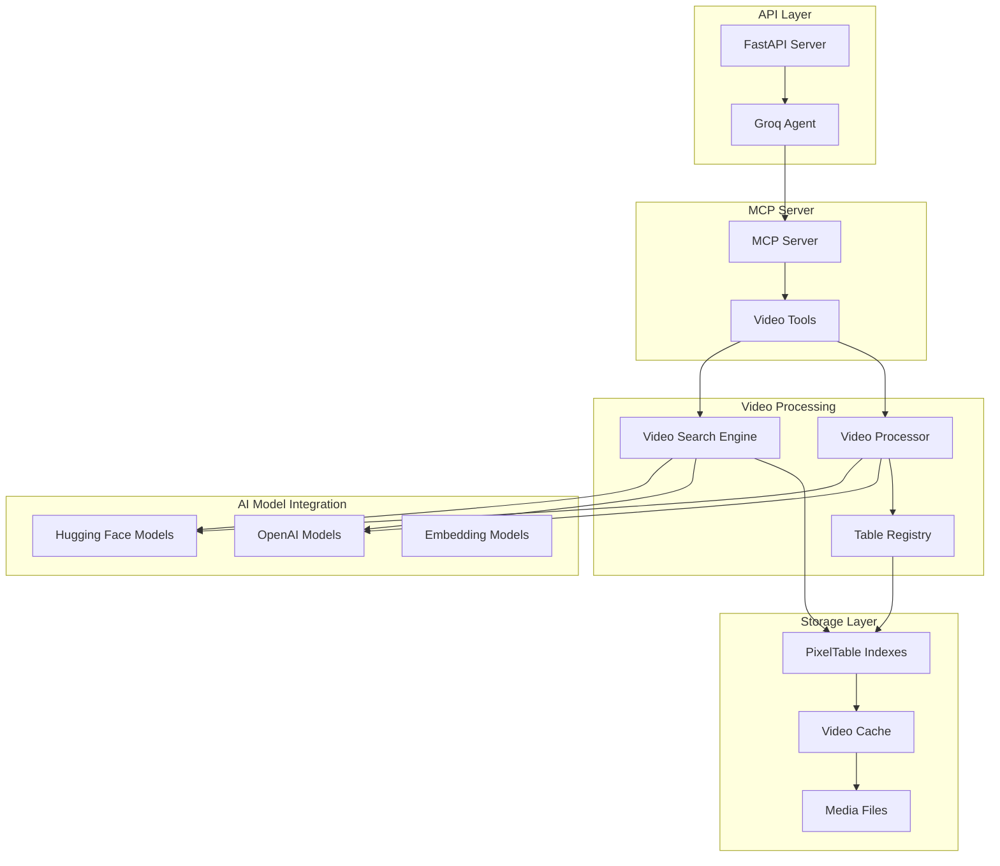
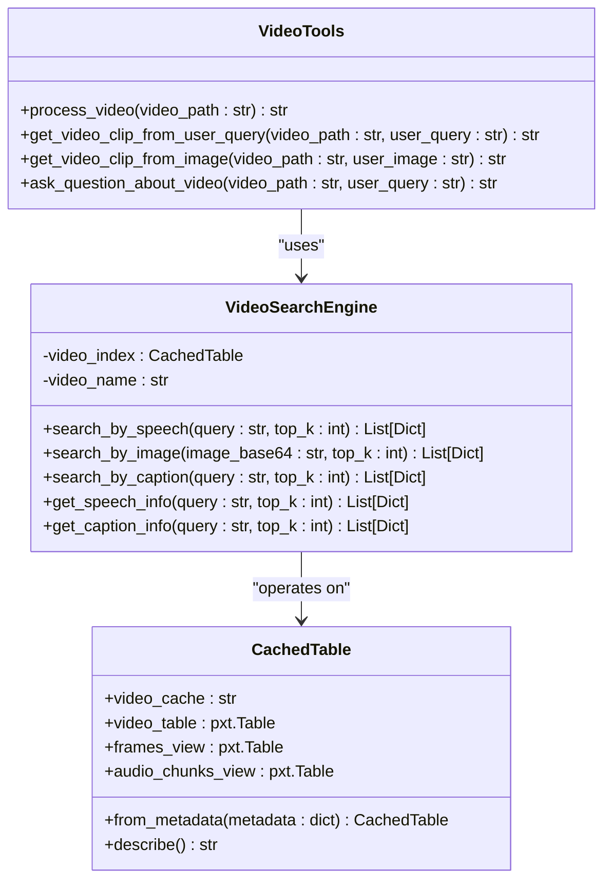
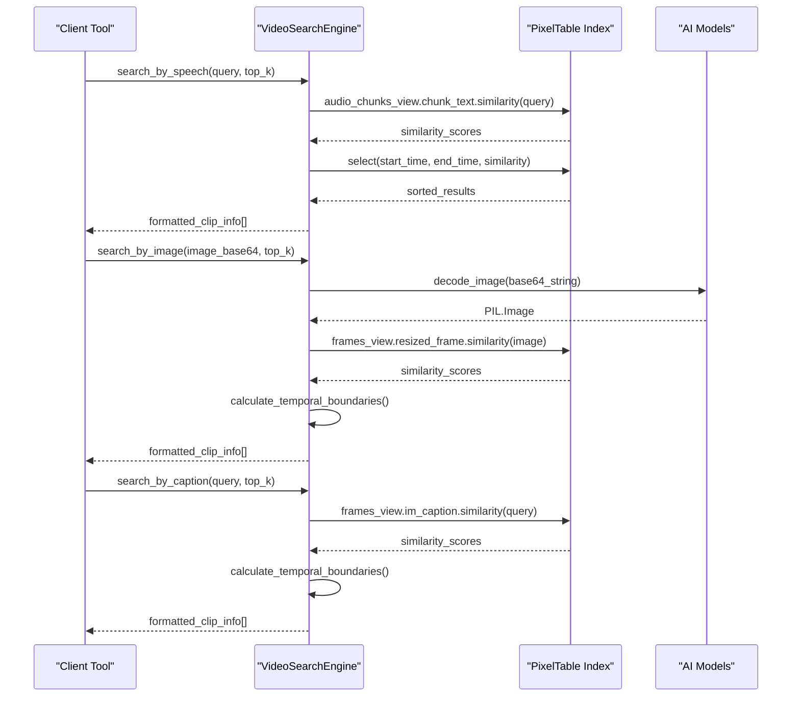
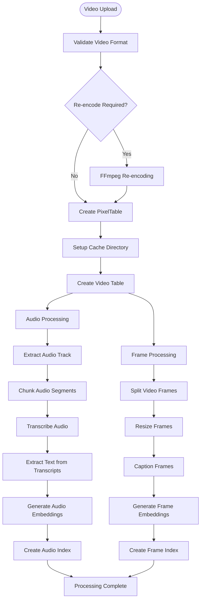
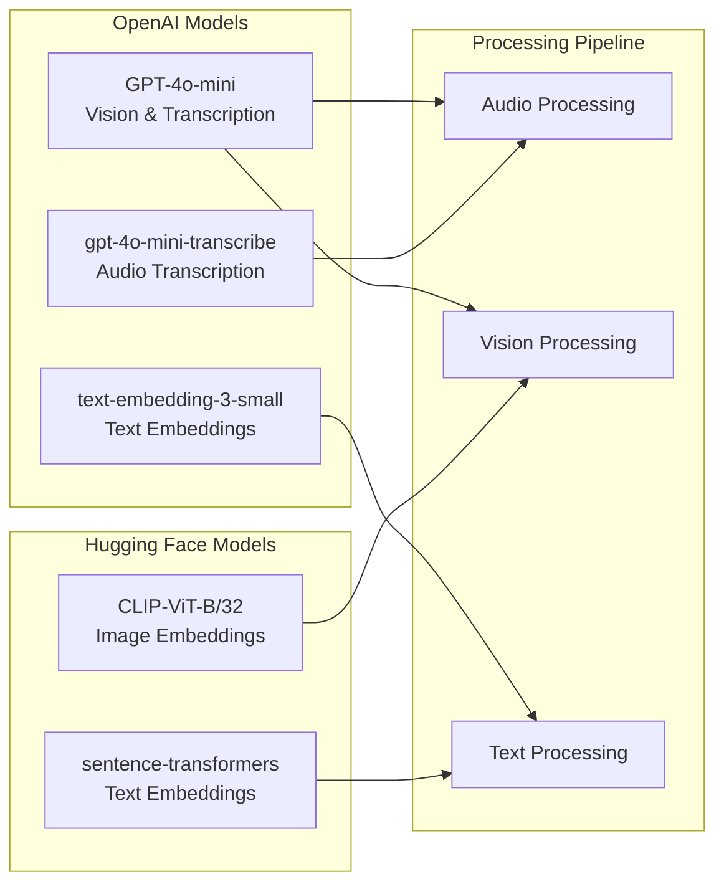
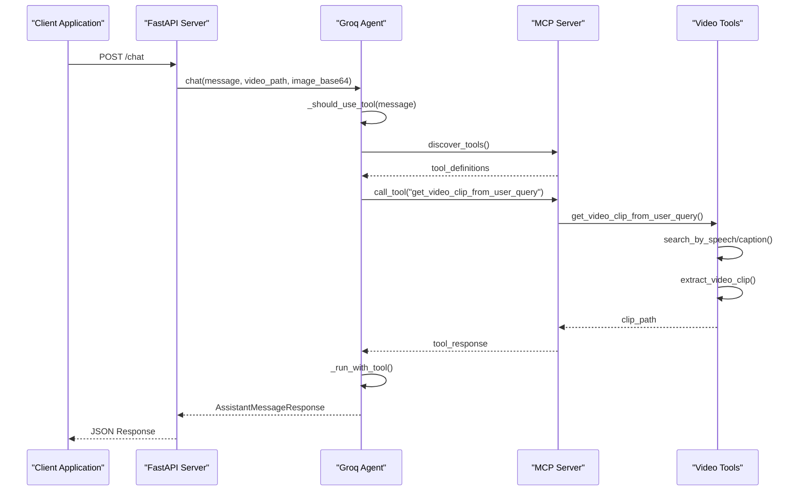
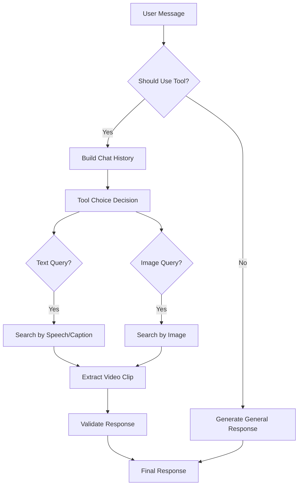
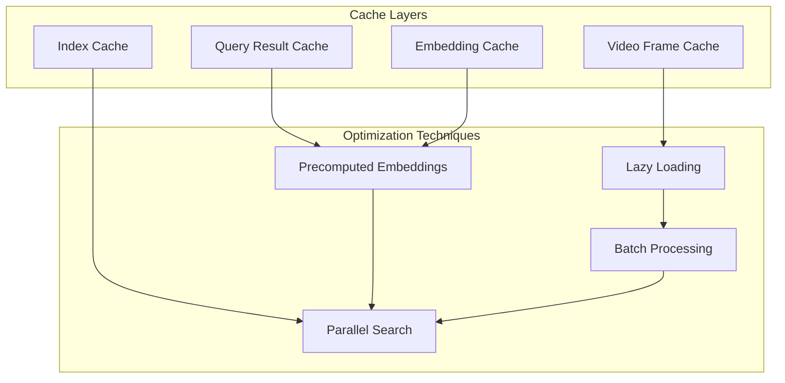
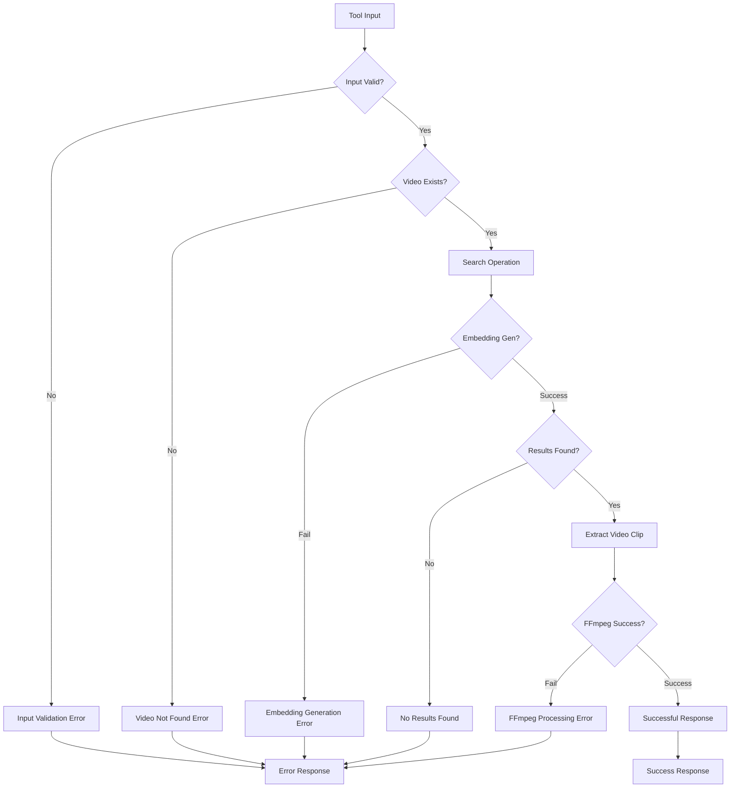

# Multimodal Search Tools

<cite>
**Referenced Files in This Document**
- [tools.py](file://vaas-mcp/src/vaas_mcp/tools.py)
- [video_search_engine.py](file://vaas-mcp/src/vaas_mcp/video/video_search_engine.py)
- [video_processor.py](file://vaas-mcp/src/vaas_mcp/video/ingestion/video_processor.py)
- [tools.py](file://vaas-mcp/src/vaas_mcp/video/ingestion/tools.py)
- [models.py](file://vaas-mcp/src/vaas_mcp/video/ingestion/models.py)
- [registry.py](file://vaas-mcp/src/vaas_mcp/video/ingestion/registry.py)
- [config.py](file://vaas-mcp/src/vaas_mcp/config.py)
- [server.py](file://vaas-mcp/src/vaas_mcp/server.py)
- [groq_agent.py](file://vaas-api/src/vaas_api/agent/groq/groq_agent.py)
- [api.py](file://vaas-api/src/vaas_api/api.py)
- [models.py](file://vaas-api/src/vaas_api/models.py)
</cite>

## Table of Contents
1. [Introduction](#introduction)
2. [System Architecture](#system-architecture)
3. [Core Multimodal Search Tools](#core-multimodal-search-tools)
4. [Video Search Engine](#video-search-engine)
5. [Video Processing Pipeline](#video-processing-pipeline)
6. [Integration with AI Models](#integration-with-ai-models)
7. [API Layer and Tool Exposure](#api-layer-and-tool-exposure)
8. [Agent Integration](#agent-integration)
9. [Performance Considerations](#performance-considerations)
10. [Error Handling and Failure Modes](#error-handling-and-failure-modes)
11. [Usage Examples](#usage-examples)
12. [Troubleshooting Guide](#troubleshooting-guide)

## Introduction

The vaas multimodal search system provides advanced video content retrieval capabilities through three specialized tools that leverage semantic search across multiple modalities: text, images, and audio. These tools enable users to find relevant video clips based on natural language queries, visual content, or specific questions about video content.

The system integrates seamlessly with AI models from OpenAI and Hugging Face to perform cross-modal retrieval, utilizing embeddings for semantic similarity matching across different types of content. The architecture supports real-time video processing and search operations, making it suitable for interactive applications requiring rapid content discovery.

## System Architecture

The multimodal search system follows a layered architecture that separates concerns between video processing, indexing, search operations, and API exposure.



**Diagram sources**
- [api.py](file://vaas-api/src/vaas_api/api.py#L1-L50)
- [server.py](file://vaas-mcp/src/vaas_mcp/server.py#L1-L40)
- [video_processor.py](file://vaas-mcp/src/vaas_mcp/video/ingestion/video_processor.py#L1-L50)

## Core Multimodal Search Tools

The system provides four primary tools for multimodal video search, each designed for specific use cases and query types.

### Tool Overview



**Diagram sources**
- [tools.py](file://vaas-mcp/src/vaas_mcp/tools.py#L1-L105)
- [video_search_engine.py](file://vaas-mcp/src/vaas_mcp/video/video_search_engine.py#L1-L50)
- [models.py](file://vaas-mcp/src/vaas_mcp/video/ingestion/models.py#L1-L50)

### Tool Function Signatures

#### 1. `process_video`
```python
def process_video(video_path: str) -> str:
    """Process a video file and prepare it for searching."""
```

**Purpose**: Initializes video processing pipeline and creates searchable indexes.

**Parameters**:
- `video_path` (str): Path to the video file to process

**Returns**: Success message indicating video processing status

**Processing Steps**:
1. Checks if video index already exists
2. Creates PixelTable indexes for frames and audio chunks
3. Extracts audio tracks and transcribes speech content
4. Generates image captions using vision models
5. Creates embedding indexes for semantic search

#### 2. `get_video_clip_from_user_query`
```python
def get_video_clip_from_user_query(video_path: str, user_query: str) -> str:
    """Get a video clip based on the user query using speech and caption similarity."""
```

**Purpose**: Retrieves video clips based on natural language queries.

**Parameters**:
- `video_path` (str): Path to the video file
- `user_query` (str): Natural language query text

**Returns**: Path to the extracted video clip

**Search Process**:
1. Performs dual search: speech similarity and caption similarity
2. Compares similarity scores from both modalities
3. Selects highest-scoring result
4. Extracts corresponding video segment
5. Returns path to generated clip

#### 3. `get_video_clip_from_image`
```python
def get_video_clip_from_image(video_path: str, user_image: str) -> str:
    """Get a video clip based on similarity to a provided image."""
```

**Purpose**: Finds video segments matching visual content.

**Parameters**:
- `video_path` (str): Path to the video file
- `user_image` (str): Base64-encoded query image

**Returns**: Path to the extracted video clip

**Search Process**:
1. Decodes base64 image to PIL format
2. Performs image similarity search across video frames
3. Calculates temporal boundaries around matched frames
4. Extracts video segment with surrounding context
5. Returns path to generated clip

#### 4. `ask_question_about_video`
```python
def ask_question_about_video(video_path: str, user_query: str) -> str:
    """Get relevant captions from the video based on the user's question."""
```

**Purpose**: Provides textual answers based on video content.

**Parameters**:
- `video_path` (str): Path to the video file
- `user_query` (str): Question to search for relevant captions

**Returns**: Concatenated relevant captions from the video

**Search Process**:
1. Performs caption similarity search
2. Retrieves top-k relevant captions
3. Concatenates results for comprehensive answer
4. Returns formatted caption text

**Section sources**
- [tools.py](file://vaas-mcp/src/vaas_mcp/tools.py#L1-L105)

## Video Search Engine

The `VideoSearchEngine` class serves as the core component for performing multimodal semantic searches across video content.

### Search Methods



**Diagram sources**
- [video_search_engine.py](file://vaas-mcp/src/vaas_mcp/video/video_search_engine.py#L25-L100)

### Search Implementation Details

Each search method utilizes different modalities and embedding approaches:

#### Speech Search
- **Modality**: Audio transcription text
- **Model**: OpenAI Whisper for transcription
- **Embedding**: OpenAI text embeddings
- **Similarity**: Cosine similarity on text embeddings
- **Output**: Clip timestamps with confidence scores

#### Image Search
- **Modality**: Video frame images
- **Model**: Hugging Face CLIP ViT-B/32
- **Preprocessing**: Resize to 1024x768 pixels
- **Similarity**: Cosine similarity on image embeddings
- **Temporal Boundaries**: ±5 seconds around matched frame

#### Caption Search
- **Modality**: Generated image captions
- **Model**: OpenAI GPT-4o-mini for captioning
- **Prompt**: "Describe what is happening in the image"
- **Embedding**: OpenAI text embeddings
- **Similarity**: Cosine similarity on caption embeddings
- **Temporal Boundaries**: ±5 seconds around matched frame

**Section sources**
- [video_search_engine.py](file://vaas-mcp/src/vaas_mcp/video/video_search_engine.py#L1-L168)

## Video Processing Pipeline

The video processing pipeline transforms raw video files into searchable multimedia indexes using a sophisticated multi-stage approach.

### Processing Architecture



**Diagram sources**
- [video_processor.py](file://vaas-mcp/src/vaas_mcp/video/ingestion/video_processor.py#L50-L150)
- [tools.py](file://vaas-mcp/src/vaas_mcp/video/ingestion/tools.py#L1-L50)

### Processing Stages

#### 1. Video Validation and Preparation
- **Format Compatibility**: Ensures video format is compatible with PyAV
- **Re-encoding**: Uses FFmpeg to convert incompatible formats
- **Cache Management**: Creates isolated cache directories per video

#### 2. Audio Processing Pipeline
- **Audio Extraction**: Separates audio track from video container
- **Chunking**: Divides audio into overlapping segments
- **Transcription**: Converts speech to text using OpenAI Whisper
- **Text Extraction**: Parses transcriptions into searchable text chunks
- **Embedding Generation**: Creates semantic embeddings for text similarity

#### 3. Frame Processing Pipeline
- **Frame Splitting**: Extracts frames at configured intervals
- **Resizing**: Standardizes frame dimensions for consistent processing
- **Caption Generation**: Uses vision models to describe visual content
- **Image Embedding**: Creates visual embeddings for similarity matching
- **Index Creation**: Builds spatial-temporal indexes for efficient retrieval

**Section sources**
- [video_processor.py](file://vaas-mcp/src/vaas_mcp/video/ingestion/video_processor.py#L1-L205)
- [tools.py](file://vaas-mcp/src/vaas_mcp/video/ingestion/tools.py#L1-L155)

## Integration with AI Models

The system leverages multiple AI models from OpenAI and Hugging Face to enable cross-modal semantic search capabilities.

### Model Configuration



**Diagram sources**
- [config.py](file://vaas-mcp/src/vaas_mcp/config.py#L15-L35)

### Model Usage Patterns

#### Audio Processing Models
- **Transcription**: `gpt-4o-mini-transcribe` (Whisper tiny model)
- **Text Embeddings**: `text-embedding-3-small`
- **Processing**: Real-time transcription with overlapping chunks

#### Vision Processing Models
- **Image Embeddings**: `openai/clip-vit-base-patch32`
- **Image Captioning**: `gpt-4o-mini`
- **Processing**: Frame-level analysis with caption generation

#### Text Processing Models
- **Caption Embeddings**: `text-embedding-3-small`
- **Cross-Modal Retrieval**: Semantic similarity matching
- **Processing**: Batch embedding generation for large datasets

**Section sources**
- [config.py](file://vaas-mcp/src/vaas_mcp/config.py#L1-L56)

## API Layer and Tool Exposure

The system exposes multimodal search tools through a FastAPI-based API layer that integrates with the MCP (Model Context Protocol) server.

### API Endpoints



**Diagram sources**
- [api.py](file://vaas-api/src/vaas_api/api.py#L80-L120)
- [groq_agent.py](file://vaas-api/src/vaas_api/agent/groq/groq_agent.py#L100-L150)

### Tool Registration

The MCP server registers tools with specific metadata and capabilities:

```python
# Tool registration in MCP server
mcp.add_tool(
    name="get_video_clip_from_user_query",
    description="Use this tool to get a video clip from a video file based on a user query or question.",
    fn=get_video_clip_from_user_query,
    tags={"video", "clip", "query", "question"},
)
```

### Response Models

The API defines structured response models for different tool types:

- **VideoClipResponseModel**: For tools returning video clips
- **GeneralResponseModel**: For text-only responses
- **AssistantMessageResponse**: Unified response wrapper

**Section sources**
- [server.py](file://vaas-mcp/src/vaas_mcp/server.py#L1-L97)
- [api.py](file://vaas-api/src/vaas_api/api.py#L1-L198)
- [models.py](file://vaas-api/src/vaas_api/models.py#L1-L54)

## Agent Integration

The Groq agent orchestrates tool usage based on user input and determines when multimodal search tools should be invoked.

### Tool Selection Logic



**Diagram sources**
- [groq_agent.py](file://vaas-api/src/vaas_api/agent/groq/groq_agent.py#L50-L100)

### Tool Execution Workflow

The agent follows a structured approach for tool execution:

1. **Tool Discovery**: Queries MCP server for available tools
2. **Tool Selection**: Uses LLM-based routing to determine appropriate tool
3. **Parameter Construction**: Builds tool arguments with video context
4. **Execution**: Calls tool with validated parameters
5. **Response Processing**: Handles tool responses and formats for user

### Context Handling

The agent maintains context across tool calls:

- **Memory Management**: Tracks conversation history
- **Video Context**: Preserves video path and metadata
- **Image Context**: Handles base64-encoded images
- **Response Validation**: Ensures tool responses meet expectations

**Section sources**
- [groq_agent.py](file://vaas-api/src/vaas_api/agent/groq/groq_agent.py#L1-L237)

## Performance Considerations

The multimodal search system is designed for real-time performance with several optimization strategies.

### Caching Strategies



### Performance Optimizations

#### 1. Embedding Precomputation
- **Audio Embeddings**: Pre-computed during video ingestion
- **Frame Embeddings**: Generated once per video
- **Caption Embeddings**: Created during frame processing

#### 2. Index Optimization
- **Spatial Indexing**: Efficient frame-level similarity search
- **Temporal Organization**: Ordered by video position
- **Multi-Index Strategy**: Separate indexes for different modalities

#### 3. Parallel Processing
- **Concurrent Searches**: Simultaneous speech and caption searches
- **Background Processing**: Video ingestion runs asynchronously
- **Pipeline Parallelism**: Overlapping preprocessing and search operations

#### 4. Memory Management
- **Lazy Loading**: Load video data on-demand
- **Cache Eviction**: Intelligent cache management
- **Resource Cleanup**: Automatic cleanup of temporary files

### Scalability Considerations

- **Horizontal Scaling**: Multiple video indices can coexist
- **Resource Isolation**: Each video gets dedicated cache space
- **Memory Limits**: Configurable limits on concurrent operations
- **Disk Space**: Efficient storage format minimizes disk usage

## Error Handling and Failure Modes

The system implements comprehensive error handling across all components to ensure robust operation.

### Common Failure Scenarios



### Error Categories

#### 1. Input Validation Errors
- **Invalid Video Path**: Non-existent or inaccessible video files
- **Malformed Base64**: Invalid image data encoding
- **Empty Queries**: Null or whitespace-only search queries

#### 2. Processing Errors
- **Embedding Generation Failures**: Model API errors or timeouts
- **Index Corruption**: Corrupted PixelTable indexes
- **Memory Exhaustion**: Insufficient RAM for processing large videos

#### 3. Search Errors
- **No Results Found**: Queries that don't match any content
- **Ambiguous Results**: Multiple equally relevant matches
- **Temporal Boundaries**: Clips extending beyond video duration

#### 4. Extraction Errors
- **FFmpeg Failures**: Video extraction process errors
- **Codec Issues**: Unsupported video codecs
- **File Permissions**: Write access problems

### Error Response Formats

The system returns structured error responses:

```python
# Example error response structure
{
    "error": {
        "type": "video_not_found",
        "message": "Video file not found at specified path",
        "details": {
            "video_path": "/path/to/video.mp4",
            "timestamp": "2024-01-01T12:00:00Z"
        }
    }
}
```

**Section sources**
- [tools.py](file://vaas-mcp/src/vaas_mcp/tools.py#L20-L30)
- [video_search_engine.py](file://vaas-mcp/src/vaas_mcp/video/video_search_engine.py#L20-L30)

## Usage Examples

### Text-Based Video Search

```python
# Example 1: Finding a specific scene by description
video_path = "/videos/sports_match.mp4"
user_query = "a player scoring a goal in the final minute"

# Tool call payload
payload = {
    "video_path": video_path,
    "user_query": user_query
}

# Expected response: path to extracted video clip
# Response format: str (file path)
```

### Image-Based Video Search

```python
# Example 2: Finding scenes matching visual content
video_path = "/videos/movie_scene.mp4"
with open("target_image.jpg", "rb") as image_file:
    image_data = base64.b64encode(image_file.read()).decode('utf-8')

# Tool call payload
payload = {
    "video_path": video_path,
    "user_image": image_data
}

# Expected response: path to extracted video clip
# Response format: str (file path)
```

### Question-Answering Mode

```python
# Example 3: Asking questions about video content
video_path = "/videos/tutorial.mp4"
user_query = "what are the key points discussed?"

# Tool call payload
payload = {
    "video_path": video_path,
    "user_query": user_query
}

# Expected response: concatenated relevant captions
# Response format: str (text content)
```

### Complete Workflow Example

```python
# Full workflow example
import base64

# Step 1: Process video (once)
process_payload = {"video_path": "/videos/example.mp4"}
process_result = process_video(**process_payload)

# Step 2: Search with text query
text_search_payload = {
    "video_path": "/videos/example.mp4",
    "user_query": "a dog playing fetch"
}
text_clip_path = get_video_clip_from_user_query(**text_search_payload)

# Step 3: Search with image query
with open("dog_image.jpg", "rb") as img_file:
    image_data = base64.b64encode(img_file.read()).decode('utf-8')

image_search_payload = {
    "video_path": "/videos/example.mp4",
    "user_image": image_data
}
image_clip_path = get_video_clip_from_image(**image_search_payload)

# Step 4: Ask questions
question_payload = {
    "video_path": "/videos/example.mp4",
    "user_query": "what happens in this scene?"
}
answer = ask_question_about_video(**question_payload)
```

## Troubleshooting Guide

### Common Issues and Solutions

#### 1. Video Processing Failures

**Symptom**: `ValueError: Video index not found in registry`
**Cause**: Video hasn't been processed yet
**Solution**: Call `process_video()` before using search tools

**Symptom**: `FFmpeg re-encoding failed`
**Cause**: Video format incompatible with PyAV
**Solution**: System automatically handles re-encoding, retry if fails

#### 2. Search Tool Failures

**Symptom**: Empty results from search tools
**Cause**: No content matches query or embeddings corrupted
**Solution**: Verify video processing completed successfully

**Symptom**: High latency in search responses
**Cause**: Large video files or slow model APIs
**Solution**: Optimize video resolution and model selection

#### 3. API Integration Issues

**Symptom**: Tool calls fail with timeout errors
**Cause**: Long-running video processing or network issues
**Solution**: Implement background processing and retry mechanisms

**Symptom**: Base64 encoding errors
**Cause**: Malformed image data or encoding issues
**Solution**: Validate image format and encoding before processing

#### 4. Memory and Resource Issues

**Symptom**: Out of memory errors during processing
**Cause**: Large video files or insufficient system resources
**Solution**: Process videos in smaller batches or increase system memory

**Symptom**: Disk space exhaustion
**Cause**: Accumulated cache files
**Solution**: Implement cache cleanup policies and monitor disk usage

### Debugging Tools

#### 1. Registry Inspection
```python
from vaas_mcp.video.ingestion.registry import get_registry
registry = get_registry()
print(f"Available videos: {list(registry.keys())}")
```

#### 2. Processing Status Check
```python
from vaas_mcp.video.ingestion.models import CachedTable
cached_table = CachedTable.from_metadata(registry["video_name"])
print(cached_table.describe())
```

#### 3. Search Engine Diagnostics
```python
from vaas_mcp.video.video_search_engine import VideoSearchEngine
engine = VideoSearchEngine("video_name")
results = engine.search_by_speech("test query", top_k=5)
print(f"Found {len(results)} results")
```

### Monitoring and Logging

The system provides comprehensive logging through Loguru:

- **Processing Events**: Video ingestion and indexing progress
- **Search Operations**: Query execution and result retrieval
- **Error Tracking**: Detailed error messages and stack traces
- **Performance Metrics**: Timing information for optimization

**Section sources**
- [registry.py](file://vaas-mcp/src/vaas_mcp/video/ingestion/registry.py#L1-L110)
- [video_search_engine.py](file://vaas-mcp/src/vaas_mcp/video/video_search_engine.py#L15-L30)