# Video Ingestion Tools

<cite>
**Referenced Files in This Document**
- [server.py](file://vaas-mcp/src/vaas_mcp/server.py)
- [tools.py](file://vaas-mcp/src/vaas_mcp/tools.py)
- [video_processor.py](file://vaas-mcp/src/vaas_mcp/video/ingestion/video_processor.py)
- [functions.py](file://vaas-mcp/src/vaas_mcp/video/ingestion/functions.py)
- [models.py](file://vaas-mcp/src/vaas_mcp/video/ingestion/models.py)
- [tools.py](file://vaas-mcp/src/vaas_mcp/video/ingestion/tools.py)
- [registry.py](file://vaas-mcp/src/vaas_mcp/video/ingestion/registry.py)
- [config.py](file://vaas-mcp/src/vaas_mcp/config.py)
- [video_search_engine.py](file://vaas-mcp/src/vaas_mcp/video/video_search_engine.py)
- [groq_agent.py](file://vaas-api/src/vaas_api/agent/groq/groq_agent.py)
- [groq_tool.py](file://vaas-api/src/vaas_api/agent/groq/groq_tool.py)
- [video_ingestion_process.ipynb](file://vaas-mcp/notebooks/video_ingestion_process.ipynb)
</cite>

## Table of Contents
1. [Introduction](#introduction)
2. [System Architecture](#system-architecture)
3. [Core Components](#core-components)
4. [Video Processing Pipeline](#video-processing-pipeline)
5. [Tool Registration and Integration](#tool-registration-and-integration)
6. [Real-World Usage Example](#real-world-usage-example)
7. [Error Handling and Validation](#error-handling-and-validation)
8. [Configuration Management](#configuration-management)
9. [Monitoring and Progress Tracking](#monitoring-and-progress-tracking)
10. [Troubleshooting Guide](#troubleshooting-guide)
11. [Conclusion](#conclusion)

## Introduction

The video ingestion tools form the core of vaas-MCP's video processing capabilities, enabling seamless conversion of video files into searchable multimedia databases using PixelTable. These tools integrate sophisticated video processing workflows that extract frames, transcribe audio, generate embeddings, and create multimodal indexes for efficient content retrieval.

The system is designed around the `process_video` function, which serves as the primary entry point for video ingestion workflows. This function orchestrates a comprehensive pipeline that transforms raw video files into structured, searchable multimedia assets through advanced computer vision and natural language processing techniques.

## System Architecture

The video ingestion system follows a modular architecture that separates concerns between tool registration, video processing, and search capabilities. The system integrates multiple technologies including PixelTable for database operations, OpenAI APIs for transcription and embeddings, and FFmpeg for video processing.

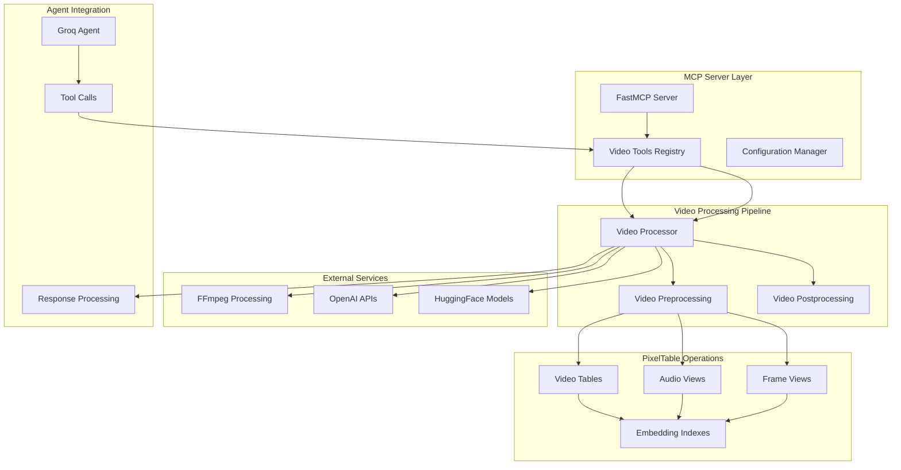

**Diagram sources**
- [server.py](file://vaas-mcp/src/vaas_mcp/server.py#L1-L97)
- [video_processor.py](file://vaas-mcp/src/vaas_mcp/video/ingestion/video_processor.py#L1-L50)

## Core Components

### VideoProcessor Class

The `VideoProcessor` class serves as the central orchestrator for video ingestion workflows. It manages the complete lifecycle of video processing, from initial setup to final indexing.

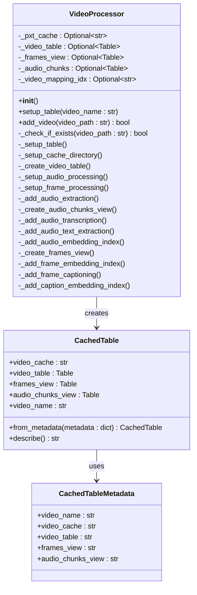

**Diagram sources**
- [video_processor.py](file://vaas-mcp/src/vaas_mcp/video/ingestion/video_processor.py#L20-L50)
- [models.py](file://vaas-mcp/src/vaas_mcp/video/ingestion/models.py#L15-L60)

### Tool Registration System

The MCP server registers video processing tools through the `add_mcp_tools` function, which exposes the `process_video` function as a callable tool.

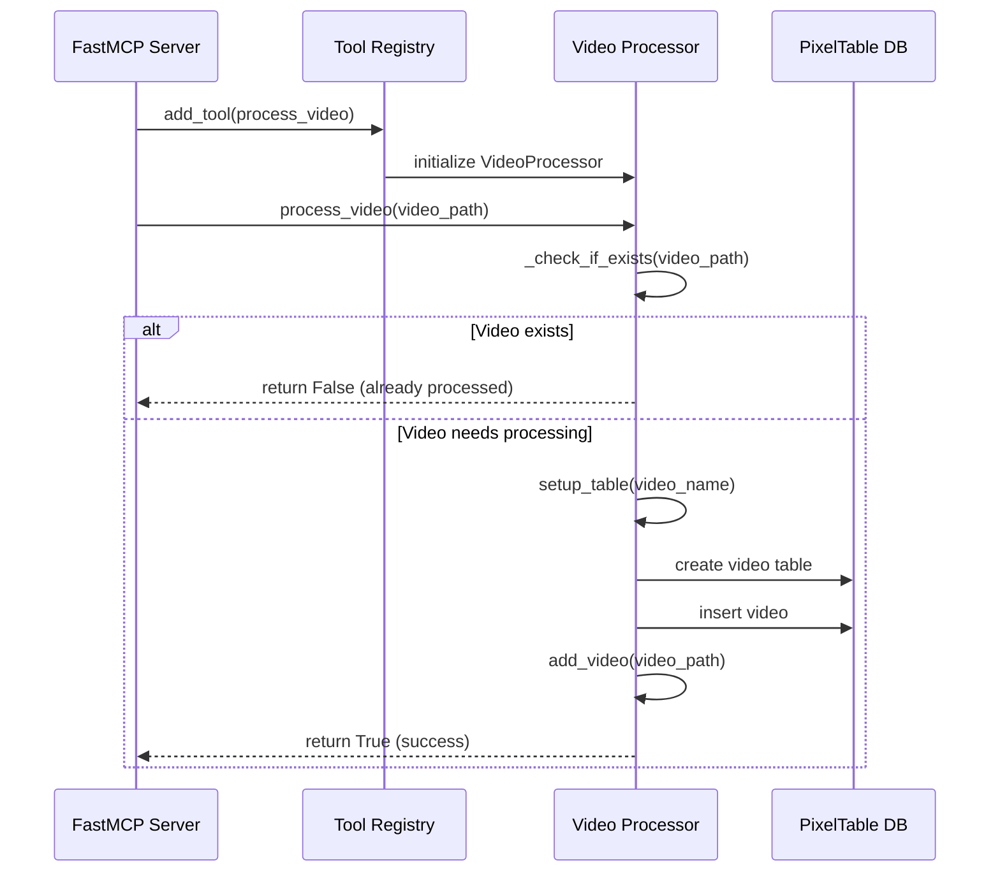

**Diagram sources**
- [server.py](file://vaas-mcp/src/vaas_mcp/server.py#L15-L25)
- [tools.py](file://vaas-mcp/src/vaas_mcp/tools.py#L15-L35)

**Section sources**
- [video_processor.py](file://vaas-mcp/src/vaas_mcp/video/ingestion/video_processor.py#L20-L205)
- [tools.py](file://vaas-mcp/src/vaas_mcp/tools.py#L15-L35)

## Video Processing Pipeline

The video processing pipeline implements a sophisticated multi-stage workflow that transforms raw video files into searchable multimedia databases. Each stage builds upon the previous one, creating comprehensive indexes for various modalities.

### Processing Stages

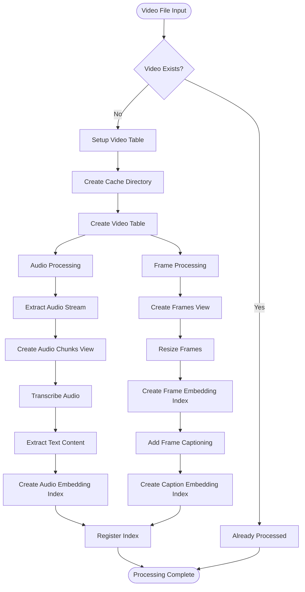

**Diagram sources**
- [video_processor.py](file://vaas-mcp/src/vaas_mcp/video/ingestion/video_processor.py#L40-L205)

### Audio Processing Workflow

The audio processing component handles transcription and embedding creation for speech recognition capabilities:

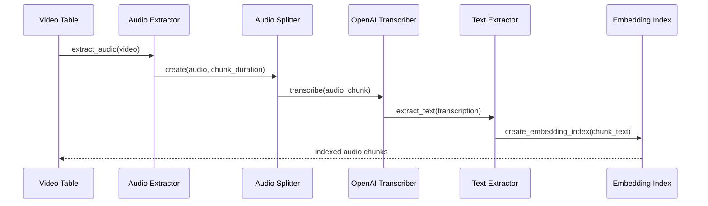

**Diagram sources**
- [video_processor.py](file://vaas-mcp/src/vaas_mcp/video/ingestion/video_processor.py#L90-L120)

### Frame Processing Workflow

The frame processing component handles visual content extraction and caption generation:

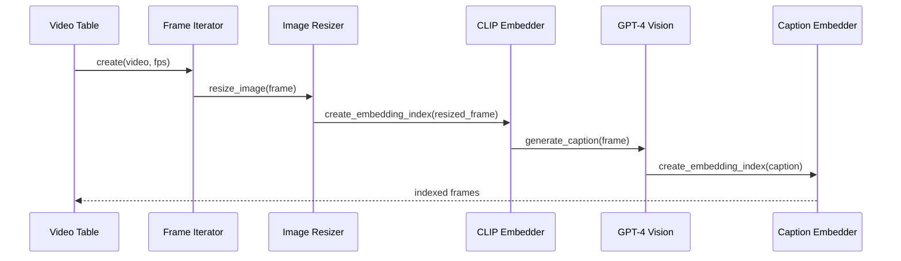

**Diagram sources**
- [video_processor.py](file://vaas-mcp/src/vaas_mcp/video/ingestion/video_processor.py#L120-L160)

**Section sources**
- [video_processor.py](file://vaas-mcp/src/vaas_mcp/video/ingestion/video_processor.py#L40-L205)
- [video_ingestion_process.ipynb](file://vaas-mcp/notebooks/video_ingestion_process.ipynb#L1-L100)

## Tool Registration and Integration

### FastMCP Integration

The video ingestion tools are integrated into the FastMCP framework through the `add_mcp_tools` function in `server.py`. This function registers the `process_video` tool with specific metadata and tags for discovery and categorization.

```python
def add_mcp_tools(mcp: FastMCP):
    mcp.add_tool(
        name="process_video",
        description="Process a video file and prepare it for searching.",
        fn=process_video,
        tags={"video", "process"},
    )
```

### Agent Tool Discovery

The Groq agent discovers and utilizes video processing tools through the MCP protocol. The agent's tool discovery process involves transforming MCP tool definitions into Groq-compatible tool schemas.

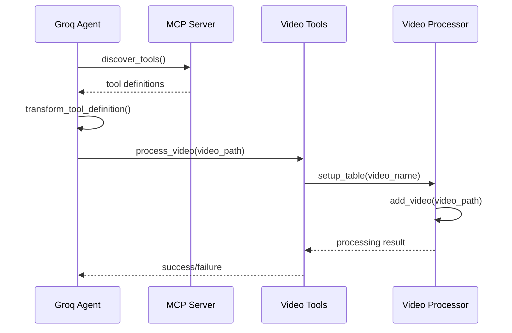

**Diagram sources**
- [groq_agent.py](file://vaas-api/src/vaas_api/agent/groq/groq_agent.py#L40-L60)
- [groq_tool.py](file://vaas-api/src/vaas_api/agent/groq/groq_tool.py#L30-L60)

**Section sources**
- [server.py](file://vaas-mcp/src/vaas_mcp/server.py#L15-L25)
- [groq_agent.py](file://vaas-api/src/vaas_api/agent/groq/groq_agent.py#L40-L80)
- [groq_tool.py](file://vaas-api/src/vaas_api/agent/groq/groq_tool.py#L30-L60)

## Real-World Usage Example

### Tool Call Payload

Here's a real-world example of how the `process_video` tool is called from the Groq agent:

```json
{
  "name": "process_video",
  "arguments": {
    "video_path": "/path/to/video.mp4"
  }
}
```

### Expected Response Structure

The tool returns a boolean indicating processing success:

```json
{
  "success": true,
  "message": "Video processed successfully",
  "video_index": "cache_uuid.table",
  "frames_view": "cache_uuid.table_frames",
  "audio_chunks_view": "cache_uuid.table_audio_chunks"
}
```

### Processing Workflow

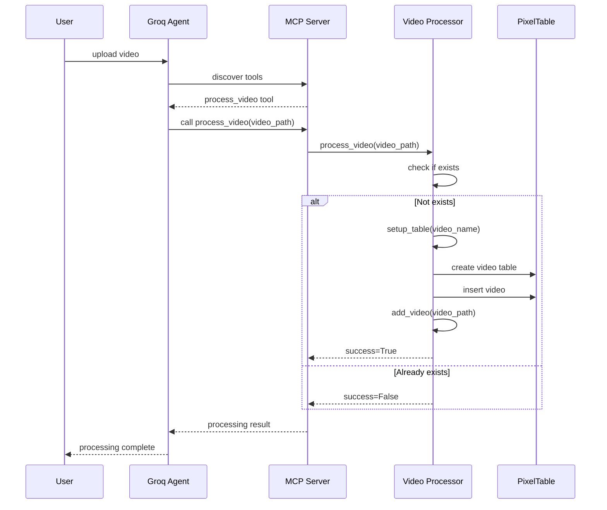

**Diagram sources**
- [groq_agent.py](file://vaas-api/src/vaas_api/agent/groq/groq_agent.py#L80-L120)
- [tools.py](file://vaas-mcp/src/vaas_mcp/tools.py#L15-L35)

**Section sources**
- [groq_agent.py](file://vaas-api/src/vaas_api/agent/groq/groq_agent.py#L80-L120)
- [tools.py](file://vaas-mcp/src/vaas_mcp/tools.py#L15-L35)

## Error Handling and Validation

### Error Conditions

The video ingestion system handles several categories of errors:

1. **Invalid File Paths**: When the specified video path doesn't exist or is inaccessible
2. **Unsupported Formats**: When video files use codecs incompatible with PyAV
3. **Processing Timeouts**: When video processing exceeds configured limits
4. **Resource Constraints**: When system resources are insufficient for processing
5. **API Failures**: When external services (OpenAI, HuggingFace) are unavailable

### Error Handling Mechanisms

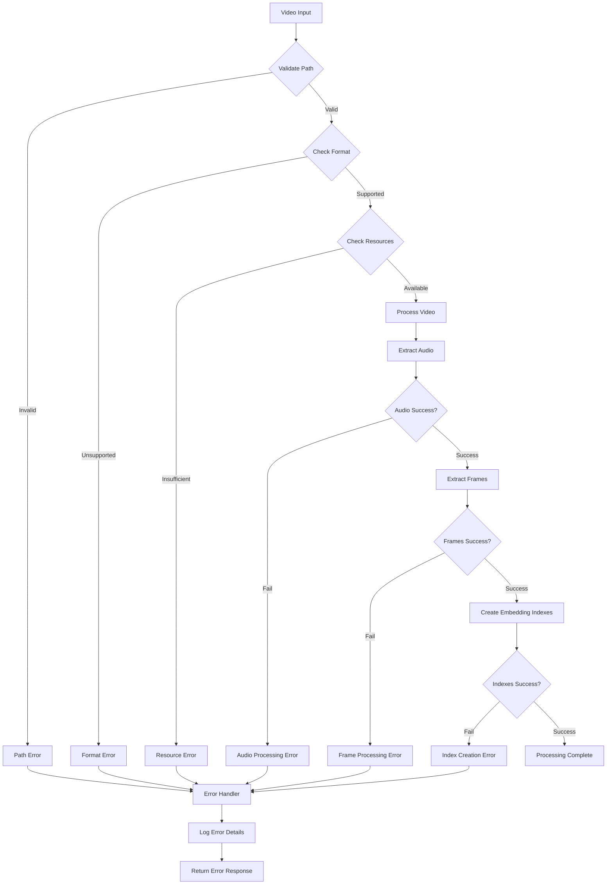

**Diagram sources**
- [video_processor.py](file://vaas-mcp/src/vaas_mcp/video/ingestion/video_processor.py#L180-L205)
- [tools.py](file://vaas-mcp/src/vaas_mcp/tools.py#L20-L35)

### Validation Strategies

The system implements multiple validation layers:

- **Pre-processing Validation**: Verifies video file accessibility and format compatibility
- **Processing Validation**: Monitors resource usage and processing time
- **Post-processing Validation**: Ensures all required indexes are created successfully
- **Integration Validation**: Validates tool registration and agent communication

**Section sources**
- [video_processor.py](file://vaas-mcp/src/vaas_mcp/video/ingestion/video_processor.py#L180-L205)
- [tools.py](file://vaas-mcp/src/vaas_mcp/tools.py#L20-L35)

## Configuration Management

### Configuration Structure

The video ingestion system uses a centralized configuration approach through the `Settings` class in `config.py`:

```python
class Settings(BaseSettings):
    # Video Ingestion Configuration
    SPLIT_FRAMES_COUNT: int = 45
    AUDIO_CHUNK_LENGTH: int = 10
    AUDIO_OVERLAP_SECONDS: int = 1
    AUDIO_MIN_CHUNK_DURATION_SECONDS: int = 1
    
    # Transcription Similarity Search Configuration
    TRANSCRIPT_SIMILARITY_EMBD_MODEL: str = "text-embedding-3-small"
    
    # Image Similarity Search Configuration
    IMAGE_SIMILARITY_EMBD_MODEL: str = "openai/clip-vit-base-patch32"
    
    # Image Captioning Configuration
    IMAGE_RESIZE_WIDTH: int = 1024
    IMAGE_RESIZE_HEIGHT: int = 768
    CAPTION_SIMILARITY_EMBD_MODEL: str = "text-embedding-3-small"
```

### Configuration Categories

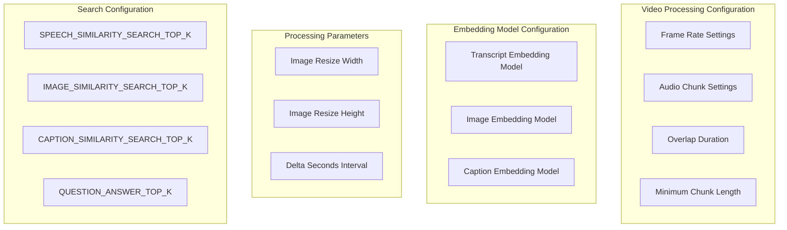

**Diagram sources**
- [config.py](file://vaas-mcp/src/vaas_mcp/config.py#L15-L55)

**Section sources**
- [config.py](file://vaas-mcp/src/vaas_mcp/config.py#L15-L55)

## Monitoring and Progress Tracking

### Registry System

The system maintains a registry of processed videos through the `TableRegistry` mechanism, which tracks video indices and their associated metadata:

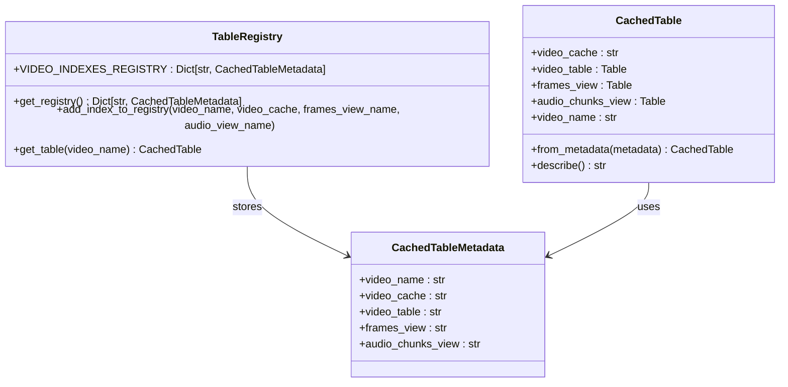

**Diagram sources**
- [registry.py](file://vaas-mcp/src/vaas_mcp/video/ingestion/registry.py#L15-L50)
- [models.py](file://vaas-mcp/src/vaas_mcp/video/ingestion/models.py#L15-L60)

### Progress Indicators

The system provides several mechanisms for monitoring processing progress:

1. **Logging**: Comprehensive logging throughout the processing pipeline
2. **Registry Updates**: Automatic updates to the video registry upon completion
3. **Tool Status**: Boolean return values indicating processing success/failure
4. **Index Availability**: Verification that all required indexes are created

### Validation Methods

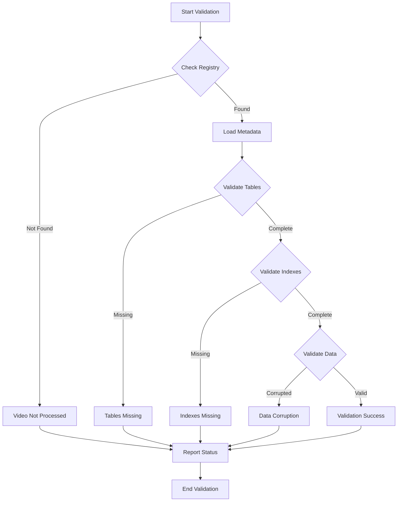

**Diagram sources**
- [registry.py](file://vaas-mcp/src/vaas_mcp/video/ingestion/registry.py#L20-L80)

**Section sources**
- [registry.py](file://vaas-mcp/src/vaas_mcp/video/ingestion/registry.py#L15-L110)

## Troubleshooting Guide

### Common Issues and Solutions

#### 1. Video Format Compatibility

**Problem**: Videos fail to process due to unsupported codecs or container formats.

**Solution**: The system automatically attempts to re-encode videos using FFmpeg:

```python
def re_encode_video(video_path: str) -> str:
    """Re-encode a video file to ensure compatibility with PyAV."""
    try:
        with av.open(video_path) as _:
            logger.info(f"Video {video_path} successfully opened by PyAV.")
            return str(video_path)
    except Exception as e:
        # Attempt re-encoding
        command = ["ffmpeg", "-i", video_path, "-c", "copy", str(reencoded_video_path)]
        # Execute re-encoding...
```

#### 2. Memory and Resource Constraints

**Problem**: Processing large videos consumes excessive memory or processing time.

**Solutions**:
- Adjust `SPLIT_FRAMES_COUNT` in configuration to reduce frame sampling rate
- Configure appropriate `AUDIO_CHUNK_LENGTH` for audio processing
- Monitor system resources during processing

#### 3. API Service Unavailability

**Problem**: OpenAI or HuggingFace services are temporarily unavailable.

**Solutions**:
- Implement retry mechanisms with exponential backoff
- Use local fallback models when available
- Monitor service health and availability

#### 4. Index Creation Failures

**Problem**: Embedding indexes fail to create due to data corruption or model issues.

**Solutions**:
- Verify data integrity in intermediate tables
- Check model availability and licensing
- Implement index recreation capabilities

### Debugging Tools

The system provides several debugging capabilities:

```python
# Enable debug logging
logger.setLevel("DEBUG")

# Check video processing status
cached_table = registry.get_table(video_name)
print(cached_table.describe())

# Validate table structure
print(f"Video table columns: {cached_table.video_table.columns}")
print(f"Frames view columns: {cached_table.frames_view.columns}")
print(f"Audio chunks columns: {cached_table.audio_chunks_view.columns}")
```

**Section sources**
- [video_processor.py](file://vaas-mcp/src/vaas_mcp/video/ingestion/video_processor.py#L180-L205)
- [tools.py](file://vaas-mcp/src/vaas_mcp/tools.py#L20-L35)

## Conclusion

The video ingestion tools represent a sophisticated multimedia processing system that seamlessly transforms raw video content into searchable, multimodal databases. Through the integration of PixelTable, advanced AI models, and robust error handling, the system provides reliable and scalable video processing capabilities.

Key strengths of the system include:

- **Modular Architecture**: Clean separation of concerns enables easy maintenance and extension
- **Robust Error Handling**: Comprehensive error detection and recovery mechanisms
- **Flexible Configuration**: Extensive configuration options for customization
- **Agent Integration**: Seamless integration with AI agents through MCP protocol
- **Performance Optimization**: Efficient processing pipelines with configurable parameters

The system's design facilitates future enhancements such as support for additional video formats, integration with new AI models, and expanded search capabilities. The comprehensive documentation and troubleshooting guide ensure that developers and operators can effectively deploy and maintain the video ingestion infrastructure.