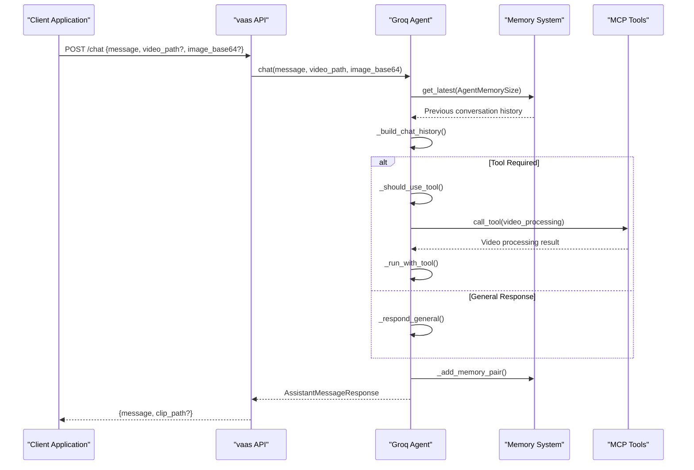
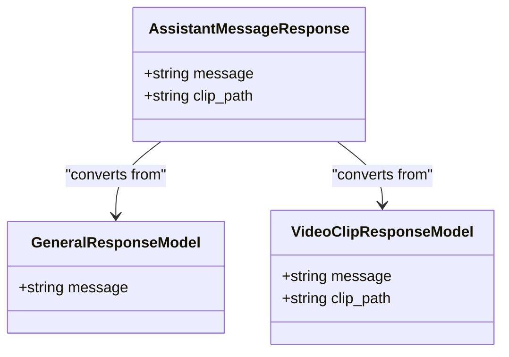
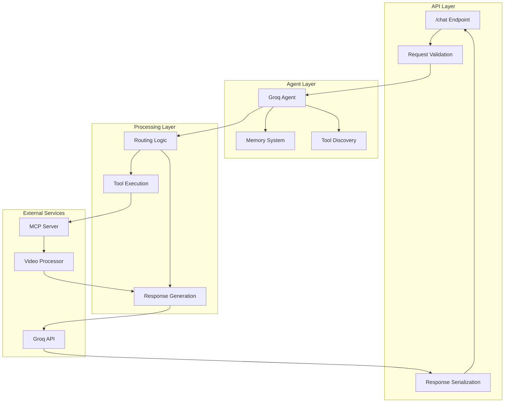
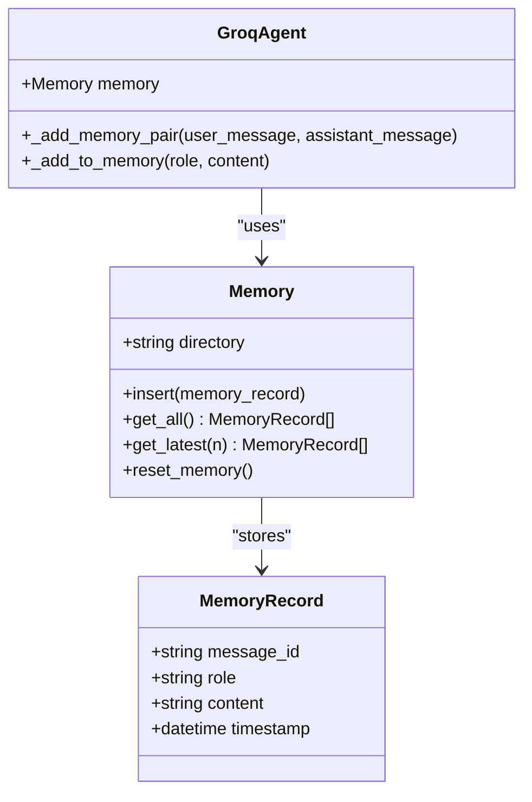
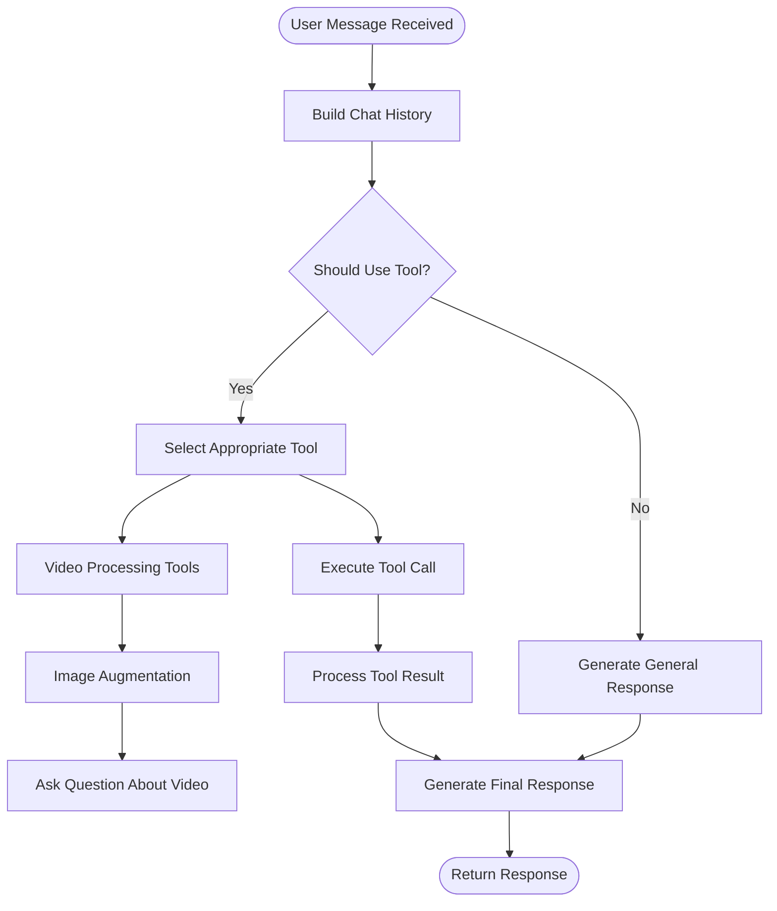

# Chat Interaction API

<cite>
**Referenced Files in This Document**
- [api.py](file://vaas-api/src/vaas_api/api.py)
- [models.py](file://vaas-api/src/vaas_api/models.py)
- [groq_agent.py](file://vaas-api/src/vaas_api/agent/groq/groq_agent.py)
- [base_agent.py](file://vaas-api/src/vaas_api/agent/base_agent.py)
- [memory.py](file://vaas-api/src/vaas_api/agent/memory.py)
- [config.py](file://vaas-api/src/vaas_api/config.py)
- [tools.py](file://vaas-api/src/vaas_api/tools.py)
- [video_ingestion_tools.py](file://vaas-mcp/src/vaas_mcp/video/ingestion/tools.py)
</cite>

## Table of Contents
1. [Introduction](#introduction)
2. [Endpoint Overview](#endpoint-overview)
3. [Request Schema](#request-schema)
4. [Response Schema](#response-schema)
5. [Architecture](#architecture)
6. [Integration with Agent Memory](#integration-with-agent-memory)
7. [Tool Usage and Video Processing](#tool-usage-and-video-processing)
8. [Curl Examples](#curl-examples)
9. [Common Issues and Solutions](#common-issues-and-solutions)
10. [Client Implementation Tips](#client-implementation-tips)
11. [Performance Considerations](#performance-considerations)
12. [Troubleshooting Guide](#troubleshooting-guide)

## Introduction

The `/chat` endpoint serves as the primary interface for multimodal queries in the vaas API system. This endpoint enables users to interact with the AI assistant through text messages, augmented with optional video paths and image data. The system integrates seamlessly with the Groq agent to provide intelligent responses, including text answers and video clip references when appropriate.

The chat endpoint supports both text-only queries and multimodal interactions involving images and videos, making it a versatile interface for various types of user inputs. The system automatically routes requests to either general response models or specialized video processing tools based on the content and context of the query.

## Endpoint Overview

### HTTP Method and URL
- **Method**: `POST`
- **URL**: `/chat`
- **Content-Type**: `application/json`

### Purpose
The `/chat` endpoint acts as the central hub for all user interactions with the AI assistant. It processes user messages and optionally incorporates video paths and image data to provide contextually rich responses.



**Diagram sources**
- [api.py](file://vaas-api/src/vaas_api/api.py#L115-L132)
- [groq_agent.py](file://vaas-api/src/vaas_api/agent/groq/groq_agent.py#L210-L235)

## Request Schema

### UserMessageRequest Model

The request payload follows the `UserMessageRequest` schema, which supports multimodal inputs:

```python
class UserMessageRequest(BaseModel):
    message: str
    video_path: str | None = None
    image_base64: str | None = None
```

#### Field Descriptions

| Field | Type | Required | Description |
|-------|------|----------|-------------|
| `message` | `string` | Yes | The user's query or message text |
| `video_path` | `string \| null` | No | Path to a video file for context-aware responses |
| `image_base64` | `string \| null` | No | Base64-encoded image data for visual queries |

#### Multimodal Input Support

The endpoint supports three interaction modes:

1. **Text-Only Queries**: Only `message` field provided
2. **Image-Augmented Queries**: `message` + `image_base64` fields
3. **Video-Aware Queries**: `message` + `video_path` fields

**Section sources**
- [models.py](file://vaas-api/src/vaas_api/models.py#L15-L20)

## Response Schema

### AssistantMessageResponse Model

The endpoint returns structured responses through the `AssistantMessageResponse` schema:

```python
class AssistantMessageResponse(BaseModel):
    message: str
    clip_path: str | None = None
```

#### Response Fields

| Field | Type | Description |
|-------|------|-------------|
| `message` | `string` | The AI assistant's response text |
| `clip_path` | `string \| null` | Path to generated video clip (when applicable) |

#### Response Types

The response format varies based on the nature of the query:

1. **Standard Text Response**: Contains only the `message` field
2. **Video Clip Response**: Includes both `message` and `clip_path` fields
3. **Error Response**: Returns HTTP 500 with error details



**Diagram sources**
- [models.py](file://vaas-api/src/vaas_api/models.py#L21-L26)
- [models.py](file://vaas-api/src/vaas_api/models.py#L35-L40)

**Section sources**
- [models.py](file://vaas-api/src/vaas_api/models.py#L21-L26)

## Architecture

### System Architecture

The chat endpoint integrates multiple components to deliver intelligent responses:



**Diagram sources**
- [api.py](file://vaas-api/src/vaas_api/api.py#L115-L132)
- [groq_agent.py](file://vaas-api/src/vaas_api/agent/groq/groq_agent.py#L30-L50)

### Component Interactions

The chat flow involves several key interactions:

1. **Agent Initialization**: The agent is initialized with memory and tool configurations
2. **Memory Retrieval**: Previous conversation history is fetched from the memory system
3. **Context Building**: User input is combined with conversation history
4. **Routing Decision**: The system determines whether tool usage is required
5. **Response Processing**: Either general response or tool-based response is generated

**Section sources**
- [groq_agent.py](file://vaas-api/src/vaas_api/agent/groq/groq_agent.py#L30-L50)
- [base_agent.py](file://vaas-api/src/vaas_api/agent/base_agent.py#L20-L40)

## Integration with Agent Memory

### Memory System Architecture

The agent maintains conversation context through a sophisticated memory system built on PixelTable:



**Diagram sources**
- [memory.py](file://vaas-api/src/vaas_api/agent/memory.py#L8-L15)
- [groq_agent.py](file://vaas-api/src/vaas_api/agent/groq/groq_agent.py#L197-L210)

### Context Preservation

The memory system ensures context continuity across conversations:

1. **Automatic Memory Management**: New messages are automatically added to memory
2. **Configurable History Size**: Controlled by `AGENT_MEMORY_SIZE` setting (default: 20)
3. **Role-Based Storage**: Messages are stored with their original roles (user/assistant)
4. **Timestamp Tracking**: Each message includes precise timing information

### Memory Operations

```python
# Adding conversation pairs to memory
def _add_memory_pair(self, user_message: str, assistant_message: str) -> None:
    self._add_to_memory("user", user_message)
    self._add_to_memory("assistant", assistant_message)

# Retrieving recent conversation history
history = [{"role": "system", "content": system_prompt}]
history += [{"role": record.role, "content": record.content} for record in self.memory.get_latest(n)]
```

**Section sources**
- [memory.py](file://vaas-api/src/vaas_api/agent/memory.py#L35-L50)
- [groq_agent.py](file://vaas-api/src/vaas_api/agent/groq/groq_agent.py#L197-L210)

## Tool Usage and Video Processing

### Tool Discovery and Selection

The system employs intelligent routing to determine when to use specialized tools:



**Diagram sources**
- [groq_agent.py](file://vaas-api/src/vaas_api/agent/groq/groq_agent.py#L75-L85)
- [groq_agent.py](file://vaas-api/src/vaas_api/agent/groq/groq_agent.py#L136-L170)

### Available Tools

The system discovers and utilizes tools from the MCP server:

1. **Video Processing Tools**: Handle video ingestion, analysis, and clipping
2. **Image Processing Tools**: Manage image augmentation and analysis
3. **Question Answering Tools**: Specialized for video content queries

### Tool Execution Flow

When a tool is required, the system follows this execution pattern:

```python
# Tool selection and execution
tool_required = video_path and self._should_use_tool(message)
if tool_required:
    response = await self._run_with_tool(message, video_path, image_base64)
else:
    response = self._respond_general(message)
```

**Section sources**
- [groq_agent.py](file://vaas-api/src/vaas_api/agent/groq/groq_agent.py#L210-L235)
- [base_agent.py](file://vaas-api/src/vaas_api/agent/base_agent.py#L60-L90)

## Curl Examples

### Basic Text-Only Query

```bash
curl -X POST "http://localhost:8080/chat" \
  -H "Content-Type: application/json" \
  -d '{
    "message": "What are the key moments in this game?"
  }'
```

### Image-Augmented Query

```bash
curl -X POST "http://localhost:8080/chat" \
  -H "Content-Type: application/json" \
  -d '{
    "message": "Describe what's happening in this image",
    "image_base64": "iVBORw0KGgoAAAANSUhEUgAAAAEAAAABCAYAAAAfFcSJAAAADUlEQVR42mP8/5+hHgAHggJ/PchI7wAAAABJRU5ErkJggg=="
  }'
```

### Video-Aware Query

```bash
curl -X POST "http://localhost:8080/chat" \
  -H "Content-Type: application/json" \
  -d '{
    "message": "Find highlights from this soccer match",
    "video_path": "/shared_media/soccer_match.mp4"
  }'
```

### Combined Multimodal Query

```bash
curl -X POST "http://localhost:8080/chat" \
  -H "Content-Type: application/json" \
  -d '{
    "message": "Compare the player positions in this play",
    "video_path": "/shared_media/game_replay.mp4",
    "image_base64": "base64_encoded_image_data_here"
  }'
```

## Common Issues and Solutions

### Malformed Image Data

**Issue**: Invalid base64 encoding causing processing failures
**Solution**: Validate image data before sending requests

```python
import base64

def validate_base64(data):
    try:
        base64.b64decode(data)
        return True
    except:
        return False
```

### Unsupported Query Types

**Issue**: Queries that don't fit the expected patterns
**Solution**: The system automatically falls back to general responses

### Response Latency

**Issue**: Slow responses due to video processing
**Solution**: Implement asynchronous processing and task queuing

```python
# Background task for video processing
@app.post("/process-video")
async def process_video(request: ProcessVideoRequest, bg_tasks: BackgroundTasks):
    task_id = str(uuid4())
    bg_tasks.add_task(background_process_video, request.video_path, task_id)
    return ProcessVideoResponse(task_id=task_id)
```

### Memory Overflow

**Issue**: Excessive conversation history affecting performance
**Solution**: Monitor memory size and implement cleanup strategies

**Section sources**
- [api.py](file://vaas-api/src/vaas_api/api.py#L100-L130)
- [config.py](file://vaas-api/src/vaas_api/config.py#L25-L27)

## Client Implementation Tips

### Streaming Responses

For real-time user experience, implement streaming responses:

```javascript
// Example streaming implementation
async function streamChat(messages) {
    const response = await fetch('/chat', {
        method: 'POST',
        headers: { 'Content-Type': 'application/json' },
        body: JSON.stringify({ message: messages })
    });
    
    const reader = response.body.getReader();
    const decoder = new TextDecoder();
    
    while (true) {
        const { done, value } = await reader.read();
        if (done) break;
        
        const chunk = decoder.decode(value);
        // Process streaming chunks
        console.log(chunk);
    }
}
```

### Handling Different Response Types

```javascript
// Response type detection
async function handleChatResponse(responseData) {
    if (responseData.clip_path) {
        // Handle video clip response
        return {
            type: 'video',
            message: responseData.message,
            clipUrl: `/media/${responseData.clip_path}`
        };
    } else {
        // Handle standard text response
        return {
            type: 'text',
            message: responseData.message
        };
    }
}
```

### Error Handling

```javascript
// Comprehensive error handling
async function sendChatMessage(message) {
    try {
        const response = await fetch('/chat', {
            method: 'POST',
            headers: { 'Content-Type': 'application/json' },
            body: JSON.stringify(message)
        });
        
        if (!response.ok) {
            throw new Error(`HTTP ${response.status}: ${await response.text()}`);
        }
        
        return await response.json();
    } catch (error) {
        console.error('Chat error:', error);
        return { error: error.message };
    }
}
```

### Memory Management

```javascript
// Memory reset functionality
async function resetConversation() {
    try {
        const response = await fetch('/reset-memory', {
            method: 'POST'
        });
        return response.ok;
    } catch (error) {
        console.error('Memory reset failed:', error);
        return false;
    }
}
```

## Performance Considerations

### Response Time Optimization

1. **Async Processing**: All heavy operations use async/await patterns
2. **Background Tasks**: Long-running operations are queued and processed asynchronously
3. **Connection Pooling**: Efficient database connections for memory operations
4. **Caching**: Frequently accessed data is cached appropriately

### Memory Management

The system implements several memory optimization strategies:

- **Configurable History Size**: Control conversation length with `AGENT_MEMORY_SIZE`
- **Automatic Cleanup**: Periodic memory cleanup and optimization
- **Efficient Storage**: Using PixelTable for optimal storage and retrieval

### Scalability Features

- **Horizontal Scaling**: Stateless design allows multiple API instances
- **Load Balancing**: Built-in support for distributed deployments
- **Resource Monitoring**: Comprehensive logging and monitoring capabilities

**Section sources**
- [config.py](file://vaas-api/src/vaas_api/config.py#L25-L27)
- [memory.py](file://vaas-api/src/vaas_api/agent/memory.py#L35-L50)

## Troubleshooting Guide

### Common Error Scenarios

#### 1. Agent Setup Failures

**Symptoms**: HTTP 500 errors on first request
**Causes**: 
- MCP server connection issues
- Missing API keys
- Configuration problems

**Solutions**:
```python
# Check agent setup
try:
    await agent.setup()
except Exception as e:
    logger.error(f"Agent setup failed: {e}")
    # Implement retry logic or fallback
```

#### 2. Video Processing Errors

**Symptoms**: Videos fail to process or return empty results
**Causes**:
- Corrupted video files
- Unsupported video formats
- Insufficient disk space

**Solutions**:
- Verify video file integrity
- Convert videos to supported formats
- Monitor disk space availability

#### 3. Memory Corruption

**Symptoms**: Inconsistent responses or memory-related errors
**Causes**:
- Concurrent access issues
- Database corruption
- Memory leaks

**Solutions**:
- Implement proper locking mechanisms
- Regular memory health checks
- Automatic memory reset on errors

### Debugging Tools

#### Enable Debug Logging

```python
import loguru

logger.add("chat_debug.log", level="DEBUG")
```

#### Monitor Task Status

```bash
curl -X GET "http://localhost:8080/task-status/{task_id}"
```

#### Memory Inspection

```python
# Check memory state
memory_records = agent.memory.get_all()
print(f"Total messages: {len(memory_records)}")
```

### Performance Monitoring

Key metrics to monitor:

- **Response Time**: Average and percentile response times
- **Error Rate**: Percentage of failed requests
- **Memory Usage**: Conversation history size and growth rate
- **Tool Execution Time**: Duration of video processing tasks

**Section sources**
- [api.py](file://vaas-api/src/vaas_api/api.py#L115-L132)
- [groq_agent.py](file://vaas-api/src/vaas_api/agent/groq/groq_agent.py#L104-L136)