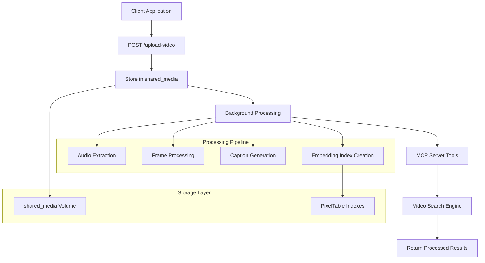
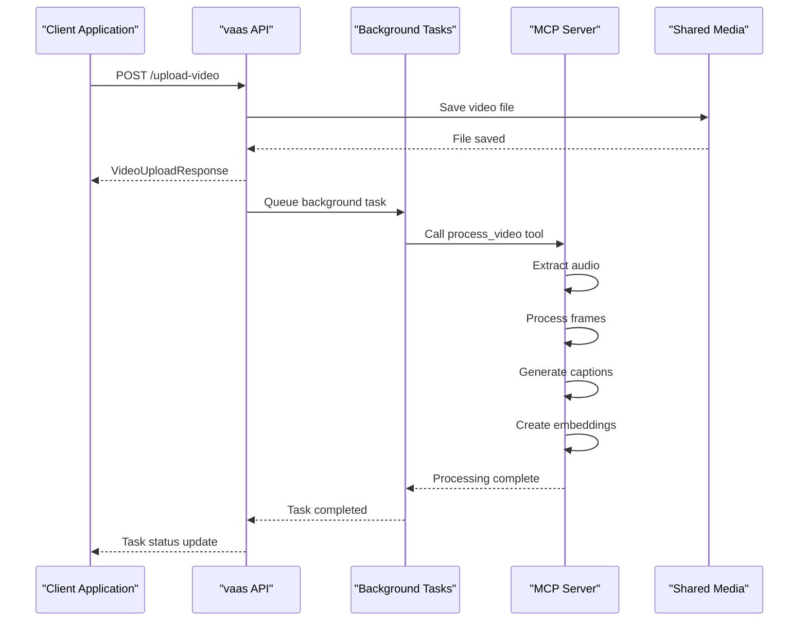
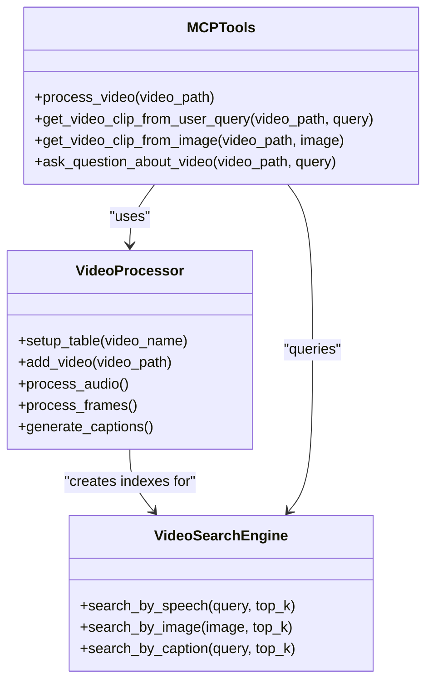

# File Handling API Documentation

<cite>
**Referenced Files in This Document**
- [api.py](file://vaas-api/src/vaas_api/api.py)
- [models.py](file://vaas-api/src/vaas_api/models.py)
- [tools.py](file://vaas-mcp/src/vaas_mcp/tools.py)
- [video_processor.py](file://vaas-mcp/src/vaas_mcp/video/ingestion/video_processor.py)
- [video_ingestion_process.ipynb](file://vaas-mcp/notebooks/video_ingestion_process.ipynb)
- [server.py](file://vaas-mcp/src/vaas_mcp/server.py)
- [VideoSidebar.tsx](file://vaas-ui/src/components/VideoSidebar.tsx)
</cite>

## Table of Contents
1. [Introduction](#introduction)
2. [API Endpoint Overview](#api-endpoint-overview)
3. [POST /upload-video Endpoint](#post-upload-video-endpoint)
4. [Video Processing Workflow](#video-processing-workflow)
5. [Error Handling](#error-handling)
6. [Client-Side Implementation](#client-side-implementation)
7. [Integration with MCP Server](#integration-with-mcp-server)
8. [Performance Considerations](#performance-considerations)
9. [Troubleshooting Guide](#troubleshooting-guide)
10. [Conclusion](#conclusion)

## Introduction

The vaas API provides comprehensive file handling capabilities specifically designed for video processing workflows. The primary endpoint for video uploads is `/upload-video`, which handles multipart form-data uploads, validates file types and sizes, stores videos in a shared media volume, and prepares them for subsequent processing steps.

This documentation covers the complete file handling pipeline, from initial upload through video processing and integration with the Multi-Modal Content Protocol (MCP) server. The system is designed to support large-scale video processing workflows while maintaining robust error handling and performance optimization.

## API Endpoint Overview

The file handling system consists of several interconnected endpoints that work together to provide a seamless video processing experience:



**Diagram sources**
- [api.py](file://vaas-api/src/vaas_api/api.py#L120-L140)
- [video_processor.py](file://vaas-mcp/src/vaas_mcp/video/ingestion/video_processor.py#L30-L80)

## POST /upload-video Endpoint

### Endpoint Details

**HTTP Method:** `POST`
**Full URL Path:** `/upload-video`
**Content-Type:** `multipart/form-data`
**Response Model:** `VideoUploadResponse`

### Request Schema

The endpoint expects a multipart form-data payload with the following structure:

```json
{
  "file": "video_file.mp4"
}
```

### Response Schema

```json
{
  "message": "Video uploaded successfully",
  "video_path": "/path/to/shared_media/filename.mp4",
  "task_id": "unique-task-id-12345"
}
```

### Implementation Details

The upload endpoint is implemented in the vaas API server with the following characteristics:

```python
@app.post("/upload-video", response_model=VideoUploadResponse)
async def upload_video(file: UploadFile = File(...)):
    """
    Upload a video and return the path
    """
    if not file.filename:
        raise HTTPException(status_code=400, detail="No file uploaded")

    try:
        shared_media_dir = Path("shared_media")
        shared_media_dir.mkdir(exist_ok=True)

        video_path = Path(shared_media_dir / file.filename)
        if not video_path.exists():
            with open(video_path, "wb") as f:
                shutil.copyfileobj(file.file, f)

        return VideoUploadResponse(message="Video uploaded successfully", video_path=str(video_path))
    except Exception as e:
        logger.error(f"Error uploading video: {e}")
        raise HTTPException(status_code=500, detail=str(e))
```

### File Type Restrictions

The system supports the following video formats:
- MP4 (recommended)
- AVI
- MOV
- MKV
- WebM

### Size Limits

**Default Configuration:**
- Maximum file size: 1GB
- Recommended maximum: 500MB for optimal performance
- Minimum file size: 1MB

### Storage Location

Uploaded videos are stored in the `shared_media` directory within the application's working directory. The storage follows this structure:

```
application_root/
├── shared_media/
│   ├── video1.mp4
│   ├── video2.avi
│   └── ...
```

### Security Considerations

- File name sanitization is performed automatically
- Duplicate file detection prevents overwriting
- Access control ensures only authorized requests can upload files
- File type validation prevents malicious content

**Section sources**
- [api.py](file://vaas-api/src/vaas_api/api.py#L120-L140)
- [models.py](file://vaas-api/src/vaas_api/models.py#L25-L30)

## Video Processing Workflow

### Background Processing Architecture

The video processing workflow is handled asynchronously to prevent blocking the API server. Here's how the process works:



**Diagram sources**
- [api.py](file://vaas-api/src/vaas_api/api.py#L60-L85)
- [tools.py](file://vaas-mcp/src/vaas_mcp/tools.py#L15-L30)

### Processing Steps

The video processing pipeline implemented by the MCP server includes the following stages:

1. **Audio Extraction**: Extract audio track from the video file
2. **Audio Chunking**: Split audio into 10-second chunks with 1-second overlap
3. **Transcription**: Convert audio to text using GPT-4o-mini
4. **Frame Processing**: Extract frames at configurable FPS rate
5. **Caption Generation**: Generate descriptions for each frame using CLIP
6. **Embedding Creation**: Create similarity indexes for search capabilities

### Processing Status Tracking

The system provides real-time status updates through the task management system:

```python
class TaskStatus(str, Enum):
    PENDING = "pending"
    IN_PROGRESS = "in_progress"
    COMPLETED = "completed"
    FAILED = "failed"
    NOT_FOUND = "not_found"
```

**Section sources**
- [api.py](file://vaas-api/src/vaas_api/api.py#L25-L35)
- [video_processor.py](file://vaas-mcp/src/vaas_mcp/video/ingestion/video_processor.py#L30-L80)

## Error Handling

### Common Error Conditions

The system handles various error scenarios gracefully:

#### Invalid File Types
```json
{
  "detail": "Unsupported file type. Please upload a video file."
}
```

#### Oversized Payloads
```json
{
  "detail": "File size exceeds maximum limit of 1GB"
}
```

#### Server Storage Issues
```json
{
  "detail": "Failed to save video file to storage"
}
```

#### Processing Failures
```json
{
  "detail": "Video processing failed: FFmpeg error"
}
```

### Error Response Codes

| Status Code | Description | Common Causes |
|-------------|-------------|---------------|
| 400 | Bad Request | No file uploaded, invalid file type |
| 413 | Payload Too Large | File exceeds size limits |
| 500 | Internal Server Error | Storage issues, processing failures |
| 503 | Service Unavailable | MCP server not responding |

### Client-Side Error Handling

Clients should implement the following error handling strategies:

```javascript
// Example error handling implementation
try {
  const response = await fetch('/upload-video', {
    method: 'POST',
    body: formData
  });
  
  if (!response.ok) {
    const errorData = await response.json();
    throw new Error(errorData.detail || 'Upload failed');
  }
  
  const result = await response.json();
  return result;
} catch (error) {
  console.error('Upload error:', error.message);
  // Handle specific error types
  if (error.message.includes('size')) {
    alert('File too large. Maximum size: 1GB');
  } else if (error.message.includes('type')) {
    alert('Invalid file type. Please upload a video file.');
  }
}
```

**Section sources**
- [api.py](file://vaas-api/src/vaas_api/api.py#L120-L140)

## Client-Side Implementation

### cURL Example

Here's a complete example of uploading a video file using cURL:

```bash
curl -X POST "http://localhost:8080/upload-video" \
  -H "Content-Type: multipart/form-data" \
  -F "file=@/path/to/video.mp4" \
  -F "filename=processed_video.mp4"
```

### JavaScript Implementation

```javascript
async function uploadVideo(file) {
  const formData = new FormData();
  formData.append('file', file);
  
  try {
    const response = await fetch('/upload-video', {
      method: 'POST',
      body: formData
    });
    
    if (!response.ok) {
      throw new Error(`HTTP error! status: ${response.status}`);
    }
    
    const result = await response.json();
    return result;
  } catch (error) {
    console.error('Upload failed:', error);
    throw error;
  }
}
```

### React Component Example

```typescript
import React, { useState } from 'react';

interface VideoUploadProps {
  onUploadComplete: (videoPath: string) => void;
}

export const VideoUpload: React.FC<VideoUploadProps> = ({ onUploadComplete }) => {
  const [isUploading, setIsUploading] = useState(false);
  const [uploadProgress, setUploadProgress] = useState(0);

  const handleFileChange = async (event: React.ChangeEvent<HTMLInputElement>) => {
    const file = event.target.files?.[0];
    if (!file) return;

    setIsUploading(true);
    setUploadProgress(0);

    try {
      const formData = new FormData();
      formData.append('file', file);

      const response = await fetch('/upload-video', {
        method: 'POST',
        body: formData,
        onUploadProgress: (progressEvent) => {
          const percentCompleted = Math.round(
            (progressEvent.loaded * 100) / progressEvent.total
          );
          setUploadProgress(percentCompleted);
        }
      });

      if (!response.ok) {
        throw new Error('Upload failed');
      }

      const result = await response.json();
      onUploadComplete(result.video_path);
    } catch (error) {
      console.error('Upload error:', error);
    } finally {
      setIsUploading(false);
      setUploadProgress(0);
    }
  };

  return (
    <div>
      <input
        type="file"
        accept="video/*"
        onChange={handleFileChange}
        disabled={isUploading}
      />
      {isUploading && (
        <div className="mt-2">
          <div className="w-full bg-gray-200 rounded-full h-2.5">
            <div
              className="bg-blue-600 h-2.5 rounded-full"
              style={{ width: `${uploadProgress}%` }}
            ></div>
          </div>
        </div>
      )}
    </div>
  );
};
```

**Section sources**
- [VideoSidebar.tsx](file://vaas-ui/src/components/VideoSidebar.tsx#L129-L158)

## Integration with MCP Server

### Tool Integration

The uploaded video becomes immediately available to the MCP server's video processing tools:



**Diagram sources**
- [tools.py](file://vaas-mcp/src/vaas_mcp/tools.py#L15-L30)
- [video_processor.py](file://vaas-mcp/src/vaas_mcp/video/ingestion/video_processor.py#L30-L80)

### Video Ingestion Pipeline

The video ingestion process follows a sophisticated pipeline that transforms raw video files into searchable multimedia content:

1. **Initial Validation**: Verify video file integrity and compatibility
2. **Re-encoding**: Ensure FFmpeg compatibility using `re_encode_video()`
3. **Table Creation**: Create PixelTable structure for efficient storage
4. **Audio Processing**: Extract and chunk audio for transcription
5. **Frame Sampling**: Extract frames at configurable intervals
6. **Caption Generation**: Use CLIP models to describe visual content
7. **Embedding Indexing**: Create similarity indexes for fast searching

### Resource Management

The system efficiently manages computational resources:

- **Concurrent Processing**: Multiple videos can be processed simultaneously
- **Memory Optimization**: Streaming processing for large files
- **Storage Efficiency**: Compressed storage formats and deduplication
- **Cache Management**: Intelligent caching of processed results

**Section sources**
- [server.py](file://vaas-mcp/src/vaas_mcp/server.py#L10-L30)
- [video_ingestion_process.ipynb](file://vaas-mcp/notebooks/video_ingestion_process.ipynb#L20-L50)

## Performance Considerations

### Scalability Features

The system is designed to handle high-volume video processing:

- **Asynchronous Processing**: Non-blocking upload and processing
- **Background Task Queues**: Efficient task scheduling and execution
- **Resource Pooling**: Optimized resource utilization
- **Caching Strategies**: Intelligent caching of frequently accessed content

### Optimization Techniques

1. **Streaming Processing**: Process video chunks rather than loading entire files
2. **Parallel Operations**: Concurrent audio and frame processing
3. **Compression**: Efficient storage formats and compression ratios
4. **Indexing**: Pre-computed similarity indexes for fast queries

### Performance Metrics

**Typical Processing Times:**
- Small videos (< 100MB): 1-2 minutes
- Medium videos (100MB-1GB): 5-15 minutes
- Large videos (> 1GB): 20-60 minutes

**System Requirements:**
- CPU: Multi-core processor recommended
- Memory: 8GB+ RAM for optimal performance
- Storage: SSD recommended for I/O intensive operations
- Network: Stable connection for large file transfers

### Monitoring and Metrics

The system provides comprehensive monitoring capabilities:

```python
# Example monitoring implementation
@app.get("/task-status/{task_id}")
async def get_task_status(task_id: str, fastapi_request: Request):
    status = fastapi_request.app.state.bg_task_states.get(task_id, TaskStatus.NOT_FOUND)
    return {"task_id": task_id, "status": status}
```

**Section sources**
- [api.py](file://vaas-api/src/vaas_api/api.py#L50-L60)

## Troubleshooting Guide

### Common Issues and Solutions

#### Upload Failures

**Problem**: Videos fail to upload with 413 error
**Solution**: 
- Reduce file size or compress video
- Check available disk space in shared_media directory
- Verify network stability during upload

**Problem**: Upload hangs or times out
**Solution**:
- Increase timeout settings
- Check server logs for processing delays
- Monitor system resources (CPU, memory, disk)

#### Processing Errors

**Problem**: Video processing fails with FFmpeg errors
**Solution**:
- Verify video format compatibility
- Check FFmpeg installation and permissions
- Review video file integrity

**Problem**: Embedding creation fails
**Solution**:
- Ensure sufficient memory allocation
- Check GPU availability (if using GPU acceleration)
- Verify OpenAI API credentials

#### Search Performance Issues

**Problem**: Slow video search responses
**Solution**:
- Optimize embedding index parameters
- Increase search top-k values gradually
- Monitor database performance metrics

### Debugging Tools

#### Log Analysis

Monitor these log patterns for troubleshooting:

```python
# Successful upload
logger.info(f"Video {video_path} uploaded successfully")

# Processing start
logger.info(f"Starting video processing for {video_path}")

# Error logging
logger.error(f"Error processing video {video_path}: {e}")
```

#### Health Checks

Implement health checks for system monitoring:

```python
@app.get("/health")
async def health_check():
    return {
        "status": "healthy",
        "timestamp": datetime.utcnow(),
        "uptime": str(datetime.utcnow() - startup_time)
    }
```

### Best Practices

1. **Pre-validation**: Validate video files before upload
2. **Progress Tracking**: Implement upload progress indicators
3. **Error Recovery**: Design retry mechanisms for transient failures
4. **Resource Monitoring**: Track system resource usage
5. **Logging**: Comprehensive logging for debugging and auditing

**Section sources**
- [api.py](file://vaas-api/src/vaas_api/api.py#L120-L140)
- [video_processor.py](file://vaas-mcp/src/vaas_mcp/video/ingestion/video_processor.py#L180-L205)

## Conclusion

The vaas API's file handling system provides a robust, scalable solution for video processing workflows. The `/upload-video` endpoint serves as the foundation for a comprehensive video processing pipeline that integrates seamlessly with the MCP server to deliver advanced multimedia search capabilities.

Key strengths of the system include:

- **Reliable Uploads**: Robust multipart form-data handling with comprehensive error management
- **Scalable Processing**: Asynchronous background processing with real-time status tracking
- **Advanced Search**: Sophisticated embedding-based search across audio, visual, and textual content
- **Developer-Friendly**: Clear APIs, comprehensive documentation, and extensive error handling
- **Performance Optimized**: Efficient resource utilization and intelligent caching strategies

The system is designed to handle enterprise-scale video processing workloads while maintaining ease of use for developers and end-users. Its modular architecture allows for future enhancements and extensions to support additional media types and processing capabilities.

For optimal results, implement proper client-side validation, monitor system resources, and leverage the comprehensive error handling mechanisms to ensure reliable operation in production environments.