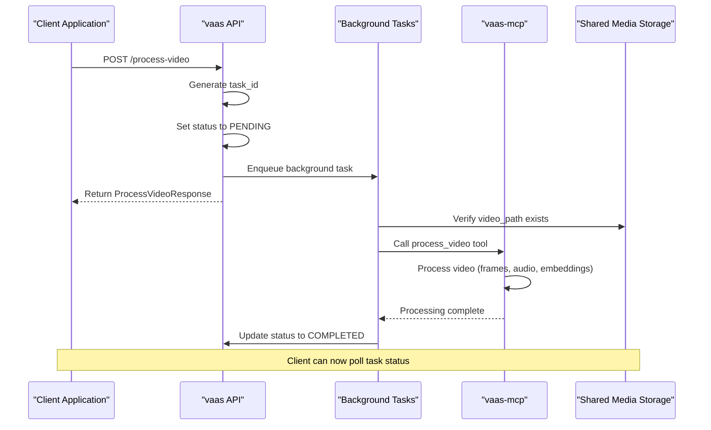
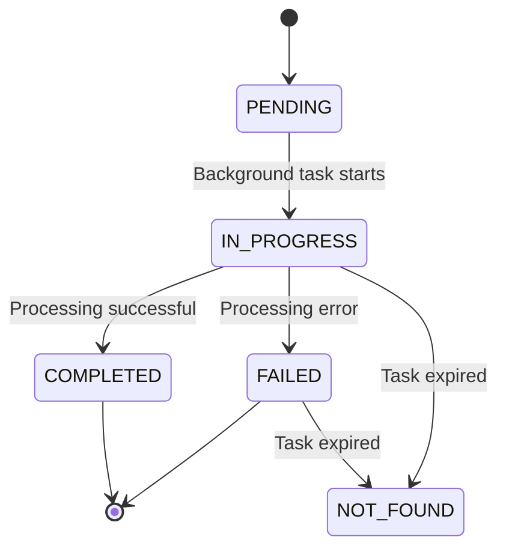
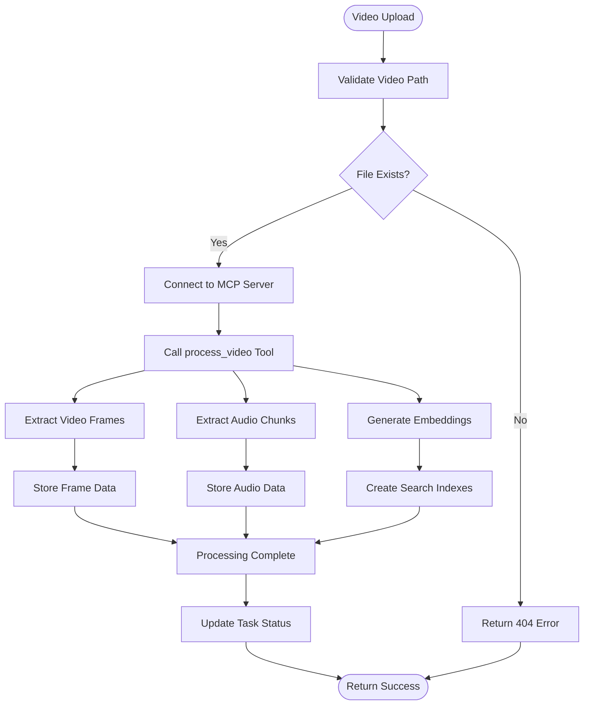
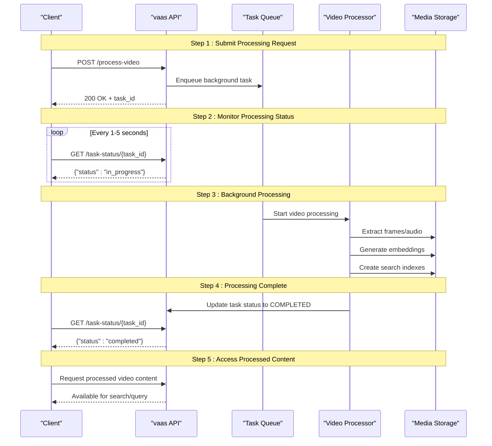
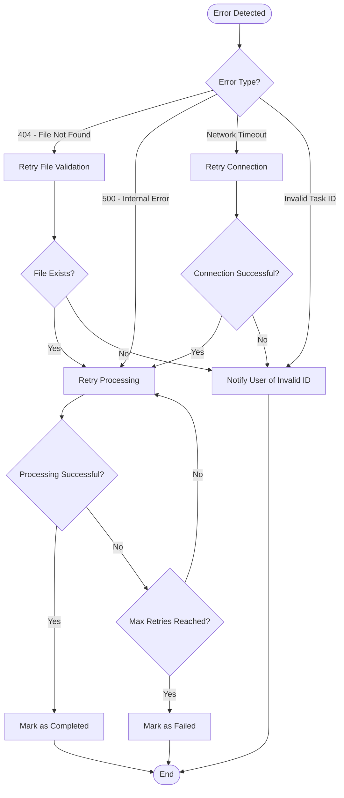

# Processing Control API

<cite>
**Referenced Files in This Document**
- [api.py](file://vaas-api/src/vaas_api/api.py)
- [models.py](file://vaas-api/src/vaas_api/models.py)
- [config.py](file://vaas-api/src/vaas_api/config.py)
- [video_processor.py](file://vaas-mcp/src/vaas_mcp/video/ingestion/video_processor.py)
- [tools.py](file://vaas-mcp/src/vaas_mcp/tools.py)
- [config.py](file://vaas-mcp/src/vaas_mcp/config.py)
- [VideoSidebar.tsx](file://vaas-ui/src/components/VideoSidebar.tsx)
</cite>

## Table of Contents
1. [Introduction](#introduction)
2. [API Endpoint Overview](#api-endpoint-overview)
3. [Request Schema](#request-schema)
4. [Response Schema](#response-schema)
5. [Asynchronous Processing Model](#asynchronous-processing-model)
6. [Task Tracking Mechanism](#task-tracking-mechanism)
7. [Integration with vaas-mcp](#integration-with-vaas-mcp)
8. [Processing Lifecycle](#processing-lifecycle)
9. [Error Handling](#error-handling)
10. [Best Practices](#best-practices)
11. [Implementation Examples](#implementation-examples)

## Introduction

The Processing Control API provides a robust interface for handling video processing requests in the vaas multimedia system. This API enables asynchronous video processing through the `/process-video` endpoint, allowing clients to submit video files for processing while receiving immediate feedback about the processing status.

The system is designed to handle long-running video processing operations efficiently, leveraging background tasks and a sophisticated status tracking mechanism. This ensures optimal user experience even when processing large video files that may take several minutes to complete.

## API Endpoint Overview

### POST /process-video

The primary endpoint for initiating video processing operations. This endpoint accepts video processing requests and returns immediately with a task ID, enabling asynchronous processing workflows.

**HTTP Method:** POST  
**URL Path:** `/process-video`  
**Content-Type:** `application/json`

### GET /task-status/{task_id}

A companion endpoint for monitoring the status of processing tasks. Clients can poll this endpoint to track the progress of their video processing jobs.

**HTTP Method:** GET  
**URL Path:** `/task-status/{task_id}`  
**Content-Type:** `application/json`

## Request Schema

The `ProcessVideoRequest` model defines the structure of video processing requests:

```python
class ProcessVideoRequest(BaseModel):
    video_path: str
```

### Request Fields

| Field | Type | Required | Description |
|-------|------|----------|-------------|
| `video_path` | string | Yes | The filesystem path to the video file that needs processing |

### Validation Rules

- **video_path**: Must be a valid filesystem path pointing to an existing video file
- The path must be accessible by the API server
- File extension must be supported (typically MP4, AVI, MOV, etc.)

**Section sources**
- [models.py](file://vaas-api/src/vaas_api/models.py#L4-L7)

## Response Schema

The `ProcessVideoResponse` model defines the structure of responses from the processing endpoint:

```python
class ProcessVideoResponse(BaseModel):
    message: str
    task_id: str
```

### Response Fields

| Field | Type | Description |
|-------|------|-------------|
| `message` | string | Confirmation message indicating the task has been enqueued |
| `task_id` | string | Unique identifier for tracking the processing task |

### Response Example

```json
{
  "message": "Task enqueued for processing",
  "task_id": "550e8400-e29b-41d4-a716-446655440000"
}
```

**Section sources**
- [models.py](file://vaas-api/src/vaas_api/models.py#L9-L12)

## Asynchronous Processing Model

The Processing Control API implements a sophisticated asynchronous processing model designed to handle long-running video operations without blocking client requests.

### Architecture Overview



**Diagram sources**
- [api.py](file://vaas-api/src/vaas_api/api.py#L75-L105)
- [tools.py](file://vaas-mcp/src/vaas_mcp/tools.py#L15-L30)

### Background Task Management

The API utilizes FastAPI's background task system to handle video processing asynchronously:

```python
async def background_process_video(video_path: str, task_id: str):
    bg_task_states[task_id] = TaskStatus.IN_PROGRESS
    
    if not Path(video_path).exists():
        bg_task_states[task_id] = TaskStatus.FAILED
        raise HTTPException(status_code=404, detail="Video file not found")
    
    try:
        mcp_client = Client(settings.MCP_SERVER)
        async with mcp_client:
            _ = await mcp_client.call_tool("process_video", {"video_path": request.video_path})
    except Exception as e:
        logger.error(f"Error processing video {video_path}: {e}")
        bg_task_states[task_id] = TaskStatus.FAILED
        raise HTTPException(status_code=500, detail=str(e))
    bg_task_states[task_id] = TaskStatus.COMPLETED
```

**Section sources**
- [api.py](file://vaas-api/src/vaas_api/api.py#L85-L105)

## Task Tracking Mechanism

The system implements a distributed task tracking mechanism using FastAPI's application state to maintain processing status across concurrent requests.

### Task Status States



### Status Tracking Implementation

The task status system maintains state in the FastAPI application state:

```python
class TaskStatus(str, Enum):
    PENDING = "pending"
    IN_PROGRESS = "in_progress"
    COMPLETED = "completed"
    FAILED = "failed"
    NOT_FOUND = "not_found"

@app.get("/task-status/{task_id}")
async def get_task_status(task_id: str, fastapi_request: Request):
    status = fastapi_request.app.state.bg_task_states.get(task_id, TaskStatus.NOT_FOUND)
    return {"task_id": task_id, "status": status}
```

### Status Polling Pattern

Clients implement status polling using exponential backoff to minimize API calls while maintaining responsiveness:

```javascript
// Example JavaScript implementation
async function pollTaskStatus(taskId, maxRetries = 10) {
    let retries = 0;
    const interval = 1000; // Start with 1 second
    
    while (retries < maxRetries) {
        try {
            const response = await fetch(`/task-status/${taskId}`);
            const status = await response.json();
            
            if (status.status === 'completed') {
                return status;
            } else if (status.status === 'failed') {
                throw new Error('Processing failed');
            }
            
            // Wait with exponential backoff
            await new Promise(resolve => setTimeout(resolve, interval * Math.pow(2, retries)));
            retries++;
        } catch (error) {
            console.error('Error polling task status:', error);
            break;
        }
    }
    
    throw new Error('Max retries exceeded');
}
```

**Section sources**
- [api.py](file://vaas-api/src/vaas_api/api.py#L30-L37)
- [api.py](file://vaas-api/src/vaas_api/api.py#L70-L74)

## Integration with vaas-mcp

The Processing Control API integrates seamlessly with the vaas-mcp service through the MCP (Model Context Protocol) client interface, enabling sophisticated video processing capabilities.

### Video Processing Pipeline



**Diagram sources**
- [tools.py](file://vaas-mcp/src/vaas_mcp/tools.py#L15-L30)
- [video_processor.py](file://vaas-mcp/src/vaas_mcp/video/ingestion/video_processor.py#L180-L204)

### Configuration Parameters

The vaas-mcp service uses configurable parameters to optimize video processing:

```python
# Video Ingestion Configuration
SPLIT_FRAMES_COUNT: int = 45  # Number of frames to extract per second
AUDIO_CHUNK_LENGTH: int = 10  # Audio chunk duration in seconds
AUDIO_OVERLAP_SECONDS: int = 1  # Audio chunk overlap for continuity
AUDIO_MIN_CHUNK_DURATION_SECONDS: int = 1  # Minimum audio chunk duration

# Embedding Models
IMAGE_SIMILARITY_EMBD_MODEL: str = "openai/clip-vit-base-patch32"
TRANSCRIPT_SIMILARITY_EMBD_MODEL: str = "text-embedding-3-small"
CAPTION_SIMILARITY_EMBD_MODEL: str = "text-embedding-3-small"
```

### Processing Capabilities

The integrated video processor provides comprehensive multimedia analysis:

- **Frame Extraction**: Automatic frame sampling at configurable intervals
- **Audio Processing**: Audio extraction, chunking, and transcription
- **Image Captioning**: AI-generated descriptions of video frames
- **Multimodal Embeddings**: Vector representations for similarity search
- **Search Indexing**: Efficient indexing for fast content retrieval

**Section sources**
- [config.py](file://vaas-mcp/src/vaas_mcp/config.py#L15-L25)
- [video_processor.py](file://vaas-mcp/src/vaas_mcp/video/ingestion/video_processor.py#L25-L35)

## Processing Lifecycle

Understanding the complete processing lifecycle helps developers implement appropriate client-side logic and handle various processing scenarios effectively.

### Complete Processing Workflow



**Diagram sources**
- [api.py](file://vaas-api/src/vaas_api/api.py#L75-L105)
- [tools.py](file://vaas-mcp/src/vaas_mcp/tools.py#L15-L30)

### Processing Time Estimates

Typical processing times vary based on video characteristics:

| Video Length | Frame Count | Audio Chunks | Processing Time |
|--------------|-------------|--------------|-----------------|
| 1 minute | ~150 frames | ~6 chunks | 30-60 seconds |
| 5 minutes | ~750 frames | ~30 chunks | 2-5 minutes |
| 10 minutes | ~1500 frames | ~60 chunks | 5-10 minutes |
| 30 minutes | ~4500 frames | ~180 chunks | 15-30 minutes |

### Resource Utilization

The processing pipeline optimizes resource utilization through:

- **Parallel Processing**: Frame extraction and audio processing occur concurrently
- **Streaming Operations**: Large video files are processed in chunks to manage memory usage
- **Efficient Storage**: Optimized database schemas for multimedia content storage
- **Caching Strategies**: Intelligent caching of processed results to avoid redundant processing

**Section sources**
- [video_processor.py](file://vaas-mcp/src/vaas_mcp/video/ingestion/video_processor.py#L180-L204)

## Error Handling

The Processing Control API implements comprehensive error handling to manage various failure scenarios gracefully and provide meaningful feedback to clients.

### Common Error Scenarios

#### 1. Missing Video Files (404 Error)

```python
if not Path(video_path).exists():
    bg_task_states[task_id] = TaskStatus.FAILED
    raise HTTPException(status_code=404, detail="Video file not found")
```

**Error Response:**
```json
{
  "detail": "Video file not found"
}
```

#### 2. Internal Processing Errors (500 Error)

```python
try:
    mcp_client = Client(settings.MCP_SERVER)
    async with mcp_client:
        _ = await mcp_client.call_tool("process_video", {"video_path": request.video_path})
except Exception as e:
    logger.error(f"Error processing video {video_path}: {e}")
    bg_task_states[task_id] = TaskStatus.FAILED
    raise HTTPException(status_code=500, detail=str(e))
```

**Error Response:**
```json
{
  "detail": "Internal server error occurred during video processing"
}
```

#### 3. Task Not Found (404 Error)

```python
@app.get("/task-status/{task_id}")
async def get_task_status(task_id: str, fastapi_request: Request):
    status = fastapi_request.app.state.bg_task_states.get(task_id, TaskStatus.NOT_FOUND)
    return {"task_id": task_id, "status": status}
```

**Error Response:**
```json
{
  "task_id": "invalid-task-id",
  "status": "not_found"
}
```

### Error Recovery Strategies



**Diagram sources**
- [api.py](file://vaas-api/src/vaas_api/api.py#L85-L105)

### Client-Side Error Handling

Recommended error handling patterns for client applications:

```javascript
class VideoProcessingClient {
    constructor(apiBaseUrl) {
        this.baseUrl = apiBaseUrl;
    }
    
    async processVideo(videoPath) {
        try {
            const response = await fetch(`${this.baseUrl}/process-video`, {
                method: 'POST',
                headers: { 'Content-Type': 'application/json' },
                body: JSON.stringify({ video_path: videoPath })
            });
            
            if (!response.ok) {
                throw new Error(`Processing request failed: ${response.status}`);
            }
            
            const data = await response.json();
            return data.task_id;
        } catch (error) {
            console.error('Video processing request failed:', error);
            throw error;
        }
    }
    
    async monitorTaskStatus(taskId, options = {}) {
        const {
            maxRetries = 10,
            initialInterval = 1000,
            maxInterval = 10000,
            backoffFactor = 2
        } = options;
        
        let retries = 0;
        let interval = initialInterval;
        
        while (retries < maxRetries) {
            try {
                const response = await fetch(`${this.baseUrl}/task-status/${taskId}`);
                
                if (!response.ok) {
                    if (response.status === 404) {
                        throw new Error('Task not found');
                    }
                    throw new Error(`Status check failed: ${response.status}`);
                }
                
                const status = await response.json();
                
                if (status.status === 'completed') {
                    return status;
                } else if (status.status === 'failed') {
                    throw new Error('Video processing failed');
                }
                
                // Exponential backoff with jitter
                await new Promise(resolve => 
                    setTimeout(resolve, interval + Math.random() * 1000)
                );
                
                interval = Math.min(interval * backoffFactor, maxInterval);
                retries++;
                
            } catch (error) {
                console.error('Error monitoring task status:', error);
                if (retries >= maxRetries) {
                    throw new Error('Max retries exceeded');
                }
                await new Promise(resolve => 
                    setTimeout(resolve, Math.min(interval * backoffFactor, maxInterval))
                );
                retries++;
            }
        }
        
        throw new Error('Processing timeout');
    }
}
```

**Section sources**
- [api.py](file://vaas-api/src/vaas_api/api.py#L85-L105)

## Best Practices

Implementing robust video processing workflows requires adherence to established best practices that ensure reliability, scalability, and optimal user experience.

### Client-Side Implementation Guidelines

#### 1. Implement Proper Retry Logic

```javascript
// Recommended retry configuration
const retryOptions = {
    maxRetries: 10,
    initialInterval: 1000,  // 1 second
    maxInterval: 10000,     // 10 seconds
    backoffFactor: 2,
    exponentialBase: 2,
    jitter: true
};
```

#### 2. Handle Long-Running Operations Gracefully

```javascript
class VideoProcessingManager {
    constructor() {
        this.activeTasks = new Map();
    }
    
    async processWithProgress(videoFile) {
        try {
            // Step 1: Upload video (if needed)
            const uploadResponse = await this.uploadVideo(videoFile);
            
            // Step 2: Initiate processing
            const taskId = await this.initiateProcessing(uploadResponse.video_path);
            
            // Step 3: Monitor progress with UI feedback
            return this.monitorProgress(taskId, uploadResponse.video_path);
        } catch (error) {
            this.handleError(error);
            throw error;
        }
    }
    
    async monitorProgress(taskId, videoPath) {
        const progressCallback = (status) => {
            // Update UI with current status
            this.updateUI({
                taskId,
                videoPath,
                status: status.status,
                progress: this.calculateProgress(status)
            });
        };
        
        return this.pollTaskStatus(taskId, progressCallback);
    }
}
```

#### 3. Implement User Feedback Patterns

```javascript
// UI State Management
const processingStates = {
    IDLE: 'idle',
    UPLOADING: 'uploading',
    PROCESSING: 'processing',
    COMPLETED: 'completed',
    FAILED: 'failed'
};

// Progress tracking
const progressTracker = {
    calculateOverallProgress: (taskStatus) => {
        const baseProgress = {
            uploading: 0,
            validating: 10,
            extracting: 30,
            processing: 70,
            indexing: 90,
            completed: 100
        };
        
        return baseProgress[taskStatus.phase] || 0;
    }
};
```

### Server-Side Configuration Recommendations

#### 1. Optimize Background Task Limits

```python
# Recommended FastAPI configuration
app = FastAPI(
    lifespan=lifespan,
    max_background_tasks=10,  # Limit concurrent background tasks
    background_task_timeout=3600  # 1 hour timeout for long-running tasks
)
```

#### 2. Implement Rate Limiting

```python
# Rate limiting for video processing endpoints
from fastapi_rate_limiter import rate_limit

@app.post("/process-video")
@rate_limit(calls=5, period=3600)  # 5 requests per hour
async def process_video(request: ProcessVideoRequest, ...):
    pass
```

#### 3. Configure Appropriate Timeouts

```python
# Recommended timeout configurations
MCP_PROCESSING_TIMEOUT = 3600  # 1 hour for video processing
TASK_POLLING_INTERVAL = 5      # 5 seconds for status checks
MAX_TASK_AGE = 86400           # 24 hours for task retention
```

### Monitoring and Observability

#### 1. Implement Comprehensive Logging

```python
# Structured logging for processing events
logger = logger.bind(
    task_id=task_id,
    video_path=video_path,
    processing_start=datetime.utcnow()
)

logger.info("Processing task initiated")
logger.warning("Processing task taking longer than expected")
logger.error("Processing task failed", exc_info=True)
logger.info("Processing task completed successfully")
```

#### 2. Metrics Collection

```python
# Key metrics to track
metrics = {
    'processing_requests_total': Counter(),
    'processing_duration_seconds': Histogram(),
    'task_status_changes': Counter(),
    'error_count': Counter()
}
```

**Section sources**
- [api.py](file://vaas-api/src/vaas_api/api.py#L75-L105)
- [VideoSidebar.tsx](file://vaas-ui/src/components/VideoSidebar.tsx#L54-L96)

## Implementation Examples

### Basic cURL Command Example

Here's a complete example of how to use the Processing Control API with cURL:

```bash
#!/bin/bash

# Step 1: Upload a video file (if needed)
echo "Uploading video..."
UPLOAD_RESPONSE=$(curl -s -X POST "http://localhost:8080/upload-video" \
  -F "file=@/path/to/your/video.mp4")

VIDEO_PATH=$(echo $UPLOAD_RESPONSE | jq -r '.video_path')
TASK_ID=$(echo $UPLOAD_RESPONSE | jq -r '.task_id')

echo "Video uploaded successfully"
echo "Video path: $VIDEO_PATH"
echo "Task ID: $TASK_ID"

# Step 2: Process the video
echo "Initiating video processing..."
PROCESS_RESPONSE=$(curl -s -X POST "http://localhost:8080/process-video" \
  -H "Content-Type: application/json" \
  -d "{\"video_path\":\"$VIDEO_PATH\"}")

TASK_ID=$(echo $PROCESS_RESPONSE | jq -r '.task_id')
echo "Processing task created with ID: $TASK_ID"

# Step 3: Monitor task status
echo "Monitoring processing status..."
while true; do
    STATUS_RESPONSE=$(curl -s "http://localhost:8080/task-status/$TASK_ID")
    STATUS=$(echo $STATUS_RESPONSE | jq -r '.status')
    
    echo "Current status: $STATUS"
    
    if [ "$STATUS" = "completed" ]; then
        echo "Video processing completed successfully!"
        break
    elif [ "$STATUS" = "failed" ]; then
        echo "Video processing failed!"
        exit 1
    fi
    
    sleep 5
done
```

### JavaScript/TypeScript Implementation

```typescript
class vaasVideoProcessor {
    private readonly baseUrl: string;
    
    constructor(baseUrl: string = 'http://localhost:8080') {
        this.baseUrl = baseUrl;
    }
    
    async processVideo(file: File): Promise<string> {
        try {
            // Step 1: Upload the video file
            const uploadResponse = await this.uploadVideo(file);
            
            // Step 2: Initiate processing
            const processResponse = await this.initiateProcessing(uploadResponse.video_path);
            
            // Step 3: Monitor progress
            return await this.monitorProgress(processResponse.task_id);
        } catch (error) {
            console.error('Video processing failed:', error);
            throw error;
        }
    }
    
    private async uploadVideo(file: File): Promise<{ video_path: string; task_id: string }> {
        const formData = new FormData();
        formData.append('file', file);
        
        const response = await fetch(`${this.baseUrl}/upload-video`, {
            method: 'POST',
            body: formData
        });
        
        if (!response.ok) {
            throw new Error(`Upload failed: ${response.statusText}`);
        }
        
        return await response.json();
    }
    
    private async initiateProcessing(videoPath: string): Promise<{ task_id: string }> {
        const response = await fetch(`${this.baseUrl}/process-video`, {
            method: 'POST',
            headers: {
                'Content-Type': 'application/json'
            },
            body: JSON.stringify({ video_path: videoPath })
        });
        
        if (!response.ok) {
            throw new Error(`Processing initiation failed: ${response.statusText}`);
        }
        
        return await response.json();
    }
    
    private async monitorProgress(taskId: string): Promise<string> {
        let attempts = 0;
        const maxAttempts = 120; // 10 minutes with 5-second intervals
        
        while (attempts < maxAttempts) {
            try {
                const response = await fetch(`${this.baseUrl}/task-status/${taskId}`);
                
                if (!response.ok) {
                    if (response.status === 404) {
                        throw new Error('Task not found');
                    }
                    throw new Error(`Status check failed: ${response.statusText}`);
                }
                
                const status = await response.json();
                
                if (status.status === 'completed') {
                    return taskId;
                } else if (status.status === 'failed') {
                    throw new Error('Video processing failed');
                }
                
                // Wait 5 seconds before next check
                await new Promise(resolve => setTimeout(resolve, 5000));
                attempts++;
                
            } catch (error) {
                console.error('Error monitoring progress:', error);
                attempts++;
                
                // Exponential backoff for network errors
                await new Promise(resolve => 
                    setTimeout(resolve, Math.min(1000 * Math.pow(2, attempts), 30000))
                );
            }
        }
        
        throw new Error('Processing timeout - exceeded maximum attempts');
    }
}

// Usage example
const processor = new vaasVideoProcessor();

document.getElementById('uploadButton').addEventListener('click', async () => {
    const fileInput = document.getElementById('fileInput') as HTMLInputElement;
    const file = fileInput.files?.[0];
    
    if (!file) {
        alert('Please select a video file');
        return;
    }
    
    try {
        const taskId = await processor.processVideo(file);
        console.log('Video processing initiated with task ID:', taskId);
        alert('Video processing started successfully!');
    } catch (error) {
        console.error('Processing failed:', error);
        alert(`Processing failed: ${error.message}`);
    }
});
```

### Python Implementation

```python
import asyncio
import aiohttp
import json
import time
from pathlib import Path

class vaasVideoProcessor:
    def __init__(self, base_url: str = "http://localhost:8080"):
        self.base_url = base_url
        self.session = None
    
    async def __aenter__(self):
        self.session = aiohttp.ClientSession()
        return self
    
    async def __aexit__(self, exc_type, exc_val, exc_tb):
        if self.session:
            await self.session.close()
    
    async def upload_video(self, file_path: str) -> dict:
        """Upload a video file and return the video path and task ID."""
        async with self.session.post(
            f"{self.base_url}/upload-video",
            data={"file": open(file_path, "rb")}
        ) as response:
            if response.status != 200:
                raise Exception(f"Upload failed: {await response.text()}")
            return await response.json()
    
    async def initiate_processing(self, video_path: str) -> str:
        """Initiate video processing and return the task ID."""
        async with self.session.post(
            f"{self.base_url}/process-video",
            json={"video_path": video_path}
        ) as response:
            if response.status != 200:
                raise Exception(f"Processing initiation failed: {await response.text()}")
            data = await response.json()
            return data["task_id"]
    
    async def monitor_task_status(self, task_id: str, timeout: int = 600) -> str:
        """Monitor task status until completion or timeout."""
        start_time = time.time()
        
        while time.time() - start_time < timeout:
            async with self.session.get(f"{self.base_url}/task-status/{task_id}") as response:
                if response.status == 404:
                    raise Exception("Task not found")
                
                if response.status != 200:
                    raise Exception(f"Status check failed: {await response.text()}")
                
                status_data = await response.json()
                
                if status_data["status"] == "completed":
                    return "completed"
                elif status_data["status"] == "failed":
                    raise Exception("Processing failed")
                
                await asyncio.sleep(5)
        
        raise Exception("Processing timeout - exceeded maximum wait time")
    
    async def process_video(self, file_path: str) -> str:
        """Complete workflow: upload, process, and monitor."""
        print(f"Uploading video: {file_path}")
        upload_result = await self.upload_video(file_path)
        video_path = upload_result["video_path"]
        task_id = upload_result["task_id"]
        
        print(f"Processing video with task ID: {task_id}")
        await self.initiate_processing(video_path)
        
        print("Monitoring processing status...")
        final_status = await self.monitor_task_status(task_id)
        
        if final_status == "completed":
            print("Video processing completed successfully!")
            return task_id
        else:
            raise Exception("Unexpected final status")

# Usage example
async def main():
    file_path = "/path/to/your/video.mp4"
    
    async with vaasVideoProcessor() as processor:
        try:
            task_id = await processor.process_video(file_path)
            print(f"Video processing workflow completed with task ID: {task_id}")
        except Exception as e:
            print(f"Processing failed: {e}")

if __name__ == "__main__":
    asyncio.run(main())
```

**Section sources**
- [api.py](file://vaas-api/src/vaas_api/api.py#L75-L105)
- [models.py](file://vaas-api/src/vaas_api/models.py#L4-L12)