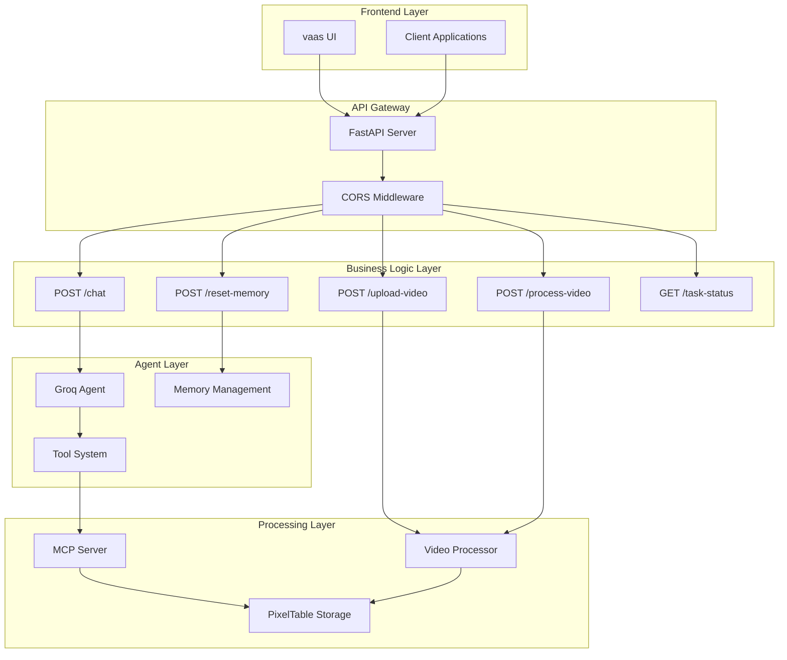
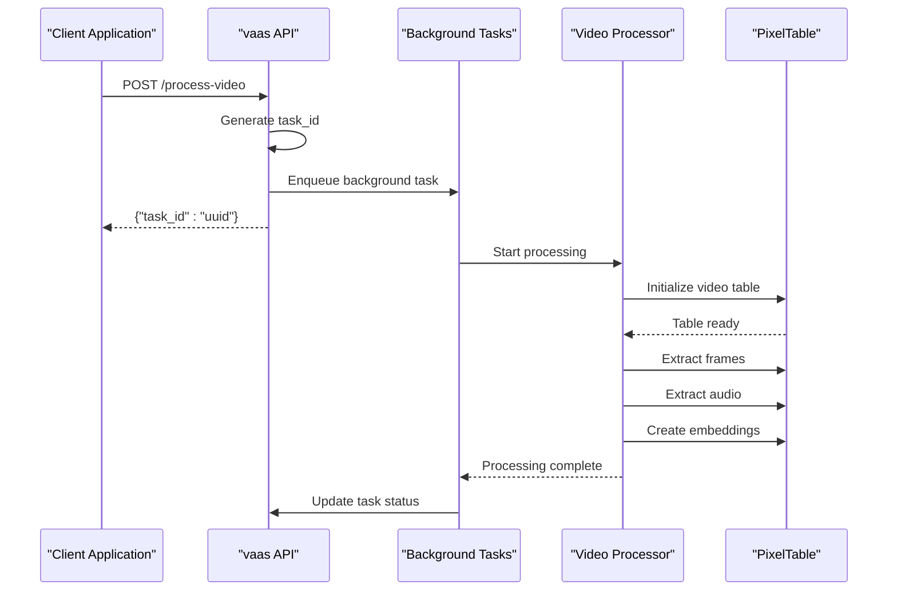

# REST API Reference

<cite>
**Referenced Files in This Document**
- [api.py](file://vaas-api/src/vaas_api/api.py)
- [models.py](file://vaas-api/src/vaas_api/models.py)
- [config.py](file://vaas-api/src/vaas_api/config.py)
- [base_agent.py](file://vaas-api/src/vaas_api/agent/base_agent.py)
- [groq_agent.py](file://vaas-api/src/vaas_api/agent/groq/groq_agent.py)
- [tools.py](file://vaas-api/src/vaas_api/tools.py)
- [video_processor.py](file://vaas-mcp/src/vaas_mcp/video/ingestion/video_processor.py)
- [README.md](file://vaas-api/README.md)
- [README.md](file://README.md)
</cite>

## Table of Contents
1. [Introduction](#introduction)
2. [API Architecture Overview](#api-architecture-overview)
3. [Authentication & Configuration](#authentication--configuration)
4. [Core Endpoints](#core-endpoints)
5. [Data Models](#data-models)
6. [Asynchronous Operations](#asynchronous-operations)
7. [Error Handling](#error-handling)
8. [Integration Guidelines](#integration-guidelines)
9. [Best Practices](#best-practices)
10. [Troubleshooting](#troubleshooting)

## Introduction

The vaas API is a FastAPI-based RESTful service that serves as the backend for an AI-powered sports assistant. It provides endpoints for video processing, chat interactions, and memory management, leveraging Groq's LLM models and Pixeltable for multimodal data processing.

This API acts as the primary interface between the frontend UI and the underlying video processing infrastructure, exposing the capabilities of the vaas MultiModal Agent (MCP) through a clean, efficient REST interface.

## API Architecture Overview

The vaas API follows a layered architecture pattern with clear separation of concerns:



**Diagram sources**
- [api.py](file://vaas-api/src/vaas_api/api.py#L1-L198)
- [base_agent.py](file://vaas-api/src/vaas_api/agent/base_agent.py#L1-L111)
- [groq_agent.py](file://vaas-api/src/vaas_api/agent/groq/groq_agent.py#L1-L237)

## Authentication & Configuration

### Environment Variables

The API requires several environment variables for proper operation:

```bash
# Groq API Configuration
GROQ_API_KEY=your_groq_api_key_here
GROQ_ROUTING_MODEL=meta-llama/llama-4-scout-17b-16e-instruct
GROQ_TOOL_USE_MODEL=meta-llama/llama-4-maverick-17b-128e-instruct
GROQ_IMAGE_MODEL=meta-llama/llama-4-maverick-17b-128e-instruct
GROQ_GENERAL_MODEL=meta-llama/llama-4-maverick-17b-128e-instruct

# Opik Configuration (optional)
OPIK_API_KEY=your_opik_api_key_here
OPIK_WORKSPACE=default
OPIK_PROJECT=vaas-api

# Memory Configuration
AGENT_MEMORY_SIZE=20

# MCP Server Configuration
MCP_SERVER=http://vaas-mcp:9090/mcp

# Async Configuration
DISABLE_NEST_ASYNCIO=true
```

### Rate Limiting & Versioning

The API currently operates without explicit rate limiting but implements the following patterns:

- **Background Task Queuing**: Long-running operations are handled asynchronously
- **Memory Management**: Configurable memory size (default: 20 items)
- **Connection Pooling**: Managed through FastAPI and Groq client libraries

**Section sources**
- [config.py](file://vaas-api/src/vaas_api/config.py#L1-L43)

## Core Endpoints

### POST /upload-video

Uploads a video file and returns the processed path for later use.

#### Endpoint Details
- **Method**: POST
- **URL**: `/upload-video`
- **Content-Type**: multipart/form-data
- **Response Model**: `VideoUploadResponse`

#### Request Schema

```json
{
  "file": "UploadFile" // Required: Video file to upload
}
```

#### Response Schema

```json
{
  "message": "Video uploaded successfully",
  "video_path": "/path/to/uploaded/video.mp4",
  "task_id": "uuid-string" // Optional: Task ID for background processing
}
```

#### Practical Example

```bash
curl -X POST "http://localhost:8080/upload-video" \
  -H "accept: application/json" \
  -F "file=@sample_video.mp4"
```

Expected response:
```json
{
  "message": "Video uploaded successfully",
  "video_path": "shared_media/sample_video.mp4",
  "task_id": "550e8400-e29b-41d4-a716-446655440000"
}
```

### POST /process-video

Initiates background video processing using the PixelTable video processing pipeline.

#### Endpoint Details
- **Method**: POST
- **URL**: `/process-video`
- **Content-Type**: application/json
- **Response Model**: `ProcessVideoResponse`

#### Request Schema

```json
{
  "video_path": "string" // Required: Path to the video file to process
}
```

#### Response Schema

```json
{
  "message": "Task enqueued for processing",
  "task_id": "uuid-string" // Unique identifier for tracking the background task
}
```

#### Practical Example

```bash
curl -X POST "http://localhost:8080/process-video" \
  -H "Content-Type: application/json" \
  -d '{"video_path": "shared_media/sample_video.mp4"}'
```

Expected response:
```json
{
  "message": "Task enqueued for processing",
  "task_id": "550e8400-e29b-41d4-a716-446655440000"
}
```

### POST /chat

Engages with the AI assistant for multimodal conversations involving text, video, and images.

#### Endpoint Details
- **Method**: POST
- **URL**: `/chat`
- **Content-Type**: application/json
- **Response Model**: `AssistantMessageResponse`

#### Request Schema

```json
{
  "message": "string", // Required: User's message
  "video_path": "string | null", // Optional: Path to video context
  "image_base64": "string | null" // Optional: Base64 encoded image
}
```

#### Response Schema

```json
{
  "message": "string", // Assistant's response
  "clip_path": "string | null" // Optional: Path to generated video clip
}
```

#### Practical Examples

**Text-only chat:**
```bash
curl -X POST "http://localhost:8080/chat" \
  -H "Content-Type: application/json" \
  -d '{
    "message": "What are the key moments in this game?"
  }'
```

**With video context:**
```bash
curl -X POST "http://localhost:8080/chat" \
  -H "Content-Type: application/json" \
  -d '{
    "message": "Can you describe the action in this video?",
    "video_path": "shared_media/game_video.mp4"
  }'
```

**With image context:**
```bash
curl -X POST "http://localhost:8080/chat" \
  -H "Content-Type: application/json" \
  -d '{
    "message": "What do you see in this image?",
    "image_base64": "iVBORw0KGgoAAAANSUhEUgAAAAEAAAABCAYAAAAfFcSJAAAADUlEQVR42mP8/5+hHgAHggJ/PchI7wAAAABJRU5ErkJggg=="
  }'
```

### POST /reset-memory

Clears the agent's memory state, useful for maintaining conversation context.

#### Endpoint Details
- **Method**: POST
- **URL**: `/reset-memory`
- **Content-Type**: application/json
- **Response Model**: `ResetMemoryResponse`

#### Request Schema
No request body required.

#### Response Schema

```json
{
  "message": "Memory reset successfully"
}
```

#### Practical Example

```bash
curl -X POST "http://localhost:8080/reset-memory" \
  -H "Content-Type: application/json"
```

Expected response:
```json
{
  "message": "Memory reset successfully"
}
```

**Section sources**
- [api.py](file://vaas-api/src/vaas_api/api.py#L70-L198)
- [models.py](file://vaas-api/src/vaas_api/models.py#L1-L54)

## Data Models

### Core Request Models

#### UserMessageRequest
```python
class UserMessageRequest(BaseModel):
    message: str  # Required: User's input message
    video_path: str | None = None  # Optional: Video context path
    image_base64: str | None = None  # Optional: Base64 encoded image
```

#### ProcessVideoRequest
```python
class ProcessVideoRequest(BaseModel):
    video_path: str  # Required: Path to video file for processing
```

### Core Response Models

#### VideoUploadResponse
```python
class VideoUploadResponse(BaseModel):
    message: str  # Success/failure message
    video_path: str | None = None  # Path to uploaded video
    task_id: str | None = None  # Optional task ID for background processing
```

#### ProcessVideoResponse
```python
class ProcessVideoResponse(BaseModel):
    message: str  # Operation status message
    task_id: str  # Unique identifier for tracking
```

#### AssistantMessageResponse
```python
class AssistantMessageResponse(BaseModel):
    message: str  # Assistant's response text
    clip_path: str | None = None  # Optional path to generated video clip
```

#### ResetMemoryResponse
```python
class ResetMemoryResponse(BaseModel):
    message: str  # Confirmation message
```

### Structured Output Models

The API also defines structured response models for LLM outputs:

#### RoutingResponseModel
```python
class RoutingResponseModel(BaseModel):
    tool_use: bool = Field(
        description="Whether the user's question requires a tool call."
    )
```

#### GeneralResponseModel
```python
class GeneralResponseModel(BaseModel):
    message: str = Field(
        description="Your response to the user's question, that needs to follow vaas's style and personality"
    )
```

#### VideoClipResponseModel
```python
class VideoClipResponseModel(BaseModel):
    message: str = Field(
        description="A fun and engaging message to the user, asking them to watch the video clip, that needs to follow vaas's style and personality"
    )
    clip_path: str = Field(description="The path to the generated clip.")
```

**Section sources**
- [models.py](file://vaas-api/src/vaas_api/models.py#L1-L54)

## Asynchronous Operations

### Background Task Management

The API implements a sophisticated background task system for long-running operations:



**Diagram sources**
- [api.py](file://vaas-api/src/vaas_api/api.py#L60-L85)
- [video_processor.py](file://vaas-mcp/src/vaas_mcp/video/ingestion/video_processor.py#L1-L205)

### Task Status Tracking

#### GET /task-status/{task_id}

Retrieves the current status of a background task.

##### Endpoint Details
- **Method**: GET
- **URL**: `/task-status/{task_id}`
- **Parameters**: `task_id` (path parameter)

##### Response Schema

```json
{
  "task_id": "uuid-string",
  "status": "pending | in_progress | completed | failed | not_found"
}
```

##### Practical Example

```bash
curl -X GET "http://localhost:8080/task-status/550e8400-e29b-41d4-a716-446655440000" \
  -H "accept: application/json"
```

Expected response:
```json
{
  "task_id": "550e8400-e29b-41d4-a716-446655440000",
  "status": "completed"
}
```

### Polling Mechanism

Client applications should implement exponential backoff polling for task completion:

```javascript
// Example polling implementation
async function pollTaskStatus(taskId, maxAttempts = 10, interval = 1000) {
  for (let attempt = 0; attempt < maxAttempts; attempt++) {
    try {
      const response = await fetch(`/task-status/${taskId}`);
      const data = await response.json();
      
      if (data.status === 'completed') {
        return data;
      } else if (data.status === 'failed') {
        throw new Error('Task failed');
      }
      
      // Exponential backoff
      await new Promise(resolve => setTimeout(resolve, interval * Math.pow(2, attempt)));
    } catch (error) {
      console.error('Polling failed:', error);
      break;
    }
  }
  
  throw new Error('Task polling timeout');
}
```

**Section sources**
- [api.py](file://vaas-api/src/vaas_api/api.py#L50-L65)

## Error Handling

### HTTP Status Codes

The API uses standard HTTP status codes with specific meanings:

- **200 OK**: Successful operation
- **400 Bad Request**: Invalid request parameters
- **404 Not Found**: Resource not found (video file, task, etc.)
- **500 Internal Server Error**: Unexpected server error
- **503 Service Unavailable**: MCP server not responding

### Error Response Format

```json
{
  "detail": "Error description message"
}
```

### Common Error Scenarios

#### Video Processing Errors

```json
{
  "detail": "Video file not found"
}
```

#### MCP Server Errors

```json
{
  "detail": "Error processing video: connection failed"
}
```

#### Memory Errors

```json
{
  "detail": "Agent memory operation failed"
}
```

### Client-Side Error Handling

```javascript
// Example error handling implementation
async function handleApiCall(endpoint, payload) {
  try {
    const response = await fetch(endpoint, {
      method: 'POST',
      headers: { 'Content-Type': 'application/json' },
      body: JSON.stringify(payload)
    });
    
    if (!response.ok) {
      const errorData = await response.json();
      throw new Error(errorData.detail || 'API error occurred');
    }
    
    return await response.json();
  } catch (error) {
    console.error('API call failed:', error.message);
    // Implement retry logic or user notification
    throw error;
  }
}
```

**Section sources**
- [api.py](file://vaas-api/src/vaas_api/api.py#L70-L198)

## Integration Guidelines

### Frontend Integration (vaas UI)

The API is designed to integrate seamlessly with the vaas UI React application:

```typescript
// Example TypeScript interface
interface ApiEndpoints {
  uploadVideo: (file: File) => Promise<VideoUploadResponse>;
  processVideo: (request: ProcessVideoRequest) => Promise<ProcessVideoResponse>;
  chat: (request: UserMessageRequest) => Promise<AssistantMessageResponse>;
  resetMemory: () => Promise<ResetMemoryResponse>;
  getTaskStatus: (taskId: string) => Promise<TaskStatusResponse>;
}

// Implementation example
class vaasApiClient {
  private baseUrl: string;
  
  constructor(baseUrl: string = 'http://localhost:8080') {
    this.baseUrl = baseUrl;
  }
  
  async uploadVideo(file: File): Promise<VideoUploadResponse> {
    const formData = new FormData();
    formData.append('file', file);
    
    const response = await fetch(`${this.baseUrl}/upload-video`, {
      method: 'POST',
      body: formData
    });
    
    return await response.json();
  }
}
```

### Backend Integration

#### Python Integration

```python
import requests
import asyncio
from typing import Optional

class vaasApi:
    def __init__(self, base_url: str = "http://localhost:8080"):
        self.base_url = base_url
    
    async def upload_video(self, file_path: str) -> dict:
        with open(file_path, 'rb') as f:
            files = {'file': f}
            response = requests.post(
                f"{self.base_url}/upload-video",
                files=files
            )
            return response.json()
    
    async def process_video(self, video_path: str) -> dict:
        data = {"video_path": video_path}
        response = requests.post(
            f"{self.base_url}/process-video",
            json=data
        )
        return response.json()
    
    async def poll_task_status(self, task_id: str, max_attempts: int = 10) -> str:
        for attempt in range(max_attempts):
            response = requests.get(f"{self.base_url}/task-status/{task_id}")
            status_data = response.json()
            
            if status_data['status'] in ['completed', 'failed']:
                return status_data['status']
            
            await asyncio.sleep(2 ** attempt)  # Exponential backoff
        
        raise TimeoutError("Task polling timeout")
```

### Media Serving

The API automatically serves media files from the `shared_media` directory:

```bash
# Access uploaded videos
curl -X GET "http://localhost:8080/media/sample_video.mp4"

# Access generated clips
curl -X GET "http://localhost:8080/media/generated_clip.mp4"
```

**Section sources**
- [api.py](file://vaas-api/src/vaas_api/api.py#L150-L198)

## Best Practices

### API Consumption Patterns

#### 1. Batch Operations
For multiple video uploads, implement batch processing:

```javascript
async function uploadMultipleVideos(files) {
  const uploadPromises = files.map(file => uploadVideo(file));
  return await Promise.all(uploadPromises);
}
```

#### 2. Concurrent Processing
Handle multiple concurrent requests efficiently:

```javascript
const apiClient = new vaasApiClient();

async function processVideosConcurrently(videoPaths) {
  const processingPromises = videoPaths.map(path => 
    apiClient.processVideo({ video_path: path })
  );
  
  const results = await Promise.allSettled(processingPromises);
  
  return results.map((result, index) => ({
    video_path: videoPaths[index],
    status: result.status,
    data: result.value
  }));
}
```

#### 3. Memory Management
Respect the agent's memory limits:

```javascript
// Reset memory periodically to prevent overflow
function manageConversationHistory(messages) {
  if (messages.length > 15) {
    resetMemory(); // Clear old conversation context
    messages = messages.slice(-5); // Keep recent messages
  }
  return messages;
}
```

### Performance Optimization

#### 1. Caching Strategies
Implement intelligent caching for frequently accessed videos:

```javascript
class VideoCache {
  constructor() {
    this.cache = new Map();
    this.maxSize = 10;
  }
  
  async getCachedVideo(path) {
    if (this.cache.has(path)) {
      return this.cache.get(path);
    }
    
    const videoData = await fetchVideoMetadata(path);
    this.cache.set(path, videoData);
    
    // Maintain cache size
    if (this.cache.size > this.maxSize) {
      const firstKey = this.cache.keys().next().value;
      this.cache.delete(firstKey);
    }
    
    return videoData;
  }
}
```

#### 2. Connection Pooling
Configure appropriate connection pools for high-throughput scenarios:

```python
# Example FastAPI configuration for high concurrency
app = FastAPI(
    title="vaas API",
    max_connections=100,
    max_keepalive_connections=20,
    keepalive_expiry=5.0
)
```

### Security Considerations

#### 1. Input Validation
Always validate file types and sizes:

```javascript
function validateVideoFile(file) {
  const allowedTypes = ['video/mp4', 'video/quicktime'];
  const maxSize = 100 * 1024 * 1024; // 100MB
  
  if (!allowedTypes.includes(file.type)) {
    throw new Error('Unsupported file type');
  }
  
  if (file.size > maxSize) {
    throw new Error('File too large');
  }
  
  return true;
}
```

#### 2. Rate Limiting
Implement client-side rate limiting:

```javascript
class RateLimiter {
  constructor(maxRequests = 10, timeWindow = 60000) {
    this.maxRequests = maxRequests;
    this.timeWindow = timeWindow;
    this.requests = [];
  }
  
  async wait() {
    const now = Date.now();
    this.requests = this.requests.filter(time => now - time < this.timeWindow);
    
    if (this.requests.length >= this.maxRequests) {
      const earliestTime = this.requests[0];
      const waitTime = this.timeWindow - (now - earliestTime);
      await new Promise(resolve => setTimeout(resolve, waitTime));
    }
    
    this.requests.push(now);
  }
}
```

## Troubleshooting

### Common Issues and Solutions

#### 1. Video Processing Failures

**Symptom**: `{"detail": "Video file not found"}`

**Solution**: Verify the video path exists and is accessible:

```bash
# Check if file exists
ls -la shared_media/

# Verify file permissions
chmod 644 shared_media/sample_video.mp4
```

#### 2. MCP Server Connectivity

**Symptom**: `{"detail": "Error processing video: connection failed"}`

**Solution**: Check MCP server status:

```bash
# Test MCP server connectivity
curl http://vaas-mcp:9090/mcp

# Check logs
docker logs vaas-mcp
```

#### 3. Memory Issues

**Symptom**: Agent becomes unresponsive or slow

**Solution**: Reset memory and monitor usage:

```bash
# Reset agent memory
curl -X POST http://localhost:8080/reset-memory

# Monitor memory usage
curl -X GET http://localhost:8080/memory-stats
```

#### 4. Task Status Retrieval

**Symptom**: Task status returns `not_found`

**Solution**: Verify task ID validity and timing:

```javascript
// Ensure task was created successfully
if (!response.task_id) {
  throw new Error('Invalid task ID received');
}

// Wait a moment before checking status
await new Promise(resolve => setTimeout(resolve, 1000));
```

### Debugging Tools

#### 1. Enable Debug Logging

```python
import logging
logging.basicConfig(level=logging.DEBUG)
```

#### 2. Health Check Endpoint

```bash
# Check API health
curl -X GET http://localhost:8080/health

# Expected response
{
  "status": "healthy",
  "timestamp": "2024-01-01T00:00:00Z"
}
```

#### 3. Task Monitoring

```javascript
// Comprehensive task monitoring
async function monitorTask(taskId) {
  const startTime = Date.now();
  let lastStatus = '';
  
  const monitorInterval = setInterval(async () => {
    try {
      const status = await getTaskStatus(taskId);
      
      if (status !== lastStatus) {
        console.log(`Task ${taskId} status changed: ${lastStatus} -> ${status}`);
        lastStatus = status;
      }
      
      if (status === 'completed') {
        clearInterval(monitorInterval);
        console.log(`Task completed in ${(Date.now() - startTime) / 1000}s`);
      } else if (status === 'failed') {
        clearInterval(monitorInterval);
        console.error(`Task failed after ${(Date.now() - startTime) / 1000}s`);
      }
    } catch (error) {
      console.error('Failed to get task status:', error);
    }
  }, 5000);
}
```

### Performance Monitoring

#### 1. Response Time Tracking

```javascript
function trackApiResponse(endpoint, payload) {
  const startTime = performance.now();
  
  return apiClient.request(endpoint, payload)
    .then(response => {
      const endTime = performance.now();
      const duration = endTime - startTime;
      
      console.log(`${endpoint} took ${duration.toFixed(2)}ms`);
      return response;
    });
}
```

#### 2. Error Rate Monitoring

```javascript
class ApiMonitor {
  constructor() {
    this.errors = [];
    this.totalRequests = 0;
  }
  
  recordError(error, endpoint) {
    this.errors.push({
      timestamp: new Date(),
      error: error.message,
      endpoint: endpoint
    });
  }
  
  getErrorRate() {
    return this.errors.length / this.totalRequests;
  }
}
```

**Section sources**
- [api.py](file://vaas-api/src/vaas_api/api.py#L50-L198)
- [README.md](file://vaas-api/README.md#L1-L102)