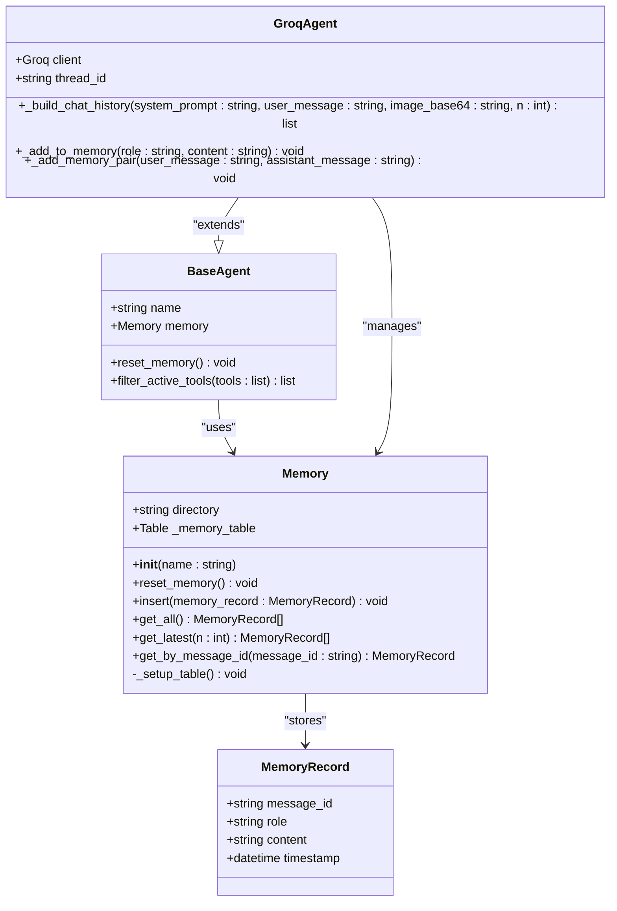
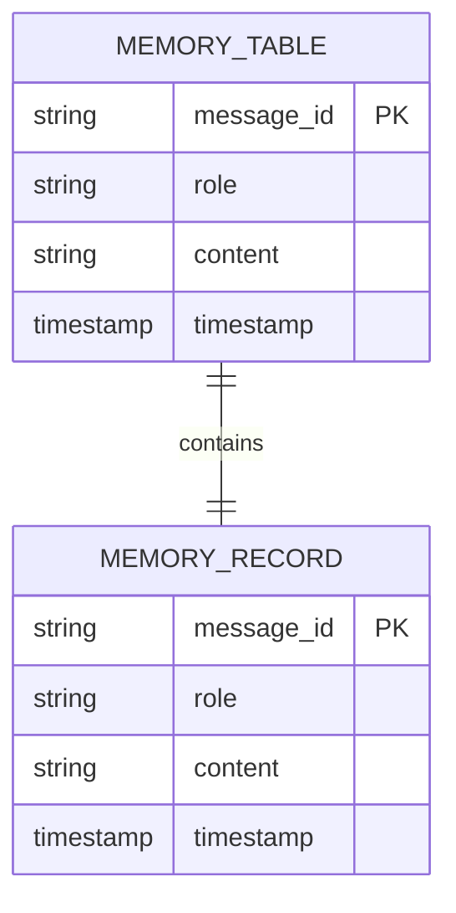
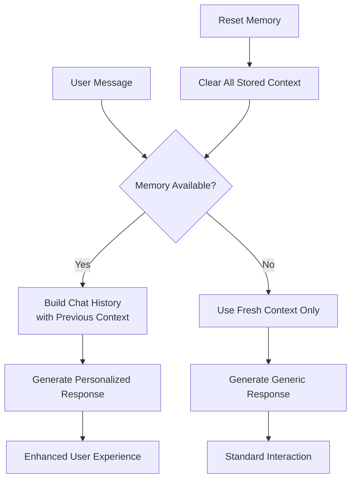

# Session Management API

<cite>
**Referenced Files in This Document**
- [api.py](file://vaas-api/src/vaas_api/api.py)
- [models.py](file://vaas-api/src/vaas_api/models.py)
- [memory.py](file://vaas-api/src/vaas_api/agent/memory.py)
- [base_agent.py](file://vaas-api/src/vaas_api/agent/base_agent.py)
- [groq_agent.py](file://vaas-api/src/vaas_api/agent/groq/groq_agent.py)
- [config.py](file://vaas-api/src/vaas_api/config.py)
- [README.md](file://vaas-api/README.md)
</cite>

## Table of Contents
1. [Introduction](#introduction)
2. [Endpoint Specification](#endpoint-specification)
3. [Memory Architecture](#memory-architecture)
4. [Implementation Details](#implementation-details)
5. [Usage Patterns](#usage-patterns)
6. [Error Handling](#error-handling)
7. [Best Practices](#best-practices)
8. [Troubleshooting](#troubleshooting)

## Introduction

The Session Management API provides a dedicated endpoint for resetting the conversation memory maintained by the agent's memory system. This endpoint enables clients to effectively start a new conversation session by clearing all stored conversation history, allowing for fresh interactions without carrying over previous context.

The `/reset-memory` endpoint is particularly useful in scenarios where users want to:
- Start a completely new conversation thread
- Clear sensitive information from previous interactions
- Reset the agent's context for improved personalization
- Handle session timeouts or user-initiated resets

## Endpoint Specification

### HTTP Method and URL Path
- **Method**: `POST`
- **URL Path**: `/reset-memory`
- **Request Body**: Empty (no payload required)

### Purpose
The primary purpose of this endpoint is to reset the agent's memory system, effectively clearing all stored conversation history and starting a new session. This operation removes all previous interactions from the memory database, ensuring that subsequent chat interactions begin with a clean slate.

### Impact on Subsequent Interactions
When the memory is reset:
- All previous conversation history is permanently removed
- The agent loses context from prior interactions
- Future responses are generated without considering past conversations
- Personalized responses based on previous context are disabled until new interactions occur

### Success Response Format
```json
{
  "message": "Memory reset successfully"
}
```

### Status Code
- **Success**: `200 OK`

**Section sources**
- [api.py](file://vaas-api/src/vaas_api/api.py#L135-L142)
- [models.py](file://vaas-api/src/vaas_api/models.py#L25-L28)

## Memory Architecture

The memory system is built on PixelTable, a vector database designed for storing structured data with efficient retrieval capabilities. The architecture consists of several key components:



**Diagram sources**
- [memory.py](file://vaas-api/src/vaas_api/agent/memory.py#L7-L50)
- [base_agent.py](file://vaas-api/src/vaas_api/agent/base_agent.py#L10-L25)
- [groq_agent.py](file://vaas-api/src/vaas_api/agent/groq/groq_agent.py#L25-L45)

### Memory Storage Structure
The memory system stores conversation data in a structured format:



**Diagram sources**
- [memory.py](file://vaas-api/src/vaas_api/agent/memory.py#L15-L25)

**Section sources**
- [memory.py](file://vaas-api/src/vaas_api/agent/memory.py#L1-L50)
- [base_agent.py](file://vaas-api/src/vaas_api/agent/base_agent.py#L1-L111)

## Implementation Details

### Endpoint Implementation

The `/reset-memory` endpoint is implemented as a FastAPI route handler that:

1. **Retrieves the Agent Instance**: Accesses the agent from the FastAPI application state
2. **Calls Memory Reset**: Invokes the agent's `reset_memory()` method
3. **Returns Success Response**: Sends a standardized success message

```python
@app.post("/reset-memory")
async def reset_memory(fastapi_request: Request):
    """
    Reset the memory of the agent
    """
    agent = fastapi_request.app.state.agent
    agent.reset_memory()
    return ResetMemoryResponse(message="Memory reset successfully")
```

### Memory Reset Mechanism

The memory reset operation uses PixelTable's directory management capabilities:

```python
def reset_memory(self):
    logger.info(f"Resetting memory: {self.directory}")
    pxt.drop_dir(self.directory, if_not_exists="ignore", force=True)
```

This operation:
- Logs the memory reset action for observability
- Uses PixelTable's `drop_dir()` function to remove the entire memory directory
- Forces deletion even if the directory doesn't exist
- Automatically recreates the directory structure on next initialization

### Integration with Agent System

The memory reset functionality is integrated into the base agent class:

```python
def reset_memory(self):
    self.memory.reset_memory()
```

This ensures consistent behavior across all agent implementations and maintains the separation of concerns between the API layer and the agent's internal state management.

**Section sources**
- [api.py](file://vaas-api/src/vaas_api/api.py#L135-L142)
- [memory.py](file://vaas-api/src/vaas_api/agent/memory.py#L35-L37)
- [base_agent.py](file://vaas-api/src/vaas_api/agent/base_agent.py#L45-L47)

## Usage Patterns

### Basic Memory Reset Request

```bash
curl -X POST "http://localhost:8080/reset-memory" \
  -H "Content-Type: application/json"
```

### When to Call the Endpoint

Clients should consider calling the `/reset-memory` endpoint in the following scenarios:

1. **New Conversation Initiation**: When users explicitly request to start a new conversation
2. **Context Cleanup**: After sensitive information has been discussed
3. **Session Timeout**: When automatic session timeouts occur
4. **User Preference**: Based on user preferences for conversation continuity
5. **Error Recovery**: After significant errors that require context reset

### Relationship Between Memory State and Personalized Responses

The memory system directly impacts the agent's ability to provide personalized responses:



**Diagram sources**
- [groq_agent.py](file://vaas-api/src/vaas_api/agent/groq/groq_agent.py#L50-L60)

### Memory Size Configuration

The system uses a configurable memory size controlled by the `AGENT_MEMORY_SIZE` setting:

```python
# Default memory size: 20 messages
AGENT_MEMORY_SIZE: int = 20
```

This setting determines how many previous messages are included in the chat history when building the conversation context.

**Section sources**
- [config.py](file://vaas-api/src/vaas_api/config.py#L28-L29)
- [groq_agent.py](file://vaas-api/src/vaas_api/agent/groq/groq_agent.py#L50-L60)

## Error Handling

### Potential Race Conditions

Calling the `/reset-memory` endpoint during active processing can lead to race conditions:

1. **Active Processing Conflict**: If the agent is currently processing a message while memory is being reset
2. **State Inconsistency**: Temporary inconsistency between the API request and agent state
3. **Partial Operations**: Memory reset may partially complete while processing continues

### Recommended Usage Patterns

To avoid race conditions and ensure optimal user experience:

1. **Graceful Degradation**: Implement retry logic for concurrent requests
2. **State Validation**: Check agent state before initiating memory reset
3. **User Feedback**: Inform users when memory reset is in progress
4. **Atomic Operations**: Design memory reset as an atomic operation where possible

### Error Response Handling

While the current implementation doesn't include explicit error handling, production systems should consider:

```python
try:
    agent.reset_memory()
    return ResetMemoryResponse(message="Memory reset successfully")
except Exception as e:
    logger.error(f"Memory reset failed: {e}")
    raise HTTPException(status_code=500, detail="Memory reset failed")
```

**Section sources**
- [api.py](file://vaas-api/src/vaas_api/api.py#L135-L142)

## Best Practices

### Memory Management Guidelines

1. **Regular Maintenance**: Implement periodic memory cleanup for long-running sessions
2. **Size Limits**: Monitor memory usage and implement size-based cleanup policies
3. **Backup Strategies**: Consider backup mechanisms for critical conversation contexts
4. **Audit Trails**: Log memory reset events for compliance and debugging

### Performance Considerations

- **Storage Efficiency**: PixelTable provides efficient storage for structured conversation data
- **Query Performance**: Memory retrieval operations are optimized for recent message access
- **Concurrency**: The memory system handles concurrent access through PixelTable's transactional guarantees

### Security Considerations

- **Sensitive Data**: Ensure memory reset removes all traces of sensitive information
- **Access Control**: Implement proper authentication and authorization for memory reset operations
- **Audit Logging**: Maintain logs of memory reset activities for security monitoring

## Troubleshooting

### Common Issues and Solutions

1. **Memory Reset Not Working**
   - Verify the agent instance is properly initialized
   - Check PixelTable permissions and directory access
   - Review application logs for error messages

2. **Incomplete Memory Reset**
   - Ensure the operation completes before proceeding
   - Implement proper error handling and retry logic
   - Verify disk space availability

3. **Performance Issues**
   - Monitor memory table size and optimize queries
   - Consider memory size limits and cleanup policies
   - Review concurrent access patterns

### Debugging Memory Operations

Enable debug logging to troubleshoot memory-related issues:

```python
import logging
logging.getLogger("vaas_api").setLevel(logging.DEBUG)
```

Monitor the following metrics:
- Memory table size and growth rate
- Operation timing and success rates
- Concurrent access patterns and conflicts

**Section sources**
- [memory.py](file://vaas-api/src/vaas_api/agent/memory.py#L35-L37)