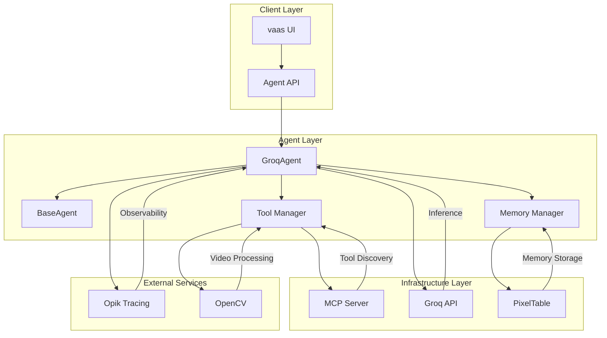
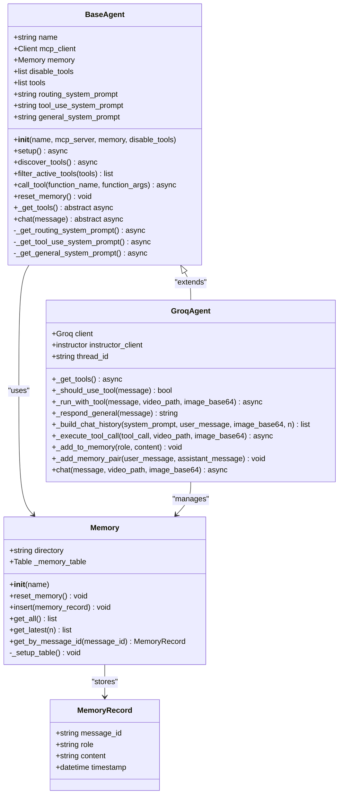
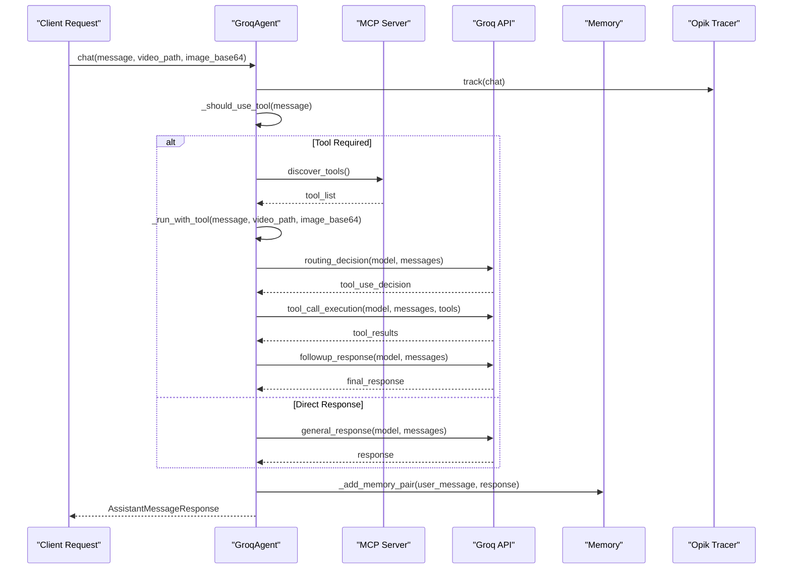
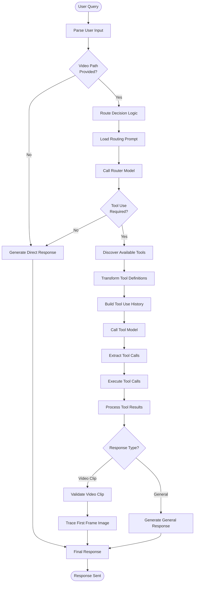
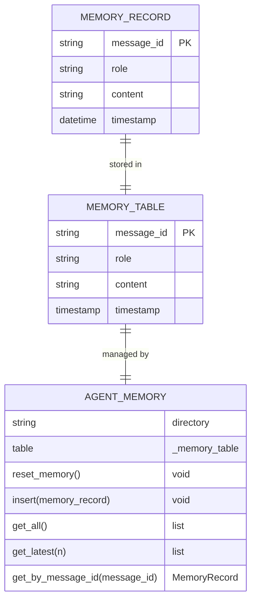
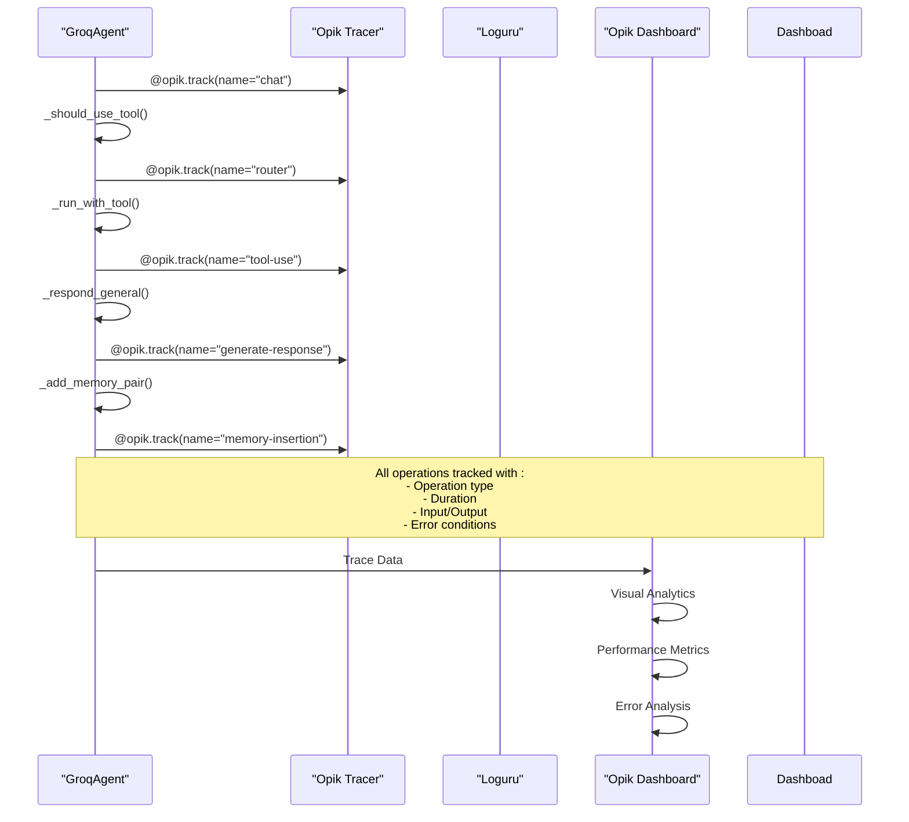
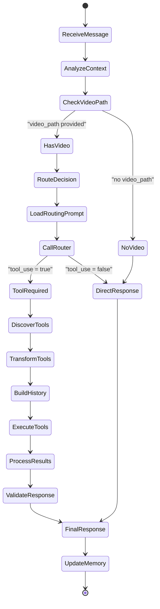
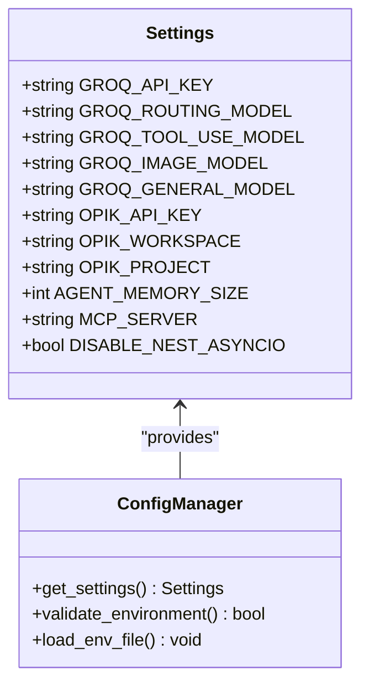

# Agent Architecture

<cite>
**Referenced Files in This Document**
- [base_agent.py](file://vaas-api/src/vaas_api/agent/base_agent.py)
- [groq_agent.py](file://vaas-api/src/vaas_api/agent/groq/groq_agent.py)
- [groq_tool.py](file://vaas-api/src/vaas_api/agent/groq/groq_tool.py)
- [memory.py](file://vaas-api/src/vaas_api/agent/memory.py)
- [opik_utils.py](file://vaas-api/src/vaas_api/opik_utils.py)
- [models.py](file://vaas-api/src/vaas_api/models.py)
- [config.py](file://vaas-api/src/vaas_api/config.py)
- [server.py](file://vaas-mcp/src/vaas_mcp/server.py)
- [tools.py](file://vaas-api/src/vaas_api/tools.py)
</cite>

## Table of Contents
1. [Introduction](#introduction)
2. [System Architecture Overview](#system-architecture-overview)
3. [Base Agent Abstraction](#base-agent-abstraction)
4. [Groq Agent Implementation](#groq-agent-implementation)
5. [Tool Orchestration System](#tool-orchestration-system)
6. [Memory Management](#memory-management)
7. [Observability and Tracing](#observability-and-tracing)
8. [Agent Decision-Making Loop](#agent-decision-making-loop)
9. [Configuration Management](#configuration-management)
10. [Best Practices](#best-practices)
11. [Troubleshooting Guide](#troubleshooting-guide)
12. [Conclusion](#conclusion)

## Introduction

The Agent system in the multimodal-agents-course represents a sophisticated conversational AI architecture designed for video processing and analysis tasks. Built around the concept of autonomous agents that can intelligently route queries between direct responses and tool-based actions, this system demonstrates advanced capabilities in multimodal interaction, memory management, and observability.

The architecture follows a modular design pattern with clear separation of concerns, enabling extensibility and maintainability while providing robust functionality for complex video analysis workflows. At its core, the system leverages the Model Context Protocol (MCP) for tool discovery and orchestration, combined with Groq's high-performance inference capabilities for real-time processing.

## System Architecture Overview

The Agent system operates as part of a larger ecosystem consisting of multiple interconnected services that work together to provide comprehensive video analysis capabilities.



**Diagram sources**
- [base_agent.py](file://vaas-api/src/vaas_api/agent/base_agent.py#L1-L111)
- [groq_agent.py](file://vaas-api/src/vaas_api/agent/groq/groq_agent.py#L1-L237)
- [memory.py](file://vaas-api/src/vaas_api/agent/memory.py#L1-L51)

The architecture demonstrates several key design principles:

- **Modular Design**: Clear separation between base abstractions and specific implementations
- **Protocol-Based Communication**: MCP server enables standardized tool discovery and execution
- **Asynchronous Operations**: Full support for async/await patterns throughout the stack
- **Extensible Tool System**: Dynamic tool discovery and registration from external servers
- **Persistent Memory**: Structured conversation history storage using PixelTable
- **Observability**: Comprehensive tracing and monitoring through Opik integration

## Base Agent Abstraction

The `BaseAgent` class serves as the foundational abstraction that defines the contract and common functionality for all agent implementations. This design ensures consistency across different LLM providers while maintaining flexibility for provider-specific optimizations.



**Diagram sources**
- [base_agent.py](file://vaas-api/src/vaas_api/agent/base_agent.py#L10-L111)
- [groq_agent.py](file://vaas-api/src/vaas_api/agent/groq/groq_agent.py#L25-L237)
- [memory.py](file://vaas-api/src/vaas_api/agent/memory.py#L8-L51)

The `BaseAgent` class implements several critical patterns:

### Asynchronous Initialization Pattern
The agent uses a two-phase initialization approach where the constructor sets up basic state, and the `setup()` method handles asynchronous initialization of MCP connections and prompt loading.

### Abstract Method Pattern
Critical methods like `_get_tools()` and `chat()` are declared as abstract, forcing concrete implementations to provide specific functionality while maintaining interface consistency.

### Tool Discovery and Filtering
The agent implements sophisticated tool discovery mechanisms that connect to MCP servers, retrieve available tools, and apply filtering based on disabled tools configuration.

**Section sources**
- [base_agent.py](file://vaas-api/src/vaas_api/agent/base_agent.py#L10-L111)

## Groq Agent Implementation

The `GroqAgent` class represents the concrete implementation of the `BaseAgent` interface, specifically optimized for Groq's high-performance inference capabilities. This implementation demonstrates advanced patterns for multimodal interaction, tool orchestration, and response generation.



**Diagram sources**
- [groq_agent.py](file://vaas-api/src/vaas_api/agent/groq/groq_agent.py#L210-L237)
- [base_agent.py](file://vaas-api/src/vaas_api/agent/base_agent.py#L95-L111)

### Key Implementation Features

#### Multimodal Input Support
The GroqAgent supports various input modalities including text, images, and videos, automatically transforming them into appropriate formats for the underlying LLM models.

#### Dynamic Tool Selection
The agent implements intelligent routing logic that determines when to use tools versus generating direct responses based on the nature of the user query.

#### Structured Response Generation
Using the Instructor library, the agent generates structured responses with type safety, ensuring consistent and predictable output formats.

#### Thread-Based Tracking
Each agent instance maintains a unique thread ID for correlating related operations in observability systems.

**Section sources**
- [groq_agent.py](file://vaas-api/src/vaas_api/agent/groq/groq_agent.py#L25-L237)

## Tool Orchestration System

The tool orchestration system represents one of the most sophisticated aspects of the Agent architecture, enabling seamless integration between the agent's decision-making capabilities and external tool functionality.



**Diagram sources**
- [groq_agent.py](file://vaas-api/src/vaas_api/agent/groq/groq_agent.py#L60-L150)
- [groq_tool.py](file://vaas-api/src/vaas_api/agent/groq/groq_tool.py#L1-L61)

### Tool Definition Transformation

The system implements a sophisticated transformation pipeline that converts MCP tool definitions into Groq-compatible tool specifications:

```python
# Example transformation process
def transform_tool_definition(tool) -> dict:
    """Transform an MCP tool into a Groq tool definition dictionary."""
    return GroqTool.from_mcp_tool(tool).model_dump()
```

This transformation process handles:
- Schema conversion from JSON Schema format to Groq's function calling format
- Parameter mapping with type safety and default value preservation
- Description extraction and formatting
- Metadata preservation for tool identification

### Tool Execution Pipeline

The tool execution pipeline demonstrates advanced error handling and response processing:

1. **Tool Discovery**: Connects to MCP server to discover available tools
2. **Tool Filtering**: Applies disabled tools configuration
3. **Tool Transformation**: Converts MCP tools to Groq-compatible format
4. **Execution**: Calls tools with validated parameters
5. **Error Handling**: Graceful degradation on tool failures
6. **Response Processing**: Formats tool responses for subsequent processing

**Section sources**
- [groq_tool.py](file://vaas-api/src/vaas_api/agent/groq/groq_tool.py#L1-L61)
- [groq_agent.py](file://vaas-api/src/vaas_api/agent/groq/groq_agent.py#L40-L60)

## Memory Management

The memory management system provides persistent, structured storage for conversation history and context, enabling coherent long-term interactions with users.



**Diagram sources**
- [memory.py](file://vaas-api/src/vaas_api/agent/memory.py#L8-L51)

### Memory Architecture

The memory system leverages PixelTable for efficient storage and retrieval:

#### Persistent Storage
- **File-based Storage**: Uses PixelTable's file system backend for durability
- **Structured Schema**: Enforces consistent data structure across all memory records
- **Timestamp Indexing**: Enables chronological ordering and efficient retrieval

#### Memory Operations
- **Insertion**: Adds new conversation turns with automatic timestamping
- **Retrieval**: Supports both full history and recent message retrieval
- **Reset**: Complete memory clearing with directory recreation
- **Lookup**: Message ID-based retrieval for cross-referencing

#### Conversation Context Management
The system maintains conversation context through:
- **Role-based Organization**: Separates user and assistant messages
- **Content Preservation**: Stores complete message content for context
- **Temporal Ordering**: Maintains chronological conversation flow
- **Size Limiting**: Configurable memory size with LIFO eviction

**Section sources**
- [memory.py](file://vaas-api/src/vaas_api/agent/memory.py#L1-L51)

## Observability and Tracing

The system integrates comprehensive observability through Opik (formerly Comet ML), providing detailed tracing and monitoring capabilities for production deployments.



**Diagram sources**
- [groq_agent.py](file://vaas-api/src/vaas_api/agent/groq/groq_agent.py#L210-L237)
- [opik_utils.py](file://vaas-api/src/vaas_api/opik_utils.py#L1-L44)

### Tracing Implementation

The system employs decorator-based tracing for comprehensive coverage:

#### Operation Tracking
- **Chat Operations**: Tracks the main chat workflow
- **Tool Use**: Monitors tool selection and execution
- **Memory Operations**: Records memory insertions and retrievals
- **Response Generation**: Captures LLM response creation

#### Context Propagation
- **Thread IDs**: Correlates related operations across sessions
- **Operation Types**: Distinguishes between different operation categories
- **Input/Output Capture**: Records complete request/response cycles
- **Error Context**: Preserves error information for debugging

#### Configuration Management
The Opik configuration system handles environment setup:

```python
def configure() -> None:
    if settings.OPIK_API_KEY and settings.OPIK_PROJECT:
        # Configure Opik client with workspace detection
        # Handle authentication and workspace selection
        # Enable tracing for all operations
```

**Section sources**
- [opik_utils.py](file://vaas-api/src/vaas_api/opik_utils.py#L1-L44)

## Agent Decision-Making Loop

The agent's decision-making process represents a sophisticated workflow that intelligently routes queries between different processing modes based on content analysis and context evaluation.



### Decision Logic Implementation

The routing decision process involves several sophisticated steps:

#### Context Analysis
The agent evaluates the incoming message along with associated metadata:
- **Video Presence**: Determines if video processing is required
- **Image Content**: Identifies if image-based queries are present
- **Query Complexity**: Assesses whether tool use is beneficial

#### Model-Based Routing
The routing decision leverages a dedicated LLM model to analyze the query:

```python
def _should_use_tool(self, message: str) -> bool:
    messages = [
        {"role": "system", "content": self.routing_system_prompt},
        {"role": "user", "content": message},
    ]
    response = self.instructor_client.chat.completions.create(
        model=settings.GROQ_ROUTING_MODEL,
        response_model=RoutingResponseModel,
        messages=messages,
        max_completion_tokens=20,
    )
    return response.tool_use
```

#### Response Mode Selection
Based on the routing decision, the agent selects between:
- **Direct Response Mode**: For simple queries requiring no external tools
- **Tool Use Mode**: For complex queries requiring specialized processing

**Section sources**
- [groq_agent.py](file://vaas-api/src/vaas_api/agent/groq/groq_agent.py#L60-L85)

## Configuration Management

The configuration system provides centralized management of all system parameters, enabling flexible deployment across different environments and use cases.



**Diagram sources**
- [config.py](file://vaas-api/src/vaas_api/config.py#L6-L42)

### Configuration Categories

#### LLM Provider Configuration
- **Groq API Key**: Authentication for Groq inference services
- **Model Selection**: Different models for routing, tool use, and general tasks
- **Token Limits**: Maximum response lengths for different operation types

#### Observability Configuration
- **Opik Integration**: API keys and project/workspace settings
- **Workspace Detection**: Automatic workspace identification
- **Local/Remote Mode**: Flexible deployment options

#### System Behavior Configuration
- **Memory Size**: Conversation history length limits
- **MCP Server URL**: Tool discovery endpoint configuration
- **Asyncio Settings**: Event loop configuration for compatibility

#### Environment-Specific Settings
The configuration system supports environment-specific overrides through:
- **Environment Variables**: Runtime configuration
- **.env Files**: Development and staging configurations
- **Default Values**: Safe fallbacks for missing settings

**Section sources**
- [config.py](file://vaas-api/src/vaas-api/src/vaas_api/config.py#L6-L42)

## Best Practices

### Prompt Engineering Guidelines

The agent system incorporates several best practices for effective prompt engineering:

#### System Prompt Design
- **Clear Role Definition**: Explicitly define the agent's personality and capabilities
- **Context Instructions**: Provide clear guidance on when to use tools versus direct responses
- **Output Formatting**: Specify expected response formats and constraints

#### Tool Use Prompts
- **Capability Awareness**: Inform the model about available tools and their limitations
- **Safety Instructions**: Include guidelines for appropriate tool usage
- **Error Handling**: Prepare the model for potential tool failures

#### Response Generation
- **Consistency Patterns**: Maintain consistent response styles across different scenarios
- **Context Preservation**: Ensure conversation history is properly utilized
- **Multimodal Coordination**: Handle mixed modal inputs effectively

### Performance Optimization

#### Model Selection Strategy
- **Routing Model**: Use smaller, faster models for initial decision-making
- **Tool Use Model**: Employ larger models with tool-calling capabilities
- **General Model**: Reserve high-capacity models for complex reasoning tasks

#### Memory Management
- **Size Limits**: Implement reasonable memory limits to prevent excessive context
- **Relevance Filtering**: Focus on recent, relevant conversation history
- **Efficient Storage**: Use optimized storage backends for memory persistence

#### Tool Orchestration
- **Batch Processing**: Group related tool calls when possible
- **Parallel Execution**: Execute independent tools concurrently
- **Caching Strategies**: Cache tool results for repeated queries

### Error Handling and Resilience

#### Graceful Degradation
- **Fallback Responses**: Provide meaningful responses when tools fail
- **Partial Results**: Utilize partial tool results when complete execution fails
- **User Communication**: Inform users about system limitations and alternatives

#### Monitoring and Alerting
- **Operation Tracking**: Monitor all system operations for performance insights
- **Error Rate Monitoring**: Track failure rates across different components
- **User Experience Metrics**: Measure response quality and satisfaction

## Troubleshooting Guide

### Common Issues and Solutions

#### Tool Discovery Failures
**Symptoms**: Agent cannot discover tools from MCP server
**Causes**: 
- Network connectivity issues
- Incorrect MCP server URL
- Authentication problems

**Solutions**:
1. Verify MCP server availability: `curl http://localhost:9090/mcp`
2. Check environment configuration: Validate `MCP_SERVER` setting
3. Review network connectivity: Test proxy and firewall settings
4. Validate authentication: Confirm API keys and permissions

#### Memory Persistence Issues
**Symptoms**: Conversation history lost between sessions
**Causes**:
- Disk space limitations
- Permission issues
- Corrupted database files

**Solutions**:
1. Check disk space: Ensure adequate storage for memory tables
2. Verify permissions: Confirm write access to memory directory
3. Reset memory: Use `reset_memory()` method to recreate tables
4. Monitor logs: Check for storage-related error messages

#### Model Response Quality Issues
**Symptoms**: Poor response quality or unexpected behavior
**Causes**:
- Incorrect model configuration
- Insufficient training data
- Prompt engineering issues

**Solutions**:
1. Validate model settings: Check model names and parameters
2. Review prompts: Ensure clear and specific instructions
3. Test with simpler queries: Identify specific failure patterns
4. Adjust temperature settings: Modify randomness for desired response style

#### Observability Integration Problems
**Symptoms**: Missing traces or incorrect metrics
**Causes**:
- API key misconfiguration
- Workspace selection issues
- Network connectivity problems

**Solutions**:
1. Verify API credentials: Check Opik API key and project settings
2. Test connectivity: Ensure network access to Opik servers
3. Review configuration: Validate environment variables and settings
4. Check dashboard access: Confirm workspace permissions and visibility

### Debugging Techniques

#### Logging Configuration
Enable detailed logging for troubleshooting:
```python
import loguru
logger.enable("vaas_api")
```

#### Trace Analysis
Use Opik dashboard to analyze operation traces:
- Identify bottlenecks in tool execution
- Monitor response quality trends
- Track error patterns and frequencies

#### Memory Inspection
Inspect memory contents for debugging:
```python
# Get latest conversation history
latest_messages = agent.memory.get_latest(10)
for msg in latest_messages:
    print(f"{msg.role}: {msg.content}")
```

## Conclusion

The Agent architecture in the multimodal-agents-course represents a sophisticated and well-engineered system that demonstrates advanced capabilities in autonomous AI interaction. Through its modular design, comprehensive observability, and intelligent decision-making processes, the system provides a robust foundation for complex video analysis workflows.

Key strengths of the architecture include:

- **Scalable Design**: Modular components enable easy extension and maintenance
- **Intelligent Routing**: Sophisticated decision-making ensures optimal resource utilization
- **Robust Tool Integration**: Seamless coordination between LLM inference and external tools
- **Persistent Memory**: Structured conversation history supports coherent long-term interactions
- **Comprehensive Observability**: Detailed tracing and monitoring facilitate production deployment

The system's design patterns and implementation strategies provide valuable insights for building production-ready AI applications that require sophisticated multimodal capabilities and reliable performance characteristics. The integration of modern tools like Opik for observability, PixelTable for memory management, and the Model Context Protocol for tool orchestration demonstrate best practices in contemporary AI system development.

Future enhancements could include expanded tool ecosystems, improved caching mechanisms, and enhanced multimodal capabilities for richer user interactions. The solid architectural foundation established here provides an excellent platform for continued innovation and feature expansion.