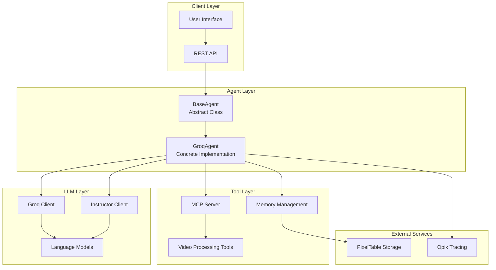
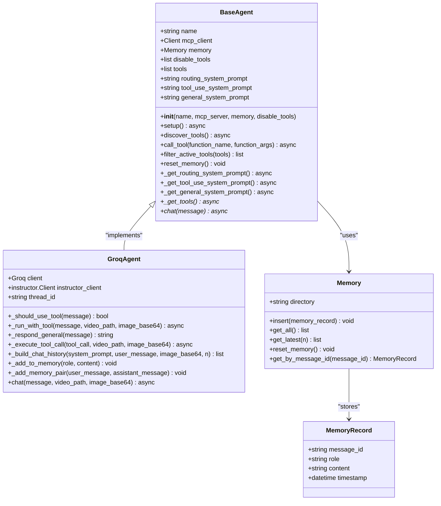
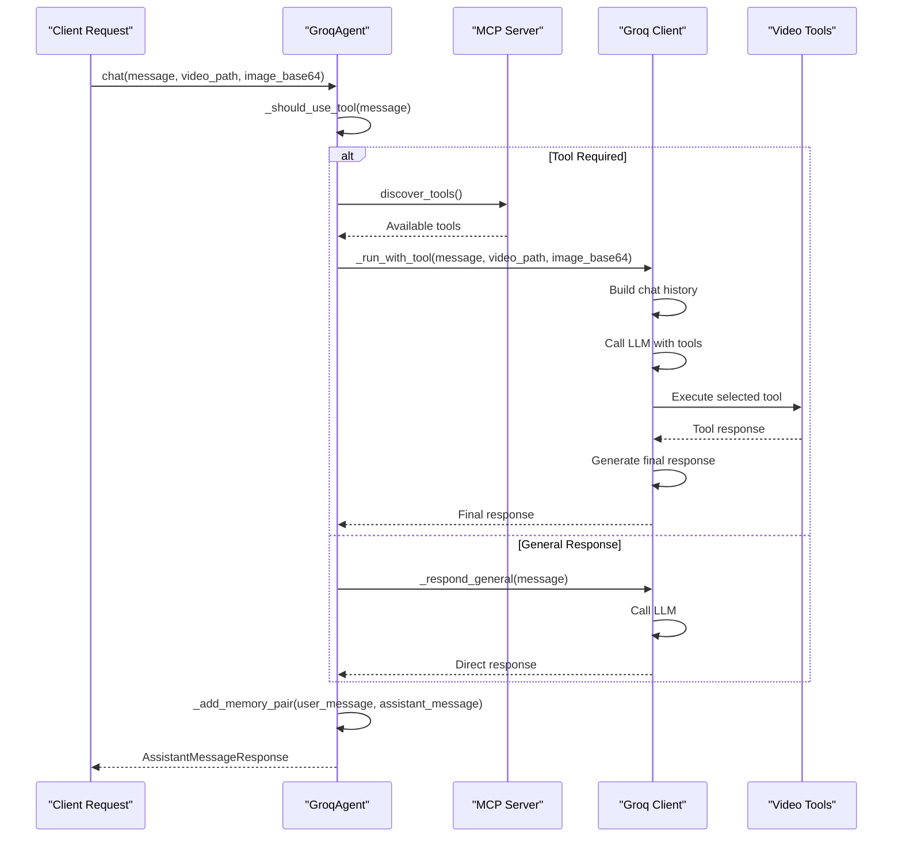
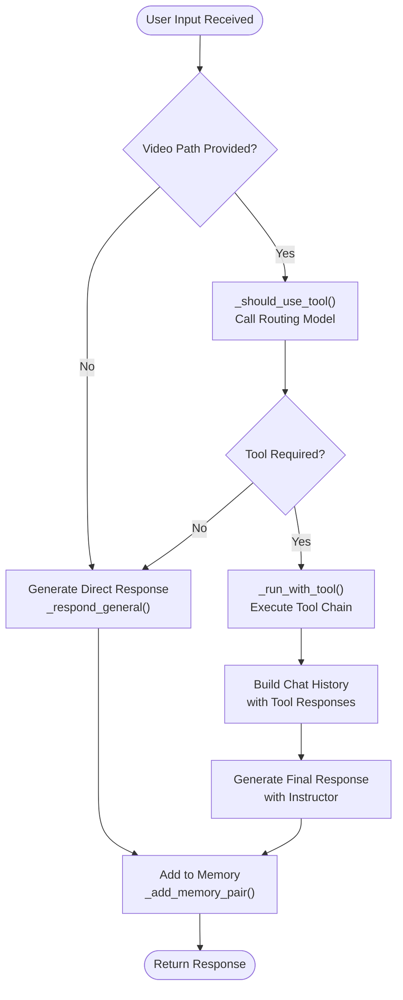
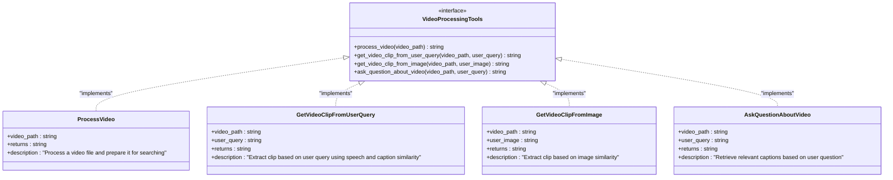
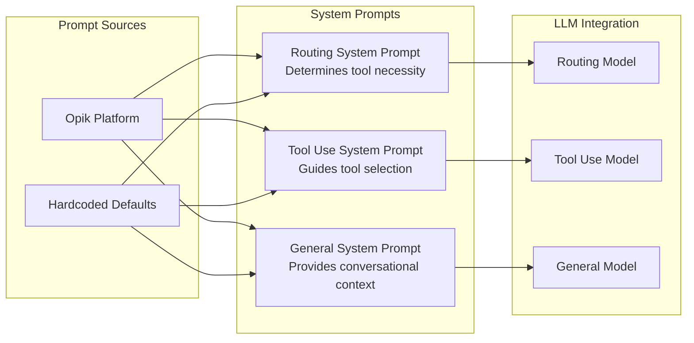
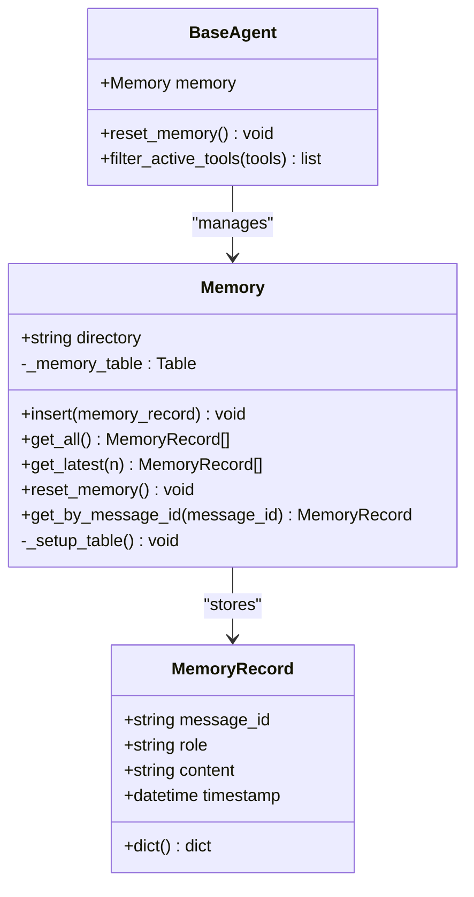
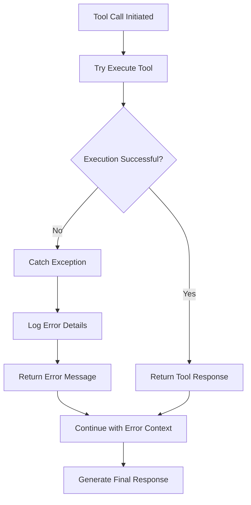
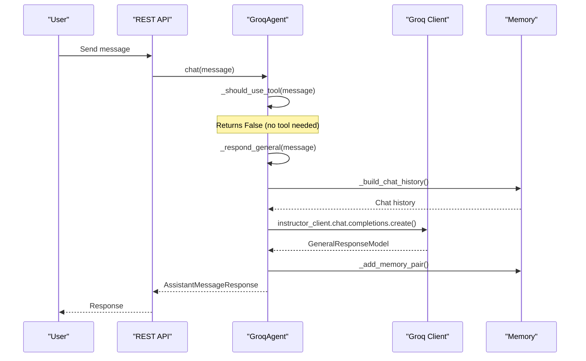
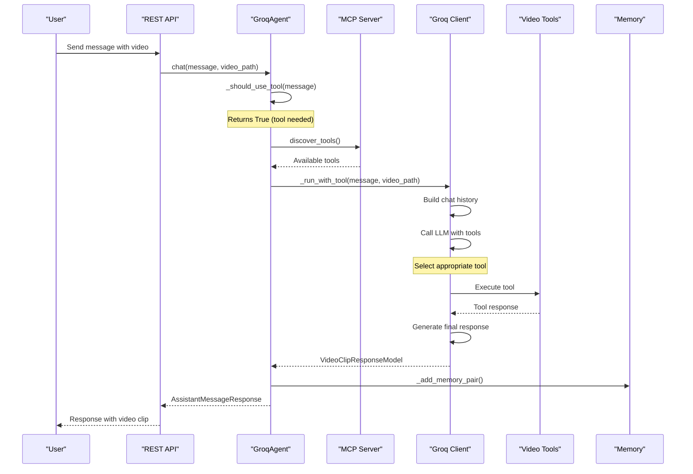

# Agent Core Logic

<cite>
**Referenced Files in This Document**
- [base_agent.py](file://vaas-api/src/vaas_api/agent/base_agent.py)
- [groq_agent.py](file://vaas-api/src/vaas_api/agent/groq/groq_agent.py)
- [groq_tool.py](file://vaas-api/src/vaas_api/agent/groq/groq_tool.py)
- [memory.py](file://vaas-api/src/vaas_api/agent/memory.py)
- [config.py](file://vaas-api/src/vaas_api/config.py)
- [models.py](file://vaas-api/src/vaas_api/models.py)
- [tools.py](file://vaas-api/src/vaas_api/tools.py)
- [server.py](file://vaas-mcp/src/vaas_mcp/server.py)
- [tools.py](file://vaas-mcp/src/vaas_mcp/tools.py)
- [prompts.py](file://vaas-mcp/src/vaas_mcp/prompts.py)
</cite>

## Table of Contents
1. [Introduction](#introduction)
2. [Architecture Overview](#architecture-overview)
3. [BaseAgent Abstract Class](#baseagent-abstract-class)
4. [GroqAgent Implementation](#groqagent-implementation)
5. [Decision-Making Loop](#decision-making-loop)
6. [Tool Integration and Execution](#tool-integration-and-execution)
7. [System Prompts and Configuration](#system-prompts-and-configuration)
8. [Memory Management](#memory-management)
9. [Error Handling and Performance](#error-handling-and-performance)
10. [Sequence Diagrams](#sequence-diagrams)
11. [Troubleshooting Guide](#troubleshooting-guide)
12. [Conclusion](#conclusion)

## Introduction

The agent core logic in the multimodal-agents-course is built around a sophisticated architecture that combines the BaseAgent abstract class with the GroqAgent implementation. This system enables intelligent decision-making through a structured workflow that evaluates user input, determines tool necessity, selects appropriate tools via function calling, and generates natural language responses.

The architecture leverages Groq's LLM API for efficient inference while integrating seamlessly with the MCP (Model Context Protocol) server for tool execution. The system supports both direct responses and tool-invoked queries, providing a flexible framework for multimodal interactions involving video processing capabilities.

## Architecture Overview

The agent system follows a layered architecture with clear separation of concerns:



**Diagram sources**
- [base_agent.py](file://vaas-api/src/vaas_api/agent/base_agent.py#L1-L111)
- [groq_agent.py](file://vaas-api/src/vaas_api/agent/groq/groq_agent.py#L1-L237)

## BaseAgent Abstract Class

The BaseAgent serves as the foundation for all agent implementations, providing essential functionality for tool discovery, memory management, and MCP server communication.



**Diagram sources**
- [base_agent.py](file://vaas-api/src/vaas_api/agent/base_agent.py#L10-L111)
- [groq_agent.py](file://vaas-api/src/vaas_api/agent/groq/groq_agent.py#L25-L237)
- [memory.py](file://vaas-api/src/vaas_api/agent/memory.py#L7-L51)

The BaseAgent provides several key capabilities:

### Initialization and Setup
The constructor initializes essential components including the MCP client, memory manager, and tool filtering mechanisms. The setup method asynchronously initializes system prompts and discovers available tools from the MCP server.

### Tool Discovery and Management
The `discover_tools()` method connects to the MCP server to retrieve available tools, applying filters to exclude disabled tools. This ensures only relevant tools are available for decision-making.

### Memory Management
The memory system uses PixelTable for persistent storage of conversation history, enabling context-aware responses across sessions.

**Section sources**
- [base_agent.py](file://vaas-api/src/vaas_api/agent/base_agent.py#L10-L111)

## GroqAgent Implementation

The GroqAgent extends the BaseAgent with Groq-specific functionality, leveraging Groq's high-performance LLM API for efficient inference.

### Core Components



**Diagram sources**
- [groq_agent.py](file://vaas-api/src/vaas_api/agent/groq/groq_agent.py#L215-L237)

### LLM Configuration

The GroqAgent utilizes multiple specialized models configured for different tasks:

- **Routing Model**: `meta-llama/llama-4-scout-17b-16e-instruct` - Used for determining tool necessity
- **Tool Use Model**: `meta-llama/llama-4-maverick-17b-128e-instruct` - Handles tool selection and execution
- **General Model**: `meta-llama/llama-4-maverick-17b-128e-instruct` - Provides general conversational responses
- **Image Model**: `meta-llama/llama-4-maverick-17b-128e-instruct` - Processes multimodal inputs

### Tool Transformation

The GroqAgent transforms MCP tools into Groq-compatible tool definitions using the `transform_tool_definition()` function, ensuring seamless integration with Groq's function calling capabilities.

**Section sources**
- [groq_agent.py](file://vaas-api/src/vaas_api/agent/groq/groq_agent.py#L25-L237)
- [config.py](file://vaas-api/src/vaas_api/config.py#L10-L18)

## Decision-Making Loop

The agent's decision-making process follows a sophisticated workflow that evaluates user input and determines the appropriate response strategy.



**Diagram sources**
- [groq_agent.py](file://vaas-api/src/vaas_api/agent/groq/groq_agent.py#L215-L237)

### Tool Selection Logic

The `_should_use_tool()` method employs a dedicated routing model to evaluate whether a tool call is necessary:

```python
def _should_use_tool(self, message: str) -> bool:
    messages = [
        {"role": "system", "content": self.routing_system_prompt},
        {"role": "user", "content": message},
    ]
    response = self.instructor_client.chat.completions.create(
        model=settings.GROQ_ROUTING_MODEL,
        response_model=RoutingResponseModel,
        messages=messages,
        max_completion_tokens=20,
    )
    return response.tool_use
```

This method returns a boolean indicating whether the user's query requires tool assistance, using structured output validation for reliability.

### Tool Execution Workflow

When tools are required, the `_run_with_tool()` method orchestrates the complete tool execution chain:

1. **Tool Discovery**: Retrieves available tools from the MCP server
2. **Chat History Building**: Constructs conversation context with system prompts
3. **Tool Selection**: Calls the LLM with available tools to select the appropriate one
4. **Tool Execution**: Executes the selected tool with validated parameters
5. **Response Generation**: Uses the Instructor client to generate structured responses

**Section sources**
- [groq_agent.py](file://vaas-api/src/vaas_api/agent/groq/groq_agent.py#L75-L140)

## Tool Integration and Execution

The agent integrates with the MCP server to provide powerful video processing capabilities through a comprehensive set of tools.

### Available Tools

The system provides four primary video processing tools:



**Diagram sources**
- [tools.py](file://vaas-mcp/src/vaas_mcp/tools.py#L15-L105)

### Tool Execution Process

The `_execute_tool_call()` method handles tool invocation with comprehensive error handling:

```python
async def _execute_tool_call(self, tool_call: Any, video_path: str, image_base64: str | None = None) -> str:
    function_name = tool_call.function.name
    function_args = json.loads(tool_call.function.arguments)
    
    function_args["video_path"] = video_path
    if function_name == "get_video_clip_from_image":
        function_args["user_image"] = image_base64
    
    try:
        return await self.call_tool(function_name, function_args)
    except Exception as e:
        logger.error(f"Error executing tool {function_name}: {str(e)}")
        return f"Error executing tool {function_name}: {str(e)}"
```

This method ensures proper parameter validation and provides meaningful error responses when tool execution fails.

**Section sources**
- [groq_agent.py](file://vaas-api/src/vaas_api/agent/groq/groq_agent.py#L85-L95)
- [tools.py](file://vaas-mcp/src/vaas_mcp/tools.py#L15-L105)

## System Prompts and Configuration

The agent utilizes three distinct system prompts tailored for specific tasks, each optimized for its intended purpose.

### Prompt Architecture



**Diagram sources**
- [prompts.py](file://vaas-mcp/src/vaas_mcp/prompts.py#L1-L109)

### Routing System Prompt

The routing prompt determines whether a tool call is necessary based on the user's intent:

```python
ROUTING_SYSTEM_PROMPT = """
You are a routing assistant responsible for determining whether the user needs 
to perform an operation on a video.

Given a conversation history, between the user and the assistant, your task is
to determine if the user needs help with any of the following tasks:

- Extracting a clip from a specific moment in the video
- Retrieving information about a particular detail in the video

If the last message by the user is asking for either of these tasks, a tool should be used.

Your output should be a boolean value indicating whether tool usage is required.
"""
```

### Tool Use System Prompt

The tool use prompt guides the LLM in selecting appropriate tools based on the user's query and context:

```python
TOOL_USE_SYSTEM_PROMPT = """
Your name is vaas, a tool use assistant in charge
of a video processing application. 

You need to determine which tool to use based on the user query (if any).

The tools available are:

- 'get_video_clip_from_user_query': This tool is used to get a clip from the video based on the user query.
- 'get_video_clip_from_image': This tool is used to get a clip from the video based on an image provided by the user.
- 'ask_question_about_video': This tool is used to get some information about the video. The information needs to be retrieved from the 'video_context'

# Additional rules:
- If the user has provided an image, you should always use the 'get_video_clip_from_image' tool.

# Current information:
- Is image provided: {is_image_provided}
"""
```

### Configuration Management

The system uses Pydantic for robust configuration management, supporting environment variables and type safety:

```python
class Settings(BaseSettings):
    # LLM Models
    GROQ_ROUTING_MODEL: str = "meta-llama/llama-4-scout-17b-16e-instruct"
    GROQ_TOOL_USE_MODEL: str = "meta-llama/llama-4-maverick-17b-128e-instruct"
    GROQ_GENERAL_MODEL: str = "meta-llama/llama-4-maverick-17b-128e-instruct"
    
    # Memory Configuration
    AGENT_MEMORY_SIZE: int = 20
    
    # MCP Configuration
    MCP_SERVER: str = "http://vaas-mcp:9090/mcp"
```

**Section sources**
- [prompts.py](file://vaas-mcp/src/vaas_mcp/prompts.py#L1-L109)
- [config.py](file://vaas-api/src/vaas_api/config.py#L1-L43)

## Memory Management

The agent implements sophisticated memory management using PixelTable for persistent storage and efficient retrieval of conversation history.

### Memory Architecture



**Diagram sources**
- [memory.py](file://vaas-api/src/vaas_api/agent/memory.py#L7-L51)

### Memory Operations

The memory system provides several key operations:

- **Insertion**: Adds new conversation records with automatic timestamping
- **Retrieval**: Supports fetching all records or the latest N records
- **Reset**: Clears conversation history for fresh sessions
- **Lookup**: Finds specific messages by ID for context continuity

### Memory Integration

The GroqAgent integrates memory seamlessly into its workflow:

```python
def _add_memory_pair(self, user_message: str, assistant_message: str) -> None:
    self._add_to_memory("user", user_message)
    self._add_to_memory("assistant", assistant_message)

def _build_chat_history(self, system_prompt: str, user_message: str, image_base64: Optional[str] = None, n: int = 20) -> List[Dict[str, Any]]:
    history = [{"role": "system", "content": system_prompt}]
    history += [{"role": record.role, "content": record.content} for record in self.memory.get_latest(n)]
    
    user_content = (
        [
            {"type": "text", "text": user_message},
            {"type": "image_url", "image_url": {"url": f"data:image/jpeg;base64,{image_base64}"}},
        ] if image_base64 else user_message
    )
    history.append({"role": "user", "content": user_content})
    return history
```

**Section sources**
- [memory.py](file://vaas-api/src/vaas_api/agent/memory.py#L1-L51)
- [groq_agent.py](file://vaas-api/src/vaas_api/agent/groq/groq_agent.py#L195-L210)

## Error Handling and Performance

The agent implements comprehensive error handling and performance optimization strategies to ensure reliable operation under various conditions.

### Error Handling Strategies



The agent handles errors at multiple levels:

1. **Tool Execution Errors**: Graceful handling of tool failures with descriptive error messages
2. **MCP Communication Errors**: Robust connection handling with retry mechanisms
3. **LLM Inference Errors**: Validation of structured outputs and fallback strategies
4. **Memory Operations**: Error handling for database operations

### Performance Optimizations

Several performance optimizations are implemented:

- **Async Operations**: All I/O operations are asynchronous to prevent blocking
- **Connection Pooling**: Efficient reuse of MCP client connections
- **Token Efficiency**: Careful management of token usage through prompt engineering
- **Caching**: Strategic caching of frequently accessed data
- **Latency Optimization**: Multi-model approach with specialized LLMs for different tasks

### Monitoring and Tracing

The agent integrates with Opik for comprehensive monitoring:

```python
@opik.track(name="tool-use", type="tool")
async def _run_with_tool(self, message: str, video_path: str, image_base64: str | None = None) -> str:
    # Tool execution logic
    pass

@opik.track(name="chat", type="general")
async def chat(self, message: str, video_path: Optional[str] = None, image_base64: Optional[str] = None) -> AssistantMessageResponse:
    # Chat processing logic
    pass
```

These decorators provide automatic tracing of performance metrics, error rates, and execution patterns.

**Section sources**
- [groq_agent.py](file://vaas-api/src/vaas_api/agent/groq/groq_agent.py#L85-L95)
- [groq_agent.py](file://vaas-api/src/vaas_api/agent/groq/groq_agent.py#L215-L237)

## Sequence Diagrams

### Direct Response Workflow



**Diagram sources**
- [groq_agent.py](file://vaas-api/src/vaas_api/agent/groq/groq_agent.py#L142-L150)
- [groq_agent.py](file://vaas-api/src/vaas_api/agent/groq/groq_agent.py#L215-L237)

### Tool-Invoked Query Workflow



**Diagram sources**
- [groq_agent.py](file://vaas-api/src/vaas_api/agent/groq/groq_agent.py#L100-L140)
- [groq_agent.py](file://vaas-api/src/vaas_api/agent/groq/groq_agent.py#L215-L237)

## Troubleshooting Guide

### Common Issues and Solutions

#### 1. Tool Discovery Failures
**Symptoms**: No tools available despite MCP server being online
**Causes**: Network connectivity, authentication issues, server misconfiguration
**Solutions**: 
- Verify MCP server URL in configuration
- Check network connectivity to MCP server
- Validate API keys and authentication tokens
- Review server logs for detailed error messages

#### 2. LLM Inference Timeout
**Symptoms**: Long response times or timeout errors
**Causes**: Network latency, model overload, large input sizes
**Solutions**:
- Reduce input token count
- Increase timeout thresholds
- Use smaller, more efficient models for simple tasks
- Implement request queuing and retry mechanisms

#### 3. Memory Persistence Issues
**Symptoms**: Conversation history lost between sessions
**Causes**: Database connection failures, disk space issues, permission problems
**Solutions**:
- Verify PixelTable installation and configuration
- Check disk space and permissions
- Implement backup and restore procedures
- Monitor database health and performance

#### 4. Tool Execution Errors
**Symptoms**: Tools fail to execute or return unexpected results
**Causes**: Invalid parameters, missing dependencies, resource constraints
**Solutions**:
- Validate tool parameters before execution
- Check system dependencies and resources
- Implement parameter sanitization and validation
- Add comprehensive logging for debugging

### Debugging Techniques

1. **Enable Debug Logging**: Set log level to DEBUG for detailed operation traces
2. **Monitor Opik Traces**: Use Opik dashboard to visualize performance and identify bottlenecks
3. **Test Tool Endpoints**: Independently test MCP server endpoints for connectivity
4. **Validate Configurations**: Double-check all configuration parameters and environment variables

**Section sources**
- [base_agent.py](file://vaas-api/src/vaas_api/agent/base_agent.py#L60-L85)
- [groq_agent.py](file://vaas-api/src/vaas_api/agent/groq/groq_agent.py#L85-L95)

## Conclusion

The agent core logic in the multimodal-agents-course demonstrates a sophisticated approach to building intelligent, multimodal AI assistants. The architecture successfully combines the flexibility of the BaseAgent abstract class with the performance benefits of the GroqAgent implementation, creating a robust foundation for video processing applications.

Key strengths of this implementation include:

- **Modular Design**: Clear separation of concerns enables easy extension and maintenance
- **Robust Tool Integration**: Seamless integration with the MCP server provides powerful capabilities
- **Intelligent Decision Making**: Sophisticated routing logic ensures optimal tool utilization
- **Performance Optimization**: Multi-model approach minimizes latency and maximizes efficiency
- **Comprehensive Error Handling**: Robust error handling ensures reliable operation under various conditions

The system's ability to handle both direct responses and tool-invoked queries makes it suitable for a wide range of applications, from simple Q&A to complex video analysis tasks. The integration with Opik for monitoring and the use of PixelTable for memory management demonstrate a commitment to production-ready quality.

Future enhancements could include additional model support, expanded tool ecosystems, and advanced caching mechanisms to further improve performance and scalability.