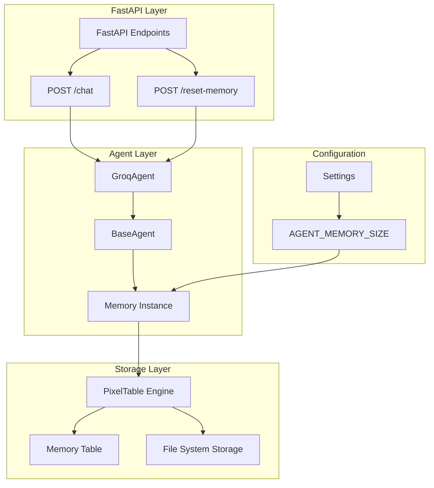
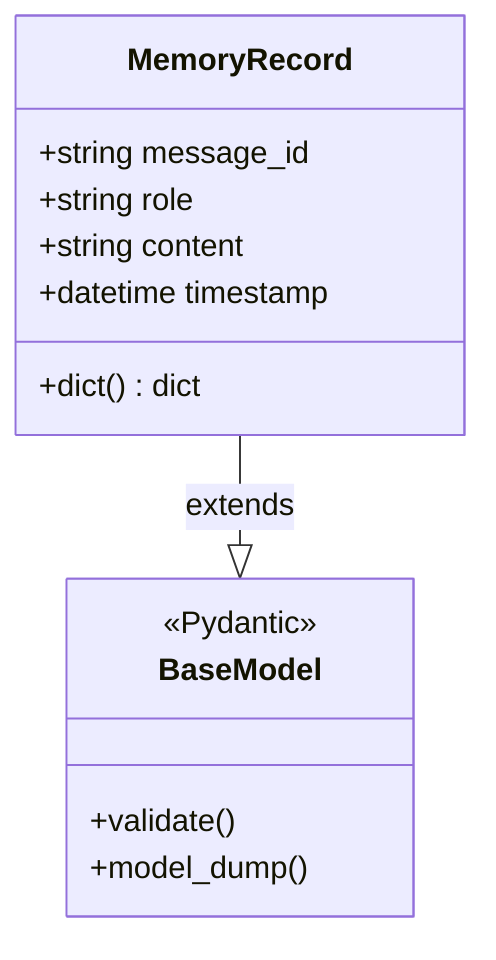
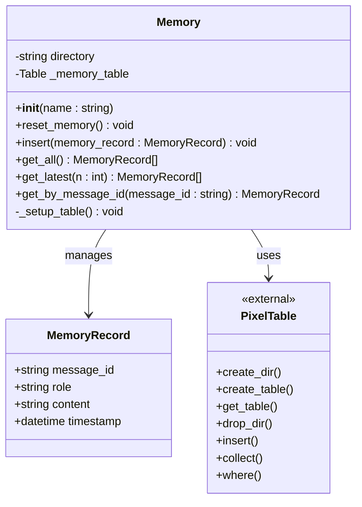
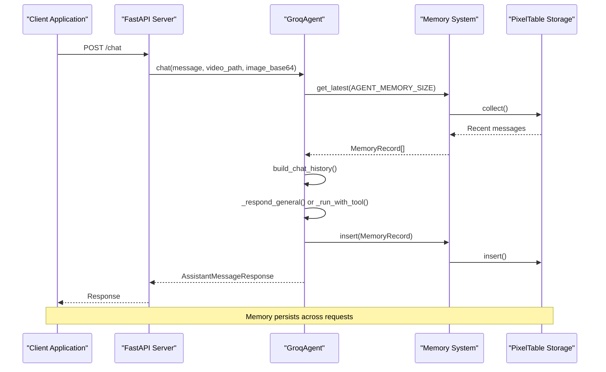
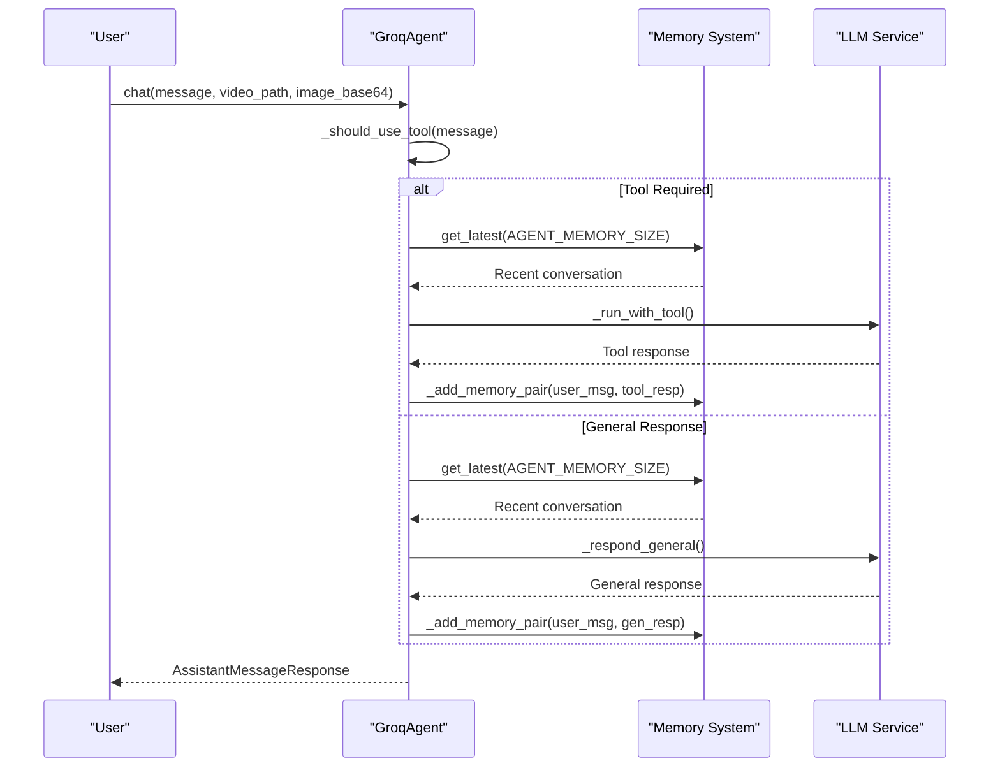
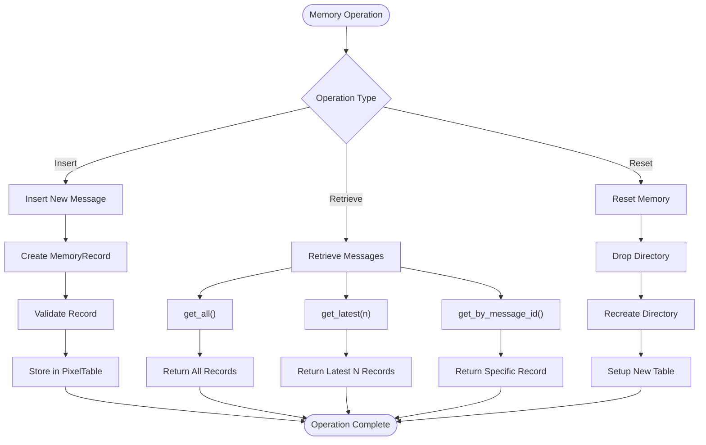

# Memory Management System

<cite>
**Referenced Files in This Document**
- [memory.py](file://vaas-api/src/vaas_api/agent/memory.py)
- [api.py](file://vaas-api/src/vaas_api/api.py)
- [groq_agent.py](file://vaas-api/src/vaas_api/agent/groq/groq_agent.py)
- [base_agent.py](file://vaas-api/src/vaas_api/agent/base_agent.py)
- [models.py](file://vaas-api/src/vaas_api/models.py)
- [config.py](file://vaas-api/src/vaas_api/config.py)
- [3_memory_playground.ipynb](file://vaas-api/notebooks/3_memory_playground.ipynb)
- [Dockerfile](file://vaas-api/Dockerfile)
</cite>

## Table of Contents
1. [Introduction](#introduction)
2. [System Architecture](#system-architecture)
3. [Memory Record Model](#memory-record-model)
4. [Memory Implementation](#memory-implementation)
5. [Integration with FastAPI](#integration-with-fastapi)
6. [Agent Memory Management](#agent-memory-management)
7. [Memory Operations](#memory-operations)
8. [Production Considerations](#production-considerations)
9. [Troubleshooting Guide](#troubleshooting-guide)
10. [Best Practices](#best-practices)

## Introduction

The memory management system in the vaas API provides persistent conversation history storage using PixelTable as the underlying database engine. This system enables multi-turn conversations by maintaining context across API requests, allowing the agent to provide coherent and contextual responses throughout user sessions.

The memory system is designed with several key principles:
- **Persistence**: Conversation history stored in durable, structured format
- **Scalability**: Efficient retrieval and management of conversation data
- **Privacy**: Session-based memory isolation with explicit reset capabilities
- **Performance**: Optimized queries for recent conversation context
- **Flexibility**: Configurable memory size and retrieval strategies

## System Architecture

The memory management system follows a layered architecture that integrates seamlessly with the FastAPI framework and agent components.



**Diagram sources**
- [api.py](file://vaas-api/src/vaas_api/api.py#L1-L198)
- [groq_agent.py](file://vaas-api/src/vaas_api/agent/groq/groq_agent.py#L1-L237)
- [memory.py](file://vaas-api/src/vaas_api/agent/memory.py#L1-L51)

## Memory Record Model

The `MemoryRecord` class serves as the fundamental data structure for storing individual conversation messages. It implements Pydantic validation and provides type safety across the system.



**Diagram sources**
- [memory.py](file://vaas-api/src/vaas_api/agent/memory.py#L6-L10)

### Key Features

- **message_id**: Unique identifier for each conversation turn
- **role**: Either "user" or "assistant" to distinguish speakers
- **content**: The actual message content as a string
- **timestamp**: Precise datetime tracking for conversation ordering

**Section sources**
- [memory.py](file://vaas-api/src/vaas_api/agent/memory.py#L6-L10)

## Memory Implementation

The `Memory` class provides the core functionality for managing conversation history using PixelTable as the backend storage engine.



**Diagram sources**
- [memory.py](file://vaas-api/src/vaas_api/agent/memory.py#L12-L51)

### Initialization Process

The memory system initializes with the following steps:

1. **Directory Creation**: Creates a dedicated directory for the agent's memory
2. **Table Setup**: Initializes the PixelTable with predefined schema
3. **Connection Establishment**: Establishes connection to the memory table

```python
def __init__(self, name: str):
    self.directory = name
    pxt.create_dir(self.directory, if_exists="replace_force")
    self._setup_table()
    self._memory_table = pxt.get_table(f"{self.directory}.memory")
```

**Section sources**
- [memory.py](file://vaas-api/src/vaas_api/agent/memory.py#L12-L20)

## Integration with FastAPI

The memory system integrates seamlessly with FastAPI through endpoint handlers and application lifecycle management.



**Diagram sources**
- [api.py](file://vaas-api/src/vaas_api/api.py#L95-L110)
- [groq_agent.py](file://vaas-api/src/vaas_api/agent/groq/groq_agent.py#L207-L237)

### Endpoint Integration

The `/reset-memory` endpoint provides explicit memory management:

```python
@app.post("/reset-memory")
async def reset_memory(fastapi_request: Request):
    agent = fastapi_request.app.state.agent
    agent.reset_memory()
    return ResetMemoryResponse(message="Memory reset successfully")
```

**Section sources**
- [api.py](file://vaas-api/src/vaas_api/api.py#L112-L118)

## Agent Memory Management

The GroqAgent class demonstrates sophisticated memory management patterns that integrate with the memory system.



**Diagram sources**
- [groq_agent.py](file://vaas-api/src/vaas_api/agent/groq/groq_agent.py#L207-L237)

### Memory Loading Strategy

The agent loads memory selectively based on conversation length and context requirements:

```python
def _build_chat_history(self, system_prompt: str, user_message: str, 
                       image_base64: Optional[str] = None, n: int = 20) -> List[Dict[str, Any]]:
    history = [{"role": "system", "content": system_prompt}]
    history += [{"role": record.role, "content": record.content} 
               for record in self.memory.get_latest(n)]
    # Add user message with optional image content
    return history
```

**Section sources**
- [groq_agent.py](file://vaas-api/src/vaas_api/agent/groq/groq_agent.py#L35-L50)

### Memory Update Process

After each interaction, the agent updates memory with both user and assistant messages:

```python
def _add_memory_pair(self, user_message: str, assistant_message: str) -> None:
    self._add_to_memory("user", user_message)
    self._add_to_memory("assistant", assistant_message)

def _add_to_memory(self, role: str, content: str) -> None:
    self.memory.insert(
        MemoryRecord(
            message_id=str(uuid.uuid4()),
            role=role,
            content=content,
            timestamp=datetime.now(),
        )
    )
```

**Section sources**
- [groq_agent.py](file://vaas-api/src/vaas_api/agent/groq/groq_agent.py#L199-L206)
- [groq_agent.py](file://vaas-api/src/vaas_api/agent/groq/groq_agent.py#L208-L215)

## Memory Operations

The memory system provides several key operations for managing conversation history:



**Diagram sources**
- [memory.py](file://vaas-api/src/vaas_api/agent/memory.py#L35-L51)

### Available Operations

1. **Insert**: Adds new conversation records
2. **Get All**: Retrieves complete conversation history
3. **Get Latest**: Retrieves most recent messages (configurable)
4. **Get by ID**: Retrieves specific message by identifier
5. **Reset**: Clears all conversation history

**Section sources**
- [memory.py](file://vaas-api/src/vaas_api/agent/memory.py#L35-L51)

## Production Considerations

### Scaling Memory Management

For production deployments, consider the following scaling strategies:

#### Database Backends
- **Current Implementation**: PixelTable with local file system storage
- **Alternative Options**: 
  - PostgreSQL with JSONB columns
  - MongoDB with embedded arrays
  - Redis with sorted sets for recent messages

#### TTL Policies
Implement time-based expiration for memory records:

```python
# Example TTL implementation
def cleanup_expired_messages(self, ttl_hours: int = 24):
    cutoff_time = datetime.now() - timedelta(hours=ttl_hours)
    expired_records = self._memory_table.where(
        self._memory_table.timestamp < cutoff_time
    ).collect()
    # Remove expired records
```

#### Memory Size Configuration
Configure memory size based on use case:

```python
# Current configuration
AGENT_MEMORY_SIZE: int = 20  # Number of recent messages to retain
```

### Privacy Compliance

Implement privacy measures for memory management:

1. **Session Isolation**: Separate memory directories per user/session
2. **Data Retention**: Clear memory on session termination
3. **Access Control**: Restrict memory access to authorized endpoints
4. **Audit Logging**: Log memory operations for compliance

### Performance Optimization

Optimize memory operations for high-throughput scenarios:

1. **Batch Inserts**: Group multiple inserts for efficiency
2. **Indexing**: Create indexes on frequently queried columns
3. **Caching**: Cache recent memory segments in memory
4. **Async Operations**: Use asynchronous operations for non-blocking performance

## Troubleshooting Guide

### Common Issues and Solutions

#### Context Overflow
**Problem**: Memory size exceeds LLM context limits
**Solution**: 
- Reduce `AGENT_MEMORY_SIZE` in configuration
- Implement automatic summarization of old conversations
- Use sliding window approach to maintain recent context

#### Irrelevant Memory Retrieval
**Problem**: Old, unrelated messages included in context
**Solution**:
- Implement semantic filtering using embeddings
- Add relevance scoring for memory retrieval
- Use conversation clustering to group related messages

#### Memory Leaks
**Problem**: Memory grows unbounded over time
**Solution**:
- Implement periodic cleanup jobs
- Set appropriate TTL policies
- Monitor memory usage metrics

#### Performance Degradation
**Problem**: Slow memory operations affecting response times
**Solution**:
- Optimize database queries
- Implement pagination for large datasets
- Use connection pooling
- Add caching for frequently accessed data

### Debugging Strategies

1. **Enable Logging**: Configure detailed logging for memory operations
2. **Monitor Metrics**: Track memory size, operation times, and error rates
3. **Test Scenarios**: Create test cases for various memory conditions
4. **Profiling**: Profile memory usage patterns under load

**Section sources**
- [config.py](file://vaas-api/src/vaas_api/config.py#L30-L32)

## Best Practices

### Memory Design Principles

1. **Session-Based Isolation**: Each user session maintains separate memory
2. **Configurable Limits**: Allow customization of memory size per use case
3. **Graceful Degradation**: Handle memory failures gracefully
4. **Consistent Timestamps**: Use UTC timestamps for global consistency

### Implementation Guidelines

1. **Atomic Operations**: Ensure memory operations are atomic
2. **Error Handling**: Implement robust error handling for all operations
3. **Validation**: Validate memory records before storage
4. **Documentation**: Document memory schema and operations clearly

### Security Considerations

1. **Input Sanitization**: Sanitize message content before storage
2. **Access Control**: Implement proper authorization checks
3. **Encryption**: Consider encrypting sensitive conversation data
4. **Backup Strategy**: Implement backup and recovery procedures

### Monitoring and Maintenance

1. **Health Checks**: Regular health checks for memory system
2. **Capacity Planning**: Monitor growth and plan for expansion
3. **Performance Metrics**: Track key performance indicators
4. **Alerting**: Set up alerts for memory-related issues

The memory management system provides a robust foundation for maintaining conversation context in the vaas API. By following these guidelines and best practices, developers can ensure reliable, scalable, and secure memory operations that enhance the user experience while maintaining system performance and compliance requirements.