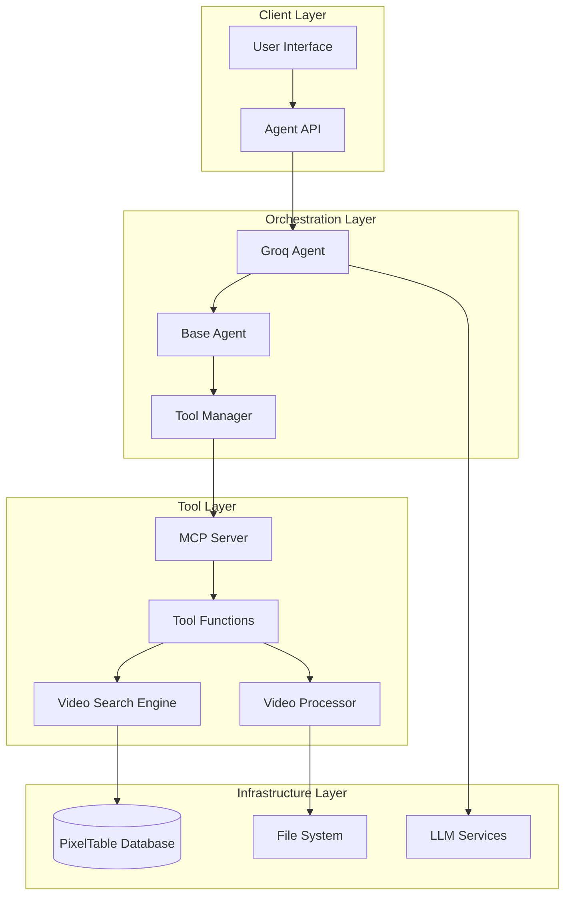
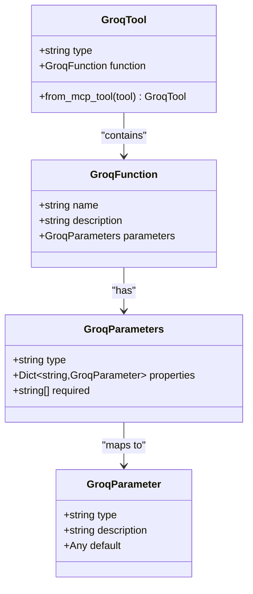
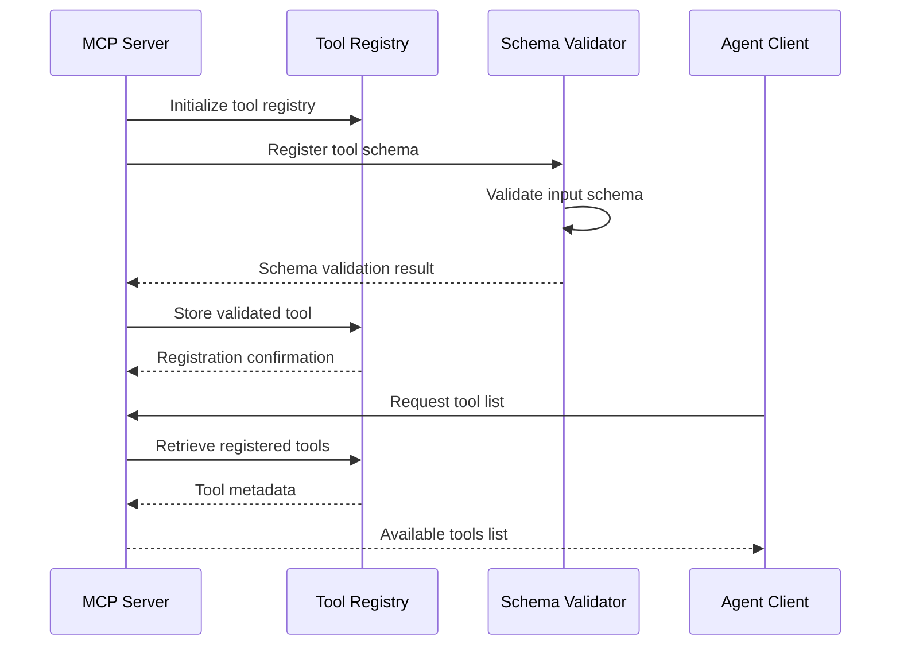
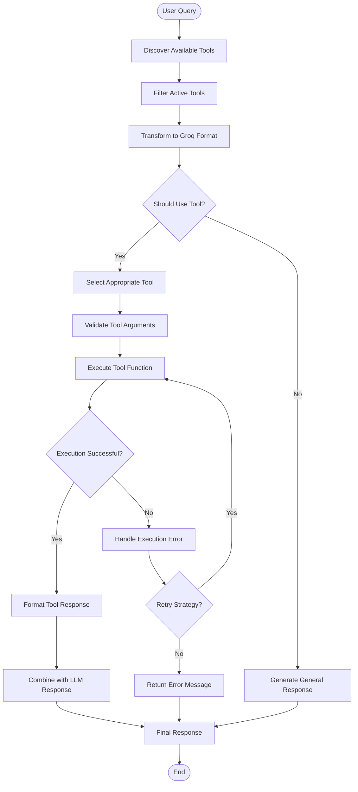
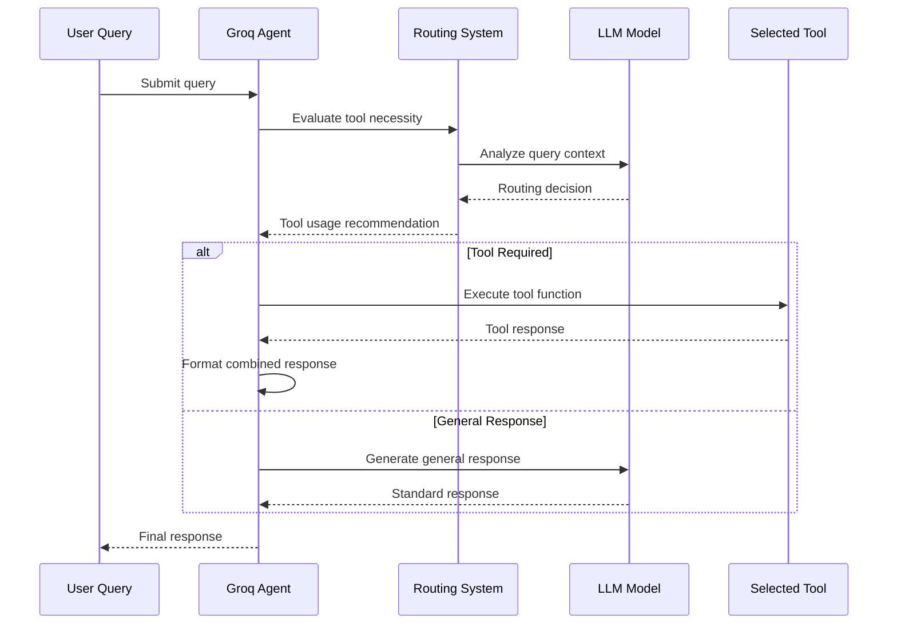
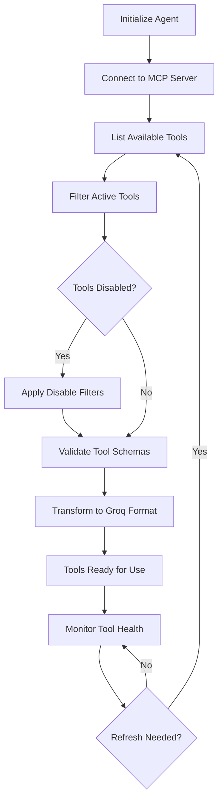
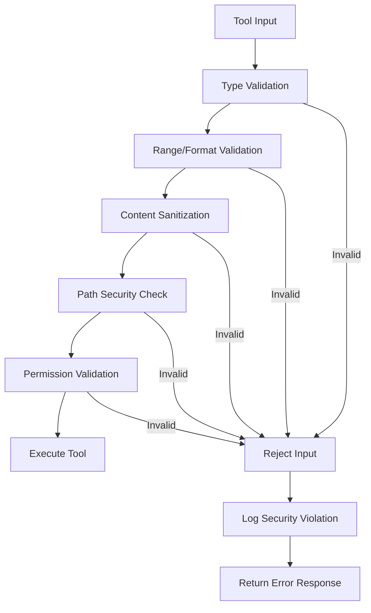
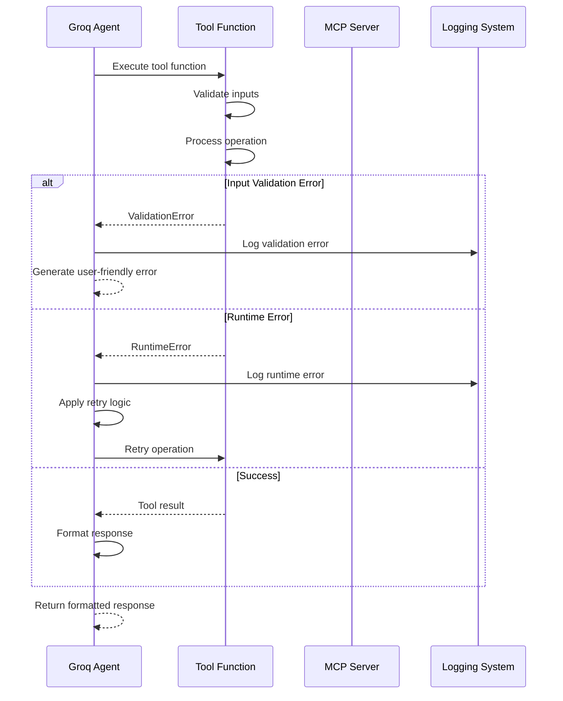

# Tool Orchestration System

<cite>
**Referenced Files in This Document**
- [groq_tool.py](file://vaas-api/src/vaas_api/agent/groq/groq_tool.py)
- [base_agent.py](file://vaas-api/src/vaas_api/agent/base_agent.py)
- [groq_agent.py](file://vaas-api/src/vaas_api/agent/groq/groq_agent.py)
- [tools.py](file://vaas-mcp/src/vaas_mcp/tools.py)
- [server.py](file://vaas-mcp/src/vaas_mcp/server.py)
- [video_processor.py](file://vaas-mcp/src/vaas_mcp/video/ingestion/video_processor.py)
- [video_search_engine.py](file://vaas-mcp/src/vaas_mcp/video/video_search_engine.py)
- [config.py](file://vaas-mcp/src/vaas_mcp/config.py)
- [1_tool_use_playground.ipynb](file://vaas-api/notebooks/1_tool_use_playground.ipynb)
</cite>

## Table of Contents
1. [Introduction](#introduction)
2. [System Architecture](#system-architecture)
3. [Tool Definition and Registration](#tool-definition-and-registration)
4. [Tool Orchestration Flow](#tool-orchestration-flow)
5. [Core Tool Implementations](#core-tool-implementations)
6. [Dynamic Tool Selection](#dynamic-tool-selection)
7. [Security and Validation](#security-and-validation)
8. [Error Handling and Recovery](#error-handling-and-recovery)
9. [Best Practices](#best-practices)
10. [Troubleshooting Guide](#troubleshooting-guide)

## Introduction

The tool orchestration system in the vaas multimodal agents architecture provides a sophisticated framework for integrating external tools with Large Language Models (LLMs) through the Model Context Protocol (MCP). This system enables dynamic tool discovery, validation, and execution while maintaining security and performance standards.

The orchestration system consists of three main components:
- **MCP Server**: Manages tool registration and execution
- **Groq Agent**: Handles LLM integration and tool selection
- **Tool Definitions**: Pydantic-based schemas for tool specification

## System Architecture

The tool orchestration system follows a layered architecture that separates concerns between tool definition, discovery, validation, and execution.



**Diagram sources**
- [groq_agent.py](file://vaas-api/src/vaas_api/agent/groq/groq_agent.py#L1-L50)
- [base_agent.py](file://vaas-api/src/vaas_api/agent/base_agent.py#L1-L30)
- [server.py](file://vaas-mcp/src/vaas_mcp/server.py#L1-L40)

## Tool Definition and Registration

### Pydantic-Based Tool Specifications

The system uses Pydantic models to define tool schemas, ensuring type safety and validation throughout the tool lifecycle.



**Diagram sources**
- [groq_tool.py](file://vaas-api/src/vaas_api/agent/groq/groq_tool.py#L1-L61)

### Tool Registration Process

The MCP server handles tool registration through a structured process:



**Diagram sources**
- [server.py](file://vaas-mcp/src/vaas_mcp/server.py#L15-L40)
- [base_agent.py](file://vaas-api/src/vaas_api/agent/base_agent.py#L60-L90)

**Section sources**
- [groq_tool.py](file://vaas-api/src/vaas_api/agent/groq/groq_tool.py#L1-L61)
- [server.py](file://vaas-mcp/src/vaas_mcp/server.py#L15-L40)

## Tool Orchestration Flow

### Complete Tool Execution Pipeline

The tool orchestration follows a sophisticated pipeline that handles discovery, validation, execution, and response formatting.



**Diagram sources**
- [groq_agent.py](file://vaas-api/src/vaas_api/agent/groq/groq_agent.py#L80-L150)
- [base_agent.py](file://vaas-api/src/vaas_api/agent/base_agent.py#L60-L90)

### Tool Selection Logic

The agent uses a routing system to determine when and which tools to use based on the user query and context.



**Diagram sources**
- [groq_agent.py](file://vaas-api/src/vaas_api/agent/groq/groq_agent.py#L80-L120)

**Section sources**
- [groq_agent.py](file://vaas-api/src/vaas_api/agent/groq/groq_agent.py#L80-L150)
- [base_agent.py](file://vaas-api/src/vaas_api/agent/base_agent.py#L60-L90)

## Core Tool Implementations

### Video Processing Tools

The system provides four primary video processing tools, each designed for specific use cases:

#### 1. Process Video Tool

```python
def process_video(video_path: str) -> str:
    """Process a video file and prepare it for searching."""
    exists = video_processor._check_if_exists(video_path)
    if exists:
        logger.info(f"Video index for '{video_path}' already exists and is ready for use.")
        return False
    video_processor.setup_table(video_name=video_path)
    is_done = video_processor.add_video(video_path=video_path)
    return is_done
```

This tool initializes video processing infrastructure, creating embedding indexes for audio transcripts, frame captions, and image embeddings.

#### 2. Get Video Clip from User Query

```python
def get_video_clip_from_user_query(video_path: str, user_query: str) -> str:
    """Get a video clip based on the user query using speech and caption similarity."""
    search_engine = VideoSearchEngine(video_path)
    
    speech_clips = search_engine.search_by_speech(user_query, settings.VIDEO_CLIP_SPEECH_SEARCH_TOP_K)
    caption_clips = search_engine.search_by_caption(user_query, settings.VIDEO_CLIP_CAPTION_SEARCH_TOP_K)
    
    # Compare similarity scores and select best match
    speech_sim = speech_clips[0]["similarity"] if speech_clips else 0
    caption_sim = caption_clips[0]["similarity"] if caption_clips else 0
    
    video_clip_info = speech_clips[0] if speech_sim > caption_sim else caption_clips[0]
    
    video_clip = extract_video_clip(
        video_path=video_path,
        start_time=video_clip_info["start_time"],
        end_time=video_clip_info["end_time"],
        output_path=f"./shared_media/{str(uuid4())}.mp4",
    )
    
    return video_clip.filename
```

#### 3. Get Video Clip from Image

```python
def get_video_clip_from_image(video_path: str, user_image: str) -> str:
    """Get a video clip based on similarity to a provided image."""
    search_engine = VideoSearchEngine(video_path)
    image_clips = search_engine.search_by_image(user_image, settings.VIDEO_CLIP_IMAGE_SEARCH_TOP_K)
    
    video_clip = extract_video_clip(
        video_path=video_path,
        start_time=image_clips[0]["start_time"],
        end_time=image_clips[0]["end_time"],
        output_path=f"./shared_media/{str(uuid4())}.mp4",
    )
    
    return video_clip.filename
```

#### 4. Ask Question About Video

```python
def ask_question_about_video(video_path: str, user_query: str) -> str:
    """Get relevant captions from the video based on the user's question."""
    search_engine = VideoSearchEngine(video_path)
    caption_info = search_engine.get_caption_info(user_query, settings.QUESTION_ANSWER_TOP_K)
    
    answer = "\n".join(entry["caption"] for entry in caption_info)
    return answer
```

**Section sources**
- [tools.py](file://vaas-mcp/src/vaas_mcp/tools.py#L1-L105)
- [video_search_engine.py](file://vaas-mcp/src/vaas_mcp/video/video_search_engine.py#L1-L168)

## Dynamic Tool Selection

### Tool Discovery and Filtering

The agent implements a sophisticated tool discovery mechanism that adapts to runtime conditions and user preferences.



**Diagram sources**
- [base_agent.py](file://vaas-api/src/vaas_api/agent/base_agent.py#L60-L90)

### Tool Description and Context Matching

The system uses comprehensive tool descriptions to enable intelligent tool selection:

```python
# Example tool descriptions from server.py
mcp.add_tool(
    name="process_video",
    description="Process a video file and prepare it for searching.",
    fn=process_video,
    tags={"video", "process"},
)

mcp.add_tool(
    name="get_video_clip_from_user_query",
    description="Use this tool to get a video clip from a video file based on a user query or question.",
    fn=get_video_clip_from_user_query,
    tags={"video", "clip", "query", "question"},
)
```

**Section sources**
- [base_agent.py](file://vaas-api/src/vaas_api/agent/base_agent.py#L60-L90)
- [server.py](file://vaas-mcp/src/vaas_mcp/server.py#L15-L40)

## Security and Validation

### Input Validation and Sanitization

The system implements multiple layers of validation to ensure secure tool execution:



### Tool Versioning and Deprecation

The system supports tool versioning through the MCP protocol, enabling gradual migration and backward compatibility:

```python
# Example of tool versioning in MCP server
mcp.add_tool(
    name="process_video",
    description="Process a video file (v2.0)",
    fn=process_video_v2,
    tags={"video", "process", "v2"},
    version="2.0"
)
```

**Section sources**
- [groq_tool.py](file://vaas-api/src/vaas_api/agent/groq/groq_tool.py#L30-L61)
- [base_agent.py](file://vaas-api/src/vaas_api/agent/base_agent.py#L50-L70)

## Error Handling and Recovery

### Comprehensive Error Management

The orchestration system implements robust error handling at multiple levels:



**Diagram sources**
- [groq_agent.py](file://vaas-api/src/vaas_api/agent/groq/groq_agent.py#L100-L130)

### Partial and Failed Execution Handling

The system gracefully handles partial failures and provides meaningful feedback:

```python
async def _execute_tool_call(self, tool_call: Any, video_path: str, image_base64: str | None = None) -> str:
    """Execute a single tool call and return its response."""
    function_name = tool_call.function.name
    function_args = json.loads(tool_call.function.arguments)
    
    function_args["video_path"] = video_path
    
    if function_name == "get_video_clip_from_image":
        function_args["user_image"] = image_base64
    
    logger.info(f"Executing tool: {function_name}")
    
    try:
        return await self.call_tool(function_name, function_args)
    except Exception as e:
        logger.error(f"Error executing tool {function_name}: {str(e)}")
        return f"Error executing tool {function_name}: {str(e)}"
```

**Section sources**
- [groq_agent.py](file://vaas-api/src/vaas_api/agent/groq/groq_agent.py#L100-L130)

## Best Practices

### Effective Tool Schema Design

1. **Clear Descriptions**: Provide comprehensive tool descriptions that explain purpose, parameters, and expected outcomes
2. **Type Safety**: Use strict type definitions to prevent runtime errors
3. **Default Values**: Specify sensible defaults for optional parameters
4. **Required Fields**: Clearly mark required parameters to improve user experience

### Tool Naming Conventions

```python
# Recommended naming patterns
process_video              # Action + noun
get_video_clip_from_user_query  # Action + noun + preposition + noun
ask_question_about_video     # Action + verb + preposition + noun
```

### Performance Optimization

1. **Caching**: Implement caching for expensive operations
2. **Async Operations**: Use asynchronous execution for I/O-bound tasks
3. **Resource Management**: Properly manage file handles and database connections
4. **Timeout Handling**: Set appropriate timeouts for tool execution

### Monitoring and Observability

The system integrates with Opik for comprehensive monitoring:

```python
@opik.track(name="tool-use", type="tool")
async def _run_with_tool(self, message: str, video_path: str, image_base64: str | None = None) -> str:
    # Tool execution logic
    pass
```

**Section sources**
- [groq_agent.py](file://vaas-api/src/vaas_api/agent/groq/groq_agent.py#L100-L150)
- [config.py](file://vaas-mcp/src/vaas_mcp/config.py#L1-L56)

## Troubleshooting Guide

### Common Issues and Solutions

#### Tool Discovery Failures

**Problem**: Agent cannot discover tools from MCP server
**Solution**: 
1. Verify MCP server is running and accessible
2. Check network connectivity and firewall settings
3. Validate MCP server configuration

```python
# Debugging tool discovery
async with self.mcp_client as client:
    try:
        tools = await client.list_tools()
        logger.info(f"Discovered {len(tools)} tools")
    except ConnectionError as e:
        logger.error(f"MCP connection failed: {e}")
```

#### Tool Execution Errors

**Problem**: Tool functions fail during execution
**Solution**:
1. Check file permissions and paths
2. Verify external service availability (OpenAI, Groq)
3. Review tool input validation

#### Memory and Resource Issues

**Problem**: Out of memory errors during video processing
**Solution**:
1. Adjust video processing parameters in config
2. Implement streaming processing for large videos
3. Monitor system resource usage

### Debugging Tools

The system provides comprehensive logging and debugging capabilities:

```python
# Enable debug logging
logger.add("debug.log", level="DEBUG")

# Tool execution logging
logger.info(f"Executing tool: {function_name}")
logger.info(f"Tool arguments: {function_args}")
logger.error(f"Tool execution failed: {error_message}")
```

**Section sources**
- [base_agent.py](file://vaas-api/src/vaas_api/agent/base_agent.py#L60-L90)
- [groq_agent.py](file://vaas-api/src/vaas_api/agent/groq/groq_agent.py#L100-L130)