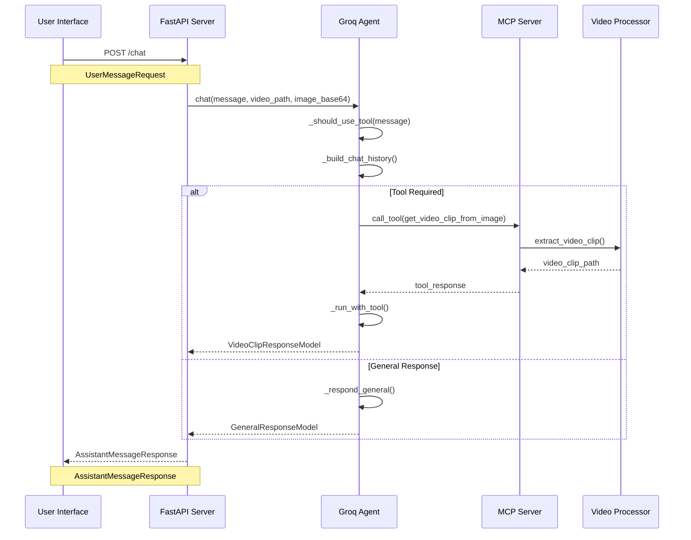
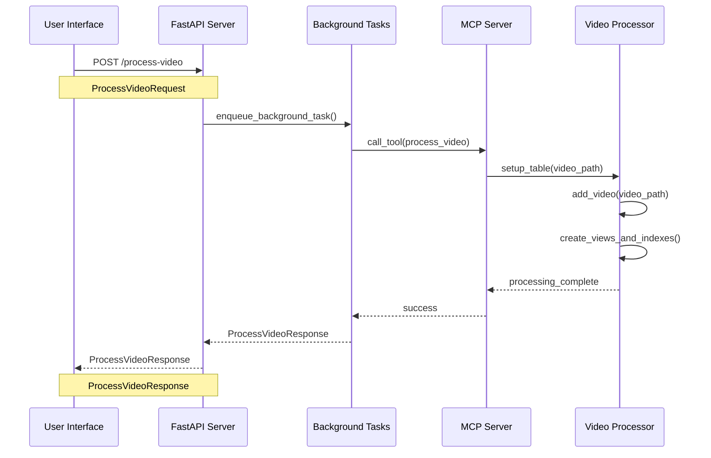
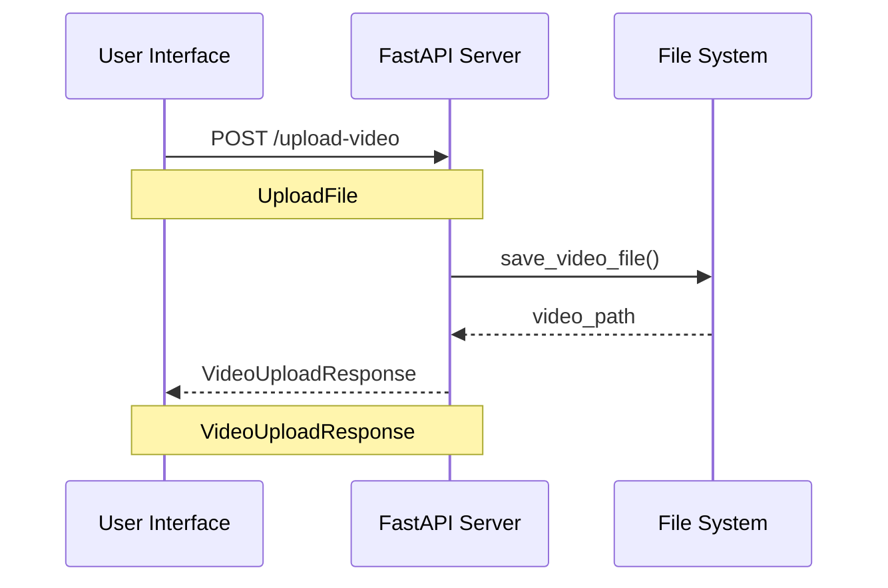
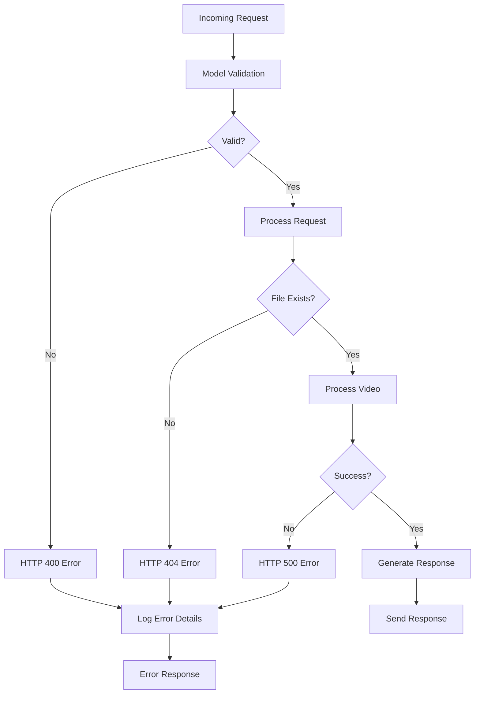
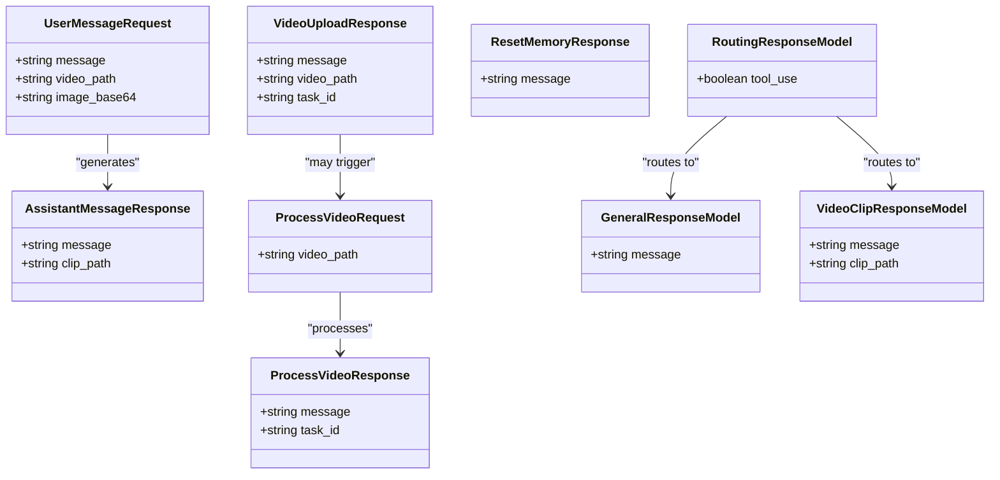
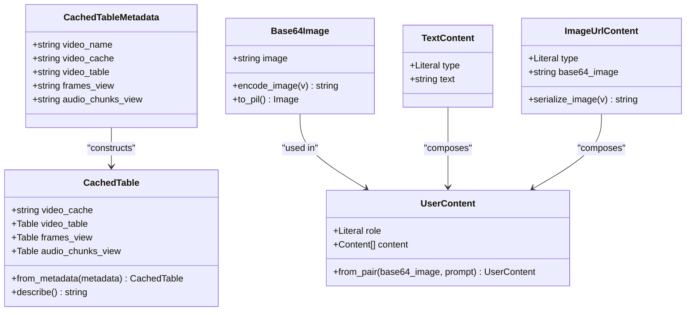
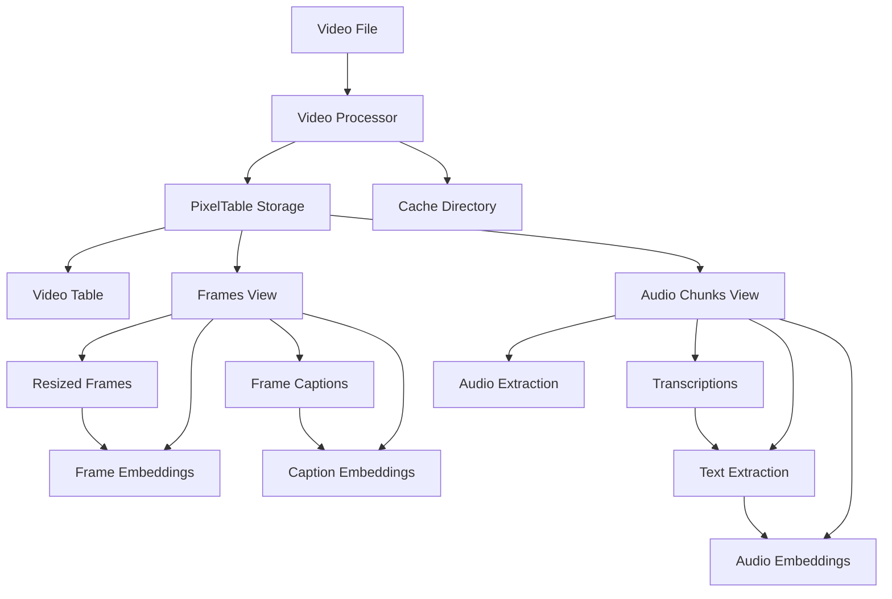

# Data Models

<cite>
**Referenced Files in This Document**
- [models.py](file://vaas-api/src/vaas_api/models.py)
- [video_processor.py](file://vaas-mcp/src/vaas_mcp/video/ingestion/video_processor.py)
- [models.py](file://vaas-mcp/src/vaas_mcp/video/ingestion/models.py)
- [video_search_engine.py](file://vaas-mcp/src/vaas_mcp/video/video_search_engine.py)
- [api.py](file://vaas-api/src/vaas_api/api.py)
- [groq_agent.py](file://vaas-api/src/vaas_api/agent/groq/groq_agent.py)
- [base_agent.py](file://vaas-api/src/vaas_api/agent/base_agent.py)
- [tools.py](file://vaas-mcp/src/vaas_mcp/tools.py)
- [tools.py](file://vaas-api/src/vaas_api/tools.py)
</cite>

## Table of Contents
1. [Introduction](#introduction)
2. [API Layer Models](#api-layer-models)
3. [Internal Video Processing Models](#internal-video-processing-models)
4. [System Architecture](#system-architecture)
5. [Request/Response Flow Analysis](#requestresponse-flow-analysis)
6. [Validation Rules and Error Conditions](#validation-rules-and-error-conditions)
7. [Schema Diagrams](#schema-diagrams)
8. [Sample Payloads](#sample-payloads)
9. [Best Practices](#best-practices)
10. [Troubleshooting](#troubleshooting)

## Introduction

The multimodal-agents-course system utilizes a comprehensive set of Pydantic models to define data structures for API communication, video processing, and agent interactions. These models ensure type safety, validation, and clear documentation of data flows between the frontend UI, API layer, MCP server, and video processing components.

The system is designed around two primary model categories:
- **API Layer Models**: Used for external communication between the UI and backend APIs
- **Internal Video Processing Models**: Used for video indexing, search, and retrieval operations

## API Layer Models

The API layer models define the contract between the frontend UI and the backend services. They handle user requests, agent responses, and video processing operations.

### UserMessageRequest

The primary input model for user interactions with the AI agent.

```python
class UserMessageRequest(BaseModel):
    message: str
    video_path: str | None = None
    image_base64: str | None = None
```

**Field Definitions:**
- `message`: The user's text query or instruction (required)
- `video_path`: Path to an associated video file (optional)
- `image_base64`: Base64-encoded image data for visual queries (optional)

**Purpose:** Enables multimodal interactions where users can provide text queries alongside video context or visual inputs for enhanced understanding.

**Constraints:**
- At least one of `video_path` or `image_base64` must be provided for multimodal queries
- `message` must be non-empty string
- Validation ensures proper base64 encoding for images

### AssistantMessageResponse

The response model for AI agent replies, potentially including video clips.

```python
class AssistantMessageResponse(BaseModel):
    message: str
    clip_path: str | None = None
```

**Field Definitions:**
- `message`: The AI's response text following vaas's style and personality (required)
- `clip_path`: Path to a generated video clip that supports the response (optional)

**Purpose:** Provides structured responses from the AI agent, potentially enriched with relevant video content.

**Constraints:**
- `message` must follow vaas's conversational style guidelines
- `clip_path` validation occurs during video generation and embedding

### ProcessVideoRequest

Initiates video processing operations for indexing and search capability.

```python
class ProcessVideoRequest(BaseModel):
    video_path: str
```

**Field Definitions:**
- `video_path`: Absolute or relative path to the video file to process (required)

**Purpose:** Triggers background video processing pipeline for search and retrieval operations.

**Constraints:**
- File must exist at the specified path
- Must be a valid video format supported by the system
- Path validation occurs during processing initiation

### ProcessVideoResponse

Confirms video processing task submission and provides task tracking information.

```python
class ProcessVideoResponse(BaseModel):
    message: str
    task_id: str
```

**Field Definitions:**
- `message`: Status message about the processing task (required)
- `task_id`: Unique identifier for tracking the background processing task (required)

**Purpose:** Enables asynchronous task monitoring and progress tracking.

**Constraints:**
- `task_id` must be globally unique UUID
- `message` provides human-readable status updates

### VideoUploadResponse

Handles video file uploads and provides feedback on successful processing.

```python
class VideoUploadResponse(BaseModel):
    message: str
    video_path: str | None = None
    task_id: str | None = None
```

**Field Definitions:**
- `message`: Upload status message (required)
- `video_path`: Local path where the video was stored (optional)
- `task_id`: Associated processing task ID (optional)

**Purpose:** Provides comprehensive feedback for video upload operations, including storage location and processing status.

**Constraints:**
- `video_path` is populated only if upload succeeds
- `task_id` appears if automatic processing is enabled

### ResetMemoryResponse

Confirms memory reset operations for the AI agent.

```python
class ResetMemoryResponse(BaseModel):
    message: str
```

**Field Definitions:**
- `message`: Confirmation message about memory reset operation (required)

**Purpose:** Provides feedback when clearing the agent's conversational memory.

**Constraints:**
- Simple confirmation without additional data
- Used for maintaining conversation context boundaries

### RoutingResponseModel

Structured output for determining whether tool usage is required.

```python
class RoutingResponseModel(BaseModel):
    tool_use: bool = Field(
        description="Whether the user's question requires a tool call."
    )
```

**Field Definitions:**
- `tool_use`: Boolean flag indicating if tool invocation is necessary (required)

**Purpose:** Enables intelligent routing decisions for tool usage vs. general conversation.

**Constraints:**
- Single-field model for efficient LLM processing
- Used in conjunction with instructor library for structured JSON output

### GeneralResponseModel

Standard response format for general AI interactions.

```python
class GeneralResponseModel(BaseModel):
    message: str = Field(
        description="Your response to the user's question, that needs to follow vaas's style and personality"
    )
```

**Field Definitions:**
- `message`: AI response following vaas's conversational style (required)

**Purpose:** Ensures consistent response formatting and personality adherence.

**Constraints:**
- Must follow predefined style guidelines
- Used for general conversation and non-tool-related responses

### VideoClipResponseModel

Specialized response for video clip generation and presentation.

```python
class VideoClipResponseModel(BaseModel):
    message: str = Field(
        description="A fun and engaging message to the user, asking them to watch the video clip, that needs to follow vaas's style and personality"
    )
    clip_path: str = Field(description="The path to the generated clip.")
```

**Field Definitions:**
- `message`: Engaging user prompt about watching the video clip (required)
- `clip_path`: Path to the generated video clip file (required)

**Purpose:** Provides contextual engagement when presenting video content to users.

**Constraints:**
- `clip_path` must reference a valid video file
- Message must follow vaas's personality guidelines
- Clip validation occurs during response generation

**Section sources**
- [models.py](file://vaas-api/src/vaas_api/models.py#L1-L54)

## Internal Video Processing Models

These models support the internal video indexing and search infrastructure, enabling sophisticated multimedia content retrieval.

### CachedTableMetadata

Stores metadata for cached video processing tables.

```python
class CachedTableMetadata(BaseModel):
    video_name: str = Field(..., description="Name of the video")
    video_cache: str = Field(..., description="Path to the video cache")
    video_table: str = Field(..., description="Root video table")
    frames_view: str = Field(..., description="Video frames which were split using a FPS and frame iterator")
    audio_chunks_view: str = Field(
        ...,
        description="After chunking audio, getting transcript and splitting it into sentences",
    )
```

**Field Definitions:**
- `video_name`: Unique identifier for the video index
- `video_cache`: Directory path for storing processed video data
- `video_table`: Root table name for video metadata storage
- `frames_view`: View name for frame-based video segments
- `audio_chunks_view`: View name for audio chunk processing

**Purpose:** Maintains persistent metadata for video processing caches, enabling efficient reuse of processed video data.

**Constraints:**
- All fields are required for cache reconstruction
- Paths must be valid and accessible
- Metadata integrity ensures proper cache restoration

### CachedTable

Runtime representation of cached video processing tables with computed properties.

```python
class CachedTable:
    video_cache: str = Field(...)
    video_table: pxt.Table = Field(...)
    frames_view: pxt.Table = Field(...)
    audio_chunks_view: pxt.Table = Field(...)
```

**Field Definitions:**
- `video_cache`: Directory path for video cache
- `video_table`: PixelTable instance for video metadata
- `frames_view`: View containing processed video frames
- `audio_chunks_view`: View containing audio chunks and transcriptions

**Purpose:** Provides runtime access to processed video data with lazy loading capabilities.

**Constraints:**
- Tables must be properly initialized before use
- Views are computed from root video table
- Memory management handles large video datasets efficiently

### Base64Image

Handles base64-encoded image data with validation and conversion capabilities.

```python
class Base64Image(BaseModel):
    image: str = Field(description="Base64 encoded image string")

    @field_validator("image", mode="before")
    def encode_image(cls, v):
        if isinstance(v, Image.Image):
            buffered = io.BytesIO()
            v.save(buffered, format="JPEG")
            return base64.b64encode(buffered.getvalue()).decode("utf-8")
        return v

    def to_pil(self) -> Image.Image:
        return Image.open(io.BytesIO(base64.b64decode(self.image)))
```

**Field Definitions:**
- `image`: Base64-encoded image string (required)

**Purpose:** Standardizes image handling across the system, supporting both direct base64 input and PIL Image conversion.

**Constraints:**
- Automatic validation ensures proper base64 format
- Conversion methods handle PIL Image to base64 and vice versa
- Supports JPEG format for optimal compression

### TextContent and ImageUrlContent

Content models for multimodal message construction.

```python
class TextContent(BaseModel):
    type: Literal["text"] = "text"
    text: str

class ImageUrlContent(BaseModel):
    type: Literal["image_url"] = "image_url"
    base64_image: str = Field(..., serialization_alias="image_url")
```

**Field Definitions:**
- `TextContent`: Simple text content with type marker
- `ImageUrlContent`: Image content with base64 data and serialization alias

**Purpose:** Enables structured content creation for multimodal AI interactions.

**Constraints:**
- Type markers ensure proper content routing
- Serialization aliases handle API compatibility
- Content validation ensures proper format

### UserContent

Complete user message content combining text and image elements.

```python
class UserContent(BaseModel):
    role: Literal["user"] = "user"
    content: List[Union[TextContent, ImageUrlContent]]
```

**Field Definitions:**
- `role`: Fixed role identifier for user messages
- `content`: List of mixed text and image content elements

**Purpose:** Provides comprehensive user input representation for multimodal interactions.

**Constraints:**
- Role must be "user" for consistency
- Content list enables flexible message composition
- Union type ensures proper content validation

**Section sources**
- [models.py](file://vaas-mcp/src/vaas_mcp/video/ingestion/models.py#L1-L119)

## System Architecture

The data model system follows a layered architecture that separates concerns between API communication, video processing, and agent interactions.

```mermaid
graph TB
subgraph "Frontend Layer"
UI[UI Components]
ChatInput[Chat Input]
VideoSidebar[Video Sidebar]
end
subgraph "API Layer"
APIServer[FastAPI Server]
ChatEndpoint[/chat Endpoint]
ProcessVideoEndpoint[/process-video Endpoint]
UploadEndpoint[/upload-video Endpoint]
end
subgraph "Agent Layer"
GroqAgent[Groq Agent]
BaseAgent[Base Agent]
Memory[Memory Manager]
end
subgraph "MCP Server"
VideoProcessor[Video Processor]
SearchEngine[Video Search Engine]
Tools[MCP Tools]
end
subgraph "Storage Layer"
PixelTable[PixelTable Storage]
VideoCache[Video Cache]
SharedMedia[Shared Media]
end
UI --> APIServer
ChatInput --> ChatEndpoint
VideoSidebar --> ProcessVideoEndpoint
APIServer --> GroqAgent
GroqAgent --> BaseAgent
BaseAgent --> Memory
GroqAgent --> Tools
Tools --> VideoProcessor
VideoProcessor --> SearchEngine
SearchEngine --> PixelTable
VideoProcessor --> VideoCache
Tools --> SharedMedia
```

**Diagram sources**
- [api.py](file://vaas-api/src/vaas_api/api.py#L1-L198)
- [groq_agent.py](file://vaas-api/src/vaas_api/agent/groq/groq_agent.py#L1-L237)
- [video_processor.py](file://vaas-mcp/src/vaas_mcp/video/ingestion/video_processor.py#L1-L205)

## Request/Response Flow Analysis

The system implements sophisticated request/response flows that leverage the defined data models throughout the processing pipeline.

### Chat Interaction Flow



**Diagram sources**
- [api.py](file://vaas-api/src/vaas_api/api.py#L95-L110)
- [groq_agent.py](file://vaas-api/src/vaas_api/agent/groq/groq_agent.py#L100-L200)

### Video Processing Flow



**Diagram sources**
- [api.py](file://vaas-api/src/vaas_api/api.py#L65-L90)
- [tools.py](file://vaas-mcp/src/vaas_mcp/tools.py#L15-L35)

### Video Upload Flow



**Diagram sources**
- [api.py](file://vaas-api/src/vaas_api/api.py#L115-L140)

**Section sources**
- [api.py](file://vaas-api/src/vaas_api/api.py#L65-L140)
- [groq_agent.py](file://vaas-api/src/vaas_api/agent/groq/groq_agent.py#L100-L200)

## Validation Rules and Error Conditions

The system implements comprehensive validation rules across all data models to ensure data integrity and prevent runtime errors.

### Model-Level Validation

Each Pydantic model defines specific validation rules:

**Required Fields:**
- All models require proper initialization with required fields
- Optional fields have sensible defaults when appropriate

**Type Constraints:**
- String fields enforce length and format requirements
- Path fields validate file existence and accessibility
- Base64 fields ensure proper encoding

**Cross-Field Dependencies:**
- `UserMessageRequest` validates that at least one context field is provided
- `VideoClipResponseModel` ensures `clip_path` references valid video files
- `ProcessVideoRequest` validates file existence before processing

### Runtime Validation

The system performs additional validation during processing:

**File System Validation:**
- Video file existence checks before processing
- Directory permissions verification for cache storage
- Disk space availability monitoring

**Processing Validation:**
- Video format compatibility checking
- Audio extraction success verification
- Frame processing completeness validation

**Memory Management:**
- Large video dataset handling with streaming
- Cache cleanup on memory pressure
- Resource cleanup on processing failure

### Error Handling Patterns



**Diagram sources**
- [api.py](file://vaas-api/src/vaas_api/api.py#L65-L90)
- [groq_agent.py](file://vaas-api/src/vaas_api/agent/groq/groq_agent.py#L120-L150)

**Section sources**
- [api.py](file://vaas-api/src/vaas_api/api.py#L65-L140)
- [groq_agent.py](file://vaas-api/src/vaas_api/agent/groq/groq_agent.py#L120-L150)

## Schema Diagrams

### Core Model Relationships



**Diagram sources**
- [models.py](file://vaas-api/src/vaas_api/models.py#L1-L54)

### Internal Video Processing Architecture



**Diagram sources**
- [models.py](file://vaas-mcp/src/vaas_mcp/video/ingestion/models.py#L1-L119)

### Video Processing Pipeline



**Diagram sources**
- [video_processor.py](file://vaas-mcp/src/vaas_mcp/video/ingestion/video_processor.py#L1-L205)

**Section sources**
- [models.py](file://vaas-api/src/vaas_api/models.py#L1-L54)
- [models.py](file://vaas-mcp/src/vaas_mcp/video/ingestion/models.py#L1-L119)
- [video_processor.py](file://vaas-mcp/src/vaas_mcp/video/ingestion/video_processor.py#L1-L205)

## Sample Payloads

### User Message Request Example

```json
{
  "message": "What happens in the first half of the game?",
  "video_path": "/videos/soccer_match.mp4",
  "image_base64": null
}
```

**Usage Context:** General question about video content without visual context.

### Multimodal User Message Request Example

```json
{
  "message": "Can you explain this play?",
  "video_path": "/videos/basketball_game.mp4",
  "image_base64": "iVBORw0KGgoAAAANSUhEUgAAAAEAAAABCAYAAAAfFcSJAAAADUlEQVR42mP8/5+hHgAHggJ/PchI7wAAAABJRU5ErkJggg=="
}
```

**Usage Context:** Visual query requiring both video context and image analysis.

### Assistant Message Response Example

```json
{
  "message": "The play involves a quick pass from the point guard to the shooting guard, followed by a screen set by the power forward.",
  "clip_path": "/shared_media/generated_clip_12345.mp4"
}
```

**Usage Context:** AI response with embedded video clip for demonstration.

### Video Processing Request Example

```json
{
  "video_path": "/videos/soccer_match.mp4"
}
```

**Usage Context:** Initiates background video processing for search capabilities.

### Video Processing Response Example

```json
{
  "message": "Task enqueued for processing",
  "task_id": "550e8400-e29b-41d4-a716-446655440000"
}
```

**Usage Context:** Confirms background processing task creation.

### Video Upload Response Example

```json
{
  "message": "Video uploaded successfully",
  "video_path": "/shared_media/soccer_match.mp4",
  "task_id": "550e8400-e29b-41d4-a716-446655440001"
}
```

**Usage Context:** Provides upload confirmation with storage location and processing task.

### Routing Response Example

```json
{
  "tool_use": true
}
```

**Usage Context:** Indicates that tool usage is required for the current query.

### General Response Example

```json
{
  "message": "Great question! The game started with both teams playing aggressively on defense."
}
```

**Usage Context:** Standard AI response for non-tool-related queries.

### Video Clip Response Example

```json
{
  "message": "Here's a clip showing the opening kickoff. Watch how the teams position themselves!",
  "clip_path": "/shared_media/clip_opening_kickoff.mp4"
}
```

**Usage Context:** Engaging user prompt with video clip attachment.

**Section sources**
- [api.py](file://vaas-api/src/vaas_api/api.py#L95-L110)
- [groq_agent.py](file://vaas-api/src/vaas_api/agent/groq/groq_agent.py#L100-L200)

## Best Practices

### Model Design Principles

1. **Single Responsibility**: Each model serves a specific purpose in the data flow
2. **Minimal Dependencies**: Models minimize external dependencies for portability
3. **Clear Field Descriptions**: Comprehensive field documentation for maintainability
4. **Optional Fields**: Use optional fields appropriately with sensible defaults

### Validation Strategies

1. **Pydantic Validation**: Leverage built-in Pydantic validation for type safety
2. **Custom Validators**: Implement custom validators for complex business logic
3. **Runtime Validation**: Perform additional validation during processing
4. **Error Handling**: Provide meaningful error messages for validation failures

### Performance Considerations

1. **Lazy Loading**: Load video processing tables on-demand
2. **Caching**: Cache processed video data to avoid redundant processing
3. **Streaming**: Process large videos in chunks to manage memory usage
4. **Resource Cleanup**: Properly clean up temporary files and database connections

### Security Guidelines

1. **Input Sanitization**: Validate all user inputs to prevent injection attacks
2. **File Path Validation**: Sanitize file paths to prevent directory traversal
3. **Access Control**: Implement proper access controls for video files
4. **Rate Limiting**: Implement rate limiting for video processing operations

## Troubleshooting

### Common Issues and Solutions

**Video Processing Failures:**
- Verify video file format compatibility
- Check disk space availability
- Ensure proper file permissions
- Validate video file integrity

**Memory Issues:**
- Monitor memory usage during video processing
- Implement streaming for large videos
- Clean up temporary files regularly
- Use pagination for large result sets

**Model Validation Errors:**
- Check field types and required fields
- Verify base64 encoding for image data
- Validate file paths and existence
- Review constraint violations

**Tool Execution Failures:**
- Verify MCP server connectivity
- Check tool availability and parameters
- Validate video file accessibility
- Review error logs for detailed information

### Debugging Techniques

1. **Logging**: Enable detailed logging for troubleshooting
2. **Error Tracking**: Use Opik for distributed tracing and error tracking
3. **Health Checks**: Implement health checks for system components
4. **Monitoring**: Monitor system metrics and resource usage

### Performance Optimization

1. **Index Optimization**: Optimize database indexes for search operations
2. **Caching Strategy**: Implement multi-level caching for frequently accessed data
3. **Concurrent Processing**: Use background tasks for long-running operations
4. **Resource Pooling**: Pool database connections and other resources

**Section sources**
- [api.py](file://vaas-api/src/vaas_api/api.py#L65-L90)
- [groq_agent.py](file://vaas-api/src/vaas_api/agent/groq/groq_agent.py#L120-L150)
- [video_processor.py](file://vaas-mcp/src/vaas_mcp/video/ingestion/video_processor.py#L150-L205)