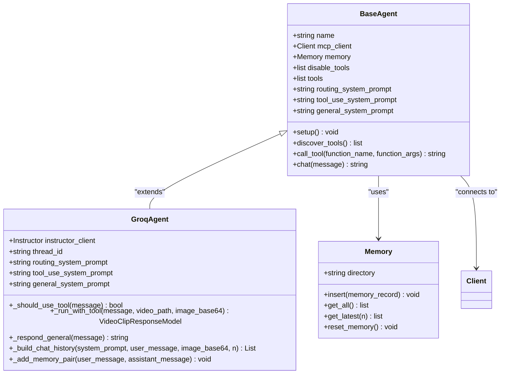
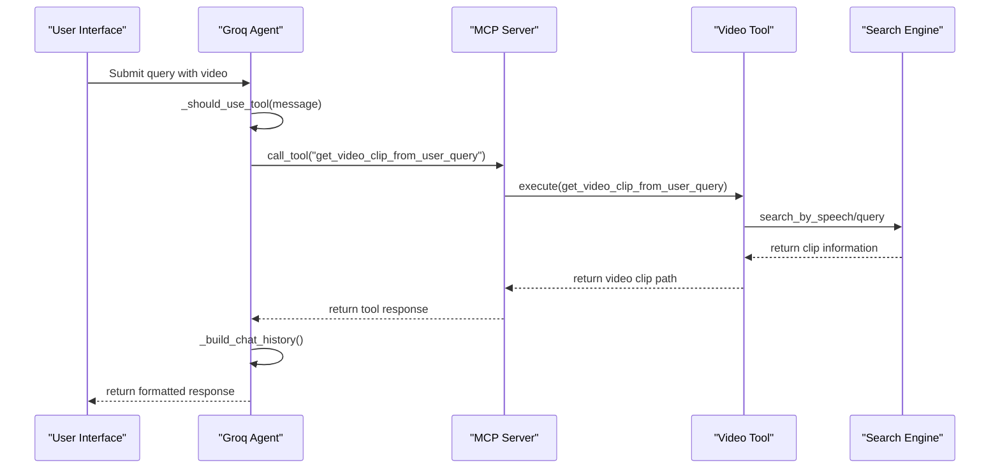
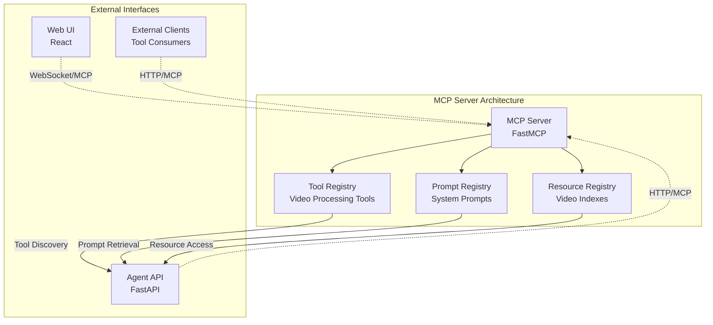
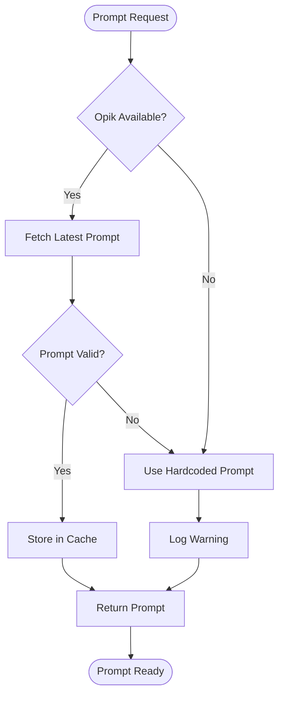
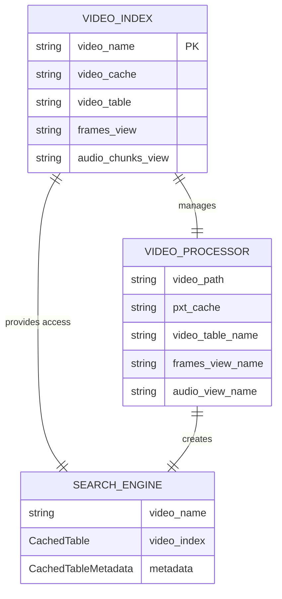
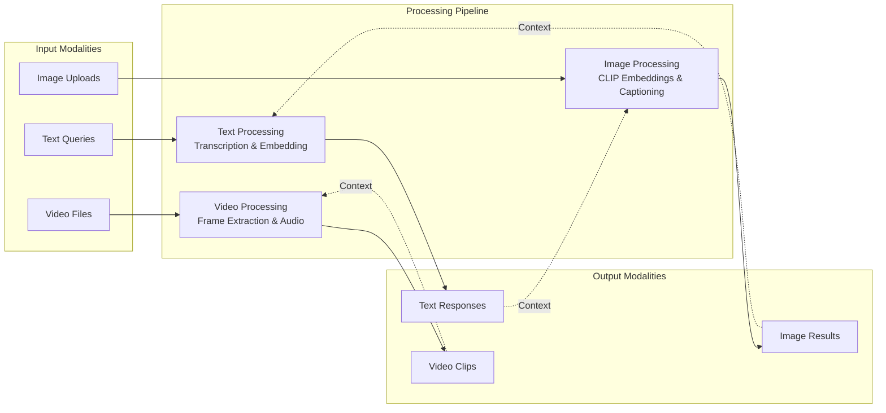
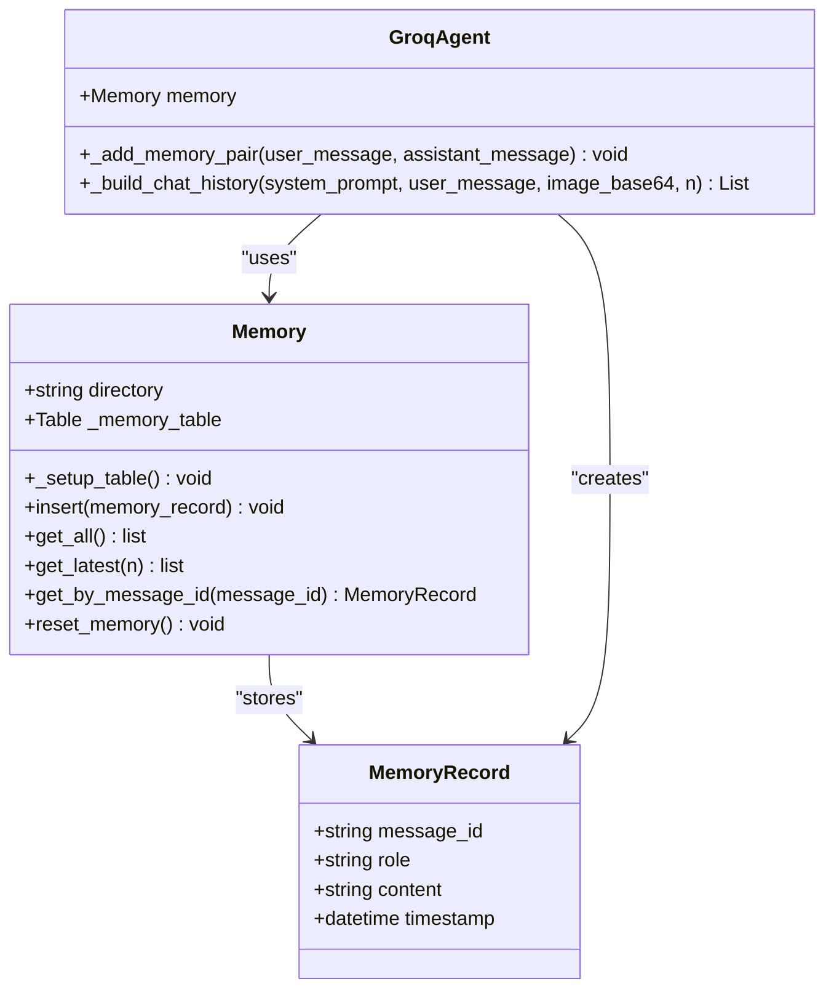
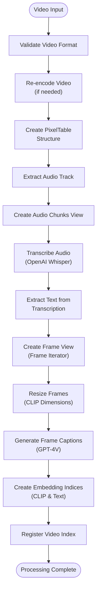
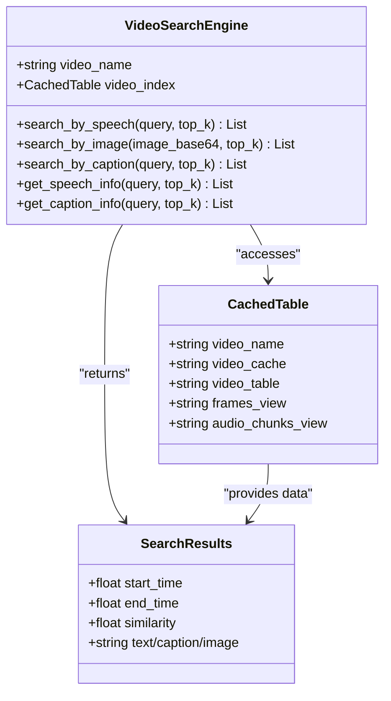

# Glossary of Terms

<cite>
**Referenced Files in This Document**
- [vaas-api/src/vaas_api/agent/base_agent.py](file://vaas-api/src/vaas_api/agent/base_agent.py)
- [vaas-api/src/vaas_api/agent/groq/groq_agent.py](file://vaas-api/src/vaas_api/agent/groq/groq_agent.py)
- [vaas-api/src/vaas_api/agent/memory.py](file://vaas-api/src/vaas_api/agent/memory.py)
- [vaas-mcp/src/vaas_mcp/server.py](file://vaas-mcp/src/vaas_mcp/server.py)
- [vaas-mcp/src/vaas_mcp/prompts.py](file://vaas-mcp/src/vaas_mcp/prompts.py)
- [vaas-mcp/src/vaas_mcp/tools.py](file://vaas-mcp/src/vaas_mcp/tools.py)
- [vaas-mcp/src/vaas_mcp/video/video_search_engine.py](file://vaas-mcp/src/vaas_mcp/video/video_search_engine.py)
- [vaas-mcp/src/vaas_mcp/video/ingestion/video_processor.py](file://vaas-mcp/src/vaas_mcp/video/ingestion/video_processor.py)
- [vaas-mcp/src/vaas_mcp/resources.py](file://vaas-mcp/src/vaas_mcp/resources.py)
- [vaas-ui/src/components/ChatInput.tsx](file://vaas-ui/src/components/ChatInput.tsx)
- [vaas-api/src/vaas_api/api.py](file://vaas-api/src/vaas_api/api.py)
- [vaas-api/notebooks/1_tool_use_playground.ipynb](file://vaas-api/notebooks/1_tool_use_playground.ipynb)
- [vaas-mcp/notebooks/video_ingestion_process.ipynb](file://vaas-mcp/notebooks/video_ingestion_process.ipynb)
</cite>

## Table of Contents
1. [Introduction](#introduction)
2. [Agent](#agent)
3. [Tool](#tool)
4. [MCP (Model Context Protocol)](#mcp-model-context-protocol)
5. [Prompt](#prompt)
6. [Resource](#resource)
7. [Multimodal](#multimodal)
8. [Memory](#memory)
9. [Ingestion Pipeline](#ingestion-pipeline)
10. [Video Search Engine](#video-search-engine)
11. [Conclusion](#conclusion)

## Introduction

This glossary defines key terms used throughout the vaas multimodal agents course documentation and codebase. Each term is explained with its technical implementation context, related components, and usage examples from the code. These concepts form the foundation of the vaas system, which enables intelligent video processing through AI-driven components.

## Agent

**Definition**: An AI decision-making component that routes queries to appropriate tools and manages conversation context.

**Technical Implementation**: The Agent serves as the central orchestrator in the vaas system, responsible for interpreting user requests and determining the appropriate course of action. The system implements a hierarchical agent architecture with the `BaseAgent` class serving as the foundation.

**Diagram sources**
- [vaas-api/src/vaas_api/agent/base_agent.py](file://vaas-api/src/vaas_api/agent/base_agent.py#L10-L36)
- [vaas-api/src/vaas_api/agent/groq/groq_agent.py](file://vaas-api/src/vaas_api/agent/groq/groq_agent.py#L15-L50)
- [vaas-api/src/vaas_api/agent/memory.py](file://vaas-api/src/vaas_api/agent/memory.py#L10-L49)

**Key Features**:
- **Query Routing**: Determines whether a tool is needed based on user intent
- **Context Management**: Maintains conversation history and memory
- **Tool Orchestration**: Coordinates with MCP server to execute appropriate tools
- **Multi-modal Support**: Handles text, image, and video inputs

**Usage Example**: The GroqAgent processes user queries by first checking if tool usage is required, then either executing tools or providing general responses based on the conversation context.

**Section sources**
- [vaas-api/src/vaas_api/agent/base_agent.py](file://vaas-api/src/vaas_api/agent/base_agent.py#L10-L109)
- [vaas-api/src/vaas_api/agent/groq/groq_agent.py](file://vaas-api/src/vaas_api/agent/groq/groq_agent.py#L50-L235)

## Tool

**Definition**: A function exposed via the Model Context Protocol (MCP) for specific actions like video processing, extraction, and information retrieval.

**Technical Implementation**: Tools are the functional building blocks of the vaas system, implemented as callable functions that integrate with the MCP framework. The system exposes four primary tools for video processing operations.

**Diagram sources**
- [vaas-api/src/vaas_api/agent/groq/groq_agent.py](file://vaas-api/src/vaas_api/agent/groq/groq_agent.py#L75-L166)
- [vaas-mcp/src/vaas_mcp/server.py](file://vaas-mcp/src/vaas_mcp/server.py#L15-L40)

**Available Tools**:
1. **process_video**: Prepares video files for searching by extracting audio, creating frame views, and generating embeddings
2. **get_video_clip_from_user_query**: Extracts video clips based on text queries using speech and caption similarity
3. **get_video_clip_from_image**: Retrieves clips based on image similarity using CLIP embeddings
4. **ask_question_about_video**: Answers questions by searching relevant captions and speech content

**Implementation Details**: Tools are registered with the MCP server and transformed into the format expected by the Groq API, enabling seamless integration between the agent and video processing capabilities.

**Section sources**
- [vaas-mcp/src/vaas_mcp/server.py](file://vaas-mcp/src/vaas_mcp/server.py#L15-L40)
- [vaas-mcp/src/vaas_mcp/tools.py](file://vaas-mcp/src/vaas_mcp/tools.py#L15-L103)

## MCP (Model Context Protocol)

**Definition**: The Model Context Protocol server that enables tool orchestration, prompt management, and resource sharing between AI components.

**Technical Implementation**: MCP serves as the communication backbone for the vaas system, implementing the Model Context Protocol specification to enable standardized tool discovery, invocation, and resource management.

**Diagram sources**
- [vaas-mcp/src/vaas_mcp/server.py](file://vaas-mcp/src/vaas_mcp/server.py#L43-L95)

**Core Components**:
- **Tool Registry**: Manages video processing functions and their metadata
- **Prompt Registry**: Stores and version-controls system prompts
- **Resource Registry**: Tracks video indexes and their associated metadata
- **Transport Layer**: Supports HTTP streaming and WebSocket protocols

**Communication Protocol**: Uses streamable HTTP transport by default, enabling real-time tool discovery and invocation across distributed components.

**Section sources**
- [vaas-mcp/src/vaas_mcp/server.py](file://vaas-mcp/src/vaas_mcp/server.py#L43-L95)

## Prompt

**Definition**: Structured input that guides Large Language Model (LLM) behavior and determines the AI's response style and capabilities.

**Technical Implementation**: Prompts in vaas are managed through Opik, a prompt versioning and management platform, allowing dynamic updates and A/B testing of AI behaviors.

**Diagram sources**
- [vaas-mcp/src/vaas_mcp/prompts.py](file://vaas-mcp/src/vaas_mcp/prompts.py#L74-L107)

**Types of Prompts**:
1. **Routing System Prompt**: Determines whether tool usage is required
2. **Tool Use System Prompt**: Guides tool selection and execution
3. **General System Prompt**: Provides personality and contextual information

**Implementation**: Each prompt is version-controlled and can be dynamically updated without requiring system restarts, enabling continuous improvement of AI behaviors.

**Section sources**
- [vaas-mcp/src/vaas_mcp/prompts.py](file://vaas-mcp/src/vaas_mcp/prompts.py#L0-L107)

## Resource

**Definition**: Data or service accessible by tools, representing the underlying infrastructure and metadata that support video processing operations.

**Technical Implementation**: Resources in vaas encompass video indexes, metadata registries, and cached processing results that enable efficient video search and retrieval operations.

**Diagram sources**
- [vaas-mcp/src/vaas_mcp/video/ingestion/registry.py](file://vaas-mcp/src/vaas_mcp/video/ingestion/registry.py#L61-L97)

**Key Resources**:
- **Video Indexes**: Pre-processed video metadata and embeddings
- **Frame Views**: Individual video frames with captions and embeddings
- **Audio Chunks**: Transcribed audio segments with similarity indices
- **Cache Directories**: Temporary storage for intermediate processing results

**Management**: Resources are automatically registered and tracked through the global registry system, enabling efficient resource discovery and cleanup.

**Section sources**
- [vaas-mcp/src/vaas_mcp/resources.py](file://vaas-mcp/src/vaas_mcp/resources.py)
- [vaas-mcp/src/vaas_mcp/video/ingestion/registry.py](file://vaas-mcp/src/vaas_mcp/video/ingestion/registry.py#L24-L97)

## Multimodal

**Definition**: The ability to handle multiple input types including text, images, and video simultaneously for comprehensive understanding and processing.

**Technical Implementation**: vaas's multimodal capabilities are built around PixelTable, a unified data processing framework that handles heterogeneous media types through specialized functions and embedding models.

**Diagram sources**
- [vaas-mcp/src/vaas_mcp/video/ingestion/video_processor.py](file://vaas-mcp/src/vaas_mcp/video/ingestion/video_processor.py#L145-L180)
- [vaas-ui/src/components/ChatInput.tsx](file://vaas-ui/src/components/ChatInput.tsx#L1-L64)

**Processing Capabilities**:
- **Text-to-Speech**: Converts text queries into audio embeddings for similarity search
- **Image-to-Image**: Uses CLIP models for visual similarity matching
- **Video-to-Text**: Extracts captions and transcriptions from video content
- **Cross-Modal Search**: Enables queries across different modalities (e.g., image-based video search)

**Implementation**: The multimodal system leverages OpenAI's GPT-4V for image understanding and CLIP models for cross-modal similarity computation, providing robust handling of diverse input types.

**Section sources**
- [vaas-mcp/src/vaas_mcp/video/ingestion/video_processor.py](file://vaas-mcp/src/vaas_mcp/video/ingestion/video_processor.py#L145-L180)
- [vaas-ui/src/components/ChatInput.tsx](file://vaas-ui/src/components/ChatInput.tsx#L1-L137)

## Memory

**Definition**: Conversation context storage mechanism that maintains historical interactions and enables coherent dialogue across sessions.

**Technical Implementation**: Memory management in vaas utilizes PixelTable for persistent storage of conversation records, enabling efficient retrieval and context-aware responses.

**Diagram sources**
- [vaas-api/src/vaas_api/agent/memory.py](file://vaas-api/src/vaas_api/agent/memory.py#L7-L49)
- [vaas-api/src/vaas_api/agent/groq/groq_agent.py](file://vaas-api/src/vaas_api/agent/groq/groq_agent.py#L50-L73)

**Features**:
- **Persistent Storage**: Conversations stored in PixelTable for durability
- **Selective Retrieval**: Configurable history length for optimal context
- **Role-Based Organization**: Separates user and assistant messages for clarity
- **Timestamp Tracking**: Maintains temporal ordering for conversation flow

**Usage Pattern**: The memory system automatically captures both user and assistant messages, maintaining a complete conversation history while respecting privacy and performance constraints.

**Section sources**
- [vaas-api/src/vaas_api/agent/memory.py](file://vaas-api/src/vaas_api/agent/memory.py#L0-L49)
- [vaas-api/src/vaas_api/agent/groq/groq_agent.py](file://vaas-api/src/vaas_api/agent/groq/groq_agent.py#L197-L235)

## Ingestion Pipeline

**Definition**: The process of indexing video content by extracting audio, creating frame views, and generating embeddings for efficient search and retrieval.

**Technical Implementation**: The ingestion pipeline transforms raw video files into searchable multimedia databases through systematic processing stages that capture both visual and auditory information.

**Diagram sources**
- [vaas-mcp/src/vaas_mcp/video/ingestion/video_processor.py](file://vaas-mcp/src/vaas_mcp/video/ingestion/video_processor.py#L69-L204)

**Pipeline Stages**:
1. **Format Validation**: Ensures video compatibility with processing requirements
2. **Audio Extraction**: Separates audio track for speech recognition
3. **Frame Processing**: Creates frame views with configurable sampling rates
4. **Caption Generation**: Uses GPT-4V to describe individual frames
5. **Embedding Creation**: Generates similarity indices for efficient search
6. **Index Registration**: Adds video to global registry for discovery

**Optimization**: The pipeline uses configurable parameters for frame rate, audio chunk size, and embedding models to balance quality and performance based on use case requirements.

**Section sources**
- [vaas-mcp/src/vaas_mcp/video/ingestion/video_processor.py](file://vaas-mcp/src/vaas_mcp/video/ingestion/video_processor.py#L0-L204)
- [vaas-mcp/notebooks/video_ingestion_process.ipynb](file://vaas-mcp/notebooks/video_ingestion_process.ipynb)

## Video Search Engine

**Definition**: A system for retrieving video clips by query across multiple modalities including speech, captions, and visual content.

**Technical Implementation**: The Video Search Engine provides unified access to video content through multiple similarity search mechanisms, enabling precise retrieval based on various query types.

**Diagram sources**
- [vaas-mcp/src/vaas_mcp/video/video_search_engine.py](file://vaas-mcp/src/vaas_mcp/video/video_search_engine.py#L10-L32)

**Search Modalities**:
1. **Speech Search**: Matches queries against transcribed audio content using text embeddings
2. **Image Search**: Finds visually similar frames using CLIP image embeddings
3. **Caption Search**: Searches frame descriptions generated by GPT-4V
4. **Hybrid Search**: Combines multiple modalities for improved accuracy

**Implementation Details**: The search engine uses similarity scores to rank results and returns precise time ranges for video clips, enabling accurate content retrieval across different media types.

**Section sources**
- [vaas-mcp/src/vaas_mcp/video/video_search_engine.py](file://vaas-mcp/src/vaas_mcp/video/video_search_engine.py#L0-L167)
- [vaas-mcp/src/vaas_mcp/tools.py](file://vaas-mcp/src/vaas_mcp/tools.py#L39-L103)

## Conclusion

This glossary provides comprehensive definitions and technical insights into the key concepts that power the vaas multimodal agents system. Each term represents a critical component that contributes to the system's ability to process and understand video content through AI-driven interfaces. Understanding these concepts is essential for effectively utilizing and extending the vaas platform for advanced video processing applications.

The interconnected nature of these components—Agent intelligence, Tool orchestration, MCP communication, Prompt management, Resource handling, Multimodal processing, Memory persistence, Ingestion pipelines, and Search engines—creates a robust foundation for intelligent video analysis and interaction systems.