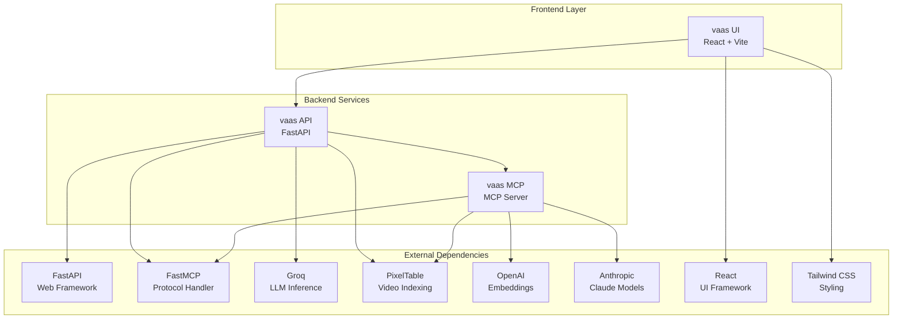

# Third-Party Dependencies

<cite>
**Referenced Files in This Document**
- [vaas-api/pyproject.toml](file://vaas-api/pyproject.toml)
- [vaas-mcp/pyproject.toml](file://vaas-mcp/pyproject.toml)
- [vaas-ui/package.json](file://vaas-ui/package.json)
- [vaas-api/README.md](file://vaas-api/README.md)
- [vaas-mcp/README.md](file://vaas-mcp/README.md)
- [vaas-ui/README.md](file://vaas-ui/README.md)
- [docker-compose.yml](file://docker-compose.yml)
</cite>

## Table of Contents
1. [Introduction](#introduction)
2. [Project Architecture](#project-architecture)
3. [vaas API Dependencies](#vaas-api-dependencies)
4. [vaas MCP Dependencies](#vaas-mcp-dependencies)
5. [vaas UI Dependencies](#vaas-ui-dependencies)
6. [Critical Integrations](#critical-integrations)
7. [Installation and Setup](#installation-and-setup)
8. [Version Compatibility](#version-compatibility)
9. [License Information](#license-information)
10. [Troubleshooting](#troubleshooting)

## Introduction

The vaas multimodal agents course consists of three interconnected services that leverage a comprehensive ecosystem of third-party dependencies. This document provides a detailed analysis of all external dependencies used across the vaas API, vaas MCP, and vaas UI components, organized by purpose and component.

Each service serves a distinct role in the multimodal video processing pipeline:
- **vaas API**: FastAPI backend exposing video processing tools through REST APIs
- **vaas MCP**: Model Context Protocol server handling video ingestion and processing
- **vaas UI**: React-based user interface for interacting with the video processing system

## Project Architecture

The vaas system operates as a distributed microservices architecture with clear separation of concerns:



**Diagram sources**
- [docker-compose.yml](file://docker-compose.yml#L1-L67)
- [vaas-api/pyproject.toml](file://vaas-api/pyproject.toml#L1-L31)
- [vaas-mcp/pyproject.toml](file://vaas-mcp/pyproject.toml#L1-L34)
- [vaas-ui/package.json](file://vaas-ui/package.json#L1-L84)

## vaas API Dependencies

The vaas API service forms the primary interface between the frontend and backend processing services. It relies on a carefully curated set of production dependencies that enable robust video processing capabilities.

### Production Dependencies

#### Core Web Framework
- **FastAPI (>=0.115.13)**: High-performance web framework for building APIs with automatic OpenAPI documentation
- **FastMCP (>=2.9.0)**: Implementation of the Model Context Protocol for tool orchestration

#### AI and Machine Learning
- **Groq (>=0.28.0)**: High-speed LLM inference platform supporting Llama models
- **Instructor (>=1.9.0)**: Enhanced Pydantic integration for structured LLM outputs
- **Pydantic Settings (>=2.10.0)**: Type-safe configuration management

#### Video Processing
- **OpenCV-Python (>=4.12.0.88)**: Computer vision library for video processing
- **PixelTable (>=0.4.1)**: Advanced video indexing and search capabilities

#### Observability and Monitoring
- **Opik (>=1.7.36)**: Comprehensive observability platform for agent applications
- **Loguru (>=0.7.3)**: Modern logging library for structured logging

#### Development Tools
- **Ruff (>=0.12.0)**: Fast Python linter and formatter
- **Click (>=8.2.1)**: Command-line interface creation framework

### Development Dependencies

The API service includes several development tools for code quality and maintenance:

- **IPyKernel (>=6.29.5)**: Jupyter kernel for interactive development
- **Ruff (>=0.12.0)**: Code linting and formatting

**Section sources**
- [vaas-api/pyproject.toml](file://vaas-api/pyproject.toml#L1-L31)

## vaas MCP Dependencies

The vaas MCP service acts as the intelligence hub, orchestrating video processing workflows and managing model interactions. It requires a sophisticated stack of dependencies for advanced video processing and AI capabilities.

### Production Dependencies

#### AI and Language Models
- **OpenAI (>=1.91.0)**: Comprehensive API for OpenAI models including embeddings and image captioning
- **Anthropic (>=0.55.0)**: Claude model access for advanced language processing
- **Groq (>=0.28.0)**: Alternative LLM inference provider for cost-effective processing

#### Video Processing and Embedding
- **Sentence Transformers (>=4.1.0)**: State-of-the-art sentence embeddings for semantic search
- **Transformers (>=4.52.4)**: Hugging Face transformers library for advanced NLP tasks
- **MoviePy (>=2.2.1)**: Video editing and processing library
- **PixelTable (>=0.4.1)**: Core video indexing and search engine

#### Protocol and Communication
- **FastMCP (>=2.5.2)**: Model Context Protocol implementation for standardized tool communication

#### Configuration and Environment
- **Pydantic (>=2.11.7)**: Data validation and settings management
- **Pydantic Settings (>=2.10.0)**: Enhanced configuration management
- **Python Dotenv (>=1.1.0)**: Environment variable loading

### Development Dependencies

#### Code Quality and Development
- **IPyKernel (>=6.29.5)**: Interactive Python kernel support
- **Ruff (>=0.12.0)**: Fast Python linting and formatting
- **Click (>=8.2.1)**: CLI framework for command-line tools

**Section sources**
- [vaas-mcp/pyproject.toml](file://vaas-mcp/pyproject.toml#L1-L34)

## vaas UI Dependencies

The vaas UI provides a modern, responsive interface for interacting with the video processing system. Built with contemporary web technologies, it offers a seamless user experience for video analysis and agent interaction.

### Production Dependencies

#### Core Framework and State Management
- **React (>=18.3.1)**: JavaScript library for building user interfaces
- **React DOM (>=18.3.1)**: React renderer for web platforms
- **React Hook Form (>=7.53.0)**: Performant form state management
- **@hookform/resolvers (>=3.9.0)**: Form validation resolver integration
- **Zod (>=3.23.8)**: TypeScript-first schema declaration and validation

#### UI Components and Design
- **Radix UI Primitives**: Comprehensive set of unstyled, accessible components
  - Dialog, Dropdown Menu, Popover, Tooltip, Toast, and many others
  - Provides foundation for consistent UI behavior
- **Lucide React (>=0.462.0)**: Beautiful SVG icon library
- **Tailwind Merge (>=2.5.2)**: Utility class merging for dynamic styling
- **Tailwind CSS Animate (>=1.0.7)**: Animation utilities for Tailwind CSS

#### Navigation and Routing
- **React Router DOM (>=6.26.2)**: Declarative routing for React applications
- **Next Themes (>=0.3.0)**: Theme switching and dark mode support

#### Data Visualization
- **Recharts (>=2.12.7)**: Charting library built on React components
- **Sonner (>=1.5.0)**: Modern notification system
- **Date FNS (>=3.6.0)**: Date manipulation utilities

#### Layout and Interaction
- **React Resizable Panels (>=2.1.3)**: Flexible panel layout system
- **Embla Carousel React (>=8.3.0)**: Touch-friendly carousel component
- **Input OTP (>=1.2.4)**: One-time password input component

#### Utilities and Styling
- **Class Variance Authority (>=0.7.1)**: Utility for creating variant classes
- **CLSX (>=2.1.1)**: Conditional class name concatenation
- **CMDK (>=1.0.0)**: Command palette keyboard shortcuts
- **Vaul (>=0.9.3)**: Modal and drawer component foundation

### Development Dependencies

#### Build and Development Tools
- **Vite (>=5.4.1)**: Next-generation frontend build tool
- **TypeScript (>=5.5.3)**: Typed superset of JavaScript
- **PostCSS (>=8.4.47)**: CSS processing toolkit
- **Autoprefixer (>=10.4.20)**: Automatic vendor prefix addition
- **Tailwind CSS (>=3.4.11)**: Utility-first CSS framework

#### Code Quality and Testing
- **ESLint (>=9.9.0)**: Pluggable JavaScript linter
- **@eslint/js (>=9.9.0)**: ESLint JavaScript configuration
- **@types/react (>=18.3.3)**: TypeScript type definitions
- **@types/react-dom (>=18.3.0)**: DOM-specific type definitions
- **@vitejs/plugin-react-swc (>=3.5.0)**: React plugin for Vite using SWC
- **TypeScript ESLint (>=8.0.1)**: TypeScript ESLint integration
- **ESLint Plugin React Hooks (>=5.1.0-rc.0)**: React hooks linting rules
- **ESLint Plugin React Refresh (>=0.4.9)**: Fast refresh linting support

**Section sources**
- [vaas-ui/package.json](file://vaas-ui/package.json#L1-L84)

## Critical Integrations

### FastMCP for Tool Orchestration

FastMCP serves as the backbone protocol for tool communication across the vaas ecosystem. It enables standardized interaction between the API and MCP services, ensuring reliable tool execution and response handling.

**Key Features:**
- Standardized tool discovery and invocation
- Structured response formatting
- Error handling and retry mechanisms
- Cross-service communication protocols

### PixelTable for Video Indexing

PixelTable provides the core video processing capability, offering advanced indexing, search, and analysis features for video content.

**Primary Use Cases:**
- Video frame extraction and indexing
- Semantic search across video content
- Temporal analysis and event detection
- Multi-modal content understanding

### Groq for LLM Inference

Groq delivers high-speed LLM inference capabilities, enabling real-time processing of video metadata and content analysis.

**Integration Benefits:**
- Ultra-fast inference speeds
- Cost-effective processing
- Support for multiple model families
- Seamless integration with existing workflows

**Section sources**
- [vaas-api/pyproject.toml](file://vaas-api/pyproject.toml#L10-L11)
- [vaas-mcp/pyproject.toml](file://vaas-mcp/pyproject.toml#L10-L11)

## Installation and Setup

### Python Services (API & MCP)

Both Python services use `uv` as the primary package manager, offering significant performance improvements over traditional `pip` installations.

#### Installation Steps:
1. **Install uv**: Follow the official installation guide at https://docs.astral.sh/uv/getting-started/installation/
2. **Create Virtual Environment**:
   ```bash
   uv venv .venv
   ```
3. **Activate Environment**:
   ```bash
   # macOS/Linux
   source .venv/bin/activate
   
   # Windows
   .\.venv\Scripts\Activate.ps1
   ```
4. **Install Dependencies**:
   ```bash
   uv pip install -e .
   ```

#### Environment Configuration:
Copy the example environment files and configure required API keys:
```bash
# For API service
cp .env.example .env
# Edit .env and add GROQ_API_KEY and OPIK credentials

# For MCP service  
cp .env.example .env
# Edit .env and add OPENAI_API_KEY and Opik credentials
```

### UI Service

The UI service uses npm for package management and follows standard React development practices.

#### Installation Steps:
```bash
# Install dependencies
npm install

# Run development server
npm run dev

# Build for production
npm run build
```

### Docker Deployment

All services can be deployed using Docker Compose for consistent environments:

```bash
# Build and start all services
docker compose up --build -d

# Stop all services
docker compose stop
```

**Section sources**
- [vaas-api/README.md](file://vaas-api/README.md#L20-L45)
- [vaas-mcp/README.md](file://vaas-mcp/README.md#L20-L45)
- [vaas-ui/README.md](file://vaas-ui/README.md#L10-L20)
- [docker-compose.yml](file://docker-compose.yml#L1-L67)

## Version Compatibility

### Python Version Requirements
- **Minimum Python Version**: 3.12
- **Recommended Version**: 3.12.8 (as verified during setup)
- **Build Target**: Python 3.12 (specified in Ruff configuration)

### Dependency Version Constraints

#### Strict Dependencies
- **FastAPI**: >=0.115.13 (critical for API functionality)
- **FastMCP**: >=2.9.0 for API, >=2.5.2 for MCP (protocol compatibility)
- **Groq**: >=0.28.0 (specific version required for LLM integration)
- **PixelTable**: >=0.4.1 (critical video processing functionality)

#### Flexible Dependencies
- **OpenAI**: >=1.91.0 (allows newer versions for latest features)
- **React**: >=18.3.1 (maintains compatibility with ecosystem)
- **Tailwind CSS**: >=3.4.11 (allows patch updates for bug fixes)

### Known Compatibility Issues

#### Version-Specific Considerations
- **FastMCP Protocol**: Ensure API and MCP versions match protocol specifications
- **OpenCV-Python**: Version 4.12.0.88 required for specific video processing features
- **React Ecosystem**: Maintain version alignment across all React-related packages

#### Environment-Specific Notes
- **Memory Requirements**: Services require at least 4GB RAM each for optimal performance
- **CPU Resources**: All services configured for 4 CPU cores in Docker deployment
- **Storage**: Shared media volume required for video file exchange

## License Information

### Python Package Licenses

Most dependencies follow standard open-source licenses:

- **MIT License**: FastAPI, Pydantic, Loguru, Ruff
- **Apache 2.0**: OpenCV-Python, Transformers
- **BSD License**: Click, IPyKernel
- **Custom/Open Source**: Some dependencies may have specific licensing terms

### Frontend Package Licenses

#### UI Dependencies License Summary:
- **MIT License**: React, Vite, Tailwind CSS, Radix UI, Lucide React
- **ISC License**: Zod, Sonner
- **Apache 2.0**: Recharts, Embla Carousel
- **Unlicense**: Some development dependencies

### Commercial Considerations

#### API Keys Required:
- **Groq API Key**: Required for LLM inference capabilities
- **OpenAI API Key**: Required for advanced embedding and image processing
- **Opik Credentials**: Required for observability and monitoring features

#### Usage Restrictions:
- **Rate Limits**: All external APIs have rate limiting that must be respected
- **Quota Management**: Monitor usage to avoid unexpected costs
- **Data Privacy**: Ensure compliance with data protection regulations

## Troubleshooting

### Common Installation Issues

#### Python Environment Problems
1. **Python Version Mismatch**:
   ```bash
   # Verify Python version
   uv run python --version
   # Should display Python 3.12.8
   ```

2. **Virtual Environment Issues**:
   ```bash
   # Recreate virtual environment
   rm -rf .venv
   uv venv .venv
   ```

3. **Dependency Conflicts**:
   ```bash
   # Clean install
   uv pip install --force-reinstall -e .
   ```

#### UI Build Issues
1. **Node.js Version**: Ensure Node.js 18+ is installed
2. **Memory Issues**: Increase Node.js heap size if build fails
3. **Port Conflicts**: Check for port 3000 availability

### Service Communication Issues

#### API-MCP Connectivity
1. **Verify MCP Server Status**:
   ```bash
   # Check MCP container logs
   docker logs vaas-mcp
   ```

2. **Network Configuration**: Ensure `agent-network` is properly configured
3. **Port Mapping**: Confirm port 9090 is accessible

#### Video Processing Failures
1. **PixelTable Initialization**: Verify database initialization
2. **File Permissions**: Check shared media volume accessibility
3. **Memory Allocation**: Monitor resource usage during video processing

### Performance Optimization

#### Memory Management
- **Increase Container Memory**: Adjust Docker resource limits if experiencing OOM errors
- **Optimize Video Processing**: Use appropriate video formats and resolutions
- **Monitor Resource Usage**: Utilize Opik for performance monitoring

#### Network Optimization
- **Local Development**: Use localhost connections for reduced latency
- **Production Deployment**: Configure proper load balancing and caching
- **API Rate Limiting**: Implement client-side rate limiting for external APIs

### Debugging Tools

#### Logging Configuration
- **Log Level**: Configure appropriate log levels for troubleshooting
- **Structured Logging**: Use Loguru for consistent log formatting
- **Remote Logging**: Integrate with Opik for centralized observability

#### Development Tools
- **Swagger UI**: Accessible at http://localhost:8000/docs for API testing
- **MCP Inspector**: Available at http://localhost:9090 for MCP server inspection
- **Browser DevTools**: Use for UI debugging and network monitoring