# API Layer Architecture

<cite>
**Referenced Files in This Document**
- [api.py](file://vaas-api/src/vaas_api/api.py)
- [models.py](file://vaas-api/src/vaas_api/models.py)
- [config.py](file://vaas-api/src/vaas_api/config.py)
- [base_agent.py](file://vaas-api/src/vaas_api/agent/base_agent.py)
- [groq_agent.py](file://vaas-api/src/vaas_api/agent/groq/groq_agent.py)
- [memory.py](file://vaas-api/src/vaas_api/agent/memory.py)
- [tools.py](file://vaas-api/src/vaas_api/tools.py)
- [opik_utils.py](file://vaas-api/src/vaas_api/opik_utils.py)
- [pyproject.toml](file://vaas-api/pyproject.toml)
- [README.md](file://vaas-api/README.md)
</cite>

## Table of Contents
1. [Introduction](#introduction)
2. [System Architecture Overview](#system-architecture-overview)
3. [FastAPI Application Structure](#fastapi-application-structure)
4. [Request/Response Models](#requestresponse-models)
5. [Agent Integration Layer](#agent-integration-layer)
6. [MCP Server Communication](#mcp-server-communication)
7. [Memory Management](#memory-management)
8. [Background Task Processing](#background-task-processing)
9. [Security and Error Handling](#security-and-error-handling)
10. [Performance Optimization](#performance-optimization)
11. [Configuration Management](#configuration-management)
12. [Monitoring and Observability](#monitoring-and-observability)
13. [Deployment and Operations](#deployment-and-operations)

## Introduction

The vaas API serves as the central coordination point in the multimodal agents ecosystem, handling HTTP requests from the UI and orchestrating agent decisions. Built with FastAPI, it provides a robust, asynchronous API layer that manages conversation state, integrates with the Groq agent for query routing, and coordinates with the MCP (Model Context Protocol) client for tool execution.

The API acts as the primary interface between the frontend user interface and the underlying agent infrastructure, offering endpoints for chat interactions, video processing, memory management, and file uploads. It implements sophisticated request/response models with Pydantic validation, comprehensive error handling middleware, and supports concurrent agent invocations through background task processing.

## System Architecture Overview

The vaas API operates as part of a three-tier architecture that includes the UI layer, API layer, and MCP server. The API layer serves as the central nervous system, coordinating communication between these components.

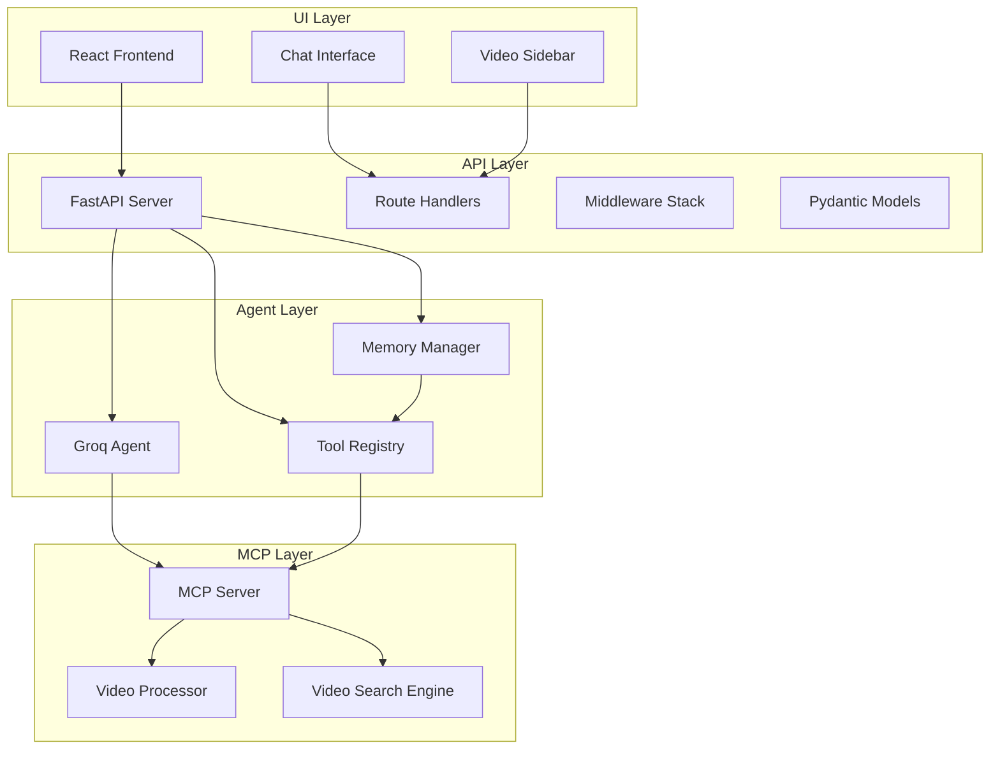

**Diagram sources**
- [api.py](file://vaas-api/src/vaas_api/api.py#L1-L198)
- [base_agent.py](file://vaas-api/src/vaas_api/agent/base_agent.py#L1-L111)

**Section sources**
- [api.py](file://vaas-api/src/vaas_api/api.py#L1-L198)
- [README.md](file://vaas-api/README.md#L1-L102)

## FastAPI Application Structure

The FastAPI application is structured around a modular design that separates concerns between routing, middleware, and business logic. The application lifecycle is managed through an async context manager that handles agent initialization and cleanup.

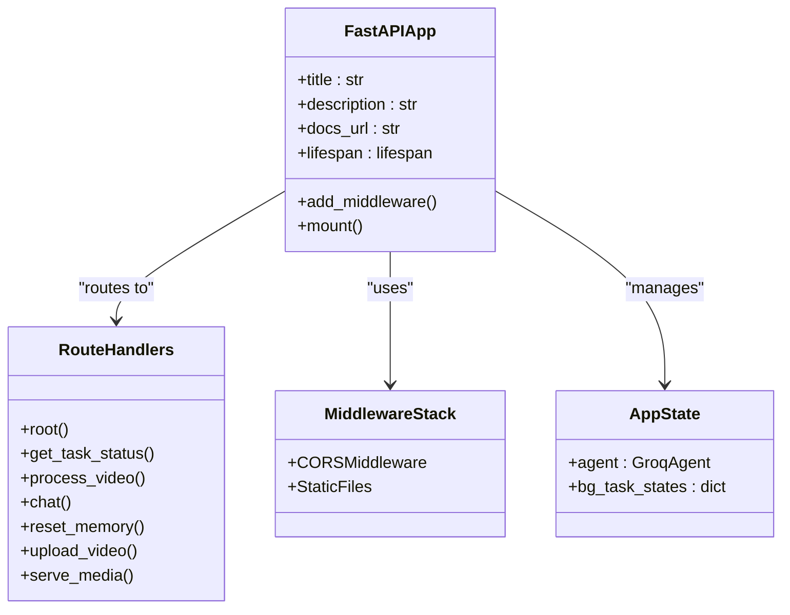

**Diagram sources**
- [api.py](file://vaas-api/src/vaas_api/api.py#L40-L60)
- [api.py](file://vaas-api/src/vaas_api/api.py#L62-L198)

The application defines several key endpoints:

### Core Endpoints

1. **Chat Endpoint (`/chat`)**: Handles user queries with support for text, video context, and images
2. **Video Processing Endpoint (`/process-video`)**: Orchestrates background video processing tasks
3. **Memory Management (`/reset-memory`)**: Clears agent conversation history
4. **File Upload (`/upload-video`)**: Manages video file uploads to shared storage
5. **Task Status (`/task-status/{task_id}`)**: Provides real-time status updates for background tasks

### Application Lifecycle Management

The application uses an async context manager for proper resource management:

```python
@asynccontextmanager
async def lifespan(app: FastAPI):
    app.state.agent = GroqAgent(
        name="vaas",
        mcp_server=settings.MCP_SERVER,
        disable_tools=["process_video"],
    )
    app.state.bg_task_states = dict()
    yield
    app.state.agent.reset_memory()
```

**Section sources**
- [api.py](file://vaas-api/src/vaas_api/api.py#L40-L60)
- [api.py](file://vaas-api/src/vaas_api/api.py#L62-L198)

## Request/Response Models

The API employs Pydantic models to enforce strict schema validation and provide automatic serialization/deserialization of request and response data. These models ensure type safety and provide clear documentation for API consumers.

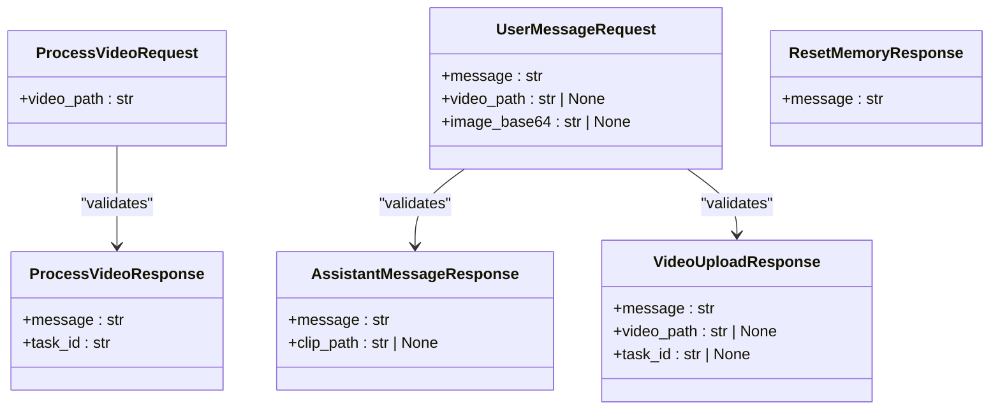

**Diagram sources**
- [models.py](file://vaas-api/src/vaas_api/models.py#L1-L54)

### Model Categories

1. **Basic Request Models**: Handle core API interactions
   - `ProcessVideoRequest`: Video processing initiation
   - `UserMessageRequest`: Chat message with optional multimedia context

2. **Response Models**: Standardized response formats
   - `ProcessVideoResponse`: Task queuing confirmation
   - `AssistantMessageResponse`: Agent response with optional video clips
   - `VideoUploadResponse`: Upload confirmation with metadata

3. **Structured Output Models**: LLM response validation
   - `RoutingResponseModel`: Tool usage decision
   - `GeneralResponseModel`: Standard assistant responses
   - `VideoClipResponseModel`: Video clip generation responses

**Section sources**
- [models.py](file://vaas-api/src/vaas_api/models.py#L1-L54)

## Agent Integration Layer

The Groq agent serves as the primary intelligence engine, handling natural language processing, tool selection, and response generation. The agent integrates with the MCP server for tool discovery and execution.

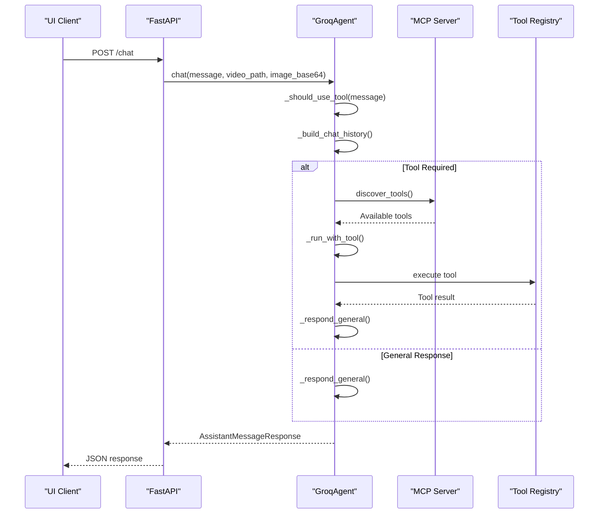

**Diagram sources**
- [groq_agent.py](file://vaas-api/src/vaas_api/agent/groq/groq_agent.py#L1-L237)
- [base_agent.py](file://vaas-api/src/vaas_api/agent/base_agent.py#L1-L111)

### Agent Initialization and Setup

The agent undergoes a comprehensive setup process during application startup:

```python
async def setup(self):
    """Initialize async components of the agent."""
    async with self.mcp_client as _:
        self.tools = await self._get_tools()
        self.routing_system_prompt = await self._get_routing_system_prompt()
        self.tool_use_system_prompt = await self._get_tool_use_system_prompt()
        self.general_system_prompt = await self._get_general_system_prompt()
```

### Tool Discovery and Execution

The agent implements sophisticated tool discovery and execution mechanisms:

1. **Tool Discovery**: Connects to MCP server to discover available tools
2. **Tool Filtering**: Filters tools based on configuration and disabled tools list
3. **Tool Transformation**: Converts MCP tool definitions to Groq-compatible format
4. **Tool Execution**: Executes selected tools with appropriate parameters

**Section sources**
- [base_agent.py](file://vaas-api/src/vaas_api/agent/base_agent.py#L25-L36)
- [groq_agent.py](file://vaas-api/src/vaas_api/agent/groq/groq_agent.py#L25-L40)

## MCP Server Communication

The Model Context Protocol (MCP) server provides the foundation for tool discovery, prompt management, and resource sharing. The API maintains persistent connections to the MCP server for optimal performance.

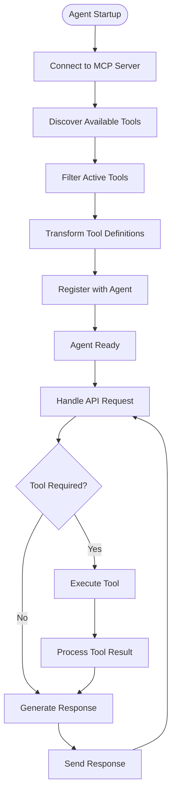

**Diagram sources**
- [base_agent.py](file://vaas-api/src/vaas_api/agent/base_agent.py#L55-L109)

### MCP Integration Features

1. **Prompt Management**: Retrieves system prompts from MCP server
2. **Tool Discovery**: Automatically discovers and registers available tools
3. **Resource Access**: Provides access to shared resources and configurations
4. **Connection Pooling**: Maintains persistent connections for efficiency

### Error Handling in MCP Communication

The agent implements robust error handling for MCP server communication:

```python
try:
    async with self.mcp_client as client:
        tools = await client.list_tools()
        if not tools:
            logger.info("No tools were discovered from the MCP server")
            return []
        tools = self.filter_active_tools(tools)
        return tools
except ConnectionError as e:
    logger.error(f"Failed to connect to MCP server: {e}")
    raise
except Exception as e:
    logger.error(f"Tool discovery failed: {e}")
    raise
```

**Section sources**
- [base_agent.py](file://vaas-api/src/vaas_api/agent/base_agent.py#L55-L109)

## Memory Management

The memory system uses PixelTable for persistent, structured storage of conversation history and agent state. This provides efficient querying capabilities and ensures data durability across application restarts.

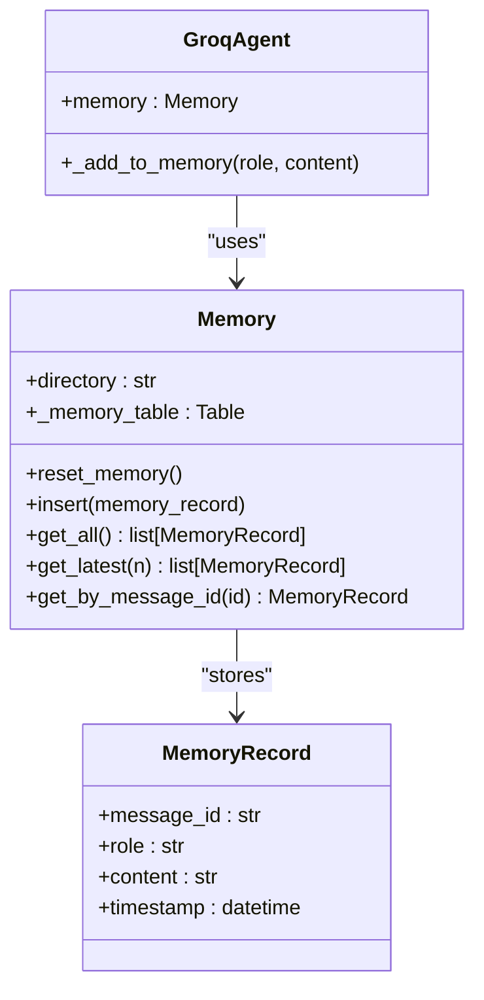

**Diagram sources**
- [memory.py](file://vaas-api/src/vaas_api/agent/memory.py#L1-L51)

### Memory Operations

1. **Insertion**: Adds new conversation records with timestamps
2. **Retrieval**: Supports fetching latest N records or specific messages
3. **Reset**: Completely clears conversation history
4. **Persistence**: Uses PixelTable for durable storage

### Memory Configuration

The memory system is configurable through the settings:

```python
AGENT_MEMORY_SIZE: int = 20  # Number of conversation turns to retain
```

**Section sources**
- [memory.py](file://vaas-api/src/vaas_api/agent/memory.py#L1-L51)
- [config.py](file://vaas-api/src/vaas_api/config.py#L25-L26)

## Background Task Processing

The API implements sophisticated background task processing for long-running operations like video processing. This ensures responsive user experience while handling computationally intensive tasks asynchronously.

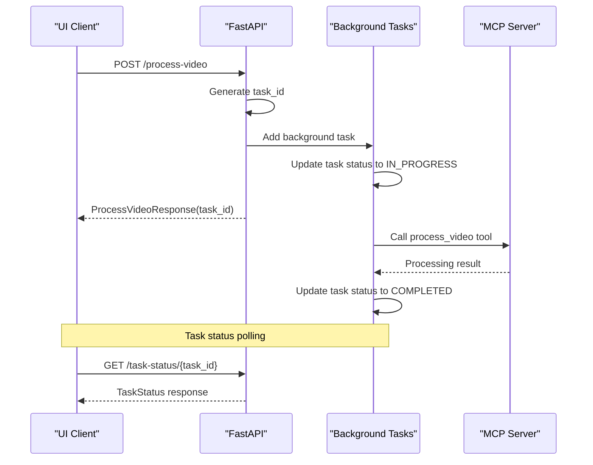

**Diagram sources**
- [api.py](file://vaas-api/src/vaas_api/api.py#L75-L105)

### Task Status Management

The system tracks task states using an enumeration:

```python
class TaskStatus(str, Enum):
    PENDING = "pending"
    IN_PROGRESS = "in_progress"
    COMPLETED = "completed"
    FAILED = "failed"
    NOT_FOUND = "not_found"
```

### Background Task Implementation

Key features of background task processing:

1. **Asynchronous Execution**: Non-blocking task processing
2. **Status Tracking**: Real-time task status updates
3. **Error Recovery**: Comprehensive error handling and logging
4. **Resource Cleanup**: Proper cleanup of temporary resources

**Section sources**
- [api.py](file://vaas-api/src/vaas_api/api.py#L20-L25)
- [api.py](file://vaas-api/src/vaas_api/api.py#L75-L105)

## Security and Error Handling

The API implements comprehensive security measures and error handling strategies to ensure robust operation and protect against malicious inputs.

### CORS Configuration

Cross-Origin Resource Sharing is configured to allow requests from the frontend:

```python
app.add_middleware(
    CORSMiddleware,
    allow_origins=["*"],  # Frontend URL
    allow_credentials=True,
    allow_methods=["*"],
    allow_headers=["*"],
)
```

### Input Validation and Sanitization

1. **Pydantic Models**: Automatic input validation and sanitization
2. **File Upload Validation**: Ensures valid file types and sizes
3. **Path Traversal Protection**: Secure file path handling
4. **Base64 Image Validation**: Validates encoded image data

### Error Handling Strategies

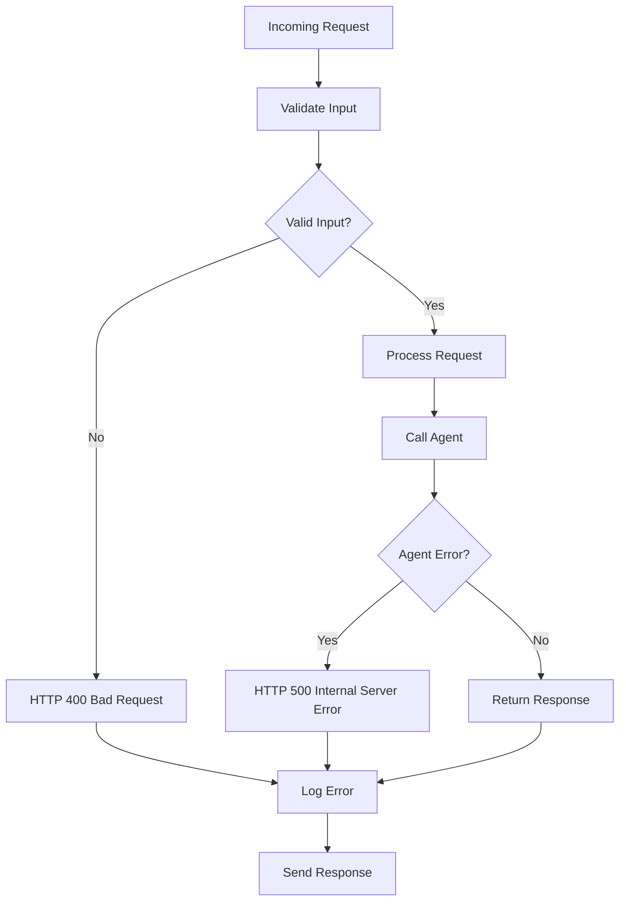

### Rate Limiting Considerations

While not explicitly implemented, the architecture supports rate limiting through:

1. **Concurrent Request Handling**: Built-in async support
2. **Background Task Queuing**: Prevents overload from long-running tasks
3. **Resource Monitoring**: Tracks system resource usage

**Section sources**
- [api.py](file://vaas-api/src/vaas_api/api.py#L50-L55)
- [api.py](file://vaas-api/src/vaas_api/api.py#L107-L125)

## Performance Optimization

The API is designed for high-performance concurrent operations with several optimization strategies:

### Concurrent Request Handling

1. **Async/Await Pattern**: Full asynchronous request processing
2. **Connection Pooling**: Reuses connections to external services
3. **Background Task Processing**: Offloads long-running operations
4. **Memory Management**: Efficient conversation state handling

### Optimization Strategies

1. **Tool Selection Optimization**: Intelligent routing to minimize unnecessary tool calls
2. **Response Caching**: Caches frequently accessed prompts and configurations
3. **Resource Pooling**: Reuses expensive-to-create objects
4. **Lazy Loading**: Loads components only when needed

### Scalability Considerations

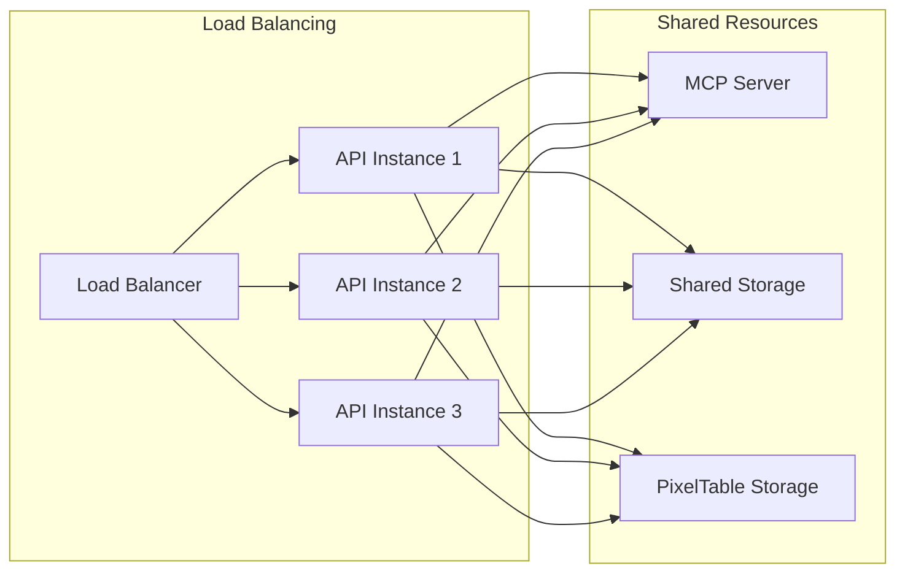

### Performance Monitoring

The system includes built-in performance monitoring through:

1. **Opik Integration**: Comprehensive observability and tracing
2. **Logging**: Structured logging with loguru
3. **Metrics Collection**: Performance metrics collection
4. **Health Checks**: Regular health monitoring

## Configuration Management

The API uses a centralized configuration system with environment variable support and runtime caching for optimal performance.

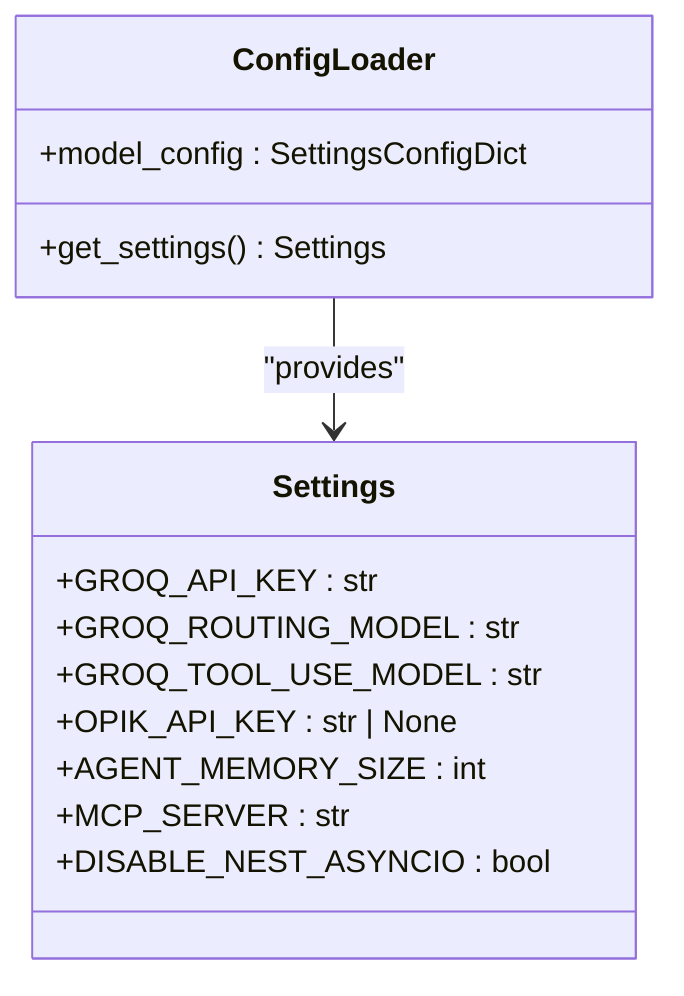

**Diagram sources**
- [config.py](file://vaas-api/src/vaas_api/config.py#L1-L43)

### Configuration Categories

1. **Model Configuration**: Groq API model settings
2. **Observability**: Opik and Comet ML integration
3. **Memory Management**: Conversation history limits
4. **MCP Integration**: Server connection settings

### Environment Variable Management

The configuration system supports:

```python
model_config = SettingsConfigDict(
    env_file="agent-api/.env", 
    extra="ignore", 
    env_file_encoding="utf-8"
)
```

**Section sources**
- [config.py](file://vaas-api/src/vaas_api/config.py#L1-L43)

## Monitoring and Observability

The API integrates with Opik for comprehensive monitoring and observability, providing insights into agent performance, tool usage, and system health.

### Opik Integration

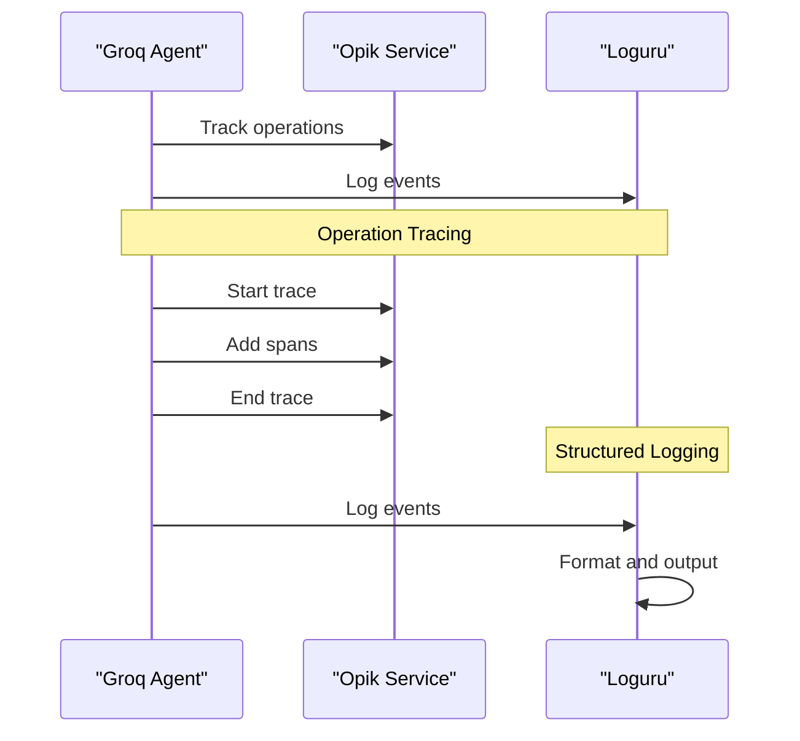

**Diagram sources**
- [opik_utils.py](file://vaas-api/src/vaas_api/opik_utils.py#L1-L44)

### Monitoring Features

1. **Operation Tracing**: Tracks agent operations and tool executions
2. **Performance Metrics**: Monitors response times and throughput
3. **Error Tracking**: Captures and reports errors
4. **Resource Usage**: Monitors memory and CPU utilization

### Logging Configuration

The system uses loguru for structured logging with configurable sinks and formatting.

**Section sources**
- [opik_utils.py](file://vaas-api/src/vaas_api/opik_utils.py#L1-L44)

## Deployment and Operations

The API is designed for containerized deployment with Docker and orchestrated through Docker Compose for development and production environments.

### Deployment Architecture

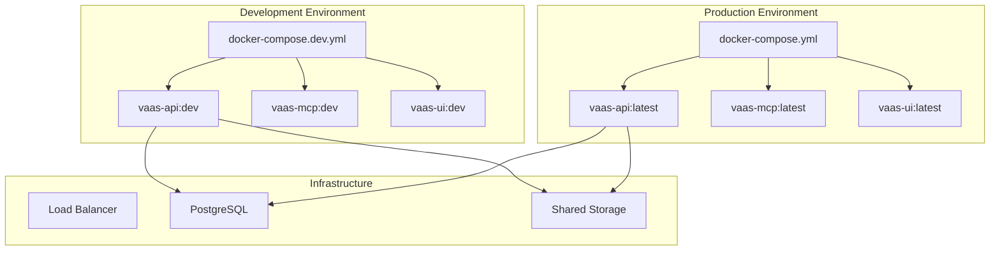

### Container Configuration

The API container includes:

1. **Python Runtime**: Optimized for FastAPI applications
2. **Dependencies**: All required packages installed
3. **Environment Variables**: Production-ready configuration
4. **Health Checks**: Container health monitoring

### Operational Considerations

1. **Scaling**: Horizontal scaling support through container orchestration
2. **Monitoring**: Integrated observability and alerting
3. **Backup**: Persistent storage for conversation data
4. **Updates**: Zero-downtime deployment strategies

**Section sources**
- [README.md](file://vaas-api/README.md#L1-L102)
- [pyproject.toml](file://vaas-api/pyproject.toml#L1-L31)