# Agent System Design

<cite>
**Referenced Files in This Document**
- [groq_agent.py](file://vaas-api/src/vaas_api/agent/groq/groq_agent.py)
- [base_agent.py](file://vaas-api/src/vaas_api/agent/base_agent.py)
- [memory.py](file://vaas-api/src/vaas_api/agent/memory.py)
- [groq_tool.py](file://vaas-api/src/vaas_api/agent/groq/groq_tool.py)
- [models.py](file://vaas-api/src/vaas_api/models.py)
- [config.py](file://vaas-api/src/vaas_api/config.py)
- [tools.py](file://vaas-api/src/vaas_api/tools.py)
</cite>

## Table of Contents
1. [Introduction](#introduction)
2. [System Architecture](#system-architecture)
3. [Core Components](#core-components)
4. [Agent-Based Pattern](#agent-based-pattern)
5. [Memory Management System](#memory-management-system)
6. [Tool Calling Mechanism](#tool-calling-mechanism)
7. [Decision-Making Process](#decision-making-process)
8. [Response Generation Pipeline](#response-generation-pipeline)
9. [Error Recovery Strategies](#error-recovery-strategies)
10. [Performance Considerations](#performance-considerations)
11. [Design Trade-offs](#design-trade-offs)
12. [Conclusion](#conclusion)

## Introduction

The vaas Agent System represents a sophisticated multimodal agent architecture built around the GroqAgent class, which extends the BaseAgent to handle complex user queries involving both text and multimedia content. This system demonstrates advanced agent-based patterns where intelligent decision-making orchestrates tool usage, maintains conversation context, and synthesizes responses from Large Language Model (LLM) outputs.

The architecture follows a modular design pattern where the GroqAgent serves as the primary orchestrator, leveraging the MCP (Model Context Protocol) server for tool discovery and execution while maintaining comprehensive conversation state through a robust memory management system. The system is designed to handle multimodal inputs including text and images, making it particularly suited for video processing and analysis scenarios.

## System Architecture

The agent system operates within a distributed architecture that separates concerns across multiple layers:

```mermaid
graph TB
subgraph "Client Layer"
UI[Web UI]
API[REST API]
end
subgraph "Agent Layer"
GA[GroqAgent]
BA[BaseAgent]
MEM[Memory Manager]
GT[GroqTool]
end
subgraph "Infrastructure Layer"
MCPS[MCP Server]
GROQ[Groq API]
PXT[PixelTable Storage]
end
UI --> API
API --> GA
GA --> BA
GA --> MEM
GA --> GT
BA --> MCPS
GA --> GROQ
MEM --> PXT
GT --> MCPS
```



**Diagram sources**
- [groq_agent.py](file://vaas-api/src/vaas_api/agent/groq/groq_agent.py#L1-L237)
- [base_agent.py](file://vaas-api/src/vaas_api/agent/base_agent.py#L1-L111)
- [memory.py](file://vaas-api/src/vaas_api/agent/memory.py#L1-L51)

The architecture implements a clear separation of responsibilities:
- **Agent Layer**: Handles business logic and orchestration
- **Infrastructure Layer**: Provides external service connectivity
- **Storage Layer**: Manages persistent conversation state

**Section sources**
- [groq_agent.py](file://vaas-api/src/vaas_api/agent/groq/groq_agent.py#L1-L50)
- [base_agent.py](file://vaas-api/src/vaas_api/agent/base_agent.py#L1-L36)

## Core Components

### GroqAgent Class

The GroqAgent serves as the primary orchestrator, extending BaseAgent to implement multimodal query handling:


**Diagram sources**
- [groq_agent.py](file://vaas-api/src/vaas_api/agent/groq/groq_agent.py#L25-L50)
- [base_agent.py](file://vaas-api/src/vaas_api/agent/base_agent.py#L8-L36)
- [memory.py](file://vaas-api/src/vaas_api/agent/memory.py#L7-L15)

### Configuration Management

The system utilizes centralized configuration through Pydantic models:

```python
class Settings(BaseSettings):
    # Groq API Configuration
    GROQ_API_KEY: str
    GROQ_ROUTING_MODEL: str = "meta-llama/llama-4-scout-17b-16e-instruct"
    GROQ_TOOL_USE_MODEL: str = "meta-llama/llama-4-maverick-17b-128e-instruct"
    GROQ_GENERAL_MODEL: str = "meta-llama/llama-4-maverick-17b-128e-instruct"
    
    # Memory Configuration
    AGENT_MEMORY_SIZE: int = 20
    
    # MCP Configuration
    MCP_SERVER: str = "http://vaas-mcp:9090/mcp"
```

**Section sources**
- [groq_agent.py](file://vaas-api/src/vaas_api/agent/groq/groq_agent.py#L25-L50)
- [config.py](file://vaas-api/src/vaas_api/config.py#L6-L42)

## Agent-Based Pattern

The agent system implements a sophisticated pattern where the GroqAgent extends BaseAgent to handle multimodal queries through intelligent orchestration:


**Diagram sources**
- [groq_agent.py](file://vaas-api/src/vaas_api/agent/groq/groq_agent.py#L215-L237)
- [base_agent.py](file://vaas-api/src/vaas_api/agent/base_agent.py#L58-L85)

The pattern emphasizes:
- **Intelligent Orchestration**: The agent makes decisions about when to use tools vs. general responses
- **Multimodal Support**: Handles both text and image inputs seamlessly
- **Context Preservation**: Maintains conversation history across requests
- **External Tool Integration**: Leverages MCP server for extensible tool ecosystem

**Section sources**
- [groq_agent.py](file://vaas-api/src/vaas_api/agent/groq/groq_agent.py#L215-L237)
- [base_agent.py](file://vaas-api/src/vaas_api/agent/base_agent.py#L58-L111)

## Memory Management System

The memory management system provides persistent conversation context through a sophisticated storage mechanism:


**Diagram sources**
- [memory.py](file://vaas-api/src/vaas_api/agent/memory.py#L17-L51)

### Memory Operations

The system implements several key memory operations:

1. **Insertion**: Adds new conversation records with automatic timestamping
2. **Retrieval**: Fetches latest N conversations for context building
3. **Persistence**: Uses PixelTable for reliable, structured storage
4. **Reset**: Clears conversation history when needed

```python
def _add_to_memory(self, role: str, content: str) -> None:
    """Add a message to the agent's memory."""
    self.memory.insert(
        MemoryRecord(
            message_id=str(uuid.uuid4()),
            role=role,
            content=content,
            timestamp=datetime.now(),
        )
    )
```

The memory system maintains:
- **Structured Data**: Typed records with UUID identifiers
- **Temporal Ordering**: Timestamp-based ordering for chronological context
- **Role Differentiation**: Clear separation between user and assistant messages
- **Persistent Storage**: Reliable backing through PixelTable

**Section sources**
- [memory.py](file://vaas-api/src/vaas_api/agent/memory.py#L1-L51)
- [groq_agent.py](file://vaas-api/src/vaas_api/agent/groq/groq_agent.py#L145-L155)

## Tool Calling Mechanism

The tool calling system provides seamless integration with the MCP server through GroqTool wrappers:


**Diagram sources**
- [base_agent.py](file://vaas-api/src/vaas_api/agent/base_agent.py#L58-L85)
- [groq_tool.py](file://vaas-api/src/vaas_api/agent/groq/groq_tool.py#L35-L61)

### Tool Transformation Process

The system transforms MCP tools into Groq-compatible tool definitions:

```python
def transform_tool_definition(tool) -> dict:
    """Transform an MCP tool into a Groq tool definition dictionary."""
    return GroqTool.from_mcp_tool(tool).model_dump()
```

This transformation handles:
- **Schema Conversion**: Converts MCP input schemas to Groq parameter formats
- **Type Mapping**: Maps field types appropriately for LLM consumption
- **Documentation**: Preserves descriptions and default values
- **Validation**: Ensures compatibility with Groq API requirements

### Tool Execution Flow

The `_execute_tool_call` method provides robust tool execution:

```python
async def _execute_tool_call(self, tool_call: Any, video_path: str, image_base64: str | None = None) -> str:
    """Execute a single tool call and return its response."""
    function_name = tool_call.function.name
    function_args = json.loads(tool_call.function.arguments)
    
    function_args["video_path"] = video_path
    if function_name == "get_video_clip_from_image":
        function_args["user_image"] = image_base64
    
    try:
        return await self.call_tool(function_name, function_args)
    except Exception as e:
        logger.error(f"Error executing tool {function_name}: {str(e)}")
        return f"Error executing tool {function_name}: {str(e)}"
```

**Section sources**
- [groq_tool.py](file://vaas-api/src/vaas_api/agent/groq/groq_tool.py#L1-L61)
- [groq_agent.py](file://vaas-api/src/vaas_api/agent/groq/groq_agent.py#L104-L136)
- [base_agent.py](file://vaas-api/src/vaas_api/agent/base_agent.py#L95-L100)

## Decision-Making Process

The agent implements intelligent decision-making through a two-stage routing system:


**Diagram sources**
- [groq_agent.py](file://vaas-api/src/vaas_api/agent/groq/groq_agent.py#L75-L85)
- [groq_agent.py](file://vaas-api/src/vaas_api/agent/groq/groq_agent.py#L215-L237)

### Routing Decision Logic

The `_should_use_tool` method determines whether a tool call is necessary:

```python
@opik.track(name="router", type="llm")
def _should_use_tool(self, message: str) -> bool:
    messages = [
        {"role": "system", "content": self.routing_system_prompt},
        {"role": "user", "content": message},
    ]
    response = self.instructor_client.chat.completions.create(
        model=settings.GROQ_ROUTING_MODEL,
        response_model=RoutingResponseModel,
        messages=messages,
        max_completion_tokens=20,
    )
    return response.tool_use
```

This decision process considers:
- **Content Analysis**: Evaluates whether the query requires specialized tool capabilities
- **Context Awareness**: Considers the conversation history and current context
- **Model Capability**: Uses appropriate routing model for decision-making
- **Structured Output**: Ensures deterministic tool usage decisions

**Section sources**
- [groq_agent.py](file://vaas-api/src/vaas_api/agent/groq/groq_agent.py#L75-L85)
- [groq_agent.py](file://vaas-api/src/vaas_api/agent/groq/groq_agent.py#L138-L175)

## Response Generation Pipeline

The response generation pipeline handles both general and tool-based responses through structured output models:


**Diagram sources**
- [groq_agent.py](file://vaas-api/src/vaas_api/agent/groq/groq_agent.py#L175-L210)
- [groq_agent.py](file://vaas-api/src/vaas_api/agent/groq/groq_agent.py#L145-L155)

### Structured Response Models

The system uses Pydantic models for type-safe responses:

```python
class GeneralResponseModel(BaseModel):
    message: str = Field(
        description="Your response to the user's question, that needs to follow vaas's style and personality"
    )

class VideoClipResponseModel(BaseModel):
    message: str = Field(
        description="A fun and engaging message to the user, asking them to watch the video clip, that needs to follow vaas's style and personality"
    )
    clip_path: str = Field(description="The path to the generated clip.")
```

### Response Validation and Enhancement

The system implements comprehensive response validation:

```python
def validate_video_clip_response(self, video_clip_response: VideoClipResponseModel, video_clip_path: str) -> VideoClipResponseModel:
    """Validate the video clip response."""
    video_clip_response.clip_path = video_clip_path
    return video_clip_response
```

This validation ensures:
- **Path Consistency**: Validates that clip paths are correctly assigned
- **Content Integrity**: Ensures response structure matches expectations
- **Enhancement**: Adds contextual information like first-frame sampling

**Section sources**
- [groq_agent.py](file://vaas-api/src/vaas_api/agent/groq/groq_agent.py#L175-L210)
- [models.py](file://vaas-api/src/vaas_api/models.py#L35-L53)

## Error Recovery Strategies

The system implements comprehensive error handling across multiple layers:

```mermaid
flowchart TD
ToolCall[Tool Call Initiated] --> TryExecute[Try Execute Tool]
TryExecute --> Success{Execution Success?}
Success --> |Yes| ReturnSuccess[Return Success Response]
Success --> |No| CatchException[Catch Exception]
CatchException --> LogError[Log Detailed Error]
LogError --> ReturnError[Return Error Message]
ReturnError --> ErrorResponse[Error Response:<br/>"Error executing tool {name}: {details}"]
ReturnSuccess --> ContinueProcessing[Continue Processing]
subgraph "Error Categories"
NetworkError[Network Connectivity Issues]
ToolError[Tool Execution Failures]
ValidationError[Response Validation Errors]
ResourceError[Resource Unavailability]
end
CatchException -.-> NetworkError
CatchException -.-> ToolError
CatchException -.-> ValidationError
CatchException -.-> ResourceError
```

**Diagram sources**
- [groq_agent.py](file://vaas-api/src/vaas_api/agent/groq/groq_agent.py#L104-L136)
- [base_agent.py](file://vaas-api/src/vaas_api/agent/base_agent.py#L75-L85)

### Error Handling Implementation

The system provides multiple layers of error recovery:

1. **Tool Execution Errors**: Graceful handling of tool failures
2. **Network Connectivity**: Robust handling of MCP server communication issues
3. **Validation Failures**: Comprehensive response validation with fallbacks
4. **Resource Management**: Proper cleanup and resource deallocation

```python
try:
    return await self.call_tool(function_name, function_args)
except Exception as e:
    logger.error(f"Error executing tool {function_name}: {str(e)}")
    return f"Error executing tool {function_name}: {str(e)}"
```

### Fallback Mechanisms

The system implements intelligent fallback strategies:
- **Graceful Degradation**: Continues operation with reduced functionality
- **Informative Error Messages**: Provides actionable error information
- **Logging and Monitoring**: Comprehensive error tracking for debugging
- **Resource Cleanup**: Ensures proper resource deallocation on failure

**Section sources**
- [groq_agent.py](file://vaas-api/src/vaas_api/agent/groq/groq_agent.py#L104-L136)
- [base_agent.py](file://vaas-api/src/vaas_api/agent/base_agent.py#L75-L85)

## Performance Considerations

The agent system implements several performance optimization strategies:

### Sequential vs Parallel Tool Execution

The current implementation executes tools sequentially for several reasons:

1. **State Consistency**: Sequential execution maintains conversation state consistency
2. **Resource Management**: Prevents resource contention and memory issues
3. **Error Isolation**: Isolates errors to individual tool executions
4. **Debugging Simplicity**: Easier to trace and debug sequential operations

However, the architecture supports parallel execution through:
- **Async/Await Patterns**: Native support for concurrent operations
- **Tool Independence**: Tools are designed to be state-independent
- **Future Extensions**: Easy migration to parallel execution when needed

### Memory Management Optimizations

The memory system optimizes performance through:

1. **Limited History**: Configurable memory size (default: 20 messages)
2. **Efficient Retrieval**: O(1) access to latest messages
3. **Batch Operations**: Efficient bulk insertions and retrievals
4. **Lazy Loading**: On-demand loading of conversation history

### LLM Model Selection

The system uses different models for different tasks:

- **Routing Model**: Lightweight model for decision-making
- **Tool Use Model**: Balanced model for tool execution coordination
- **General Model**: Full-featured model for direct responses

This approach optimizes:
- **Latency**: Faster decisions for routing
- **Cost**: Efficient resource utilization
- **Quality**: Appropriate model capabilities for each task

**Section sources**
- [config.py](file://vaas-api/src/vaas_api/config.py#L10-L18)
- [memory.py](file://vaas-api/src/vaas_api/agent/memory.py#L40-L45)

## Design Trade-offs

The agent system makes several intentional design trade-offs:

### State Management Strategy

**API Layer State Management vs. External Services**
- **Current Approach**: State maintained in API layer using local memory
- **Trade-offs**: 
  - **Pros**: Complete control, predictable behavior, offline capability
  - **Cons**: Memory limitations, scalability challenges, state synchronization

**Alternative Approaches**:
- **External State Services**: Centralized state management
- **Distributed State**: Shared state across multiple instances
- **Hybrid Approach**: Partial state delegation to external services

### Tool Execution Strategy

**Sequential Tool Execution vs. Parallel Execution**
- **Current Approach**: Sequential execution for simplicity and consistency
- **Trade-offs**:
  - **Pros**: Easier debugging, consistent state, resource control
  - **Cons**: Higher latency, underutilized resources during I/O waits

**Future Considerations**:
- **Parallel Execution**: For independent tool operations
- **Pipeline Execution**: For chained tool dependencies
- **Batch Processing**: For multiple simultaneous tool calls

### Memory Persistence Strategy

**Local Storage vs. Distributed Storage**
- **Current Approach**: PixelTable for local persistence
- **Trade-offs**:
  - **Pros**: Fast access, local development, easy setup
  - **Cons**: Single point of failure, limited scalability

**Alternative Strategies**:
- **Cloud Storage**: Distributed databases for production
- **Hybrid Storage**: Local cache with remote backup
- **Memory-Optimized Storage**: Specialized storage for conversation data

**Section sources**
- [memory.py](file://vaas-api/src/vaas_api/agent/memory.py#L17-L51)
- [groq_agent.py](file://vaas-api/src/vaas_api/agent/groq/groq_agent.py#L104-L136)

## Conclusion

The vaas Agent System represents a sophisticated implementation of agent-based architecture with several notable strengths:

### Architectural Excellence

The system demonstrates excellent architectural principles:
- **Modularity**: Clear separation of concerns across components
- **Extensibility**: Well-designed interfaces for future enhancements
- **Robustness**: Comprehensive error handling and recovery mechanisms
- **Performance**: Optimized for both latency and throughput

### Technical Innovation

Key innovations include:
- **Intelligent Routing**: Dynamic decision-making based on query characteristics
- **Multimodal Support**: Seamless handling of text and image inputs
- **Tool Integration**: Clean abstraction over external tool ecosystems
- **Memory Management**: Sophisticated conversation state preservation

### Practical Benefits

The system provides tangible benefits:
- **Developer Experience**: Clear APIs and comprehensive logging
- **User Experience**: Responsive, context-aware interactions
- **Maintainability**: Well-structured code with extensive documentation
- **Scalability**: Architecture supports future growth and enhancement

### Future Directions

The architecture supports several potential enhancements:
- **Parallel Tool Execution**: For improved performance
- **Distributed State Management**: For production scalability
- **Advanced Memory Systems**: For enhanced conversation context
- **Enhanced Error Recovery**: For improved reliability

The GroqAgent implementation serves as an exemplary model for building sophisticated, production-ready agent systems that balance complexity, performance, and maintainability. Its design patterns and implementation strategies provide valuable insights for developing similar systems in diverse domains.