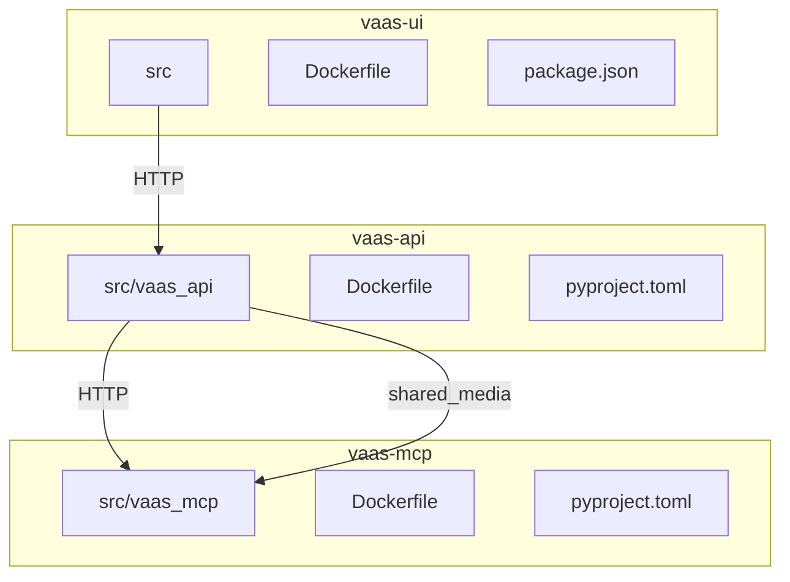
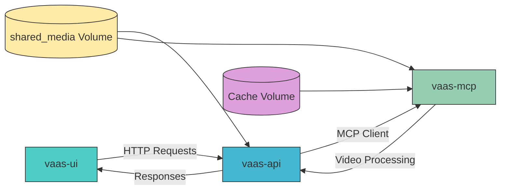
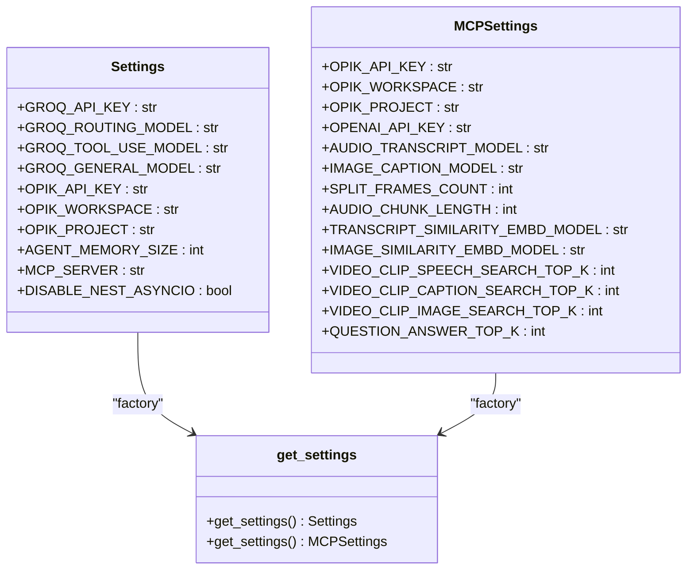
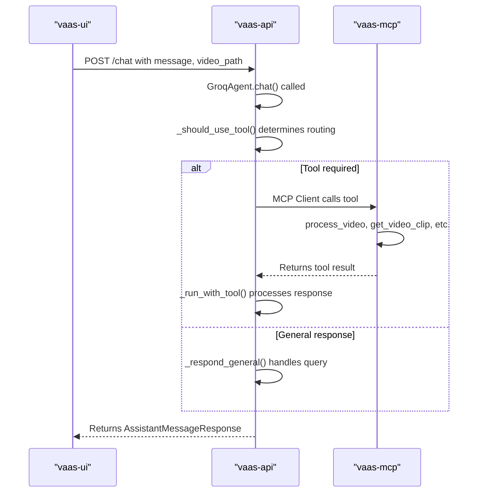
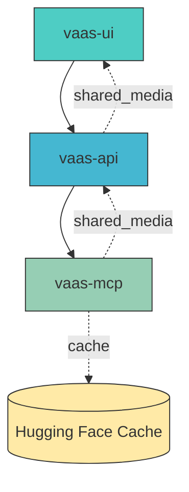

# Architecture and Design

<cite>
**Referenced Files in This Document**   
- [api.py](file://vaas-api/src/vaas_api/api.py)
- [groq_agent.py](file://vaas-api/src/vaas_api/agent/groq/groq_agent.py)
- [server.py](file://vaas-mcp/src/vaas_mcp/server.py)
- [tools.py](file://vaas-mcp/src/vaas_mcp/tools.py)
- [config.py](file://vaas-api/src/vaas_api/config.py)
- [config.py](file://vaas-mcp/src/vaas_mcp/config.py)
- [App.tsx](file://vaas-ui/src/App.tsx)
- [docker-compose.yml](file://docker-compose.yml)
- [models.py](file://vaas-api/src/vaas_api/models.py)
- [video_processor.py](file://vaas-mcp/src/vaas_mcp/video/ingestion/video_processor.py)
- [functions.py](file://vaas-mcp/src/vaas_mcp/video/ingestion/functions.py)
- [tools.py](file://vaas-mcp/src/vaas_mcp/video/ingestion/tools.py)
</cite>

## Table of Contents
1. [Introduction](#introduction)
2. [Project Structure](#project-structure)
3. [Core Components](#core-components)
4. [Architecture Overview](#architecture-overview)
5. [Detailed Component Analysis](#detailed-component-analysis)
6. [Dependency Analysis](#dependency-analysis)
7. [Performance Considerations](#performance-considerations)
8. [Troubleshooting Guide](#troubleshooting-guide)
9. [Conclusion](#conclusion)

## Introduction
The multimodal-agents-course system implements a microservices architecture with three primary components: vaas-api, vaas-mcp, and vaas-ui. This documentation provides a comprehensive analysis of the system's architecture, focusing on the separation of concerns between services, the agent-based pattern for query orchestration, configuration management, and cross-cutting concerns like observability and state management. The system enables users to interact with video content through natural language queries, leveraging AI-powered video processing and analysis capabilities.

## Project Structure
The project follows a microservices architecture with three main services: vaas-api, vaas-mcp, and vaas-ui, each with its own source code, configuration, and Docker setup. The services are orchestrated using Docker Compose, with shared volumes for media storage and caching. The API server handles user requests and agent logic, the MCP server manages video processing tools, and the UI provides an interactive interface for users.



**Diagram sources**
- [docker-compose.yml](file://docker-compose.yml#L1-L66)

**Section sources**
- [docker-compose.yml](file://docker-compose.yml#L1-L66)

## Core Components
The system consists of three core components: vaas-api for handling user requests and agent logic, vaas-mcp for video processing tools, and vaas-ui for the interactive interface. The vaas-api service orchestrates interactions between the user interface and video processing capabilities, while vaas-mcp provides specialized tools for video analysis and manipulation. The vaas-ui service delivers a responsive user experience for interacting with the system.

**Section sources**
- [api.py](file://vaas-api/src/vaas_api/api.py#L1-L198)
- [server.py](file://vaas-mcp/src/vaas_mcp/server.py#L1-L97)
- [App.tsx](file://vaas-ui/src/App.tsx#L1-L27)

## Architecture Overview
The system implements a microservices architecture with clear separation between the API server, MCP server, and UI. The vaas-api service acts as the central orchestrator, handling user requests and coordinating with the vaas-mcp service for video processing tasks. The vaas-ui service provides the user interface, communicating with the vaas-api service via HTTP requests. The services share a common volume for media storage, enabling efficient transfer of video files between components.



**Diagram sources**
- [docker-compose.yml](file://docker-compose.yml#L1-L66)
- [api.py](file://vaas-api/src/vaas_api/api.py#L1-L198)
- [server.py](file://vaas-mcp/src/vaas_mcp/server.py#L1-L97)

## Detailed Component Analysis

### Agent-Based Pattern in groq_agent.py
The GroqAgent class implements an agent-based pattern for routing queries and orchestrating tools. It uses a routing mechanism to determine whether a user query requires tool usage based on the message content. The agent maintains memory of previous interactions and uses different LLM models for routing, tool usage, and general responses. When a tool is required, the agent executes the appropriate tool call and processes the response.

```mermaid
classDiagram
class GroqAgent {
+client : Groq
+instructor_client : instructor
+thread_id : str
-_should_use_tool(message : str) bool
-_run_with_tool(message : str, video_path : str, image_base64 : str) str
-_respond_general(message : str) str
-_add_to_memory(role : str, content : str) None
-_add_memory_pair(user_message : str, assistant_message : str) None
+chat(message : str, video_path : str, image_base64 : str) AssistantMessageResponse
}
class BaseAgent {
+name : str
+mcp_server : str
+memory : Memory
+tools : List[Dict]
+discover_tools() List[Dict]
+call_tool(name : str, args : Dict) str
+reset_memory() None
}
class Memory {
+insert(record : MemoryRecord) None
+get_latest(n : int) List[MemoryRecord]
+reset() None
}
GroqAgent --> BaseAgent : "inherits"
GroqAgent --> Memory : "uses"
GroqAgent --> "FastMCP Client" : "uses"
```

**Diagram sources**
- [groq_agent.py](file://vaas-api/src/vaas_api/agent/groq/groq_agent.py#L1-L237)
- [base_agent.py](file://vaas-api/src/vaas_api/agent/base_agent.py#L1-L20)

**Section sources**
- [groq_agent.py](file://vaas-api/src/vaas_api/agent/groq/groq_agent.py#L1-L237)

### Configuration Management System
The system uses a configuration management system based on Pydantic settings with environment variables. Each service has its own config.py file that defines settings using Pydantic's BaseSettings class. The settings are loaded from environment files and can be cached using lru_cache for performance. The configuration includes API keys, model specifications, memory settings, and MCP server URLs.



**Diagram sources**
- [config.py](file://vaas-api/src/vaas_api/config.py#L1-L43)
- [config.py](file://vaas-mcp/src/vaas_mcp/config.py#L1-L56)

**Section sources**
- [config.py](file://vaas-api/src/vaas_api/config.py#L1-L43)
- [config.py](file://vaas-mcp/src/vaas_mcp/config.py#L1-L56)

### Request Flow from UI to API to MCP Tools
The system implements a clear request flow from the UI through the API server to the MCP tools. When a user submits a query, the request travels from the UI to the API server, which determines whether tool usage is required. If so, the API server calls the appropriate tool on the MCP server, which processes the video and returns the result. The API server then formats the response and sends it back to the UI.



**Diagram sources**
- [api.py](file://vaas-api/src/vaas_api/api.py#L1-L198)
- [groq_agent.py](file://vaas-api/src/vaas_api/agent/groq/groq_agent.py#L1-L237)
- [server.py](file://vaas-mcp/src/vaas_mcp/server.py#L1-L97)

**Section sources**
- [api.py](file://vaas-api/src/vaas_api/api.py#L1-L198)
- [groq_agent.py](file://vaas-api/src/vaas_api/agent/groq/groq_agent.py#L1-L237)

## Dependency Analysis
The system components have well-defined dependencies managed through Docker Compose. The vaas-api service depends on vaas-mcp for video processing tools, while vaas-ui depends on both vaas-api and vaas-mcp. The services share a common volume for media storage and use environment variables for configuration. The API server uses FastMCP to communicate with the MCP server, enabling standardized tool calls.



**Diagram sources**
- [docker-compose.yml](file://docker-compose.yml#L1-L66)
- [api.py](file://vaas-api/src/vaas_api/api.py#L1-L198)

**Section sources**
- [docker-compose.yml](file://docker-compose.yml#L1-L66)

## Performance Considerations
The system faces potential bottlenecks in video processing, particularly with large video files and computationally intensive operations like frame extraction and similarity search. The use of FastAPI enables async performance for handling multiple concurrent requests, while the shared memory volume reduces I/O overhead for video files. However, video processing tasks are resource-intensive and may require scaling considerations for production use.

The MCP server's video processing capabilities, including speech transcription, image captioning, and similarity search, require significant computational resources. The system uses Hugging Face models and OpenAI APIs for these tasks, which may introduce latency and cost considerations. Caching strategies and efficient resource management are critical for maintaining performance.

**Section sources**
- [config.py](file://vaas-mcp/src/vaas_mcp/config.py#L1-L56)
- [tools.py](file://vaas-mcp/src/vaas_mcp/tools.py#L1-L105)

## Troubleshooting Guide
Common issues in the system include video processing failures, tool call errors, and configuration problems. The system uses Opik for observability, enabling tracking of agent interactions and tool usage. Error handling is implemented at multiple levels, with HTTP exceptions for API errors and logging for debugging.

When troubleshooting video processing issues, check the shared_media volume for file accessibility and verify that the video processor can handle the file format. For tool call errors, ensure that the MCP server is running and accessible from the API server. Configuration issues can be diagnosed by checking environment variables and settings files.

**Section sources**
- [api.py](file://vaas-api/src/vaas_api/api.py#L1-L198)
- [tools.py](file://vaas-mcp/src/vaas_mcp/tools.py#L1-L105)
- [opik_utils.py](file://vaas-api/src/vaas_api/opik_utils.py#L1-L20)
- [opik_utils.py](file://vaas-mcp/src/vaas_mcp/opik_utils.py#L1-L20)

## Conclusion
The multimodal-agents-course system implements a robust microservices architecture with clear separation between the API server, MCP server, and UI. The agent-based pattern in groq_agent.py enables intelligent routing of queries and orchestration of video processing tools. The configuration management system using Pydantic settings and environment variables provides flexibility and ease of deployment. The system leverages FastAPI for async performance, FastMCP for tool standardization, and React for a responsive UI. While the architecture is well-designed, scalability considerations for video processing workloads should be addressed in production deployments.