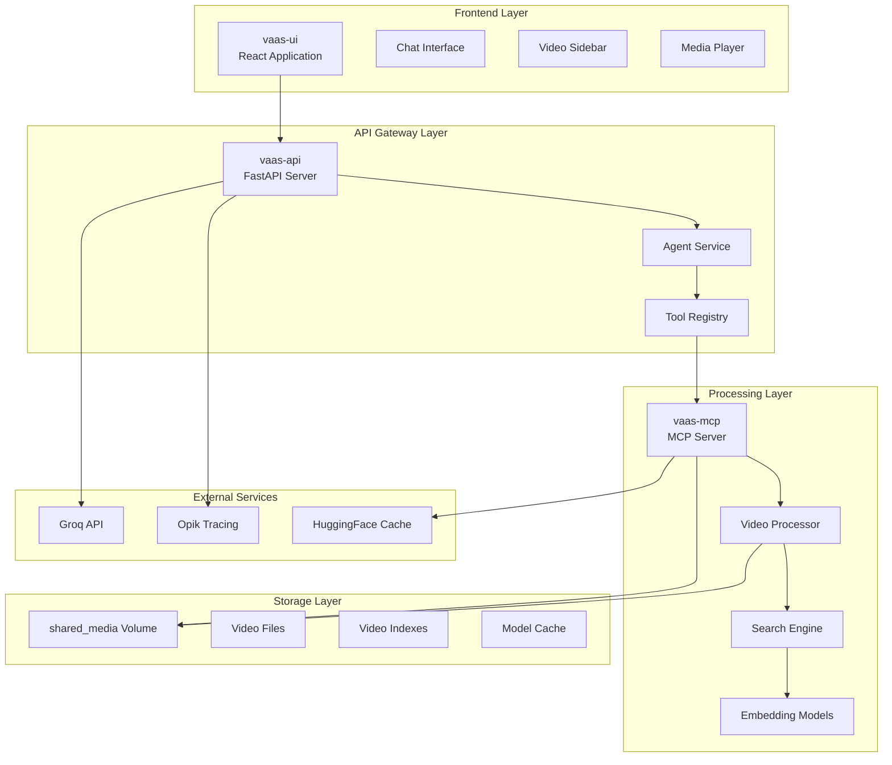
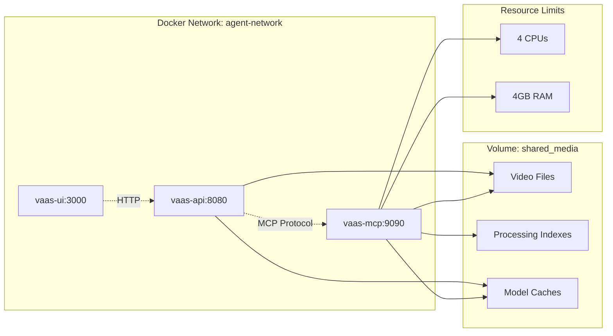
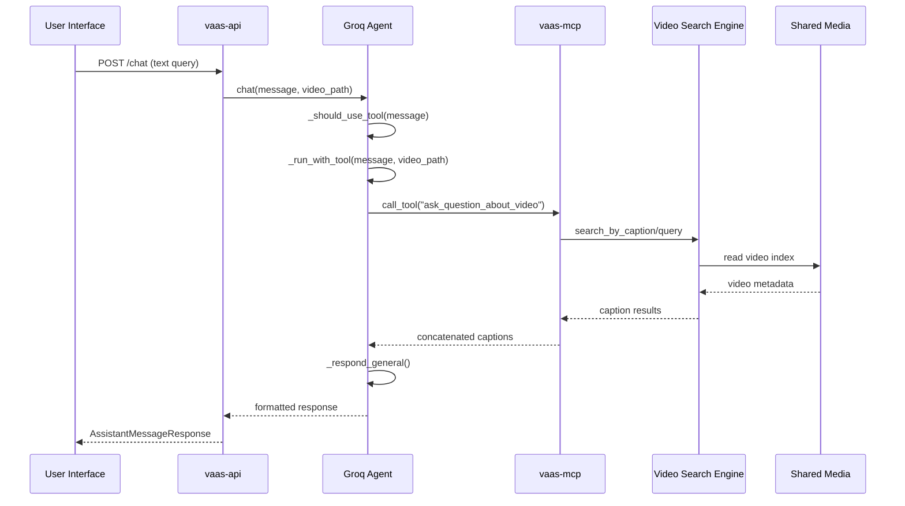
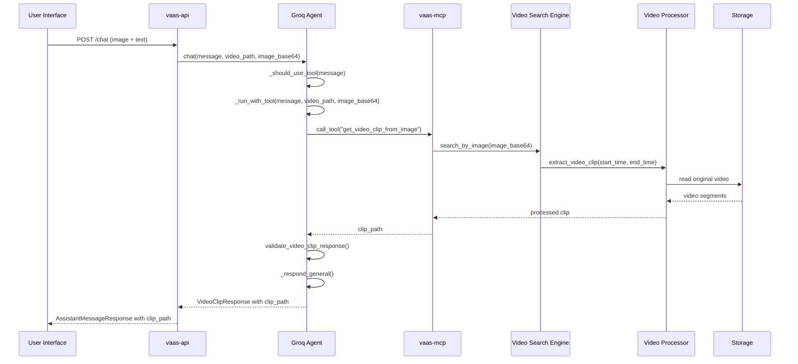
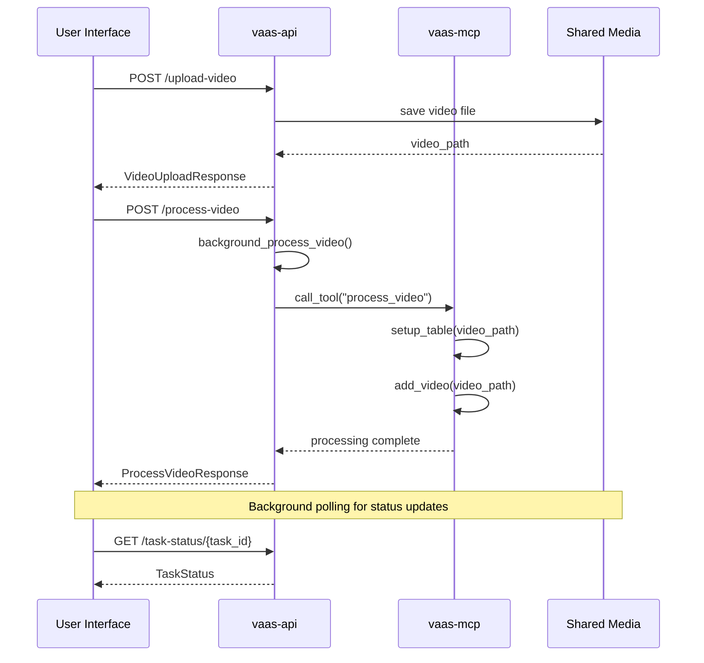
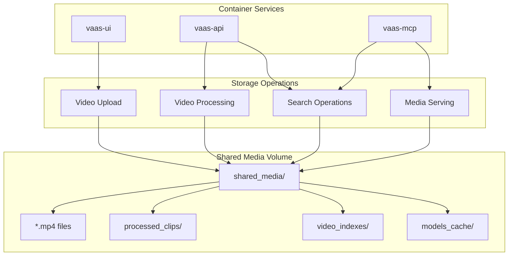
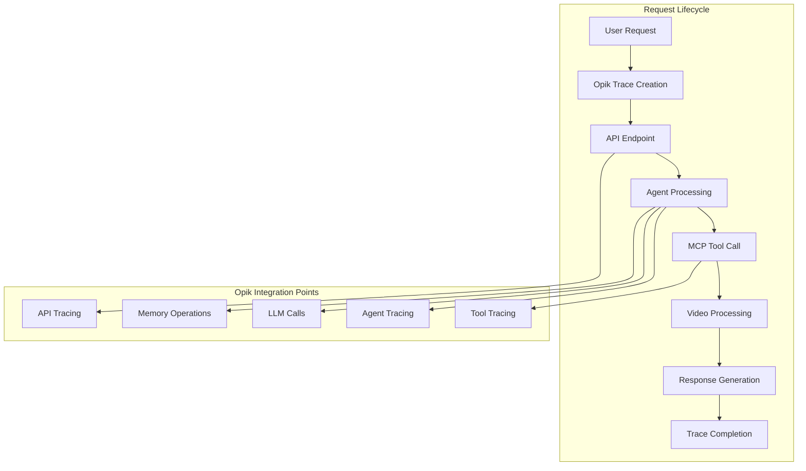
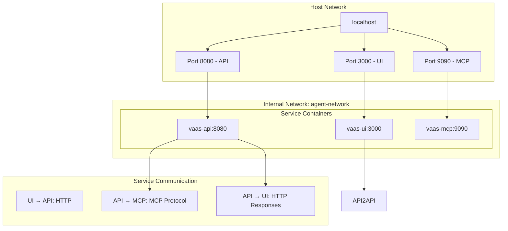
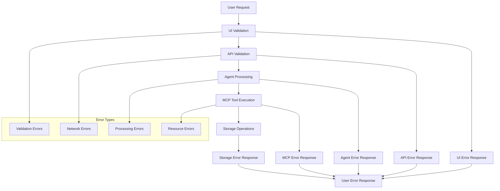

# Data Flow and Service Integration Architecture

<cite>
**Referenced Files in This Document**
- [docker-compose.yml](file://docker-compose.yml)
- [vaas-api/src/vaas_api/api.py](file://vaas-api/src/vaas_api/api.py)
- [vaas-api/src/vaas_api/agent/groq/groq_agent.py](file://vaas-api/src/vaas_api/agent/groq/groq_agent.py)
- [vaas-mcp/src/vaas_mcp/tools.py](file://vaas-mcp/src/vaas_mcp/tools.py)
- [vaas-mcp/src/vaas_mcp/video/video_search_engine.py](file://vaas-mcp/src/vaas_mcp/video/video_search_engine.py)
- [vaas-ui/src/App.tsx](file://vaas-ui/src/App.tsx)
- [vaas-ui/src/pages/Index.tsx](file://vaas-ui/src/pages/Index.tsx)
- [vaas-api/src/vaas_api/opik_utils.py](file://vaas-api/src/vaas_api/opik_utils.py)
- [GETTING_STARTED.md](file://GETTING_STARTED.md)
- [Makefile](file://Makefile)
</cite>

## Table of Contents
1. [Introduction](#introduction)
2. [System Architecture Overview](#system-architecture-overview)
3. [Docker Compose Orchestration](#docker-compose-orchestration)
4. [Data Flow Analysis](#data-flow-analysis)
5. [Service Integration Patterns](#service-integration-patterns)
6. [Shared Storage Architecture](#shared-storage-architecture)
7. [Observability and Tracing](#observability-and-tracing)
8. [Network Configuration](#network-configuration)
9. [Error Handling and Propagation](#error-handling-and-propagation)
10. [Performance Considerations](#performance-considerations)
11. [Troubleshooting Guide](#troubleshooting-guide)
12. [Conclusion](#conclusion)

## Introduction

The multimodal-agents-course system represents a sophisticated end-to-end architecture that integrates three distinct services to provide intelligent video analysis capabilities. This system demonstrates modern microservices architecture principles while maintaining seamless data flow across the complete application stack.

The architecture consists of three primary components: vaas-ui (frontend interface), vaas-api (backend service), and vaas-mcp (multimodal context protocol server). These services communicate through well-defined protocols, share common storage infrastructure, and implement comprehensive observability through Opik integration.

## System Architecture Overview

The system follows a layered architecture pattern with clear separation of concerns across presentation, business logic, and data processing layers.

**Diagram sources**
- [docker-compose.yml](file://docker-compose.yml#L1-L67)
- [vaas-api/src/vaas_api/api.py](file://vaas-api/src/vaas_api/api.py#L1-L50)
- [vaas-mcp/src/vaas_mcp/tools.py](file://vaas-mcp/src/vaas_mcp/tools.py#L1-L30)

## Docker Compose Orchestration

The system utilizes Docker Compose to orchestrate three interconnected services with shared networking and storage resources.

**Diagram sources**
- [docker-compose.yml](file://docker-compose.yml#L1-L67)

The Docker Compose configuration establishes several key architectural decisions:

### Network Isolation
- **Custom Network**: Services communicate through the `agent-network` overlay network
- **Service Discovery**: Services discover each other by container name (`vaas-mcp`)
- **Port Exposure**: Each service exposes its primary interface on standard ports

### Resource Management
- **CPU Limits**: MCP server allocated 4 CPU cores for intensive video processing
- **Memory Constraints**: 4GB RAM limit prevents resource contention
- **Reservations**: Minimum guaranteed resources ensure service availability

### Shared Storage Pattern
- **Named Volume**: `shared_media` volume enables persistent storage across containers
- **Cross-Container Access**: All services mount the same volume for file sharing
- **Data Consistency**: Single source of truth for video files and processed data

**Section sources**
- [docker-compose.yml](file://docker-compose.yml#L1-L67)

## Data Flow Analysis

The system implements two primary data flow patterns: text-based queries and image-based queries, each with distinct processing pipelines.

### Text-Based Query Flow

**Diagram sources**
- [vaas-api/src/vaas_api/api.py](file://vaas-api/src/vaas_api/api.py#L100-L120)
- [vaas-api/src/vaas_api/agent/groq/groq_agent.py](file://vaas-api/src/vaas_api/agent/groq/groq_agent.py#L180-L236)

### Image-Based Query Flow

**Diagram sources**
- [vaas-api/src/vaas_api/agent/groq/groq_agent.py](file://vaas-api/src/vaas_api/agent/groq/groq_agent.py#L70-L120)
- [vaas-mcp/src/vaas_mcp/tools.py](file://vaas-mcp/src/vaas_mcp/tools.py#L50-L80)

### Video Upload and Processing Flow

**Diagram sources**
- [vaas-api/src/vaas_api/api.py](file://vaas-api/src/vaas_api/api.py#L70-L100)
- [vaas-mcp/src/vaas_mcp/tools.py](file://vaas-mcp/src/vaas_mcp/tools.py#L15-L35)

**Section sources**
- [vaas-api/src/vaas_api/api.py](file://vaas-api/src/vaas_api/api.py#L70-L197)
- [vaas-api/src/vaas_api/agent/groq/groq_agent.py](file://vaas-api/src/vaas_api/agent/groq/groq_agent.py#L180-L236)
- [vaas-mcp/src/vaas_mcp/tools.py](file://vaas-mcp/src/vaas_mcp/tools.py#L15-L104)

## Service Integration Patterns

The system employs several integration patterns to ensure reliable communication between services.

### HTTP API Integration
The vaas-api service acts as the primary HTTP gateway, exposing RESTful endpoints for frontend communication.

### MCP Protocol Integration
The vaas-mcp service implements the Multimodal Context Protocol for tool discovery and execution, enabling dynamic capability expansion.

### Background Task Pattern
Long-running video processing operations utilize background task queues with status tracking and progress reporting.

### Event-Driven Architecture
The system implements polling-based status updates for asynchronous operations, ensuring responsive user experience.

**Section sources**
- [vaas-api/src/vaas_api/api.py](file://vaas-api/src/vaas_api/api.py#L1-L50)
- [vaas-ui/src/pages/Index.tsx](file://vaas-ui/src/pages/Index.tsx#L50-L100)

## Shared Storage Architecture

The shared storage pattern represents a critical architectural decision that enables efficient data sharing while maintaining service independence.

**Diagram sources**
- [docker-compose.yml](file://docker-compose.yml#L15-L25)
- [vaas-api/src/vaas_api/api.py](file://vaas-api/src/vaas_api/api.py#L140-L170)

### Storage Benefits
- **Data Consistency**: Single source of truth eliminates synchronization issues
- **Service Independence**: Each service maintains autonomy while accessing shared data
- **Resource Efficiency**: Eliminates redundant data storage across containers
- **Scalability**: Supports horizontal scaling of individual services

### Storage Challenges
- **Concurrency Control**: Multiple services may access the same files simultaneously
- **Cleanup Management**: Proper cleanup of temporary files and indexes
- **Performance Impact**: Shared storage may become a bottleneck under heavy load

**Section sources**
- [docker-compose.yml](file://docker-compose.yml#L15-L25)
- [vaas-api/src/vaas_api/api.py](file://vaas-api/src/vaas_api/api.py#L140-L197)

## Observability and Tracing

The system integrates Opik for comprehensive request tracing across all service boundaries, providing valuable insights into request flows and performance characteristics.

**Diagram sources**
- [vaas-api/src/vaas_api/opik_utils.py](file://vaas-api/src/vaas_api/opik_utils.py#L1-L43)
- [vaas-api/src/vaas_api/agent/groq/groq_agent.py](file://vaas-api/src/vaas_api/agent/groq/groq_agent.py#L150-L200)

### Tracing Implementation
The system implements distributed tracing through decorator-based instrumentation:

- **Endpoint Tracing**: All API endpoints automatically tracked
- **Agent Tracing**: Agent decision-making and tool selection
- **Tool Tracing**: Individual tool execution and response processing
- **LLM Tracing**: Large language model interactions and responses
- **Memory Tracing**: Conversation history management and persistence

### Monitoring Capabilities
- **Request Flow Visualization**: Complete request path across service boundaries
- **Performance Metrics**: Response times, error rates, and throughput
- **Error Tracking**: Comprehensive error propagation and correlation
- **Resource Utilization**: CPU, memory, and storage usage monitoring

**Section sources**
- [vaas-api/src/vaas_api/opik_utils.py](file://vaas-api/src/vaas_api/opik_utils.py#L1-L43)
- [vaas-api/src/vaas_api/agent/groq/groq_agent.py](file://vaas-api/src/vaas_api/agent/groq/groq_agent.py#L150-L236)

## Network Configuration

The system implements a sophisticated network topology that ensures secure service communication while maintaining flexibility for external access.

### Network Architecture

**Diagram sources**
- [docker-compose.yml](file://docker-compose.yml#L1-L67)

### Service Discovery
- **Container Names**: Services communicate using container names as DNS entries
- **Port Mapping**: Internal ports mapped to host ports for external access
- **Network Isolation**: Services isolated within dedicated overlay network

### Security Considerations
- **Internal Traffic**: All service-to-service communication occurs within internal network
- **External Access**: Only designated ports exposed to host network
- **CORS Configuration**: API service configured for cross-origin requests from UI

**Section sources**
- [docker-compose.yml](file://docker-compose.yml#L1-L67)
- [vaas-api/src/vaas_api/api.py](file://vaas-api/src/vaas_api/api.py#L40-L50)

## Error Handling and Propagation

The system implements comprehensive error handling strategies that ensure graceful degradation and meaningful error reporting across all service boundaries.

### Error Handling Layers

### Error Propagation Patterns
- **HTTP Status Codes**: Standard HTTP status codes for different error categories
- **Structured Error Responses**: Consistent error response format across services
- **Logging Integration**: Comprehensive logging for debugging and monitoring
- **User-Friendly Messages**: Graceful error messages for end-users

### Retry and Recovery Mechanisms
- **Background Task Retry**: Automatic retry for failed background processing tasks
- **Connection Pooling**: Efficient connection management for external services
- **Circuit Breaker**: Protection against cascading failures
- **Graceful Degradation**: Fallback mechanisms when services are unavailable

**Section sources**
- [vaas-api/src/vaas_api/api.py](file://vaas-api/src/vaas_api/api.py#L100-L120)
- [vaas-api/src/vaas_api/agent/groq/groq_agent.py](file://vaas-api/src/vaas_api/agent/groq/groq_agent.py#L90-L110)

## Performance Considerations

The system architecture incorporates several performance optimization strategies to ensure responsive user experience and efficient resource utilization.

### Resource Allocation Strategy
- **CPU Limits**: MCP server allocated 4 CPU cores for intensive video processing
- **Memory Constraints**: 4GB RAM limit prevents resource contention
- **Background Processing**: Long-running operations executed asynchronously
- **Connection Pooling**: Efficient database and external service connections

### Caching Strategies
- **Model Caching**: HuggingFace cache for downloaded models
- **Video Index Caching**: Pre-built video indexes for faster search operations
- **Response Caching**: Temporary caching of frequently accessed data
- **Browser Caching**: Frontend asset caching for improved load times

### Scalability Considerations
- **Horizontal Scaling**: Services designed for container-based scaling
- **Load Distribution**: Background task queuing for distributed processing
- **Resource Monitoring**: Real-time monitoring of resource utilization
- **Auto-scaling Potential**: Infrastructure ready for auto-scaling deployment

## Troubleshooting Guide

### Common Issues and Solutions

#### Service Connectivity Issues
- **Symptom**: UI cannot connect to API or MCP services
- **Diagnosis**: Check Docker network connectivity and port mappings
- **Solution**: Verify `agent-network` existence and service container status

#### Video Processing Failures
- **Symptom**: Video processing tasks fail or hang indefinitely
- **Diagnosis**: Check shared media volume permissions and disk space
- **Solution**: Restart services and verify volume mounting configuration

#### Memory and Resource Issues
- **Symptom**: Services crash due to insufficient memory
- **Diagnosis**: Monitor container resource usage and adjust limits
- **Solution**: Increase memory limits or optimize processing algorithms

#### Opik Integration Problems
- **Symptom**: Tracing data not appearing in Opik dashboard
- **Diagnosis**: Verify Opik API key and project configuration
- **Solution**: Check environment variables and network connectivity

**Section sources**
- [docker-compose.yml](file://docker-compose.yml#L1-L67)
- [vaas-api/src/vaas_api/opik_utils.py](file://vaas-api/src/vaas_api/opik_utils.py#L15-L43)

## Conclusion

The multimodal-agents-course system demonstrates a sophisticated approach to building scalable, observable, and maintainable microservices architectures. The carefully designed data flow patterns, shared storage architecture, and comprehensive observability integration create a robust foundation for intelligent video analysis applications.

Key architectural strengths include:

- **Modular Design**: Clear separation of concerns across UI, API, and processing layers
- **Scalable Infrastructure**: Container-based deployment with resource management
- **Comprehensive Observability**: End-to-end tracing through Opik integration
- **Flexible Data Flow**: Support for both text and image-based query patterns
- **Robust Error Handling**: Multi-layered error management and propagation

The system serves as an excellent example of modern cloud-native architecture principles applied to complex multimedia processing workflows, providing both technical excellence and practical usability for end users.