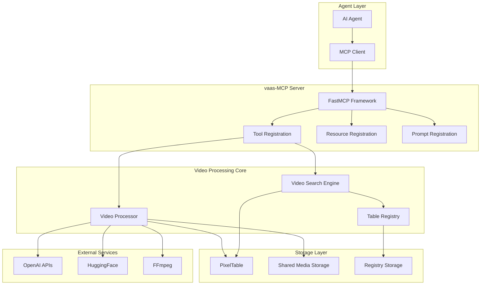
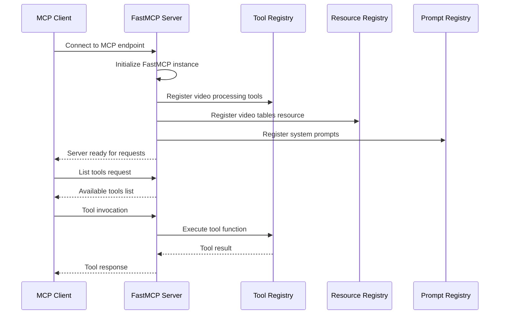
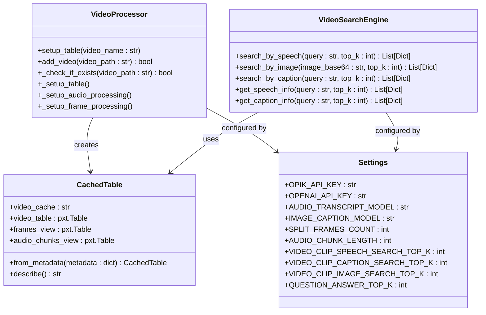
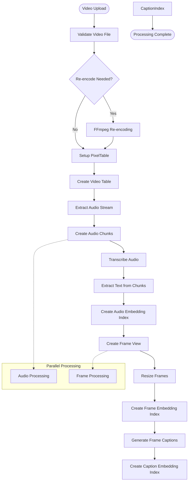
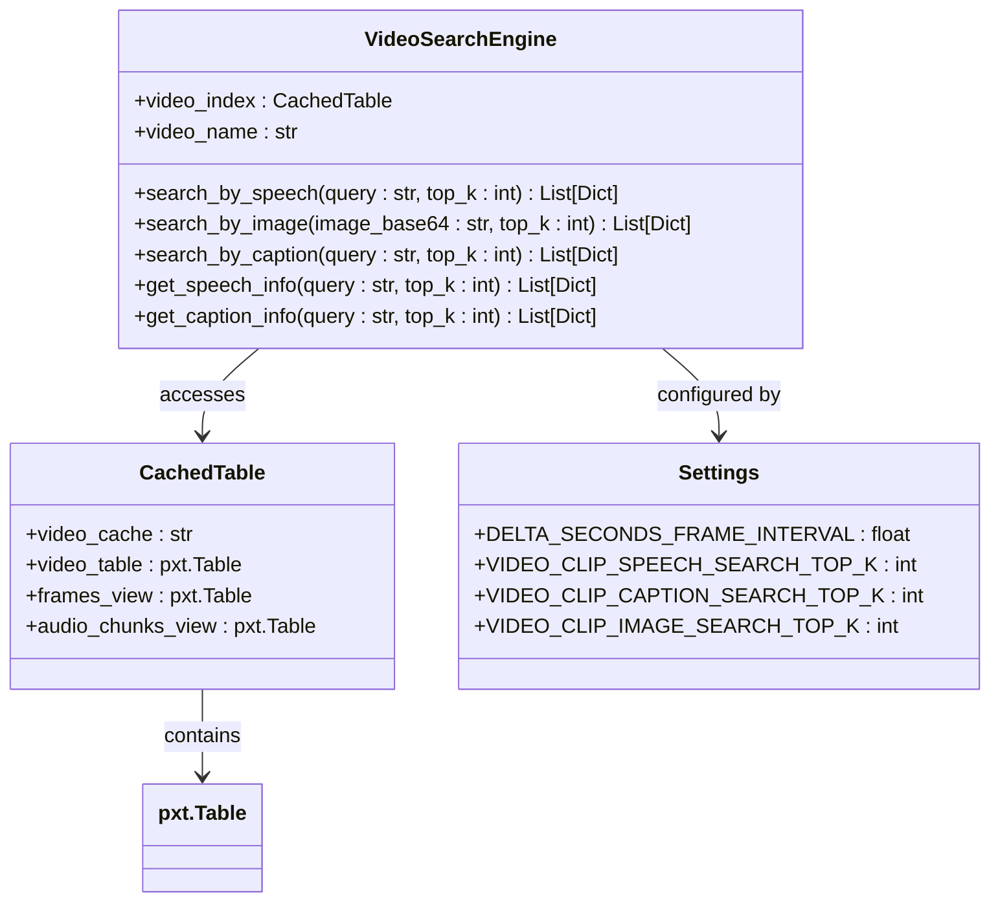
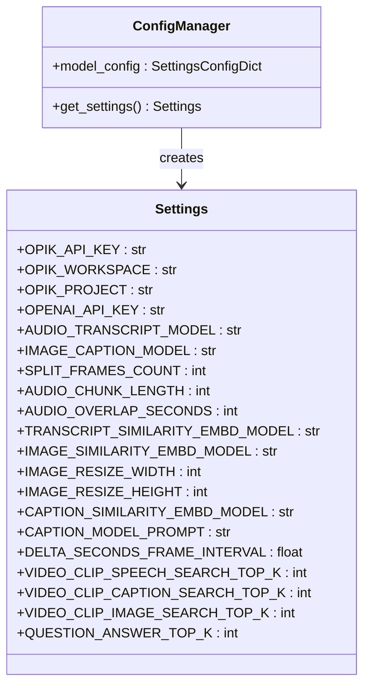
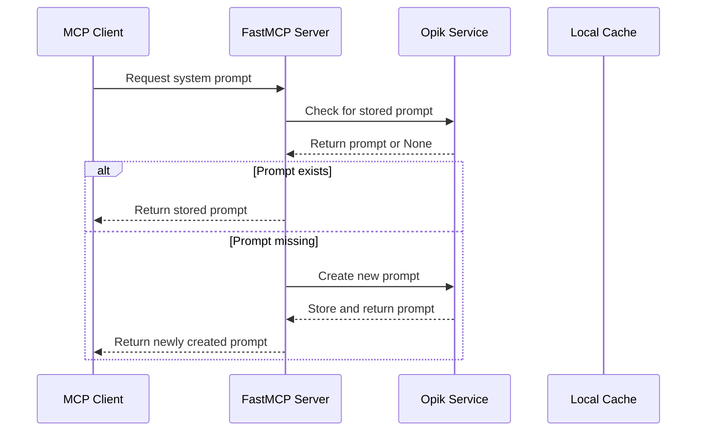
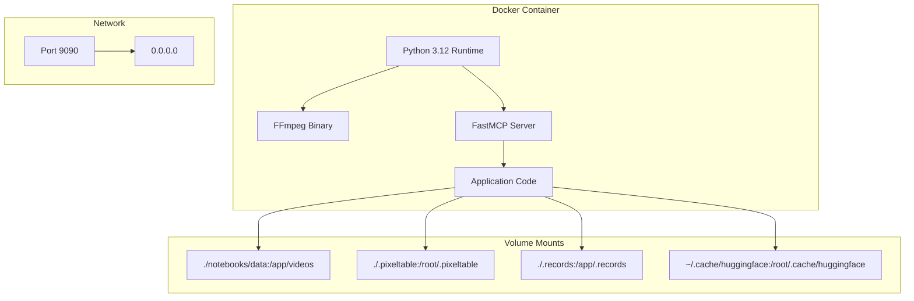

# vaas-MCP Server Architecture

<cite>
**Referenced Files in This Document**
- [server.py](file://vaas-mcp/src/vaas_mcp/server.py)
- [tools.py](file://vaas-mcp/src/vaas_mcp/tools.py)
- [config.py](file://vaas-mcp/src/vaas_mcp/config.py)
- [video_processor.py](file://vaas-mcp/src/vaas_mcp/video/ingestion/video_processor.py)
- [video_search_engine.py](file://vaas-mcp/src/vaas_mcp/video/video_search_engine.py)
- [resources.py](file://vaas-mcp/src/vaas_mcp/resources.py)
- [prompts.py](file://vaas-mcp/src/vaas_mcp/prompts.py)
- [models.py](file://vaas-mcp/src/vaas_mcp/video/ingestion/models.py)
- [registry.py](file://vaas-mcp/src/vaas_mcp/video/ingestion/registry.py)
- [tools.py](file://vaas-mcp/src/vaas_mcp/video/ingestion/tools.py)
- [constants.py](file://vaas-mcp/src/vaas_mcp/video/ingestion/constants.py)
- [Dockerfile](file://vaas-mcp/Dockerfile)
- [Makefile](file://vaas-mcp/Makefile)
</cite>

## Table of Contents
1. [Introduction](#introduction)
2. [System Architecture Overview](#system-architecture-overview)
3. [FastMCP Framework Integration](#fastmcp-framework-integration)
4. [Core Components](#core-components)
5. [Video Processing Pipeline](#video-processing-pipeline)
6. [Search Engine Architecture](#search-engine-architecture)
7. [Configuration Management](#configuration-management)
8. [Resource and Prompt Management](#resource-and-prompt-management)
9. [Deployment and Scalability](#deployment-and-scalability)
10. [Performance Considerations](#performance-considerations)
11. [Troubleshooting Guide](#troubleshooting-guide)
12. [Conclusion](#conclusion)

## Introduction

The vaas-MCP server serves as a Model Context Protocol (MCP) server that exposes sophisticated video processing tools to the main agent system. Built on the FastMCP framework, this server acts as a bridge between the agent and the underlying video processing infrastructure, providing capabilities for video ingestion, indexing, search, and retrieval operations.

The server implements a stateless architecture where video processing operations are executed on-demand, relying on shared storage systems for file access and maintaining video indices through PixelTable. This design enables horizontal scaling and efficient resource utilization while providing powerful multimodal search capabilities across video content.

## System Architecture Overview

The vaas-MCP server follows a modular architecture that separates concerns between tool registration, video processing, search operations, and resource management. The system is designed around the Model Context Protocol (MCP) specification, enabling seamless integration with AI agents and LLM systems.

**Diagram sources**
- [server.py](file://vaas-mcp/src/vaas_mcp/server.py#L1-L97)
- [video_processor.py](file://vaas-mcp/src/vaas_mcp/video/ingestion/video_processor.py#L1-L205)
- [video_search_engine.py](file://vaas-mcp/src/vaas_mcp/video/video_search_engine.py#L1-L168)

## FastMCP Framework Integration

The vaas-MCP server leverages the FastMCP framework to provide standardized tool discovery, invocation, and resource management capabilities. The integration follows a structured approach to register tools, resources, and prompts with the MCP server.

**Diagram sources**
- [server.py](file://vaas-mcp/src/vaas_mcp/server.py#L15-L42)
- [server.py](file://vaas-mcp/src/vaas_mcp/server.py#L85-L95)

The server initializes with a dedicated FastMCP instance named "VideoProcessor" and registers three categories of components:

1. **Tools**: Video processing functions including `process_video`, `get_video_clip_from_user_query`, `get_video_clip_from_image`, and `ask_question_about_video`
2. **Resources**: Video table listings and metadata
3. **Prompts**: System prompts for routing, tool usage, and general conversation

**Section sources**
- [server.py](file://vaas-mcp/src/vaas_mcp/server.py#L1-L97)

## Core Components

### Tool Implementation Layer

The tool implementation layer provides the core video processing functionality through four primary tools that handle different aspects of video manipulation and analysis.

**Diagram sources**
- [video_processor.py](file://vaas-mcp/src/vaas_mcp/video/ingestion/video_processor.py#L20-L205)
- [video_search_engine.py](file://vaas-mcp/src/vaas_mcp/video/video_search_engine.py#L10-L168)
- [models.py](file://vaas-mcp/src/vaas_mcp/video/ingestion/models.py#L15-L119)
- [config.py](file://vaas-mcp/src/vaas_mcp/config.py#L5-L55)

### Tool Registration and Invocation

The tool registration process demonstrates how the FastMCP framework integrates with the video processing pipeline. Each tool is registered with specific metadata including name, description, and tags for categorization.

**Section sources**
- [server.py](file://vaas-mcp/src/vaas_mcp/server.py#L15-L42)
- [tools.py](file://vaas-mcp/src/vaas_mcp/tools.py#L1-L105)

## Video Processing Pipeline

The video processing pipeline transforms raw video files into searchable multimedia assets through a series of computational steps. The pipeline utilizes PixelTable for efficient data management and OpenAI/HuggingFace APIs for advanced processing capabilities.

**Diagram sources**
- [video_processor.py](file://vaas-mcp/src/vaas_mcp/video/ingestion/video_processor.py#L50-L205)
- [tools.py](file://vaas-mcp/src/vaas_mcp/tools.py#L15-L35)

The video processing pipeline consists of several key stages:

1. **Video Validation and Re-encoding**: Ensures compatibility with PyAV library through FFmpeg
2. **Table Creation**: Establishes PixelTable structure for video data
3. **Audio Processing**: Extracts audio streams, creates chunks, transcribes, and generates embeddings
4. **Frame Processing**: Splits video into frames, resizes, generates captions, and creates embeddings
5. **Index Creation**: Builds embedding indexes for efficient similarity search

**Section sources**
- [video_processor.py](file://vaas-mcp/src/vaas_mcp/video/ingestion/video_processor.py#L1-L205)
- [tools.py](file://vaas-mcp/src/vaas_mcp/tools.py#L15-L35)

## Search Engine Architecture

The VideoSearchEngine provides multimodal search capabilities across video content, supporting speech, image, and caption-based queries. The search engine leverages embedding indexes created during video processing to deliver fast and accurate results.

**Diagram sources**
- [video_search_engine.py](file://vaas-mcp/src/vaas_mcp/video/video_search_engine.py#L10-L168)
- [models.py](file://vaas-mcp/src/vaas_mcp/video/ingestion/models.py#L15-L40)

The search engine supports three primary search modalities:

1. **Speech Search**: Uses audio chunk embeddings to find relevant speech segments
2. **Image Search**: Leverages CLIP embeddings to match query images with video frames
3. **Caption Search**: Utilizes text embeddings to find semantically similar captions

Each search operation returns structured results with timing information, similarity scores, and metadata for precise video clip extraction.

**Section sources**
- [video_search_engine.py](file://vaas-mcp/src/vaas_mcp/video/video_search_engine.py#L1-L168)

## Configuration Management

The configuration system uses Pydantic Settings with environment variable support, providing centralized management of all system parameters. The configuration is cached using LRU cache for optimal performance.

**Diagram sources**
- [config.py](file://vaas-mcp/src/vaas_mcp/config.py#L5-L55)

Key configuration categories include:

- **OPIK Configuration**: Monitoring and logging settings
- **OpenAI Configuration**: API keys and model specifications
- **Video Ingestion Configuration**: Processing parameters and chunk sizes
- **Similarity Search Configuration**: Embedding models and search parameters
- **Search Engine Configuration**: Top-K values for different search types

**Section sources**
- [config.py](file://vaas-mcp/src/vaas_mcp/config.py#L1-L56)

## Resource and Prompt Management

The server manages two primary resource types and three system prompts, providing dynamic content delivery and flexible system behavior.

### Resource Management

The resource management system handles video table listings and metadata through a centralized registry mechanism. The `list_tables` function provides a JSON interface to the video index registry.

### Prompt Management

The prompt management system integrates with Opik for dynamic prompt storage and retrieval. The system supports three specialized prompts:

1. **Routing System Prompt**: Determines when tool usage is required
2. **Tool Use System Prompt**: Guides tool selection based on user queries
3. **General System Prompt**: Provides conversational context and personality

**Diagram sources**
- [prompts.py](file://vaas-mcp/src/vaas_mcp/prompts.py#L40-L108)

**Section sources**
- [resources.py](file://vaas-mcp/src/vaas_mcp/resources.py#L1-L40)
- [prompts.py](file://vaas-mcp/src/vaas_mcp/prompts.py#L1-L109)

## Deployment and Scalability

The vaas-MCP server is containerized using Docker, providing consistent deployment across environments. The deployment strategy emphasizes statelessness and shared storage for scalability.

**Diagram sources**
- [Dockerfile](file://vaas-mcp/Dockerfile#L1-L20)
- [Makefile](file://vaas-mcp/Makefile#L15-L17)

### Scalability Considerations

The server's stateless architecture enables horizontal scaling through:

1. **Container Orchestration**: Docker containers can be scaled independently
2. **Shared Storage**: Video files and indices are stored in persistent volumes
3. **Load Balancing**: Multiple instances can serve the same video indices
4. **Resource Pooling**: Concurrent video processing can utilize shared resources

### Environment Configuration

The deployment relies on environment variables for configuration, with the `.env` file providing sensitive settings:

- **API Keys**: OpenAI, Opik, and other service credentials
- **Storage Paths**: Volume mount configurations for data persistence
- **Processing Parameters**: Video processing and search thresholds

**Section sources**
- [Dockerfile](file://vaas-mcp/Dockerfile#L1-L20)
- [Makefile](file://vaas-mcp/Makefile#L1-L43)

## Performance Considerations

The vaas-MCP server implements several performance optimization strategies to handle concurrent video processing and large-scale deployments.

### Concurrent Processing Challenges

The server faces several concurrency challenges:

1. **Resource Contention**: Multiple video processing operations competing for CPU and memory
2. **Storage Bottlenecks**: Shared storage systems becoming performance limits
3. **API Rate Limits**: External service rate limiting affecting processing speed
4. **Memory Management**: Large video files requiring efficient memory allocation

### Optimization Strategies

Several optimization approaches are implemented:

1. **Caching Mechanisms**: LRU caching for configuration and registry data
2. **Lazy Loading**: Video indices loaded on-demand rather than pre-initialized
3. **Streaming Processing**: Large video files processed in chunks
4. **Embedding Indexing**: Pre-computed embeddings for fast similarity search
5. **Resource Pooling**: Shared connections to external services

### Performance Monitoring

The system integrates with Opik for performance monitoring and observability:

- **Request Tracing**: End-to-end request tracking across components
- **Metric Collection**: Processing time and resource utilization metrics
- **Error Tracking**: Comprehensive error logging and alerting
- **Capacity Planning**: Historical data for scaling decisions

## Troubleshooting Guide

Common issues and their solutions when working with the vaas-MCP server:

### Video Processing Issues

**Problem**: Video files fail to process
**Solution**: 
- Verify FFmpeg installation and accessibility
- Check video format compatibility with PyAV
- Review shared media volume mounts
- Validate API key configurations

**Problem**: Embedding creation failures
**Solution**:
- Verify OpenAI/HuggingFace API connectivity
- Check API quota limits
- Review embedding model availability
- Validate network proxy settings

### Search Performance Issues

**Problem**: Slow search responses
**Solution**:
- Increase embedding index parameters
- Optimize video chunk sizes
- Review similarity threshold settings
- Monitor storage performance

**Problem**: Inaccurate search results
**Solution**:
- Adjust similarity thresholds
- Review embedding model configurations
- Verify video processing completeness
- Check search query formatting

### Deployment Issues

**Problem**: Container startup failures
**Solution**:
- Verify Docker daemon availability
- Check volume mount permissions
- Review environment variable configurations
- Validate port availability

**Problem**: Network connectivity issues
**Solution**:
- Verify firewall configurations
- Check DNS resolution
- Review network security groups
- Test external service connectivity

**Section sources**
- [video_processor.py](file://vaas-mcp/src/vaas_mcp/video/ingestion/video_processor.py#L180-L205)
- [tools.py](file://vaas-mcp/src/vaas_mcp/tools.py#L15-L35)

## Conclusion

The vaas-MCP server represents a sophisticated architecture for video processing and search operations, built on robust foundations of modern AI technologies and cloud-native deployment practices. The system successfully bridges the gap between AI agents and complex video processing workflows through its Model Context Protocol implementation.

Key architectural strengths include:

- **Modular Design**: Clear separation of concerns enabling maintainability and extensibility
- **Scalable Infrastructure**: Stateless architecture supporting horizontal scaling
- **Rich Functionality**: Comprehensive video processing and search capabilities
- **Production Ready**: Containerized deployment with comprehensive monitoring
- **Extensible Framework**: Plugin architecture supporting future enhancements

The server's integration with PixelTable, OpenAI APIs, and HuggingFace provides a powerful foundation for advanced video analytics, while the FastMCP framework ensures seamless integration with AI agents and LLM systems. The comprehensive configuration system and resource management capabilities make the platform suitable for enterprise deployments requiring robust video processing capabilities.

Future enhancements could include distributed processing capabilities, advanced caching strategies, and expanded multimodal search capabilities to further enhance the system's scalability and performance characteristics.