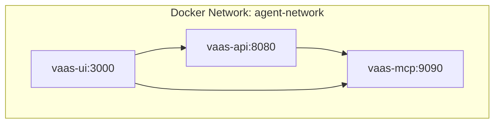
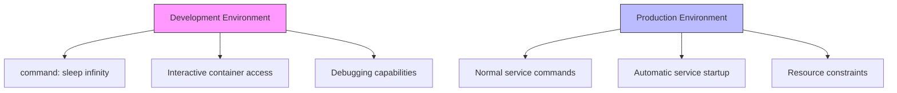
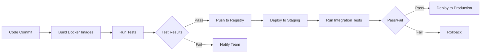

# Configuration and Deployment

<cite>
**Referenced Files in This Document**   
- [docker-compose.yml](file://docker-compose.yml)
- [docker-compose.dev.yml](file://docker-compose.dev.yml)
- [vaas-api/src/vaas_api/config.py](file://vaas-api/src/vaas_api/config.py)
- [vaas-mcp/src/vaas_mcp/config.py](file://vaas-mcp/src/vaas_mcp/config.py)
- [vaas-api/Dockerfile](file://vaas-api/Dockerfile)
- [vaas-mcp/Dockerfile](file://vaas-mcp/Dockerfile)
- [vaas-ui/Dockerfile](file://vaas-ui/Dockerfile)
- [vaas-api/README.md](file://vaas-api/README.md)
- [vaas-mcp/README.md](file://vaas-mcp/README.md)
- [GETTING_STARTED.md](file://GETTING_STARTED.md)
- [Makefile](file://Makefile)
</cite>

## Table of Contents
1. [Introduction](#introduction)
2. [Environment Variables](#environment-variables)
3. [Configuration Hierarchy](#configuration-hierarchy)
4. [Docker Compose Setup](#docker-compose-setup)
5. [Production vs Development Configuration](#production-vs-development-configuration)
6. [Scaling Considerations](#scaling-considerations)
7. [Deployment Scenarios](#deployment-scenarios)
8. [Security Best Practices](#security-best-practices)
9. [Troubleshooting Guide](#troubleshooting-guide)
10. [Conclusion](#conclusion)

## Introduction
This document provides comprehensive guidance on configuring and deploying the multimodal-agents-course system, which consists of three core components: vaas-api, vaas-mcp, and vaas-ui. The system enables advanced video processing and multimodal agent interactions through a well-structured microservices architecture. This guide covers all aspects of configuration, from environment variables and configuration hierarchy to Docker Compose setup, scaling strategies, and security practices. The documentation is designed to support deployment across various environments including local development, cloud infrastructure, and CI/CD pipelines.

**Section sources**
- [GETTING_STARTED.md](file://GETTING_STARTED.md#L1-L58)
- [docker-compose.yml](file://docker-compose.yml#L1-L67)

## Environment Variables
The multimodal-agents-course system relies on several critical environment variables for proper operation, organized by service component.

### vaas-api Environment Variables
The vaas-api service requires the following environment variables:

- **GROQ_API_KEY**: Authentication key for accessing Groq API services
- **GROQ_ROUTING_MODEL**: Model identifier for routing operations (default: "meta-llama/llama-4-scout-17b-16e-instruct")
- **GROQ_TOOL_USE_MODEL**: Model identifier for tool usage (default: "meta-llama/llama-4-maverick-17b-128e-instruct")
- **GROQ_IMAGE_MODEL**: Model identifier for image processing (default: "meta-llama/llama-4-maverick-17b-128e-instruct")
- **GROQ_GENERAL_MODEL**: General purpose model identifier (default: "meta-llama/llama-4-maverick-17b-128e-instruct")
- **OPIK_API_KEY**: API key for Comet ML and Opik services (optional)
- **OPIK_WORKSPACE**: Workspace name for Opik tracking (default: "default")
- **OPIK_PROJECT**: Project name for Opik tracking (default: "vaas-api")
- **AGENT_MEMORY_SIZE**: Number of conversation turns to maintain in agent memory (default: 20)
- **MCP_SERVER**: URL endpoint for the MCP server (default: "http://vaas-mcp:9090/mcp")
- **DISABLE_NEST_ASYNCIO**: Flag to disable nest asyncio (default: True)

### vaas-mcp Environment Variables
The vaas-mcp service requires the following environment variables:

- **OPENAI_API_KEY**: Authentication key for OpenAI API services
- **OPIK_API_KEY**: API key for Comet ML and Opik services
- **OPIK_WORKSPACE**: Workspace name for Opik tracking (default: "default")
- **OPIK_PROJECT**: Project name for Opik tracking (default: "vaas-mcp")
- **HF_HOME**: Path to Hugging Face cache directory (set in docker-compose)

**Section sources**
- [vaas-api/src/vaas_api/config.py](file://vaas-api/src/vaas_api/config.py#L1-L43)
- [vaas-mcp/src/vaas_mcp/config.py](file://vaas-mcp/src/vaas_mcp/config.py#L1-L56)
- [vaas-api/README.md](file://vaas-api/README.md#L1-L102)
- [vaas-mcp/README.md](file://vaas-mcp/README.md#L1-L118)

## Configuration Hierarchy
The configuration system follows a hierarchical approach with default values defined in code and environment-based overrides.

### Default Configuration
Both vaas-api and vaas-mcp services define their default configuration values in their respective config.py files using Pydantic Settings. These defaults provide sensible values for all required parameters, ensuring the system can operate with minimal configuration.

The vaas-api configuration is defined in [vaas-api/src/vaas_api/config.py](file://vaas-api/src/vaas_api/config.py), while the vaas-mcp configuration is in [vaas-mcp/src/vaas_mcp/config.py](file://vaas-mcp/src/vaas_mcp/config.py). Both configurations use the SettingsConfigDict with env_file="service-name/.env" to specify the environment file location.

### Environment Overrides
Environment variables take precedence over default values, allowing for flexible configuration across different deployment environments. The system uses the env_file directive in docker-compose.yml to load variables from .env files located in each service directory.

The configuration hierarchy follows this order of precedence:
1. Environment variables set at runtime
2. Variables defined in the .env file
3. Default values specified in the config.py classes

This hierarchy enables seamless transitions between environments while maintaining consistent defaults. The lru_cache decorator on the get_settings() function ensures configuration is loaded efficiently and consistently across the application.

**Section sources**
- [vaas-api/src/vaas_api/config.py](file://vaas-api/src/vaas_api/config.py#L1-L43)
- [vaas-mcp/src/vaas_mcp/config.py](file://vaas-mcp/src/vaas_mcp/config.py#L1-L56)
- [docker-compose.yml](file://docker-compose.yml#L1-L67)

## Docker Compose Setup
The system uses Docker Compose for container orchestration, with services configured for proper networking and resource management.

### Service Definitions
The docker-compose.yml file defines three main services:

- **vaas-mcp**: Video processing microservice running on port 9090
- **vaas-api**: FastAPI backend service running on port 8080
- **vaas-ui**: React-based user interface running on port 3000

Each service is built from its respective directory context, ensuring proper isolation and independent development.

### Network Configuration
All services are connected to a shared network named "agent-network" defined in the networks section. This enables service-to-service communication using container names as hostnames (e.g., vaas-mcp can be reached at http://vaas-mcp:9090).

**Diagram sources**
- [docker-compose.yml](file://docker-compose.yml#L1-L67)

### Volume Mounting
The system uses volume mounting for shared data and development convenience:

- **shared_media**: Named volume for sharing media files between services
- **.vscode**: Host directory mounted for VS Code configuration
- **~/.cache**: Host cache directories mounted for Hugging Face models

The shared_media volume is defined at the top level and mounted to /app/shared_media in all three services, enabling seamless media sharing across the application stack.

**Section sources**
- [docker-compose.yml](file://docker-compose.yml#L1-L67)
- [docker-compose.dev.yml](file://docker-compose.dev.yml#L1-L68)

## Production vs Development Configuration
The system provides distinct configuration files for production and development environments.

### Production Configuration (docker-compose.yml)
The production configuration focuses on reliability and resource management:

- Services start with their normal command (API server, MCP server, UI)
- Resource limits are set to 4 CPUs and 4GB memory for vaas-mcp
- No development-specific commands or overrides

### Development Configuration (docker-compose.dev.yml)
The development configuration enhances developer productivity:

- Both vaas-mcp and vaas-api services use "sleep infinity" as their command
- This keeps containers running for shell access and debugging
- Enables developers to enter containers and run commands interactively
- Facilitates debugging and testing without service restarts

The key difference is the command override, which transforms the containers into persistent environments suitable for development work. All other configuration aspects (ports, networks, volumes) remain identical to ensure consistency between environments.

**Diagram sources**
- [docker-compose.yml](file://docker-compose.yml#L1-L67)
- [docker-compose.dev.yml](file://docker-compose.dev.yml#L1-L68)

**Section sources**
- [docker-compose.yml](file://docker-compose.yml#L1-L67)
- [docker-compose.dev.yml](file://docker-compose.dev.yml#L1-L68)

## Scaling Considerations
The architecture supports various scaling strategies for different deployment scenarios.

### Multiple API Instances
While the current configuration runs a single vaas-api instance, the stateless nature of the service allows for horizontal scaling. Additional instances can be deployed behind a load balancer to distribute traffic and improve availability.

### Video Processing Load Management
The vaas-mcp service handles video processing and has significant resource requirements:

- CPU-intensive operations for video frame extraction
- Memory requirements for model loading and processing
- I/O operations for media file handling

The current configuration allocates 4 CPUs and 4GB of memory to handle typical workloads. For higher throughput, consider:

- Increasing resource limits based on video processing volume
- Implementing queue-based processing for batch operations
- Using dedicated GPU instances for accelerated processing

### Database Connections
The system currently uses in-memory storage and file-based persistence through the shared_media volume. For production deployments with multiple instances, consider:

- Implementing a centralized database for state management
- Using Redis for session storage and caching
- Configuring connection pooling for database access

The current architecture relies on shared filesystem access rather than traditional database connections, which simplifies deployment but may limit scalability for high-concurrency scenarios.

**Section sources**
- [docker-compose.yml](file://docker-compose.yml#L1-L67)
- [vaas-mcp/src/vaas_mcp/config.py](file://vaas-mcp/src/vaas_mcp/config.py#L1-L56)

## Deployment Scenarios
The system supports multiple deployment scenarios from local development to cloud production.

### Local Development
For local development, use the provided Makefile commands:

- `make start-vaas`: Builds and starts all services
- `make stop-vaas`: Stops all running services
- Development mode uses docker-compose.dev.yml with sleep infinity commands

The .env file validation in the Makefile ensures required configuration is present before deployment.

### Cloud Deployment
For cloud deployment, adapt the docker-compose.yml for your platform:

- Use managed container services (AWS ECS, GCP Cloud Run, Azure Container Instances)
- Configure persistent storage for the shared_media volume
- Set up domain routing and SSL termination
- Implement monitoring and logging pipelines

Consider using the production docker-compose.yml as a base and adding cloud-specific configurations for networking, storage, and security.

### CI/CD Pipelines
Implement CI/CD pipelines with the following stages:

1. **Build**: Create Docker images for each service
2. **Test**: Run unit and integration tests
3. **Deploy**: Push images to registry and update services
4. **Verify**: Run smoke tests on deployed environment

The separation of services enables independent deployment and testing. Use the development configuration for testing environments and production configuration for staging and production.

**Diagram sources**
- [docker-compose.yml](file://docker-compose.yml#L1-L67)
- [Makefile](file://Makefile#L1-L15)

**Section sources**
- [docker-compose.yml](file://docker-compose.yml#L1-L67)
- [Makefile](file://Makefile#L1-L15)
- [GETTING_STARTED.md](file://GETTING_STARTED.md#L1-L58)

## Security Best Practices
Implement these security practices for secure deployment and operation.

### Secrets Management
- Store API keys and sensitive credentials in environment variables
- Never commit .env files to version control
- Use secret management services (AWS Secrets Manager, Hashicorp Vault) in production
- Rotate API keys regularly
- Implement least privilege principle for API key permissions

### Network Isolation
- Use the dedicated agent-network for service communication
- Expose only necessary ports to the host (9090, 8080, 3000)
- Consider adding firewall rules to restrict access
- Use internal DNS names rather than IP addresses for service discovery

### Access Control
- Implement authentication and authorization for API endpoints
- Validate and sanitize all user inputs
- Use HTTPS in production environments
- Implement rate limiting to prevent abuse
- Regularly update dependencies to address security vulnerabilities

The current architecture exposes services on localhost, which provides a basic security boundary. For production deployments, add additional layers of security including TLS encryption and authentication mechanisms.

**Section sources**
- [docker-compose.yml](file://docker-compose.yml#L1-L67)
- [vaas-api/src/vaas_api/config.py](file://vaas-api/src/vaas_api/config.py#L1-L43)
- [vaas-mcp/src/vaas_mcp/config.py](file://vaas-mcp/src/vaas_mcp/config.py#L1-L56)

## Troubleshooting Guide
Address common deployment issues with these troubleshooting tips.

### Container Networking Issues
- Verify all services are on the same network (agent-network)
- Check that service names match in depends_on and URL references
- Test connectivity between containers using docker exec
- Ensure port mappings are correct (9090, 8080, 3000)

### Volume Permission Problems
- Ensure the shared_media volume has proper read/write permissions
- Verify host directories (like ~/.cache) are accessible to containers
- Check that file ownership allows container processes to read/write
- Use appropriate volume mount options for file permissions

### Resource Limit Issues
- Monitor container resource usage with docker stats
- Adjust CPU and memory limits in docker-compose.yml as needed
- Ensure host system has sufficient resources for allocated limits
- Watch for OOM (Out of Memory) kills in container logs

### Environment Variable Problems
- Verify .env files exist in service directories
- Check that environment variable names match configuration expectations
- Ensure required variables (API keys) are set
- Validate that docker-compose env_file directives point to correct locations

Use the Makefile commands and docker logs for diagnosis and resolution of issues.

**Section sources**
- [docker-compose.yml](file://docker-compose.yml#L1-L67)
- [docker-compose.dev.yml](file://docker-compose.dev.yml#L1-L68)
- [Makefile](file://Makefile#L1-L15)

## Conclusion
The multimodal-agents-course system provides a robust foundation for multimodal agent applications with a well-structured configuration and deployment model. The separation of concerns between vaas-api, vaas-mcp, and vaas-ui enables independent development and deployment of each component. The configuration system balances sensible defaults with flexible environment overrides, supporting both development and production scenarios. The Docker Compose setup simplifies local development while providing a foundation for cloud deployment. By following the security best practices and scaling considerations outlined in this document, teams can successfully deploy and maintain the system in various environments from local development to production cloud infrastructure.