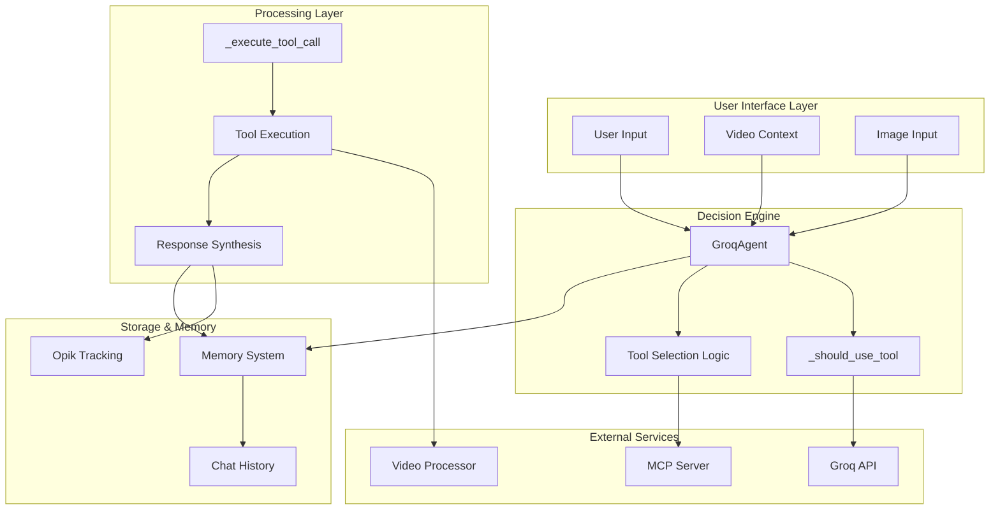
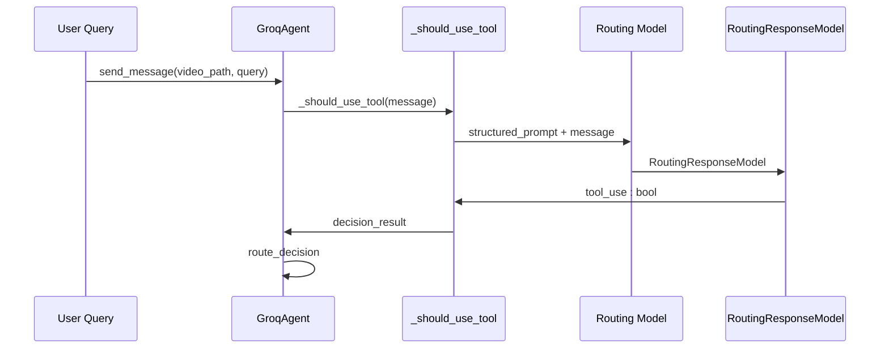
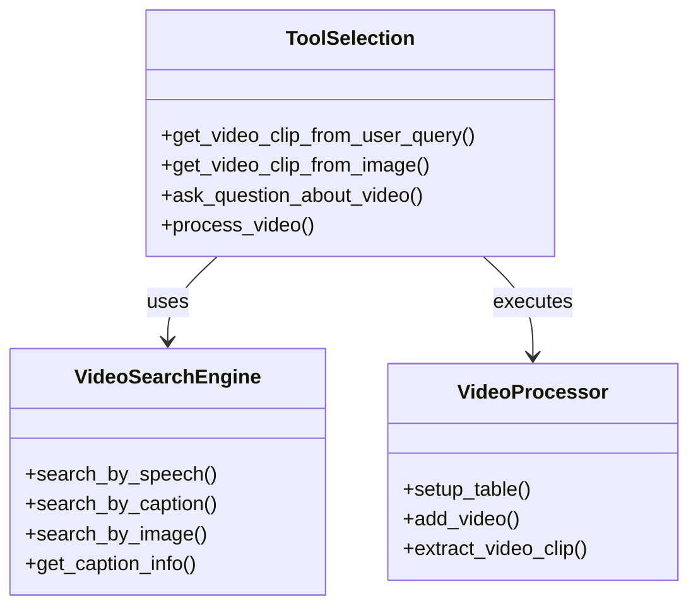
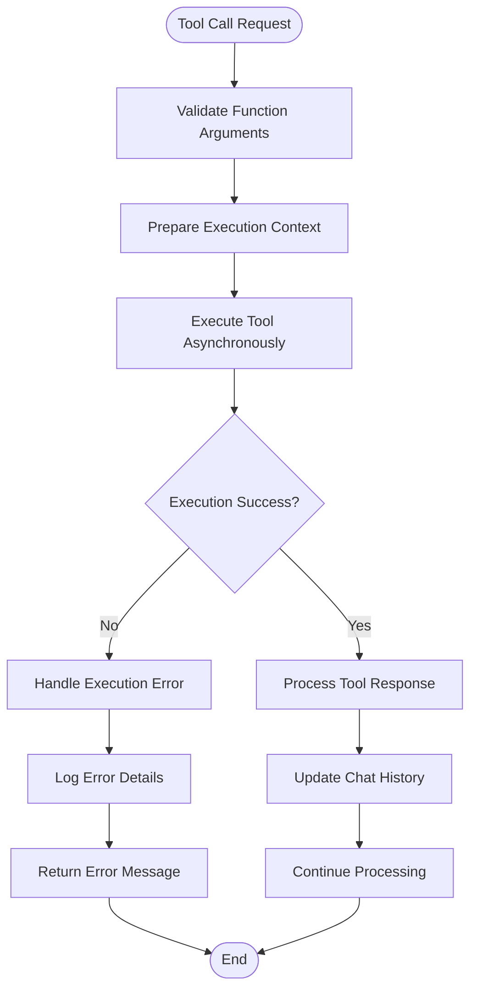
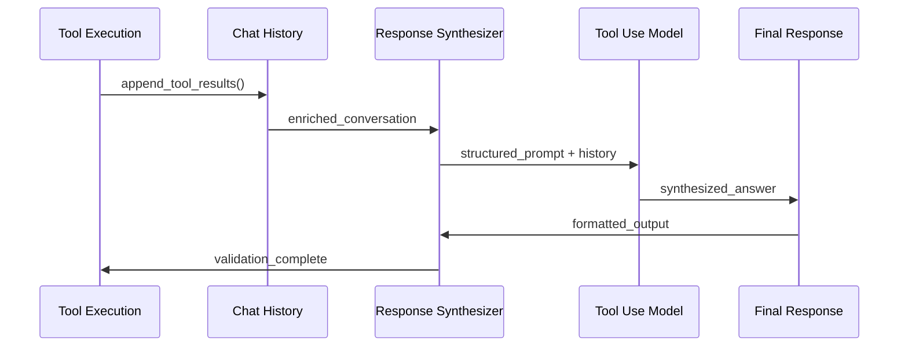
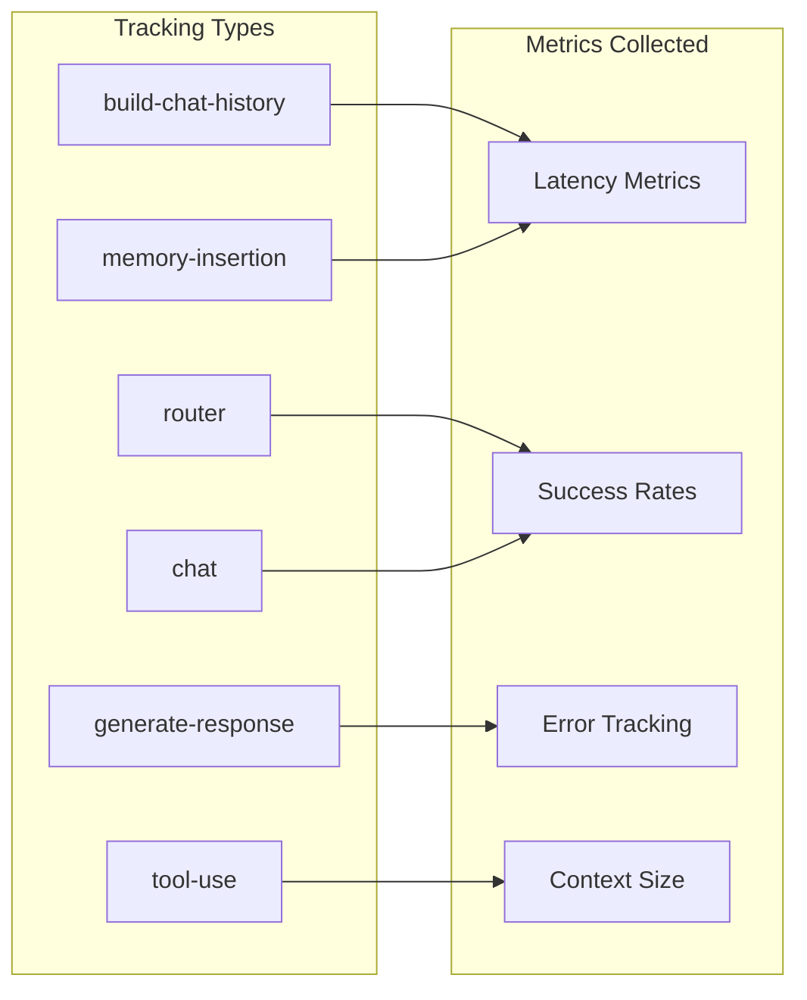
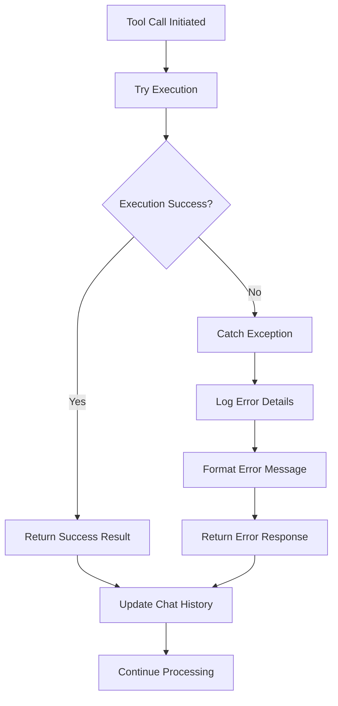

# Agent Decision Logic

<cite>
**Referenced Files in This Document**
- [groq_agent.py](file://vaas-api/src/vaas_api/agent/groq/groq_agent.py)
- [models.py](file://vaas-api/src/vaas_api/models.py)
- [tools.py](file://vaas-api/src/vaas_api/tools.py)
- [base_agent.py](file://vaas-api/src/vaas_api/agent/base_agent.py)
- [prompts.py](file://vaas-mcp/src/vaas_mcp/prompts.py)
- [config.py](file://vaas-api/src/vaas_api/config.py)
- [opik_utils.py](file://vaas-api/src/vaas_api/opik_utils.py)
- [memory.py](file://vaas-api/src/vaas_api/agent/memory.py)
- [server.py](file://vaas-mcp/src/vaas_mcp/server.py)
- [tools.py](file://vaas-mcp/src/vaas_mcp/tools.py)
- [video_search_engine.py](file://vaas-mcp/src/vaas_mcp/video/video_search_engine.py)
</cite>

## Table of Contents
1. [Introduction](#introduction)
2. [Architecture Overview](#architecture-overview)
3. [Routing Decision Logic](#routing-decision-logic)
4. [Tool Selection and Execution](#tool-selection-and-execution)
5. [Response Generation Pipeline](#response-generation-pipeline)
6. [Observability with Opik Tracking](#observability-with-opik-tracking)
7. [Edge Cases and Error Handling](#edge-cases-and-error-handling)
8. [Configuration Management](#configuration-management)
9. [Code Examples](#code-examples)
10. [Performance Considerations](#performance-considerations)

## Introduction

The Agent Decision Logic in the vaas system orchestrates intelligent routing between general conversational responses and specialized video-processing tool calls. The GroqAgent serves as the central orchestrator, utilizing a sophisticated decision-making framework that determines when and how to leverage available tools based on user queries and video context.

This system implements a hybrid approach combining traditional LLM-based reasoning with structured tool execution, enabling seamless transitions between general conversation and specialized video analysis capabilities. The decision logic operates through multiple stages: initial query assessment, tool selection, asynchronous execution, and response synthesis.

## Architecture Overview

The Agent Decision Logic follows a layered architecture that separates concerns between routing, tool execution, and response generation:



**Diagram sources**
- [groq_agent.py](file://vaas-api/src/vaas_api/agent/groq/groq_agent.py#L25-L50)
- [base_agent.py](file://vaas-api/src/vaas_api/agent/base_agent.py#L10-L30)

**Section sources**
- [groq_agent.py](file://vaas-api/src/vaas_api/agent/groq/groq_agent.py#L1-L237)
- [base_agent.py](file://vaas-api/src/vaas_api/agent/base_agent.py#L1-L111)

## Routing Decision Logic

The core decision-making capability resides in the `_should_use_tool` method, which employs a dedicated routing LLM model to assess whether a user query requires specialized tool usage.

### Routing Model Invocation



**Diagram sources**
- [groq_agent.py](file://vaas-api/src/vaas_api/agent/groq/groq_agent.py#L67-L77)
- [models.py](file://vaas-api/src/vaas_api/models.py#L28-L32)

The routing mechanism utilizes a structured JSON response model to ensure deterministic decision-making:

```python
class RoutingResponseModel(BaseModel):
    tool_use: bool = Field(
        description="Whether the user's question requires a tool call."
    )
```

### Decision Criteria

The routing system evaluates several factors to determine tool necessity:

1. **Query Type Analysis**: Determines if the query relates to video content extraction or information retrieval
2. **Video Context Availability**: Requires both video path and query presence for tool consideration
3. **System Prompt Guidance**: Leverages predefined routing system prompts for consistent decision-making
4. **Model Confidence**: Uses structured output to minimize ambiguity in routing decisions

**Section sources**
- [groq_agent.py](file://vaas-api/src/vaas_api/agent/groq/groq_agent.py#L67-L77)
- [prompts.py](file://vaas-mcp/src/vaas_mcp/prompts.py#L8-L25)

## Tool Selection and Execution

Once the routing decision is made, the system enters the tool selection phase where available tools are evaluated and executed asynchronously.

### Available Tools

The system supports four primary tools, each designed for specific video processing tasks:



**Diagram sources**
- [tools.py](file://vaas-mcp/src/vaas_mcp/tools.py#L25-L105)
- [server.py](file://vaas-mcp/src/vaas_mcp/server.py#L10-L40)

### Tool Selection Logic

The tool selection process considers multiple factors:

1. **Image Presence Detection**: If an image is provided, prioritizes `get_video_clip_from_image`
2. **Query Content Analysis**: Matches query patterns to appropriate tool functions
3. **Configuration Filtering**: Respects disabled tools based on system configuration
4. **Asynchronous Execution**: Executes tools concurrently for optimal performance

### Tool Execution Pipeline



**Diagram sources**
- [groq_agent.py](file://vaas-api/src/vaas_api/agent/groq/groq_agent.py#L85-L105)

**Section sources**
- [groq_agent.py](file://vaas-api/src/vaas_api/agent/groq/groq_agent.py#L85-L105)
- [tools.py](file://vaas-mcp/src/vaas_mcp/tools.py#L25-L105)

## Response Generation Pipeline

After tool execution completes, the system generates a natural language response that synthesizes tool outputs into coherent answers.

### Response Model Selection

The system automatically selects appropriate response models based on tool execution:

```python
response_model = (
    GeneralResponseModel if tool_call.function.name == "ask_question_about_video" 
    else VideoClipResponseModel
)
```

### Response Synthesis Process



**Diagram sources**
- [groq_agent.py](file://vaas-api/src/vaas_api/agent/groq/groq_agent.py#L138-L166)

### Video Clip Validation

For video-related responses, the system performs additional validation:

1. **Clip Path Verification**: Ensures generated video clips have valid file paths
2. **First Frame Sampling**: Extracts representative images for visual context
3. **Attachment Integration**: Adds visual context to Opik tracking for enhanced observability

**Section sources**
- [groq_agent.py](file://vaas-api/src/vaas_api/agent/groq/groq_agent.py#L138-L166)
- [tools.py](file://vaas-api/src/vaas_api/tools.py#L4-L13)

## Observability with Opik Tracking

The system integrates comprehensive observability through Opik tracking, providing insights into decision-making processes and execution flows.

### Tracking Categories



**Diagram sources**
- [groq_agent.py](file://vaas-api/src/vaas_api/agent/groq/groq_agent.py#L55-L65)
- [opik_utils.py](file://vaas-api/src/vaas_api/opik_utils.py#L10-L43)

### Trace Integration

Each agent method is decorated with Opik tracking decorators that capture:

1. **Method Execution**: Tracks individual method calls and their durations
2. **Parameter Context**: Captures input parameters for debugging and analysis
3. **Output Results**: Records return values and response content
4. **Error States**: Logs exceptions and failure modes for troubleshooting

**Section sources**
- [groq_agent.py](file://vaas-api/src/vaas_api/agent/groq/groq_agent.py#L55-L65)
- [opik_utils.py](file://vaas-api/src/vaas_api/opik_utils.py#L10-L43)

## Edge Cases and Error Handling

The system implements robust error handling mechanisms to manage various failure scenarios gracefully.

### Tool Execution Failures



**Diagram sources**
- [groq_agent.py](file://vaas-api/src/vaas_api/agent/groq/groq_agent.py#L85-L105)

### Fallback Mechanisms

When tool execution fails, the system falls back to general response generation:

1. **Error Message Propagation**: Passes error details to subsequent response generation
2. **Context Preservation**: Maintains conversation context despite failures
3. **Graceful Degradation**: Continues processing with alternative approaches
4. **Logging and Monitoring**: Records failures for system improvement

### Video Processing Validation

The system validates video processing results:

```python
def validate_video_clip_response(self, video_clip_response: VideoClipResponseModel, video_clip_path: str) -> VideoClipResponseModel:
    """Validate the video clip response."""
    video_clip_response.clip_path = video_clip_path
    return video_clip_response
```

**Section sources**
- [groq_agent.py](file://vaas-api/src/vaas_api/agent/groq/groq_agent.py#L85-L105)
- [groq_agent.py](file://vaas-api/src/vaas_api/agent/groq/groq_agent.py#L78-L84)

## Configuration Management

The system uses a centralized configuration approach that manages all aspect ratios of the decision logic.

### Environment Configuration

```python
class Settings(BaseSettings):
    # --- GROQ Configuration ---
    GROQ_API_KEY: str
    GROQ_ROUTING_MODEL: str = "meta-llama/llama-4-scout-17b-16e-instruct"
    GROQ_TOOL_USE_MODEL: str = "meta-llama/llama-4-maverick-17b-128e-instruct"
    GROQ_GENERAL_MODEL: str = "meta-llama/llama-4-maverick-17b-128e-instruct"
    
    # --- Memory Configuration ---
    AGENT_MEMORY_SIZE: int = 20
    
    # --- MCP Configuration ---
    MCP_SERVER: str = "http://vaas-mcp:9090/mcp"
```

### Dynamic Tool Configuration

The system supports runtime tool disabling based on configuration:

```python
def filter_active_tools(self, tools: list) -> list:
    """
    Filter the list of tools to only include the active tools.
    """
    return [tool for tool in tools if tool.name not in self.disable_tools]
```

**Section sources**
- [config.py](file://vaas-api/src/vaas_api/config.py#L5-L25)
- [base_agent.py](file://vaas-api/src/vaas_api/agent/base_agent.py#L45-L50)

## Code Examples

### Example 1: Query Processing with Tool Usage

```python
# User query that triggers tool usage
message = "Find where this was said in the movie"
video_path = "/path/to/video.mp4"

# Agent decision process
tool_required = video_path and self._should_use_tool(message)
if tool_required:
    response = await self._run_with_tool(message, video_path)
```

This example demonstrates how a query like "find where this was said" triggers the `get_video_clip_from_user_query` tool through the routing decision process.

### Example 2: Tool Execution Flow

```python
async def _execute_tool_call(self, tool_call: Any, video_path: str, image_base64: str | None = None) -> str:
    function_name = tool_call.function.name
    function_args = json.loads(tool_call.function.arguments)
    
    function_args["video_path"] = video_path
    if function_name == "get_video_clip_from_image":
        function_args["user_image"] = image_base64
    
    try:
        return await self.call_tool(function_name, function_args)
    except Exception as e:
        logger.error(f"Error executing tool {function_name}: {str(e)}")
        return f"Error executing tool {function_name}: {str(e)}"
```

### Example 3: Response Generation

```python
followup_response = self.instructor_client.chat.completions.create(
    model=settings.GROQ_TOOL_USE_MODEL,
    messages=chat_history,
    response_model=response_model,
)
```

**Section sources**
- [groq_agent.py](file://vaas-api/src/vaas_api/agent/groq/groq_agent.py#L180-L200)
- [groq_agent.py](file://vaas-api/src/vaas_api/agent/groq/groq_agent.py#L85-L105)
- [groq_agent.py](file://vaas-api/src/vaas_api/agent/groq/groq_agent.py#L150-L166)

## Performance Considerations

### Asynchronous Processing

The system leverages asynchronous execution for optimal performance:

1. **Concurrent Tool Calls**: Multiple tools can execute simultaneously
2. **Non-blocking I/O**: Video processing operations don't block the main thread
3. **Efficient Memory Management**: Limited memory retention prevents resource exhaustion
4. **Connection Pooling**: Reuses connections to external services

### Caching and Optimization

1. **Model Selection**: Different models for different tasks optimize cost and performance
2. **Memory Limits**: Configurable memory size prevents excessive storage
3. **Tool Discovery Caching**: Expensive tool discovery operations are cached
4. **Response Model Optimization**: Structured outputs reduce parsing overhead

### Scalability Features

1. **Horizontal Scaling**: Stateless design enables easy scaling
2. **Resource Isolation**: Separate memory spaces prevent interference
3. **Error Boundaries**: Failures don't cascade to other system components
4. **Monitoring Integration**: Comprehensive tracking enables proactive optimization