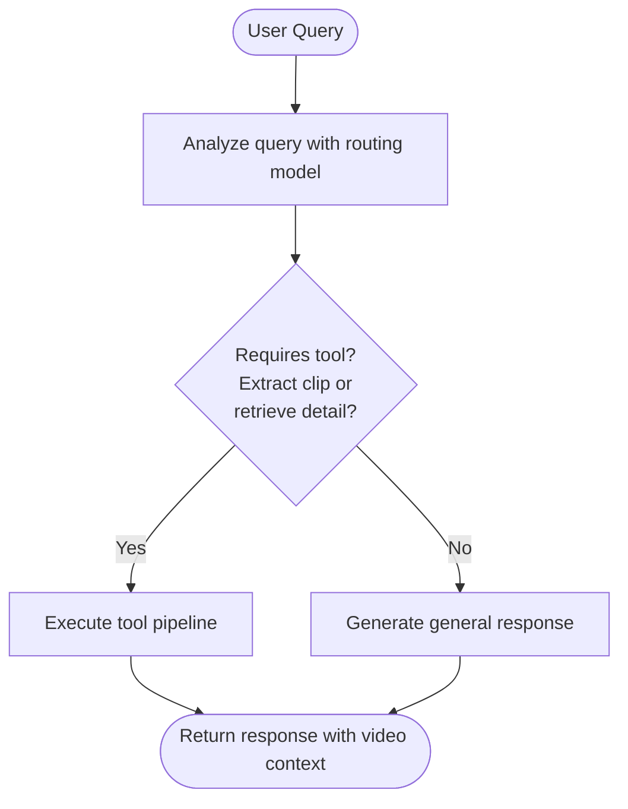
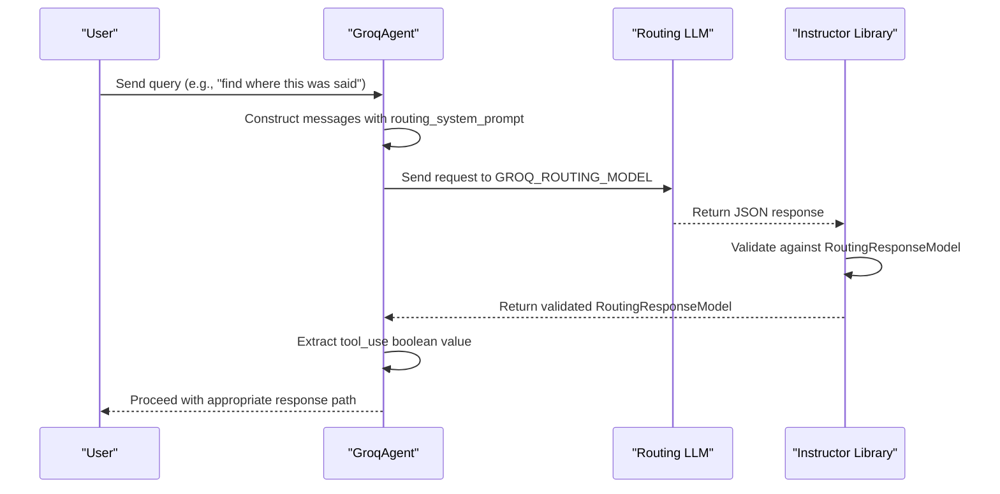
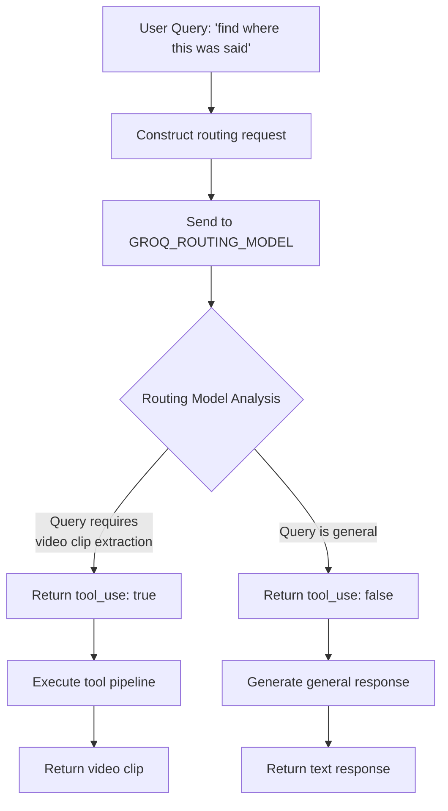
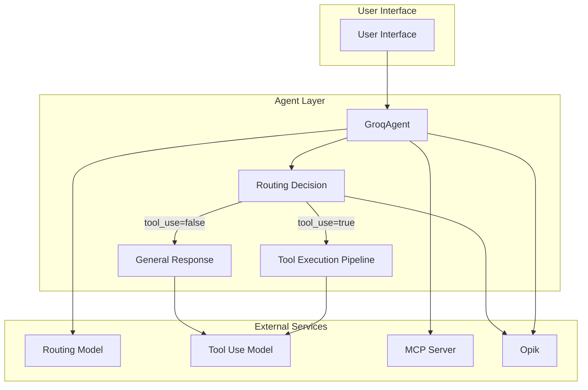

# Agent Routing Mechanism

<cite>
**Referenced Files in This Document**   
- [groq_agent.py](file://vaas-api/src/vaas_api/agent/groq/groq_agent.py)
- [models.py](file://vaas-api/src/vaas_api/models.py)
- [config.py](file://vaas-api/src/vaas_api/config.py)
- [prompts.py](file://vaas-mcp/src/vaas_mcp/prompts.py)
- [opik_utils.py](file://vaas-api/src/vaas_api/opik_utils.py)
</cite>

## Table of Contents
1. [Introduction](#introduction)
2. [Routing Decision Process](#routing-decision-process)
3. [Routing Prompt Construction](#routing-prompt-construction)
4. [Structured Response Parsing](#structured-response-parsing)
5. [Configuration Settings](#configuration-settings)
6. [Code Example: Query Routing](#code-example-query-routing)
7. [Observability with Opik](#observability-with-opik)
8. [Edge Cases and Fallback Behaviors](#edge-cases-and-fallback-behaviors)
9. [Performance Considerations](#performance-considerations)
10. [Architecture Overview](#architecture-overview)

## Introduction
The Agent Routing Mechanism in the vaas system determines whether a user query requires tool invocation by leveraging a dedicated routing LLM model. This mechanism is implemented in the `GroqAgent` class and uses a specialized routing model to make binary decisions about tool usage. The routing decision is influenced by message content, video context, and configuration settings, ensuring efficient processing of user requests while maintaining low-latency responses.

**Section sources**
- [groq_agent.py](file://vaas-api/src/vaas_api/agent/groq/groq_agent.py#L76-L87)

## Routing Decision Process
The routing decision process is centered around the `_should_use_tool` method in the `GroqAgent` class, which evaluates whether a user query requires tool invocation. This method takes a user message as input and returns a boolean indicating whether tools should be used. The decision-making process involves sending the message along with a system prompt to a dedicated routing LLM model specified by the `GROQ_ROUTING_MODEL` configuration.

The routing model analyzes the user's query to determine if it requires operations such as extracting a clip from a specific moment in the video or retrieving information about a particular detail in the video. If the query matches these criteria, the method returns `True`, triggering the tool execution pipeline. Otherwise, it returns `False`, leading to a general response generation without tool invocation.

This binary decision mechanism optimizes system performance by avoiding unnecessary tool calls for simple queries while ensuring complex video-related requests receive appropriate processing.



**Diagram sources**
- [groq_agent.py](file://vaas-api/src/vaas_api/agent/groq/groq_agent.py#L76-L87)
- [models.py](file://vaas-api/src/vaas_api/models.py#L36-L39)

**Section sources**
- [groq_agent.py](file://vaas-api/src/vaas_api/agent/groq/groq_agent.py#L76-L87)

## Routing Prompt Construction
The routing prompt is constructed using the `routing_system_prompt` defined in the MCP server's prompts module. This system prompt provides clear instructions to the routing LLM model about its responsibilities and decision criteria. The prompt explicitly states that the model should determine whether the user needs help with extracting a clip from a specific moment in the video or retrieving information about a particular detail in the video.

The prompt structure includes:
- Role definition: "You are a routing assistant responsible for determining whether the user needs to perform an operation on a video."
- Task specification: Clear enumeration of the two primary tasks that require tool usage
- Output format requirement: A boolean value indicating whether tool usage is required

The system prompt is retrieved asynchronously from the MCP server during agent initialization and cached for subsequent use. If the prompt cannot be retrieved from Opik, a hardcoded version is used as a fallback to ensure system reliability.

```mermaid
classDiagram
class GroqAgent {
+client : Groq
+instructor_client : InstructorClient
+thread_id : str
+routing_system_prompt : str
-_should_use_tool(message : str) bool
-_build_chat_history(...) List[Dict]
-_respond_general(message : str) str
-_run_with_tool(...) str
+chat(message : str, video_path : str, image_base64 : str) AssistantMessageResponse
}
class RoutingResponseModel {
+tool_use : bool
}
class BaseAgent {
+name : str
+mcp_client : Client
+memory : Memory
+disable_tools : list
+tools : list
+routing_system_prompt : str
+tool_use_system_prompt : str
+general_system_prompt : str
+reset_memory() void
+filter_active_tools(tools : list) list
+discover_tools() list
+call_tool(function_name : str, function_args : dict) str
+setup() void
+_get_routing_system_prompt() str
+_get_tool_use_system_prompt() str
+_get_general_system_prompt() str
}
GroqAgent --|> BaseAgent : inherits
GroqAgent --> RoutingResponseModel : uses
GroqAgent --> "routing_system_prompt" : references
```

**Diagram sources**
- [prompts.py](file://vaas-mcp/src/vaas_mcp/prompts.py#L1-L40)
- [groq_agent.py](file://vaas-api/src/vaas_api/agent/groq/groq_agent.py#L76-L87)

**Section sources**
- [prompts.py](file://vaas-mcp/src/vaas_mcp/prompts.py#L1-L40)

## Structured Response Parsing
The structured response parsing is handled through the `RoutingResponseModel` Pydantic model, which defines the expected response format from the routing LLM model. This model contains a single field `tool_use` of type boolean, with a descriptive field that clarifies its purpose: "Whether the user's question requires a tool call."

The integration with the Instructor library enables structured output parsing, ensuring that the LLM response is automatically validated and converted into the `RoutingResponseModel` instance. This approach guarantees type safety and eliminates the need for manual JSON parsing or error-prone string manipulation.

When the routing model generates a response, the Instructor library enforces the schema defined by `RoutingResponseModel`, automatically extracting the boolean value for `tool_use`. If the model produces invalid output, the library handles validation errors gracefully, preventing malformed responses from propagating through the system.

This structured approach to response parsing enhances system reliability and maintainability by providing clear contracts between components and enabling automatic documentation generation.



**Diagram sources**
- [models.py](file://vaas-api/src/vaas_api/models.py#L36-L39)
- [groq_agent.py](file://vaas-api/src/vaas_api/agent/groq/groq_agent.py#L76-L87)

**Section sources**
- [models.py](file://vaas-api/src/vaas_api/models.py#L36-L39)

## Configuration Settings
The routing mechanism is configured through several key settings defined in the `config.py` file. The primary configuration parameter is `GROQ_ROUTING_MODEL`, which specifies the LLM model used for routing decisions. By default, this is set to "meta-llama/llama-4-scout-17b-16e-instruct", a model optimized for fast, lightweight decision-making tasks.

Other relevant configuration settings include:
- `GROQ_TOOL_USE_MODEL`: Specifies the model used for tool execution (default: "meta-llama/llama-4-maverick-17b-128e-instruct")
- `AGENT_MEMORY_SIZE`: Determines how many recent messages are included in the context (default: 20)
- `MCP_SERVER`: Specifies the endpoint for the MCP server that provides system prompts

These settings are managed through Pydantic's `BaseSettings` class with environment variable support, allowing for easy configuration across different deployment environments. The settings are cached using `lru_cache` to minimize overhead during repeated access.

The configuration system supports environment-based overrides, enabling different routing models to be used in development, testing, and production environments without code changes.

**Section sources**
- [config.py](file://vaas-api/src/vaas_api/config.py#L1-L43)

## Code Example: Query Routing
Consider a user query like "find where this was said" in the context of a video processing application. When this query is received by the `GroqAgent`, the routing mechanism evaluates whether tool invocation is required.

The `_should_use_tool` method constructs a message array containing the routing system prompt and the user's message. This is sent to the routing LLM model specified by `GROQ_ROUTING_MODEL`. Given that the query asks to locate a specific moment in the video, the routing model identifies this as a task requiring tool usage and returns `tool_use=True`.

This decision triggers the tool execution pipeline, where the system will use available tools like `get_video_clip_from_user_query` to extract the relevant video segment. The routing decision enables the system to distinguish between simple informational queries (handled by the general response model) and complex video operations (requiring tool invocation).

The entire process happens transparently to the user, who simply receives an appropriate response based on the routing decision.



**Diagram sources**
- [groq_agent.py](file://vaas-api/src/vaas_api/agent/groq/groq_agent.py#L76-L87)
- [prompts.py](file://vaas-mcp/src/vaas_mcp/prompts.py#L1-L40)

**Section sources**
- [groq_agent.py](file://vaas-api/src/vaas_api/agent/groq/groq_agent.py#L76-L87)

## Observability with Opik
The routing mechanism is integrated with Opik for comprehensive observability and logging of routing decisions. The `@opik.track` decorator is applied to the `_should_use_tool` method, enabling automatic tracing of all routing decisions. Each routing call is tracked as an LLM-type span with the name "router", capturing important metadata including:

- Input messages (system prompt and user query)
- Model used (GROQ_ROUTING_MODEL)
- Response output (tool_use boolean)
- Execution duration
- Thread ID for conversation context

This observability integration allows developers and system administrators to monitor routing performance, analyze decision patterns, and identify potential issues with the routing model. The traces are associated with a specific thread ID, enabling correlation of routing decisions within a conversation context.

Additionally, the system attempts to retrieve system prompts from Opik during initialization, falling back to hardcoded versions if the retrieval fails. This ensures that prompt versioning and management can be handled through the Opik platform while maintaining system reliability.

**Section sources**
- [groq_agent.py](file://vaas-api/src/vaas_api/agent/groq/groq_agent.py#L76-L87)
- [opik_utils.py](file://vaas-api/src/vaas_api/opik_utils.py#L1-L44)

## Edge Cases and Fallback Behaviors
The routing mechanism handles several edge cases and implements fallback behaviors to ensure robust operation:

1. **Ambiguous Queries**: When the routing model receives ambiguous queries that could be interpreted as requiring tools or not, the system relies on the model's confidence in its decision. The binary nature of the `RoutingResponseModel` forces a clear decision, with the system erring on the side of using tools when uncertainty exists.

2. **Model Misclassification**: If the routing model incorrectly classifies a query, the system has limited recovery mechanisms. A false negative (failing to use tools when needed) results in a general response that may not fully address the user's needs. A false positive (using tools when not needed) incurs additional processing overhead but typically results in a valid response.

3. **Prompt Retrieval Failure**: If the system cannot retrieve the routing system prompt from Opik, it falls back to a hardcoded version, ensuring that routing decisions can still be made.

4. **Model Unavailability**: If the routing model is temporarily unavailable, the system would encounter an exception during the API call. Error handling in the calling context would determine the fallback behavior, potentially defaulting to tool usage for video-related queries.

5. **Empty or Malformed Responses**: The Instructor library's validation ensures that only properly formatted responses are accepted. Malformed responses trigger validation errors that prevent incorrect routing decisions.

These fallback behaviors prioritize system availability and graceful degradation over perfect accuracy, ensuring that users always receive a response even when components experience issues.

**Section sources**
- [groq_agent.py](file://vaas-api/src/vaas_api/agent/groq/groq_agent.py#L76-L87)
- [prompts.py](file://vaas-mcp/src/vaas_mcp/prompts.py#L1-L40)

## Performance Considerations
The routing mechanism is designed with low-latency performance as a primary consideration. Several optimizations contribute to fast routing decisions:

1. **Dedicated Routing Model**: The use of a specialized routing model (llama-4-scout) that is smaller and faster than the general-purpose model ensures quick decision-making with minimal computational overhead.

2. **Limited Token Output**: The routing request limits the maximum completion tokens to 20, constraining the response size and reducing processing time.

3. **Caching**: System prompts are retrieved once during initialization and cached, eliminating repeated network calls to the MCP server.

4. **Asynchronous Operations**: The agent architecture supports asynchronous operations, allowing non-blocking execution of routing decisions.

5. **Minimal Context**: The routing decision considers only the current user message and system prompt, avoiding the overhead of processing extensive conversation history.

6. **Efficient Validation**: The use of Pydantic models with Instructor enables efficient structured output parsing without expensive JSON manipulation.

These performance optimizations ensure that routing decisions add minimal latency to the overall response time, typically completing in tens to hundreds of milliseconds depending on model availability and network conditions.

**Section sources**
- [groq_agent.py](file://vaas-api/src/vaas_api/agent/groq/groq_agent.py#L76-L87)
- [config.py](file://vaas-api/src/vaas_api/config.py#L1-L43)

## Architecture Overview
The Agent Routing Mechanism is a critical component of the vaas system architecture, serving as the decision point between general conversation and tool-assisted video processing. The architecture follows a clean separation of concerns, with distinct components for routing, tool execution, and general response generation.

The routing system operates as a gateway, intercepting user queries and determining the appropriate processing path. This design enables efficient resource utilization by avoiding unnecessary tool invocations while ensuring that complex video operations receive the specialized processing they require.

The integration with Opik provides comprehensive observability, allowing for monitoring, debugging, and optimization of the routing decisions. The configuration system enables easy adaptation to different deployment environments and requirements.



**Diagram sources**
- [groq_agent.py](file://vaas-api/src/vaas_api/agent/groq/groq_agent.py#L76-L87)
- [config.py](file://vaas-api/src/vaas_api/config.py#L1-L43)
- [prompts.py](file://vaas-mcp/src/vaas_mcp/prompts.py#L1-L40)

**Section sources**
- [groq_agent.py](file://vaas-api/src/vaas_api/agent/groq/groq_agent.py#L76-L87)
- [config.py](file://vaas-api/src/vaas_api/config.py#L1-L43)
- [prompts.py](file://vaas-mcp/src/vaas_mcp/prompts.py#L1-L40)