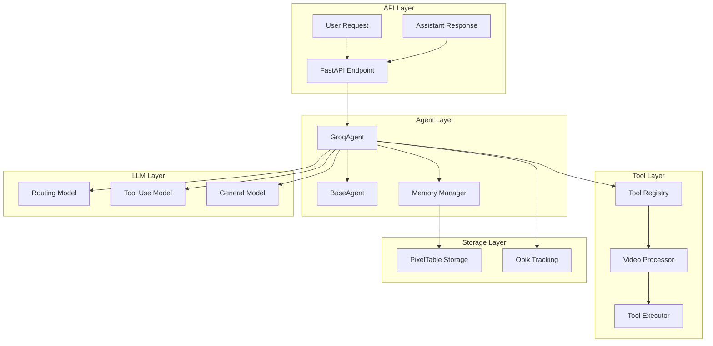
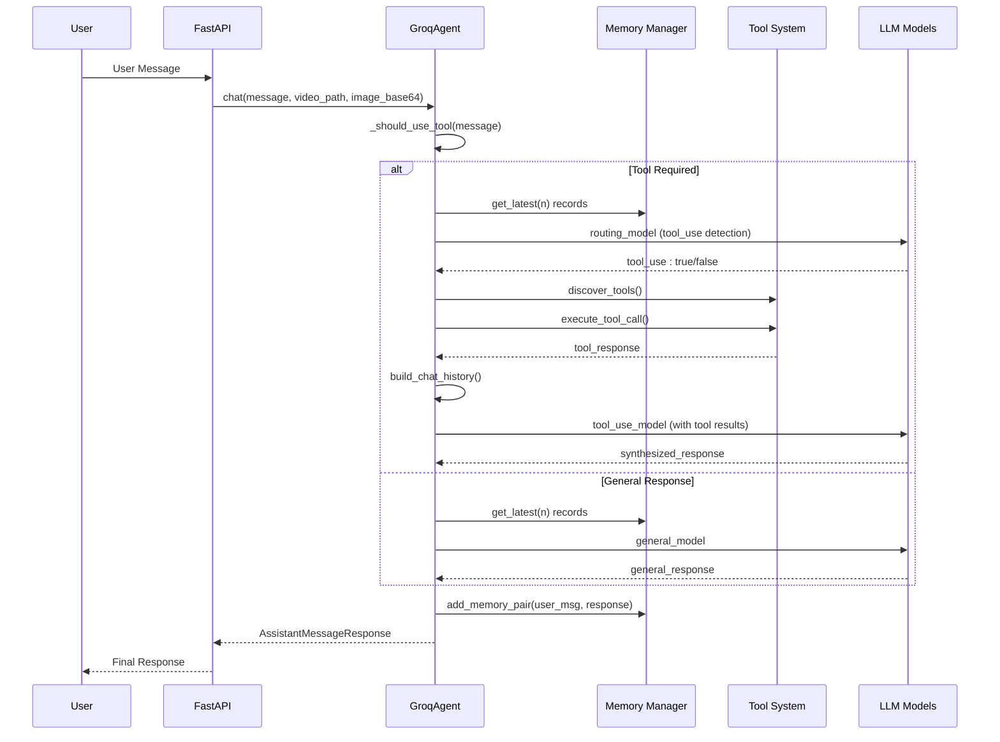
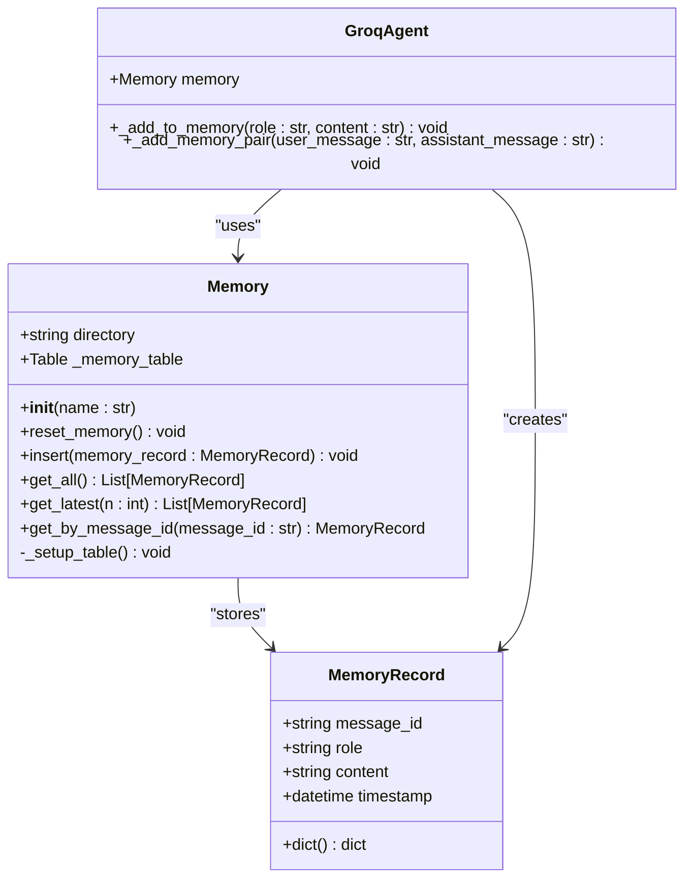
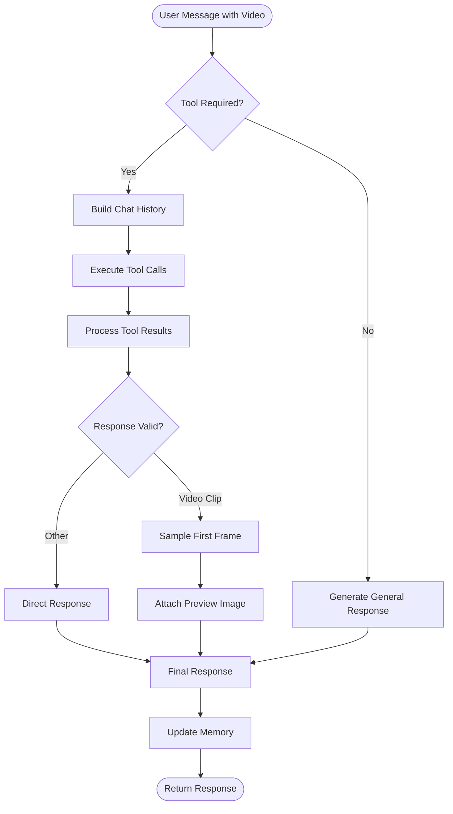
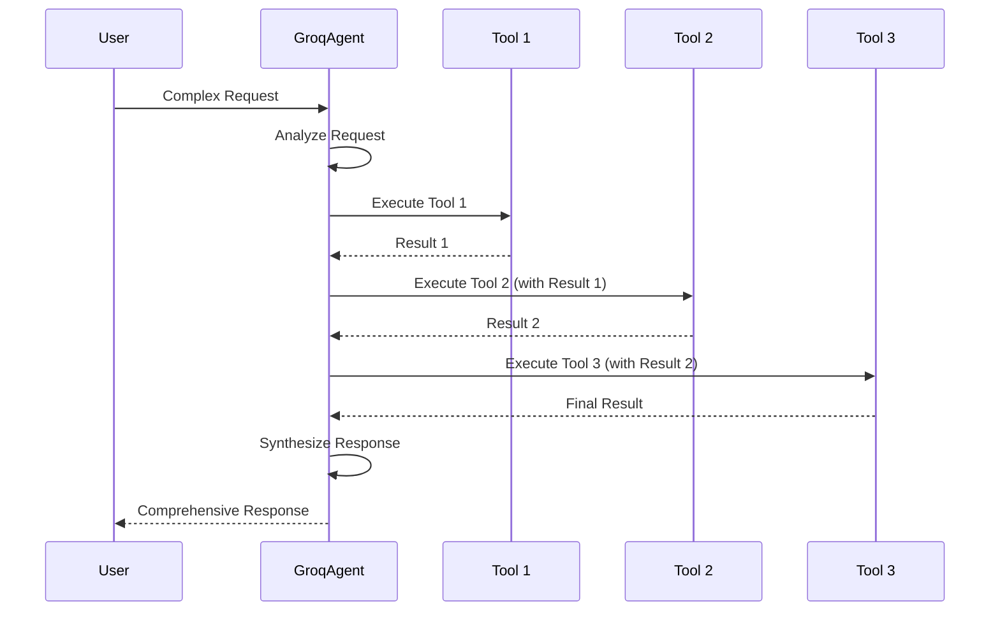
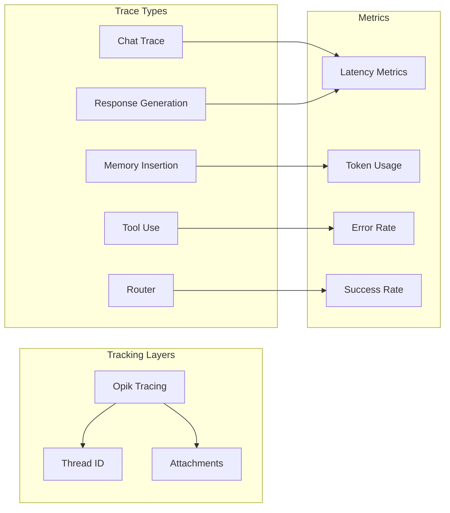

# Response Synthesis

<cite>
**Referenced Files in This Document**
- [groq_agent.py](file://vaas-api/src/vaas_api/agent/groq/groq_agent.py)
- [memory.py](file://vaas-api/src/vaas_api/agent/memory.py)
- [base_agent.py](file://vaas-api/src/vaas_api/agent/base_agent.py)
- [models.py](file://vaas-api/src/vaas_api/models.py)
- [api.py](file://vaas-api/src/vaas_api/api.py)
- [config.py](file://vaas-api/src/vaas_api/config.py)
- [opik_utils.py](file://vaas-api/src/vaas_api/opik_utils.py)
- [tools.py](file://vaas-api/src/vaas_api/tools.py)
- [video_processor.py](file://vaas-mcp/src/vaas_mcp/video/ingestion/video_processor.py)
- [tools.py](file://vaas-mcp/src/vaas_mcp/video/ingestion/tools.py)
- [2_agent_playground.ipynb](file://vaas-api/notebooks/2_agent_playground.ipynb)
- [3_memory_playground.ipynb](file://vaas-api/notebooks/3_memory_playground.ipynb)
</cite>

## Table of Contents
1. [Introduction](#introduction)
2. [System Architecture](#system-architecture)
3. [Response Synthesis Process](#response-synthesis-process)
4. [Memory Management](#memory-management)
5. [Tool Integration](#tool-integration)
6. [Multi-Tool Workflows](#multi-tool-workflows)
7. [Observability and Tracking](#observability-and-tracking)
8. [Prompt Engineering Strategies](#prompt-engineering-strategies)
9. [Error Handling and Partial Failures](#error-handling-and-partial-failures)
10. [Performance Considerations](#performance-considerations)
11. [Example Implementation](#example-implementation)
12. [Best Practices](#best-practices)

## Introduction

Response synthesis is the core mechanism that enables the vaas AI agent to integrate tool execution results back into conversation history and generate natural language responses using the primary LLM. This sophisticated process involves multiple stages of conversation management, tool response processing, and response generation that maintains contextual continuity across user interactions.

The response synthesis system operates through a multi-layered architecture that seamlessly combines conversation memory management, tool execution orchestration, and natural language generation. At its heart lies the GroqAgent class, which orchestrates the entire response synthesis pipeline, from initial user input to final assistant response delivery.

## System Architecture

The response synthesis system follows a modular architecture designed for scalability and maintainability. The system is built around several key components that work together to provide seamless conversation experiences.



**Diagram sources**
- [api.py](file://vaas-api/src/vaas_api/api.py#L1-L50)
- [groq_agent.py](file://vaas-api/src/vaas_api/agent/groq/groq_agent.py#L1-L50)
- [base_agent.py](file://vaas-api/src/vaas_api/agent/base_agent.py#L1-L36)

**Section sources**
- [api.py](file://vaas-api/src/vaas_api/api.py#L1-L198)
- [groq_agent.py](file://vaas-api/src/vaas_api/agent/groq/groq_agent.py#L1-L237)
- [base_agent.py](file://vaas-api/src/vaas_api/agent/base_agent.py#L1-L36)

## Response Synthesis Process

The response synthesis process is orchestrated by the `GroqAgent` class, which manages the complete lifecycle of conversation processing. The process begins with user input and culminates in a natural language response that incorporates tool execution results.



**Diagram sources**
- [groq_agent.py](file://vaas-api/src/vaas_api/agent/groq/groq_agent.py#L197-L235)
- [memory.py](file://vaas-api/src/vaas_api/agent/memory.py#L1-L51)

The synthesis process involves several critical steps:

### 1. Conversation History Building

The `_build_chat_history` method constructs the conversation context by combining system prompts, memory records, and user input:

```python
def _build_chat_history(
    self,
    system_prompt: str,
    user_message: str,
    image_base64: Optional[str] = None,
    n: int = settings.AGENT_MEMORY_SIZE,
) -> List[Dict[str, Any]]:
    history = [{"role": "system", "content": system_prompt}]
    history += [{"role": record.role, "content": record.content} for record in self.memory.get_latest(n)]
    
    user_content = (
        [
            {"type": "text", "text": user_message},
            {
                "type": "image_url",
                "image_url": {"url": f"data:image/jpeg;base64,{image_base64}"},
            },
        ]
        if image_base64
        else user_message
    )
    history.append({"role": "user", "content": user_content})
    return history
```

### 2. Tool Detection and Routing

The system determines whether tool usage is required through the `_should_use_tool` method, which employs a dedicated routing model to analyze user queries:

```python
@opik.track(name="router", type="llm")
def _should_use_tool(self, message: str) -> bool:
    messages = [
        {"role": "system", "content": self.routing_system_prompt},
        {"role": "user", "content": message},
    ]
    response = self.instructor_client.chat.completions.create(
        model=settings.GROQ_ROUTING_MODEL,
        response_model=RoutingResponseModel,
        messages=messages,
        max_completion_tokens=20,
    )
    return response.tool_use
```

### 3. Response Generation

The system employs different LLM models for different scenarios:
- **Routing Model**: Determines if tool usage is required
- **Tool Use Model**: Generates responses incorporating tool results
- **General Model**: Handles standard conversation without tools

**Section sources**
- [groq_agent.py](file://vaas-api/src/vaas_api/agent/groq/groq_agent.py#L40-L235)
- [models.py](file://vaas-api/src/vaas_api/models.py#L25-L53)

## Memory Management

The MemoryManager provides persistent conversation storage using PixelTable, enabling the agent to maintain context across multiple interactions. The memory system is designed for efficient retrieval and long-term storage of conversation history.



**Diagram sources**
- [memory.py](file://vaas-api/src/vaas_api/agent/memory.py#L1-L51)
- [groq_agent.py](file://vaas-api/src/vaas_api/agent/groq/groq_agent.py#L197-L210)

### Memory Operations

The Memory class provides several key operations for conversation management:

```python
class Memory:
    def __init__(self, name: str):
        self.directory = name
        pxt.create_dir(self.directory, if_exists="replace_force")
        self._setup_table()
        self._memory_table = pxt.get_table(f"{self.directory}.memory")

    def insert(self, memory_record: MemoryRecord):
        self._memory_table.insert([memory_record.dict()])

    def get_latest(self, n: int) -> list[MemoryRecord]:
        return self.get_all()[-n:]
```

### Memory Persistence

The system uses PixelTable for efficient storage and retrieval:
- **Automatic Schema Creation**: Tables are automatically created with appropriate schema
- **Timestamp Indexing**: All records include timestamps for chronological ordering
- **Message ID Uniqueness**: Each message has a unique identifier for reference
- **Flexible Content Storage**: Supports both text and structured content

**Section sources**
- [memory.py](file://vaas-api/src/vaas_api/agent/memory.py#L1-L51)
- [config.py](file://vaas-api/src/vaas_api/config.py#L25-L30)

## Tool Integration

The tool integration system enables the agent to execute external tools and incorporate their results into conversation responses. This system is designed to handle various types of tools, from video processing to image analysis.



**Diagram sources**
- [groq_agent.py](file://vaas-api/src/vaas_api/agent/groq/groq_agent.py#L100-L180)
- [tools.py](file://vaas-api/src/vaas_api/tools.py#L1-L14)

### Tool Execution Process

The tool execution process involves several stages:

1. **Tool Discovery**: The agent discovers available tools through the MCP server
2. **Tool Selection**: Based on user input, the appropriate tool is selected
3. **Parameter Preparation**: Tool parameters are prepared, including video paths and optional images
4. **Execution**: Tools are executed asynchronously
5. **Result Processing**: Tool results are processed and incorporated into the conversation

```python
async def _execute_tool_call(self, tool_call: Any, video_path: str, image_base64: str | None = None) -> str:
    function_name = tool_call.function.name
    function_args = json.loads(tool_call.function.arguments)
    
    function_args["video_path"] = video_path
    if function_name == "get_video_clip_from_image":
        function_args["user_image"] = image_base64
    
    try:
        return await self.call_tool(function_name, function_args)
    except Exception as e:
        logger.error(f"Error executing tool {function_name}: {str(e)}")
        return f"Error executing tool {function_name}: {str(e)}"
```

### Tool Response Integration

Tool responses are integrated into the conversation history as assistant messages:

```python
for tool_call in tool_calls:
    function_response = await self._execute_tool_call(tool_call, video_path, image_base64)
    
    if tool_call.function.name == "get_video_clip_from_image":
        tool_response = f"This is the video context. Use it to answer the user's question: {function_response}"
    else:
        tool_response = function_response
    
    chat_history.append({
        "tool_call_id": tool_call.id,
        "role": "tool",
        "name": tool_call.function.name,
        "content": tool_response,
    })
```

**Section sources**
- [groq_agent.py](file://vaas-api/src/vaas_api/agent/groq/groq_agent.py#L100-L180)
- [tools.py](file://vaas-api/src/vaas_api/tools.py#L1-L14)

## Multi-Tool Workflows

The system supports complex multi-tool workflows where multiple tools can be executed in sequence to achieve sophisticated responses. This capability enables the agent to handle complex user requests that require multiple processing steps.

### Workflow Orchestration

Multi-tool workflows are orchestrated through the tool selection and execution pipeline:



**Diagram sources**
- [groq_agent.py](file://vaas-api/src/vaas_api/agent/groq/groq_agent.py#L100-L180)

### Parallel Tool Execution

While the current implementation executes tools sequentially, the architecture supports parallel execution for independent tools:

```python
# Example of parallel tool execution (conceptual)
async def execute_tools_in_parallel(self, tool_calls: List[Any], video_path: str):
    tasks = [
        self._execute_tool_call(tool_call, video_path)
        for tool_call in tool_calls
    ]
    results = await asyncio.gather(*tasks, return_exceptions=True)
    return results
```

### Workflow Validation

The system validates multi-tool workflows to ensure coherent responses:

```python
def validate_video_clip_response(self, video_clip_response: VideoClipResponseModel, video_clip_path: str) -> VideoClipResponseModel:
    """Validate the video clip response."""
    video_clip_response.clip_path = video_clip_path
    return video_clip_response
```

**Section sources**
- [groq_agent.py](file://vaas-api/src/vaas_api/agent/groq/groq_agent.py#L100-L180)

## Observability and Tracking

The system provides comprehensive observability through Opik tracking, enabling monitoring of the entire response generation chain from user input to final output.



**Diagram sources**
- [opik_utils.py](file://vaas-api/src/vaas_api/opik_utils.py#L1-L44)
- [groq_agent.py](file://vaas-api/src/vaas_api/agent/groq/groq_agent.py#L197-L235)

### Opik Configuration

The Opik tracking system is configured through environment variables:

```python
def configure() -> None:
    if settings.OPIK_API_KEY and settings.OPIK_PROJECT:
        try:
            client = OpikConfigurator(api_key=settings.OPIK_API_KEY)
            default_workspace = client._get_default_workspace()
        except Exception:
            logger.warning("Default workspace not found. Setting workspace to None and enabling interactive mode.")
            default_workspace = None
        
        os.environ["OPIK_PROJECT_NAME"] = settings.OPIK_PROJECT
        
        try:
            opik.configure(
                api_key=settings.OPIK_API_KEY,
                workspace=default_workspace,
                use_local=False,
                force=True,
            )
        except Exception as e:
            logger.error(e)
```

### Trace Annotations

The system uses decorators to annotate different stages of the response synthesis process:

```python
@opik.track(name="chat", type="general")
async def chat(self, message: str, video_path: Optional[str] = None, image_base64: Optional[str] = None) -> AssistantMessageResponse:
    """Main entry point for processing a user message."""
    opik_context.update_current_trace(thread_id=self.thread_id)
    # ... rest of implementation
```

### Attachment Handling

For video-related responses, the system attaches preview images for visual inspection:

```python
if isinstance(followup_response, VideoClipResponseModel):
    try:
        logger.info("Validating VideoClip response")
        self.validate_video_clip_response(followup_response, tool_response)
        
        logger.info(f"Tracing image from trimmed clip: {followup_response.clip_path}")
        first_image_path = tools.sample_first_frame(followup_response.clip_path)
        opik_context.update_current_trace(
            attachments=[
                Attachment(
                    data=first_image_path,
                    content_type="image/png",
                )
            ]
        )
    except ValueError as e:
        logger.error(f"Failed to sample first frame from video: {e}")
```

**Section sources**
- [opik_utils.py](file://vaas-api/src/vaas_api/opik_utils.py#L1-L44)
- [groq_agent.py](file://vaas-api/src/vaas_api/agent/groq/groq_agent.py#L197-L235)

## Prompt Engineering Strategies

Effective prompt engineering is crucial for successful response synthesis. The system employs several strategies to optimize LLM interactions and minimize hallucination.

### System Prompt Design

The system uses specialized system prompts for different scenarios:

1. **Routing System Prompt**: Determines if tool usage is required
2. **Tool Use System Prompt**: Guides tool execution and response synthesis
3. **General System Prompt**: Handles standard conversation

### Response Model Structuring

The system uses structured outputs to guide LLM responses:

```python
class VideoClipResponseModel(BaseModel):
    message: str = Field(
        description="A fun and engaging message to the user, asking them to watch the video clip, that needs to follow vaas's style and personality"
    )
    clip_path: str = Field(description="The path to the generated clip.")
```

### Context Preservation Strategies

To maintain context across conversations, the system employs several strategies:

1. **Memory Size Control**: Configurable memory limits prevent context dilution
2. **Selective Retrieval**: Only recent conversations are included in context
3. **Role-Based Filtering**: Different roles receive appropriate context depth

### Hallucination Mitigation

Several techniques are employed to mitigate hallucination:

1. **Structured Responses**: Using Pydantic models ensures predictable output formats
2. **Context Verification**: Tool results are verified before inclusion
3. **Response Validation**: Generated responses undergo validation checks
4. **Attachment Verification**: Visual attachments are validated before display

**Section sources**
- [models.py](file://vaas-api/src/vaas_api/models.py#L25-L53)
- [config.py](file://vaas-api/src/vaas_api/config.py#L25-L30)

## Error Handling and Partial Failures

The system implements robust error handling mechanisms to manage partial failures and ensure graceful degradation of service quality.

### Tool Execution Error Handling

```python
async def _execute_tool_call(self, tool_call: Any, video_path: str, image_base64: str | None = None) -> str:
    function_name = tool_call.function.name
    function_args = json.loads(tool_call.function.arguments)
    
    function_args["video_path"] = video_path
    if function_name == "get_video_clip_from_image":
        function_args["user_image"] = image_base64
    
    try:
        return await self.call_tool(function_name, function_args)
    except Exception as e:
        logger.error(f"Error executing tool {function_name}: {str(e)}")
        return f"Error executing tool {function_name}: {str(e)}"
```

### Partial Failure Recovery

When tools fail partially, the system continues with available results:

```python
# Example of partial failure handling
try:
    tool_results = await self.execute_tools_concurrently(tool_calls)
    valid_results = [r for r in tool_results if not isinstance(r, Exception)]
    if valid_results:
        # Continue with successful results
        return self.synthesize_response(valid_results)
    else:
        # Fall back to general response
        return self._respond_general(message)
except Exception as e:
    logger.error(f"Multiple tool failures: {str(e)}")
    return self._respond_general(message)
```

### Memory Integrity

The system ensures memory integrity even when errors occur:

```python
def _add_memory_pair(self, user_message: str, assistant_message: str) -> None:
    try:
        self._add_to_memory("user", user_message)
        self._add_to_memory("assistant", assistant_message)
    except Exception as e:
        logger.error(f"Failed to add memory pair: {str(e)}")
        # Continue with response generation despite memory failure
```

**Section sources**
- [groq_agent.py](file://vaas-api/src/vaas_api/agent/groq/groq_agent.py#L100-L180)

## Performance Considerations

The response synthesis system is designed with several performance optimizations to ensure responsive user interactions.

### Asynchronous Processing

All tool execution and LLM interactions are performed asynchronously:

```python
@opik.track(name="chat", type="general")
async def chat(
    self,
    message: str,
    video_path: Optional[str] = None,
    image_base64: Optional[str] = None,
) -> AssistantMessageResponse:
    """Main entry point for processing a user message."""
    opik_context.update_current_trace(thread_id=self.thread_id)
    
    tool_required = video_path and self._should_use_tool(message)
    
    if tool_required:
        response = await self._run_with_tool(message, video_path, image_base64)
    else:
        response = self._respond_general(message)
    
    self._add_memory_pair(message, response.message)
    return AssistantMessageResponse(**response.dict())
```

### Caching Strategies

The system employs caching at multiple levels:

1. **Memory Caching**: Recent conversations are cached in memory
2. **Tool Result Caching**: Tool results are cached to avoid redundant processing
3. **Model Response Caching**: Frequently used responses are cached

### Resource Management

Efficient resource management prevents memory leaks and ensures optimal performance:

```python
class Memory:
    def reset_memory(self):
        logger.info(f"Resetting memory: {self.directory}")
        pxt.drop_dir(self.directory, if_not_exists="ignore", force=True)
```

**Section sources**
- [groq_agent.py](file://vaas-api/src/vaas_api/agent/groq/groq_agent.py#L197-L235)
- [memory.py](file://vaas-api/src/vaas_api/agent/memory.py#L30-L35)

## Example Implementation

Here's a comprehensive example demonstrating response synthesis with tool integration:

### Scenario: Video Clip Request

**User Input**: "Give me the clip of the scene where Rick says 'pass the butter'"

**Response Synthesis Process**:

1. **Initial Analysis**: The routing model determines that a tool is required
2. **Tool Discovery**: Available video processing tools are identified
3. **Tool Selection**: The `get_video_clip_from_text` tool is selected
4. **Parameter Preparation**: The query and video path are prepared
5. **Tool Execution**: The tool processes the video and extracts the clip
6. **Result Processing**: The tool response is formatted for the LLM
7. **Conversation History**: The tool result is added as an assistant message
8. **Final Response**: The LLM generates a natural language response

```python
# Example response generation
response = await agent.chat(
    "Give me the clip of the scene where Rick says 'pass the butter'",
    "videos/pass_the_butter_rick_and_morty.mp4"
)

# Expected response structure
{
    "message": "Here is the clip where that was said!",
    "clip_path": "/path/to/generated/clip.mp4"
}
```

### Example with Image Context

**User Input**: "Give me the clip where this image appears."

**Additional Steps**:
1. **Image Processing**: The image is processed and converted to base64
2. **Tool Selection**: The `get_video_clip_from_image` tool is selected
3. **Image Integration**: The base64 image is passed to the tool
4. **Response Generation**: The LLM generates a response incorporating the image context

```python
# Image-based response generation
image = Image.open("user_image.jpg")
image_base64 = encode_image(image)

response = await agent.chat(
    "Give me the clip where this image appears.",
    "videos/example_video.mp4",
    image_base64
)
```

**Section sources**
- [2_agent_playground.ipynb](file://vaas-api/notebooks/2_agent_playground.ipynb#L80-L120)
- [groq_agent.py](file://vaas-api/src/vaas_api/agent/groq/groq_agent.py#L197-L235)

## Best Practices

### Response Synthesis Guidelines

1. **Context Management**: Limit conversation history to maintain relevance
2. **Tool Selection**: Use routing models to determine appropriate tool usage
3. **Error Handling**: Implement comprehensive error handling for all components
4. **Observability**: Track all major operations for debugging and monitoring
5. **Performance**: Use asynchronous processing for all I/O operations

### Memory Management Best Practices

1. **Size Limits**: Configure appropriate memory sizes for your use case
2. **Selective Retrieval**: Retrieve only necessary conversation history
3. **Regular Cleanup**: Implement periodic memory cleanup procedures
4. **Backup Strategies**: Ensure memory persistence across restarts

### Tool Integration Recommendations

1. **Validation**: Always validate tool results before incorporating them
2. **Fallback Mechanisms**: Implement fallback responses for tool failures
3. **Parameter Sanitization**: Sanitize all tool parameters to prevent injection attacks
4. **Resource Cleanup**: Clean up temporary files and resources after tool execution

### Monitoring and Maintenance

1. **Performance Metrics**: Monitor response times and success rates
2. **Error Tracking**: Track and analyze error patterns
3. **Model Updates**: Regularly update LLM models for improved performance
4. **Configuration Management**: Use environment variables for configuration

### Security Considerations

1. **Input Validation**: Validate all user inputs and tool parameters
2. **Access Control**: Implement proper access controls for tool execution
3. **Resource Limits**: Set limits on tool execution resources
4. **Audit Logging**: Log all tool executions for security auditing

The response synthesis system provides a robust foundation for building intelligent conversational agents that can seamlessly integrate tool execution results into natural language responses. Through careful design and implementation of memory management, tool integration, and observability features, the system delivers high-quality user experiences while maintaining operational visibility and reliability.