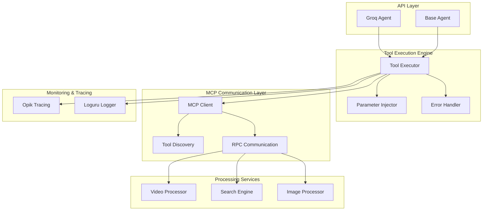
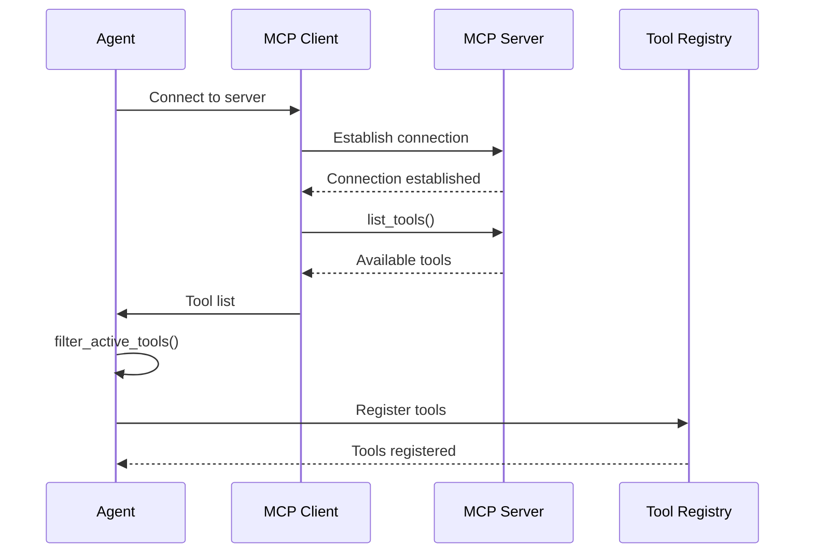
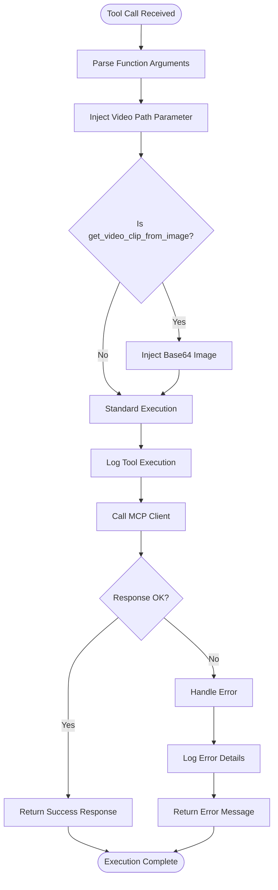
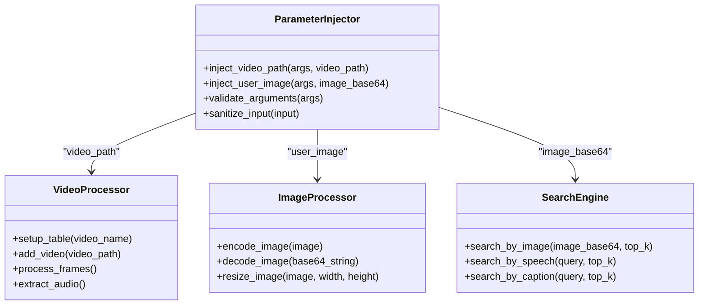
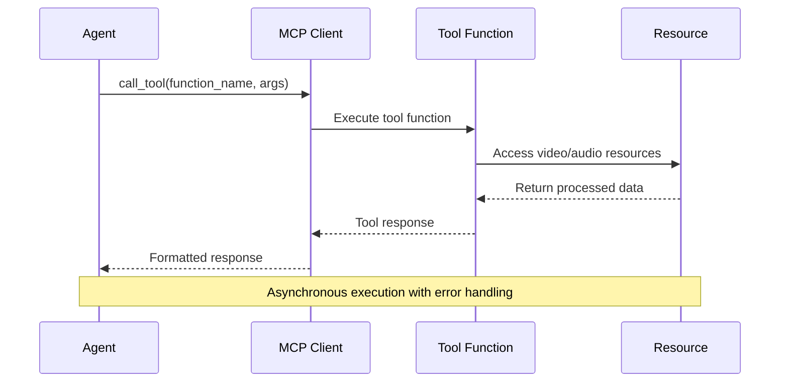
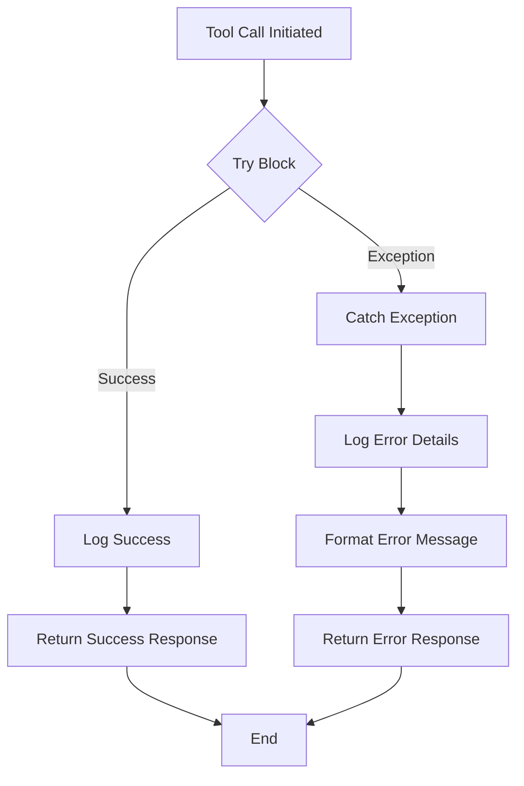
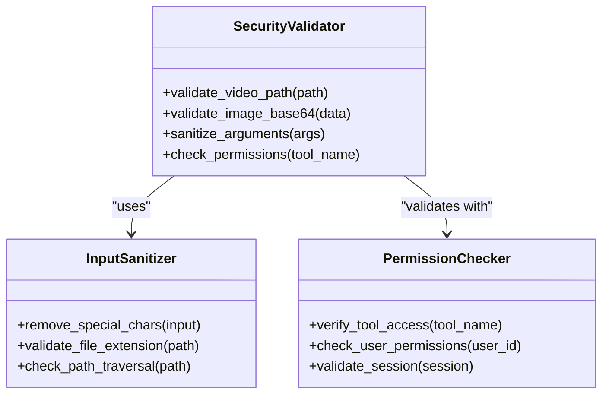
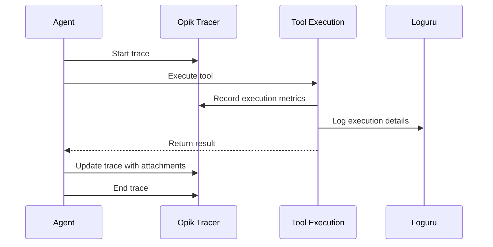
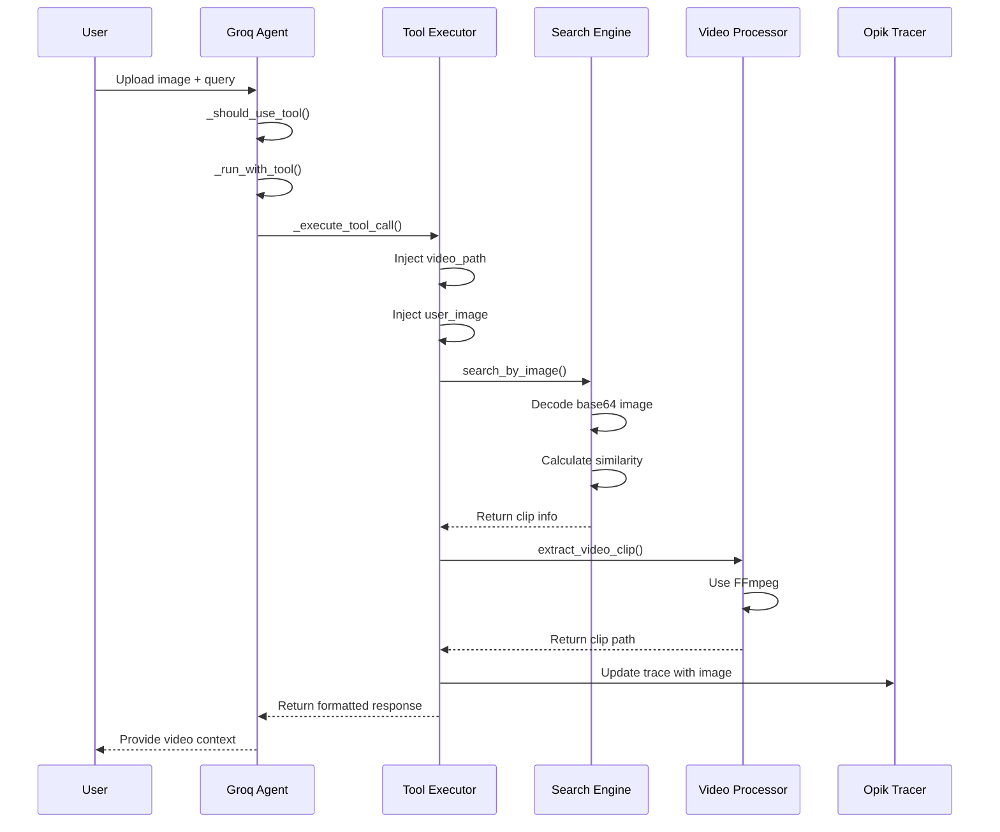

# Tool Execution Process

<cite>
**Referenced Files in This Document**
- [groq_agent.py](file://vaas-api/src/vaas_api/agent/groq/groq_agent.py)
- [base_agent.py](file://vaas-api/src/vaas_api/agent/base_agent.py)
- [opik_utils.py](file://vaas-api/src/vaas_api/opik_utils.py)
- [tools.py](file://vaas-api/src/vaas_api/tools.py)
- [video_processor.py](file://vaas-mcp/src/vaas_mcp/video/ingestion/video_processor.py)
- [video_search_engine.py](file://vaas-mcp/src/vaas_mcp/video/video_search_engine.py)
- [functions.py](file://vaas-mcp/src/vaas_mcp/video/ingestion/functions.py)
- [tools.py](file://vaas-mcp/src/vaas_mcp/video/ingestion/tools.py)
- [models.py](file://vaas-mcp/src/vaas_mcp/video/ingestion/models.py)
- [registry.py](file://vaas-mcp/src/vaas_mcp/video/ingestion/registry.py)
- [constants.py](file://vaas-mcp/src/vaas_mcp/video/ingestion/constants.py)
</cite>

## Table of Contents
1. [Introduction](#introduction)
2. [Architecture Overview](#architecture-overview)
3. [Tool Discovery and Registration](#tool-discovery-and-registration)
4. [Tool Execution Flow](#tool-execution-flow)
5. [Parameter Injection and Validation](#parameter-injection-and-validation)
6. [MCP Client Communication](#mcp-client-communication)
7. [Error Handling and Logging](#error-handling-and-logging)
8. [Security Considerations](#security-considerations)
9. [Performance and Optimization](#performance-and-optimization)
10. [Integration with Opik Tracing](#integration-with-opik-tracing)
11. [Concrete Example: get_video_clip_from_image](#concrete-example-get_video_clip_from_image)
12. [Troubleshooting Guide](#troubleshooting-guide)

## Introduction

The Tool Execution Process in the vaas multimodal agents system represents a sophisticated asynchronous framework for invoking MCP (Model Context Protocol) server tools based on parsed tool calls from Large Language Models (LLMs). This process orchestrates the complete lifecycle from tool selection to actual RPC communication, encompassing parameter injection, validation, error handling, and comprehensive logging.

The system is designed to handle complex multimodal operations involving video processing, image manipulation, and semantic search across multimedia content. At its core, the `_execute_tool_call` method serves as the central orchestrator, managing the asynchronous invocation of tools while maintaining robust error handling and performance monitoring.

## Architecture Overview

The tool execution architecture follows a layered approach with clear separation of concerns:

**Diagram sources**
- [groq_agent.py](file://vaas-api/src/vaas_api/agent/groq/groq_agent.py#L75-L166)
- [base_agent.py](file://vaas-api/src/vaas_api/agent/base_agent.py#L75-L109)

## Tool Discovery and Registration

The tool discovery process begins with the agent establishing a connection to the MCP server and retrieving available tools. This process involves several key steps:

**Diagram sources**
- [base_agent.py](file://vaas-api/src/vaas_api/agent/base_agent.py#L75-L95)

The discovery process handles connection errors gracefully and maintains a filtered list of active tools based on configuration settings. The `filter_active_tools` method ensures only permitted tools are available for execution.

**Section sources**
- [base_agent.py](file://vaas-api/src/vaas_api/agent/base_agent.py#L75-L95)

## Tool Execution Flow

The tool execution flow is orchestrated by the `_execute_tool_call` method, which manages the complete lifecycle of tool invocation:

**Diagram sources**
- [groq_agent.py](file://vaas-api/src/vaas_api/agent/groq/groq_agent.py#L88-L104)

The execution flow demonstrates intelligent parameter injection and specialized handling for different tool types, particularly for image-based operations.

**Section sources**
- [groq_agent.py](file://vaas-api/src/vaas_api/agent/groq/groq_agent.py#L88-L104)

## Parameter Injection and Validation

Parameter injection is a critical aspect of the tool execution process, ensuring that tools receive all necessary context while maintaining security and validation:

**Diagram sources**
- [groq_agent.py](file://vaas-api/src/vaas_api/agent/groq/groq_agent.py#L92-L100)
- [video_processor.py](file://vaas-mcp/src/vaas_mcp/video/ingestion/video_processor.py#L1-L50)

The parameter injection system handles two primary scenarios:

1. **Video Path Injection**: Automatically adds the `video_path` parameter to all tool calls, providing context about the target video
2. **Image Base64 Injection**: Specifically handles the `get_video_clip_from_image` tool by injecting the user-provided base64-encoded image

**Section sources**
- [groq_agent.py](file://vaas-api/src/vaas_api/agent/groq/groq_agent.py#L92-L100)

## MCP Client Communication

The MCP client communication layer provides the bridge between the agent and the underlying tools, implementing robust error handling and connection management:

**Diagram sources**
- [base_agent.py](file://vaas-api/src/vaas_api/agent/base_agent.py#L97-L101)

The MCP client implements automatic resource management through context managers, ensuring proper cleanup and connection handling. The `call_tool` method encapsulates the RPC communication, providing a clean interface for tool invocation.

**Section sources**
- [base_agent.py](file://vaas-api/src/vaas_api/agent/base_agent.py#L97-L101)

## Error Handling and Logging

Comprehensive error handling and logging are integral to the tool execution process, providing visibility into system operation and facilitating debugging:

The error handling system captures exceptions at multiple levels, providing detailed logging with stack traces and contextual information. Error messages are formatted consistently to maintain clarity and facilitate troubleshooting.

**Section sources**
- [groq_agent.py](file://vaas-api/src/vaas_api/agent/groq/groq_agent.py#L102-L104)

## Security Considerations

Security is paramount in the tool execution process, with multiple layers of validation and sanitization:

The security framework implements input validation, permission checking, and sanitization to prevent malicious input and unauthorized access. Special attention is given to file paths and base64-encoded images to prevent path traversal attacks and data corruption.

## Performance and Optimization

The tool execution process incorporates several optimization strategies to ensure efficient operation:

- **Connection Pooling**: Maintains persistent connections to the MCP server
- **Async Processing**: Utilizes asynchronous execution for non-blocking operations
- **Caching**: Implements caching mechanisms for frequently accessed resources
- **Resource Management**: Properly manages memory and file handles

## Integration with Opik Tracing

The system integrates with Opik for comprehensive tracing and monitoring:

**Diagram sources**
- [opik_utils.py](file://vaas-api/src/vaas_api/opik_utils.py#L1-L43)

Opik integration provides detailed tracing of tool execution, including timing information, resource usage, and execution context. This enables comprehensive monitoring and performance analysis.

**Section sources**
- [opik_utils.py](file://vaas-api/src/vaas_api/opik_utils.py#L1-L43)

## Concrete Example: get_video_clip_from_image

The `get_video_clip_from_image` tool exemplifies the complete tool execution process:

**Diagram sources**
- [groq_agent.py](file://vaas-api/src/vaas_api/agent/groq/groq_agent.py#L88-L136)
- [video_search_engine.py](file://vaas-mcp/src/vaas_mcp/video/video_search_engine.py#L50-L75)

This example demonstrates the complete workflow from user input to video clip extraction, showcasing parameter injection, image processing, and result formatting.

**Section sources**
- [groq_agent.py](file://vaas-api/src/vaas_api/agent/groq/groq_agent.py#L88-L136)
- [video_search_engine.py](file://vaas-mcp/src/vaas_mcp/video/video_search_engine.py#L50-L75)

## Troubleshooting Guide

Common issues and their solutions in the tool execution process:

### Connection Issues
- **Problem**: MCP server connection failures
- **Solution**: Verify server availability and network connectivity
- **Prevention**: Implement retry logic and health checks

### Parameter Validation Failures
- **Problem**: Invalid or missing parameters
- **Solution**: Review parameter injection logic and validation
- **Prevention**: Add comprehensive input validation

### Performance Bottlenecks
- **Problem**: Slow tool execution
- **Solution**: Optimize resource usage and implement caching
- **Prevention**: Monitor execution metrics and implement profiling

### Memory Issues
- **Problem**: Out-of-memory errors during processing
- **Solution**: Implement proper resource cleanup and streaming
- **Prevention**: Monitor memory usage and implement limits

The troubleshooting guide emphasizes proactive monitoring and preventive measures to maintain system stability and performance.