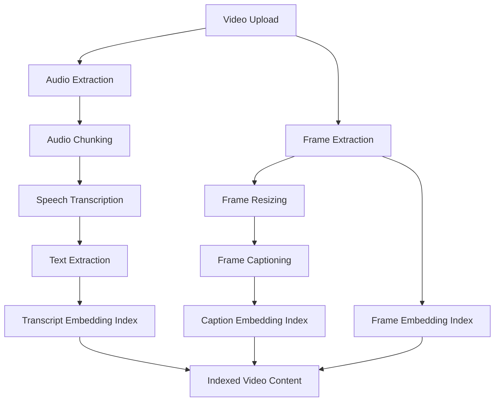
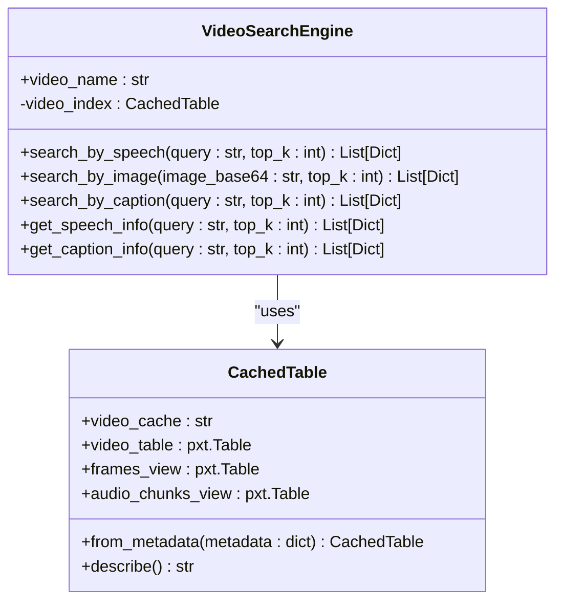
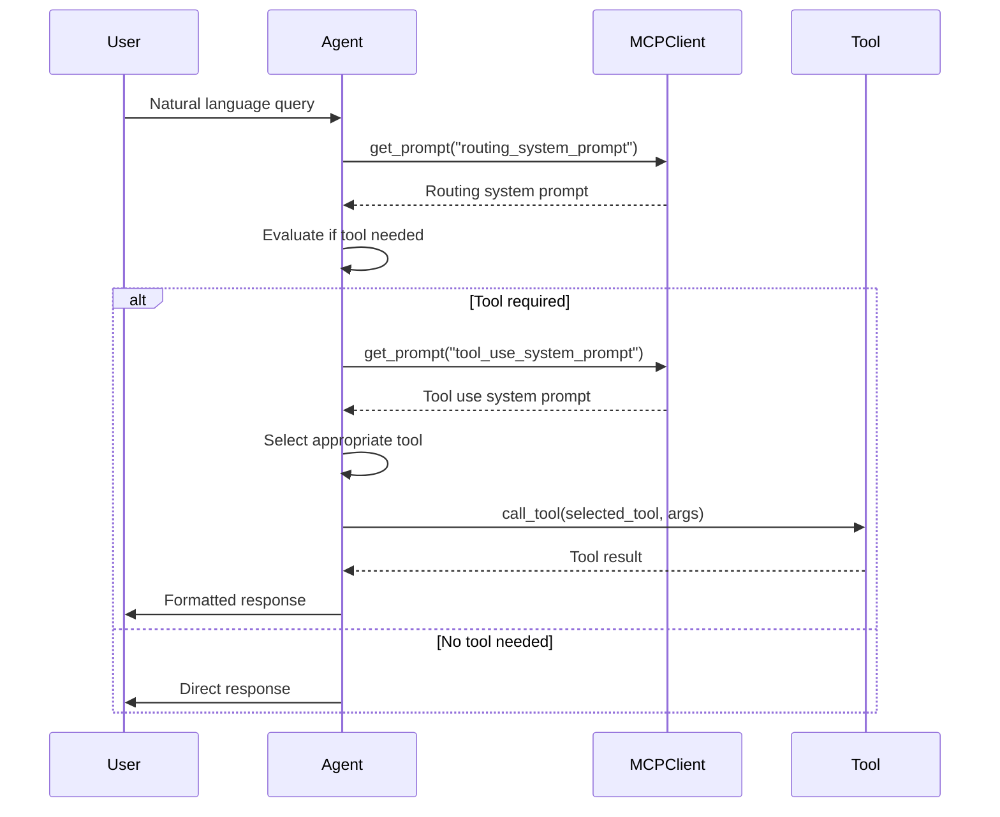
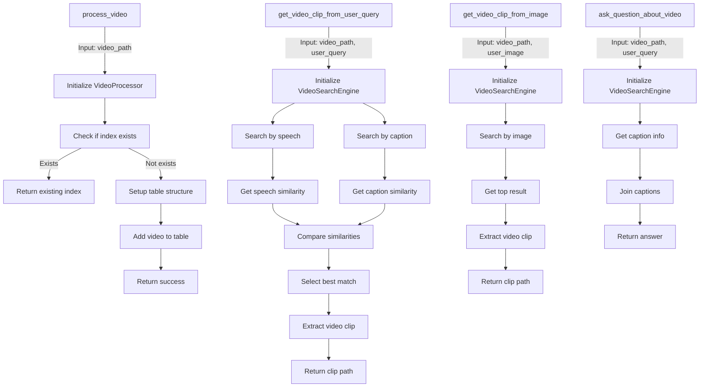
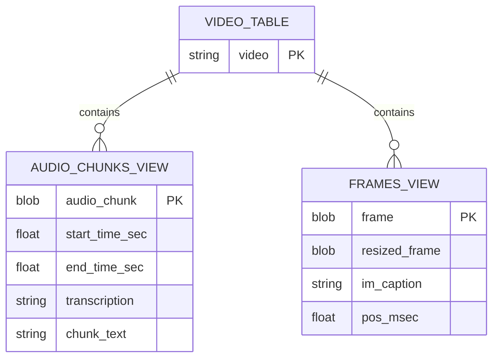
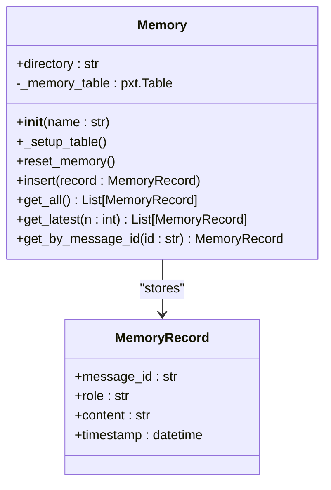

# Core Features

<cite>
**Referenced Files in This Document**   
- [video_processor.py](file://vaas-mcp/src/vaas_mcp/video/ingestion/video_processor.py)
- [video_search_engine.py](file://vaas-mcp/src/vaas_mcp/video/video_search_engine.py)
- [tools.py](file://vaas-mcp/src/vaas_mcp/tools.py)
- [config.py](file://vaas-mcp/src/vaas_mcp/config.py)
- [base_agent.py](file://vaas-api/src/vaas_api/agent/base_agent.py)
- [memory.py](file://vaas-api/src/vaas_api/agent/memory.py)
- [prompts.py](file://vaas-mcp/src/vaas_mcp/prompts.py)
- [server.py](file://vaas-mcp/src/vaas_mcp/server.py)
</cite>

## Table of Contents
1. [Video Processing Pipeline](#video-processing-pipeline)
2. [Multimodal Query System](#multimodal-query-system)
3. [Agent Decision-Making Process](#agent-decision-making-process)
4. [MCP Tools Overview](#mcp-tools-overview)
5. [PixelTable Integration](#pixeltable-integration)
6. [Memory System](#memory-system)
7. [Usage Patterns and Performance](#usage-patterns-and-performance)

## Video Processing Pipeline

The video processing pipeline transforms raw video files into searchable, indexed content through a multi-stage ingestion process. The pipeline begins with video upload and proceeds through frame extraction, audio transcription, and embedding generation, creating a rich multimodal index for efficient querying.

**Diagram sources**
- [video_processor.py](file://vaas-mcp/src/vaas_mcp/video/ingestion/video_processor.py#L69-L180)

The ingestion process is orchestrated by the `VideoProcessor` class, which manages the creation of PixelTable structures for video data. When a video is uploaded, the processor first checks if an index already exists in the registry to prevent redundant processing. If no existing index is found, it creates a new cache directory and establishes a root video table with a schema containing a video column of type `pxt.Video`.

The audio processing pipeline begins with extraction of audio from the video file in MP3 format using PixelTable's `extract_audio` function. The audio is then segmented into chunks using the `AudioSplitter` iterator, with configurable parameters for chunk duration (10 seconds), overlap (1 second), and minimum chunk duration (1 second). Each audio chunk is transcribed using OpenAI's GPT-4o Mini transcription model, and the resulting transcription objects are processed to extract plain text content. Finally, a text embedding index is created using the `text-embedding-3-small` model, enabling semantic search capabilities over the spoken content.

Simultaneously, the video frames are processed through a parallel pipeline. The `FrameIterator` splits the video into frames at a configurable frame rate (45 frames per video), and each frame is resized to 1024x768 pixels to optimize processing. The resized frames are then passed to OpenAI's vision model with a prompt to describe the visual content, generating descriptive captions for each frame. Two embedding indices are created: one using CLIP embeddings for the visual content of the frames, and another using text embeddings for the generated captions, enabling both visual and semantic search capabilities.

**Section sources**
- [video_processor.py](file://vaas-mcp/src/vaas_mcp/video/ingestion/video_processor.py#L0-L205)
- [config.py](file://vaas-mcp/src/vaas_mcp/config.py#L0-L56)

## Multimodal Query System

The multimodal query system enables flexible searching of video content through multiple modalities, including text-based queries on speech and captions, as well as image-based visual searches. The `VideoSearchEngine` class serves as the primary interface for these search capabilities, providing methods that leverage the pre-computed embedding indices to find relevant video segments.

**Diagram sources**
- [video_search_engine.py](file://vaas-mcp/src/vaas_mcp/video/video_search_engine.py#L0-L168)
- [models.py](file://vaas-mcp/src/vaas_mcp/video/ingestion/models.py#L0-L119)

The search system supports three primary modalities for finding video content. Text-based speech search uses the `search_by_speech` method, which computes similarity between a query string and the transcribed audio content using the pre-built embedding index. This enables users to find video segments containing specific spoken phrases or concepts. Similarly, text-based caption search through the `search_by_caption` method allows finding video segments based on the visual content descriptions generated during ingestion.

The most distinctive capability is image-based search through the `search_by_image` method, which accepts a base64-encoded image and finds video frames most visually similar to the query image. This is powered by the CLIP embedding index created during processing, enabling reverse image search functionality within video content. The search results from all modalities include temporal information (start and end times) and similarity scores, allowing applications to extract precise video clips or display relevance rankings.

The system also provides information retrieval methods like `get_speech_info` and `get_caption_info` that return the actual transcribed text or generated captions along with their similarity scores, rather than temporal locations. These methods are particularly useful for answering questions about video content without necessarily extracting video clips.

**Section sources**
- [video_search_engine.py](file://vaas-mcp/src/vaas_mcp/video/video_search_engine.py#L0-L168)

## Agent Decision-Making Process

The agent's decision-making process determines which tool to use based on user input through a two-stage routing system. The process begins with a routing assistant that determines whether any tool usage is required, followed by a tool selection mechanism that chooses the appropriate specific tool based on the nature of the query and available context.

**Diagram sources**
- [base_agent.py](file://vaas-api/src/vaas_api/agent/base_agent.py#L0-L111)
- [prompts.py](file://vaas-mcp/src/vaas_mcp/prompts.py#L0-L109)

The routing decision is governed by system prompts stored in the MCP server and retrieved through the `get_prompt` API. The routing system prompt defines the conditions under which tool usage is required, specifically when users request extraction of video clips or retrieval of information about video details. This boolean decision is made by evaluating the user's query against these criteria.

When tool usage is required, the agent consults the tool use system prompt to determine which specific tool to invoke. This prompt provides a clear mapping between user intents and available tools, with explicit rules such as always using the image-based tool when an image is provided. The agent has access to contextual information including whether an image has been provided, allowing it to make informed decisions about tool selection.

The decision-making process is implemented in the `BaseAgent` class, which manages the connection to the MCP server and handles the asynchronous retrieval of tools and system prompts. During initialization, the agent discovers available tools through the `list_tools` API and filters them based on the `disable_tools` configuration. The `call_tool` method provides a uniform interface for invoking any selected tool, abstracting the underlying MCP protocol details.

**Section sources**
- [base_agent.py](file://vaas-api/src/vaas_api/agent/base_agent.py#L0-L111)
- [prompts.py](file://vaas-mcp/src/vaas_mcp/prompts.py#L0-L109)

## MCP Tools Overview

The system provides four main MCP tools that expose the video processing and search capabilities through a standardized interface. These tools—`process_video`, `get_video_clip_from_user_query`, `get_video_clip_from_image`, and `ask_question_about_video`—are registered with the MCP server and made available to agents for dynamic invocation based on user queries.

**Diagram sources**
- [tools.py](file://vaas-mcp/src/vaas_mcp/tools.py#L0-L105)
- [server.py](file://vaas-mcp/src/vaas_mcp/server.py#L0-L97)

The `process_video` tool initiates the ingestion pipeline for a new video file. It first checks if an index already exists for the video path to avoid redundant processing. If no existing index is found, it sets up the table structure through the `VideoProcessor` and adds the video to the table, triggering the full processing pipeline that creates all necessary views and embedding indices.

The `get_video_clip_from_user_query` tool handles text-based queries for video clips by combining results from both speech and caption searches. It queries the `VideoSearchEngine` for the most relevant segments based on speech transcription similarity and frame caption similarity, then compares the similarity scores to determine which modality provides the best match. This hybrid approach ensures robust performance across different types of queries, whether they relate more to spoken content or visual elements.

The `get_video_clip_from_image` tool enables visual search by accepting a base64-encoded image and finding the most visually similar frame in the video. It uses the CLIP embedding index to perform efficient similarity search across all video frames, returning the temporal location of the best match and extracting a clip centered on that frame with a configurable interval (±5 seconds by default).

The `ask_question_about_video` tool provides a natural language interface for retrieving information about video content. Rather than extracting clips, it returns the actual textual content (captions) of the most relevant frames, concatenated into a coherent response. This is particularly useful for answering questions about visual details, character appearances, or scene descriptions without requiring video playback.

**Section sources**
- [tools.py](file://vaas-mcp/src/vaas_mcp/tools.py#L0-L105)
- [server.py](file://vaas-mcp/src/vaas_mcp/server.py#L0-L97)

## PixelTable Integration

The integration with PixelTable provides a unified data management layer for video content, handling storage, indexing, and query execution through a table-based abstraction. PixelTable serves as the foundation for the entire system, managing the complex relationships between raw video data, extracted features, and derived metadata in a structured format that supports efficient multimodal search.

**Diagram sources**
- [video_processor.py](file://vaas-mcp/src/vaas_mcp/video/ingestion/video_processor.py#L0-L205)
- [models.py](file://vaas-mcp/src/vaas_mcp/video/ingestion/models.py#L0-L119)

The integration creates a hierarchical structure where a root video table contains the original video file, with derived views for audio chunks and video frames. The audio chunks view is created using the `AudioSplitter` iterator, which automatically generates temporal metadata (start and end times) for each chunk. Similarly, the frames view uses the `FrameIterator` to sample frames at a specified rate, preserving the temporal position of each frame in milliseconds.

Computed columns are used extensively to store derived data without duplicating the underlying media. The audio extraction process creates a computed column for MP3 audio, while the transcription process adds another computed column for the transcribed text. For video frames, computed columns store resized versions of frames (to optimize processing), generated captions, and embedding representations. This approach minimizes storage requirements while maintaining fast access to processed data.

The embedding indices are created directly on computed columns, allowing PixelTable to optimize similarity search operations. The system creates three distinct embedding indices: one on the transcribed text using OpenAI's text embeddings, one on the visual frames using CLIP embeddings, and one on the generated captions using text embeddings. These indices enable fast k-nearest neighbors search, which is critical for the interactive performance of the query system.

**Section sources**
- [video_processor.py](file://vaas-mcp/src/vaas_mcp/video/ingestion/video_processor.py#L0-L205)
- [models.py](file://vaas-mcp/src/vaas_mcp/video/ingestion/models.py#L0-L119)

## Memory System

The memory system maintains conversation context across queries through a persistent storage mechanism that records the history of interactions between users and the agent. Implemented using PixelTable, the memory system provides structured storage for conversation records, enabling the agent to maintain context and provide coherent responses throughout a session.

**Diagram sources**
- [memory.py](file://vaas-api/src/vaas_api/agent/memory.py#L0-L51)

The memory system is implemented as a `Memory` class that creates a dedicated PixelTable directory and table for storing conversation records. Each record contains a message ID, role (user or assistant), content, and timestamp, providing a complete audit trail of the conversation. The table schema uses appropriate data types including String for text content and Timestamp for temporal ordering.

The system provides several methods for accessing conversation history. The `get_all` method retrieves the complete conversation history, while `get_latest` returns the most recent messages, allowing the agent to maintain context without loading the entire history. The `get_by_message_id` method enables retrieval of specific messages, which could be useful for reference or editing operations.

Memory persistence is achieved through PixelTable's directory management system, which ensures that conversation records are stored durably and can be recovered across application restarts. The `reset_memory` method provides a way to clear the conversation history, either for starting a new session or respecting user privacy requirements. The memory system is integrated with the agent framework, automatically recording messages as they are exchanged and making the history available for context in subsequent interactions.

**Section sources**
- [memory.py](file://vaas-api/src/vaas_api/agent/memory.py#L0-L51)

## Usage Patterns and Performance

The system exhibits distinct usage patterns and performance characteristics based on the type of operation being performed. Understanding these patterns is essential for optimizing user experience and resource utilization in production deployments.

For video ingestion operations, the system shows high computational intensity during the initial processing phase, with CPU usage dominated by frame extraction and audio processing. The ingestion time scales linearly with video duration, with typical processing rates of approximately 2-3x real-time on standard hardware. Once processed, subsequent queries on the same video are significantly faster as they leverage the pre-computed indices.

Text-based queries using `search_by_speech` and `search_by_caption` demonstrate sub-second response times for most queries, as they leverage optimized embedding indices with approximate nearest neighbor search. The performance is largely independent of video length, depending instead on the number of indexed segments (audio chunks and frames). Image-based queries through `search_by_image` have slightly higher latency due to the need to decode and preprocess the input image, but still typically respond within 1-2 seconds.

The tool selection process adds minimal overhead to query processing, with prompt retrieval and routing decisions typically completed within tens of milliseconds. The overall system performance is designed to support interactive use, with most operations completing within the 2-second threshold for maintaining user engagement.

Key limitations include the dependency on external APIs for transcription and captioning, which introduces potential latency and cost considerations. The system also requires significant storage for processed videos, with the indexed data typically 2-3x the size of the original video file due to extracted frames and metadata. Additionally, the current implementation processes videos sequentially, which may limit throughput in scenarios with multiple concurrent ingestion requests.

**Section sources**
- [config.py](file://vaas-mcp/src/vaas_mcp/config.py#L0-L56)
- [video_processor.py](file://vaas-mcp/src/vaas_mcp/video/ingestion/video_processor.py#L0-L205)
- [video_search_engine.py](file://vaas-mcp/src/vaas_mcp/video/video_search_engine.py#L0-L168)