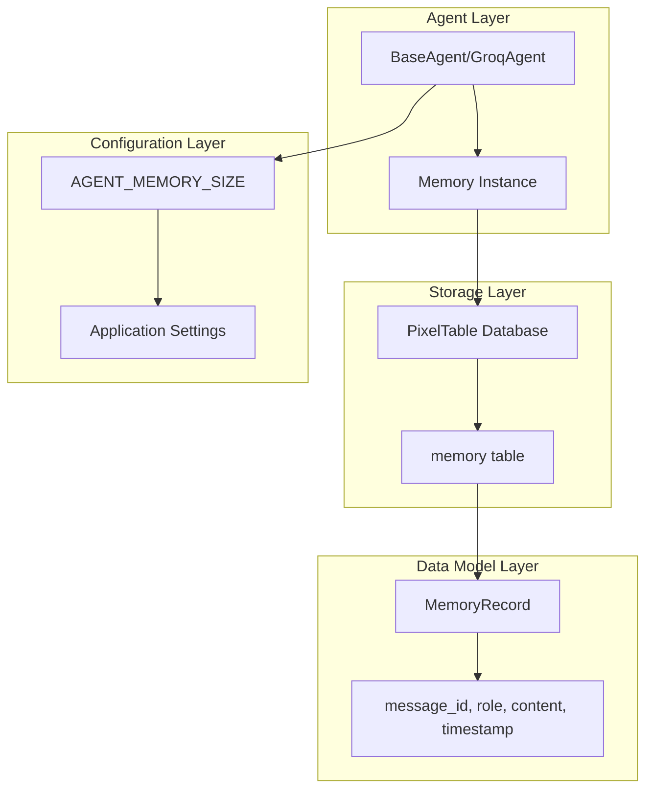
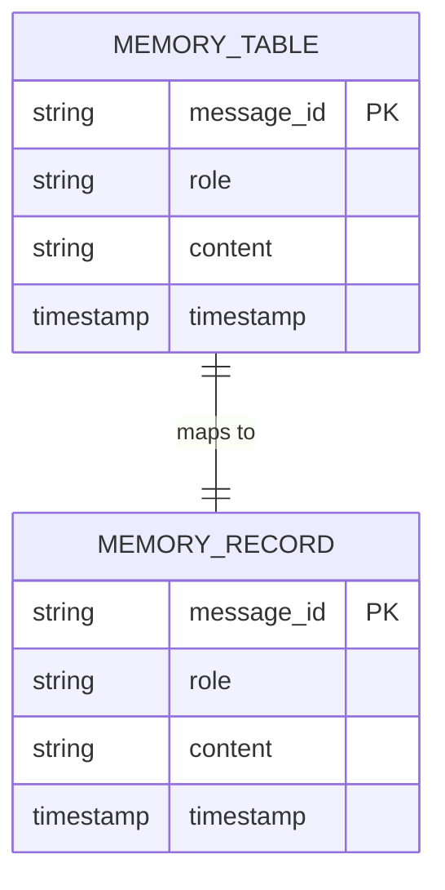
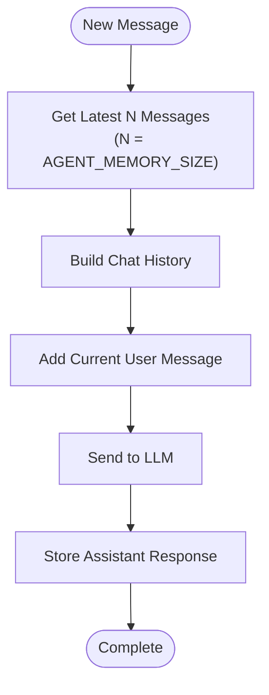

# Memory Management System

<cite>
**Referenced Files in This Document**
- [memory.py](file://vaas-api/src/vaas_api/agent/memory.py)
- [base_agent.py](file://vaas-api/src/vaas_api/agent/base_agent.py)
- [groq_agent.py](file://vaas-api/src/vaas_api/agent/groq/groq_agent.py)
- [config.py](file://vaas-api/src/vaas_api/config.py)
- [models.py](file://vaas-api/src/vaas_api/models.py)
- [api.py](file://vaas-api/src/vaas_api/api.py)
- [opik_utils.py](file://vaas-api/src/vaas_api/opik_utils.py)
- [3_memory_playground.ipynb](file://vaas-api/notebooks/3_memory_playground.ipynb)
</cite>

## Table of Contents
1. [Introduction](#introduction)
2. [Memory Architecture Overview](#memory-architecture-overview)
3. [Core Memory Components](#core-memory-components)
4. [Memory Storage Implementation](#memory-storage-implementation)
5. [Memory Operations](#memory-operations)
6. [Integration with Agent System](#integration-with-agent-system)
7. [Configuration and Limits](#configuration-and-limits)
8. [Observability with Opik](#observability-with-opik)
9. [Usage Examples](#usage-examples)
10. [Limitations and Extensions](#limitations-and-extensions)
11. [Troubleshooting](#troubleshooting)

## Introduction

The Memory Management system in the vaas API provides a sophisticated conversation history storage and retrieval mechanism for AI agents. Built around the PixelTable database, it offers persistent storage of conversation contexts with support for structured memory records, timestamp tracking, and configurable rolling windows for maintaining optimal context length.

The system is designed to enhance agent performance by maintaining relevant conversation history while managing storage efficiently through configurable limits and automatic cleanup mechanisms.

## Memory Architecture Overview

The memory system follows a layered architecture that separates concerns between data modeling, storage management, and agent integration:



**Diagram sources**
- [memory.py](file://vaas-api/src/vaas_api/agent/memory.py#L1-L51)
- [base_agent.py](file://vaas-api/src/vaas_api/agent/base_agent.py#L1-L111)
- [config.py](file://vaas-api/src/vaas_api/config.py#L1-L43)

## Core Memory Components

### MemoryRecord Structure

The `MemoryRecord` class serves as the fundamental data structure for storing individual conversation messages:

```python
class MemoryRecord(BaseModel):
    message_id: str
    role: str
    content: str
    timestamp: datetime
```

Each `MemoryRecord` contains four essential fields:

- **message_id**: Unique identifier for each message, generated using UUID
- **role**: The speaker's role ("user", "assistant", "system", or "tool")
- **content**: The actual message content as a string
- **timestamp**: Precise datetime recording when the message was added

### Memory Class Implementation

The `Memory` class provides the primary interface for memory operations:

```python
class Memory:
    def __init__(self, name: str):
        self.directory = name
        pxt.create_dir(self.directory, if_exists="replace_force")
        self._setup_table()
        self._memory_table = pxt.get_table(f"{self.directory}.memory")
```

Key characteristics of the Memory class:
- **Directory-based organization**: Each agent maintains its own memory directory
- **Automatic table creation**: Tables are created on-demand with appropriate schema
- **Persistent storage**: Uses PixelTable for reliable data persistence
- **Isolation**: Different agents have separate memory spaces

**Section sources**
- [memory.py](file://vaas-api/src/vaas_api/agent/memory.py#L7-L51)

## Memory Storage Implementation

### PixelTable Integration

The system leverages PixelTable as the underlying storage engine, providing several advantages:

```python
def _setup_table(self):
    self._memory_table = pxt.create_table(
        f"{self.directory}.memory",
        {
            "message_id": pxt.String,
            "role": pxt.String,
            "content": pxt.String,
            "timestamp": pxt.Timestamp,
        },
        if_exists="ignore",
    )
```

Storage benefits include:
- **Schema enforcement**: Automatic validation of data structure
- **Type safety**: Strong typing for each field
- **Indexing capabilities**: Efficient querying and sorting
- **Persistence**: Data survives application restarts
- **Scalability**: Handles growing conversation histories

### Data Schema Design

The memory table schema is optimized for conversation tracking:



**Diagram sources**
- [memory.py](file://vaas-api/src/vaas_api/agent/memory.py#L18-L30)

**Section sources**
- [memory.py](file://vaas-api/src/vaas_api/agent/memory.py#L18-L30)

## Memory Operations

### Insert Operation

The `insert` method adds new conversation records to the memory:

```python
def insert(self, memory_record: MemoryRecord):
    self._memory_table.insert([memory_record.dict()])
```

Operation flow:
1. **Validation**: Pydantic validation ensures data integrity
2. **Serialization**: Record is converted to dictionary format
3. **Storage**: Data is persisted to PixelTable
4. **Indexing**: Automatic indexing for efficient retrieval

### Retrieval Operations

#### Get All Records
```python
def get_all(self) -> list[MemoryRecord]:
    return [MemoryRecord(**record) for record in self._memory_table.collect()]
```

#### Get Latest Records
```python
def get_latest(self, n: int) -> list[MemoryRecord]:
    return self.get_all()[-n:]
```

Retrieval features:
- **Latest-first ordering**: Automatically sorted by timestamp
- **Configurable window**: Limit results to recent conversations
- **Efficient slicing**: Optimized for large datasets
- **Object reconstruction**: Converts raw data back to MemoryRecord objects

### Advanced Operations

#### By Message ID Lookup
```python
def get_by_message_id(self, message_id: str) -> MemoryRecord:
    return self._memory_table.where(self._memory_table.message_id == message_id).collect()[0]
```

#### Memory Reset
```python
def reset_memory(self):
    logger.info(f"Resetting memory: {self.directory}")
    pxt.drop_dir(self.directory, if_not_exists="ignore", force=True)
```

Reset operation:
- **Complete cleanup**: Removes entire memory directory
- **Resource cleanup**: Frees associated storage space
- **Fresh start**: Creates new empty memory space

**Section sources**
- [memory.py](file://vaas-api/src/vaas_api/agent/memory.py#L32-L51)

## Integration with Agent System

### Agent Memory Integration

The memory system integrates seamlessly with the agent architecture through the `BaseAgent` class:

```python
class BaseAgent(ABC):
    def __init__(self, name: str, mcp_server: str, memory: Memory = None, disable_tools: list = None):
        self.memory = memory if memory else Memory(name)
```

Integration features:
- **Lazy initialization**: Memory created only when needed
- **Custom memory instances**: Agents can provide their own memory
- **Automatic cleanup**: Memory reset during agent lifecycle
- **Tool integration**: Supports tool-related memory operations

### GroqAgent Memory Operations

The `GroqAgent` demonstrates practical memory usage patterns:

#### Memory Addition Methods

```python
def _add_to_memory(self, role: str, content: str) -> None:
    self.memory.insert(
        MemoryRecord(
            message_id=str(uuid.uuid4()),
            role=role,
            content=content,
            timestamp=datetime.now(),
        )
    )

def _add_memory_pair(self, user_message: str, assistant_message: str) -> None:
    self._add_to_memory("user", user_message)
    self._add_to_memory("assistant", assistant_message)
```

These methods ensure:
- **Consistent formatting**: Proper role assignment
- **Timestamp accuracy**: Real-time message logging
- **UUID generation**: Unique message identification
- **Pair maintenance**: User-assistant conversation pairs

#### Chat History Building

```python
@opik.track(name="build-chat-history")
def _build_chat_history(self, system_prompt: str, user_message: str, image_base64: Optional[str] = None, n: int = settings.AGENT_MEMORY_SIZE) -> List[Dict[str, Any]]:
    history = [{"role": "system", "content": system_prompt}]
    history += [{"role": record.role, "content": record.content} for record in self.memory.get_latest(n)]
    
    user_content = (
        [
            {"type": "text", "text": user_message},
            {"type": "image_url", "image_url": {"url": f"data:image/jpeg;base64,{image_base64}"}},
        ] if image_base64 else user_message
    )
    history.append({"role": "user", "content": user_content})
    return history
```

History building process:
1. **System context**: Adds system prompt as first message
2. **Recent history**: Includes latest N conversation records
3. **Current message**: Appends user's current input
4. **Image support**: Handles multimedia content when available

**Section sources**
- [base_agent.py](file://vaas-api/src/vaas_api/agent/base_agent.py#L15-L25)
- [groq_agent.py](file://vaas-api/src/vaas_api/agent/groq/groq_agent.py#L180-L210)

## Configuration and Limits

### Memory Size Configuration

The system uses a global configuration parameter to control memory window size:

```python
class Settings(BaseSettings):
    # --- Memory Configuration ---
    AGENT_MEMORY_SIZE: int = 20
```

Configuration impact:
- **Context length**: Controls how many past messages are included
- **Performance**: Larger windows require more memory and processing
- **Relevance**: Recent messages are prioritized automatically
- **Default value**: 20 messages provides balanced context

### Memory Window Management

The system implements intelligent window management:



**Diagram sources**
- [groq_agent.py](file://vaas-api/src/vaas_api/agent/groq/groq_agent.py#L40-L60)

**Section sources**
- [config.py](file://vaas-api/src/vaas_api/config.py#L28-L29)

## Observability with Opik

### Tracing Integration

The memory system integrates with Opik for comprehensive observability:

```python
@opik.track(name="memory-insertion", type="general")
def _add_memory_pair(self, user_message: str, assistant_message: str) -> None:
    self._add_to_memory("user", user_message)
    self._add_to_memory("assistant", assistant_message)
```

Tracing benefits:
- **Performance monitoring**: Tracks memory operation timing
- **Error detection**: Identifies failures in memory operations
- **Usage analytics**: Monitors memory access patterns
- **Debugging support**: Provides detailed execution traces

### Memory Reset Tracking

```python
@app.post("/reset-memory")
async def reset_memory(fastapi_request: Request):
    agent = fastapi_request.app.state.agent
    agent.reset_memory()
    return ResetMemoryResponse(message="Memory reset successfully")
```

Reset tracking features:
- **Audit trail**: Logs memory reset events
- **Usage metrics**: Tracks reset frequency
- **Debug information**: Provides context for resets
- **API visibility**: Exposes reset capability through API

**Section sources**
- [groq_agent.py](file://vaas-api/src/vaas_api/agent/groq/groq_agent.py#L205-L210)
- [api.py](file://vaas-api/src/vaas_api/api.py#L140-L150)

## Usage Examples

### Basic Memory Operations

```python
# Initialize memory for an agent
memory = Memory("agent_1")

# Add user message
memory.insert(MemoryRecord(
    message_id="msg_001",
    role="user",
    content="Hello, how are you?",
    timestamp=datetime.now()
))

# Add assistant response
memory.insert(MemoryRecord(
    message_id="msg_002",
    role="assistant",
    content="I'm doing well, thank you!",
    timestamp=datetime.now()
))

# Retrieve recent conversation
recent_messages = memory.get_latest(5)
```

### Agent Integration Example

```python
class CustomAgent(GroqAgent):
    async def chat(self, message: str) -> str:
        # Build chat history with memory context
        chat_history = self._build_chat_history(
            self.general_system_prompt, 
            message, 
            n=15  # Override default memory size
        )
        
        # Process with LLM
        response = self.instructor_client.chat.completions.create(
            model=settings.GROQ_GENERAL_MODEL,
            messages=chat_history,
            response_model=GeneralResponseModel,
        )
        
        # Store conversation pair
        self._add_memory_pair(message, response.message)
        
        return response.message
```

### Multi-turn Conversation Example

```python
# Session 1: Initial conversation
agent = GroqAgent("vaas", "http://mcp-server:9090")
response1 = await agent.chat("What's the weather like today?")
response2 = await agent.chat("Can you suggest an outfit?")

# Session 2: Memory persists across sessions
# Memory contains both user and assistant messages from session 1
history = agent.memory.get_all()
print(f"Conversation history contains {len(history)} messages")
```

**Section sources**
- [3_memory_playground.ipynb](file://vaas-api/notebooks/3_memory_playground.ipynb#L1-L157)

## Limitations and Extensions

### Current Limitations

1. **In-Memory Processing**: While storage is persistent, processing occurs in memory
2. **Single Agent Scope**: Each agent maintains separate memory space
3. **Fixed Schema**: MemoryRecord structure is rigid and cannot be easily extended
4. **No Compression**: Full message content is stored without compression
5. **Limited Querying**: Basic retrieval operations only, no advanced filtering

### Potential Extensions

#### Persistent Storage Enhancements

```python
# Future extension: Compressed storage
class CompressedMemoryRecord(MemoryRecord):
    content: bytes  # Store compressed content
    compression_type: str  # Track compression method

# Future extension: Embedding support
class EmbeddedMemoryRecord(MemoryRecord):
    embedding: List[float]  # Vector embeddings for similarity search
    embedding_model: str  # Track embedding model used
```

#### Advanced Query Capabilities

```python
# Future extension: Semantic search
def search_similar(self, query: str, top_k: int = 5) -> List[MemoryRecord]:
    # Use embeddings for semantic similarity
    pass

# Future extension: Temporal queries
def get_conversation_period(self, start_time: datetime, end_time: datetime) -> List[MemoryRecord]:
    # Filter by timestamp range
    pass
```

#### Multi-Agent Memory Sharing

```python
# Future extension: Shared memory pool
class SharedMemoryPool:
    def __init__(self):
        self.pools = {}
    
    def get_pool(self, group_id: str) -> Memory:
        if group_id not in self.pools:
            self.pools[group_id] = Memory(f"group_{group_id}")
        return self.pools[group_id]
```

## Troubleshooting

### Common Issues and Solutions

#### Memory Corruption

**Problem**: Memory operations fail with data validation errors
**Solution**: 
```python
try:
    memory.reset_memory()
    memory = Memory(agent_name)  # Recreate fresh memory
except Exception as e:
    logger.error(f"Memory corruption detected: {e}")
    # Implement recovery procedures
```

#### Performance Issues

**Problem**: Slow memory operations with large conversation histories
**Solution**:
```python
# Optimize by limiting memory size
settings.AGENT_MEMORY_SIZE = 10  # Reduce from default 20

# Or implement periodic cleanup
def cleanup_old_messages(memory: Memory, max_age_days: int = 30):
    cutoff_date = datetime.now() - timedelta(days=max_age_days)
    old_records = memory._memory_table.where(
        memory._memory_table.timestamp < cutoff_date
    ).collect()
    # Implement deletion logic
```

#### Storage Space Management

**Problem**: Disk space consumption grows unbounded
**Solution**:
```python
# Monitor disk usage
import shutil
disk_usage = shutil.disk_usage(".")
if disk_usage.free < threshold:
    memory.reset_memory()  # Clear memory when space is low
```

### Debugging Memory Operations

Enable debug logging for memory operations:

```python
import logging
logging.getLogger("vaas_api.agent.memory").setLevel(logging.DEBUG)

# This will show detailed memory operations
memory.insert(some_record)
```

Monitor memory usage through Opik traces:
- Check memory insertion timing
- Identify slow operations
- Track error rates
- Analyze usage patterns

**Section sources**
- [memory.py](file://vaas-api/src/vaas_api/agent/memory.py#L35-L40)
- [opik_utils.py](file://vaas-api/src/vaas_api/opik_utils.py#L1-L44)