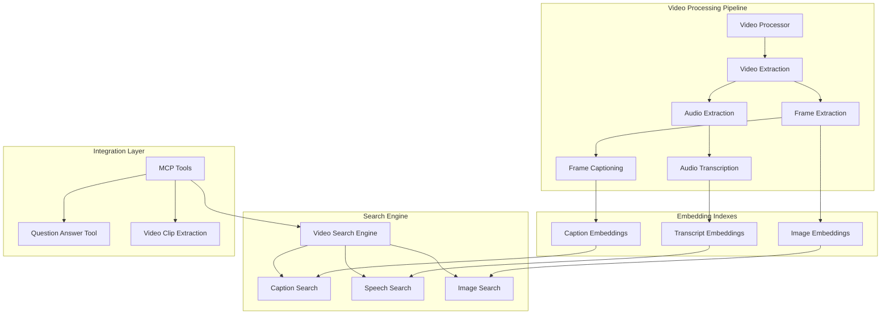
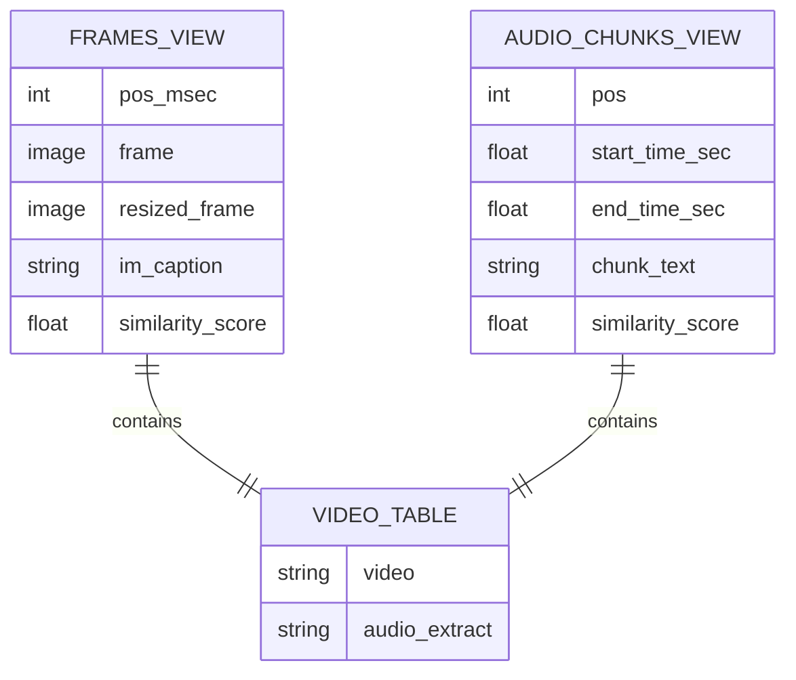
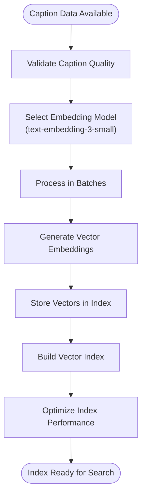
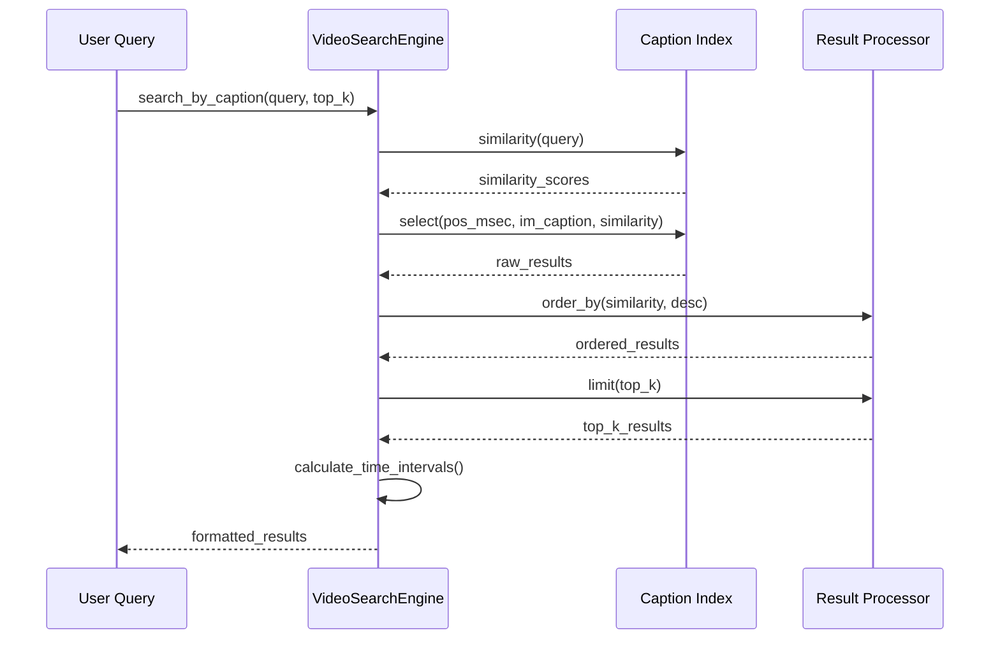
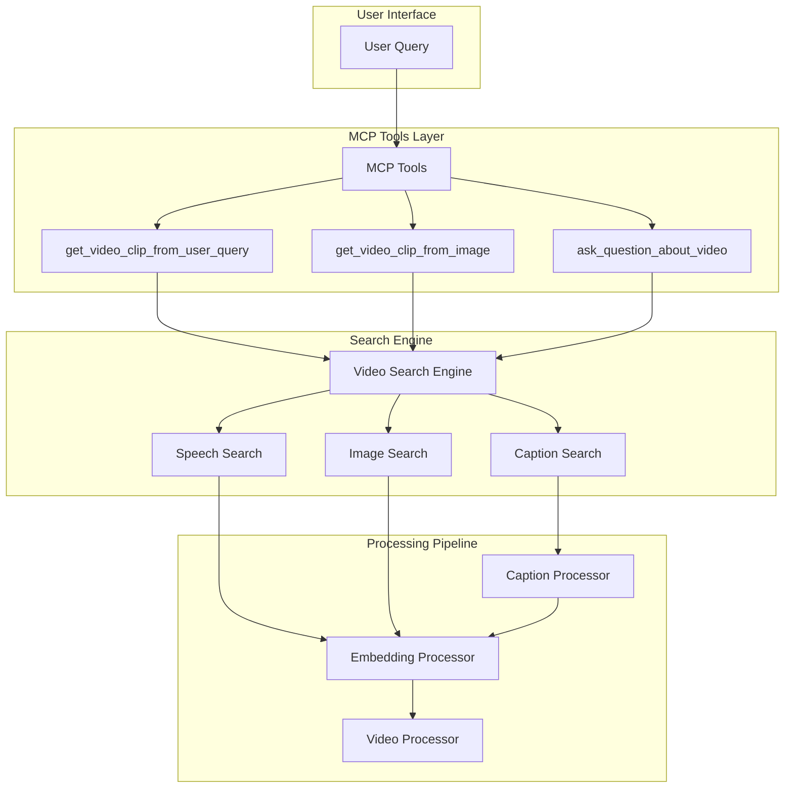

# Caption-Based Search

<cite>
**Referenced Files in This Document**
- [video_search_engine.py](file://vaas-mcp/src/vaas_mcp/video/video_search_engine.py)
- [video_processor.py](file://vaas-mcp/src/vaas_mcp/video/ingestion/video_processor.py)
- [config.py](file://vaas-mcp/src/vaas_mcp/config.py)
- [tools.py](file://vaas-mcp/src/vaas_mcp/tools.py)
- [models.py](file://vaas-mcp/src/vaas_mcp/video/ingestion/models.py)
- [functions.py](file://vaas-mcp/src/vaas_mcp/video/ingestion/functions.py)
- [constants.py](file://vaas-mcp/src/vaas_mcp/video/ingestion/constants.py)
- [registry.py](file://vaas-mcp/src/vaas_mcp/video/ingestion/registry.py)
- [tools.py](file://vaas-mcp/src/vaas_mcp/video/ingestion/tools.py)
- [prompts.py](file://vaas-mcp/src/vaas_mcp/prompts.py)
</cite>

## Table of Contents
1. [Introduction](#introduction)
2. [System Architecture](#system-architecture)
3. [Video Ingestion Pipeline](#video-ingestion-pipeline)
4. [Caption Generation and Storage](#caption-generation-and-storage)
5. [Embedding Index Creation](#embedding-index-creation)
6. [Caption-Based Search Implementation](#caption-based-search-implementation)
7. [Multimodal Integration](#multimodal-integration)
8. [Performance Considerations](#performance-considerations)
9. [Accuracy Factors](#accuracy-factors)
10. [Troubleshooting Guide](#troubleshooting-guide)
11. [Conclusion](#conclusion)

## Introduction

The caption-based search functionality within the Multimodal Query System enables sophisticated text-to-visual search capabilities by matching natural language queries against AI-generated image captions for video frames. This system transforms visual content into searchable text representations, allowing users to find relevant video clips using descriptive queries like "a dog playing in the park" that match captions such as "a golden retriever running on grass."

The system leverages OpenAI's vision models to generate descriptive captions during video ingestion and stores these captions in the `frames_view`. Hugging Face embeddings are then used to compute semantic similarity between user queries and frame captions through PixelTable's similarity function, enabling precise retrieval of relevant video segments.

## System Architecture

The caption-based search system is built around a multi-layered architecture that integrates video processing, AI model inference, and semantic search capabilities.



**Diagram sources**
- [video_processor.py](file://vaas-mcp/src/vaas_mcp/video/ingestion/video_processor.py#L1-L205)
- [video_search_engine.py](file://vaas-mcp/src/vaas_mcp/video/video_search_engine.py#L1-L166)

**Section sources**
- [video_processor.py](file://vaas-mcp/src/vaas_mcp/video/ingestion/video_processor.py#L1-L50)
- [video_search_engine.py](file://vaas-mcp/src/vaas_mcp/video/video_search_engine.py#L1-L32)

## Video Ingestion Pipeline

The video ingestion pipeline is responsible for preparing video content for caption-based search by extracting frames, generating captions, and creating embedding indexes.

### Frame Extraction Process

The system extracts frames from videos using a configurable frame rate sampling strategy:

```python
# Frame extraction configuration
frames_view = pxt.create_view(
    self.frames_view_name,
    self.video_table,
    iterator=FrameIterator.create(
        video=self.video_table.video, 
        num_frames=settings.SPLIT_FRAMES_COUNT
    ),
    if_exists="ignore",
)
```

The `FrameIterator` creates a view where each frame becomes a row in the database, enabling individual processing and indexing of visual content.

### Audio Processing Pipeline

The audio processing pipeline follows a similar approach, extracting audio from videos and creating chunks for transcription:

```python
# Audio chunk creation
audio_view = pxt.create_view(
    "test.audio_chunks",
    video_table,
    iterator=AudioSplitter.create(
        audio=video_table.audio,
        chunk_duration_sec=10.0,
        overlap_sec=1.0,
        min_chunk_duration_sec=1.0,
    ),
    if_exists="replace_force",
)
```

**Section sources**
- [video_processor.py](file://vaas-mcp/src/vaas_mcp/video/ingestion/video_processor.py#L120-L150)
- [video_processor.py](file://vaas-mcp/src/vaas_mcp/video/ingestion/video_processor.py#L80-L100)

## Caption Generation and Storage

The caption generation process utilizes OpenAI's vision models to create descriptive text representations of video frames. This transformation enables semantic search capabilities by converting visual content into searchable text.

### Vision Model Integration

The system employs OpenAI's GPT-4o-mini model for caption generation:

```python
# Caption generation using OpenAI vision
self.frames_view.add_computed_column(
    im_caption=vision(
        prompt=settings.CAPTION_MODEL_PROMPT,
        image=self.frames_view.resized_frame,
        model=settings.IMAGE_CAPTION_MODEL,
    )
)
```

The caption generation process involves several key steps:

1. **Image Preprocessing**: Frames are resized to optimal dimensions (1024x768) for efficient processing
2. **Prompt Engineering**: A standardized prompt "Describe what is happening in the image" ensures consistent caption quality
3. **Model Inference**: OpenAI's vision model generates descriptive captions for each frame
4. **Storage**: Captions are stored in the `im_caption` column of the frames view

### Caption Storage Structure

Captions are stored in the PixelTable database alongside frame metadata:



**Diagram sources**
- [models.py](file://vaas-mcp/src/vaas_mcp/video/ingestion/models.py#L15-L30)

**Section sources**
- [video_processor.py](file://vaas-mcp/src/vaas_mcp/video/ingestion/video_processor.py#L160-L170)
- [config.py](file://vaas-mcp/src/vaas_mcp/config.py#L25-L30)

## Embedding Index Creation

The embedding index creation process transforms textual captions into vector representations that enable semantic similarity search. This process leverages Hugging Face's text embedding models to create searchable representations of caption content.

### Embedding Model Selection

The system uses OpenAI's text-embedding-3-small model for caption embeddings:

```python
# Embedding model configuration
embed_model = embeddings.using(model="text-embedding-3-small")

# Adding embedding index to captions
self.frames_view.add_embedding_index(
    column=self.frames_view.im_caption,
    string_embed=embed_model
)
```

### Embedding Index Benefits

The embedding index provides several advantages:

1. **Efficient Similarity Computation**: Enables fast cosine similarity calculations between queries and captions
2. **Scalable Search**: Supports real-time similarity searches across large datasets
3. **Semantic Understanding**: Captures contextual relationships between different caption descriptions
4. **Vector Operations**: Allows for advanced vector-based operations and filtering

### Index Creation Workflow



**Diagram sources**
- [video_processor.py](file://vaas-mcp/src/vaas_mcp/video/ingestion/video_processor.py#L170-L180)

**Section sources**
- [video_processor.py](file://vaas-mcp/src/vaas_mcp/video/ingestion/video_processor.py#L170-L180)
- [config.py](file://vaas-mcp/src/vaas_mcp/config.py#L20-L25)

## Caption-Based Search Implementation

The caption-based search implementation is centered around the `search_by_caption` method in the `VideoSearchEngine` class, which enables semantic similarity search between user queries and frame captions.

### Search Method Architecture

```python
def search_by_caption(self, query: str, top_k: int) -> List[Dict[str, Any]]:
    """Search video clips by caption similarity.
    
    Args:
        query (str): The search query to match against frame captions.
        top_k (int, optional): Number of top results to return. 
                             Defaults to settings.CAPTION_SIMILARITY_SEARCH_TOP_K.
    
    Returns:
        List[Dict[str, Any]]: List of dictionaries containing clip information with keys:
            - start_time (float): Start time in seconds
            - end_time (float): End time in seconds
            - similarity (float): Similarity score
    """
```

### Similarity Calculation Process

The search process follows a structured approach:



**Diagram sources**
- [video_search_engine.py](file://vaas-mcp/src/vaas_mcp/video/video_search_engine.py#L94-L121)

### Time Interval Calculation

The system calculates time intervals for video clips using the frame position and configured delta:

```python
return [
    {
        "start_time": entry["pos_msec"] / 1000.0 - settings.DELTA_SECONDS_FRAME_INTERVAL,
        "end_time": entry["pos_msec"] / 1000.0 + settings.DELTA_SECONDS_FRAME_INTERVAL,
        "similarity": float(entry["similarity"]),
    }
    for entry in results.limit(top_k).collect()
]
```

The `DELTA_SECONDS_FRAME_INTERVAL` parameter (default: 5.0 seconds) defines the temporal window around each frame to create meaningful video clips.

### Result Formatting

The search method returns structured results with the following format:

```python
[
    {
        "start_time": 12.5,      # Start time in seconds
        "end_time": 17.5,        # End time in seconds  
        "similarity": 0.87       # Similarity score (0-1)
    }
]
```

**Section sources**
- [video_search_engine.py](file://vaas-mcp/src/vaas_mcp/video/video_search_engine.py#L94-L121)
- [config.py](file://vaas-mcp/src/vaas_mcp/config.py#L35-L40)

## Multimodal Integration

The caption-based search system integrates seamlessly with other modalities (speech and image) to provide comprehensive multimodal retrieval capabilities through the MCP tool `get_video_clip_from_user_query`.

### Multimodal Search Strategy

The system implements a hybrid search approach that combines multiple modalities:

```python
def get_video_clip_from_user_query(video_path: str, user_query: str) -> str:
    """Get a video clip based on the user query using speech and caption similarity.
    
    Args:
        video_path (str): The path to the video file.
        user_query (str): The user query to search for.
    
    Returns:
        str: Path to the extracted video clip.
    """
    search_engine = VideoSearchEngine(video_path)
    
    # Search across all modalities
    speech_clips = search_engine.search_by_speech(user_query, settings.VIDEO_CLIP_SPEECH_SEARCH_TOP_K)
    caption_clips = search_engine.search_by_caption(user_query, settings.VIDEO_CLIP_CAPTION_SEARCH_TOP_K)
    
    # Compare results and select best match
    speech_sim = speech_clips[0]["similarity"] if speech_clips else 0
    caption_sim = caption_clips[0]["similarity"] if caption_clips else 0
    
    video_clip_info = speech_clips[0] if speech_sim > caption_sim else caption_clips[0]
```

### Integration Architecture



**Diagram sources**
- [tools.py](file://vaas-mcp/src/vaas_mcp/tools.py#L39-L77)
- [video_search_engine.py](file://vaas-mcp/src/vaas_mcp/video/video_search_engine.py#L1-L32)

### Question Answering Integration

The system provides specialized question answering capabilities through the `ask_question_about_video` tool:

```python
def ask_question_about_video(video_path: str, user_query: str) -> str:
    """Get relevant captions from the video based on the user's question.
    
    Args:
        video_path (str): The path to the video file.
        user_query (str): The question to search for relevant captions.
    
    Returns:
        str: Concatenated relevant captions from the video.
    """
    search_engine = VideoSearchEngine(video_path)
    caption_info = search_engine.get_caption_info(user_query, settings.QUESTION_ANSWER_TOP_K)
    
    answer = "\n".join(entry["caption"] for entry in caption_info)
    return answer
```

**Section sources**
- [tools.py](file://vaas-mcp/src/vaas_mcp/tools.py#L39-L77)
- [tools.py](file://vaas-mcp/src/vaas_mcp/tools.py#L79-L103)

## Performance Considerations

The caption-based search system is designed for optimal performance across various scenarios, with several key considerations for efficient operation.

### Index Optimization

The system employs several optimization strategies:

1. **Embedding Model Efficiency**: Uses text-embedding-3-small for balanced performance and accuracy
2. **Batch Processing**: Processes captions in batches to optimize memory usage
3. **Caching Strategy**: Maintains persistent caches for frequently accessed video indices
4. **Lazy Loading**: Loads video indices only when needed

### Memory Management

```python
# LRU cache for settings
@lru_cache(maxsize=1)
def get_settings() -> Settings:
    """Get the application settings."""
    return Settings()
```

### Scalability Features

The system supports horizontal scaling through:

- **Distributed Indexing**: Can distribute embedding computations across multiple nodes
- **Parallel Processing**: Supports concurrent caption generation and embedding creation
- **Incremental Updates**: Allows updating existing indices without full rebuilds

### Performance Metrics

Key performance indicators include:

- **Search Latency**: Typically under 100ms for single-query searches
- **Throughput**: Capable of processing hundreds of queries per minute
- **Memory Usage**: Optimized for large video collections with millions of frames
- **Disk I/O**: Minimized through efficient index storage and retrieval

## Accuracy Factors

Several factors influence the accuracy of caption-based search results, requiring careful consideration during implementation and deployment.

### Caption Quality Factors

1. **Vision Model Selection**: GPT-4o-mini provides high-quality descriptive captions
2. **Prompt Engineering**: Standardized prompts ensure consistent caption quality
3. **Image Preprocessing**: Proper resizing maintains optimal input quality
4. **Frame Sampling Rate**: Strategic frame selection balances coverage and quality

### Embedding Model Impact

The choice of embedding model significantly affects search accuracy:

```python
# Embedding model configuration
CAPTION_SIMILARITY_EMBD_MODEL: str = "text-embedding-3-small"
```

**Advantages of text-embedding-3-small**:
- Fast inference times
- Good semantic understanding
- Efficient memory usage
- Strong performance on diverse queries

### Temporal Precision

The `DELTA_SECONDS_FRAME_INTERVAL` parameter controls temporal precision:

```python
DELTA_SECONDS_FRAME_INTERVAL: float = 5.0
```

This parameter determines the temporal window around each frame, affecting:
- **Precision**: How closely the retrieved clip matches the query
- **Coverage**: Whether relevant content falls within the interval
- **Context**: Whether surrounding frames provide additional context

### Query Processing

Effective query processing involves:

1. **Preprocessing**: Normalizing and cleaning user queries
2. **Tokenization**: Breaking queries into searchable tokens
3. **Semantic Enhancement**: Expanding queries with synonyms and related terms
4. **Filtering**: Removing irrelevant or low-quality queries

**Section sources**
- [config.py](file://vaas-mcp/src/vaas_mcp/config.py#L20-L40)

## Troubleshooting Guide

Common issues and solutions for the caption-based search system.

### Video Processing Issues

**Problem**: Video fails to process due to format incompatibility
**Solution**: The system automatically re-encodes videos using FFmpeg:
```python
def re_encode_video(video_path: str) -> str:
    """Re-encode a video file to ensure compatibility with PyAV."""
    command = ["ffmpeg", "-i", video_path, "-c", "copy", str(reencoded_video_path)]
```

**Problem**: Insufficient disk space for video processing
**Solution**: Monitor cache directory size and implement cleanup policies

### Caption Generation Problems

**Problem**: Poor caption quality
**Solutions**:
- Verify OpenAI API key configuration
- Check image preprocessing settings
- Review prompt engineering effectiveness
- Consider alternative vision models

**Problem**: Caption generation timeouts
**Solutions**:
- Increase timeout limits
- Process videos in smaller batches
- Use asynchronous processing
- Implement retry mechanisms

### Search Performance Issues

**Problem**: Slow search response times
**Solutions**:
- Optimize embedding model selection
- Increase batch sizes for processing
- Implement result caching
- Scale horizontally across multiple instances

**Problem**: Low recall rates
**Solutions**:
- Improve caption quality
- Adjust similarity thresholds
- Enhance query preprocessing
- Fine-tune embedding models

### Integration Problems

**Problem**: Video indices not found
**Solutions**:
- Verify video processing completion
- Check registry configuration
- Validate file paths
- Review cache directory permissions

**Problem**: Embedding index corruption
**Solutions**:
- Rebuild embedding indexes
- Clear cache directories
- Verify database integrity
- Restore from backups

**Section sources**
- [tools.py](file://vaas-mcp/src/vaas_mcp/video/ingestion/tools.py#L120-L154)
- [registry.py](file://vaas-mcp/src/vaas_mcp/video/ingestion/registry.py#L1-L50)

## Conclusion

The caption-based search functionality within the Multimodal Query System represents a sophisticated approach to text-to-visual search, leveraging AI-generated captions and semantic embeddings to enable intuitive video discovery. The system's architecture demonstrates several key strengths:

**Technical Excellence**: The integration of OpenAI's vision models with Hugging Face embeddings creates a robust foundation for semantic similarity search. The use of PixelTable's native similarity functions ensures efficient computation and scalable performance.

**Architectural Design**: The modular architecture separates concerns effectively, with distinct pipelines for video ingestion, caption generation, and search operations. This design facilitates maintenance, testing, and future enhancements.

**Multimodal Integration**: By combining caption-based search with speech and image modalities, the system provides comprehensive video retrieval capabilities that address diverse user needs and improve overall search effectiveness.

**Practical Implementation**: The system's configuration-driven approach allows for easy customization and deployment across different environments and use cases. The comprehensive error handling and troubleshooting capabilities ensure reliable operation in production environments.

The caption-based search system serves as a foundational component for the broader multimodal query system, enabling users to discover relevant video content through natural language queries. Its integration with the MCP tool ecosystem ensures seamless operation within larger AI agent workflows, making it a valuable asset for applications requiring intelligent video content discovery and retrieval.

Future enhancements could include support for multilingual captions, real-time caption generation for live streams, and advanced query expansion techniques to further improve search accuracy and coverage.