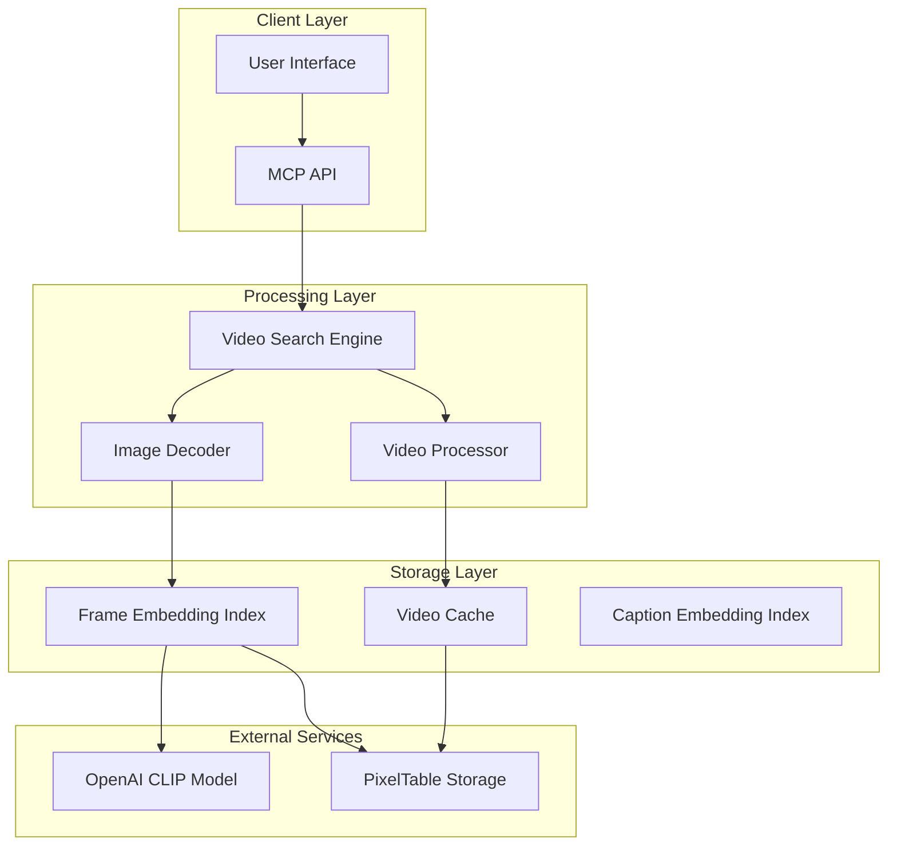
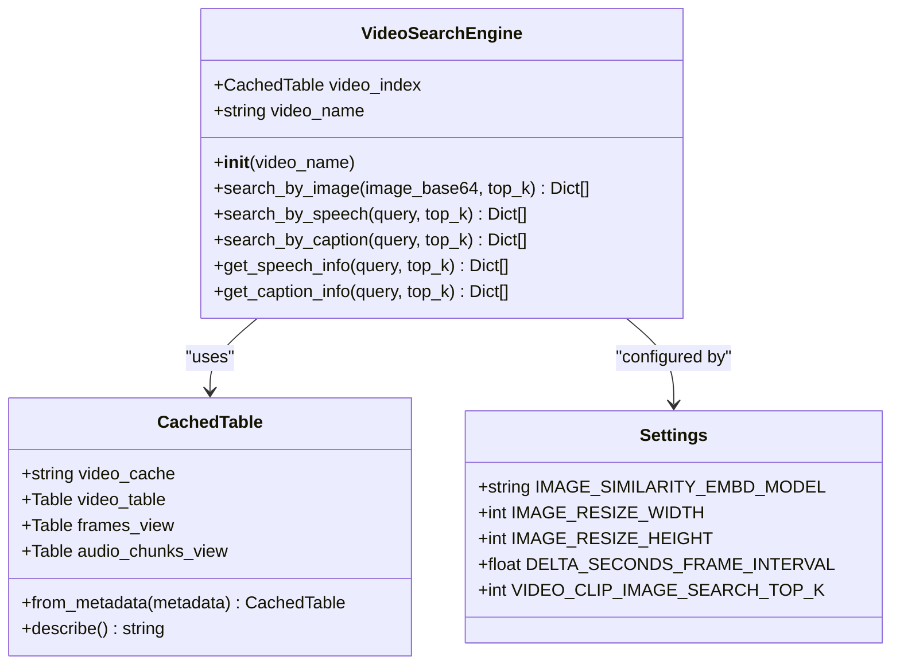
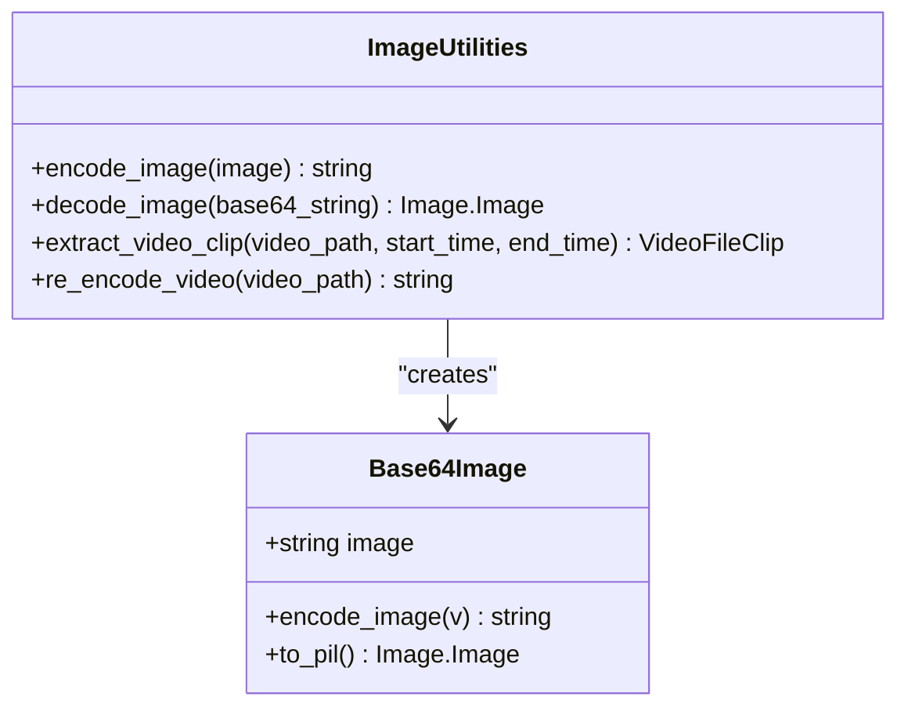
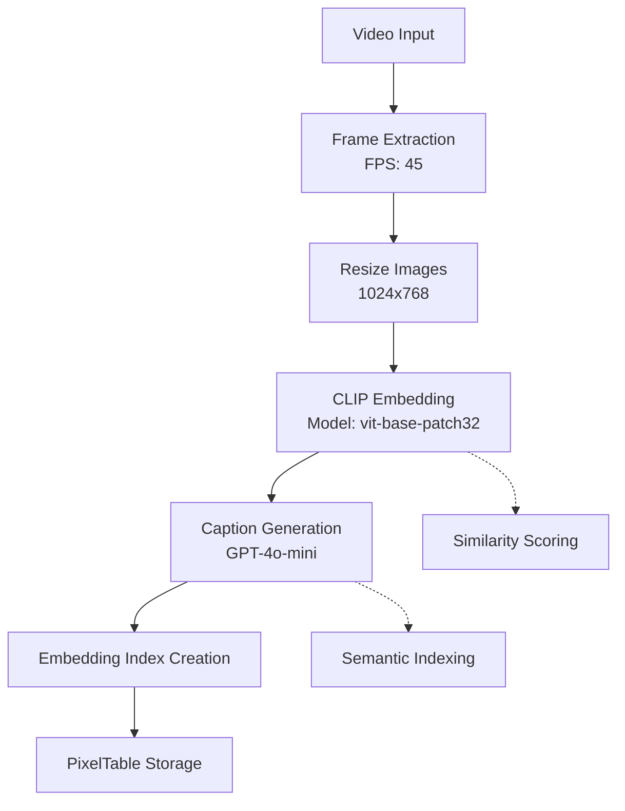
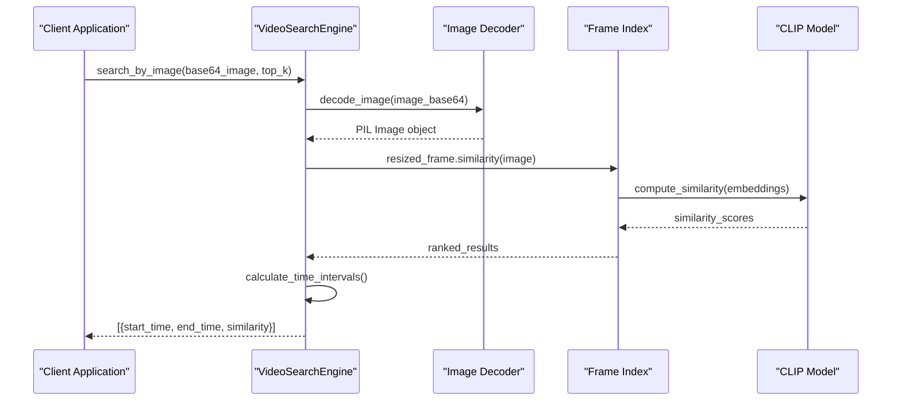

# Image-Based Search

<cite>
**Referenced Files in This Document**
- [video_search_engine.py](file://vaas-mcp/src/vaas_mcp/video/video_search_engine.py)
- [tools.py](file://vaas-mcp/src/vaas_mcp/tools.py)
- [ingestion/tools.py](file://vaas-mcp/src/vaas_mcp/video/ingestion/tools.py)
- [config.py](file://vaas-mcp/src/vaas_mcp/config.py)
- [models.py](file://vaas-mcp/src/vaas_mcp/video/ingestion/models.py)
- [registry.py](file://vaas-mcp/src/vaas_mcp/video/ingestion/registry.py)
- [video_processor.py](file://vaas-mcp/src/vaas_mcp/video/ingestion/video_processor.py)
- [server.py](file://vaas-mcp/src/vaas_mcp/server.py)
</cite>

## Table of Contents
1. [Introduction](#introduction)
2. [System Architecture](#system-architecture)
3. [Core Components](#core-components)
4. [Image Processing Pipeline](#image-processing-pipeline)
5. [Search Implementation](#search-implementation)
6. [Integration with MCP Tools](#integration-with-mcp-tools)
7. [Performance Considerations](#performance-considerations)
8. [Code Examples](#code-examples)
9. [Troubleshooting Guide](#troubleshooting-guide)
10. [Conclusion](#conclusion)

## Introduction

The image-based search functionality within the Multimodal Query System enables users to find video clips that visually match a provided query image. This sophisticated system leverages OpenAI's CLIP model via PixelTable to perform similarity comparisons between base64-encoded images and precomputed frame embeddings from video content.

The system transforms uploaded images through a comprehensive processing pipeline that includes base64 decoding, image resizing, embedding computation, and similarity scoring. The result is a powerful reverse image search capability that can identify visually similar segments within video content, making it possible to locate specific moments based on visual characteristics rather than textual descriptions.

## System Architecture

The image-based search system follows a modular architecture that separates concerns between image processing, video indexing, and search execution. The system integrates seamlessly with the broader multimodal query framework, supporting multiple search modalities including speech, captions, and images.



**Diagram sources**
- [video_search_engine.py](file://vaas-mcp/src/vaas_mcp/video/video_search_engine.py#L1-L32)
- [video_processor.py](file://vaas-mcp/src/vaas_mcp/video/ingestion/video_processor.py#L1-L50)

## Core Components

### VideoSearchEngine Class

The `VideoSearchEngine` serves as the central orchestrator for all search operations, including image-based queries. It maintains a connection to pre-computed video indices and provides a unified interface for different search modalities.



**Diagram sources**
- [video_search_engine.py](file://vaas-mcp/src/vaas_mcp/video/video_search_engine.py#L10-L32)
- [models.py](file://vaas-mcp/src/vaas_mcp/video/ingestion/models.py#L25-L50)
- [config.py](file://vaas-mcp/src/vaas_mcp/config.py#L1-L55)

### Image Processing Utilities

The system includes specialized utilities for handling base64-encoded images, providing robust encoding and decoding capabilities with comprehensive error handling.



**Diagram sources**
- [ingestion/tools.py](file://vaas-mcp/src/vaas_mcp/video/ingestion/tools.py#L40-L70)
- [models.py](file://vaas-mcp/src/vaas_mcp/video/ingestion/models.py#L70-L90)

**Section sources**
- [video_search_engine.py](file://vaas-mcp/src/vaas_mcp/video/video_search_engine.py#L1-L32)
- [ingestion/tools.py](file://vaas-mcp/src/vaas_mcp/video/ingestion/tools.py#L1-L155)

## Image Processing Pipeline

### Base64 Image Decoding

The `decode_image` utility converts base64-encoded image strings into PIL Image objects, enabling seamless integration with the rest of the processing pipeline. This function handles various edge cases and provides comprehensive error reporting.

```python
def decode_image(base64_string: str) -> Image.Image:
    """Decode a base64 string back into a PIL Image object."""
    try:
        image_bytes = base64.b64decode(base64_string)
        image_buffer = BytesIO(image_bytes)
        return Image.open(image_buffer)
    except (ValueError, IOError) as e:
        raise IOError(f"Failed to decode image: {str(e)}")
```

### Frame Preprocessing

During video ingestion, frames undergo a comprehensive preprocessing pipeline that prepares them for similarity search:

1. **Frame Extraction**: Videos are split into evenly spaced frames using the configured frame rate
2. **Image Resizing**: Frames are resized to optimal dimensions (1024x768) for efficient processing
3. **CLIP Embedding**: Each resized frame receives a CLIP embedding for similarity comparison
4. **Caption Generation**: AI-generated captions provide additional semantic context



**Diagram sources**
- [video_processor.py](file://vaas-mcp/src/vaas_mcp/video/ingestion/video_processor.py#L145-L180)
- [config.py](file://vaas-mcp/src/vaas_mcp/config.py#L30-L40)

**Section sources**
- [ingestion/tools.py](file://vaas-mcp/src/vaas_mcp/video/ingestion/tools.py#L40-L70)
- [video_processor.py](file://vaas-mcp/src/vaas_mcp/video/ingestion/video_processor.py#L145-L180)

## Search Implementation

### Image Similarity Search Algorithm

The `search_by_image` method implements a sophisticated similarity search algorithm that compares query images against pre-computed frame embeddings:

```python
def search_by_image(self, image_base64: str, top_k: int) -> List[Dict[str, Any]]:
    """Search video clips by image similarity."""
    image = decode_image(image_base64)
    sims = self.video_index.frames_view.resized_frame.similarity(image)
    results = self.video_index.frames_view.select(
        self.video_index.frames_view.pos_msec,
        self.video_index.frames_view.resized_frame,
        similarity=sims,
    ).order_by(sims, asc=False)
```

### Similarity Scoring Process

The similarity scoring process involves several key steps:

1. **Query Image Processing**: Base64 image is decoded and processed through the same pipeline as stored frames
2. **Embedding Comparison**: CLIP embeddings are compared using cosine similarity
3. **Ranking**: Results are ranked by similarity score in descending order
4. **Time Interval Calculation**: Frame positions are converted to video timestamps with delta intervals



**Diagram sources**
- [video_search_engine.py](file://vaas-mcp/src/vaas_mcp/video/video_search_engine.py#L64-L92)

### Time Interval Calculation

The system calculates meaningful clip boundaries using precise timing calculations:

```python
return [
    {
        "start_time": entry["pos_msec"] / 1000.0 - settings.DELTA_SECONDS_FRAME_INTERVAL,
        "end_time": entry["pos_msec"] / 1000.0 + settings.DELTA_SECONDS_FRAME_INTERVAL,
        "similarity": float(entry["similarity"]),
    }
    for entry in results.limit(top_k).collect()
]
```

The `DELTA_SECONDS_FRAME_INTERVAL` constant (default: 5.0 seconds) ensures that search results include a reasonable window around the matched frame, accounting for temporal variations in video playback.

**Section sources**
- [video_search_engine.py](file://vaas-mcp/src/vaas_mcp/video/video_search_engine.py#L64-L92)
- [config.py](file://vaas-mcp/src/vaas_mcp/config.py#L40-L45)

## Integration with MCP Tools

### MCP Tool: get_video_clip_from_image

The system exposes image-based search functionality through the MCP (Model Context Protocol) framework via the `get_video_clip_from_image` tool:

```python
def get_video_clip_from_image(video_path: str, user_image: str) -> str:
    """Get a video clip based on similarity to a provided image."""
    search_engine = VideoSearchEngine(video_path)
    image_clips = search_engine.search_by_image(user_image, settings.VIDEO_CLIP_IMAGE_SEARCH_TOP_K)
    
    video_clip = extract_video_clip(
        video_path=video_path,
        start_time=image_clips[0]["start_time"],
        end_time=image_clips[0]["end_time"],
        output_path=f"./shared_media/{str(uuid4())}.mp4",
    )
    
    return video_clip.filename
```

### Tool Registration and Usage

The MCP server registers the image search tool with comprehensive metadata:

```python
mcp.add_tool(
    name="get_video_clip_from_image",
    description="Use this tool to get a video clip from a video file based on a user image.",
    fn=get_video_clip_from_image,
    tags={"video", "clip", "image"},
)
```

This integration enables AI agents to leverage image-based search capabilities seamlessly within their workflows.

**Section sources**
- [tools.py](file://vaas-mcp/src/vaas_mcp/tools.py#L65-L85)
- [server.py](file://vaas-mcp/src/vaas_mcp/server.py#L30-L40)

## Performance Considerations

### High-Resolution Frame Indexing Implications

The system's performance is influenced by several factors related to frame indexing and processing:

1. **Memory Usage**: CLIP embeddings require significant memory for large video collections
2. **Processing Time**: Initial frame embedding creation can be time-consuming for long videos
3. **Search Latency**: Similarity searches scale with the number of indexed frames
4. **Storage Requirements**: Embeddings consume substantial disk space

### Optimization Strategies

To optimize image search speed and efficiency:

1. **Frame Rate Adjustment**: Configurable frame extraction rates balance quality vs. performance
2. **Embedding Caching**: Pre-computed embeddings eliminate real-time computation overhead
3. **Top-K Limitations**: Configurable result limits reduce computational load
4. **Parallel Processing**: Batch operations on frame embeddings improve throughput

### Configuration Tuning

Key configuration parameters for performance optimization:

- `SPLIT_FRAMES_COUNT`: Controls frame extraction density (default: 45)
- `IMAGE_RESIZE_WIDTH/HEIGHT`: Optimizes embedding computation (default: 1024x768)
- `VIDEO_CLIP_IMAGE_SEARCH_TOP_K`: Limits result set size (default: 1)
- `DELTA_SECONDS_FRAME_INTERVAL`: Balances precision vs. coverage (default: 5.0)

**Section sources**
- [config.py](file://vaas-mcp/src/vaas_mcp/config.py#L15-L55)
- [video_processor.py](file://vaas-mcp/src/vaas_mcp/video/ingestion/video_processor.py#L145-L180)

## Code Examples

### Basic Image Search Example

Here's a practical example demonstrating how to use the image-based search functionality:

```python
from vaas_mcp.video.video_search_engine import VideoSearchEngine
from vaas_mcp.tools import get_video_clip_from_image

# Initialize search engine
search_engine = VideoSearchEngine("sample_video")

# Perform image-based search
results = search_engine.search_by_image(
    image_base64="base64_encoded_image_string_here",
    top_k=5
)

# Extract video clip based on highest similarity
if results:
    video_clip = get_video_clip_from_image(
        video_path="./videos/sample_video.mp4",
        user_image="base64_encoded_query_image"
    )
    print(f"Found video clip: {video_clip}")
```

### Advanced Integration Example

```python
import base64
from PIL import Image
import io

# Load and encode an image
def encode_image_from_file(file_path: str) -> str:
    with open(file_path, "rb") as image_file:
        return base64.b64encode(image_file.read()).decode("utf-8")

# Search with error handling
def search_video_by_image(video_path: str, image_path: str):
    try:
        # Encode query image
        query_image = encode_image_from_file(image_path)
        
        # Search for similar video segments
        search_engine = VideoSearchEngine(video_path)
        results = search_engine.search_by_image(query_image, top_k=3)
        
        # Process results
        for i, result in enumerate(results):
            print(f"Match {i+1}:")
            print(f"  Similarity: {result['similarity']:.3f}")
            print(f"  Time Range: {result['start_time']:.1f}s to {result['end_time']:.1f}s")
            
        return results
        
    except Exception as e:
        print(f"Search failed: {str(e)}")
        return []
```

### MCP Tool Usage Example

```python
# Using the MCP tool directly
from vaas_mcp.tools import get_video_clip_from_image

# Get video clip based on image query
try:
    clip_path = get_video_clip_from_image(
        video_path="/path/to/video.mp4",
        user_image="base64_encoded_image_data"
    )
    print(f"Generated clip: {clip_path}")
except Exception as e:
    print(f"Tool execution failed: {str(e)}")
```

## Troubleshooting Guide

### Common Issues and Solutions

#### 1. Image Decoding Failures
**Problem**: `IOError: Failed to decode image`
**Solution**: Verify base64 string validity and ensure proper encoding format

```python
# Debug image decoding
try:
    image = decode_image(base64_string)
    print("Image decoded successfully")
except IOError as e:
    print(f"Decoding failed: {e}")
    # Check base64 string length and format
```

#### 2. Video Index Not Found
**Problem**: `ValueError: Video index not found in registry`
**Solution**: Ensure video has been properly processed and indexed

```python
# Check available video indices
from vaas_mcp.video.ingestion.registry import get_registry
registry = get_registry()
print(f"Available indices: {list(registry.keys())}")
```

#### 3. Memory Issues with Large Videos
**Problem**: Out of memory errors during frame processing
**Solution**: Reduce frame extraction count or increase system resources

```python
# Adjust frame processing settings
settings.SPLIT_FRAMES_COUNT = 20  # Reduce from default 45
```

#### 4. Slow Search Performance
**Problem**: Image similarity searches taking too long
**Solution**: Optimize configuration parameters and consider hardware upgrades

```python
# Enable caching and adjust parameters
settings.VIDEO_CLIP_IMAGE_SEARCH_TOP_K = 1  # Reduce result limit
settings.DELTA_SECONDS_FRAME_INTERVAL = 3.0  # Narrow search windows
```

### Performance Monitoring

Monitor system performance using these metrics:

- **Search Latency**: Time taken for similarity searches
- **Memory Usage**: RAM consumption during processing
- **Disk I/O**: Storage operations during embedding computation
- **GPU Utilization**: CLIP model inference performance

**Section sources**
- [ingestion/tools.py](file://vaas-mcp/src/vaas_mcp/video/ingestion/tools.py#L40-L70)
- [video_search_engine.py](file://vaas-mcp/src/vaas_mcp/video/video_search_engine.py#L15-L32)

## Conclusion

The image-based search functionality within the Multimodal Query System represents a sophisticated approach to reverse image search in video content. By leveraging OpenAI's CLIP model and PixelTable's advanced indexing capabilities, the system provides powerful visual similarity matching that enables users to locate specific video segments based on visual characteristics.

The system's modular architecture ensures scalability and maintainability, while the comprehensive configuration options allow for fine-tuning based on specific use cases and performance requirements. Integration with the MCP framework makes these capabilities accessible to AI agents and automated workflows.

Key strengths of the system include:

- **Robust Image Processing**: Comprehensive base64 encoding/decoding utilities
- **Efficient Indexing**: Pre-computed CLIP embeddings enable fast similarity searches  
- **Flexible Configuration**: Tunable parameters for performance optimization
- **Seamless Integration**: MCP tool support for AI agent workflows
- **Error Handling**: Comprehensive error reporting and recovery mechanisms

Future enhancements could include support for batch image queries, improved caching strategies, and enhanced visualization of search results to provide users with intuitive feedback on similarity matches.