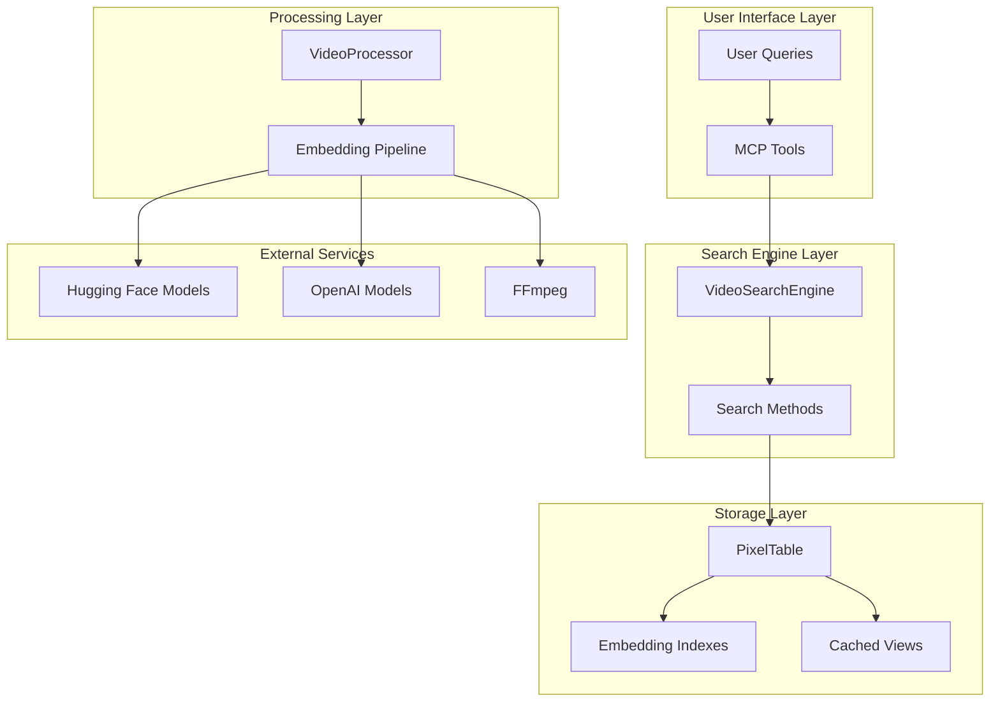
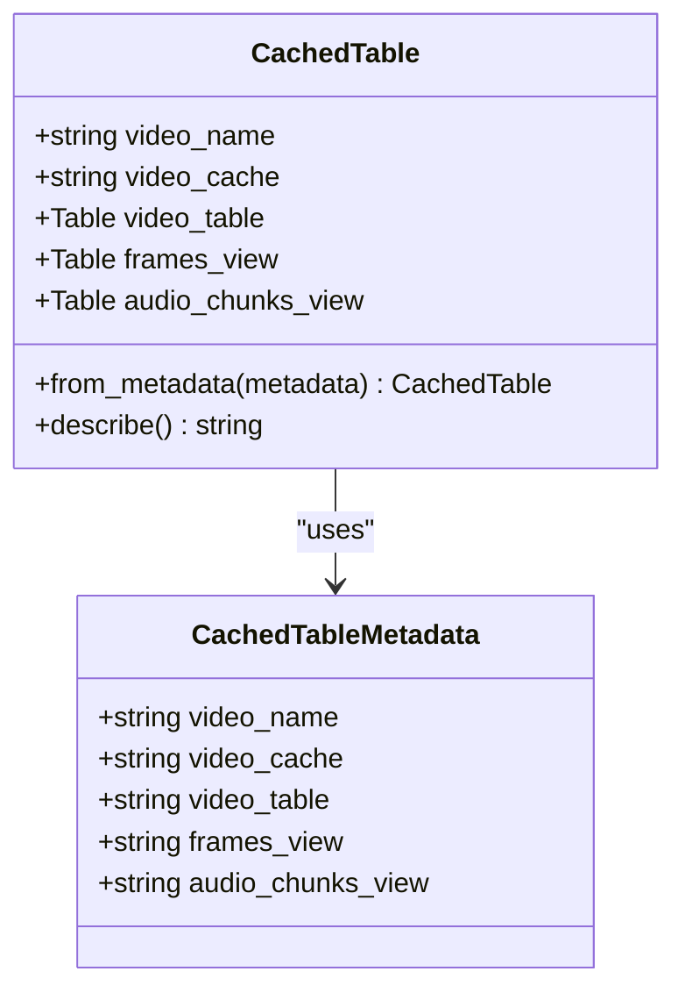
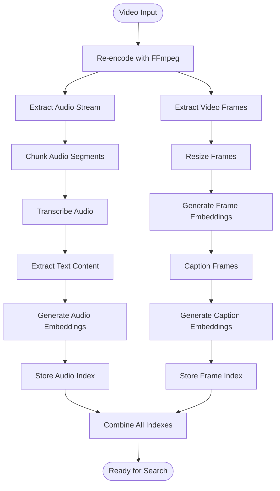
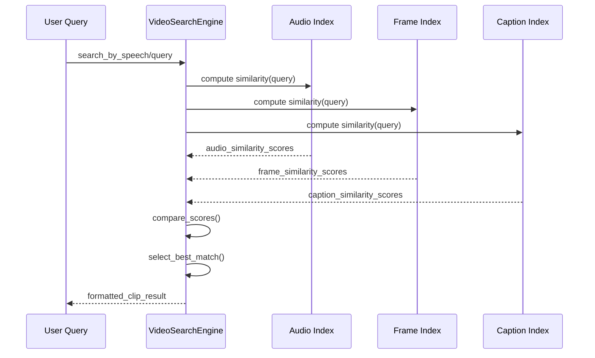

# Multimodal Query System

<cite>
**Referenced Files in This Document**
- [video_search_engine.py](file://vaas-mcp/src/vaas_mcp/video/video_search_engine.py)
- [tools.py](file://vaas-mcp/src/vaas_mcp/tools.py)
- [video_processor.py](file://vaas-mcp/src/vaas_mcp/video/ingestion/video_processor.py)
- [models.py](file://vaas-mcp/src/vaas_mcp/video/ingestion/models.py)
- [registry.py](file://vaas-mcp/src/vaas_mcp/video/ingestion/registry.py)
- [tools.py](file://vaas-mcp/src/vaas_mcp/video/ingestion/tools.py)
- [functions.py](file://vaas-mcp/src/vaas_mcp/video/ingestion/functions.py)
- [constants.py](file://vaas-mcp/src/vaas_mcp/video/ingestion/constants.py)
- [config.py](file://vaas-mcp/src/vaas_mcp/config.py)
</cite>

## Table of Contents
1. [Introduction](#introduction)
2. [System Architecture](#system-architecture)
3. [Core Components](#core-components)
4. [Video Search Engine](#video-search-engine)
5. [Embedding Processing Pipeline](#embedding-processing-pipeline)
6. [Cross-Modal Search Implementation](#cross-modal-search-implementation)
7. [Integration with MCP Tools](#integration-with-mcp-tools)
8. [Performance Considerations](#performance-considerations)
9. [Configuration Management](#configuration-management)
10. [Troubleshooting Guide](#troubleshooting-guide)
11. [Conclusion](#conclusion)

## Introduction

The Multimodal Query System is a sophisticated video search platform that enables intelligent cross-modal retrieval across speech, image, and caption modalities. Built on top of the vaas-MCP framework, this system leverages precomputed embeddings to provide fast and accurate video search capabilities across multiple modalities.

The system transforms raw video content into searchable embeddings using advanced AI models, including OpenAI's GPT models for transcription and captioning, and Hugging Face's CLIP models for image similarity. Users can query videos using natural language, images, or text, and receive precise temporal segments with similarity scores.

## System Architecture

The Multimodal Query System follows a layered architecture that separates concerns between ingestion, storage, and retrieval:



**Diagram sources**
- [video_search_engine.py](file://vaas-mcp/src/vaas_mcp/video/video_search_engine.py#L1-L168)
- [video_processor.py](file://vaas-mcp/src/vaas_mcp/video/ingestion/video_processor.py#L1-L205)
- [tools.py](file://vaas-mcp/src/vaas_mcp/tools.py#L1-L105)

## Core Components

### VideoSearchEngine

The `VideoSearchEngine` class serves as the central orchestrator for all multimodal search operations. It maintains connections to precomputed embedding indexes and provides unified interfaces for different modalities.

```python
class VideoSearchEngine:
    """A class that provides video search capabilities using different modalities."""
    
    def __init__(self, video_name: str):
        self.video_index: CachedTable = registry.get_table(video_name)
        self.video_name = video_name
```

Key responsibilities include:
- Managing video index registry and caching
- Providing modality-specific search methods
- Coordinating similarity computations
- Formatting search results with metadata

### CachedTable Structure

The system uses a sophisticated caching mechanism to store precomputed embeddings and metadata:



**Diagram sources**
- [models.py](file://vaas-mcp/src/vaas_mcp/video/ingestion/models.py#L15-L50)

**Section sources**
- [video_search_engine.py](file://vaas-mcp/src/vaas_mcp/video/video_search_engine.py#L10-L25)
- [models.py](file://vaas-mcp/src/vaas_mcp/video/ingestion/models.py#L15-L80)

## Video Search Engine

The VideoSearchEngine implements three primary search methods, each optimized for different modalities:

### Speech-Based Search

The `search_by_speech` method enables text queries to find relevant audio segments:

```python
def search_by_speech(self, query: str, top_k: int) -> List[Dict[str, Any]]:
    sims = self.video_index.audio_chunks_view.chunk_text.similarity(query)
    results = self.video_index.audio_chunks_view.select(
        self.video_index.audio_chunks_view.pos,
        self.video_index.audio_chunks_view.start_time_sec,
        self.video_index.audio_chunks_view.end_time_sec,
        similarity=sims,
    ).order_by(sims, asc=False)
```

This method:
1. Computes similarity between query text and audio chunk embeddings
2. Retrieves temporal metadata (start/end times)
3. Orders results by similarity score
4. Returns formatted clip information

### Image-Based Search

The `search_by_image` method compares base64-encoded images against frame embeddings:

```python
def search_by_image(self, image_base64: str, top_k: int) -> List[Dict[str, Any]]:
    image = decode_image(image_base64)
    sims = self.video_index.frames_view.resized_frame.similarity(image)
    results = self.video_index.frames_view.select(
        self.video_index.frames_view.pos_msec,
        self.video_index.frames_view.resized_frame,
        similarity=sims,
    ).order_by(sims, asc=False)
```

Key features:
- Automatic base64 decoding of query images
- Frame similarity computation using CLIP embeddings
- Temporal interval calculation around matched frames
- Configurable frame interval window

### Caption-Based Search

The `search_by_caption` method searches frame captions for textual relevance:

```python
def search_by_caption(self, query: str, top_k: int) -> List[Dict[str, Any]]:
    sims = self.video_index.frames_view.im_caption.similarity(query)
    results = self.video_index.frames_view.select(
        self.video_index.frames_view.pos_msec,
        self.video_index.frames_view.im_caption,
        similarity=sims,
    ).order_by(sims, asc=False)
```

**Section sources**
- [video_search_engine.py](file://vaas-mcp/src/vaas_mcp/video/video_search_engine.py#L30-L120)

## Embedding Processing Pipeline

The video ingestion process transforms raw video content into searchable embeddings through a sophisticated pipeline:



**Diagram sources**
- [video_processor.py](file://vaas-mcp/src/vaas_mcp/video/ingestion/video_processor.py#L80-L205)

### Audio Processing Pipeline

The audio processing chain includes:

1. **Audio Extraction**: Using FFmpeg to extract MP3 audio streams
2. **Chunking**: Dividing audio into overlapping segments
3. **Transcription**: Converting audio to text using OpenAI Whisper
4. **Text Extraction**: Parsing transcription JSON to plain text
5. **Embedding Generation**: Creating dense vector representations
6. **Index Creation**: Building similarity search indexes

### Frame Processing Pipeline

Frame processing involves:

1. **Frame Extraction**: Sampling frames at configured intervals
2. **Resizing**: Standardizing frame dimensions for consistency
3. **Frame Embedding**: Computing CLIP embeddings for visual similarity
4. **Caption Generation**: Using OpenAI Vision for descriptive captions
5. **Caption Embedding**: Creating text embeddings for caption similarity
6. **Multi-modal Indexing**: Storing both visual and textual embeddings

**Section sources**
- [video_processor.py](file://vaas-mcp/src/vaas_mcp/video/ingestion/video_processor.py#L80-L205)

## Cross-Modal Search Implementation

The system implements intelligent cross-modal search that combines multiple modalities for enhanced retrieval:

### Query Processing Workflow



**Diagram sources**
- [video_search_engine.py](file://vaas-mcp/src/vaas_mcp/video/video_search_engine.py#L30-L120)

### Base64 Image Processing

The system handles base64-encoded images through a dedicated decoding pipeline:

```python
def decode_image(base64_string: str) -> Image.Image:
    """Decode a base64 string back into a PIL Image object."""
    try:
        image_bytes = base64.b64decode(base64_string)
        image_buffer = BytesIO(image_bytes)
        return Image.open(image_buffer)
    except (ValueError, IOError) as e:
        raise IOError(f"Failed to decode image: {str(e)}")
```

### Time Interval Calculations

The system calculates temporal intervals around matched frames to provide meaningful video clips:

```python
# Frame-based search result formatting
{
    "start_time": entry["pos_msec"] / 1000.0 - settings.DELTA_SECONDS_FRAME_INTERVAL,
    "end_time": entry["pos_msec"] / 1000.0 + settings.DELTA_SECONDS_FRAME_INTERVAL,
    "similarity": float(entry["similarity"]),
}
```

**Section sources**
- [video_search_engine.py](file://vaas-mcp/src/vaas_mcp/video/video_search_engine.py#L60-L120)
- [tools.py](file://vaas-mcp/src/vaas_mcp/video/ingestion/tools.py#L70-L95)

## Integration with MCP Tools

The system integrates seamlessly with MCP (Model Context Protocol) tools for practical applications:

### Video Clip Extraction Tools

#### get_video_clip_from_user_query

This tool demonstrates intelligent multimodal search coordination:

```python
def get_video_clip_from_user_query(video_path: str, user_query: str) -> str:
    search_engine = VideoSearchEngine(video_path)
    
    speech_clips = search_engine.search_by_speech(user_query, settings.VIDEO_CLIP_SPEECH_SEARCH_TOP_K)
    caption_clips = search_engine.search_by_caption(user_query, settings.VIDEO_CLIP_CAPTION_SEARCH_TOP_K)
    
    # Compare modalities and select best result
    speech_sim = speech_clips[0]["similarity"] if speech_clips else 0
    caption_sim = caption_clips[0]["similarity"] if caption_clips else 0
    
    video_clip_info = speech_clips[0] if speech_sim > caption_sim else caption_clips[0]
```

#### get_video_clip_from_image

This tool focuses exclusively on visual similarity:

```python
def get_video_clip_from_image(video_path: str, user_image: str) -> str:
    search_engine = VideoSearchEngine(video_path)
    image_clips = search_engine.search_by_image(user_image, settings.VIDEO_CLIP_IMAGE_SEARCH_TOP_K)
    
    video_clip = extract_video_clip(
        video_path=video_path,
        start_time=image_clips[0]["start_time"],
        end_time=image_clips[0]["end_time"],
        output_path=f"./shared_media/{str(uuid4())}.mp4",
    )
    
    return video_clip.filename
```

### Question Answering Integration

The `ask_question_about_video` tool provides caption-based Q&A:

```python
def ask_question_about_video(video_path: str, user_query: str) -> str:
    search_engine = VideoSearchEngine(video_path)
    caption_info = search_engine.get_caption_info(user_query, settings.QUESTION_ANSWER_TOP_K)
    
    answer = "\n".join(entry["caption"] for entry in caption_info)
    return answer
```

**Section sources**
- [tools.py](file://vaas-mcp/src/vaas_mcp/tools.py#L30-L105)

## Performance Considerations

### Latency Optimization Strategies

The system employs several strategies to minimize latency:

1. **Precomputed Embeddings**: All similarity computations occur offline during ingestion
2. **Caching Mechanisms**: Video indices are cached for rapid access
3. **Top-K Filtering**: Results are limited to configurable thresholds
4. **Parallel Processing**: Multiple modalities can be searched concurrently

### Accuracy Trade-offs

The system balances accuracy with performance through:

- **Embedding Model Selection**: Different models optimized for specific tasks
- **Frame Rate Configuration**: Adjustable sampling rates for different use cases
- **Similarity Thresholds**: Configurable confidence levels for result filtering
- **Multi-modal Fusion**: Combining results from multiple modalities

### Memory Management

Efficient memory usage through:
- Streaming video processing
- Selective column loading
- Garbage collection of temporary embeddings
- Optimized data structures

## Configuration Management

The system uses a comprehensive configuration system:

```python
class Settings(BaseSettings):
    # Video Processing Configuration
    SPLIT_FRAMES_COUNT: int = 45
    AUDIO_CHUNK_LENGTH: int = 10
    AUDIO_OVERLAP_SECONDS: int = 1
    
    # Embedding Models
    IMAGE_SIMILARITY_EMBD_MODEL: str = "openai/clip-vit-base-patch32"
    TRANSCRIPT_SIMILARITY_EMBD_MODEL: str = "text-embedding-3-small"
    IMAGE_CAPTION_MODEL: str = "gpt-4o-mini"
    
    # Search Parameters
    DELTA_SECONDS_FRAME_INTERVAL: float = 5.0
    VIDEO_CLIP_SPEECH_SEARCH_TOP_K: int = 1
```

**Section sources**
- [config.py](file://vaas-mcp/src/vaas_mcp/config.py#L1-L56)

## Troubleshooting Guide

### Common Issues and Solutions

#### Video Processing Failures

**Problem**: Videos fail to process during ingestion
**Solution**: 
- Verify FFmpeg installation and accessibility
- Check video format compatibility
- Review disk space availability
- Validate video file integrity

#### Embedding Computation Errors

**Problem**: Embedding generation fails or produces poor quality
**Solution**:
- Verify API key configuration for external services
- Check model availability and quotas
- Review image preprocessing steps
- Validate text content formatting

#### Search Performance Issues

**Problem**: Slow search response times
**Solution**:
- Adjust top-k parameters for smaller result sets
- Optimize embedding model selection
- Review database indexing strategies
- Monitor system resource utilization

### Debugging Tools

The system provides comprehensive logging and debugging capabilities:

```python
logger = loguru.logger.bind(name="VideoTools")
logger.debug(f"FFmpeg output: {stdout.decode('utf-8', errors='ignore')}")
logger.info(f"Video {video_path} successfully opened by PyAV.")
```

**Section sources**
- [tools.py](file://vaas-mcp/src/vaas_mcp/video/ingestion/tools.py#L20-L30)
- [video_processor.py](file://vaas-mcp/src/vaas_mcp/video/ingestion/video_processor.py#L20-L30)

## Conclusion

The Multimodal Query System represents a sophisticated approach to video search that leverages modern AI technologies to provide intuitive, cross-modal retrieval capabilities. By precomputing embeddings and organizing them in efficient data structures, the system achieves real-time search performance while maintaining high accuracy across multiple modalities.

The architecture's modular design allows for easy extension and customization, while the comprehensive configuration system provides flexibility for different use cases. The integration with MCP tools demonstrates practical applicability in real-world scenarios, from content discovery to interactive video exploration.

Future enhancements could include support for additional modalities, improved multi-modal fusion techniques, and enhanced user interface capabilities for visual query construction and result refinement.