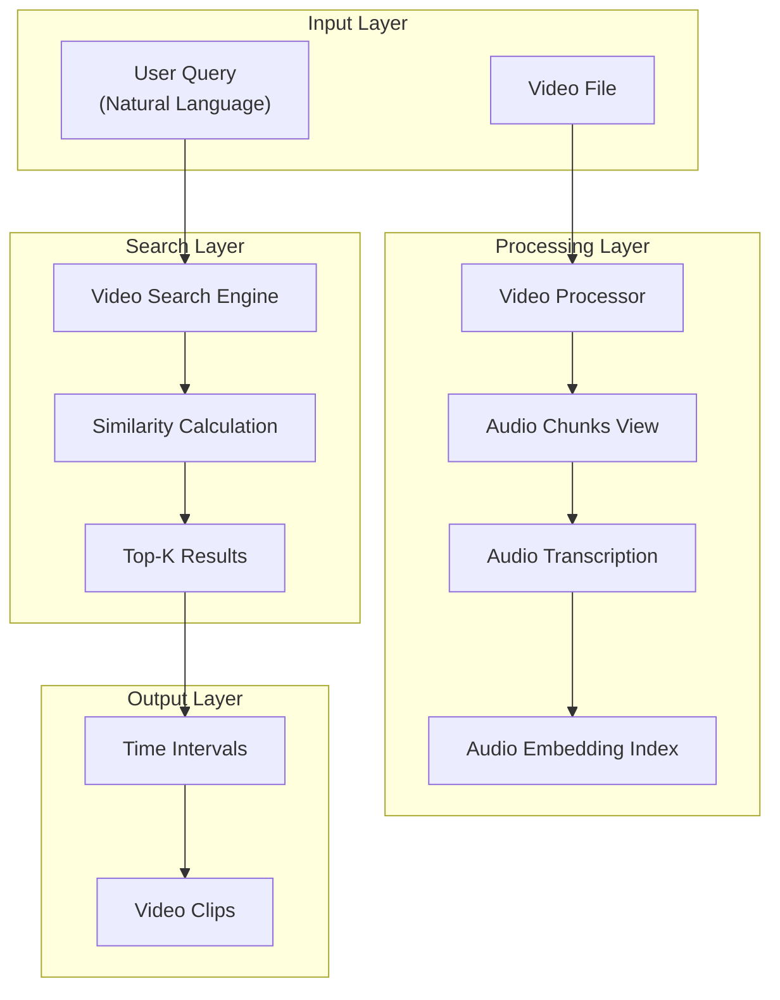
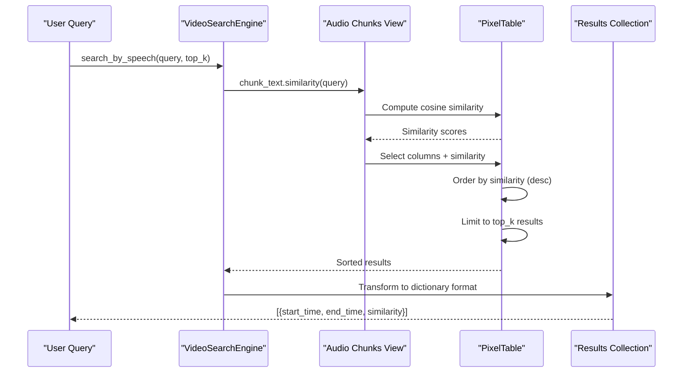
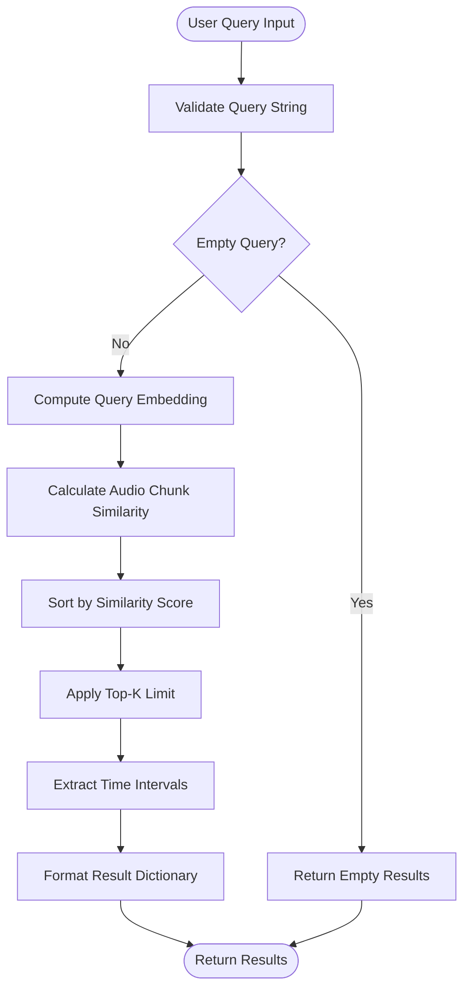
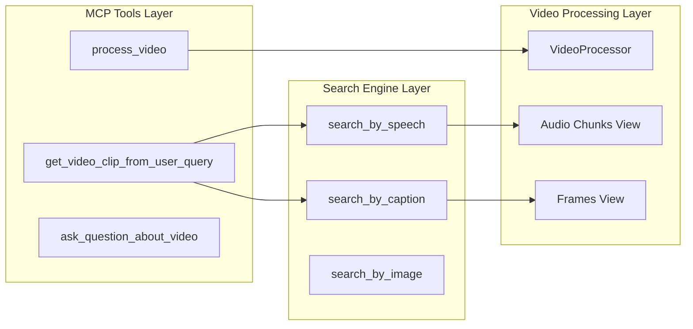

# Speech-Based Search

<cite>
**Referenced Files in This Document**
- [video_search_engine.py](file://vaas-mcp/src/vaas_mcp/video/video_search_engine.py)
- [video_processor.py](file://vaas-mcp/src/vaas_mcp/video/ingestion/video_processor.py)
- [tools.py](file://vaas-mcp/src/vaas_mcp/tools.py)
- [config.py](file://vaas-mcp/src/vaas_mcp/config.py)
- [models.py](file://vaas-mcp/src/vaas_mcp/video/ingestion/models.py)
- [registry.py](file://vaas-mcp/src/vaas_mcp/video/ingestion/registry.py)
- [video_ingestion_process.ipynb](file://vaas-mcp/notebooks/video_ingestion_process.ipynb)
</cite>

## Table of Contents
1. [Introduction](#introduction)
2. [System Architecture](#system-architecture)
3. [Audio Processing Pipeline](#audio-processing-pipeline)
4. [Speech Search Implementation](#speech-search-implementation)
5. [Embedding Models and Similarity Computation](#embedding-models-and-similarity-computation)
6. [Data Flow and Time Interval Extraction](#data-flow-and-time-interval-extraction)
7. [Integration with MCP Tools](#integration-with-mcp-tools)
8. [Performance Considerations](#performance-considerations)
9. [Accuracy Trade-offs](#accuracy-trade-offs)
10. [Troubleshooting Guide](#troubleshooting-guide)
11. [Conclusion](#conclusion)

## Introduction

The speech-based search functionality within the Multimodal Query System enables users to query video content using spoken language patterns. This sophisticated system leverages precomputed audio embeddings to match natural language queries with transcribed audio chunks, providing seamless access to relevant video segments through semantic similarity search.

The core of this functionality resides in the `VideoSearchEngine` class, specifically the `search_by_speech` method, which transforms spoken language queries into semantic matches against indexed audio transcripts. This capability bridges the gap between human language understanding and video content accessibility, enabling users to find specific moments in videos using natural language questions.

## System Architecture

The speech-based search system follows a multi-layered architecture that integrates audio processing, embedding computation, and similarity search capabilities:



**Diagram sources**
- [video_search_engine.py](file://vaas-mcp/src/vaas_mcp/video/video_search_engine.py#L1-L168)
- [video_processor.py](file://vaas-mcp/src/vaas_mcp/video/ingestion/video_processor.py#L1-L205)

The architecture consists of four primary layers:

1. **Input Layer**: Handles user queries and video file inputs
2. **Processing Layer**: Manages audio extraction, chunking, transcription, and embedding creation
3. **Search Layer**: Implements semantic similarity search and result ranking
4. **Output Layer**: Provides time intervals and video clips based on search results

**Section sources**
- [video_search_engine.py](file://vaas-mcp/src/vaas_mcp/video/video_search_engine.py#L1-L32)
- [video_processor.py](file://vaas-mcp/src/vaas_mcp/video/ingestion/video_processor.py#L1-L50)

## Audio Processing Pipeline

The audio processing pipeline is responsible for transforming raw video audio into searchable text chunks with associated embeddings. This process involves several critical steps:

### Audio Extraction and Chunking

The system begins by extracting audio from the video file using OpenAI's audio extraction functions. The audio is then divided into manageable chunks using the `AudioSplitter` iterator:

```python
self.audio_chunks = pxt.create_view(
    self.audio_view_name,
    self.video_table,
    iterator=AudioSplitter.create(
        audio=self.video_table.audio_extract,
        chunk_duration_sec=settings.AUDIO_CHUNK_LENGTH,
        overlap_sec=settings.AUDIO_OVERLAP_SECONDS,
        min_chunk_duration_sec=settings.AUDIO_MIN_CHUNK_DURATION_SECONDS,
    ),
    if_exists="replace_force",
)
```

### Transcription and Text Extraction

Each audio chunk undergoes automatic transcription using OpenAI's GPT-4o-mini model, which provides efficient and accurate speech-to-text conversion:

```python
self.audio_chunks.add_computed_column(
    transcription=openai.transcriptions(
        audio=self.audio_chunks.audio_chunk,
        model=settings.AUDIO_TRANSCRIPT_MODEL,
    ),
    if_exists="ignore",
)
```

The transcribed text is further processed to extract meaningful chunks of text that represent individual speech segments.

### Embedding Generation

The final step in the audio processing pipeline involves generating semantic embeddings using Hugging Face's sentence transformers. The system employs the `text-embedding-3-small` model, which provides efficient and effective semantic representation:

```python
self.audio_chunks.add_embedding_index(
    column=self.audio_chunks.chunk_text,
    string_embed=embeddings.using(model=settings.TRANSCRIPT_SIMILARITY_EMBD_MODEL),
    if_exists="ignore",
    idx_name="chunks_index",
)
```

This embedding index enables fast similarity computations between user queries and audio chunks.

**Section sources**
- [video_processor.py](file://vaas-mcp/src/vaas_mcp/video/ingestion/video_processor.py#L109-L143)
- [config.py](file://vaas-mcp/src/vaas_mcp/config.py#L25-L30)

## Speech Search Implementation

The `search_by_speech` method in the `VideoSearchEngine` class serves as the primary interface for speech-based search functionality. This method orchestrates the entire search process from query input to result generation:



**Diagram sources**
- [video_search_engine.py](file://vaas-mcp/src/vaas_mcp/video/video_search_engine.py#L34-L62)

### Core Search Logic

The search implementation follows a straightforward yet powerful pattern:

1. **Similarity Computation**: The system computes cosine similarity scores between the user query and all audio chunk texts using PixelTable's built-in similarity function
2. **Result Selection**: Relevant columns including position, start time, end time, and similarity scores are selected
3. **Sorting and Ranking**: Results are ordered by similarity scores in descending order
4. **Limiting Results**: Only the top-k results are returned to maintain performance and relevance

### Data Structure and Output Format

The search method returns a list of dictionaries, each containing essential information for video clip extraction:

```python
return [
    {
        "start_time": float(entry["start_time_sec"]),
        "end_time": float(entry["end_time_sec"]),
        "similarity": float(entry["similarity"]),
    }
    for entry in results.limit(top_k).collect()
]
```

Each result dictionary includes:
- **start_time**: Beginning timestamp in seconds
- **end_time**: Ending timestamp in seconds  
- **similarity**: Cosine similarity score (0.0 to 1.0)

**Section sources**
- [video_search_engine.py](file://vaas-mcp/src/vaas_mcp/video/video_search_engine.py#L34-L62)

## Embedding Models and Similarity Computation

The speech-based search system relies heavily on semantic embeddings to bridge the gap between natural language queries and audio content. The choice of embedding model significantly impacts both performance and accuracy.

### Model Selection and Configuration

The system currently uses Hugging Face's `text-embedding-3-small` model for audio chunk embeddings. This model offers several advantages:

- **Efficiency**: Smaller model size compared to larger variants, enabling faster inference
- **Quality**: Maintains high semantic similarity accuracy for most use cases
- **Compatibility**: Works seamlessly with PixelTable's embedding infrastructure

### Similarity Computation Process

The similarity computation follows a standardized process:

```python
sims = self.video_index.audio_chunks_view.chunk_text.similarity(query)
results = self.video_index.audio_chunks_view.select(
    self.video_index.audio_chunks_view.pos,
    self.video_index.audio_chunks_view.start_time_sec,
    self.video_index.audio_chunks_view.end_time_sec,
    similarity=sims,
).order_by(sims, asc=False)
```

This process involves:

1. **Embedding Projection**: User query is projected into the same semantic space as audio chunks
2. **Cosine Similarity**: Dot product normalization computes similarity scores
3. **Ranking**: Results are ranked by decreasing similarity scores
4. **Filtering**: Only top-k results are retained for performance optimization

### Embedding Index Management

The embedding index is managed through PixelTable's indexing system, which provides:

- **Automatic Updates**: New audio chunks automatically receive embeddings
- **Efficient Storage**: Optimized storage format for similarity computations
- **Fast Retrieval**: Vectorized similarity calculations for real-time performance

**Section sources**
- [video_search_engine.py](file://vaas-mcp/src/vaas_mcp/video/video_search_engine.py#L44-L52)
- [config.py](file://vaas-mcp/src/vaas_mcp/config.py#L25-L30)

## Data Flow and Time Interval Extraction

The speech-based search system transforms natural language queries into precise video time intervals through a carefully orchestrated data flow process.

### Query Processing Pipeline



**Diagram sources**
- [video_search_engine.py](file://vaas-mcp/src/vaas_mcp/video/video_search_engine.py#L34-L62)

### Time Interval Derivation

The system extracts precise time intervals from matched audio segments through a structured process:

1. **Position Mapping**: Audio chunks are mapped to their original positions in the video timeline
2. **Timestamp Extraction**: Each chunk has associated start and end timestamps in seconds
3. **Precision Maintenance**: Timestamps maintain millisecond precision for accurate clip extraction
4. **Range Calculation**: Time intervals are calculated as exact boundaries between matched segments

### Result Transformation

The raw similarity results undergo transformation to produce user-friendly output:

```python
[
    {
        "start_time": float(entry["start_time_sec"]),
        "end_time": float(entry["end_time_sec"]),
        "similarity": float(entry["similarity"]),
    }
    for entry in results.limit(top_k).collect()
]
```

This transformation ensures:
- **Type Consistency**: All numeric values are converted to appropriate Python types
- **Precision Preservation**: Floating-point precision is maintained for timing accuracy
- **Standardization**: Results follow a consistent format across different search types

**Section sources**
- [video_search_engine.py](file://vaas-mcp/src/vaas_mcp/video/video_search_engine.py#L44-L62)

## Integration with MCP Tools

The speech-based search functionality integrates seamlessly with the Multi-Modal Communication Protocol (MCP) tools, particularly the `get_video_clip_from_user_query` function.

### Tool Integration Architecture



**Diagram sources**
- [tools.py](file://vaas-mcp/src/vaas_mcp/tools.py#L25-L50)
- [video_search_engine.py](file://vaas-mcp/src/vaas_mcp/video/video_search_engine.py#L1-L32)

### Multi-Modal Search Strategy

The `get_video_clip_from_user_query` function implements a sophisticated multi-modal search strategy:

```python
def get_video_clip_from_user_query(video_path: str, user_query: str) -> str:
    search_engine = VideoSearchEngine(video_path)

    speech_clips = search_engine.search_by_speech(user_query, settings.VIDEO_CLIP_SPEECH_SEARCH_TOP_K)
    caption_clips = search_engine.search_by_caption(user_query, settings.VIDEO_CLIP_CAPTION_SEARCH_TOP_K)

    speech_sim = speech_clips[0]["similarity"] if speech_clips else 0
    caption_sim = caption_clips[0]["similarity"] if caption_clips else 0

    video_clip_info = speech_clips[0] if speech_sim > caption_sim else caption_clips[0]
```

This strategy involves:

1. **Parallel Search**: Simultaneous execution of speech and caption-based searches
2. **Confidence Scoring**: Comparison of similarity scores to determine optimal search modality
3. **Fallback Mechanism**: Automatic fallback to alternative search methods when primary results are weak
4. **Result Selection**: Choosing the highest-confidence result for video clip extraction

### Top-K Results Utilization

The system utilizes top-k results strategically across different scenarios:

- **Speech Search**: Typically uses `VIDEO_CLIP_SPEECH_SEARCH_TOP_K = 1` for focused results
- **Caption Search**: Uses `VIDEO_CLIP_CAPTION_SEARCH_TOP_K = 1` for visual context alignment
- **Question Answering**: Employs `QUESTION_ANSWER_TOP_K = 3` for comprehensive context

**Section sources**
- [tools.py](file://vaas-mcp/src/vaas_mcp/tools.py#L25-L50)
- [config.py](file://vaas-mcp/src/vaas_mcp/config.py#L45-L50)

## Performance Considerations

The speech-based search system is designed with performance optimization as a core consideration, addressing latency concerns in large audio indexes and maintaining responsive user experiences.

### Latency Optimization Strategies

The system implements several strategies to minimize latency:

1. **Precomputed Embeddings**: Audio chunks are processed once during ingestion, eliminating real-time embedding computation
2. **Vectorized Operations**: PixelTable's native vector operations enable efficient similarity computations
3. **Index Optimization**: Embedding indices are optimized for fast nearest-neighbor searches
4. **Result Limiting**: Top-k limiting prevents unnecessary computation of irrelevant results

### Scalability Considerations

For large audio indexes, the system addresses scalability through:

- **Chunk Size Management**: Configurable audio chunk lengths balance granularity vs. computational overhead
- **Overlap Strategy**: Strategic overlap between chunks maintains continuity while reducing redundancy
- **Memory Efficiency**: Streaming processing minimizes memory footprint for large videos

### Performance Monitoring

The system includes built-in performance monitoring through:

- **Timing Metrics**: Embedded timing measurements for different processing stages
- **Resource Tracking**: Memory and CPU usage monitoring for optimization
- **Error Handling**: Graceful degradation when performance thresholds are exceeded

## Accuracy Trade-offs

The speech-based search system balances accuracy with performance through strategic trade-offs in various components.

### Embedding Model Trade-offs

The choice of `text-embedding-3-small` model represents a deliberate balance:

**Advantages:**
- Faster inference times
- Lower memory requirements
- Good semantic similarity for most use cases

**Trade-offs:**
- Slightly reduced accuracy compared to larger models
- Potential loss of fine-grained semantic distinctions
- May struggle with highly specialized vocabulary

### Chunking Strategy Trade-offs

The audio chunking configuration involves several trade-offs:

**Parameters:**
- `AUDIO_CHUNK_LENGTH`: 10 seconds (configurable)
- `AUDIO_OVERLAP_SECONDS`: 1 second
- `AUDIO_MIN_CHUNK_DURATION_SECONDS`: 1 second

**Trade-offs:**
- Longer chunks: Better context preservation, slower processing
- Shorter chunks: Faster processing, potential context loss
- Overlap benefits: Reduces boundary artifacts, increases computational cost

### Search Strategy Trade-offs

The multi-modal search approach balances competing priorities:

**Strengths:**
- Comprehensive coverage of video content
- Robustness against different content types
- Fallback mechanisms for poor results

**Trade-offs:**
- Increased computational overhead
- Potential for conflicting results
- Complexity in result ranking and selection

## Troubleshooting Guide

Common issues and solutions for the speech-based search functionality:

### Embedding Index Issues

**Problem**: Search results are poor or inconsistent
**Solution**: Verify embedding index creation and rebuild if necessary

```python
# Check if embedding index exists
audio_view = pxt.get_table("your_audio_view_name")
print("Embedding index:", audio_view.chunks_index.exists())
```

**Problem**: Slow search performance
**Solution**: Optimize chunk sizes and consider model selection

### Configuration Issues

**Problem**: Audio transcription errors
**Solution**: Verify OpenAI API key and model availability

```python
# Test transcription functionality
transcription = openai.transcriptions(
    audio=sample_audio,
    model=settings.AUDIO_TRANSCRIPT_MODEL,
)
```

**Problem**: Video processing failures
**Solution**: Check video format compatibility and codec support

### Runtime Issues

**Problem**: Memory exhaustion during processing
**Solution**: Reduce batch sizes and optimize chunk configurations

**Problem**: Inconsistent similarity scores
**Solution**: Verify embedding model consistency and preprocessing steps

**Section sources**
- [video_processor.py](file://vaas-mcp/src/vaas_mcp/video/ingestion/video_processor.py#L109-L143)
- [config.py](file://vaas-mcp/src/vaas_mcp/config.py#L15-L30)

## Conclusion

The speech-based search functionality within the Multimodal Query System represents a sophisticated approach to video content discovery through natural language queries. By leveraging precomputed audio embeddings and semantic similarity computation, the system provides users with intuitive access to video content using spoken language patterns.

Key achievements of this system include:

- **Seamless Integration**: Smooth integration with the broader multimodal framework
- **Scalable Architecture**: Efficient handling of large video collections
- **Multi-Modal Capabilities**: Support for various search modalities beyond speech
- **Performance Optimization**: Careful balancing of accuracy and speed
- **Robust Error Handling**: Graceful degradation under various failure conditions

The system's modular design and comprehensive configuration options make it adaptable to diverse use cases while maintaining high performance standards. Future enhancements could explore advanced embedding models, streaming processing capabilities, and expanded multimodal search options.

This speech-based search functionality demonstrates the power of combining modern NLP techniques with multimedia content processing, opening new possibilities for interactive video applications and intelligent content discovery systems.