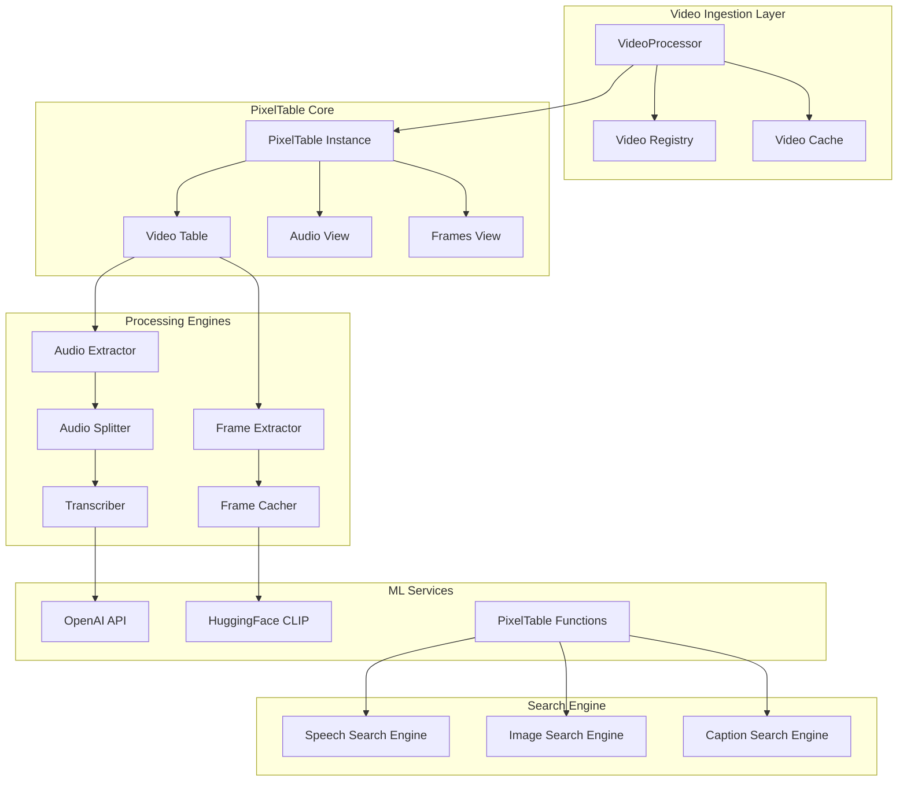
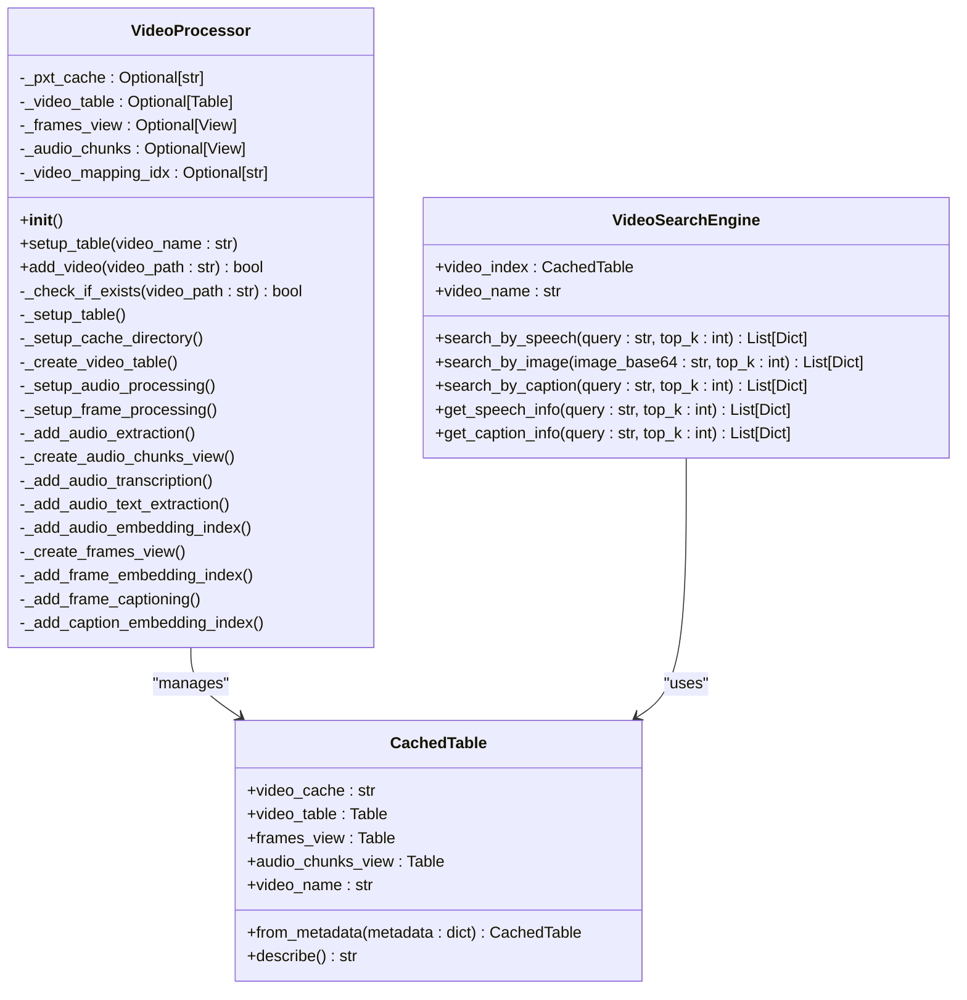
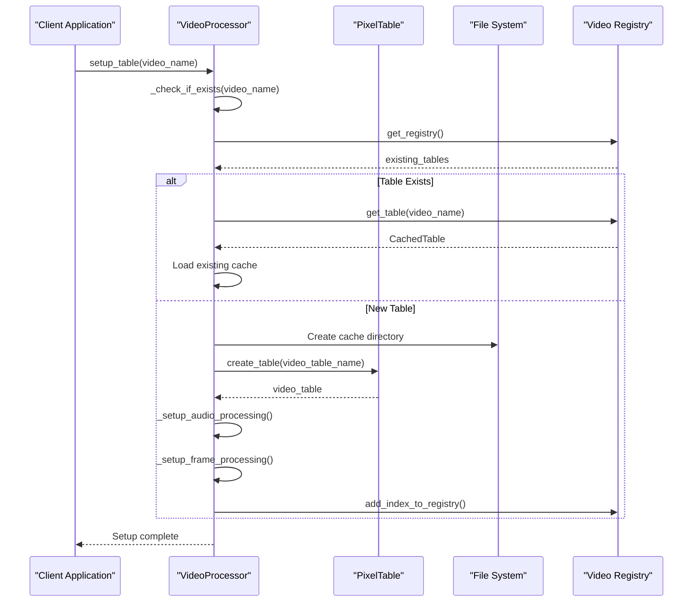
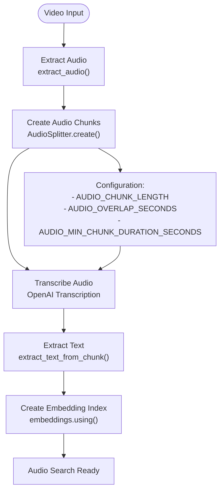
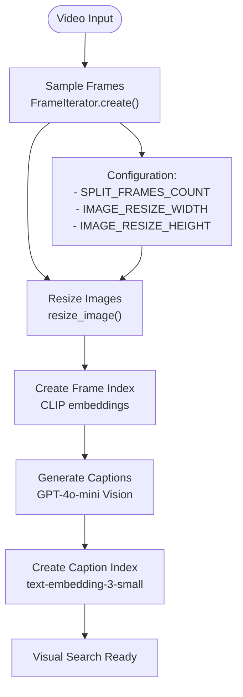
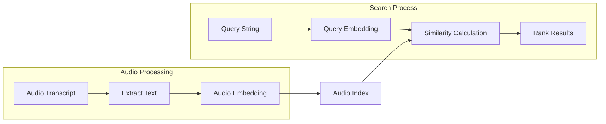
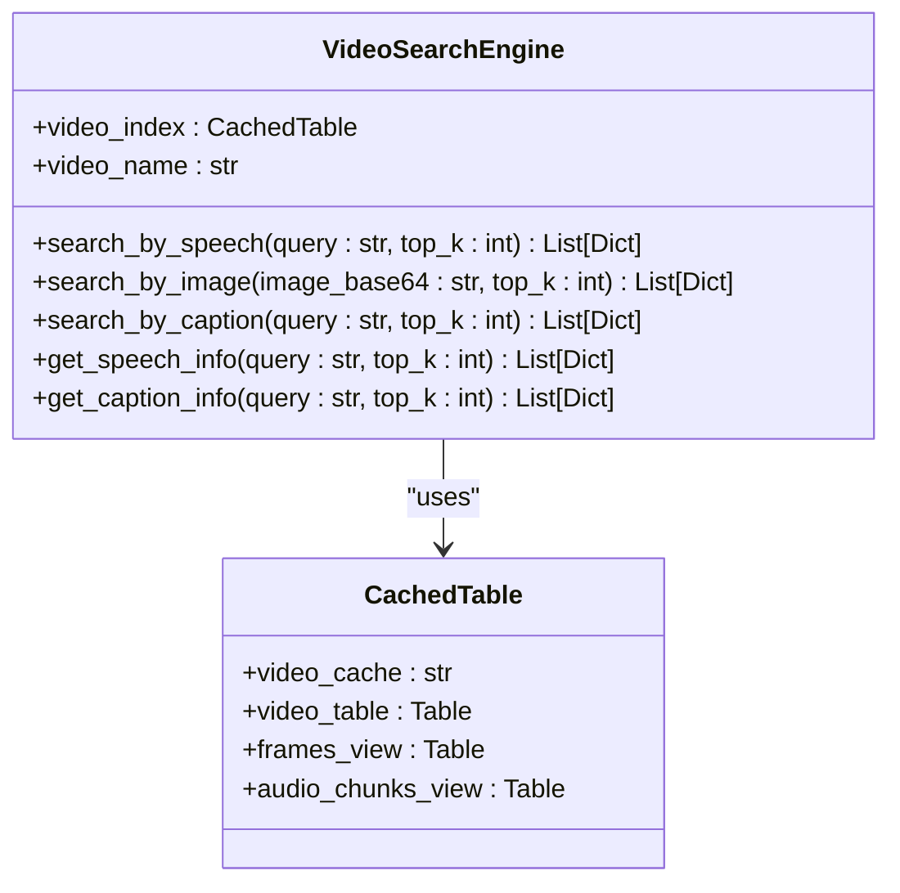
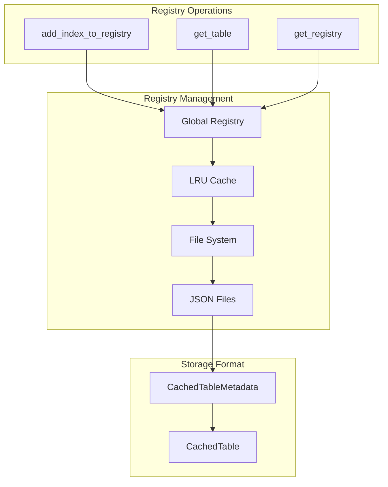
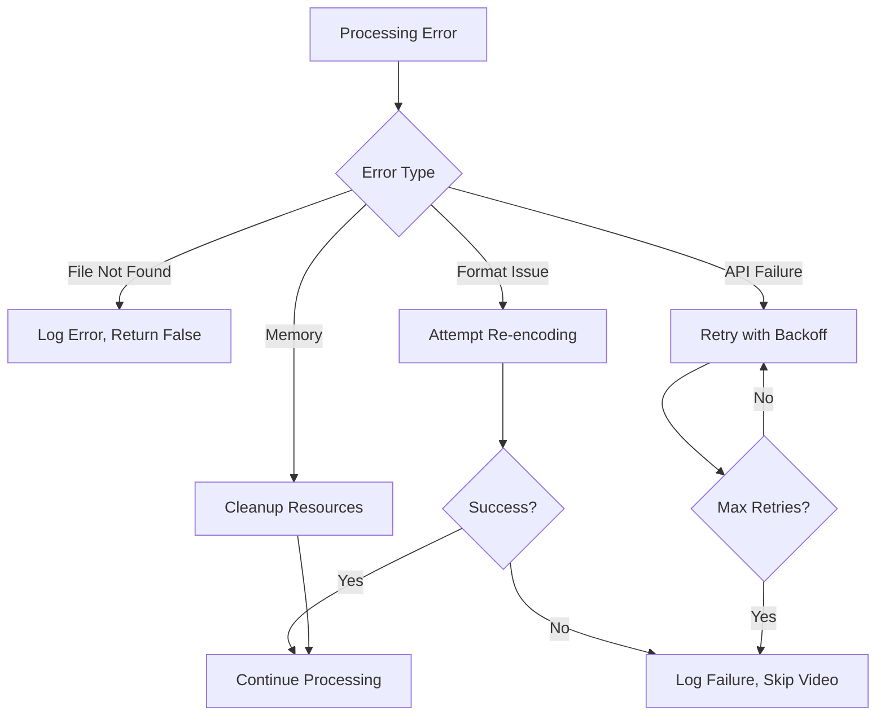

# Video Processing Pipeline

<cite>
**Referenced Files in This Document**
- [video_processor.py](file://vaas-mcp/src/vaas_mcp/video/ingestion/video_processor.py)
- [constants.py](file://vaas-mcp/src/vaas_mcp/video/ingestion/constants.py)
- [functions.py](file://vaas-mcp/src/vaas_mcp/video/ingestion/functions.py)
- [models.py](file://vaas-mcp/src/vaas_mcp/video/ingestion/models.py)
- [tools.py](file://vaas-mcp/src/vaas_mcp/video/ingestion/tools.py)
- [registry.py](file://vaas-mcp/src/vaas_mcp/video/ingestion/registry.py)
- [video_search_engine.py](file://vaas-mcp/src/vaas_mcp/video/video_search_engine.py)
- [config.py](file://vaas-mcp/src/vaas_mcp/config.py)
- [server.py](file://vaas-mcp/src/vaas_mcp/server.py)
- [tools.py](file://vaas-mcp/src/vaas_mcp/tools.py)
- [video_ingestion_process.ipynb](file://vaas-mcp/notebooks/video_ingestion_process.ipynb)
</cite>

## Table of Contents
1. [Introduction](#introduction)
2. [System Architecture](#system-architecture)
3. [Core Components](#core-components)
4. [Video Processing Pipeline](#video-processing-pipeline)
5. [Configuration Parameters](#configuration-parameters)
6. [Embedding Indexes and Semantic Search](#embedding-indexes-and-semantic-search)
7. [Registry System](#registry-system)
8. [Performance Considerations](#performance-considerations)
9. [Error Handling](#error-handling)
10. [Code Examples](#code-examples)
11. [Troubleshooting Guide](#troubleshooting-guide)
12. [Conclusion](#conclusion)

## Introduction

The Video Processing Pipeline is a sophisticated system designed to transform raw video files into searchable multimedia content through advanced computer vision and natural language processing techniques. Built on top of PixelTable, this pipeline enables semantic search across video content by extracting and indexing audio transcripts, visual frames, and their associated metadata.

The pipeline operates through a multi-stage process that begins with video ingestion, continues through audio extraction and transcription, frame sampling and captioning, and culminates in the creation of multiple embedding indexes for efficient similarity search. This comprehensive approach allows users to search for video content using natural language queries, visual references, or specific audio segments.

## System Architecture

The Video Processing Pipeline follows a modular architecture with clear separation of concerns across different functional domains. The system is built around the VideoProcessor class as the central orchestrator, supported by specialized components for audio processing, frame extraction, and semantic search.



**Diagram sources**
- [video_processor.py](file://vaas-mcp/src/vaas_mcp/video/ingestion/video_processor.py#L1-L205)
- [registry.py](file://vaas-mcp/src/vaas_mcp/video/ingestion/registry.py#L1-L110)

## Core Components

### VideoProcessor Class

The VideoProcessor serves as the central orchestrator for the entire video processing pipeline. It manages the lifecycle of video ingestion, from initial setup through table creation to the completion of all processing stages.



**Diagram sources**
- [video_processor.py](file://vaas-mcp/src/vaas_mcp/video/ingestion/video_processor.py#L20-L205)
- [models.py](file://vaas-mcp/src/vaas_mcp/video/ingestion/models.py#L25-L119)
- [video_search_engine.py](file://vaas-mcp/src/vaas_mcp/video/video_search_engine.py#L10-L168)

**Section sources**
- [video_processor.py](file://vaas-mcp/src/vaas_mcp/video/ingestion/video_processor.py#L20-L205)
- [models.py](file://vaas-mcp/src/vaas_mcp/video/ingestion/models.py#L25-L119)

### Configuration Management

The system uses a centralized configuration approach through the Settings class, which manages all pipeline parameters including model selections, processing thresholds, and resource allocation settings.

**Section sources**
- [config.py](file://vaas-mcp/src/vaas_mcp/config.py#L1-L56)

## Video Processing Pipeline

The video processing pipeline consists of several interconnected stages that transform raw video content into searchable multimedia assets. Each stage builds upon the previous one, creating a comprehensive index of video content.

### Stage 1: Video Initialization and Cache Setup

The pipeline begins with the initialization of the VideoProcessor and the setup of the PixelTable cache infrastructure. This stage ensures that all necessary directories and database structures are prepared for subsequent processing.



**Diagram sources**
- [video_processor.py](file://vaas-mcp/src/vaas_mcp/video/ingestion/video_processor.py#L35-L70)
- [registry.py](file://vaas-mcp/src/vaas_mcp/video/ingestion/registry.py#L20-L110)

### Stage 2: Audio Processing Pipeline

The audio processing pipeline extracts audio from the video, splits it into manageable chunks, transcribes the content, and creates semantic embeddings for efficient search.



**Diagram sources**
- [video_processor.py](file://vaas-mcp/src/vaas_mcp/video/ingestion/video_processor.py#L85-L120)
- [functions.py](file://vaas-mcp/src/vaas_mcp/video/ingestion/functions.py#L1-L25)

### Stage 3: Frame Processing Pipeline

The frame processing pipeline samples video frames at configurable intervals, resizes them for optimal processing, generates captions using vision-language models, and creates visual embeddings for similarity search.



**Diagram sources**
- [video_processor.py](file://vaas-mcp/src/vaas_mcp/video/ingestion/video_processor.py#L122-L170)
- [functions.py](file://vaas-mcp/src/vaas_mcp/video/ingestion/functions.py#L15-L25)

**Section sources**
- [video_processor.py](file://vaas-mcp/src/vaas_mcp/video/ingestion/video_processor.py#L85-L170)

### Stage 4: Video Addition and Processing

The final stage involves adding the video to the processed table and triggering the complete processing pipeline. This stage handles video re-encoding for compatibility and ensures all computed columns are populated.

**Section sources**
- [video_processor.py](file://vaas-mcp/src/vaas_mcp/video/ingestion/video_processor.py#L172-L205)

## Configuration Parameters

The Video Processing Pipeline relies on numerous configuration parameters that control various aspects of the processing workflow. These parameters are managed through the Settings class and influence everything from processing quality to performance characteristics.

### Audio Processing Configuration

- **AUDIO_CHUNK_LENGTH**: Duration of audio chunks in seconds (default: 10)
- **AUDIO_OVERLAP_SECONDS**: Overlap between consecutive audio chunks (default: 1)
- **AUDIO_MIN_CHUNK_DURATION_SECONDS**: Minimum duration for audio chunks (default: 1)
- **AUDIO_TRANSCRIPT_MODEL**: OpenAI model for audio transcription (default: "gpt-4o-mini-transcribe")

### Frame Processing Configuration

- **SPLIT_FRAMES_COUNT**: Number of frames to sample from the video (default: 45)
- **IMAGE_RESIZE_WIDTH**: Target width for resized images (default: 1024)
- **IMAGE_RESIZE_HEIGHT**: Target height for resized images (default: 768)

### Embedding Model Configuration

- **TRANSCRIPT_SIMILARITY_EMBD_MODEL**: Model for audio transcript embeddings (default: "text-embedding-3-small")
- **IMAGE_SIMILARITY_EMBD_MODEL**: Model for image embeddings (default: "openai/clip-vit-base-patch32")
- **CAPTION_SIMILARITY_EMBD_MODEL**: Model for caption embeddings (default: "text-embedding-3-small")

### Search Configuration

- **DELTA_SECONDS_FRAME_INTERVAL**: Time interval for frame-based search (default: 5.0)
- **CAPTION_MODEL_PROMPT**: Prompt for image captioning (default: "Describe what is happening in the image")

**Section sources**
- [config.py](file://vaas-mcp/src/vaas_mcp/config.py#L1-L56)

## Embedding Indexes and Semantic Search

The pipeline creates multiple embedding indexes that enable efficient semantic search across different modalities of video content. These indexes leverage state-of-the-art machine learning models to create dense vector representations that capture semantic meaning.

### Audio Embedding Index

The audio embedding index converts transcribed text into dense vectors using OpenAI's text embedding models. This enables semantic search across spoken content, allowing users to find video segments based on content rather than exact word matches.



**Diagram sources**
- [video_processor.py](file://vaas-mcp/src/vaas_mcp/video/ingestion/video_processor.py#L95-L110)

### Visual Embedding Index

The visual embedding index uses CLIP (Contrastive Language-Image Pre-training) to create embeddings from both raw video frames and generated captions. This dual approach enables search by visual content or textual descriptions of visual content.

**Section sources**
- [video_processor.py](file://vaas-mcp/src/vaas_mcp/video/ingestion/video_processor.py#L122-L170)

### Search Engine Implementation

The VideoSearchEngine provides unified access to all embedding indexes, offering multiple search modalities through a consistent interface.



**Diagram sources**
- [video_search_engine.py](file://vaas-mcp/src/vaas_mcp/video/video_search_engine.py#L10-L168)

**Section sources**
- [video_search_engine.py](file://vaas-mcp/src/vaas_mcp/video/video_search_engine.py#L10-L168)

## Registry System

The registry system manages the persistence and retrieval of processed video indices, enabling efficient lookup and reuse of previously processed videos without requiring reprocessing.

### Registry Architecture



**Diagram sources**
- [registry.py](file://vaas-mcp/src/vaas_mcp/video/ingestion/registry.py#L20-L110)
- [models.py](file://vaas-mcp/src/vaas_mcp/video/ingestion/models.py#L10-L25)

### Cache Management

The registry system maintains a persistent cache of processed video metadata, enabling quick lookup and avoiding redundant processing of the same video content.

**Section sources**
- [registry.py](file://vaas-mcp/src/vaas_mcp/video/ingestion/registry.py#L20-L110)
- [models.py](file://vaas-mcp/src/vaas_mcp/video/ingestion/models.py#L10-L119)

## Performance Considerations

The Video Processing Pipeline is designed with several performance optimizations to handle large-scale video processing efficiently while minimizing computational overhead.

### Caching Strategies

- **LRU Cache**: Registry operations use LRU caching to minimize file system access
- **Computed Columns**: PixelTable's computed columns eliminate redundant storage and computation
- **Incremental Processing**: Existing videos are skipped to avoid reprocessing

### Resource Optimization

- **Frame Sampling**: Configurable frame count limits processing time
- **Audio Chunking**: Adjustable chunk sizes balance quality vs. processing speed
- **Model Selection**: Choice of embedding models balances accuracy and performance

### Memory Management

- **Streaming Processing**: Large videos are processed in chunks rather than loaded entirely into memory
- **Lazy Evaluation**: Computed columns are evaluated on-demand rather than pre-computed
- **Garbage Collection**: Automatic cleanup of temporary processing artifacts

## Error Handling

The pipeline implements comprehensive error handling to manage various failure scenarios gracefully and provide meaningful feedback to users.

### Video Processing Errors

- **Missing Video Files**: Validation checks prevent processing of non-existent files
- **Format Compatibility**: Automatic re-encoding handles incompatible video formats
- **Resource Exhaustion**: Graceful degradation when memory or storage is insufficient

### Processing Failures

- **Model API Errors**: Retry mechanisms for transient OpenAI API failures
- **Computational Errors**: Fallback processing paths for unsupported video codecs
- **Index Creation Failures**: Alternative embedding models when primary models fail

### Recovery Mechanisms



**Section sources**
- [tools.py](file://vaas-mcp/src/vaas_mcp/video/ingestion/tools.py#L100-L155)

## Code Examples

### Basic Video Processing Workflow

```python
from vaas_mcp.video.ingestion.video_processor import VideoProcessor

# Initialize processor
processor = VideoProcessor()

# Setup table and process video
video_path = "/path/to/video.mp4"
processor.setup_table(video_name=video_path)
processor.add_video(video_path=video_path)
```

### Audio Search Example

```python
from vaas_mcp.video.video_search_engine import VideoSearchEngine

# Search by speech content
search_engine = VideoSearchEngine(video_path)
results = search_engine.search_by_speech(
    query="find scenes with laughter",
    top_k=5
)

# Extract video clips
for result in results:
    clip = extract_video_clip(
        video_path=video_path,
        start_time=result["start_time"],
        end_time=result["end_time"]
    )
```

### Visual Search Example

```python
from vaas_mcp.video.video_search_engine import VideoSearchEngine
from vaas_mcp.video.ingestion.tools import decode_image

# Search by visual similarity
search_engine = VideoSearchEngine(video_path)
image_base64 = encode_image(query_image)
results = search_engine.search_by_image(
    image_base64=image_base64,
    top_k=3
)
```

### Caption-Based Search

```python
from vaas_mcp.video.video_search_engine import VideoSearchEngine

# Search by caption content
search_engine = VideoSearchEngine(video_path)
captions = search_engine.get_caption_info(
    query="describe the robot character",
    top_k=10
)

# Combine captions for context
context = "\n".join([cap["caption"] for cap in captions])
```

**Section sources**
- [video_processor.py](file://vaas-mcp/src/vaas_mcp/video/ingestion/video_processor.py#L172-L205)
- [video_search_engine.py](file://vaas-mcp/src/vaas_mcp/video/video_search_engine.py#L25-L168)

## Troubleshooting Guide

### Common Issues and Solutions

#### Video Processing Failures

**Problem**: Video fails to process with format errors
**Solution**: The system automatically attempts re-encoding using FFmpeg. Check logs for re-encoding attempts and verify FFmpeg installation.

**Problem**: OpenAI API quota exceeded
**Solution**: Monitor API usage and consider upgrading your OpenAI plan. Implement rate limiting in your application.

#### Performance Issues

**Problem**: Slow processing for large videos
**Solution**: Adjust `SPLIT_FRAMES_COUNT` and `AUDIO_CHUNK_LENGTH` parameters to balance quality and speed.

**Problem**: Memory exhaustion during processing
**Solution**: Reduce batch sizes and increase chunk durations to lower memory usage.

#### Search Quality Issues

**Problem**: Poor search results for audio content
**Solution**: Verify audio quality and consider adjusting transcription model settings.

**Problem**: Inaccurate visual search results
**Solution**: Ensure adequate frame sampling and consider using higher-resolution images.

### Debugging Tools

```python
# Check processed video status
cached_table = registry.get_table(video_path)
print(cached_table.describe())

# Verify embedding indexes
audio_index_exists = "chunks_index" in audio_view.embedding_indexes
frame_index_exists = "frame_index" in frames_view.embedding_indexes

# Monitor processing progress
logger.info(f"Processing video: {video_path}")
logger.info(f"Audio chunks: {len(audio_view)}")
logger.info(f"Frames: {len(frames_view)}")
```

**Section sources**
- [registry.py](file://vaas-mcp/src/vaas_mcp/video/ingestion/registry.py#L90-L110)
- [video_processor.py](file://vaas-mcp/src/vaas_mcp/video/ingestion/video_processor.py#L35-L70)

## Conclusion

The Video Processing Pipeline represents a sophisticated approach to transforming raw video content into searchable multimedia assets. By leveraging modern machine learning models and efficient database technologies, the system enables powerful semantic search capabilities across multiple modalities of video content.

Key strengths of the pipeline include:

- **Modular Design**: Clear separation of concerns enables easy maintenance and extension
- **Efficient Processing**: Optimized algorithms and caching strategies minimize computational overhead
- **Flexible Configuration**: Comprehensive parameter system allows customization for different use cases
- **Robust Error Handling**: Graceful degradation and recovery mechanisms ensure reliable operation
- **Scalable Architecture**: Registry system enables efficient management of large collections of processed videos

The pipeline's integration with PixelTable provides a solid foundation for future enhancements, including support for additional media types, improved processing algorithms, and expanded search capabilities. As the underlying ML models continue to evolve, the system is well-positioned to incorporate new capabilities while maintaining backward compatibility.

Future development opportunities include enhanced real-time processing capabilities, distributed processing for large-scale deployments, and integration with additional multimodal AI services to expand the range of searchable content types.