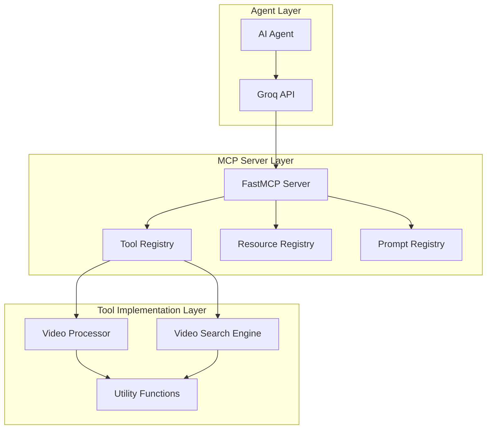
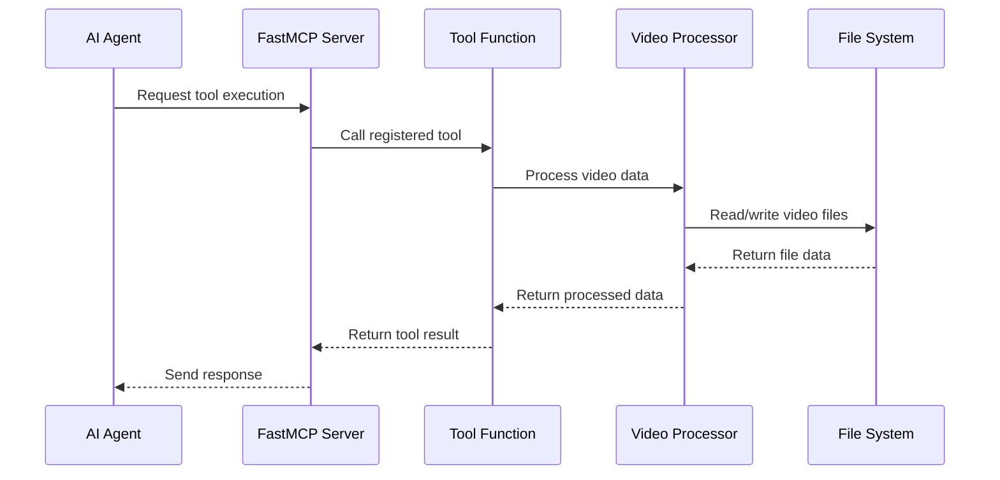

# Adding MCP Tools

<cite>
**Referenced Files in This Document**
- [server.py](file://vaas-mcp/src/vaas_mcp/server.py)
- [tools.py](file://vaas-mcp/src/vaas_mcp/tools.py)
- [video_ingestion_tools.py](file://vaas-mcp/src/vaas_mcp/video/ingestion/tools.py)
- [video_ingestion_models.py](file://vaas-mcp/src/vaas_mcp/video/ingestion/models.py)
- [video_ingestion_functions.py](file://vaas-mcp/src/vaas_mcp/video/ingestion/functions.py)
- [opik_utils.py](file://vaas-mcp/src/vaas_mcp/opik_utils.py)
- [config.py](file://vaas-mcp/src/vaas_mcp/config.py)
- [Dockerfile](file://vaas-mcp/Dockerfile)
- [1_tool_use_playground.ipynb](file://vaas-api/notebooks/1_tool_use_playground.ipynb)
- [video_ingestion_process.ipynb](file://vaas-mcp/notebooks/video_ingestion_process.ipynb)
</cite>

## Table of Contents
1. [Introduction](#introduction)
2. [Understanding the MCP Framework](#understanding-the-mcp-framework)
3. [Tool Registration System](#tool-registration-system)
4. [Creating New Tools](#creating-new-tools)
5. [Step-by-Step Example: Video Analysis Tool](#step-by-step-example-video-analysis-tool)
6. [Best Practices](#best-practices)
7. [Testing and Monitoring](#testing-and-monitoring)
8. [Common Issues and Solutions](#common-issues-and-solutions)
9. [Integration with FastMCP Server](#integration-with-fastmcp-server)
10. [Conclusion](#conclusion)

## Introduction

The vaas-MCP server provides a powerful framework for adding new tools that extend the capabilities of multimodal agents. This documentation covers how to implement and register new MCP tools using the `@add_tool` decorator system, focusing on video analysis capabilities as a primary example.

MCP (Model Context Protocol) enables seamless integration between AI agents and specialized tools, allowing agents to perform complex operations like video processing, analysis, and manipulation. The vaas-MCP server builds upon this foundation to provide sophisticated video processing capabilities.

## Understanding the MCP Framework

The Model Context Protocol (MCP) is designed to enable communication between AI agents and external tools. In the vaas-MCP implementation, tools are registered with the FastMCP server and become available to agents through tool orchestration.



**Diagram sources**
- [server.py](file://vaas-mcp/src/vaas_mcp/server.py#L1-L97)
- [tools.py](file://vaas-mcp/src/vaas_mcp/tools.py#L1-L105)

## Tool Registration System

The vaas-MCP server uses a centralized tool registration system that integrates with the FastMCP framework. Tools are registered using the `add_tool` method, which requires specific parameters for proper integration.

### Core Registration Pattern

```python
def add_mcp_tools(mcp: FastMCP):
    mcp.add_tool(
        name="tool_name",
        description="Clear description of what the tool does",
        fn=tool_function,
        tags={"category1", "category2"}
    )
```

### Available Tool Categories

The system supports several categories of tools:

- **Video Processing**: Tools that handle video ingestion, processing, and preparation
- **Video Search**: Tools that search video content using various modalities
- **Resource Management**: Tools that manage video indices and metadata
- **Prompt Management**: Tools that provide system prompts for different contexts

**Section sources**
- [server.py](file://vaas-mcp/src/vaas_mcp/server.py#L13-L40)

## Creating New Tools

### Basic Tool Structure

New tools should follow a consistent structure that includes proper error handling, input validation, and logging. Here's the basic template:

```python
from typing import Dict
from loguru import logger
from vaas_mcp.config import get_settings
from vaas_mcp.video.ingestion.video_processor import VideoProcessor

logger = logger.bind(name="CustomTool")
video_processor = VideoProcessor()
settings = get_settings()

def custom_tool_function(input_param: str, optional_param: int = 5) -> str:
    """Tool description with clear parameter documentation.
    
    Args:
        input_param (str): Description of the input parameter
        optional_param (int): Description of the optional parameter
        
    Returns:
        str: Description of the return value
        
    Raises:
        ValueError: When input validation fails
        RuntimeError: When tool execution encounters errors
    """
    # Tool implementation
    pass
```

### Input Validation with Pydantic Models

For complex inputs, use Pydantic models to ensure type safety and validation:

```python
from pydantic import BaseModel, Field, field_validator
from typing import List, Optional

class VideoAnalysisInput(BaseModel):
    video_path: str = Field(..., description="Path to the video file")
    start_time: float = Field(..., ge=0, description="Start time in seconds")
    end_time: float = Field(..., gt=0, description="End time in seconds")
    frame_interval: Optional[float] = Field(default=5.0, gt=0, le=60, 
                                          description="Frame extraction interval")
    
    @field_validator('end_time')
    def validate_times(cls, v, values):
        if 'start_time' in values and v <= values['start_time']:
            raise ValueError('end_time must be greater than start_time')
        return v
```

## Step-by-Step Example: Video Analysis Tool

Let's implement a new video analysis tool that extracts key scenes using frame analysis. This tool will demonstrate best practices for tool development.

### Step 1: Define the Tool Function

```python
from typing import Dict, List, Tuple
from pathlib import Path
from PIL import Image
import numpy as np
from loguru import logger

from vaas_mcp.video.ingestion.tools import extract_video_clip
from vaas_mcp.video.ingestion.models import Base64Image

def extract_key_scenes(video_path: str, threshold: float = 0.8, min_scene_length: int = 5) -> Dict[str, List[Dict]]:
    """Extract key scenes from a video using frame analysis.
    
    Args:
        video_path (str): Path to the video file
        threshold (float): Scene change detection threshold (0.0-1.0)
        min_scene_length (int): Minimum scene length in seconds
        
    Returns:
        Dict[str, List[Dict]]: Dictionary containing key scenes with metadata
        
    Raises:
        ValueError: If video file doesn't exist or is invalid
        RuntimeError: If scene detection fails
    """
    video_path_obj = Path(video_path)
    if not video_path_obj.exists():
        raise ValueError(f"Video file not found: {video_path}")
    
    if not video_path_obj.suffix.lower() in ['.mp4', '.avi', '.mov', '.mkv']:
        raise ValueError(f"Unsupported video format: {video_path_obj.suffix}")
    
    # Initialize scene detection
    scenes = detect_key_scenes(video_path, threshold, min_scene_length)
    
    # Extract video clips for each key scene
    key_scene_clips = []
    for i, scene in enumerate(scenes):
        try:
            clip = extract_video_clip(
                video_path=video_path,
                start_time=scene['start_time'],
                end_time=scene['end_time'],
                output_path=f"./shared_media/key_scene_{i}_{Path(video_path).stem}.mp4"
            )
            
            key_scene_clips.append({
                'index': i,
                'start_time': scene['start_time'],
                'end_time': scene['end_time'],
                'duration': scene['end_time'] - scene['start_time'],
                'filename': clip.filename,
                'summary': scene['summary']
            })
        except Exception as e:
            logger.error(f"Failed to extract clip {i}: {e}")
            continue
    
    return {
        'total_scenes': len(key_scene_clips),
        'scenes': key_scene_clips,
        'status': 'success'
    }
```

### Step 2: Implement Scene Detection Logic

```python
def detect_key_scenes(video_path: str, threshold: float, min_scene_length: int) -> List[Dict]:
    """Detect key scenes in a video using frame analysis.
    
    Args:
        video_path (str): Path to the video file
        threshold (float): Scene change detection threshold
        min_scene_length (int): Minimum scene length in seconds
        
    Returns:
        List[Dict]: List of detected scenes with metadata
    """
    import cv2
    import numpy as np
    
    cap = cv2.VideoCapture(video_path)
    if not cap.isOpened():
        raise RuntimeError(f"Could not open video: {video_path}")
    
    frame_count = 0
    prev_frame = None
    scenes = []
    current_scene_start = 0
    current_scene_summary = ""
    
    while True:
        ret, frame = cap.read()
        if not ret:
            break
            
        # Convert frame to grayscale for comparison
        gray_frame = cv2.cvtColor(frame, cv2.COLOR_BGR2GRAY)
        
        if prev_frame is not None:
            # Calculate frame difference
            diff = cv2.absdiff(prev_frame, gray_frame)
            _, diff_mask = cv2.threshold(diff, 25, 255, cv2.THRESH_BINARY)
            change_ratio = np.sum(diff_mask > 0) / (diff_mask.shape[0] * diff_mask.shape[1])
            
            # Check for significant scene change
            if change_ratio > threshold:
                # End current scene
                current_scene_end = frame_count / cap.get(cv2.CAP_PROP_FPS)
                
                # Only keep scenes that meet minimum length
                if (current_scene_end - current_scene_start) >= min_scene_length:
                    scenes.append({
                        'start_time': current_scene_start,
                        'end_time': current_scene_end,
                        'summary': current_scene_summary,
                        'change_ratio': change_ratio
                    })
                
                # Start new scene
                current_scene_start = current_scene_end
                current_scene_summary = f"Scene change detected at {current_scene_start:.2f}s"
        
        prev_frame = gray_frame
        frame_count += 1
    
    cap.release()
    
    # Add the final scene
    final_time = frame_count / cap.get(cv2.CAP_PROP_FPS)
    if final_time - current_scene_start >= min_scene_length:
        scenes.append({
            'start_time': current_scene_start,
            'end_time': final_time,
            'summary': current_scene_summary,
            'change_ratio': 0.0
        })
    
    return scenes
```

### Step 3: Register the Tool

```python
# In server.py
from vaas_mcp.tools import extract_key_scenes

def add_mcp_tools(mcp: FastMCP):
    # Existing tools...
    
    mcp.add_tool(
        name="extract_key_scenes",
        description="Extract key scenes from a video using frame analysis and scene change detection.",
        fn=extract_key_scenes,
        tags={"video", "analysis", "scene", "processing"}
    )
```

### Step 4: Add Type Validation

```python
from pydantic import BaseModel, Field, validator
from typing import List, Dict, Optional

class KeySceneOutput(BaseModel):
    total_scenes: int = Field(..., description="Total number of key scenes detected")
    scenes: List[Dict] = Field(..., description="List of key scenes with metadata")
    status: str = Field(..., description="Operation status")
    
    @validator('scenes')
    def validate_scenes(cls, v):
        for scene in v:
            if not isinstance(scene, dict):
                raise ValueError("Each scene must be a dictionary")
            required_fields = ['index', 'start_time', 'end_time', 'duration', 'filename']
            for field in required_fields:
                if field not in scene:
                    raise ValueError(f"Missing required field: {field}")
        return v
```

**Section sources**
- [tools.py](file://vaas-mcp/src/vaas_mcp/tools.py#L1-L105)
- [video_ingestion_tools.py](file://vaas-mcp/src/vaas_mcp/video/ingestion/tools.py#L1-L155)

## Best Practices

### Idempotency

Ensure tools are idempotent whenever possible. This means that calling the same tool with the same parameters multiple times should produce the same results without side effects.

```python
def idempotent_tool(input_data: str) -> str:
    """Example of an idempotent tool.
    
    This tool generates a hash of the input data, which is deterministic
    and produces the same output for the same input.
    """
    import hashlib
    return hashlib.sha256(input_data.encode()).hexdigest()
```

### Robust Error Handling

Implement comprehensive error handling with meaningful error messages:

```python
def robust_tool(video_path: str, options: Dict) -> Dict:
    """Tool with comprehensive error handling."""
    try:
        # Validate input
        if not video_path or not isinstance(video_path, str):
            raise ValueError("Invalid video path")
        
        # Check file existence
        video_path_obj = Path(video_path)
        if not video_path_obj.exists():
            raise FileNotFoundError(f"Video file not found: {video_path}")
        
        # Validate options
        if not isinstance(options, dict):
            raise ValueError("Options must be a dictionary")
        
        # Tool implementation with specific error handling
        try:
            result = perform_video_analysis(video_path, options)
            return {"status": "success", "result": result}
        except TimeoutError:
            raise RuntimeError("Video processing timed out")
        except MemoryError:
            raise RuntimeError("Insufficient memory for video processing")
        except Exception as e:
            raise RuntimeError(f"Unexpected error during processing: {str(e)}")
            
    except ValueError as ve:
        logger.error(f"Input validation error: {ve}")
        return {"status": "error", "message": str(ve)}
    except FileNotFoundError as fnf:
        logger.error(f"File not found: {fnf}")
        return {"status": "error", "message": str(fnf)}
    except Exception as e:
        logger.error(f"Unexpected error: {e}")
        return {"status": "error", "message": "Internal processing error"}
```

### Input Validation with Pydantic

Use Pydantic models for complex input validation:

```python
from pydantic import BaseModel, Field, validator
from typing import List, Optional

class VideoProcessingOptions(BaseModel):
    resolution: str = Field(default="1080p", 
                          description="Output resolution")
    format: str = Field(default="mp4", 
                       description="Output format")
    quality: int = Field(default=85, ge=1, le=100,
                        description="Quality percentage")
    
    @validator('resolution')
    def validate_resolution(cls, v):
        valid_resolutions = ['480p', '720p', '1080p', '4k']
        if v not in valid_resolutions:
            raise ValueError(f"Invalid resolution. Must be one of: {valid_resolutions}")
        return v

class VideoAnalysisInput(BaseModel):
    video_path: str = Field(..., description="Path to the video file")
    options: Optional[VideoProcessingOptions] = Field(default=None,
                                                     description="Processing options")
    filters: Optional[List[str]] = Field(default_factory=list,
                                       description="List of filters to apply")
    
    @validator('video_path')
    def validate_video_path(cls, v):
        path_obj = Path(v)
        if not path_obj.exists():
            raise ValueError(f"Video file not found: {v}")
        if not path_obj.suffix.lower() in ['.mp4', '.avi', '.mov', '.mkv']:
            raise ValueError(f"Unsupported video format: {path_obj.suffix}")
        return v
```

### Logging and Monitoring

Implement comprehensive logging for debugging and monitoring:

```python
import time
from loguru import logger

def monitored_tool(video_path: str, **kwargs) -> Dict:
    """Tool with comprehensive logging and monitoring."""
    start_time = time.time()
    logger.info(f"Starting tool execution for video: {video_path}")
    
    try:
        # Log parameters
        logger.debug(f"Tool parameters: {kwargs}")
        
        # Perform operation
        result = perform_operation(video_path, **kwargs)
        
        # Log success metrics
        execution_time = time.time() - start_time
        logger.info(f"Tool executed successfully in {execution_time:.2f}s")
        
        return {
            'status': 'success',
            'execution_time': execution_time,
            'result': result
        }
        
    except Exception as e:
        execution_time = time.time() - start_time
        logger.error(f"Tool failed after {execution_time:.2f}s: {e}")
        return {
            'status': 'error',
            'execution_time': execution_time,
            'message': str(e)
        }
```

## Testing and Monitoring

### Using Notebook Playgrounds

The vaas-MCP system provides Jupyter notebook playgrounds for testing tools:

```python
# From 1_tool_use_playground.ipynb
from fastmcp.client import Client

# Connect to MCP server
mcp_client = Client("http://127.0.0.1:9090/mcp")

async with mcp_client:
    # List available tools
    mcp_tools = await mcp_client.list_tools()
    
    # Call a specific tool
    inputs = {
        "video_path": "./videos/test_video.mp4",
        "threshold": 0.8,
        "min_scene_length": 5
    }
    
    result = await mcp_client.call_tool("extract_key_scenes", inputs)
    print(result)
```

### Integration with Opik Monitoring

The system integrates with Opik for monitoring tool execution:

```python
# From opik_utils.py
from vaas_mcp.opik_utils import configure

# Configure Opik monitoring
configure()

# Tools automatically get monitored through the logging system
```

### Testing Strategies

1. **Unit Testing**: Test individual tool functions with various inputs
2. **Integration Testing**: Test tool registration and execution through the MCP server
3. **End-to-End Testing**: Test complete workflows with real video files
4. **Performance Testing**: Measure execution time and resource usage

```python
import pytest
from unittest.mock import patch, MagicMock

def test_extract_key_scenes_valid_input():
    """Test tool with valid input."""
    with patch('cv2.VideoCapture') as mock_cap:
        # Setup mock video capture
        mock_cap.return_value.isOpened.return_value = True
        mock_cap.return_value.get.return_value = 30.0  # 30 FPS
        
        # Mock frame reading
        mock_frame = MagicMock()
        mock_frame.shape = (1080, 1920, 3)
        
        # Test tool
        result = extract_key_scenes("./test_video.mp4")
        
        assert result['status'] == 'success'
        assert result['total_scenes'] >= 0

def test_extract_key_scenes_invalid_video():
    """Test tool with invalid video path."""
    with pytest.raises(ValueError):
        extract_key_scenes("./nonexistent_video.mp4")
```

**Section sources**
- [1_tool_use_playground.ipynb](file://vaas-api/notebooks/1_tool_use_playground.ipynb#L1-L316)
- [opik_utils.py](file://vaas-mcp/src/vaas_mcp/opik_utils.py#L1-L44)

## Common Issues and Solutions

### Timeout Handling

Implement timeout mechanisms for long-running operations:

```python
import signal
from contextlib import contextmanager

@contextmanager
def timeout(seconds):
    """Context manager for setting timeouts."""
    def timeout_handler(signum, frame):
        raise TimeoutError(f"Operation timed out after {seconds} seconds")
    
    signal.signal(signal.SIGALRM, timeout_handler)
    signal.alarm(seconds)
    try:
        yield
    finally:
        signal.alarm(0)

def safe_tool_execution(video_path: str, timeout_seconds: int = 300) -> Dict:
    """Tool execution with timeout protection."""
    try:
        with timeout(timeout_seconds):
            return extract_key_scenes(video_path)
    except TimeoutError:
        logger.error(f"Tool execution timed out for: {video_path}")
        return {"status": "error", "message": "Operation timed out"}
    except Exception as e:
        logger.error(f"Tool execution failed: {e}")
        return {"status": "error", "message": str(e)}
```

### Large Payload Management

Handle large video files efficiently:

```python
def efficient_video_processing(video_path: str, chunk_size_mb: int = 100) -> Dict:
    """Process large videos in chunks to manage memory usage."""
    video_size = Path(video_path).stat().st_size / (1024 * 1024)  # MB
    
    if video_size > chunk_size_mb:
        logger.warning(f"Large video detected: {video_size:.2f}MB")
        # Implement chunked processing
        return process_in_chunks(video_path, chunk_size_mb)
    else:
        return extract_key_scenes(video_path)

def process_in_chunks(video_path: str, chunk_size_mb: int) -> Dict:
    """Process video in manageable chunks."""
    # Implementation for chunked processing
    pass
```

### Dependency Isolation in Docker

Ensure proper dependency management in Docker containers:

```dockerfile
# FROM Dockerfile
FROM python:3.12-slim

# Install system dependencies
RUN apt-get update && \
    apt-get install -y ffmpeg && \
    apt-get clean && \
    rm -rf /var/lib/apt/lists/*

# Install Python dependencies
COPY . /app
WORKDIR /app
RUN pip install --no-cache-dir -r requirements.txt

# Set environment variables
ENV PYTHONPATH=/app/src
ENV OPIK_API_KEY=${OPIK_API_KEY}
ENV OPIK_PROJECT=${OPIK_PROJECT}

# Run the server
CMD ["python", "src/vaas_mcp/server.py"]
```

### Memory Management

Monitor and manage memory usage:

```python
import psutil
import gc

def memory_efficient_tool(video_path: str) -> Dict:
    """Tool with memory monitoring and cleanup."""
    initial_memory = psutil.Process().memory_info().rss / 1024 / 1024  # MB
    
    try:
        # Perform operation
        result = extract_key_scenes(video_path)
        
        # Force garbage collection
        gc.collect()
        
        final_memory = psutil.Process().memory_info().rss / 1024 / 1024  # MB
        memory_used = final_memory - initial_memory
        
        logger.info(f"Memory used: {memory_used:.2f}MB")
        
        return {
            'status': 'success',
            'memory_used': memory_used,
            'result': result
        }
        
    except Exception as e:
        logger.error(f"Tool failed: {e}")
        return {'status': 'error', 'message': str(e)}
```

**Section sources**
- [Dockerfile](file://vaas-mcp/Dockerfile#L1-L20)
- [config.py](file://vaas-mcp/src/vaas_mcp/config.py#L1-L56)

## Integration with FastMCP Server

### Server Architecture

The FastMCP server provides the infrastructure for tool registration and execution:



**Diagram sources**
- [server.py](file://vaas-mcp/src/vaas_mcp/server.py#L13-L40)
- [tools.py](file://vaas-mcp/src/vaas_mcp/tools.py#L1-L105)

### Tool Orchestration

Tools integrate with the agent through the tool orchestration system:

```python
# Transform MCP tools to Groq API format
def transform_tool_definition(tool: Tool) -> dict:
    """Convert MCP tool to Groq API tool format."""
    return {
        "type": "function",
        "function": {
            "name": tool.name,
            "description": tool.description,
            "parameters": transform_schema_to_parameters(tool.inputSchema),
        },
    }

# Register tools with the server
def add_mcp_tools(mcp: FastMCP):
    """Register all available tools with the MCP server."""
    # Video processing tools
    mcp.add_tool(
        name="process_video",
        description="Process a video file and prepare it for searching.",
        fn=process_video,
        tags={"video", "process"},
    )
    
    # Video analysis tools
    mcp.add_tool(
        name="extract_key_scenes",
        description="Extract key scenes from a video using frame analysis.",
        fn=extract_key_scenes,
        tags={"video", "analysis", "scene"},
    )
```

### Resource Management

The server manages resources like video indices and metadata:

```python
def add_mcp_resources(mcp: FastMCP):
    """Register resource management tools."""
    mcp.add_resource_fn(
        fn=list_tables,
        uri="file:///app/.records/records.json",
        name="list_tables",
        description="List all video indexes currently available.",
        tags={"resource", "all"},
    )
```

**Section sources**
- [server.py](file://vaas-mcp/src/vaas_mcp/server.py#L1-L97)

## Conclusion

Adding new MCP tools to the vaas-MCP server involves understanding the FastMCP framework, implementing proper tool functions with validation and error handling, and integrating them through the registration system. The key principles include:

1. **Idempotency**: Design tools to produce consistent results
2. **Robust Error Handling**: Provide meaningful error messages and graceful degradation
3. **Input Validation**: Use Pydantic models for type safety
4. **Monitoring**: Leverage Opik for execution tracking
5. **Testing**: Implement comprehensive testing strategies
6. **Performance**: Consider timeout handling and memory management

The video analysis tool example demonstrates how to implement a complex tool that leverages the existing video processing infrastructure while following best practices for tool development. By following these guidelines, developers can create powerful tools that seamlessly integrate with the vaas-MCP ecosystem and enhance the capabilities of multimodal agents.