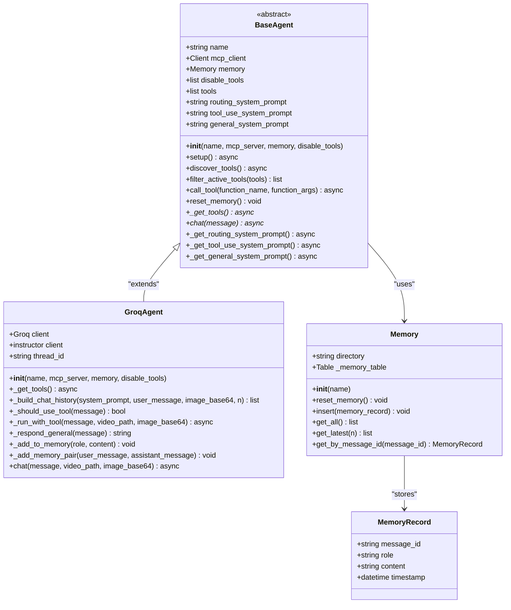
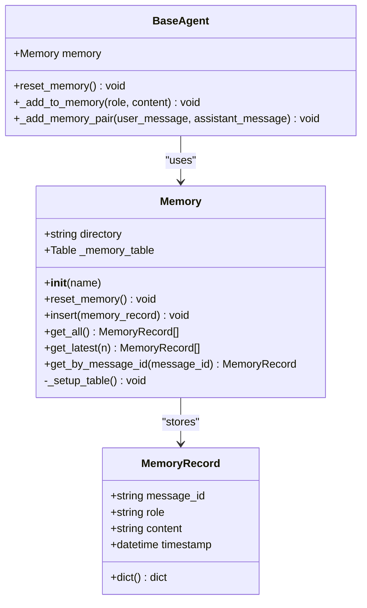
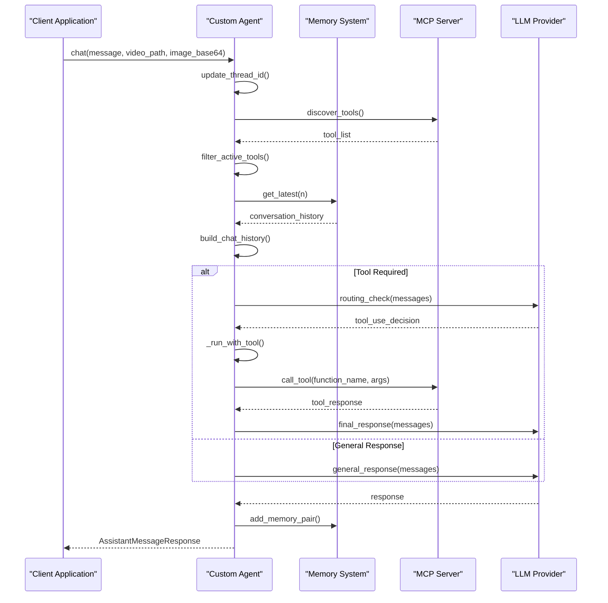

# Agent Customization and Extension Guide

<cite>
**Referenced Files in This Document**
- [base_agent.py](file://vaas-api/src/vaas_api/agent/base_agent.py)
- [groq_agent.py](file://vaas-api/src/vaas_api/agent/groq/groq_agent.py)
- [groq_tool.py](file://vaas-api/src/vaas_api/agent/groq/groq_tool.py)
- [memory.py](file://vaas-api/src/vaas_api/agent/memory.py)
- [models.py](file://vaas-api/src/vaas_api/models.py)
- [config.py](file://vaas-api/src/vaas_api/config.py)
- [opik_utils.py](file://vaas-api/src/vaas_api/opik_utils.py)
- [api.py](file://vaas-api/src/vaas_api/api.py)
- [server.py](file://vaas-mcp/src/vaas_mcp/server.py)
- [tools.py](file://vaas-mcp/src/vaas_mcp/video/ingestion/tools.py)
- [2_agent_playground.ipynb](file://vaas-api/notebooks/2_agent_playground.ipynb)
</cite>

## Table of Contents
1. [Introduction](#introduction)
2. [Base Agent Architecture](#base-agent-architecture)
3. [Extending BaseAgent for New LLM Providers](#extending-baseagent-for-new-llm-providers)
4. [Custom Agent Implementation Example](#custom-agent-implementation-example)
5. [Agent Behavior Modification](#agent-behavior-modification)
6. [Memory Management Patterns](#memory-management-patterns)
7. [Testing Strategies](#testing-strategies)
8. [Monitoring and Performance](#monitoring-and-performance)
9. [Architectural Considerations](#architectural-considerations)
10. [Best Practices](#best-practices)

## Introduction

The multimodal-agents-course system provides a flexible architecture for building intelligent agents capable of processing text, images, and video content. This guide focuses on extending the agent system to support new LLM providers and customizing agent behavior while maintaining compatibility with the existing tool ecosystem and MCP server interface.

The system is built around a modular architecture where the `BaseAgent` class serves as an abstract foundation, and specific implementations like `GroqAgent` demonstrate how to integrate with different LLM providers. This design enables developers to easily add support for new providers while leveraging the existing infrastructure for tool calling, memory management, and monitoring.

## Base Agent Architecture

The `BaseAgent` class defines the core interface that all agent implementations must follow. It establishes the contract for text generation, tool calling, and memory management while providing common functionality for MCP server communication.



**Diagram sources**
- [base_agent.py](file://vaas-api/src/vaas_api/agent/base_agent.py#L8-L111)
- [groq_agent.py](file://vaas-api/src/vaas_api/agent/groq/groq_agent.py#L25-L237)
- [memory.py](file://vaas-api/src/vaas_api/agent/memory.py#L7-L51)

The base architecture follows several key design principles:

- **Abstract Base Class Pattern**: Ensures all agent implementations provide required functionality
- **Async/Await Pattern**: Supports non-blocking operations for tool discovery and LLM interactions
- **MCP Integration**: Leverages the Model Context Protocol for tool discovery and execution
- **Memory Management**: Provides persistent conversation history storage
- **Tool Filtering**: Allows selective disabling of specific tools

**Section sources**
- [base_agent.py](file://vaas-api/src/vaas_api/agent/base_agent.py#L8-L111)

## Extending BaseAgent for New LLM Providers

To support a new LLM provider, you need to create a custom agent class that inherits from `BaseAgent` and implements the required abstract methods. The process involves several key steps:

### Step 1: Create the Custom Agent Class

```python
from vaas_api.agent.base_agent import BaseAgent
from vaas_api.models import AssistantMessageResponse, GeneralResponseModel, VideoClipResponseModel
from vaas_api.config import get_settings
import opik
from loguru import logger

class CustomLLMAgent(BaseAgent):
    def __init__(self, name: str, mcp_server: str, memory=None, disable_tools=None):
        super().__init__(name, mcp_server, memory, disable_tools)
        self.client = self._initialize_llm_client()
        self.thread_id = str(uuid.uuid4())
    
    def _initialize_llm_client(self):
        # Initialize your LLM client here
        pass
```

### Step 2: Implement Required Abstract Methods

The two essential abstract methods that must be implemented are `_get_tools()` and `chat()`.

#### Implementing `_get_tools()`

```python
async def _get_tools(self) -> list:
    """Discover and transform tools for the custom LLM provider."""
    tools = await self.discover_tools()
    return [self._transform_tool_definition(tool) for tool in tools]

def _transform_tool_definition(self, tool) -> dict:
    """Transform MCP tool definitions to format compatible with your LLM provider."""
    # Implementation depends on your LLM provider's tool format requirements
    return transformed_tool_dict
```

#### Implementing `chat()`

```python
@opik.track(name="chat", type="general")
async def chat(self, message: str, video_path: str = None, image_base64: str = None) -> AssistantMessageResponse:
    """Main entry point for processing user messages."""
    opik_context.update_current_trace(thread_id=self.thread_id)
    
    tool_required = video_path and self._should_use_tool(message)
    
    if tool_required:
        response = await self._run_with_tool(message, video_path, image_base64)
    else:
        response = self._respond_general(message)
    
    self._add_memory_pair(message, response.message)
    return AssistantMessageResponse(**response.dict())
```

### Step 3: Implement Tool Selection Logic

```python
def _should_use_tool(self, message: str) -> bool:
    """Determine whether tool usage is required for the given message."""
    messages = [
        {"role": "system", "content": self.routing_system_prompt},
        {"role": "user", "content": message},
    ]
    
    # Use your LLM provider's routing model
    response = self.client.chat.completions.create(
        model=settings.CUSTOM_ROUTING_MODEL,
        messages=messages,
        response_model=RoutingResponseModel,
        max_completion_tokens=20,
    )
    
    return response.tool_use
```

### Step 4: Implement Tool Execution

```python
async def _run_with_tool(self, message: str, video_path: str, image_base64: str = None) -> str:
    """Execute chat completion with tool usage."""
    tool_use_system_prompt = self.tool_use_system_prompt.format(
        is_image_provided=bool(image_base64),
    )
    chat_history = self._build_chat_history(tool_use_system_prompt, message)
    
    # Call your LLM provider with tool support
    response = self.client.chat.completions.create(
        model=settings.CUSTOM_TOOL_USE_MODEL,
        messages=chat_history,
        tools=self.tools,
        tool_choice="auto",
        max_completion_tokens=4096,
    )
    
    # Process tool calls and execute them
    tool_calls = response.choices[0].message.tool_calls
    if not tool_calls:
        return GeneralResponseModel(message=response.choices[0].message.content)
    
    # Execute each tool call and build response
    for tool_call in tool_calls:
        function_response = await self._execute_tool_call(tool_call, video_path, image_base64)
        # Add tool response to chat history...
    
    # Final response with tool results
    return self._get_final_response(chat_history)
```

**Section sources**
- [base_agent.py](file://vaas-api/src/vaas_api/agent/base_agent.py#L95-L111)
- [groq_agent.py](file://vaas-api/src/vaas_api/agent/groq/groq_agent.py#L25-L237)

## Custom Agent Implementation Example

Here's a complete example of implementing a custom agent for a hypothetical LLM provider called "CustomAI":

```python
import json
import uuid
from datetime import datetime
from typing import Any, Dict, List, Optional
import opik
from loguru import logger
from vaas_api.agent.base_agent import BaseAgent
from vaas_api.models import (
    AssistantMessageResponse,
    GeneralResponseModel,
    RoutingResponseModel,
    VideoClipResponseModel,
)
from vaas_api.config import get_settings

class CustomAIAgent(BaseAgent):
    def __init__(self, name: str, mcp_server: str, memory=None, disable_tools=None):
        super().__init__(name, mcp_server, memory, disable_tools)
        self.client = self._initialize_custom_client()
        self.thread_id = str(uuid.uuid4())
    
    def _initialize_custom_client(self):
        """Initialize the CustomAI client with appropriate configuration."""
        from customai import Client
        settings = get_settings()
        return Client(api_key=settings.CUSTOMAI_API_KEY)
    
    async def _get_tools(self) -> List[Dict[str, Any]]:
        """Get tools from MCP server and transform for CustomAI."""
        tools = await self.discover_tools()
        return [self._transform_tool_for_customai(tool) for tool in tools]
    
    def _transform_tool_for_customai(self, tool) -> dict:
        """Transform MCP tool to CustomAI format."""
        return {
            "name": tool.name,
            "description": tool.description,
            "parameters": {
                "type": "object",
                "properties": tool.inputSchema["properties"],
                "required": tool.inputSchema.get("required", [])
            }
        }
    
    def _build_chat_history(self, system_prompt: str, user_message: str, 
                          image_base64: Optional[str] = None, n: int = 20) -> List[Dict[str, Any]]:
        """Build chat history with CustomAI format."""
        history = [{"role": "system", "content": system_prompt}]
        history.extend([
            {"role": record.role, "content": record.content} 
            for record in self.memory.get_latest(n)
        ])
        
        user_content = user_message
        if image_base64:
            user_content = {
                "text": user_message,
                "image": f"data:image/jpeg;base64,{image_base64}"
            }
        
        history.append({"role": "user", "content": user_content})
        return history
    
    def _should_use_tool(self, message: str) -> bool:
        """Determine if tool usage is required."""
        messages = [
            {"role": "system", "content": self.routing_system_prompt},
            {"role": "user", "content": message},
        ]
        
        response = self.client.chat.completions.create(
            model=get_settings().CUSTOMAI_ROUTING_MODEL,
            messages=messages,
            response_model=RoutingResponseModel,
            max_tokens=20,
        )
        
        return response.tool_use
    
    async def _execute_tool_call(self, tool_call: Any, video_path: str, 
                               image_base64: str = None) -> str:
        """Execute a single tool call."""
        function_name = tool_call.function.name
        function_args = json.loads(tool_call.function.arguments)
        
        function_args["video_path"] = video_path
        if function_name == "get_video_clip_from_image" and image_base64:
            function_args["user_image"] = image_base64
        
        try:
            return await self.call_tool(function_name, function_args)
        except Exception as e:
            logger.error(f"Error executing tool {function_name}: {str(e)}")
            return f"Error executing tool {function_name}: {str(e)}"
    
    async def _run_with_tool(self, message: str, video_path: str, 
                           image_base64: str = None) -> str:
        """Execute chat completion with tool usage."""
        tool_use_system_prompt = self.tool_use_system_prompt.format(
            is_image_provided=bool(image_base64),
        )
        chat_history = self._build_chat_history(tool_use_system_prompt, message)
        
        response = self.client.chat.completions.create(
            model=get_settings().CUSTOMAI_TOOL_USE_MODEL,
            messages=chat_history,
            tools=self.tools,
            tool_choice="auto",
            max_tokens=4096,
        )
        
        tool_calls = response.choices[0].message.tool_calls
        if not tool_calls:
            return GeneralResponseModel(message=response.choices[0].message.content)
        
        # Process tool calls and build response
        for tool_call in tool_calls:
            function_response = await self._execute_tool_call(tool_call, video_path, image_base64)
            
            if tool_call.function.name == "get_video_clip_from_image":
                tool_response = f"This is the video context. Use it to answer the user's question: {function_response}"
            else:
                tool_response = function_response
            
            chat_history.append({
                "role": "tool",
                "name": tool_call.function.name,
                "content": tool_response,
            })
        
        # Final response with tool results
        final_response = self.client.chat.completions.create(
            model=get_settings().CUSTOMAI_TOOL_USE_MODEL,
            messages=chat_history,
            response_model=VideoClipResponseModel if tool_call.function.name == "get_video_clip_from_image" 
                       else GeneralResponseModel,
        )
        
        return final_response
    
    def _respond_general(self, message: str) -> str:
        """Generate general response without tool usage."""
        chat_history = self._build_chat_history(self.general_system_prompt, message)
        response = self.client.chat.completions.create(
            model=get_settings().CUSTOMAI_GENERAL_MODEL,
            messages=chat_history,
            response_model=GeneralResponseModel,
        )
        return response
    
    def _add_to_memory(self, role: str, content: str) -> None:
        """Add message to agent memory."""
        self.memory.insert(MemoryRecord(
            message_id=str(uuid.uuid4()),
            role=role,
            content=content,
            timestamp=datetime.now(),
        ))
    
    def _add_memory_pair(self, user_message: str, assistant_message: str) -> None:
        """Add user-assistant message pair to memory."""
        self._add_to_memory("user", user_message)
        self._add_to_memory("assistant", assistant_message)
    
    async def chat(self, message: str, video_path: Optional[str] = None, 
                  image_base64: Optional[str] = None) -> AssistantMessageResponse:
        """Main entry point for processing user messages."""
        opik_context.update_current_trace(thread_id=self.thread_id)
        
        tool_required = video_path and self._should_use_tool(message)
        
        if tool_required:
            response = await self._run_with_tool(message, video_path, image_base64)
        else:
            response = self._respond_general(message)
        
        self._add_memory_pair(message, response.message)
        return AssistantMessageResponse(**response.dict())
```

**Section sources**
- [groq_agent.py](file://vaas-api/src/vaas_api/agent/groq/groq_agent.py#L25-L237)
- [base_agent.py](file://vaas-api/src/vaas_api/agent/base_agent.py#L95-L111)

## Agent Behavior Modification

The agent system provides several mechanisms for customizing behavior without modifying the core architecture. These modifications can enhance functionality, improve performance, or adapt to specific use cases.

### Query Routing Logic Enhancement

The routing system determines when to use tools versus general conversation. You can customize this logic by modifying the `_should_use_tool()` method:

```python
def _should_use_tool(self, message: str) -> bool:
    """Enhanced routing logic with multiple criteria."""
    # Basic routing
    basic_route = super()._should_use_tool(message)
    
    # Additional conditions
    has_video_context = self._has_video_context(message)
    has_image_context = self._has_image_context(message)
    is_complex_query = self._is_complex_query(message)
    
    # Enhanced routing decision
    return (basic_route or 
            has_video_context or 
            has_image_context or 
            is_complex_query)
    
def _has_video_context(self, message: str) -> bool:
    """Check if message contains video-related keywords."""
    video_keywords = ['video', 'clip', 'scene', 'frame', 'moment']
    return any(keyword in message.lower() for keyword in video_keywords)

def _has_image_context(self, message: str) -> bool:
    """Check if message contains image-related keywords."""
    image_keywords = ['image', 'picture', 'photo', 'visual', 'show me']
    return any(keyword in message.lower() for keyword in image_keywords)

def _is_complex_query(self, message: str) -> bool:
    """Determine if query requires complex reasoning."""
    # Implement your complex query detection logic
    return len(message.split()) > 10  # Simple heuristic
```

### Tool Selection Strategies

You can implement sophisticated tool selection strategies by enhancing the tool filtering mechanism:

```python
def filter_active_tools(self, tools: list) -> list:
    """Advanced tool filtering with priority ranking."""
    filtered_tools = super().filter_active_tools(tools)
    
    # Priority-based filtering
    priority_tools = []
    secondary_tools = []
    
    for tool in filtered_tools:
        if tool.name in self._get_high_priority_tools():
            priority_tools.append(tool)
        elif tool.name in self._get_secondary_tools():
            secondary_tools.append(tool)
    
    return priority_tools + secondary_tools

def _get_high_priority_tools(self) -> list:
    """Define high-priority tools for specific use cases."""
    return ["ask_question_about_video", "get_video_clip_from_user_query"]

def _get_secondary_tools(self) -> list:
    """Define secondary tools for general use."""
    return ["get_video_clip_from_image", "process_video"]
```

### Memory Management Patterns

Enhance memory management with adaptive strategies:

```python
def _build_chat_history(self, system_prompt: str, user_message: str, 
                      image_base64: Optional[str] = None, n: int = None) -> List[Dict[str, Any]]:
    """Adaptive memory management based on conversation context."""
    if n is None:
        # Dynamic memory sizing based on conversation length
        conversation_length = len(self.memory.get_all())
        n = min(get_settings().AGENT_MEMORY_SIZE, max(10, conversation_length // 2))
    
    return super()._build_chat_history(system_prompt, user_message, image_base64, n)
```

**Section sources**
- [groq_agent.py](file://vaas-api/src/vaas_api/agent/groq/groq_agent.py#L75-L95)
- [base_agent.py](file://vaas-api/src/vaas_api/agent/base_agent.py#L50-L65)

## Memory Management Patterns

The memory system in the agent architecture uses PixelTable for persistent storage, providing robust conversation history management with efficient querying capabilities.



**Diagram sources**
- [memory.py](file://vaas-api/src/vaas_api/agent/memory.py#L7-L51)

### Memory Operations

The memory system supports several key operations:

#### Inserting Messages
```python
def _add_to_memory(self, role: str, content: str) -> None:
    """Add a message to the agent's memory."""
    self.memory.insert(
        MemoryRecord(
            message_id=str(uuid.uuid4()),
            role=role,
            content=content,
            timestamp=datetime.now(),
        )
    )
```

#### Retrieving Conversation History
```python
def get_latest(self, n: int) -> list[MemoryRecord]:
    """Get the latest n messages from memory."""
    return self.get_all()[-n:]

def get_all(self) -> list[MemoryRecord]:
    """Get all messages in chronological order."""
    return [MemoryRecord(**record) for record in self._memory_table.collect()]
```

#### Adaptive Memory Management
```python
def _build_chat_history(self, system_prompt: str, user_message: str, 
                      image_base64: Optional[str] = None, n: int = None) -> List[Dict[str, Any]]:
    """Build chat history with adaptive memory size."""
    if n is None:
        # Calculate optimal memory size based on conversation context
        conversation_length = len(self.memory.get_all())
        n = min(get_settings().AGENT_MEMORY_SIZE, max(10, conversation_length // 2))
    
    history = [{"role": "system", "content": system_prompt}]
    history += [{"role": record.role, "content": record.content} 
               for record in self.memory.get_latest(n)]
    
    # Add user content with optional image
    user_content = user_message
    if image_base64:
        user_content = {
            "text": user_message,
            "image": f"data:image/jpeg;base64,{image_base64}"
        }
    
    history.append({"role": "user", "content": user_content})
    return history
```

### Memory Persistence and Recovery

The memory system uses PixelTable for reliable persistence:

```python
def reset_memory(self):
    """Reset memory by dropping and recreating the directory."""
    logger.info(f"Resetting memory: {self.directory}")
    pxt.drop_dir(self.directory, if_not_exists="ignore", force=True)

def _setup_table(self):
    """Set up the memory table with appropriate schema."""
    self._memory_table = pxt.create_table(
        f"{self.directory}.memory",
        {
            "message_id": pxt.String,
            "role": pxt.String,
            "content": pxt.String,
            "timestamp": pxt.Timestamp,
        },
        if_exists="ignore",
    )
```

**Section sources**
- [memory.py](file://vaas-api/src/vaas_api/agent/memory.py#L7-L51)
- [groq_agent.py](file://vaas-api/src/vaas_api/agent/groq/groq_agent.py#L197-L210)

## Testing Strategies

The system provides comprehensive testing capabilities through Jupyter notebooks and structured testing frameworks. The primary testing environment is the `agent_playground.ipynb` notebook.

### Using the Agent Playground Notebook

The agent playground provides an interactive environment for testing custom agents:

```python
# Setup and initialization
import base64
from PIL import Image
from vaas_api.agent.groq.groq_agent import GroqAgent

def encode_image(image: Image.Image) -> str:
    """Encode image to base64 for testing."""
    buffered = BytesIO()
    image.save(buffered, format=image.format)
    return base64.b64encode(buffered.getvalue()).decode()

# Load test image
image = Image.open("data/sad_robot.png")
image_base64 = encode_image(image)

# Initialize agent
agent = GroqAgent(
    name="test_agent",
    mcp_server="http://localhost:9090/mcp",
    disable_tools=["process_video"],
)

await agent.setup()
```

### Testing Different Scenarios

The notebook demonstrates various testing scenarios:

#### General Response Testing
```python
# Test general conversation
response = await agent.chat("What's your name?", None, None)
print(response.message)
```

#### Tool Use Testing
```python
# Test video question answering
response = await agent.chat(
    "Can you tell me what's Morty wearing in the video?",
    "videos/pass_the_butter_rick_and_morty.mp4",
)
print(response.message)
```

#### Multi-turn Conversation Testing
```python
# Test conversation continuity
await agent.chat("Hahaha that's funny", "videos/pass_the_butter_rick_and_morty.mp4")
```

#### Tool Use with Images
```python
# Test image-based queries
response = await agent.chat(
    "Give me the clip where this image appears.",
    "videos/pass_the_butter_rick_and_morty.mp4",
    image_base64,
)
print(response.message)
```

### Automated Testing Framework

For automated testing, create a dedicated test module:

```python
import pytest
import asyncio
from vaas_api.agent.groq.groq_agent import GroqAgent

@pytest.fixture
async def test_agent():
    agent = GroqAgent(
        name="test_agent",
        mcp_server="http://localhost:9090/mcp",
        disable_tools=["process_video"],
    )
    await agent.setup()
    yield agent
    agent.reset_memory()

@pytest.mark.asyncio
async def test_general_conversation(test_agent):
    response = await test_agent.chat("Hello, how are you?")
    assert response.message is not None
    assert len(response.message) > 0

@pytest.mark.asyncio
async def test_video_question(test_agent):
    response = await test_agent.chat(
        "What's happening in this video?",
        "test_videos/sample.mp4",
    )
    assert response.message is not None
    assert response.clip_path is None or response.clip_path.endswith('.mp4')

@pytest.mark.asyncio
async def test_image_query(test_agent):
    # Load and encode test image
    from PIL import Image
    import base64
    
    image = Image.open("test_images/test_image.jpg")
    image_base64 = encode_image(image)
    
    response = await test_agent.chat(
        "Find the scene with this image in the video.",
        "test_videos/sample.mp4",
        image_base64,
    )
    assert response.message is not None
    assert response.clip_path is not None
```

### Integration Testing with MCP Server

Test the complete pipeline from agent to MCP server:

```python
@pytest.mark.asyncio
async def test_mcp_integration():
    """Test full integration with MCP server."""
    agent = GroqAgent("integration_test", "http://localhost:9090/mcp")
    await agent.setup()
    
    # Test tool discovery
    tools = await agent.discover_tools()
    assert len(tools) > 0
    
    # Test tool execution
    response = await agent.chat("Process this video", "test_videos/sample.mp4")
    assert response.message is not None
    
    agent.reset_memory()
```

**Section sources**
- [2_agent_playground.ipynb](file://vaas-api/notebooks/2_agent_playground.ipynb#L1-L218)

## Monitoring and Performance

The system integrates with Opik (formerly Comet ML) for comprehensive monitoring and performance tracking. This integration provides insights into agent behavior, tool usage patterns, and performance metrics.

### Opik Configuration

Configure Opik for monitoring:

```python
from vaas_api.opik_utils import configure

# Configure Opik with environment variables
configure()
```

### Performance Tracking Decorators

The system uses Opik decorators to track various operations:

```python
@opik.track(name="build-chat-history", type="general")
def _build_chat_history(self, system_prompt: str, user_message: str, 
                       image_base64: Optional[str] = None, n: int = 20) -> List[Dict[str, Any]]:
    """Track chat history building performance."""
    # Implementation...

@opik.track(name="chat", type="general")
async def chat(self, message: str, video_path: Optional[str] = None, 
              image_base64: Optional[str] = None) -> AssistantMessageResponse:
    """Track overall chat performance."""
    # Implementation...
```

### Monitoring Key Metrics

Key metrics tracked by Opik include:

#### Response Time Metrics
- **Chat Duration**: Total time for agent response
- **Tool Execution Time**: Time spent executing individual tools
- **Memory Operations**: Time for memory read/write operations
- **LLM API Calls**: Time for external LLM service calls

#### Usage Metrics
- **Tool Invocation Count**: Frequency of each tool usage
- **Route Decision Accuracy**: Correctness of tool vs. general response decisions
- **Memory Size Growth**: Evolution of conversation history size
- **Error Rates**: Frequency of failures in tool execution or LLM calls

#### Quality Metrics
- **Response Relevance**: Semantic similarity of responses to queries
- **Tool Success Rate**: Percentage of successful tool executions
- **Conversation Continuity**: Maintained context across multi-turn conversations

### Performance Optimization Strategies

#### Caching Strategies
```python
from functools import lru_cache
import hashlib

class OptimizedAgent(BaseAgent):
    def __init__(self, *args, **kwargs):
        super().__init__(*args, **kwargs)
        self._cache = {}
    
    @lru_cache(maxsize=128)
    def _cached_get_tools(self):
        """Cache tool discovery results."""
        return super().discover_tools()
    
    def _get_hash(self, content: str) -> str:
        """Generate hash for caching."""
        return hashlib.md5(content.encode()).hexdigest()
    
    async def chat(self, message: str, video_path: Optional[str] = None, 
                  image_base64: Optional[str] = None) -> AssistantMessageResponse:
        """Optimized chat with caching."""
        cache_key = self._get_hash(f"{message}_{video_path}_{image_base64}")
        
        if cache_key in self._cache:
            return self._cache[cache_key]
        
        response = await super().chat(message, video_path, image_base64)
        self._cache[cache_key] = response
        
        return response
```

#### Batch Processing
```python
async def batch_chat(self, messages: List[str]) -> List[AssistantMessageResponse]:
    """Process multiple messages efficiently."""
    tasks = []
    for message in messages:
        task = self.chat(message)
        tasks.append(task)
    
    return await asyncio.gather(*tasks, return_exceptions=True)
```

**Section sources**
- [opik_utils.py](file://vaas-api/src/vaas_api/opik_utils.py#L1-L44)
- [groq_agent.py](file://vaas-api/src/vaas_api/agent/groq/groq_agent.py#L50-L237)

## Architectural Considerations

When extending agent capabilities, several architectural considerations ensure system stability, scalability, and maintainability.

### State Management

Proper state management is crucial for maintaining agent consistency:



**Diagram sources**
- [groq_agent.py](file://vaas-api/src/vaas_api/agent/groq/groq_agent.py#L215-L237)
- [base_agent.py](file://vaas-api/src/vaas_api/agent/base_agent.py#L38-L50)

### Rate Limiting and Throttling

Implement rate limiting to prevent API abuse:

```python
import time
from collections import defaultdict
from typing import Dict, List

class RateLimitedAgent(BaseAgent):
    def __init__(self, *args, **kwargs):
        super().__init__(*args, **kwargs)
        self._request_times: Dict[str, List[float]] = defaultdict(list)
        self._rate_limit_window = 60  # 1 minute window
        self._max_requests_per_minute = 60
    
    async def _enforce_rate_limit(self, endpoint: str):
        """Enforce rate limits for API calls."""
        now = time.time()
        window_start = now - self._rate_limit_window
        
        # Clean old requests
        self._request_times[endpoint] = [
            req_time for req_time in self._request_times[endpoint] 
            if req_time > window_start
        ]
        
        # Check if we're over the limit
        if len(self._request_times[endpoint]) >= self._max_requests_per_minute:
            sleep_time = self._rate_limit_window - (now - self._request_times[endpoint][0])
            await asyncio.sleep(sleep_time)
        
        # Record this request
        self._request_times[endpoint].append(now)
    
    async def chat(self, message: str, video_path: Optional[str] = None, 
                  image_base64: Optional[str] = None) -> AssistantMessageResponse:
        """Chat with rate limiting."""
        await self._enforce_rate_limit("chat")
        return await super().chat(message, video_path, image_base64)
```

### Fault Tolerance

Implement retry mechanisms and graceful degradation:

```python
import random
from typing import Optional

class FaultTolerantAgent(BaseAgent):
    def __init__(self, *args, **kwargs):
        super().__init__(*args, **kwargs)
        self._max_retries = 3
        self._retry_delay = 1.0
    
    async def _retry_operation(self, operation, *args, **kwargs):
        """Retry operation with exponential backoff."""
        for attempt in range(self._max_retries):
            try:
                return await operation(*args, **kwargs)
            except Exception as e:
                if attempt == self._max_retries - 1:
                    raise
                
                delay = self._retry_delay * (2 ** attempt) + random.uniform(0, 1)
                logger.warning(f"Operation failed (attempt {attempt + 1}): {e}. Retrying in {delay:.2f}s")
                await asyncio.sleep(delay)
    
    async def chat(self, message: str, video_path: Optional[str] = None, 
                  image_base64: Optional[str] = None) -> AssistantMessageResponse:
        """Chat with fault tolerance."""
        return await self._retry_operation(
            super().chat, message, video_path, image_base64
        )
    
    async def discover_tools(self) -> list:
        """Discover tools with fallback."""
        try:
            return await self._retry_operation(super().discover_tools)
        except Exception:
            logger.error("Failed to discover tools. Using empty tool list.")
            return []
```

### Scalability Considerations

Design for horizontal scaling:

```python
class ScalableAgent(BaseAgent):
    def __init__(self, name: str, mcp_server: str, memory=None, 
                 disable_tools=None, cluster_config=None):
        super().__init__(name, mcp_server, memory, disable_tools)
        self.cluster_config = cluster_config or {}
        self._local_cache = {}
    
    async def _distribute_workload(self, task_type: str, data: Any):
        """Distribute workload across cluster nodes."""
        if self.cluster_config.get('enabled', False):
            # Implement distributed processing logic
            pass
        else:
            # Local processing fallback
            return await self._process_locally(task_type, data)
    
    async def _process_locally(self, task_type: str, data: Any):
        """Process task locally when clustering is disabled."""
        if task_type == 'tool_execution':
            return await self._execute_tool_call(data['tool_call'], 
                                               data['video_path'],
                                               data.get('image_base64'))
        elif task_type == 'memory_operation':
            return self._add_to_memory(data['role'], data['content'])
```

**Section sources**
- [base_agent.py](file://vaas-api/src/vaas_api/agent/base_agent.py#L8-L50)
- [groq_agent.py](file://vaas-api/src/vaas_api/agent/groq/groq_agent.py#L25-L50)

## Best Practices

### Agent Design Principles

1. **Single Responsibility**: Each agent should handle one primary use case or domain
2. **Composition Over Inheritance**: Prefer composition for complex behaviors
3. **Interface Consistency**: Maintain consistent method signatures across agents
4. **Error Handling**: Implement comprehensive error handling and logging

### Configuration Management

```python
from pydantic import BaseModel, Field
from typing import Optional

class AgentConfig(BaseModel):
    """Configuration for custom agents."""
    llm_provider: str = "custom"
    api_endpoint: str
    api_key: str
    routing_model: str
    tool_use_model: str
    general_model: str
    max_memory_size: int = 20
    enable_opik_monitoring: bool = True
    rate_limit_per_minute: int = 60
    
    class Config:
        extra = "allow"  # Allow provider-specific configurations

class CustomAgentFactory:
    """Factory for creating configured agents."""
    
    @staticmethod
    def create_agent(config: AgentConfig) -> BaseAgent:
        """Create agent with provider-specific configuration."""
        if config.llm_provider == "custom":
            return CustomAIAgent(
                name=f"custom_{uuid.uuid4()}",
                mcp_server=config.api_endpoint,
                memory=Memory(f"custom_{uuid.uuid4()}"),
                disable_tools=[]
            )
        else:
            raise ValueError(f"Unsupported LLM provider: {config.llm_provider}")
```

### Testing and Validation

```python
class AgentValidator:
    """Validate agent implementations."""
    
    @staticmethod
    async def validate_agent_compatibility(agent: BaseAgent) -> bool:
        """Validate that agent meets interface requirements."""
        try:
            # Test required methods
            await agent.setup()
            tools = await agent.discover_tools()
            
            # Test basic functionality
            response = await agent.chat("Test message")
            assert response.message is not None
            
            # Test memory operations
            agent.reset_memory()
            return True
            
        except Exception as e:
            logger.error(f"Agent validation failed: {e}")
            return False
    
    @staticmethod
    def validate_tool_compatibility(agent: BaseAgent, tool_definitions: list) -> bool:
        """Validate tool compatibility with agent."""
        for tool in tool_definitions:
            try:
                # Test tool transformation
                transformed = agent._transform_tool_definition(tool)
                assert transformed is not None
            except Exception as e:
                logger.error(f"Tool validation failed for {tool.name}: {e}")
                return False
        return True
```

### Documentation Standards

Maintain comprehensive documentation for custom agents:

```python
class DocumentedAgent(BaseAgent):
    """Custom agent with comprehensive documentation.
    
    This agent extends BaseAgent to support CustomAI provider with advanced
    tool selection and memory management capabilities.
    
    Attributes:
        client: CustomAI client instance
        thread_id: Unique identifier for conversation tracking
        memory: Persistent conversation memory
        tools: Available tools from MCP server
        
    Methods:
        setup(): Initialize agent components
        chat(): Process user messages with tool selection
        discover_tools(): Discover available tools
        reset_memory(): Clear conversation history
        
    Examples:
        >>> agent = DocumentedAgent("test", "http://localhost:9090/mcp")
        >>> await agent.setup()
        >>> response = await agent.chat("Hello", None, None)
        >>> print(response.message)
    """
    
    def __init__(self, name: str, mcp_server: str, memory=None, disable_tools=None):
        super().__init__(name, mcp_server, memory, disable_tools)
        self.client = self._initialize_client()
        self.thread_id = str(uuid.uuid4())
    
    # Implementation...
```

### Security Considerations

```python
class SecureAgent(BaseAgent):
    """Agent with security enhancements."""
    
    def __init__(self, *args, **kwargs):
        super().__init__(*args, **kwargs)
        self._sanitization_rules = {
            'user_input': self._sanitize_user_input,
            'tool_arguments': self._sanitize_tool_arguments,
            'memory_content': self._sanitize_memory_content,
        }
    
    def _sanitize_user_input(self, input_text: str) -> str:
        """Sanitize user input to prevent injection attacks."""
        # Remove potentially harmful characters
        sanitized = re.sub(r'[<>]', '', input_text)
        return sanitized.strip()
    
    def _sanitize_tool_arguments(self, arguments: dict) -> dict:
        """Sanitize tool arguments."""
        sanitized = {}
        for key, value in arguments.items():
            if isinstance(value, str):
                sanitized[key] = self._sanitize_user_input(value)
            else:
                sanitized[key] = value
        return sanitized
    
    async def chat(self, message: str, video_path: Optional[str] = None, 
                  image_base64: Optional[str] = None) -> AssistantMessageResponse:
        """Chat with input sanitization."""
        sanitized_message = self._sanitize_user_input(message)
        
        # Sanitize video path
        sanitized_video_path = None
        if video_path:
            sanitized_video_path = self._sanitize_path(video_path)
        
        # Sanitize image data
        sanitized_image = None
        if image_base64:
            sanitized_image = self._sanitize_base64(image_base64)
        
        return await super().chat(sanitized_message, sanitized_video_path, sanitized_image)
```

This comprehensive guide provides the foundation for extending the agent architecture to support new LLM providers while maintaining compatibility with the existing tool ecosystem and MCP server interface. The modular design ensures that customizations can be implemented without disrupting the core system functionality.