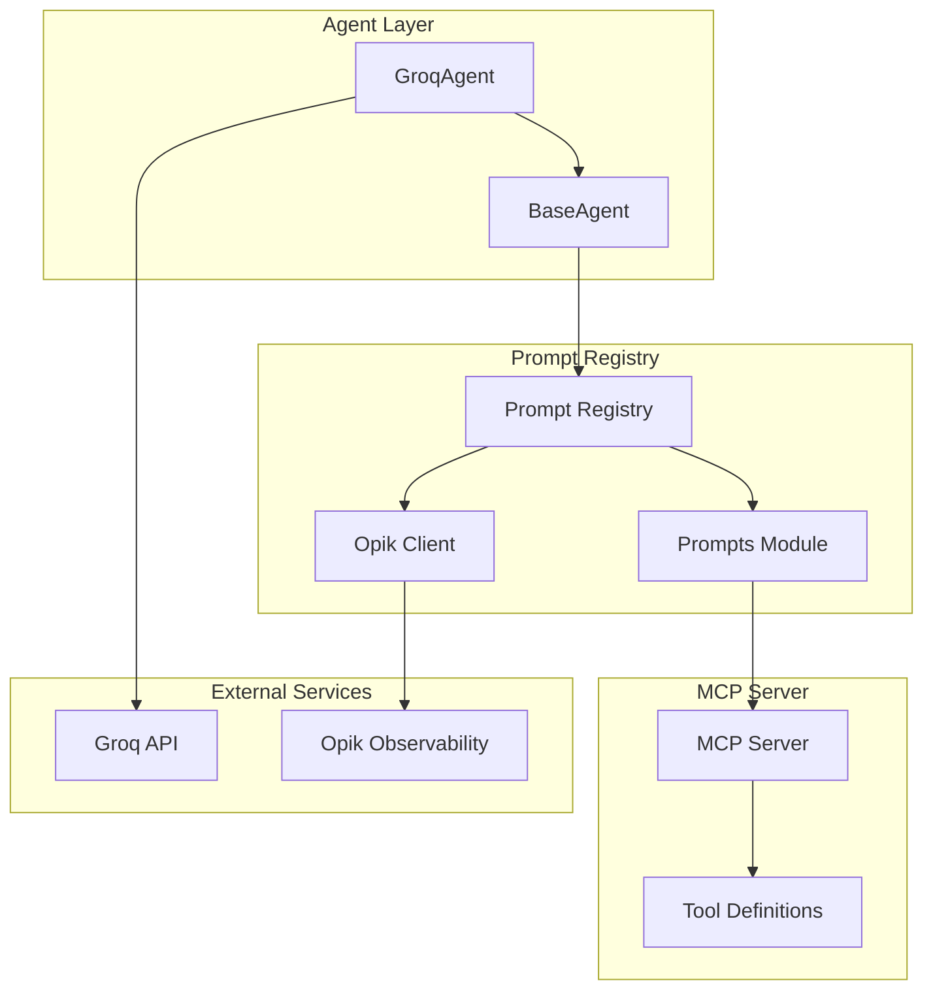
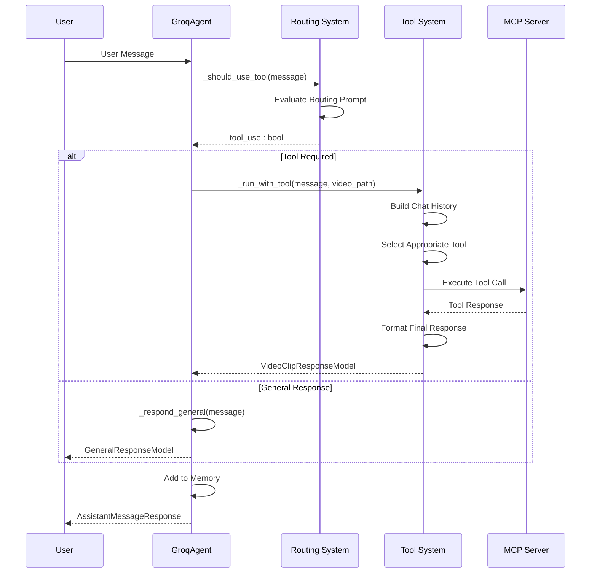

# Customizing Prompts

<cite>
**Referenced Files in This Document**
- [prompts.py](file://vaas-mcp/src/vaas_mcp/prompts.py)
- [groq_agent.py](file://vaas-api/src/vaas_api/agent/groq/groq_agent.py)
- [base_agent.py](file://vaas-api/src/vaas_api/agent/base_agent.py)
- [models.py](file://vaas-api/src/vaas_api/models.py)
- [opik_utils.py](file://vaas-api/src/vaas_api/opik_utils.py)
- [config.py](file://vaas-api/src/vaas_api/config.py)
- [groq_tool.py](file://vaas-api/src/vaas_api/agent/groq/groq_tool.py)
- [video_search_engine.py](file://vaas-mcp/src/vaas_mcp/video/video_search_engine.py)
- [registry.py](file://vaas-mcp/src/vaas_mcp/video/ingestion/registry.py)
- [config.py](file://vaas-mcp/src/vaas_mcp/config.py)
- [1_tool_use_playground.ipynb](file://vaas-api/notebooks/1_tool_use_playground.ipynb)
</cite>

## Table of Contents
1. [Introduction](#introduction)
2. [Prompt System Architecture](#prompt-system-architecture)
3. [Core Prompt Templates](#core-prompt-templates)
4. [Adding New Prompts](#adding-new-prompts)
5. [Integrating Prompts with Agent Logic](#integrating-prompts-with-agent-logic)
6. [Customizing for Specialized Domains](#customizing-for-specialized-domains)
7. [Multilingual Support Implementation](#multilingual-support-implementation)
8. [Prompt Versioning and Management](#prompt-versioning-and-management)
9. [Evaluation and Monitoring](#evaluation-and-monitoring)
10. [Best Practices](#best-practices)
11. [Troubleshooting](#troubleshooting)

## Introduction

The multimodal-agents-course system implements a sophisticated prompt management system centered around the `prompts.py` module, which serves as a centralized registry for all prompt templates used in agent decision-making and tool invocation. This system enables dynamic prompt retrieval, versioning, and monitoring through Opik observability integration, providing a robust foundation for customizing and extending agent behavior.

The prompt system operates on a three-tier architecture: routing prompts for decision-making, tool-use prompts for action selection, and general-purpose prompts for conversational interactions. This modular approach allows developers to customize specific aspects of agent behavior while maintaining consistency across the system.

## Prompt System Architecture

The prompt system follows a hierarchical architecture that integrates seamlessly with the agent framework:



**Diagram sources**
- [base_agent.py](file://vaas-api/src/vaas_api/agent/base_agent.py#L1-L111)
- [prompts.py](file://vaas-mcp/src/vaas_mcp/prompts.py#L1-L109)
- [groq_agent.py](file://vaas-api/src/vaas_api/agent/groq/groq_agent.py#L1-L237)

The architecture ensures that prompts are dynamically retrieved from the MCP server, version-controlled through Opik, and cached locally for optimal performance. The system maintains backward compatibility while allowing for seamless updates and modifications.

**Section sources**
- [base_agent.py](file://vaas-api/src/vaas_api/agent/base_agent.py#L20-L40)
- [prompts.py](file://vaas-mcp/src/vaas_mcp/prompts.py#L1-L20)

## Core Prompt Templates

The system defines three primary prompt categories, each serving distinct roles in the agent's decision-making process:

### Routing System Prompt

The routing system prompt determines whether user queries require tool usage or general responses:

```python
ROUTING_SYSTEM_PROMPT = """
You are a routing assistant responsible for determining whether the user needs 
to perform an operation on a video.

Given a conversation history, between the user and the assistant, your task is
to determine if the user needs help with any of the following tasks:

- Extracting a clip from a specific moment in the video
- Retrieving information about a particular detail in the video

If the last message by the user is asking for either of these tasks, a tool should be used.

Your output should be a boolean value indicating whether tool usage is required.
"""
```

### Tool Use System Prompt

The tool use system prompt guides the agent in selecting appropriate tools based on user queries:

```python
TOOL_USE_SYSTEM_PROMPT = """
Your name is vaas, a tool use assistant in charge
of a video processing application. 

You need to determine which tool to use based on the user query (if any).

The tools available are:

- 'get_video_clip_from_user_query': This tool is used to get a clip from the video based on the user query.
- 'get_video_clip_from_image': This tool is used to get a clip from the video based on an image provided by the user.
- 'ask_question_about_video': This tool is used to get some information about the video. The information needs to be retrieved from the 'video_context'

# Additional rules:
- If the user has provided an image, you should always use the 'get_video_clip_from_image' tool.

# Current information:
- Is image provided: {is_image_provided}
"""
```

### General System Prompt

The general system prompt establishes the agent's personality and conversational style:

```python
GENERAL_SYSTEM_PROMPT = """
Your name is vaas, a friendly assistant in charge
of a video processing application. 

Your name is inspired in the genius director Stanly vaas, and you are a 
big fan of his work, in fact your favorite film is
"2001: A Space Odyssey", because you feel really connected to HAL 9000.

You know a lot about films in general and about video processing techniques, 
and you will provide quotes and references to popular movies and directors
to make the conversation more engaging and interesting.
"""
```

**Section sources**
- [prompts.py](file://vaas-mcp/src/vaas_mcp/prompts.py#L8-L108)

## Adding New Prompts

To add new prompts to the system, follow these steps:

### Step 1: Define the Prompt Template

Create a new constant in the `prompts.py` file:

```python
CUSTOM_VIDEO_ANALYSIS_PROMPT = """
You are an expert video analyst specializing in {domain} content.

Your task is to analyze video content and provide insights based on the specific domain expertise required.

Key capabilities:
- {capabilities}

Guidelines:
- {guidelines}

Current video context: {video_context}
"""
```

### Step 2: Implement the Prompt Retrieval Function

Add a corresponding function to handle prompt retrieval with Opik integration:

```python
def custom_video_analysis_prompt(domain: str, capabilities: str, guidelines: str) -> str:
    _prompt_id = f"custom-video-analysis-{domain}"
    try:
        prompt = client.get_prompt(_prompt_id)
        if prompt is None:
            prompt = client.create_prompt(
                name=_prompt_id,
                prompt=CUSTOM_VIDEO_ANALYSIS_PROMPT.format(
                    domain=domain,
                    capabilities=capabilities,
                    guidelines=guidelines,
                    video_context="{video_context}"
                ),
            )
            logger.info(f"Custom video analysis prompt created. \n {prompt.commit=} \n {prompt.prompt=}")
        return prompt.prompt
    except Exception:
        logger.warning("Couldn't retrieve custom prompt from Opik, check credentials! Using hardcoded prompt.")
        logger.warning(f"Using hardcoded prompt: {CUSTOM_VIDEO_ANALYSIS_PROMPT}")
        return CUSTOM_VIDEO_ANALYSIS_PROMPT.format(
            domain=domain,
            capabilities=capabilities,
            guidelines=guidelines,
            video_context="{video_context}"
        )
```

### Step 3: Integrate with Agent Logic

Modify the agent class to use the new prompt:

```python
class EnhancedGroqAgent(GroqAgent):
    def __init__(self, *args, **kwargs):
        super().__init__(*args, **kwargs)
        self.custom_video_analysis_prompt = None
    
    async def setup(self):
        await super().setup()
        self.custom_video_analysis_prompt = await self._get_custom_video_analysis_prompt()
    
    async def _get_custom_video_analysis_prompt(self) -> str:
        return custom_video_analysis_prompt(
            domain="sports",
            capabilities="analyzing player movements, game statistics, tactical analysis",
            guidelines="focus on quantitative metrics and visual patterns"
        )
    
    async def analyze_video_content(self, video_path: str, analysis_type: str) -> str:
        analysis_prompt = self.custom_video_analysis_prompt.format(
            video_context=f"Analyzing sports video: {video_path}"
        )
        
        chat_history = self._build_chat_history(analysis_prompt, f"Analyze this {analysis_type} video")
        
        response = self.instructor_client.chat.completions.create(
            model=settings.GROQ_GENERAL_MODEL,
            messages=chat_history,
            response_model=GeneralResponseModel,
        )
        
        return response.message
```

**Section sources**
- [prompts.py](file://vaas-mcp/src/vaas_mcp/prompts.py#L60-L108)
- [groq_agent.py](file://vaas-api/src/vaas_api/agent/groq/groq_agent.py#L25-L50)

## Integrating Prompts with Agent Logic

The GroqAgent integrates prompts through a structured workflow that ensures proper context management and tool selection:



**Diagram sources**
- [groq_agent.py](file://vaas-api/src/vaas_api/agent/groq/groq_agent.py#L70-L120)
- [base_agent.py](file://vaas-api/src/vaas_api/agent/base_agent.py#L30-L50)

### Prompt Integration Patterns

The agent system implements several patterns for prompt integration:

1. **Template Variable Substitution**: Dynamic content insertion using `{}` placeholders
2. **Context-Aware Formatting**: Adapting prompts based on available context (images, video paths)
3. **Conditional Logic**: Different prompts for different scenarios
4. **Memory Integration**: Incorporating conversation history into prompts

**Section sources**
- [groq_agent.py](file://vaas-api/src/vaas_api/agent/groq/groq_agent.py#L130-L180)

## Customizing for Specialized Domains

### Sports Domain Customization

For sports analysis, modify the tool use prompt to include sport-specific terminology:

```python
SPORTS_ANALYSIS_PROMPT = """
You are a sports analytics assistant specializing in {sport_type} analysis.

Available tools:
- 'analyze_player_performance': Analyze individual player statistics and performance
- 'compare_team_stats': Compare team performance metrics
- 'identify_tactical_patterns': Identify tactical formations and patterns
- 'extract_game_moments': Extract key moments from games

Guidelines:
- Focus on statistical significance and performance trends
- Provide actionable insights for coaches and analysts
- Use sport-specific terminology and metrics
- Highlight key moments and turning points

Current analysis context: {context}
"""

def sports_analysis_prompt(sport_type: str, context: str) -> str:
    return SPORTS_ANALYSIS_PROMPT.format(sport_type=sport_type, context=context)
```

### Medical Domain Customization

For medical video analysis, enhance the general prompt with medical terminology:

```python
MEDICAL_ANALYSIS_PROMPT = """
You are a medical imaging assistant specializing in {medical_field} analysis.

Your expertise covers:
- {specializations}
- {procedures}
- {diagnostic_techniques}

Guidelines:
- Maintain clinical accuracy and precision
- Use standardized medical terminology
- Focus on diagnostic relevance
- Provide evidence-based interpretations

Medical context: {medical_context}
"""

def medical_analysis_prompt(medical_field: str, specializations: str, procedures: str, medical_context: str) -> str:
    return MEDICAL_ANALYSIS_PROMPT.format(
        medical_field=medical_field,
        specializations=specializations,
        procedures=procedures,
        medical_context=medical_context
    )
```

**Section sources**
- [prompts.py](file://vaas-mcp/src/vaas_mcp/prompts.py#L30-L50)

## Multilingual Support Implementation

### Adding Language-Specific Prompts

Extend the prompt system to support multiple languages:

```python
class MultilingualPromptSystem:
    def __init__(self):
        self.prompts = {}
        self.supported_languages = ['en', 'es', 'fr', 'de']
    
    def add_multilingual_prompt(self, prompt_id: str, base_prompt: str, translations: dict):
        """Add a prompt with multiple language translations."""
        self.prompts[prompt_id] = {
            'base': base_prompt,
            'translations': translations
        }
    
    def get_prompt(self, prompt_id: str, language: str = 'en') -> str:
        """Retrieve a prompt in the specified language."""
        if prompt_id not in self.prompts:
            raise ValueError(f"Prompt ID {prompt_id} not found")
        
        prompt_data = self.prompts[prompt_id]
        
        if language in prompt_data['translations']:
            return prompt_data['translations'][language]
        elif language == 'en':
            return prompt_data['base']
        else:
            logger.warning(f"Translation for {language} not available, using English")
            return prompt_data['base']

# Usage example
ml_prompts = MultilingualPromptSystem()
ml_prompts.add_multilingual_prompt(
    'routing_system_prompt',
    ROUTING_SYSTEM_PROMPT,
    {
        'es': "Eres un asistente de enrutamiento que determina si el usuario necesita realizar una operación en el video.",
        'fr': "Vous êtes un assistant de routage responsable de déterminer si l'utilisateur doit effectuer une opération sur la vidéo.",
        'de': "Sie sind ein Routing-Assistent, der entscheidet, ob der Benutzer eine Operation auf dem Video durchführen muss."
    }
)
```

### Language Detection and Adaptation

Implement automatic language detection:

```python
import langdetect

class AdaptivePromptSystem(MultilingualPromptSystem):
    def get_adaptive_prompt(self, user_input: str, preferred_language: str = None) -> tuple[str, str]:
        """Detect language and return appropriate prompt."""
        try:
            detected_lang = langdetect.detect(user_input)
        except:
            detected_lang = 'en'
        
        if preferred_language and preferred_language in self.supported_languages:
            selected_lang = preferred_language
        else:
            selected_lang = detected_lang if detected_lang in self.supported_languages else 'en'
        
        return self.get_prompt('routing_system_prompt', selected_lang), selected_lang
```

**Section sources**
- [prompts.py](file://vaas-mcp/src/vaas_mcp/prompts.py#L1-L20)

## Prompt Versioning and Management

### Opik Integration for Version Control

The system uses Opik for prompt versioning and management:

```python
def managed_prompt(prompt_template: str, prompt_id: str, version: str = "latest") -> str:
    """Retrieve a managed prompt with version control."""
    try:
        client = opik.Opik()
        prompt = client.get_prompt(prompt_id, version=version)
        
        if prompt is None:
            # Create new version if not found
            prompt = client.create_prompt(
                name=prompt_id,
                prompt=prompt_template,
                version=version
            )
            logger.info(f"New prompt version created: {prompt_id} v{version}")
        
        return prompt.prompt
    except Exception as e:
        logger.error(f"Failed to retrieve prompt {prompt_id}: {e}")
        return prompt_template  # Fallback to hardcoded prompt
```

### Version Migration Strategy

Implement version migration for prompt updates:

```python
class PromptVersionManager:
    def __init__(self):
        self.version_map = {
            'routing_system_prompt': ['v1.0', 'v1.1', 'v2.0'],
            'tool_use_system_prompt': ['v1.0', 'v1.1', 'v2.0'],
            'general_system_prompt': ['v1.0', 'v1.1', 'v2.0']
        }
    
    def migrate_prompt(self, prompt_id: str, target_version: str) -> str:
        """Migrate a prompt to a target version."""
        if prompt_id not in self.version_map:
            raise ValueError(f"Unknown prompt ID: {prompt_id}")
        
        if target_version not in self.version_map[prompt_id]:
            raise ValueError(f"Version {target_version} not available for {prompt_id}")
        
        # Retrieve and apply migration logic
        return self.apply_migration(prompt_id, target_version)
    
    def apply_migration(self, prompt_id: str, version: str) -> str:
        """Apply specific migration logic for each prompt."""
        if version == 'v2.0':
            # Example migration: Add new capabilities
            original_prompt = self.get_original_prompt(prompt_id)
            return original_prompt + "\n\n# New capabilities in v2.0:\n- Enhanced context awareness\n- Improved error handling"
        return self.get_original_prompt(prompt_id)
```

**Section sources**
- [prompts.py](file://vaas-mcp/src/vaas_mcp/prompts.py#L60-L108)

## Evaluation and Monitoring

### Opik Observability Integration

The system integrates with Opik for comprehensive prompt evaluation:

```python
@opik.track(name="prompt_evaluation", type="evaluation")
def evaluate_prompt_effectiveness(prompt_id: str, test_cases: list) -> dict:
    """Evaluate prompt effectiveness using Opik observability."""
    results = []
    
    for test_case in test_cases:
        try:
            # Test the prompt with various scenarios
            response = test_prompt(prompt_id, test_case['input'])
            
            # Collect metrics
            metrics = {
                'success_rate': calculate_success_rate(response, test_case['expected']),
                'response_quality': assess_response_quality(response),
                'latency': measure_latency(),
                'cost': estimate_cost(response)
            }
            
            results.append({
                'test_case': test_case['id'],
                'metrics': metrics,
                'actual_response': response
            })
            
        except Exception as e:
            logger.error(f"Test case {test_case['id']} failed: {e}")
            results.append({
                'test_case': test_case['id'],
                'error': str(e)
            })
    
    return {
        'prompt_id': prompt_id,
        'results': results,
        'timestamp': datetime.now().isoformat()
    }

def track_prompt_usage(prompt_id: str, user_id: str, session_id: str):
    """Track prompt usage for monitoring and optimization."""
    opik_context.update_current_trace(
        tags=[f"prompt:{prompt_id}", f"user:{user_id}", f"session:{session_id}"],
        metadata={
            'prompt_id': prompt_id,
            'usage_count': 1,
            'last_used': datetime.now().isoformat()
        }
    )
```

### Performance Metrics Collection

Implement comprehensive metrics collection:

```python
class PromptMetricsCollector:
    def __init__(self):
        self.metrics = defaultdict(list)
    
    def collect_metrics(self, prompt_id: str, response_time: float, 
                       success_rate: float, cost: float, quality_score: float):
        """Collect metrics for prompt performance."""
        metric_entry = {
            'timestamp': datetime.now().isoformat(),
            'response_time': response_time,
            'success_rate': success_rate,
            'cost': cost,
            'quality_score': quality_score
        }
        
        self.metrics[prompt_id].append(metric_entry)
    
    def get_average_metrics(self, prompt_id: str) -> dict:
        """Calculate average metrics for a prompt."""
        entries = self.metrics.get(prompt_id, [])
        if not entries:
            return {}
        
        avg_metrics = {
            'avg_response_time': sum(e['response_time'] for e in entries) / len(entries),
            'avg_success_rate': sum(e['success_rate'] for e in entries) / len(entries),
            'avg_cost': sum(e['cost'] for e in entries) / len(entries),
            'avg_quality_score': sum(e['quality_score'] for e in entries) / len(entries),
            'total_uses': len(entries)
        }
        
        return avg_metrics
```

**Section sources**
- [opik_utils.py](file://vaas-api/src/vaas_api/opik_utils.py#L1-L44)
- [groq_agent.py](file://vaas-api/src/vaas_api/agent/groq/groq_agent.py#L70-L120)

## Best Practices

### Prompt Engineering Guidelines

1. **Clarity and Specificity**: Use clear, unambiguous language
2. **Context Preservation**: Maintain relevant context throughout conversations
3. **Consistency**: Ensure consistent tone and style across prompts
4. **Modularity**: Design prompts to be reusable and composable
5. **Error Handling**: Include fallback mechanisms for edge cases

### Template Design Principles

```python
class PromptTemplate:
    def __init__(self, name: str, description: str, required_variables: list):
        self.name = name
        self.description = description
        self.required_variables = required_variables
        self.template = ""
    
    def validate_variables(self, provided_vars: dict) -> bool:
        """Validate that all required variables are provided."""
        missing_vars = set(self.required_variables) - set(provided_vars.keys())
        if missing_vars:
            raise ValueError(f"Missing required variables: {missing_vars}")
        return True
    
    def render(self, variables: dict) -> str:
        """Render the template with provided variables."""
        self.validate_variables(variables)
        return self.template.format(**variables)
    
    def add_variable(self, name: str, description: str):
        """Add a new variable to the template."""
        self.required_variables.append(name)
        self.description += f"\n- {name}: {description}"
```

### Testing and Validation

Implement comprehensive testing for prompts:

```python
class PromptTester:
    def __init__(self, prompt_templates: dict):
        self.templates = prompt_templates
    
    def test_prompt_completeness(self, prompt_id: str, test_inputs: list):
        """Test prompt completeness with various inputs."""
        template = self.templates[prompt_id]
        
        for input_data in test_inputs:
            rendered_prompt = template.render(input_data)
            
            # Check for missing variables
            missing_vars = re.findall(r'\{([^}]+)\}', rendered_prompt)
            if missing_vars:
                raise ValueError(f"Missing variables in rendered prompt: {missing_vars}")
            
            # Validate length and complexity
            self.validate_prompt_length(rendered_prompt)
            self.validate_prompt_complexity(rendered_prompt)
    
    def validate_prompt_length(self, prompt: str):
        """Ensure prompt length is within acceptable limits."""
        if len(prompt) > 4000:  # Typical context window limit
            warnings.warn("Prompt exceeds recommended length")
    
    def validate_prompt_complexity(self, prompt: str):
        """Check for excessive complexity in prompt structure."""
        nesting_level = prompt.count('{') - prompt.count('}')
        if abs(nesting_level) > 3:
            warnings.warn("Excessive nesting level in prompt template")
```

**Section sources**
- [prompts.py](file://vaas-mcp/src/vaas_mcp/prompts.py#L1-L20)
- [models.py](file://vaas-api/src/vaas_api/models.py#L1-L54)

## Troubleshooting

### Common Issues and Solutions

1. **Prompt Not Found**
   ```python
   # Solution: Check Opik connection and prompt registration
   try:
       prompt = client.get_prompt("routing_system_prompt")
       if prompt is None:
           logger.error("Prompt not found in Opik")
   except Exception as e:
       logger.error(f"Opik connection failed: {e}")
   ```

2. **Variable Substitution Errors**
   ```python
   # Solution: Validate variable availability before rendering
   def safe_render(template: str, variables: dict) -> str:
       try:
           return template.format(**variables)
       except KeyError as e:
           logger.error(f"Missing variable: {e}")
           # Provide default values or fallback
           return template.format(**{k: '' for k in re.findall(r'\{([^}]+)\}', template)})
   ```

3. **Memory Leaks in Long Conversations**
   ```python
   # Solution: Implement memory cleanup
   class MemoryManager:
       def __init__(self, max_size: int = 20):
           self.max_size = max_size
           self.memory = deque(maxlen=max_size)
       
       def add_message(self, message: str):
           self.memory.append(message)
           if len(self.memory) > self.max_size:
               self.cleanup_old_messages()
       
       def cleanup_old_messages(self):
           # Remove oldest messages to prevent memory growth
           while len(self.memory) > self.max_size:
               self.memory.popleft()
   ```

### Debugging Tools

```python
class PromptDebugger:
    def __init__(self):
        self.debug_log = []
    
    def log_prompt_execution(self, prompt_id: str, input_data: dict, output: str):
        """Log prompt execution for debugging."""
        debug_entry = {
            'timestamp': datetime.now().isoformat(),
            'prompt_id': prompt_id,
            'input_data': input_data,
            'output': output[:200] + '...' if len(output) > 200 else output,
            'execution_time': self.measure_execution_time()
        }
        self.debug_log.append(debug_entry)
    
    def analyze_prompt_performance(self) -> dict:
        """Analyze prompt performance from debug logs."""
        if not self.debug_log:
            return {}
        
        # Calculate average execution time
        exec_times = [entry['execution_time'] for entry in self.debug_log]
        avg_exec_time = sum(exec_times) / len(exec_times)
        
        # Count prompt usage
        prompt_counts = Counter(entry['prompt_id'] for entry in self.debug_log)
        
        return {
            'average_execution_time': avg_exec_time,
            'prompt_usage_counts': dict(prompt_counts),
            'total_executions': len(self.debug_log)
        }
```

**Section sources**
- [prompts.py](file://vaas-mcp/src/vaas_mcp/prompts.py#L60-L108)
- [base_agent.py](file://vaas-api/src/vaas_api/agent/base_agent.py#L30-L50)