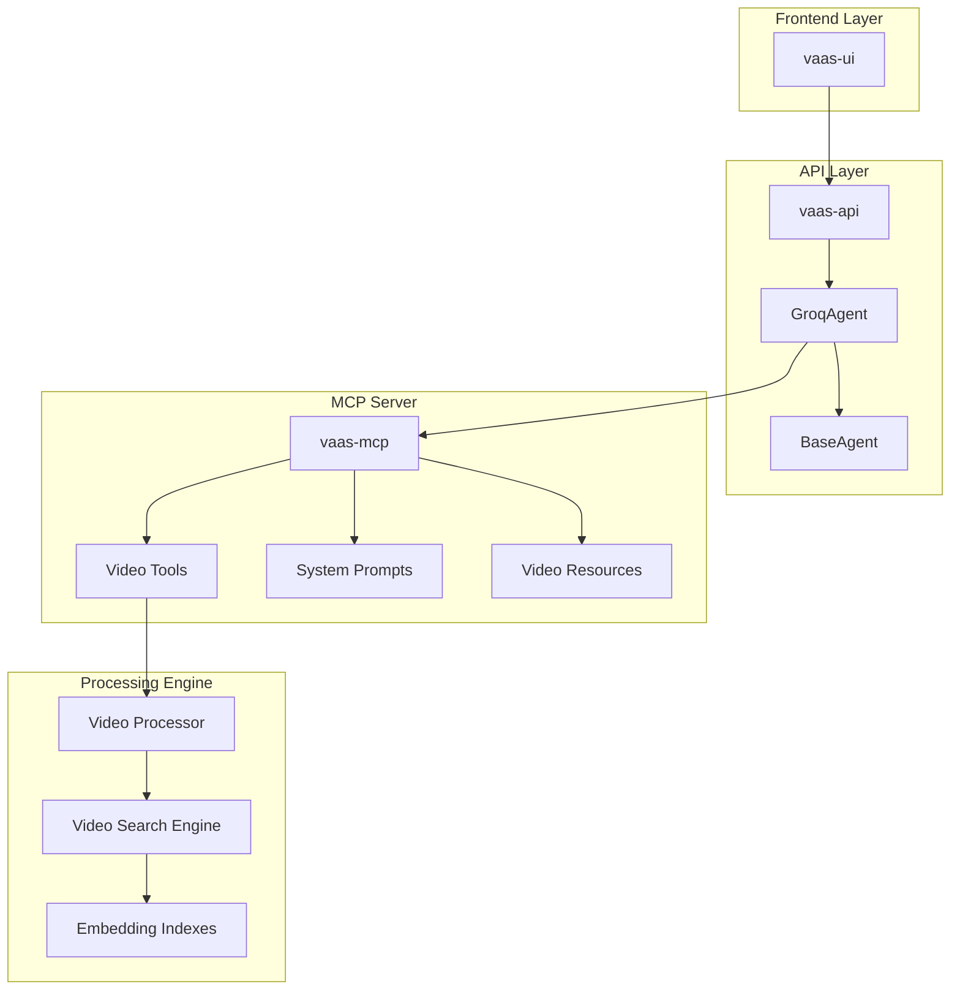
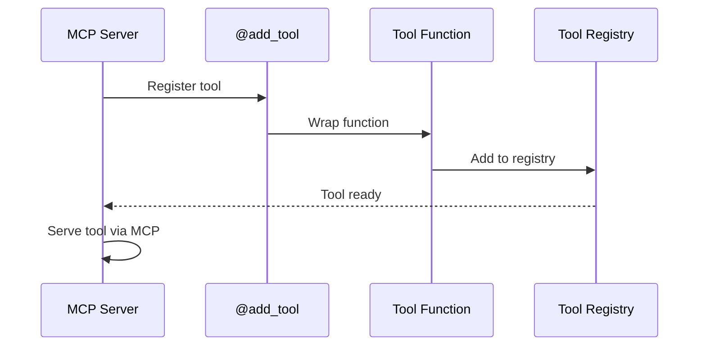
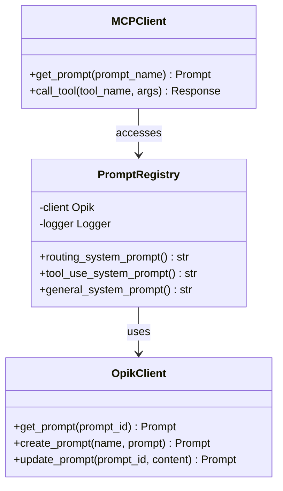
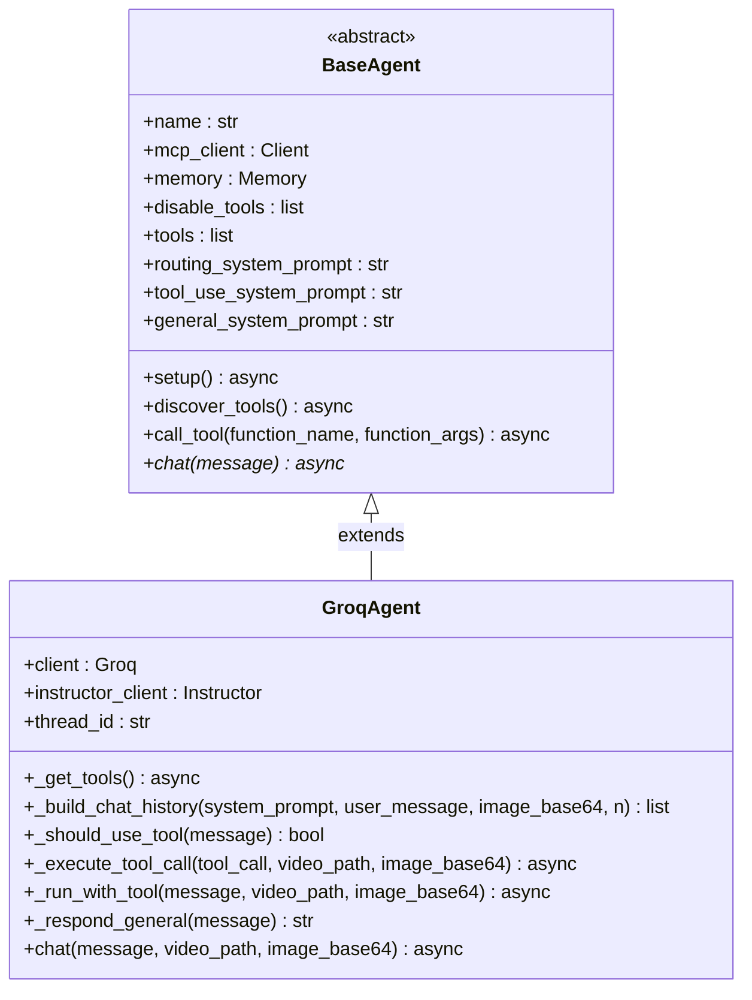
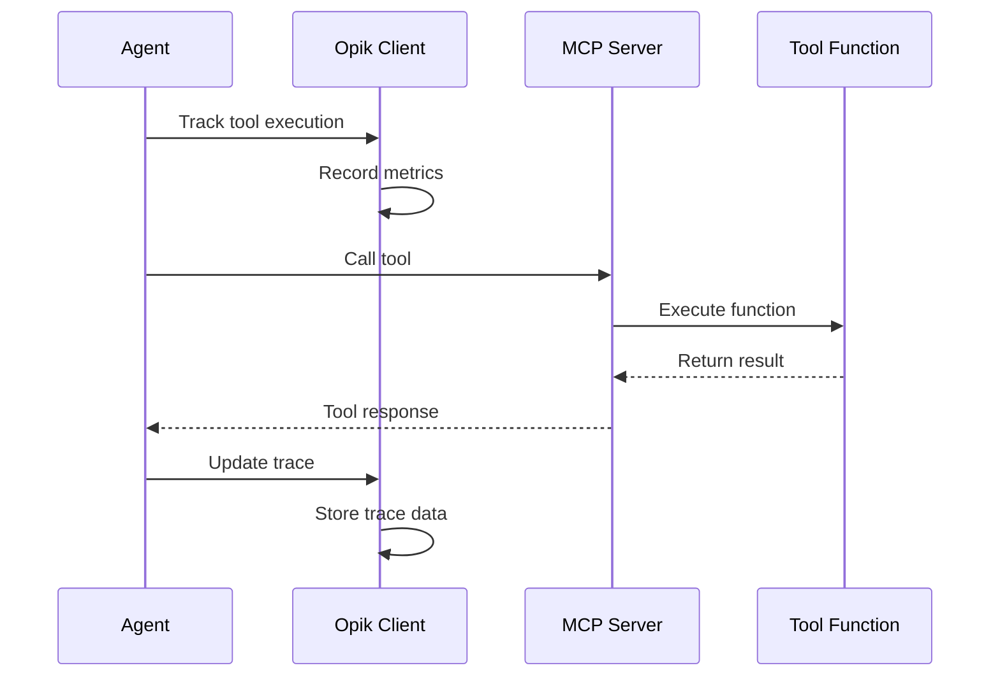

# Extending the Multimodal Agents Course System

<cite>
**Referenced Files in This Document**
- [vaas_mcp/tools.py](file://vaas-mcp/src/vaas_mcp/tools.py)
- [vaas_mcp/prompts.py](file://vaas-mcp/src/vaas_mcp/prompts.py)
- [vaas_mcp/server.py](file://vaas-mcp/src/vaas_mcp/server.py)
- [vaas_mcp/video/ingestion/tools.py](file://vaas-mcp/src/vaas_mcp/video/ingestion/tools.py)
- [vaas_api/agent/base_agent.py](file://vaas-api/src/vaas_api/agent/base_agent.py)
- [vaas_api/agent/groq/groq_agent.py](file://vaas-api/src/vaas_api/agent/groq/groq_agent.py)
- [vaas_mcp/opik_utils.py](file://vaas-mcp/src/vaas_mcp/opik_utils.py)
- [video_ingestion_process.ipynb](file://vaas-mcp/notebooks/video_ingestion_process.ipynb)
- [1_tool_use_playground.ipynb](file://vaas-api/notebooks/1_tool_use_playground.ipynb)
</cite>

## Table of Contents
1. [Introduction](#introduction)
2. [System Architecture Overview](#system-architecture-overview)
3. [Adding New MCP Tools](#adding-new-mcp-tools)
4. [Creating Custom Prompts](#creating-custom-prompts)
5. [Extending Agent Classes](#extending-agent-classes)
6. [Integrating New Models](#integrating-new-models)
7. [Best Practices for Tool Design](#best-practices-for-tool-design)
8. [Testing Extensions](#testing-extensions)
9. [Monitoring with Opik](#monitoring-with-opik)
10. [Versioning Strategies](#versioning-strategies)
11. [Troubleshooting Guide](#troubleshooting-guide)
12. [Conclusion](#conclusion)

## Introduction

The multimodal-agents-course system provides a comprehensive framework for building AI agents capable of processing and analyzing multimedia content. This documentation covers how to extend the system by adding new tools, creating custom prompts, integrating new models, and implementing monitoring capabilities.

The system consists of three main components:
- **vaas-mcp**: The Model Context Protocol (MCP) server that provides video processing tools
- **vaas-api**: The API layer that orchestrates agent interactions with the MCP server
- **vaas-ui**: The frontend interface for user interaction

## System Architecture Overview



**Diagram sources**
- [vaas_api/agent/base_agent.py](file://vaas-api/src/vaas_api/agent/base_agent.py#L1-L111)
- [vaas_mcp/server.py](file://vaas-mcp/src/vaas_mcp/server.py#L1-L97)

## Adding New MCP Tools

### Understanding the Tool Registration System

The MCP server uses the `add_tool` decorator pattern to register tools. Each tool must be properly decorated and registered in the server initialization.



**Diagram sources**
- [vaas_mcp/server.py](file://vaas-mcp/src/vaas_mcp/server.py#L15-L45)

### Step-by-Step Tool Creation Process

#### 1. Define the Tool Function

Create a new function that implements your desired functionality:

```python
def analyze_video_transcript(video_path: str, query: str) -> str:
    """Analyze video transcript for specific information.
    
    Args:
        video_path (str): Path to the video file
        query (str): Specific information to search for
        
    Returns:
        str: Analysis results and relevant transcript segments
    """
    # Implementation here
    pass
```

#### 2. Add Tool Registration

Modify the `server.py` file to register your new tool:

```python
def add_mcp_tools(mcp: FastMCP):
    # Existing tools...
    
    mcp.add_tool(
        name="analyze_video_transcript",
        description="Analyze video transcript for specific information.",
        fn=analyze_video_transcript,
        tags={"video", "analysis", "transcript"},
    )
```

#### 3. Implement Tool Logic

Here's an example of a complete tool implementation:

```python
def analyze_video_transcript(video_path: str, query: str) -> str:
    """Analyze video transcript for specific information.
    
    Args:
        video_path (str): Path to the video file
        query (str): Specific information to search for
        
    Returns:
        str: Analysis results and relevant transcript segments
        
    Raises:
        ValueError: If video file doesn't exist or is invalid
        RuntimeError: If transcript processing fails
    """
    try:
        # Validate input
        if not os.path.exists(video_path):
            raise ValueError(f"Video file not found: {video_path}")
        
        # Load video processor
        video_processor = VideoProcessor()
        
        # Get transcript data
        transcript_data = video_processor.get_transcript(video_path)
        
        # Perform analysis
        relevant_segments = []
        for segment in transcript_data:
            if query.lower() in segment['text'].lower():
                relevant_segments.append({
                    'timestamp': segment['start'],
                    'text': segment['text']
                })
        
        # Format results
        if not relevant_segments:
            return f"No matches found for '{query}' in the video transcript."
        
        result = f"Found {len(relevant_segments)} relevant segments:\n\n"
        for i, segment in enumerate(relevant_segments[:5], 1):
            result += f"{i}. [{segment['timestamp']}] {segment['text']}\n"
        
        return result
        
    except Exception as e:
        logger.error(f"Transcript analysis failed: {str(e)}")
        raise RuntimeError(f"Failed to analyze video transcript: {str(e)}")
```

**Section sources**
- [vaas_mcp/server.py](file://vaas-mcp/src/vaas_mcp/server.py#L15-L45)
- [vaas_mcp/tools.py](file://vaas-mcp/src/vaas_mcp/tools.py#L1-L105)

## Creating Custom Prompts

### Understanding the Prompt Registry System

The system uses Opik for prompt management, allowing dynamic updates and versioning of system prompts.



**Diagram sources**
- [vaas_mcp/prompts.py](file://vaas-mcp/src/vaas_mcp/prompts.py#L1-L109)

### Step-by-Step Prompt Creation

#### 1. Define the Prompt Template

Create a new prompt template in `prompts.py`:

```python
VIDEO_ANALYSIS_PROMPT = """
You are an expert video analyst specializing in multimedia content analysis.

Your task is to analyze video content and provide insights based on the user's query. When analyzing videos, consider:

1. Visual content and scene analysis
2. Audio content and speech recognition
3. Text content from captions and subtitles
4. Temporal relationships between different media elements

For each analysis:
- Provide specific timestamps when relevant
- Reference visual elements described in the video
- Summarize audio content accurately
- Highlight key moments or patterns

Current video context: {video_context}
User query: {user_query}
"""

VIDEO_ANALYSIS_SYSTEM_PROMPT = """
Your name is vaas, a specialized video analysis assistant.

You have expertise in:
- Video editing and production techniques
- Multimedia content analysis
- Audio processing and transcription
- Visual storytelling and composition

When analyzing videos, you provide detailed insights and precise references to specific moments in the content.
"""
```

#### 2. Implement the Prompt Function

```python
def video_analysis_system_prompt() -> str:
    """Get the latest video analysis system prompt from Opik.
    
    Returns:
        str: The current system prompt for video analysis
    """
    _prompt_id = "video-analysis-system-prompt"
    try:
        prompt = client.get_prompt(_prompt_id)
        if prompt is None:
            prompt = client.create_prompt(
                name=_prompt_id,
                prompt=VIDEO_ANALYSIS_SYSTEM_PROMPT,
            )
            logger.info(f"Video analysis system prompt created. \n {prompt.commit=} \n {prompt.prompt=}")
        return prompt.prompt
    except Exception:
        logger.warning("Couldn't retrieve prompt from Opik, check credentials! Using hardcoded prompt.")
        logger.warning(f"Using hardcoded prompt: {VIDEO_ANALYSIS_SYSTEM_PROMPT}")
        prompt = VIDEO_ANALYSIS_SYSTEM_PROMPT
    return prompt
```

#### 3. Register the Prompt

Add the prompt registration to the `add_mcp_prompts` function:

```python
def add_mcp_prompts(mcp: FastMCP):
    # Existing prompts...
    
    mcp.add_prompt(
        fn=video_analysis_system_prompt,
        name="video_analysis_system_prompt",
        description="Latest version of the video analysis prompt from Opik.",
        tags={"prompt", "video", "analysis"},
    )
```

**Section sources**
- [vaas_mcp/prompts.py](file://vaas-mcp/src/vaas_mcp/prompts.py#L1-L109)

## Extending Agent Classes

### Understanding the Base Agent Architecture

The `BaseAgent` class provides the foundation for all agent implementations, with the `GroqAgent` serving as the primary implementation.



**Diagram sources**
- [vaas_api/agent/base_agent.py](file://vaas-api/src/vaas_api/agent/base_agent.py#L1-L111)
- [vaas_api/agent/groq/groq_agent.py](file://vaas-api/src/vaas_api/agent/groq/groq_agent.py#L1-L237)

### Creating a Custom Agent Class

#### 1. Extend the BaseAgent Class

```python
class CustomAgent(BaseAgent):
    """Custom agent implementation with specialized functionality."""
    
    def __init__(self, name: str, mcp_server: str, memory: Memory = None, 
                 disable_tools: list = None, custom_config: dict = None):
        super().__init__(name, mcp_server, memory, disable_tools)
        self.custom_config = custom_config or {}
        self.custom_client = self._initialize_custom_client()
    
    def _initialize_custom_client(self):
        """Initialize custom client for specialized functionality."""
        # Custom initialization logic
        pass
    
    async def _get_tools(self) -> list:
        """Get available tools with custom filtering."""
        tools = await self.discover_tools()
        # Apply custom filtering or transformation
        return [tool for tool in tools if self._is_valid_tool(tool)]
    
    def _is_valid_tool(self, tool: dict) -> bool:
        """Filter tools based on custom criteria."""
        # Custom validation logic
        return True
    
    async def chat(self, message: str, video_path: str = None, 
                   image_base64: str = None, **kwargs) -> str:
        """Custom chat implementation with specialized processing."""
        # Custom preprocessing
        preprocessed_message = self._preprocess_message(message)
        
        # Standard processing
        result = await super().chat(preprocessed_message, video_path, image_base64)
        
        # Custom postprocessing
        return self._postprocess_result(result)
    
    def _preprocess_message(self, message: str) -> str:
        """Preprocess incoming messages."""
        # Custom preprocessing logic
        return message
    
    def _postprocess_result(self, result: str) -> str:
        """Postprocess chat results."""
        # Custom postprocessing logic
        return result
```

#### 2. Implement Specialized Tool Logic

```python
async def _execute_custom_tool(self, tool_call: Any, video_path: str, 
                               image_base64: str = None) -> str:
    """Execute custom tool with specialized error handling."""
    function_name = tool_call.function.name
    function_args = json.loads(tool_call.function.arguments)
    
    # Add custom arguments
    function_args["video_path"] = video_path
    if function_name == "custom_video_analysis":
        function_args["custom_param"] = self.custom_config.get("param", "default")
    
    try:
        # Custom validation
        self._validate_tool_args(function_name, function_args)
        
        # Execute tool
        return await self.call_tool(function_name, function_args)
        
    except ValidationError as e:
        logger.error(f"Invalid tool arguments for {function_name}: {str(e)}")
        return f"Error: Invalid arguments for {function_name}"
    except Exception as e:
        logger.error(f"Unexpected error executing {function_name}: {str(e)}")
        return f"Error: Unexpected failure in {function_name}"
```

**Section sources**
- [vaas_api/agent/base_agent.py](file://vaas-api/src/vaas_api/agent/base_agent.py#L1-L111)
- [vaas_api/agent/groq/groq_agent.py](file://vaas-api/src/vaas_api/agent/groq/groq_agent.py#L1-L237)

## Integrating New Models

### Adding a New LLM Provider

#### 1. Create a New Agent Implementation

```python
class AnthropicAgent(BaseAgent):
    """Agent implementation using Anthropic Claude."""
    
    def __init__(self, name: str, mcp_server: str, memory: Memory = None, 
                 disable_tools: list = None, anthropic_api_key: str = None):
        super().__init__(name, mcp_server, memory, disable_tools)
        self.anthropic_client = anthropic.Anthropic(api_key=anthropic_api_key)
        self.model = "claude-3-sonnet-20240229"
    
    async def _get_tools(self) -> list:
        """Get tools with Anthropic-specific transformations."""
        tools = await self.discover_tools()
        return [self._transform_tool_for_anthropic(tool) for tool in tools]
    
    def _transform_tool_for_anthropic(self, tool: dict) -> dict:
        """Transform tool definition for Anthropic API compatibility."""
        return {
            "name": tool["name"],
            "description": tool["description"],
            "input_schema": {
                "type": "object",
                "properties": tool["parameters"]["properties"],
                "required": tool["parameters"].get("required", [])
            }
        }
    
    async def chat(self, message: str, video_path: str = None, 
                   image_base64: str = None) -> str:
        """Chat implementation using Anthropic API."""
        messages = self._build_chat_history(self.general_system_prompt, message, image_base64)
        
        try:
            response = self.anthropic_client.messages.create(
                model=self.model,
                max_tokens=4096,
                messages=messages,
                tools=self.tools if video_path else None
            )
            
            return self._process_anthropic_response(response)
            
        except Exception as e:
            logger.error(f"Anthropic API error: {str(e)}")
            return f"Error communicating with Anthropic: {str(e)}"
    
    def _process_anthropic_response(self, response: anthropic.Message) -> str:
        """Process Anthropic API response."""
        if response.stop_reason == "tool_use":
            # Handle tool calls
            return self._handle_tool_calls(response.content)
        else:
            # Return text content
            return response.content[0].text
```

#### 2. Configure Model-Specific Settings

```python
# In config.py
class ModelConfig:
    """Configuration for different LLM providers."""
    
    def __init__(self):
        self.groq_api_key = os.getenv("GROQ_API_KEY")
        self.anthropic_api_key = os.getenv("ANTHROPIC_API_KEY")
        self.openai_api_key = os.getenv("OPENAI_API_KEY")
        
        # Model configurations
        self.groq_models = {
            "routing": "llama-3.3-70b-versatile",
            "tool_use": "llama-3.3-70b-versatile",
            "general": "llama-3.3-70b-versatile"
        }
        
        self.anthropic_models = {
            "routing": "claude-3-sonnet-20240229",
            "tool_use": "claude-3-sonnet-20240229",
            "general": "claude-3-sonnet-20240229"
        }
```

## Best Practices for Tool Design

### Idempotency

Ensure tools can be safely executed multiple times without side effects:

```python
def safe_video_processing(video_path: str, output_path: str = None) -> str:
    """Process video with idempotent operations.
    
    Args:
        video_path (str): Path to input video
        output_path (str, optional): Output path. Defaults to None.
        
    Returns:
        str: Path to processed video
        
    Raises:
        ValueError: If video path is invalid
        OSError: If file operations fail
    """
    # Validate inputs
    if not os.path.exists(video_path):
        raise ValueError(f"Video file not found: {video_path}")
    
    # Generate deterministic output path
    if not output_path:
        base_name = os.path.splitext(os.path.basename(video_path))[0]
        output_path = f"./processed/{base_name}_processed.mp4"
    
    # Check if already processed
    if os.path.exists(output_path):
        logger.info(f"Video already processed: {output_path}")
        return output_path
    
    # Process video
    try:
        # Tool implementation here
        processed_video = process_video_impl(video_path, output_path)
        return processed_video
    except Exception as e:
        logger.error(f"Video processing failed: {str(e)}")
        raise
```

### Error Handling

Implement comprehensive error handling:

```python
def robust_video_analysis(video_path: str, query: str) -> str:
    """Robust video analysis with comprehensive error handling.
    
    Args:
        video_path (str): Path to video file
        query (str): Analysis query
        
    Returns:
        str: Analysis results or error message
    """
    try:
        # Input validation
        if not video_path or not query:
            return "Error: Both video_path and query are required."
        
        if not os.path.exists(video_path):
            return f"Error: Video file not found at {video_path}"
        
        # Resource availability checks
        if not check_video_codec_support(video_path):
            return "Error: Video codec not supported."
        
        # Tool execution with timeout
        try:
            result = asyncio.wait_for(
                execute_video_analysis(video_path, query),
                timeout=30.0
            )
            return result
        except asyncio.TimeoutError:
            return "Error: Analysis timed out. Please try with a smaller video or simpler query."
        
    except ValueError as e:
        logger.error(f"Input validation error: {str(e)}")
        return f"Error: {str(e)}"
    except PermissionError as e:
        logger.error(f"Permission error: {str(e)}")
        return "Error: Insufficient permissions to access video file."
    except Exception as e:
        logger.error(f"Unexpected error: {str(e)}")
        return f"Error: An unexpected failure occurred during analysis."
```

### Input Validation

Implement strict input validation:

```python
def validated_video_tool(video_path: str, **kwargs) -> str:
    """Tool with comprehensive input validation.
    
    Args:
        video_path (str): Path to video file
        **kwargs: Additional parameters
        
    Returns:
        str: Tool result
        
    Raises:
        TypeError: If parameter types are incorrect
        ValueError: If parameter values are invalid
        FileNotFoundError: If video file doesn't exist
    """
    # Type validation
    if not isinstance(video_path, str):
        raise TypeError("video_path must be a string")
    
    # Path validation
    if not os.path.isabs(video_path):
        video_path = os.path.abspath(video_path)
    
    if not os.path.exists(video_path):
        raise FileNotFoundError(f"Video file not found: {video_path}")
    
    # Size validation
    file_size = os.path.getsize(video_path)
    max_size = 1024 * 1024 * 1024  # 1GB
    if file_size > max_size:
        raise ValueError(f"Video file too large: {file_size} bytes")
    
    # Extension validation
    allowed_extensions = ['.mp4', '.avi', '.mov', '.mkv']
    ext = os.path.splitext(video_path)[1].lower()
    if ext not in allowed_extensions:
        raise ValueError(f"Unsupported video format: {ext}")
    
    # Content validation
    if not check_video_integrity(video_path):
        raise ValueError("Video file appears corrupted or invalid")
    
    # Execute tool with validated inputs
    return execute_validated_tool(video_path, **kwargs)
```

**Section sources**
- [vaas_mcp/tools.py](file://vaas-mcp/src/vaas_mcp/tools.py#L1-L105)
- [vaas_mcp/video/ingestion/tools.py](file://vaas-mcp/src/vaas_mcp/video/ingestion/tools.py#L1-L155)

## Testing Extensions

### Using Notebook Playgrounds

The system provides Jupyter notebook playgrounds for testing new extensions.

#### Tool Testing Playground

```python
# 1. Setup MCP client
from fastmcp.client import Client

mcp_client = Client("http://127.0.0.1:9090/mcp")

# 2. Test new tool
async with mcp_client:
    try:
        # Test tool with various inputs
        test_cases = [
            {
                "video_path": "./test_videos/sample.mp4",
                "query": "specific keyword",
                "expected_output": "contains keyword"
            },
            {
                "video_path": "./test_videos/empty.mp4",
                "query": "any text",
                "expected_output": "no matches"
            }
        ]
        
        for test_case in test_cases:
            result = await mcp_client.call_tool(
                "analyze_video_transcript",
                {
                    "video_path": test_case["video_path"],
                    "query": test_case["query"]
                }
            )
            
            print(f"Test: {test_case['query']}")
            print(f"Result: {result[0].text}")
            print("-" * 50)
            
    except Exception as e:
        print(f"Test failed: {str(e)}")
```

#### Agent Testing Workflow

```python
# 1. Initialize agent
from vaas_api.agent.groq.groq_agent import GroqAgent
from vaas_api.agent.memory import Memory

agent = GroqAgent(
    name="test_agent",
    mcp_server="http://127.0.0.1:9090/mcp",
    memory=Memory("test_session"),
    disable_tools=[]
)

# 2. Test with various scenarios
async def test_agent_scenarios():
    scenarios = [
        {
            "message": "What happens in the video?",
            "video_path": "./test_videos/sample.mp4",
            "has_image": False
        },
        {
            "message": "Show me the part with the dog",
            "video_path": "./test_videos/sample.mp4",
            "has_image": True,
            "image_base64": base64_encoded_image
        }
    ]
    
    for scenario in scenarios:
        try:
            response = await agent.chat(
                message=scenario["message"],
                video_path=scenario.get("video_path"),
                image_base64=scenario.get("image_base64")
            )
            print(f"Scenario: {scenario['message']}")
            print(f"Response: {response.message}")
            print("-" * 50)
        except Exception as e:
            print(f"Scenario failed: {str(e)}")
```

### Unit Testing Framework

```python
import unittest
from unittest.mock import AsyncMock, patch

class TestVideoAnalysisTool(unittest.TestCase):
    """Unit tests for video analysis tools."""
    
    def setUp(self):
        """Set up test fixtures."""
        self.video_path = "./test_videos/sample.mp4"
        self.query = "test keyword"
        self.mock_processor = AsyncMock()
    
    @patch('vaas_mcp.video.ingestion.video_processor.VideoProcessor')
    def test_successful_analysis(self, mock_processor):
        """Test successful video analysis."""
        # Setup mock
        mock_processor.return_value.get_transcript.return_value = [
            {"start": "00:01:00", "text": "This contains the test keyword"}
        ]
        
        # Execute test
        result = analyze_video_transcript(self.video_path, self.query)
        
        # Verify results
        self.assertIn("test keyword", result.lower())
        self.assertIn("00:01:00", result)
    
    def test_invalid_video_path(self):
        """Test handling of invalid video paths."""
        with self.assertRaises(ValueError) as context:
            analyze_video_transcript("./nonexistent.mp4", self.query)
        
        self.assertIn("not found", str(context.exception))
    
    def test_empty_query(self):
        """Test handling of empty queries."""
        result = analyze_video_transcript(self.video_path, "")
        self.assertEqual("No matches found for '' in the video transcript.", result)
```

**Section sources**
- [1_tool_use_playground.ipynb](file://vaas-api/notebooks/1_tool_use_playground.ipynb#L1-L316)

## Monitoring with Opik

### Configuring Opik Integration

The system integrates with Opik (powered by Comet ML) for monitoring and tracking tool usage and agent performance.



**Diagram sources**
- [vaas_mcp/opik_utils.py](file://vaas-mcp/src/vaas_mcp/opik_utils.py#L1-L44)

### Enabling Opik Monitoring

Configure Opik in your environment:

```bash
# Set Opik environment variables
export OPIK_API_KEY="your_opik_api_key"
export OPIK_PROJECT="multimodal-agents-course"
export OPIK_WORKSPACE="your_workspace"
```

Initialize Opik in your application:

```python
from vaas_mcp.opik_utils import configure

# Configure Opik at startup
configure()
```

### Tracking Tool Execution

Use Opik decorators to track tool execution:

```python
import opik
from opik import opik_context

@opik.track(name="video-analysis-tool", type="tool")
def analyze_video_transcript(video_path: str, query: str) -> str:
    """Analyze video transcript with Opik tracking."""
    # Tool implementation
    
    # Add custom metrics
    opik_context.update_current_trace(
        metadata={
            "video_length": get_video_duration(video_path),
            "query_length": len(query),
            "tool_version": "1.0.0"
        }
    )
    
    return result

@opik.track(name="agent-chat", type="llm")
async def chat(self, message: str, video_path: str = None, 
               image_base64: str = None) -> str:
    """Chat implementation with Opik tracking."""
    # Chat implementation with automatic tracing
    pass
```

### Monitoring Dashboard Setup

Create custom dashboards to monitor tool performance:

```python
# Custom monitoring script
import opik
from opik import Opik

def create_monitoring_dashboard():
    """Create comprehensive monitoring dashboard."""
    client = Opik()
    
    # Get recent traces
    traces = client.get_traces(
        project_name="multimodal-agents-course",
        start_time="2024-01-01T00:00:00Z",
        limit=1000
    )
    
    # Analyze tool performance
    tool_stats = {}
    for trace in traces:
        if trace.type == "tool":
            tool_name = trace.name
            duration = trace.end_time - trace.start_time
            success = trace.status == "success"
            
            if tool_name not in tool_stats:
                tool_stats[tool_name] = {"count": 0, "avg_duration": 0, "success_rate": 0}
            
            tool_stats[tool_name]["count"] += 1
            tool_stats[tool_name]["avg_duration"] += duration.total_seconds()
            tool_stats[tool_name]["success_rate"] += 1 if success else 0
    
    # Calculate averages
    for tool_name, stats in tool_stats.items():
        count = stats["count"]
        stats["avg_duration"] /= count
        stats["success_rate"] /= count
    
    return tool_stats
```

**Section sources**
- [vaas_mcp/opik_utils.py](file://vaas-mcp/src/vaas_mcp/opik_utils.py#L1-L44)

## Versioning Strategies

### Backward Compatibility

Maintain backward compatibility when modifying existing tools:

```python
# Version 1.0 - Original implementation
def analyze_video_transcript_v1(video_path: str, query: str) -> str:
    """Original video transcript analysis."""
    # Implementation
    
# Version 2.0 - Enhanced with new features
def analyze_video_transcript_v2(video_path: str, query: str, 
                               include_timestamps: bool = True,
                               max_results: int = 5) -> str:
    """Enhanced video transcript analysis with new features."""
    # Backward compatibility
    if include_timestamps is None:
        include_timestamps = True
    
    if max_results is None:
        max_results = 5
    
    # Enhanced implementation
    results = execute_analysis(video_path, query, max_results)
    
    if include_timestamps:
        return format_with_timestamps(results)
    else:
        return format_without_timestamps(results)

# Wrapper for backward compatibility
def analyze_video_transcript(video_path: str, query: str) -> str:
    """Wrapper for backward compatibility."""
    return analyze_video_transcript_v2(video_path, query)
```

### Semantic Versioning

Implement semantic versioning for tool APIs:

```python
class ToolVersionManager:
    """Manage tool versions and backward compatibility."""
    
    def __init__(self):
        self.versions = {
            "analyze_video_transcript": {
                "1.0": analyze_video_transcript_v1,
                "2.0": analyze_video_transcript_v2
            }
        }
    
    def get_tool(self, tool_name: str, version: str = None):
        """Get tool function with specified version."""
        if tool_name not in self.versions:
            raise ValueError(f"Unknown tool: {tool_name}")
        
        if version is None:
            # Get latest version
            version = sorted(self.versions[tool_name].keys())[-1]
        
        if version not in self.versions[tool_name]:
            raise ValueError(f"Version {version} not found for {tool_name}")
        
        return self.versions[tool_name][version]
    
    def migrate_arguments(self, tool_name: str, old_args: dict, 
                         target_version: str) -> dict:
        """Migrate arguments between versions."""
        if tool_name == "analyze_video_transcript":
            if target_version == "2.0":
                # Add new parameters with defaults
                old_args.setdefault("include_timestamps", True)
                old_args.setdefault("max_results", 5)
        
        return old_args
```

### Migration Scripts

Create migration scripts for tool updates:

```python
def migrate_video_tools():
    """Migrate video tools to new versions."""
    # Backup current tools
    backup_tools()
    
    # Update tool registrations
    update_tool_registry()
    
    # Test migrated tools
    test_migrated_tools()
    
    # Update documentation
    update_documentation()
    
    logger.info("Video tools migration completed successfully")

def backup_tools():
    """Backup current tool implementations."""
    # Implementation for backing up tools
    pass

def update_tool_registry():
    """Update tool registry with new versions."""
    # Implementation for updating tool registry
    pass

def test_migrated_tools():
    """Test migrated tools for compatibility."""
    # Implementation for testing migrated tools
    pass
```

## Troubleshooting Guide

### Common Issues and Solutions

#### Tool Registration Problems

**Issue**: Tool not appearing in MCP server
```python
# Solution: Verify tool registration
def debug_tool_registration():
    """Debug tool registration issues."""
    from vaas_mcp.server import add_mcp_tools
    from fastmcp import FastMCP
    
    mcp = FastMCP("TestServer")
    add_mcp_tools(mcp)
    
    # List registered tools
    tools = mcp.list_tools()
    for tool in tools:
        print(f"Tool: {tool.name}")
        print(f"Description: {tool.description}")
        print(f"Tags: {tool.tags}")
        print("-" * 50)
```

#### Prompt Loading Issues

**Issue**: Prompts not loading from Opik
```python
# Solution: Debug prompt loading
def debug_prompt_loading():
    """Debug prompt loading issues."""
    from vaas_mcp.prompts import (
        routing_system_prompt, 
        tool_use_system_prompt, 
        general_system_prompt
    )
    
    try:
        # Test each prompt
        routing = routing_system_prompt()
        tool_use = tool_use_system_prompt()
        general = general_system_prompt()
        
        print("All prompts loaded successfully!")
        print(f"Routing prompt length: {len(routing)}")
        print(f"Tool use prompt length: {len(tool_use)}")
        print(f"General prompt length: {len(general)}")
        
    except Exception as e:
        print(f"Prompt loading failed: {str(e)}")
        # Check Opik configuration
        check_opik_configuration()
```

#### Agent Communication Issues

**Issue**: Agent not communicating with MCP server
```python
# Solution: Debug agent-MCP communication
async def debug_agent_communication():
    """Debug agent-MCP server communication."""
    from fastmcp.client import Client
    
    mcp_client = Client("http://127.0.0.1:9090/mcp")
    
    try:
        async with mcp_client:
            # Test basic connectivity
            tools = await mcp_client.list_tools()
            print(f"Connected to MCP server. Found {len(tools)} tools.")
            
            # Test tool discovery
            for tool in tools:
                print(f"Tool: {tool.name}")
                print(f"Description: {tool.description}")
                
    except Exception as e:
        print(f"Communication failed: {str(e)}")
        print("Check if MCP server is running and accessible.")
```

### Performance Optimization

#### Tool Performance Monitoring

```python
import time
from functools import wraps

def monitor_tool_performance(func):
    """Decorator to monitor tool performance."""
    @wraps(func)
    def wrapper(*args, **kwargs):
        start_time = time.time()
        try:
            result = func(*args, **kwargs)
            execution_time = time.time() - start_time
            logger.info(f"Tool {func.__name__} executed in {execution_time:.2f}s")
            return result
        except Exception as e:
            execution_time = time.time() - start_time
            logger.error(f"Tool {func.__name__} failed after {execution_time:.2f}s: {str(e)}")
            raise
    return wrapper

@monitor_tool_performance
def monitored_video_analysis(video_path: str, query: str) -> str:
    """Monitored video analysis tool."""
    # Tool implementation
    pass
```

#### Memory Management

```python
import gc
import psutil
from contextlib import contextmanager

@contextmanager
def memory_monitor():
    """Context manager for memory monitoring."""
    initial_memory = psutil.Process().memory_info().rss / 1024 / 1024  # MB
    try:
        yield
    finally:
        gc.collect()
        final_memory = psutil.Process().memory_info().rss / 1024 / 1024  # MB
        memory_used = final_memory - initial_memory
        logger.info(f"Memory used: {memory_used:.2f} MB")

def optimize_video_processing(video_path: str) -> str:
    """Optimized video processing with memory management."""
    with memory_monitor():
        # Process video with memory optimization
        result = process_video_optimized(video_path)
        return result
```

**Section sources**
- [vaas_mcp/server.py](file://vaas-mcp/src/vaas_mcp/server.py#L1-L97)
- [vaas_mcp/prompts.py](file://vaas-mcp/src/vaas_mcp/prompts.py#L1-L109)

## Conclusion

This documentation provides comprehensive guidance for extending the multimodal-agents-course system. By following these patterns and best practices, developers can:

1. **Add New Tools**: Use the `add_tool` decorator pattern to create and register new video processing tools
2. **Create Custom Prompts**: Implement dynamic prompt management using Opik for version control and monitoring
3. **Extend Agent Classes**: Build specialized agent implementations by extending the BaseAgent class
4. **Integrate New Models**: Add support for different LLM providers with minimal code changes
5. **Follow Best Practices**: Ensure idempotency, robust error handling, and comprehensive input validation
6. **Test Thoroughly**: Utilize notebook playgrounds and unit testing frameworks for validation
7. **Monitor Performance**: Leverage Opik integration for tracking and optimizing tool performance
8. **Maintain Compatibility**: Implement versioning strategies for backward compatibility

The modular architecture of the system makes it highly extensible, allowing developers to focus on implementing specific functionality while leveraging the existing infrastructure for communication, monitoring, and orchestration.

Future enhancements could include:
- Support for additional video formats and codecs
- Integration with cloud storage providers
- Advanced analytics and reporting capabilities
- Multi-modal input processing (text, audio, video)
- Real-time video streaming support

By adhering to the patterns and practices outlined in this documentation, developers can create robust, scalable extensions that seamlessly integrate with the existing multimodal-agents-course ecosystem.