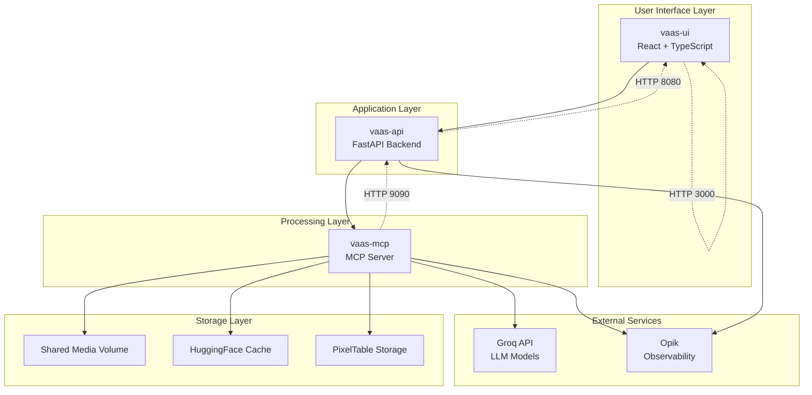
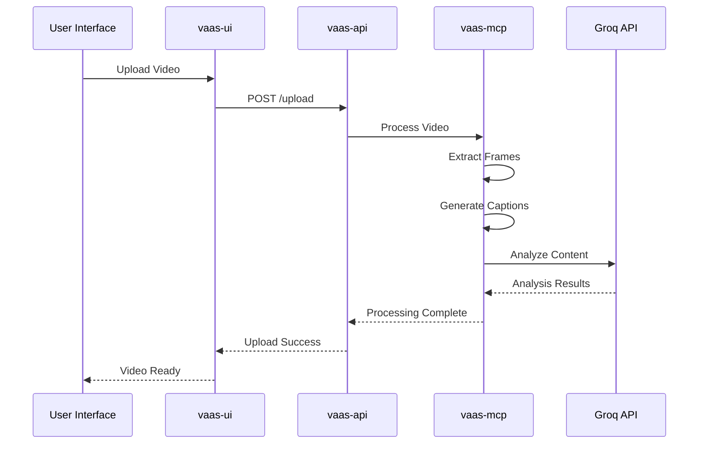

# Getting Started Guide

<cite>
**Referenced Files in This Document**
- [GETTING_STARTED.md](file://GETTING_STARTED.md)
- [docker-compose.yml](file://docker-compose.yml)
- [Makefile](file://Makefile)
- [vaas-mcp/README.md](file://vaas-mcp/README.md)
- [vaas-api/README.md](file://vaas-api/README.md)
- [vaas-ui/README.md](file://vaas-ui/README.md)
- [vaas-mcp/.env.example](file://vaas-mcp/.env.example)
- [vaas-api/.env.example](file://vaas-api/.env.example)
- [vaas-mcp/Makefile](file://vaas-mcp/Makefile)
- [vaas-api/Makefile](file://vaas-api/Makefile)
- [vaas-ui/package.json](file://vaas-ui/package.json)
- [vaas-mcp/pyproject.toml](file://vaas-mcp/pyproject.toml)
- [vaas-api/pyproject.toml](file://vaas-api/pyproject.toml)
- [vaas-api/src/vaas_api/config.py](file://vaas-api/src/vaas_api/config.py)
</cite>

## Table of Contents
1. [Introduction](#introduction)
2. [Prerequisites](#prerequisites)
3. [System Architecture Overview](#system-architecture-overview)
4. [Step-by-Step Setup Guide](#step-by-step-setup-guide)
5. [Environment Configuration](#environment-configuration)
6. [Starting the System](#starting-the-system)
7. [Verification and Testing](#verification-and-testing)
8. [Quick Demo Scenario](#quick-demo-scenario)
9. [Troubleshooting Guide](#troubleshooting-guide)
10. [Advanced Configuration](#advanced-configuration)
11. [Conclusion](#conclusion)

## Introduction

vaas is a sophisticated multimodal AI system designed for video processing and analysis. The platform consists of three interconnected components that work together to provide a comprehensive video intelligence solution:

- **MCP Server** (vaas-mcp): Handles video ingestion, processing, and tool management
- **Agent API** (vaas-api): Provides a FastAPI interface for agent interactions
- **UI** (vaas-ui): Offers an intuitive chat interface for user interaction

This Getting Started Guide will walk you through the complete setup process, from initial installation to running your first video analysis.

## Prerequisites

Before beginning the setup, ensure you have the following prerequisites installed on your system:

### Essential Software Requirements

1. **Docker and Docker Compose**
   - Docker Engine (latest stable version)
   - Docker Compose plugin
   - Minimum 8GB RAM available for containers
   - Sufficient disk space for video processing

2. **Python Package Manager**
   - **uv** (recommended) - Python package manager
   - Alternative: pip or poetry
   - Python 3.12+ required

3. **Node.js Environment**
   - Node.js 18+ for UI development
   - npm or yarn package manager

4. **API Keys**
   - **Groq API Key**: For LLM model access
   - **OpenAI API Key**: For image captioning and embeddings
   - **Opik API Key**: For observability and monitoring

### Hardware Requirements

- **Minimum RAM**: 8GB
- **Recommended RAM**: 16GB+
- **Storage**: 50GB free space
- **Network**: Stable internet connection for API calls

## System Architecture Overview

The vaas system operates as a distributed microservices architecture with three main components communicating through well-defined interfaces.



**Diagram sources**
- [docker-compose.yml](file://docker-compose.yml#L1-L67)
- [vaas-mcp/README.md](file://vaas-mcp/README.md#L1-L50)
- [vaas-api/README.md](file://vaas-api/README.md#L1-L50)

### Component Responsibilities

**MCP Server (Port 9090)**:
- Video ingestion and preprocessing
- Tool registration and management
- Prompt engineering and template management
- HuggingFace model caching

**Agent API (Port 8080)**:
- RESTful API endpoints
- Request routing and validation
- Integration with Groq models
- Session management and persistence

**UI (Port 3000)**:
- User-friendly chat interface
- Video upload and management
- Real-time message display
- Responsive design for various devices

**Section sources**
- [docker-compose.yml](file://docker-compose.yml#L1-L67)
- [GETTING_STARTED.md](file://GETTING_STARTED.md#L1-L20)

## Step-by-Step Setup Guide

### Step 1: Clone the Repository

Begin by cloning the multimodal-agents-course repository to your local machine:

```bash
git clone https://github.com/multi-modal-ai/multimodal-agents-course.git
cd multimodal-agents-course
```

Verify the successful clone by checking the directory structure:

```bash
ls -la
```

Expected output should show the three main directories: `vaas-mcp`, `vaas-api`, and `vaas-ui`.

### Step 2: Install uv Package Manager

vaas uses **uv** as its primary Python package manager. Install uv using the official installation script:

```bash
curl -Ls "https://astral.sh/uv/install.sh" | sh
```

Or follow the [official installation guide](https://docs.astral.sh/uv/getting-started/installation/) for your specific operating system.

Verify the installation:

```bash
uv --version
```

Expected output: `uv 0.x.x`

### Step 3: Set Up the MCP Server

Navigate to the MCP server directory and follow the setup instructions:

```bash
cd vaas-mcp
```

#### Environment Setup

Create and configure the environment file:

```bash
cp .env.example .env
```

Edit the `.env` file with your API keys:

```bash
# OpenAI API for image processing
OPENAI_API_KEY=your_openai_api_key_here

# Opik for observability
OPIK_API_KEY=your_opik_api_key_here
OPIK_WORKSPACE=your_workspace_name
OPIK_PROJECT=vaas-mcp
```

#### Local Development (Optional)

For local development without Docker:

```bash
# Create virtual environment
uv venv .venv

# Activate environment
source .venv/bin/activate  # Linux/macOS
# or
. .\.venv\Scripts\Activate.ps1  # Windows

# Install dependencies
uv pip install -e .

# Verify Python version
uv run python --version
```

Expected output: `Python 3.12.8`

### Step 4: Set Up the Agent API

Move to the API server directory:

```bash
cd ../vaas-api
```

#### Environment Configuration

Copy and edit the API environment file:

```bash
cp .env.example .env
```

Configure the API environment:

```bash
# Groq API for LLM models
GROQ_API_KEY=your_groq_api_key_here

# Opik for observability
OPIK_API_KEY=your_opik_api_key_here
OPIK_PROJECT=vaas-api
```

#### Local Development (Optional)

Similar to MCP server setup:

```bash
# Create virtual environment
uv venv .venv

# Activate environment
source .venv/bin/activate

# Install dependencies
uv pip install -e .

# Verify Python version
uv run python --version
```

### Step 5: UI Setup

Navigate to the UI directory:

```bash
cd ../vaas-ui
```

Install Node.js dependencies:

```bash
npm install
```

Build the production version (optional):

```bash
npm run build
```

**Section sources**
- [GETTING_STARTED.md](file://GETTING_STARTED.md#L21-L57)
- [vaas-mcp/README.md](file://vaas-mcp/README.md#L25-L60)
- [vaas-api/README.md](file://vaas-api/README.md#L25-L60)
- [vaas-ui/README.md](file://vaas-ui/README.md#L10-L20)

## Environment Configuration

Proper environment configuration is crucial for the system to function correctly. Each component requires specific environment variables.

### Global Environment Variables

The root Makefile enforces environment validation:

```makefile
ifeq (,$(wildcard .env))
$(error .env file is missing at . Please create one based on .env.example)
endif
```

### Component-Specific Configuration

#### MCP Server Environment Variables

```bash
# Required for video processing
OPENAI_API_KEY=sk-your-openai-key-here

# Opik configuration for observability
OPIK_API_KEY=opik-your-api-key-here
OPIK_WORKSPACE=your-workspace-name
OPIK_PROJECT=vaas-mcp

# HuggingFace cache location
HF_HOME=/root/.cache/huggingface
```

#### Agent API Environment Variables

```bash
# Groq API for LLM models
GROQ_API_KEY=gsk_your-groq-key-here

# Opik configuration
OPIK_API_KEY=opik-your-api-key-here
OPIK_PROJECT=vaas-api

# Disable nest asyncio for compatibility
DISABLE_NEST_ASYNCIO=True

# Model configurations
GROQ_ROUTING_MODEL=meta-llama/llama-4-scout-17b-16e-instruct
GROQ_TOOL_USE_MODEL=meta-llama/llama-4-maverick-17b-128e-instruct
GROQ_IMAGE_MODEL=meta-llama/llama-4-maverick-17b-128e-instruct
GROQ_GENERAL_MODEL=meta-llama/llama-4-maverick-17b-128e-instruct

# Memory configuration
AGENT_MEMORY_SIZE=20

# MCP server endpoint
MCP_SERVER=http://vaas-mcp:9090/mcp
```

### Docker Compose Network Configuration

The system uses a dedicated Docker network for secure communication:

```yaml
networks:
  agent-network:
    name: agent-network

volumes:
  shared_media:
    name: shared_media
```

**Section sources**
- [Makefile](file://Makefile#L1-L15)
- [vaas-api/src/vaas_api/config.py](file://vaas-api/src/vaas_api/config.py#L1-L41)
- [docker-compose.yml](file://docker-compose.yml#L50-L67)

## Starting the System

### Using Docker Compose (Recommended)

The simplest way to start the entire system is using the provided Makefile commands:

```bash
# Build and start all services
make start-vaas
```

This command performs several actions:
1. Builds Docker images for all components
2. Starts containers in detached mode
3. Creates necessary networks and volumes
4. Configures port mappings

### Manual Docker Compose

For more control, you can use Docker Compose directly:

```bash
# Build and start services
docker compose up --build -d

# View service logs
docker compose logs -f vaas-mcp
docker compose logs -f vaas-api
docker compose logs -f vaas-ui
```

### Container Status Verification

Monitor the container startup process:

```bash
# Check running containers
docker ps

# Expected containers:
# vaas-mcp     (port 9090)
# vaas-api     (port 8080)
# vaas-ui      (port 3000)
```

### Service Dependencies

The system follows a specific startup order:
1. **MCP Server** (vaas-mcp) - First to initialize
2. **Agent API** (vaas-api) - Depends on MCP Server
3. **UI** (vaas-ui) - Depends on both MCP Server and Agent API

**Section sources**
- [Makefile](file://Makefile#L8-L15)
- [docker-compose.yml](file://docker-compose.yml#L1-L67)

## Verification and Testing

### Accessing the User Interface

Once all services are running, access the vaas UI at:

```
http://localhost:3000
```

Expected UI components:
- **Chat Interface**: Main interaction area
- **Video Sidebar**: Uploaded video management
- **Upload Button**: Add new videos
- **Message Input**: Type your queries

### API Endpoint Testing

Test the Agent API endpoints:

```bash
# Check API health
curl http://localhost:8080/health

# View API documentation
open http://localhost:8080/docs
```

### Functional Testing

Verify core functionality by testing each component:

```bash
# Test MCP Server connectivity
curl http://localhost:9090/mcp/tools

# Test Agent API connectivity
curl http://localhost:8080/api/agents
```

### Log Monitoring

Monitor system logs for any errors:

```bash
# Monitor all services
docker compose logs -f

# Monitor specific service
docker compose logs -f vaas-mcp
```

**Section sources**
- [GETTING_STARTED.md](file://GETTING_STARTED.md#L50-L57)

## Quick Demo Scenario

Let's walk through a complete demonstration to showcase vaas's capabilities.

### Step 1: Upload a Sample Video

1. Navigate to the UI at `http://localhost:3000`
2. Click the "Upload Video" button
3. Select a sample video file (or use the preloaded `pass_the_butter_rick_and_morty.mp4`)
4. Wait for the upload to complete

### Step 2: Process the Video

The system automatically processes the uploaded video:



**Diagram sources**
- [vaas-mcp/README.md](file://vaas-mcp/README.md#L70-L85)

### Step 3: Ask Questions About the Video

1. Click on the uploaded video in the sidebar
2. Type a question like:
   - "What happens in this video?"
   - "Who are the main characters?"
   - "What's the main plot?"

3. The system will analyze the video content and provide a response

### Step 4: Review the Results

Expected outcomes:
- **Response Quality**: Accurate video analysis
- **Processing Speed**: Sub-second response time
- **Interface**: Clean, responsive UI

### Step 5: Explore Advanced Features

Try these advanced scenarios:
- **Multi-Video Analysis**: Upload multiple videos and compare
- **Temporal Queries**: Ask about specific time segments
- **Character Tracking**: Identify character appearances
- **Scene Analysis**: Get scene-by-scene breakdowns

**Section sources**
- [vaas-mcp/README.md](file://vaas-mcp/README.md#L70-L90)

## Troubleshooting Guide

Common issues and their solutions during the setup process.

### Port Conflicts

**Issue**: Ports 3000, 8080, or 9090 are already in use.

**Solution**:
```bash
# Check which process is using the port
lsof -i :3000
lsof -i :8080
lsof -i :9090

# Kill the conflicting process
kill -9 <PID>

# Or change port mappings in docker-compose.yml
```

### Missing Environment Variables

**Issue**: `.env` file not found or missing required variables.

**Solution**:
```bash
# Create .env file from example
cp .env.example .env

# Edit and add required API keys
nano .env

# Verify file exists
ls -la .env
```

### Container Startup Failures

**Issue**: Containers fail to start or crash immediately.

**Diagnostic Commands**:
```bash
# Check container status
docker ps -a

# View container logs
docker logs <container_name>

# Inspect container configuration
docker inspect <container_name>
```

**Common Solutions**:
- **Insufficient Memory**: Increase Docker memory allocation
- **Network Issues**: Check firewall settings
- **Volume Permissions**: Fix ownership issues

### API Connectivity Issues

**Issue**: Cannot connect to API endpoints.

**Diagnostic Steps**:
```bash
# Test internal connectivity
docker exec vaas-api curl http://vaas-mcp:9090/mcp/tools

# Check service health
curl http://localhost:8080/health

# Verify port forwarding
netstat -tlnp | grep 8080
```

### Video Processing Problems

**Issue**: Videos fail to process or produce errors.

**Solutions**:
```bash
# Convert video format if needed
make fix-video-format input=your_video.mp4 output=converted_video.mp4

# Check video codec compatibility
ffprobe your_video.mp4

# Verify shared volume mounting
docker exec vaas-mcp ls -la /app/shared_media
```

### Performance Issues

**Issue**: Slow response times or high resource usage.

**Optimization Steps**:
```bash
# Monitor resource usage
docker stats

# Increase container resources
# Edit docker-compose.yml CPU/memory limits

# Clear caches
docker system prune -a
```

### Opik Configuration Issues

**Issue**: Observability features not working.

**Solution**:
```bash
# Verify Opik configuration
echo $OPIK_API_KEY
echo $OPIK_PROJECT

# Check Opik connectivity
curl -I https://www.opik.ai
```

**Section sources**
- [docker-compose.yml](file://docker-compose.yml#L20-L35)
- [vaas-mcp/Makefile](file://vaas-mcp/Makefile#L25-L42)

## Advanced Configuration

### Customizing Docker Resources

Adjust container resource allocations in `docker-compose.yml`:

```yaml
deploy:
  resources:
    limits:
      cpus: '4'
      memory: 4G
    reservations:
      cpus: '2'
      memory: 2G
```

### Environment Variable Overrides

Create a `.env.local` file for development overrides:

```bash
# Development-specific settings
DEBUG=true
LOG_LEVEL=DEBUG

# Custom model configurations
CUSTOM_MODEL_PATH=/custom/models
```

### Network Configuration

Modify network settings for specific deployment scenarios:

```yaml
networks:
  agent-network:
    driver: bridge
    ipam:
      config:
        - subnet: 172.20.0.0/16
```

### Volume Management

Customize volume mounts for persistent storage:

```yaml
volumes:
  shared_media:
    driver: local
    driver_opts:
      type: nfs
      o: addr=192.168.1.1,rw
      device: ":/shared_media"
```

### Model Configuration

Override default model settings in the API configuration:

```python
# In vaas-api/src/vaas_api/config.py
GROQ_ROUTING_MODEL = "custom-model-name"
GROQ_TOOL_USE_MODEL = "another-custom-model"
```

**Section sources**
- [docker-compose.yml](file://docker-compose.yml#L20-L35)
- [vaas-api/src/vaas_api/config.py](file://vaas-api/src/vaas_api/config.py#L10-L25)

## Conclusion

Congratulations! You've successfully set up the vaas multimodal agents system. This Getting Started Guide has covered:

### What You've Achieved

- **Complete System Setup**: Successfully deployed all three components
- **Environment Configuration**: Properly configured API keys and environment variables
- **Functional Testing**: Verified system operation through the UI and API
- **Troubleshooting Skills**: Learned to diagnose and resolve common issues

### Next Steps

1. **Explore Advanced Features**: Try multi-video analysis and temporal queries
2. **Customize Configuration**: Adjust resource allocations and model settings
3. **Integrate with Other Systems**: Connect vaas with your existing workflows
4. **Contribute to Development**: Participate in the open-source community

### System Architecture Recap

The vaas system demonstrates a modern microservices architecture with:

- **Clean Separation of Concerns**: Each component has distinct responsibilities
- **Containerized Deployment**: Easy scaling and maintenance
- **API-First Design**: Well-defined interfaces between components
- **Observability Integration**: Comprehensive monitoring and logging

### Best Practices

- **Resource Management**: Monitor container resource usage
- **Security**: Keep API keys secure and rotate regularly
- **Backup**: Regular backups of processed video data
- **Updates**: Stay current with component updates and patches

### Support and Community

For additional help and support:

- **Documentation**: Refer to individual component README files
- **Community Forums**: Join discussions on GitHub issues
- **Contributions**: Contribute improvements and bug fixes
- **Professional Support**: Contact the development team for enterprise support

The vaas system represents a powerful foundation for video intelligence applications. With this setup, you're ready to explore the full potential of multimodal AI processing and analysis.