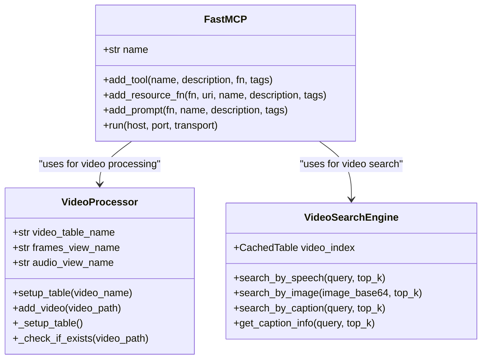
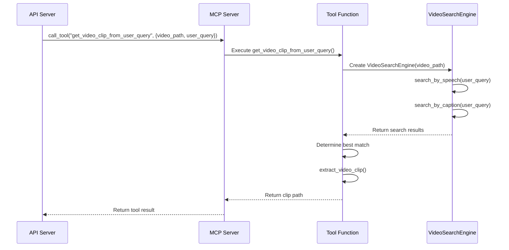
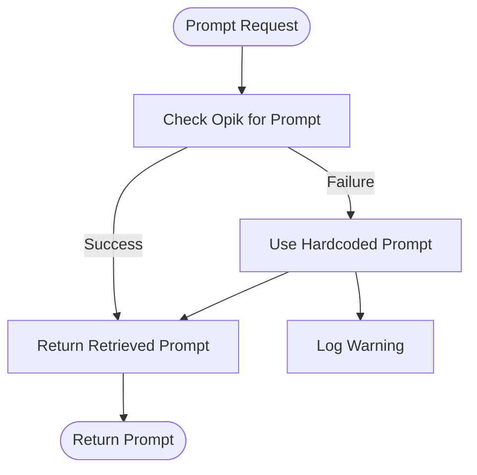
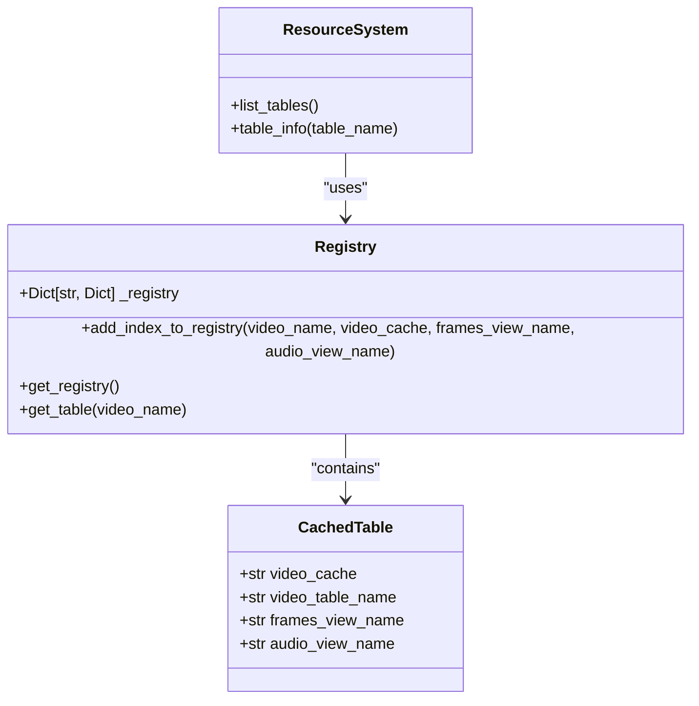
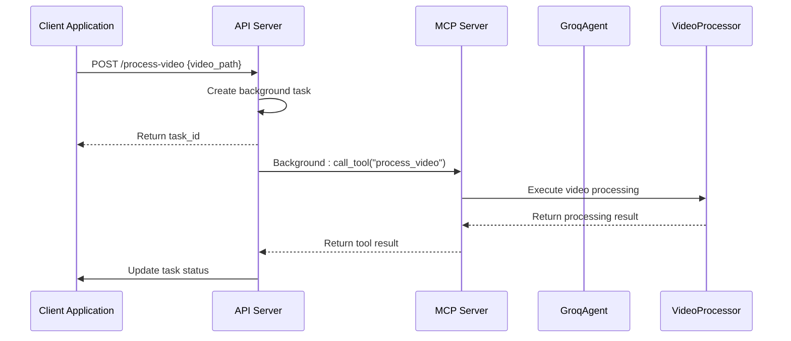
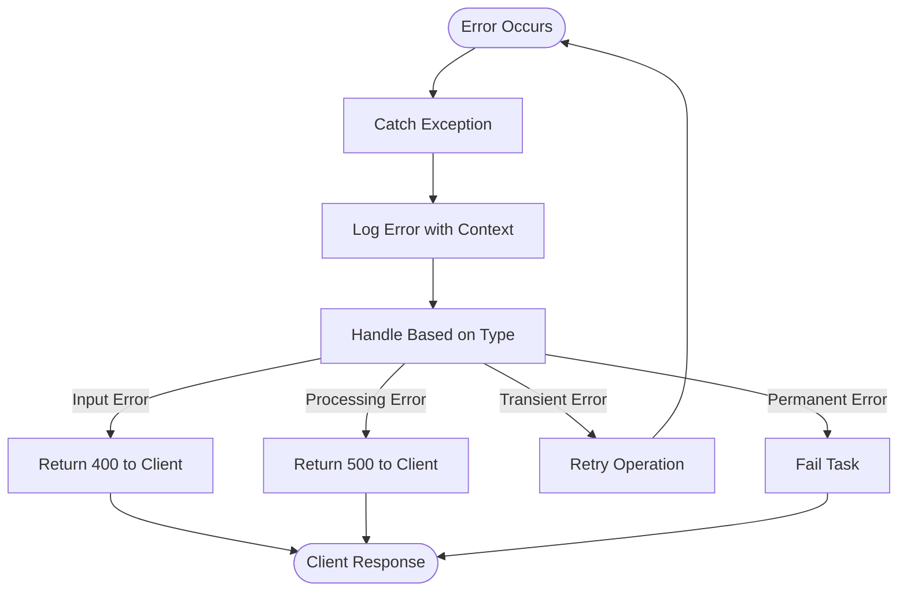

# MCP Server Interface

<cite>
**Referenced Files in This Document**   
- [server.py](file://vaas-mcp/src/vaas_mcp/server.py)
- [tools.py](file://vaas-mcp/src/vaas_mcp/tools.py)
- [prompts.py](file://vaas-mcp/src/vaas_mcp/prompts.py)
- [resources.py](file://vaas-mcp/src/vaas_mcp/resources.py)
- [video/ingestion/tools.py](file://vaas-mcp/src/vaas_mcp/video/ingestion/tools.py)
- [video/ingestion/video_processor.py](file://vaas-mcp/src/vaas_mcp/video/ingestion/video_processor.py)
- [video/video_search_engine.py](file://vaas-mcp/src/vaas_mcp/video/video_search_engine.py)
- [config.py](file://vaas-mcp/src/vaas_mcp/config.py)
- [api.py](file://vaas-api/src/vaas_api/api.py)
- [agent/groq/groq_agent.py](file://vaas-api/src/vaas_api/agent/groq/groq_agent.py)
</cite>

## Table of Contents
1. [Introduction](#introduction)
2. [MCP Implementation with FastMCP](#mcp-implementation-with-fastmcp)
3. [Tool Management System](#tool-management-system)
4. [Available Tools and Their Specifications](#available-tools-and-their-specifications)
5. [Prompt Management System](#prompt-management-system)
6. [Resource System](#resource-system)
7. [API Server Integration](#api-server-integration)
8. [Best Practices for Tool Design](#best-practices-for-tool-design)
9. [Error Handling and Debugging](#error-handling-and-debugging)
10. [Security Considerations](#security-considerations)
11. [Conclusion](#conclusion)

## Introduction
The vaas-MCP service implements the Model Context Protocol (MCP) using FastMCP to enable standardized tool calling for video processing operations. This document provides comprehensive documentation of the MCP Server Interface, detailing how tools are registered, how prompts are managed, and how external resources are accessed. The system enables AI agents to perform complex video analysis tasks through a well-defined interface that standardizes interactions between the agent and video processing capabilities.

The architecture follows a modular design where the MCP server exposes tools for video processing, maintains versioned prompts for different operational modes, and manages access to external data sources through a resource system. This design allows for flexible integration with AI agents while maintaining clear separation of concerns between different functional components.

**Section sources**
- [server.py](file://vaas-mcp/src/vaas_mcp/server.py#L1-L97)
- [README.md](file://vaas-mcp/README.md#L1-L118)

## MCP Implementation with FastMCP

The vaas-MCP service implements the Model Context Protocol (MCP) using the FastMCP framework to provide standardized tool calling capabilities for video processing operations. The implementation centers around the `FastMCP` class which serves as the core server that exposes tools, prompts, and resources to client applications.

The MCP server is initialized with a service name "VideoProcessor" and configured through three main registration functions: `add_mcp_tools`, `add_mcp_resources`, and `add_mcp_prompts`. These functions register the available functionality that can be accessed by AI agents through the MCP protocol. The server supports multiple transport protocols with streamable-http as the default, allowing for flexible deployment options.



**Diagram sources**
- [server.py](file://vaas-mcp/src/vaas_mcp/server.py#L1-L97)
- [video/ingestion/video_processor.py](file://vaas-mcp/src/vaas_mcp/video/ingestion/video_processor.py#L1-L205)
- [video/video_search_engine.py](file://vaas-mcp/src/vaas_mcp/video/video_search_engine.py#L1-L168)

**Section sources**
- [server.py](file://vaas-mcp/src/vaas_mcp/server.py#L1-L97)
- [config.py](file://vaas-mcp/src/vaas_mcp/config.py#L1-L56)

## Tool Management System

The tool management system in vaas-MCP follows a structured approach for registering and exposing functionality to AI agents. Tools are registered using the `add_tool` method of the FastMCP server, which requires four parameters: name, description, function reference, and tags. This standardized registration process ensures that all tools are consistently documented and categorized.

The system organizes tools around video processing operations, with each tool designed to perform a specific, well-defined function. Tools are implemented as standalone functions that can be easily tested and maintained independently. The registration process in `server.py` demonstrates this pattern, where four primary tools are registered: `process_video`, `get_video_clip_from_user_query`, `get_video_clip_from_image`, and `ask_question_about_video`.

Each tool function follows a consistent signature pattern, accepting parameters as keyword arguments and returning structured responses. The implementation leverages type hints and comprehensive docstrings to ensure clarity about expected inputs and outputs. Error handling is implemented at the tool level, with appropriate exceptions raised for invalid inputs or processing failures.



**Diagram sources**
- [server.py](file://vaas-mcp/src/vaas_mcp/server.py#L20-L50)
- [tools.py](file://vaas-mcp/src/vaas_mcp/tools.py#L1-L105)
- [video/video_search_engine.py](file://vaas-mcp/src/vaas_mcp/video/video_search_engine.py#L1-L168)

**Section sources**
- [server.py](file://vaas-mcp/src/vaas_mcp/server.py#L20-L50)
- [tools.py](file://vaas-mcp/src/vaas_mcp/tools.py#L1-L105)

## Available Tools and Their Specifications

The vaas-MCP service provides four primary tools for video processing operations, each designed to handle specific types of queries and operations. These tools are implemented as Python functions and registered with the FastMCP server to be accessible through the MCP protocol.

### process_video Tool
This tool processes a video file and prepares it for searching by creating a structured index of its content. It takes a video path as input and returns a success message upon completion.

**: Parameters**
- `video_path` (str): Path to the video file to process

**: Return Type**
- `str`: Success message indicating the video was processed

**: Side Effects**
- Creates a video index in PixelTable
- Extracts audio and generates transcripts
- Processes video frames and generates captions
- Creates embedding indexes for search operations

**: Error Handling**
- Raises `ValueError` if the video file cannot be found or processed

### get_video_clip_from_user_query Tool
This tool retrieves a video clip based on a user query by searching through speech and caption content. It combines results from multiple modalities to find the most relevant clip.

**: Parameters**
- `video_path` (str): Path to the video file
- `user_query` (str): Query to search for in the video content

**: Return Type**
- `str`: Path to the extracted video clip

**: Side Effects**
- Creates a new video clip file in the shared media directory
- Uses FFmpeg to extract the clip with specified start and end times

### get_video_clip_from_image Tool
This tool finds video clips similar to a provided image by comparing the image to video frames using CLIP embeddings.

**: Parameters**
- `video_path` (str): Path to the video file
- `user_image` (str): Query image encoded in base64 format

**: Return Type**
- `str`: Path to the extracted video clip

**: Side Effects**
- Decodes the base64 image
- Searches for similar frames in the video
- Creates a new video clip file in the shared media directory

### ask_question_about_video Tool
This tool answers questions about video content by retrieving relevant captions and returning them as context.

**: Parameters**
- `video_path` (str): Path to the video file
- `user_query` (str): Question to search for relevant captions

**: Return Type**
- `str`: Concatenated relevant captions from the video

**: Side Effects**
- Searches caption embeddings for similarity to the query
- Returns top-k matching captions as context for the agent

**Section sources**
- [tools.py](file://vaas-mcp/src/vaas_mcp/tools.py#L1-L105)
- [video/ingestion/tools.py](file://vaas-mcp/src/vaas_mcp/video/ingestion/tools.py#L1-L155)
- [video/video_search_engine.py](file://vaas-mcp/src/vaas_mcp/video/video_search_engine.py#L1-L168)

## Prompt Management System

The prompt management system in vaas-MCP provides versioned prompts that guide the behavior of AI agents when interacting with the video processing tools. Prompts are stored and managed through the Opik platform, with fallback to hardcoded values if the Opik service is unavailable.

The system implements three primary prompts that serve different purposes in the agent workflow:

### routing_system_prompt
This prompt determines whether a user query requires tool usage. It evaluates the conversation history to decide if the user needs help with video operations such as extracting clips or retrieving information.

**: Purpose**
- Determine if tool usage is required
- Route queries to appropriate processing path

**: Content Structure**
- Boolean output indicating tool usage requirement
- Evaluation of user needs for video operations

### tool_use_system_prompt
This prompt guides the agent in selecting the appropriate tool for a given query. It provides clear instructions on which tool to use based on the nature of the request and whether an image is provided.

**: Purpose**
- Determine which tool to use based on user query
- Provide decision rules for tool selection

**: Content Structure**
- Tool descriptions and usage guidelines
- Decision rules (e.g., use 'get_video_clip_from_image' when image is provided)
- Dynamic variables (is_image_provided)

### general_system_prompt
This prompt defines the general behavior and personality of the assistant when not using tools. It establishes the assistant's identity and conversational style.

**: Purpose**
- Define assistant personality and behavior
- Provide engaging conversational context

**: Content Structure**
- Assistant identity (inspired by Stanley vaas)
- Film knowledge and references
- Conversational style guidelines

The prompt system follows a retrieval pattern where prompts are first attempted to be fetched from Opik using a unique identifier. If retrieval fails, the system falls back to hardcoded prompt content to ensure availability. This approach enables prompt versioning and management through Opik while maintaining reliability through local fallbacks.



**Diagram sources**
- [prompts.py](file://vaas-mcp/src/vaas_mcp/prompts.py#L1-L109)
- [server.py](file://vaas-mcp/src/vaas_mcp/server.py#L53-L68)

**Section sources**
- [prompts.py](file://vaas-mcp/src/vaas_mcp/prompts.py#L1-L109)

## Resource System

The resource system in vaas-MCP provides access to external data sources and metadata about available video indexes. Resources are registered with the MCP server using the `add_resource_fn` method, which exposes functions as accessible resources with associated metadata.

The primary resource function is `list_tables`, which returns information about all video indexes currently available for processing. This function queries the registry to discover existing video indexes and returns structured information about them.

**: Resource Function**
- `list_tables()`: Lists all video indexes currently available

**: Parameters**
- None

**: Return Type**
- `Dict[str, str]`: Dictionary containing message and indexes keys

**: Response Structure**
```json
{
  "message": "Current processed videos",
  "indexes": ["video1.mp4", "video2.mp4"]
}
```

The resource system also includes the `table_info` function, which provides detailed information about a specific video index. This function retrieves metadata from the registry and returns a description of the table structure and properties.

The resource system integrates with the video processing pipeline by maintaining a registry of processed videos. This registry is implemented in `video/ingestion/registry.py` and stores metadata about each processed video, including cache locations, view names, and processing status. The registry enables efficient lookup of video indexes and prevents redundant processing of the same video.



**Diagram sources**
- [resources.py](file://vaas-mcp/src/vaas_mcp/resources.py#L1-L40)
- [video/ingestion/registry.py](file://vaas-mcp/src/vaas_mcp/video/ingestion/registry.py)

**Section sources**
- [resources.py](file://vaas-mcp/src/vaas_mcp/resources.py#L1-L40)
- [video/ingestion/registry.py](file://vaas-mcp/src/vaas_mcp/video/ingestion/registry.py)

## API Server Integration

The API server integrates with the MCP server through the FastMCP client library, enabling standardized communication between the application and video processing tools. The integration is implemented in the `api.py` file of the vaas-api service, which uses the `fastmcp.client.Client` to connect to the MCP server.

The primary integration points include:

### Tool Execution
The API server executes MCP tools through the `call_tool` method of the FastMCP client. This is demonstrated in the `/process-video` endpoint, where the `process_video` tool is called with the video path parameter.

**: Example Implementation**
```python
mcp_client = Client(settings.MCP_SERVER)
async with mcp_client:
    _ = await mcp_client.call_tool("process_video", {"video_path": request.video_path})
```

### Agent Integration
The GroqAgent class in the vaas-api service integrates with the MCP server to enable tool calling within the agent workflow. The agent discovers available tools and executes them as needed based on user queries.

**: Agent Tool Execution Flow**
1. Discover available tools from MCP server
2. Transform tool definitions for Groq API compatibility
3. Execute tool calls with appropriate parameters
4. Process tool responses and incorporate into agent response

The integration follows a background task pattern for long-running operations like video processing. The `/process-video` endpoint enqueues the processing task and returns immediately with a task ID, allowing the client to check the status asynchronously.



**Diagram sources**
- [api.py](file://vaas-api/src/vaas_api/api.py#L1-L198)
- [agent/groq/groq_agent.py](file://vaas-api/src/vaas_api/agent/groq/groq_agent.py#L1-L237)

**Section sources**
- [api.py](file://vaas-api/src/vaas_api/api.py#L1-L198)
- [agent/groq/groq_agent.py](file://vaas-api/src/vaas_api/agent/groq/groq_agent.py#L1-L237)

## Best Practices for Tool Design

The vaas-MCP service demonstrates several best practices for designing effective tools within the Model Context Protocol framework. These practices ensure that tools are reliable, maintainable, and provide a consistent experience for AI agents.

### Single Responsibility Principle
Each tool should have a single, well-defined purpose. The existing tools follow this principle:
- `process_video`: Handles video ingestion and indexing
- `get_video_clip_from_user_query`: Retrieves clips based on text queries
- `get_video_clip_from_image`: Retrieves clips based on image similarity
- `ask_question_about_video`: Answers questions using video context

### Clear Parameter Definitions
Tools should have clearly defined parameters with appropriate type hints and documentation. The tools in vaas-MCP use Python type hints and comprehensive docstrings to document expected inputs.

### Idempotent Operations
Where possible, tools should be idempotent, meaning multiple calls with the same parameters produce the same result without side effects. The `process_video` tool demonstrates this by checking if a video index already exists before processing.

### Consistent Error Handling
Tools should implement consistent error handling patterns, raising appropriate exceptions for different error conditions. The tools use `ValueError` for input validation errors and custom error messages for processing failures.

### Side Effect Documentation
All side effects should be clearly documented, including file system changes, network operations, and state modifications. The tools in vaas-MCP create files in the shared media directory and modify the video registry.

### Performance Considerations
Long-running operations should be designed with performance in mind:
- Use efficient algorithms and data structures
- Implement caching where appropriate
- Minimize I/O operations
- Use streaming for large data transfers

### Security Considerations
Tools should validate inputs and sanitize outputs to prevent security vulnerabilities:
- Validate file paths to prevent directory traversal
- Sanitize user inputs to prevent injection attacks
- Implement proper authentication and authorization
- Limit resource usage to prevent denial of service

**Section sources**
- [tools.py](file://vaas-mcp/src/vaas_mcp/tools.py#L1-L105)
- [video/ingestion/tools.py](file://vaas-mcp/src/vaas_mcp/video/ingestion/tools.py#L1-L155)
- [video/ingestion/video_processor.py](file://vaas-mcp/src/vaas_mcp/video/ingestion/video_processor.py#L1-L205)

## Error Handling and Debugging

The vaas-MCP service implements comprehensive error handling and debugging capabilities to ensure reliability and facilitate troubleshooting. The system uses structured logging with the loguru library to provide detailed information about operations and errors.

### Error Handling Patterns

#### Tool-Level Error Handling
Each tool implements appropriate error handling for its specific operations:
- Input validation with descriptive error messages
- Exception handling for external dependencies
- Graceful degradation when optional features fail

**: Example from process_video**
```python
def process_video(video_path: str) -> str:
    exists = video_processor._check_if_exists(video_path)
    if exists:
        logger.info(f"Video index for '{video_path}' already exists...")
        return False
    # ... processing logic
```

#### Client-Side Error Handling
The API server implements robust error handling for MCP client operations:
- Try-except blocks around tool calls
- HTTP exception mapping for client responses
- Background task error handling with status updates

**: Example from API server**
```python
try:
    mcp_client = Client(settings.MCP_SERVER)
    async with mcp_client:
        _ = await mcp_client.call_tool("process_video", {"video_path": request.video_path})
except Exception as e:
    logger.error(f"Error processing video {video_path}: {e}")
    bg_task_states[task_id] = TaskStatus.FAILED
    raise HTTPException(status_code=500, detail=str(e))
```

### Debugging Capabilities

#### Structured Logging
The system uses loguru for structured logging with context binding:
- Named loggers for different components
- Context information in log messages
- Different log levels for various severity levels

#### Opik Integration
The system integrates with Opik for monitoring and debugging:
- Trace tool usage and prompt retrieval
- Monitor agent decision-making process
- Version and compare prompts

#### Health Monitoring
The system provides several mechanisms for monitoring health:
- Task status endpoint for background operations
- Docker container inspection
- Log monitoring for error patterns



**Diagram sources**
- [tools.py](file://vaas-mcp/src/vaas_mcp/tools.py#L1-L105)
- [api.py](file://vaas-api/src/vaas_api/api.py#L1-L198)
- [prompts.py](file://vaas-mcp/src/vaas_mcp/prompts.py#L1-L109)

**Section sources**
- [tools.py](file://vaas-mcp/src/vaas_mcp/tools.py#L1-L105)
- [api.py](file://vaas-api/src/vaas_api/api.py#L1-L198)
- [prompts.py](file://vaas-mcp/src/vaas_mcp/prompts.py#L1-L109)

## Security Considerations

The vaas-MCP service must address several security considerations when exposing tools to AI agents, particularly given the sensitive nature of video processing operations and file system access.

### Input Validation
All inputs to tools should be rigorously validated to prevent security vulnerabilities:
- Validate video paths to prevent directory traversal attacks
- Sanitize user queries to prevent injection attacks
- Validate image data to prevent malformed input processing

**: Example from get_video_clip_from_image**
```python
def get_video_clip_from_image(video_path: str, user_image: str) -> str:
    # Validate video_path is within allowed directories
    # Validate user_image is proper base64 encoded data
    # Validate decoded image is within size and format limits
```

### Authentication and Authorization
The MCP server should implement proper authentication and authorization mechanisms:
- Require API keys for server access
- Implement role-based access control for tools
- Limit tool access based on user permissions

### File System Security
Given the file operations performed by the tools:
- Restrict file access to designated directories
- Implement proper file naming to prevent conflicts
- Clean up temporary files after processing
- Monitor disk usage to prevent denial of service

### Resource Limitation
To prevent resource exhaustion:
- Limit video processing duration
- Restrict clip extraction length
- Implement rate limiting for tool calls
- Monitor memory and CPU usage

### Data Privacy
When processing videos that may contain sensitive content:
- Implement data encryption at rest and in transit
- Provide data retention policies
- Implement proper access logging
- Support data deletion requests

### Secure Dependencies
Ensure all dependencies are secure:
- Keep dependencies updated
- Monitor for known vulnerabilities
- Use trusted sources for packages
- Implement dependency pinning

The current implementation should be enhanced with these security measures to ensure safe operation in production environments, particularly when exposed to untrusted users or inputs.

**Section sources**
- [tools.py](file://vaas-mcp/src/vaas_mcp/tools.py#L1-L105)
- [video/ingestion/tools.py](file://vaas-mcp/src/vaas_mcp/video/ingestion/tools.py#L1-L155)
- [config.py](file://vaas-mcp/src/vaas_mcp/config.py#L1-L56)

## Conclusion
The vaas-MCP service provides a robust implementation of the Model Context Protocol for video processing operations. By leveraging FastMCP, the system standardizes tool calling, prompt management, and resource access, enabling AI agents to perform complex video analysis tasks through a well-defined interface.

The architecture demonstrates several key design principles:
- Clear separation of concerns between tools, prompts, and resources
- Consistent tool design with single responsibility and clear interfaces
- Robust error handling and debugging capabilities
- Integration with external systems like Opik for prompt management

The service effectively enables AI agents to process videos, extract relevant clips, answer questions about video content, and access metadata about available resources. The integration with the vaas-api service demonstrates how the MCP server can be used within a larger application ecosystem.

Future enhancements should focus on security improvements, including input validation, authentication, and resource limitation, to ensure safe operation in production environments. Additionally, expanding the tool set and improving performance for large video files would further enhance the system's capabilities.

**Section sources**
- [server.py](file://vaas-mcp/src/vaas_mcp/server.py#L1-L97)
- [tools.py](file://vaas-mcp/src/vaas_mcp/tools.py#L1-L105)
- [prompts.py](file://vaas-mcp/src/vaas_mcp/prompts.py#L1-L109)
- [api.py](file://vaas-api/src/vaas_api/api.py#L1-L198)