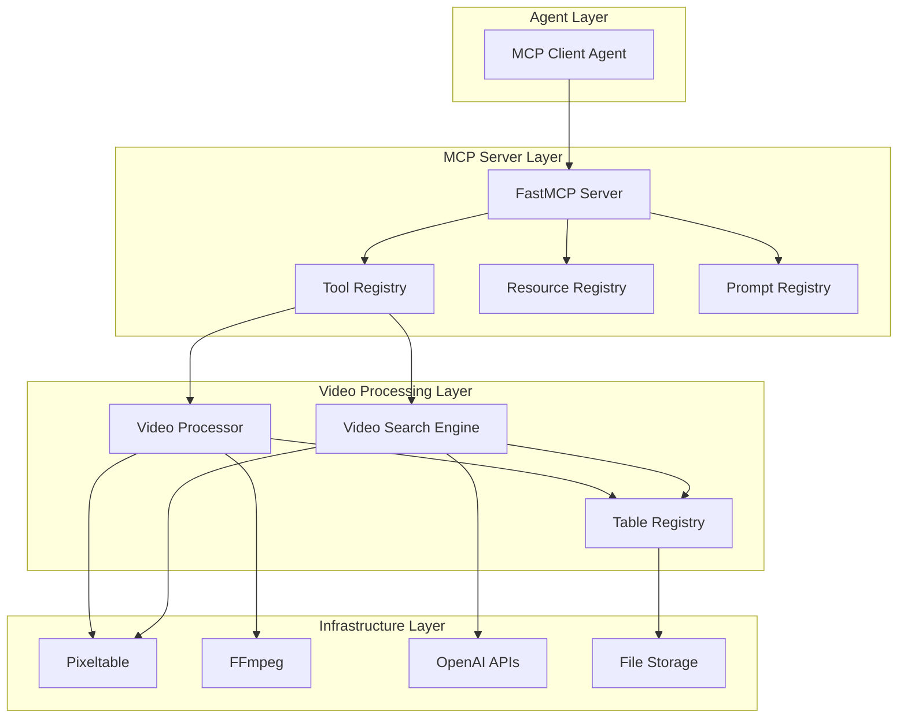
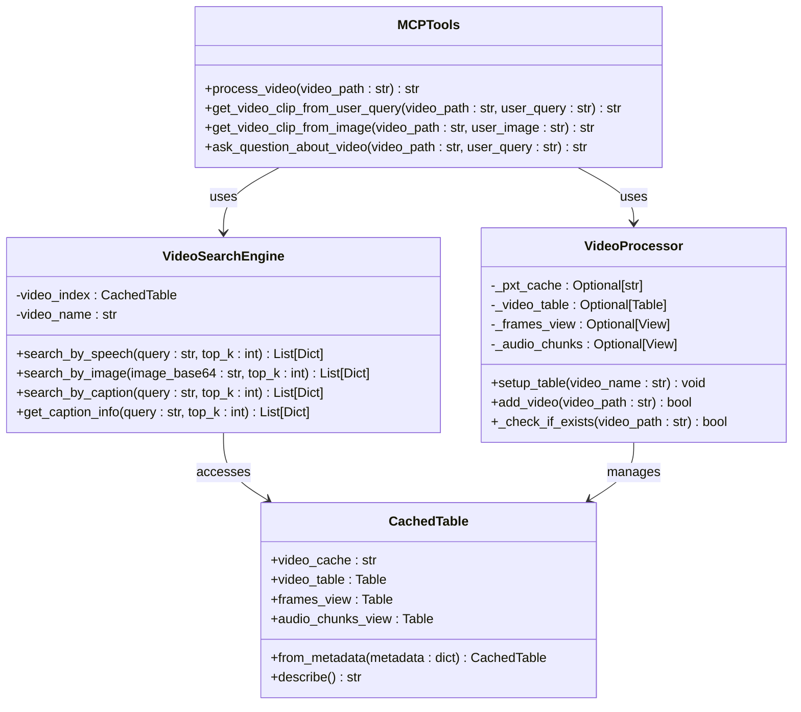
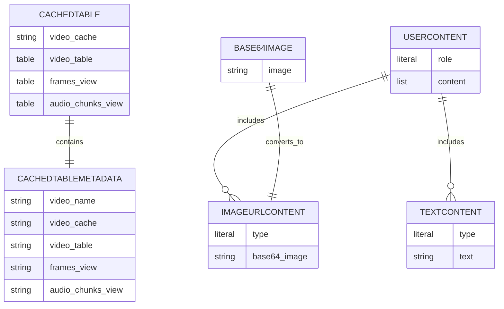
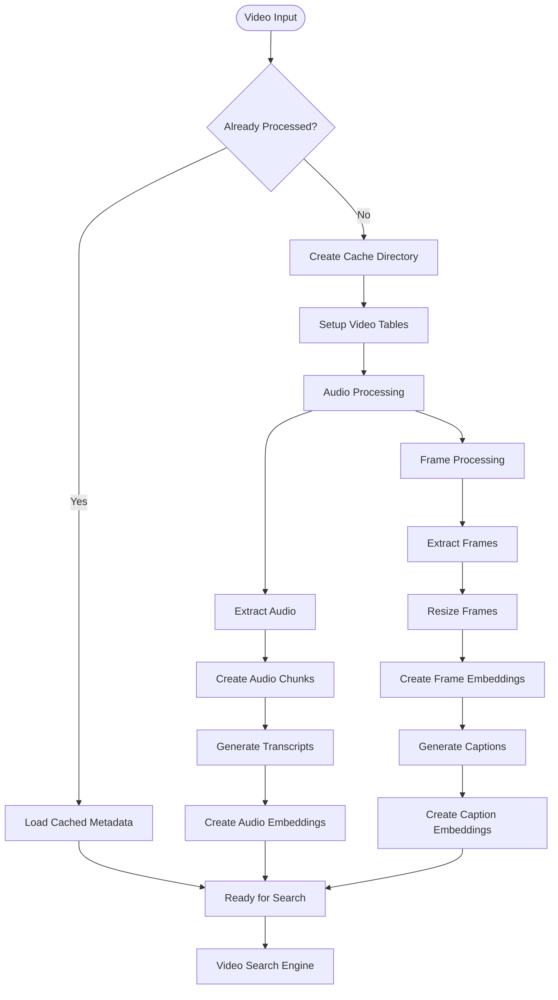
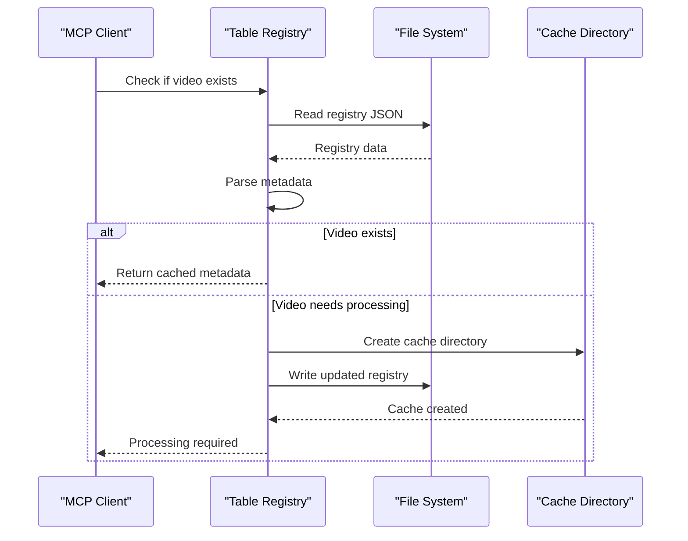
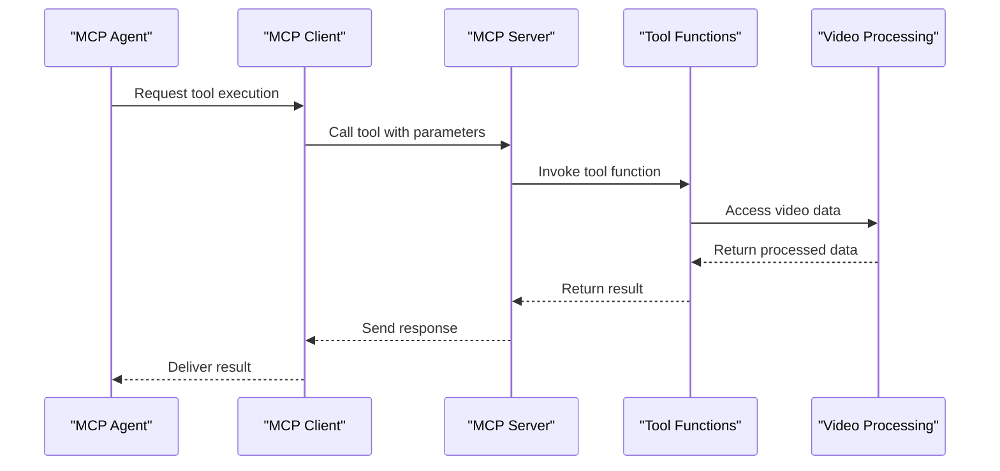
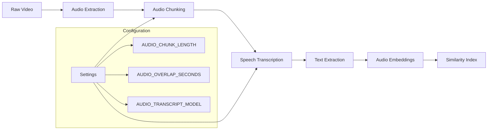
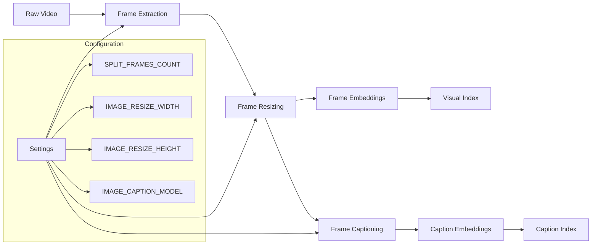

# MCP Tools Subsystem

<cite>
**Referenced Files in This Document**
- [vaas-mcp/src/vaas_mcp/tools.py](file://vaas-mcp/src/vaas_mcp/tools.py)
- [vaas-mcp/src/vaas_mcp/server.py](file://vaas-mcp/src/vaas_mcp/server.py)
- [vaas-mcp/src/vaas_mcp/video/ingestion/tools.py](file://vaas-mcp/src/vaas_mcp/video/ingestion/tools.py)
- [vaas-mcp/src/vaas_mcp/video/ingestion/video_processor.py](file://vaas-mcp/src/vaas_mcp/video/ingestion/video_processor.py)
- [vaas-mcp/src/vaas_mcp/video/video_search_engine.py](file://vaas-mcp/src/vaas_mcp/video/video_search_engine.py)
- [vaas-mcp/src/vaas_mcp/video/ingestion/models.py](file://vaas-mcp/src/vaas_mcp/video/ingestion/models.py)
- [vaas-mcp/src/vaas_mcp/video/ingestion/registry.py](file://vaas-mcp/src/vaas_mcp/video/ingestion/registry.py)
- [vaas-mcp/src/vaas_mcp/config.py](file://vaas-mcp/src/vaas_mcp/config.py)
- [vaas-mcp/notebooks/video_ingestion_process.ipynb](file://vaas-mcp/notebooks/video_ingestion_process.ipynb)
</cite>

## Table of Contents
1. [Introduction](#introduction)
2. [System Architecture](#system-architecture)
3. [Core Tools Overview](#core-tools-overview)
4. [Tool Implementation Details](#tool-implementation-details)
5. [Domain Model](#domain-model)
6. [Registration and Invocation](#registration-and-invocation)
7. [Video Processing Pipeline](#video-processing-pipeline)
8. [Error Handling and Validation](#error-handling-and-validation)
9. [Best Practices](#best-practices)
10. [Troubleshooting Guide](#troubleshooting-guide)
11. [Conclusion](#conclusion)

## Introduction

The MCP (Model Context Protocol) Tools subsystem is a sophisticated video processing and analysis framework built on top of the FastMCP server. This system enables multimodal agents to interact with video content through four primary tools: `process_video`, `get_video_clip_from_user_query`, `get_video_clip_from_image`, and `ask_question_about_video`.

The subsystem leverages advanced technologies including Pixeltable for video indexing, OpenAI's embedding models for similarity search, and FFmpeg for video processing. It provides a unified interface for video analysis, enabling agents to perform complex operations like semantic search, content extraction, and multimodal queries on video data.

## System Architecture

The MCP Tools subsystem follows a layered architecture that separates concerns between tool registration, video processing, and search operations.



**Diagram sources**
- [vaas-mcp/src/vaas_mcp/server.py](file://vaas-mcp/src/vaas_mcp/server.py#L1-L97)
- [vaas-mcp/src/vaas_mcp/tools.py](file://vaas-mcp/src/vaas_mcp/tools.py#L1-L105)

## Core Tools Overview

The MCP Tools subsystem exposes four primary tools, each designed for specific video processing tasks:

### Tool Categories

1. **Video Preparation (`process_video`)**: Indexes videos for efficient searching
2. **Content Extraction (`get_video_clip_from_user_query`, `get_video_clip_from_image`)**: Retrieves relevant video segments
3. **Information Retrieval (`ask_question_about_video`)**: Answers questions about video content



**Diagram sources**
- [vaas-mcp/src/vaas_mcp/tools.py](file://vaas-mcp/src/vaas_mcp/tools.py#L15-L103)
- [vaas-mcp/src/vaas_mcp/video/ingestion/video_processor.py](file://vaas-mcp/src/vaas_mcp/video/ingestion/video_processor.py#L25-L205)
- [vaas-mcp/src/vaas_mcp/video/video_search_engine.py](file://vaas-mcp/src/vaas_mcp/video/video_search_engine.py#L10-L168)

**Section sources**
- [vaas-mcp/src/vaas_mcp/tools.py](file://vaas-mcp/src/vaas_mcp/tools.py#L1-L105)
- [vaas-mcp/src/vaas_mcp/server.py](file://vaas-mcp/src/vaas_mcp/server.py#L15-L40)

## Tool Implementation Details

### 1. process_video

The `process_video` tool prepares video files for subsequent search operations by creating comprehensive indexes.

```python
def process_video(video_path: str) -> str:
    """Process a video file and prepare it for searching.

    Args:
        video_path (str): Path to the video file to process.

    Returns:
        str: Success message indicating the video was processed.

    Raises:
        ValueError: If the video file cannot be found or processed.
    """
    exists = video_processor._check_if_exists(video_path)
    if exists:
        logger.info(f"Video index for '{video_path}' already exists and is ready for use.")
        return False
    video_processor.setup_table(video_name=video_path)
    is_done = video_processor.add_video(video_path=video_path)
    return is_done
```

**Key Features:**
- **Idempotent Operation**: Checks if video is already processed
- **Automatic Re-encoding**: Handles incompatible video formats using FFmpeg
- **Index Creation**: Builds comprehensive video indexes including audio and visual data
- **Caching**: Stores processed video metadata for future reuse

**Side Effects:**
- Creates Pixeltable indexes in cache directories
- Generates embedding indices for audio and visual content
- Updates global registry with processed video metadata

### 2. get_video_clip_from_user_query

This tool retrieves video clips based on semantic similarity to user queries, combining speech and caption analysis.

```python
def get_video_clip_from_user_query(video_path: str, user_query: str) -> str:
    """Get a video clip based on the user query using speech and caption similarity.

    Args:
        video_path (str): The path to the video file.
        user_query (str): The user query to search for.

    Returns:
        str: Path to the extracted video clip.
    """
    search_engine = VideoSearchEngine(video_path)

    speech_clips = search_engine.search_by_speech(user_query, settings.VIDEO_CLIP_SPEECH_SEARCH_TOP_K)
    caption_clips = search_engine.search_by_caption(user_query, settings.VIDEO_CLIP_CAPTION_SEARCH_TOP_K)

    speech_sim = speech_clips[0]["similarity"] if speech_clips else 0
    caption_sim = caption_clips[0]["similarity"] if caption_clips else 0

    video_clip_info = speech_clips[0] if speech_sim > caption_sim else caption_clips[0]

    video_clip = extract_video_clip(
        video_path=video_path,
        start_time=video_clip_info["start_time"],
        end_time=video_clip_info["end_time"],
        output_path=f"./shared_media/{str(uuid4())}.mp4",
    )

    return video_clip.filename
```

**Key Features:**
- **Multi-modal Search**: Combines speech and caption similarity
- **Intelligent Selection**: Chooses optimal clip based on highest similarity
- **Automatic Clipping**: Uses FFmpeg for precise video extraction
- **Unique Output**: Generates unique filenames for each clip

**Side Effects:**
- Creates temporary video files in shared media directory
- May trigger video reprocessing if not indexed
- Updates search indices if video is newly processed

### 3. get_video_clip_from_image

This tool extracts video clips based on visual similarity to provided images, leveraging CLIP embeddings.

```python
def get_video_clip_from_image(video_path: str, user_image: str) -> str:
    """Get a video clip based on similarity to a provided image.

    Args:
        video_path (str): The path to the video file.
        user_image (str): The query image encoded in base64 format.

    Returns:
        str: Path to the extracted video clip.
    """
    search_engine = VideoSearchEngine(video_path)
    image_clips = search_engine.search_by_image(user_image, settings.VIDEO_CLIP_IMAGE_SEARCH_TOP_K)

    video_clip = extract_video_clip(
        video_path=video_path,
        start_time=image_clips[0]["start_time"],
        end_time=image_clips[0]["end_time"],
        output_path=f"./shared_media/{str(uuid4())}.mp4",
    )

    return video_clip.filename
```

**Key Features:**
- **Visual Search**: Uses CLIP embeddings for image similarity
- **Base64 Input**: Accepts images in base64 format for flexibility
- **Precise Timing**: Calculates optimal start/end times around matched frames
- **Consistent Output**: Maintains consistent filename generation

**Side Effects:**
- Requires video to be pre-processed for frame indexing
- Creates temporary video files in shared media directory
- May trigger image decoding errors for malformed base64 data

### 4. ask_question_about_video

This tool answers questions by retrieving relevant captions from the video content.

```python
def ask_question_about_video(video_path: str, user_query: str) -> str:
    """Get relevant captions from the video based on the user's question.

    Args:
        video_path (str): The path to the video file.
        user_query (str): The question to search for relevant captions.

    Returns:
        str: Concatenated relevant captions from the video.
    """
    search_engine = VideoSearchEngine(video_path)
    caption_info = search_engine.get_caption_info(user_query, settings.QUESTION_ANSWER_TOP_K)

    answer = "\n".join(entry["caption"] for entry in caption_info)
    return answer
```

**Key Features:**
- **Caption-Based Answering**: Leverages automatically generated frame captions
- **Multiple Results**: Returns top-k relevant captions
- **Concatenated Output**: Provides comprehensive context in single response
- **Semantic Matching**: Uses embedding similarity for relevance scoring

**Side Effects:**
- Requires video to be pre-processed with caption generation
- May return empty results for unrelated queries
- Depends on caption quality for accurate responses

**Section sources**
- [vaas-mcp/src/vaas_mcp/tools.py](file://vaas-mcp/src/vaas_mcp/tools.py#L15-L103)

## Domain Model

The MCP Tools subsystem uses a comprehensive domain model to represent video processing entities and their relationships.

### Core Entities



**Diagram sources**
- [vaas-mcp/src/vaas_mcp/video/ingestion/models.py](file://vaas-mcp/src/vaas_mcp/video/ingestion/models.py#L10-L119)

### Video Processing Pipeline

The system implements a sophisticated video processing pipeline that transforms raw video files into searchable multimedia databases.



**Diagram sources**
- [vaas-mcp/src/vaas_mcp/video/ingestion/video_processor.py](file://vaas-mcp/src/vaas_mcp/video/ingestion/video_processor.py#L40-L205)

### Registry Management

The system maintains a global registry of processed videos to enable efficient caching and reuse.



**Diagram sources**
- [vaas-mcp/src/vaas_mcp/video/ingestion/registry.py](file://vaas-mcp/src/vaas_mcp/video/ingestion/registry.py#L15-L110)

**Section sources**
- [vaas-mcp/src/vaas_mcp/video/ingestion/models.py](file://vaas-mcp/src/vaas_mcp/video/ingestion/models.py#L1-L119)
- [vaas-mcp/src/vaas_mcp/video/ingestion/registry.py](file://vaas-mcp/src/vaas_mcp/video/ingestion/registry.py#L1-L110)

## Registration and Invocation

### Tool Registration

The MCP server registers tools using the FastMCP framework, providing metadata and categorization for each tool.

```python
def add_mcp_tools(mcp: FastMCP):
    mcp.add_tool(
        name="process_video",
        description="Process a video file and prepare it for searching.",
        fn=process_video,
        tags={"video", "process"},
    )

    mcp.add_tool(
        name="get_video_clip_from_user_query",
        description="Use this tool to get a video clip from a video file based on a user query or question.",
        fn=get_video_clip_from_user_query,
        tags={"video", "clip", "query", "question"},
    )

    mcp.add_tool(
        name="get_video_clip_from_image",
        description="Use this tool to get a video clip from a video file based on a user image.",
        fn=get_video_clip_from_image,
        tags={"video", "clip", "image"},
    )

    mcp.add_tool(
        name="ask_question_about_video",
        description="Use this tool to get an answer to a question about the video.",
        fn=ask_question_about_video,
        tags={"ask", "question", "information"},
    )
```

### Agent Invocation Pattern

Agents interact with the MCP server through a standardized protocol that handles tool discovery, parameter validation, and result processing.



**Diagram sources**
- [vaas-mcp/src/vaas_mcp/server.py](file://vaas-mcp/src/vaas_mcp/server.py#L15-L40)

**Section sources**
- [vaas-mcp/src/vaas_mcp/server.py](file://vaas-mcp/src/vaas_mcp/server.py#L15-L40)

## Video Processing Pipeline

The video processing pipeline transforms raw video files into searchable multimedia databases through a series of sophisticated operations.

### Audio Processing Chain



**Diagram sources**
- [vaas-mcp/src/vaas_mcp/video/ingestion/video_processor.py](file://vaas-mcp/src/vaas_mcp/video/ingestion/video_processor.py#L85-L120)

### Visual Processing Chain



**Diagram sources**
- [vaas-mcp/src/vaas_mcp/video/ingestion/video_processor.py](file://vaas-mcp/src/vaas_mcp/video/ingestion/video_processor.py#L125-L165)

### Embedding Index Creation

The system creates multiple embedding indices for different modalities:

1. **Audio Embeddings**: Using OpenAI's text-embedding-3-small model
2. **Image Embeddings**: Using OpenAI's CLIP model (openai/clip-vit-base-patch32)
3. **Caption Embeddings**: Using OpenAI's text-embedding-3-small model

Each index enables semantic similarity search across different aspects of the video content.

**Section sources**
- [vaas-mcp/src/vaas_mcp/video/ingestion/video_processor.py](file://vaas-mcp/src/vaas_mcp/video/ingestion/video_processor.py#L40-L205)

## Error Handling and Validation

### Common Error Scenarios

The MCP Tools subsystem implements comprehensive error handling across all operations:

#### Video Processing Errors
- **File Not Found**: Validates video file existence before processing
- **Format Compatibility**: Automatically re-encodes incompatible video formats
- **Processing Failures**: Handles FFmpeg and Pixeltable operation failures

#### Search Operation Errors
- **Unindexed Videos**: Triggers automatic video processing when needed
- **Invalid Queries**: Handles empty or nonsensical search queries
- **Embedding Failures**: Manages OpenAI API rate limits and timeouts

#### Resource Management Errors
- **Disk Space**: Monitors storage capacity for temporary files
- **Memory Usage**: Implements streaming for large video files
- **Concurrent Access**: Prevents race conditions in registry updates

### Validation Patterns

```python
# Video path validation
if not Path(video_path).exists():
    raise FileNotFoundError(f"Video file not found: {video_path}")

# Parameter validation
if start_time >= end_time:
    raise ValueError("start_time must be less than end_time")

# Base64 image validation
try:
    image_bytes = base64.b64decode(base64_string)
    image_buffer = BytesIO(image_bytes)
    return Image.open(image_buffer)
except (ValueError, IOError) as e:
    raise IOError(f"Failed to decode image: {str(e)}")
```

**Section sources**
- [vaas-mcp/src/vaas_mcp/video/ingestion/tools.py](file://vaas-mcp/src/vaas_mcp/video/ingestion/tools.py#L40-L155)

## Best Practices

### Writing New Tools

When developing new tools for the MCP system, follow these established patterns:

#### Idempotency
```python
def safe_tool_operation(input_data: str) -> str:
    """Example of an idempotent tool operation."""
    # Check if operation already completed
    if has_completed(input_data):
        return get_cached_result(input_data)
    
    # Perform operation
    result = perform_expensive_operation(input_data)
    
    # Cache result
    cache_result(input_data, result)
    
    return result
```

#### Logging and Monitoring
```python
import loguru

logger = loguru.logger.bind(name="NewTool")

def monitored_tool(video_path: str) -> str:
    """Tool with comprehensive logging."""
    logger.info(f"Starting tool execution for video: {video_path}")
    
    try:
        # Tool logic here
        result = process_video(video_path)
        logger.success(f"Tool completed successfully for: {video_path}")
        return result
        
    except Exception as e:
        logger.error(f"Tool failed for {video_path}: {str(e)}")
        raise
```

#### Input Sanitization
```python
def sanitized_tool(user_input: str, video_path: str) -> str:
    """Tool with input validation and sanitization."""
    # Validate video path
    if not video_path or not Path(video_path).exists():
        raise ValueError("Invalid video path")
    
    # Sanitize user input
    sanitized_query = user_input.strip()
    if len(sanitized_query) > MAX_QUERY_LENGTH:
        sanitized_query = sanitized_query[:MAX_QUERY_LENGTH]
    
    return process_sanitized_input(sanitized_query, video_path)
```

### Performance Optimization

#### Caching Strategies
- **Metadata Caching**: Store processed video metadata to avoid reprocessing
- **Result Caching**: Cache tool results for identical inputs
- **Index Caching**: Maintain persistent embedding indices

#### Memory Management
- **Streaming Processing**: Process large videos in chunks
- **Lazy Loading**: Load video components only when needed
- **Resource Cleanup**: Properly dispose of temporary files and connections

#### Concurrent Operations
- **Async Processing**: Use asynchronous operations for I/O-bound tasks
- **Connection Pooling**: Reuse database and API connections
- **Rate Limiting**: Respect API rate limits for external services

## Troubleshooting Guide

### Common Issues and Solutions

#### Timeout Handling
```python
import asyncio
from contextlib import asynccontextmanager

@asynccontextmanager
async def timeout_context(timeout_seconds: int):
    """Context manager for handling timeouts."""
    try:
        async with asyncio.timeout(timeout_seconds):
            yield
    except asyncio.TimeoutError:
        logger.warning(f"Operation timed out after {timeout_seconds} seconds")
        raise
```

#### Error Propagation
```python
def robust_tool_execution(video_path: str, query: str) -> str:
    """Tool with comprehensive error handling."""
    try:
        # Primary operation
        return perform_search(video_path, query)
        
    except FileNotFoundError:
        logger.error(f"Video file not found: {video_path}")
        return "Error: Video file not found"
        
    except ValueError as e:
        logger.error(f"Invalid input: {str(e)}")
        return f"Error: {str(e)}"
        
    except Exception as e:
        logger.error(f"Unexpected error: {str(e)}")
        return "Error: Internal processing failure"
```

#### Validation Failures
- **Video Format Issues**: Use `re_encode_video()` to handle incompatible formats
- **Memory Constraints**: Implement streaming for large files
- **API Rate Limits**: Implement exponential backoff for external API calls

### Debugging Tools

#### Logging Configuration
```python
import loguru

# Configure detailed logging
logger = loguru.logger.bind(name="DebugTools")
logger.add("debug.log", level="DEBUG", rotation="1 day")

# Enable debug logging for specific modules
loguru.logger.enable("vaas_mcp.video")
loguru.logger.enable("fastmcp")
```

#### Health Checks
```python
def health_check() -> Dict[str, Any]:
    """Perform comprehensive health checks."""
    checks = {
        "video_processor": check_video_processor(),
        "search_engine": check_search_engine(),
        "external_apis": check_external_apis(),
        "storage": check_storage(),
    }
    
    overall_status = all(check["status"] for check in checks.values())
    return {"status": overall_status, "checks": checks}
```

**Section sources**
- [vaas-mcp/src/vaas_mcp/video/ingestion/tools.py](file://vaas-mcp/src/vaas_mcp/video/ingestion/tools.py#L100-L155)

## Conclusion

The MCP Tools subsystem represents a sophisticated approach to video processing and analysis, providing multimodal agents with powerful capabilities for interacting with video content. Through its four core tools—`process_video`, `get_video_clip_from_user_query`, `get_video_clip_from_image`, and `ask_question_about_video`—the system enables complex operations like semantic search, content extraction, and intelligent questioning.

The architecture leverages cutting-edge technologies including Pixeltable for efficient video indexing, OpenAI's embedding models for semantic similarity, and FFmpeg for reliable video processing. The comprehensive domain model ensures data consistency and enables efficient caching and reuse of processed video data.

Key strengths of the system include:

- **Scalability**: Efficient indexing and caching mechanisms support large-scale video processing
- **Flexibility**: Multi-modal search capabilities handle various types of queries
- **Reliability**: Comprehensive error handling and validation ensure robust operation
- **Extensibility**: Well-defined patterns enable easy addition of new tools and capabilities

The system serves as an excellent foundation for building multimodal AI applications that require sophisticated video analysis and processing capabilities. Its modular design and comprehensive error handling make it suitable for production environments where reliability and performance are critical requirements.

Future enhancements could include support for real-time video processing, expanded multimodal capabilities (e.g., text-to-speech synthesis), and integration with additional video processing frameworks. The solid architectural foundation ensures that such extensions can be implemented efficiently while maintaining backward compatibility and system stability.