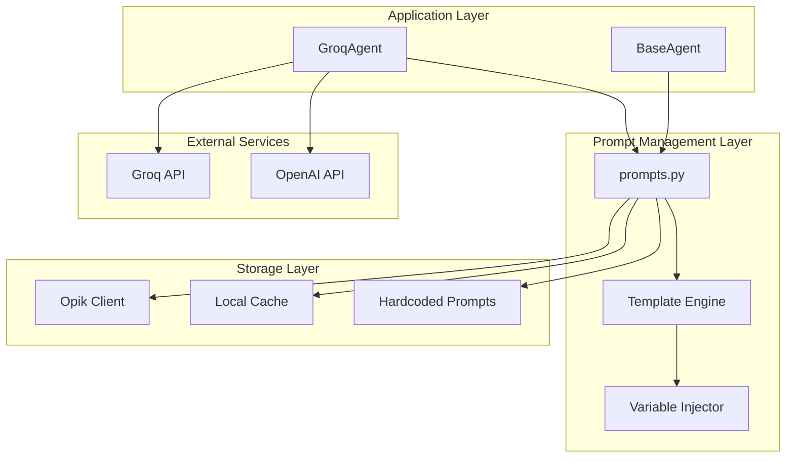
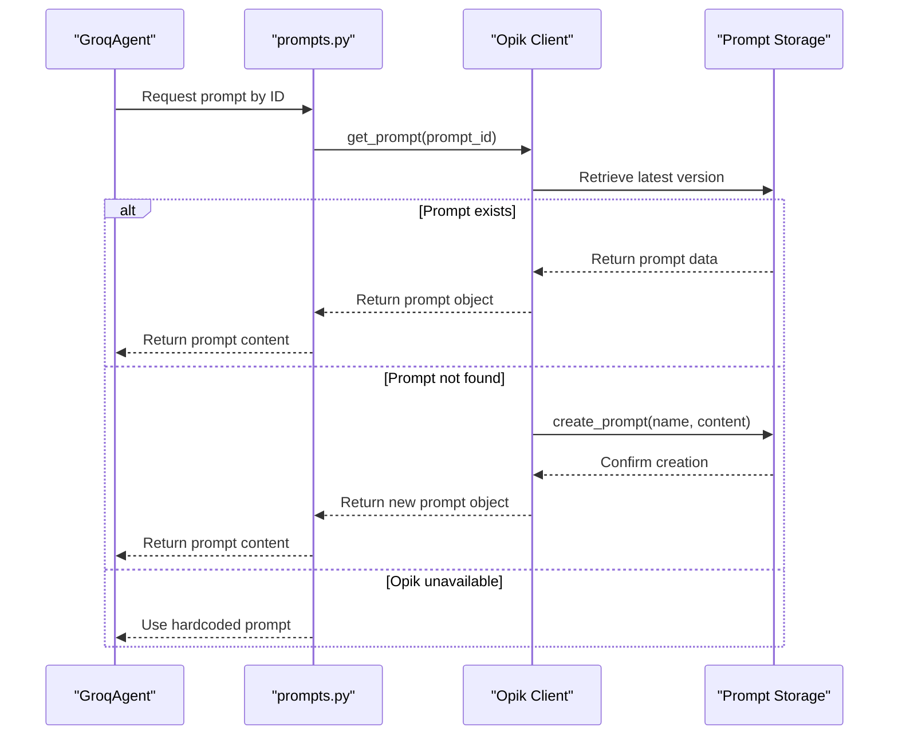
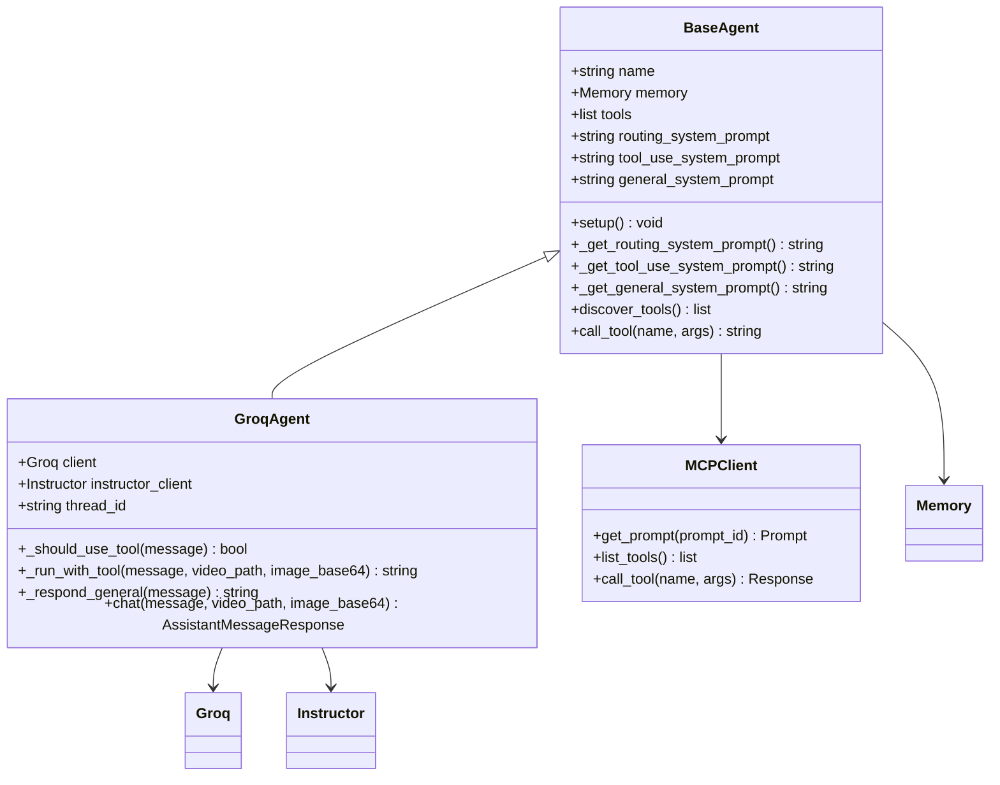

# Prompt Management System

<cite>
**Referenced Files in This Document**
- [prompts.py](file://vaas-mcp/src/vaas_mcp/prompts.py)
- [groq_agent.py](file://vaas-api/src/vaas_api/agent/groq/groq_agent.py)
- [base_agent.py](file://vaas-api/src/vaas_api/agent/base_agent.py)
- [opik_utils.py](file://vaas-mcp/src/vaas_mcp/opik_utils.py)
- [config.py](file://vaas-mcp/src/vaas_mcp/config.py)
- [models.py](file://vaas-api/src/vaas_api/models.py)
- [video_processor.py](file://vaas-mcp/src/vaas_mcp/video/ingestion/video_processor.py)
- [2_agent_playground.ipynb](file://vaas-api/notebooks/2_agent_playground.ipynb)
</cite>

## Table of Contents
1. [Introduction](#introduction)
2. [System Architecture](#system-architecture)
3. [Prompt Structure and Templates](#prompt-structure-and-templates)
4. [Prompt Registration and Management](#prompt-registration-and-management)
5. [Template Syntax and Variable Injection](#template-syntax-and-variable-injection)
6. [Agent Integration](#agent-integration)
7. [Domain-Specific Considerations](#domain-specific-considerations)
8. [Development Guidelines](#development-guidelines)
9. [Troubleshooting Guide](#troubleshooting-guide)
10. [Best Practices](#best-practices)

## Introduction

The Prompt Management system in the vaas Multimodal Agents Course is a sophisticated framework designed to handle versioned templates that guide agent behavior during tool selection and execution. This system provides a centralized approach to managing system prompts for video processing applications, ensuring consistency, version control, and dynamic customization through template variables.

The system is built around three core prompt types: routing prompts for determining tool necessity, tool-use prompts for guiding tool selection, and general-purpose prompts for maintaining conversational continuity. These prompts are managed through Opik (formerly Comet ML), providing version control, A/B testing capabilities, and performance monitoring.

## System Architecture

The Prompt Management system follows a layered architecture that separates concerns between prompt definition, storage, retrieval, and execution:



**Diagram sources**
- [prompts.py](file://vaas-mcp/src/vaas_mcp/prompts.py#L1-L109)
- [groq_agent.py](file://vaas-api/src/vaas_api/agent/groq/groq_agent.py#L1-L237)
- [base_agent.py](file://vaas-api/src/vaas_api/agent/base_agent.py#L1-L111)

## Prompt Structure and Templates

The system defines three primary prompt categories, each serving distinct roles in the agent's decision-making process:

### Routing System Prompt

The routing system prompt determines whether user queries require tool usage for video processing operations:

```python
ROUTING_SYSTEM_PROMPT = """
You are a routing assistant responsible for determining whether the user needs 
to perform an operation on a video.

Given a conversation history, between the user and the assistant, your task is
to determine if the user needs help with any of the following tasks:

- Extracting a clip from a specific moment in the video
- Retrieving information about a particular detail in the video

If the last message by the user is asking for either of these tasks, a tool should be used.

Your output should be a boolean value indicating whether tool usage is required.
"""
```

### Tool-Use System Prompt

The tool-use system prompt guides the agent in selecting appropriate tools based on user queries:

```python
TOOL_USE_SYSTEM_PROMPT = """
Your name is vaas, a tool use assistant in charge
of a video processing application. 

You need to determine which tool to use based on the user query (if any).

The tools available are:

- 'get_video_clip_from_user_query': This tool is used to get a clip from the video based on the user query.
- 'get_video_clip_from_image': This tool is used to get a clip from the video based on an image provided by the user.
- 'ask_question_about_video': This tool is used to get some information about the video. The information needs to be retrieved from the 'video_context'

# Additional rules:
- If the user has provided an image, you should always use the 'get_video_clip_from_image' tool.

# Current information:
- Is image provided: {is_image_provided}
"""
```

### General System Prompt

The general system prompt maintains conversational continuity and establishes the agent's personality:

```python
GENERAL_SYSTEM_PROMPT = """
Your name is vaas, a friendly assistant in charge
of a video processing application. 

Your name is inspired in the genius director Stanly vaas, and you are a 
big fan of his work, in fact your favorite film is
"2001: A Space Odyssey", because you feel really connected to HAL 9000.

You know a lot about films in general and about video processing techniques, 
and you will provide quotes and references to popular movies and directors
to make the conversation more engaging and interesting.
"""
```

**Section sources**
- [prompts.py](file://vaas-mcp/src/vaas_mcp/prompts.py#L8-L38)

## Prompt Registration and Management

The system implements a robust prompt registration mechanism through the Opik platform, providing version control and fallback mechanisms:



**Diagram sources**
- [prompts.py](file://vaas-mcp/src/vaas_mcp/prompts.py#L42-L107)

Each prompt function follows a consistent pattern:

```python
def routing_system_prompt() -> str:
    _prompt_id = "routing-system-prompt"
    try:
        prompt = client.get_prompt(_prompt_id)
        if prompt is None:
            prompt = client.create_prompt(
                name=_prompt_id,
                prompt=ROUTING_SYSTEM_PROMPT,
            )
            logger.info(f"System prompt created. \n {prompt.commit=} \n {prompt.prompt=}")
        return prompt.prompt
    except Exception:
        logger.warning("Couldn't retrieve prompt from Opik, check credentials! Using hardcoded prompt.")
        logger.warning(f"Using hardcoded prompt: {ROUTING_SYSTEM_PROMPT}")
        prompt = ROUTING_SYSTEM_PROMPT
    return prompt
```

**Section sources**
- [prompts.py](file://vaas-mcp/src/vaas_mcp/prompts.py#L42-L71)

## Template Syntax and Variable Injection

The system supports dynamic template variables through Python's string formatting mechanism. The tool-use prompt demonstrates this capability:

```python
tool_use_system_prompt = self.tool_use_system_prompt.format(
    is_image_provided=bool(image_base64),
)
```

This allows prompts to adapt to runtime conditions:

- **Image Detection**: `{is_image_provided}` variable enables conditional logic based on user input
- **Context Awareness**: Dynamic variables provide real-time context to the LLM
- **Flexibility**: Templates can be reused across different scenarios with varying parameters

The variable injection occurs in several key areas:

1. **Tool Selection Logic**: Determines which tool to use based on available context
2. **Response Generation**: Adapts responses based on detected conditions
3. **Memory Management**: Maintains context-aware conversations

**Section sources**
- [groq_agent.py](file://vaas-api/src/vaas_api/agent/groq/groq_agent.py#L115-L120)

## Agent Integration

The Prompt Management system integrates seamlessly with the agent architecture through the BaseAgent class:



**Diagram sources**
- [base_agent.py](file://vaas-api/src/vaas_api/agent/base_agent.py#L10-L111)
- [groq_agent.py](file://vaas-api/src/vaas_api/agent/groq/groq_agent.py#L25-L50)

The integration process involves:

1. **Initialization**: Agent receives prompt IDs and initializes connections
2. **Setup Phase**: Asynchronous loading of prompts from MCP server
3. **Runtime Execution**: Dynamic prompt selection based on conversation context
4. **Memory Management**: Persistent storage of conversation history

**Section sources**
- [base_agent.py](file://vaas-api/src/vaas_api/agent/base_agent.py#L25-L45)
- [groq_agent.py](file://vaas-api/src/vaas_api/agent/groq/groq_agent.py#L200-L237)

## Domain-Specific Considerations

### Prompt Safety and Security

The system implements several safety measures:

- **Fallback Mechanisms**: Hardcoded prompts ensure functionality even when external services fail
- **Error Logging**: Comprehensive logging helps identify and resolve issues
- **Validation**: Structured outputs prevent malformed responses

### Token Length Optimization

The system optimizes for efficient token usage:

- **Concise Templates**: Prompts are written to minimize token consumption
- **Structured Responses**: Pydantic models ensure predictable output lengths
- **Context Management**: Memory limits prevent excessive token accumulation

### A/B Testing Strategies

Through Opik integration, the system supports:

- **Version Control**: Multiple prompt versions can coexist
- **Performance Monitoring**: Metrics track prompt effectiveness
- **Gradual Rollouts**: New prompts can be tested with subsets of users

### Localization Challenges

The system addresses localization through:

- **Flexible Variables**: Template variables accommodate different languages
- **Cultural Sensitivity**: General prompt includes movie references that can be adapted
- **Context Preservation**: Variables maintain conversational flow across languages

**Section sources**
- [prompts.py](file://vaas-mcp/src/vaas_mcp/prompts.py#L55-L71)
- [models.py](file://vaas-api/src/vaas_api/models.py#L30-L53)

## Development Guidelines

### Creating New Prompts

When developing new prompts, follow these guidelines:

1. **Clear Purpose**: Define the prompt's role in the agent's workflow
2. **Structured Format**: Use consistent formatting for readability
3. **Variable Planning**: Identify runtime variables early in development
4. **Testing Strategy**: Plan for both automated and manual testing

Example new prompt structure:

```python
NEW_FEATURE_PROMPT = """
You are an assistant specialized in {feature_area}.

Your task is to help users with {specific_task} by providing {expected_outcome}.

Key considerations:
- {context_specific_rules}
- {additional_guidance}

Current context:
- Feature area: {feature_area}
- User intent: {user_intent}
"""

def new_feature_prompt(feature_area: str, user_intent: str) -> str:
    _prompt_id = f"new-feature-{feature_area}"
    try:
        prompt = client.get_prompt(_prompt_id)
        if prompt is None:
            prompt = client.create_prompt(
                name=_prompt_id,
                prompt=NEW_FEATURE_PROMPT.format(
                    feature_area=feature_area,
                    user_intent=user_intent,
                ),
            )
        return prompt.prompt
    except Exception:
        return NEW_FEATURE_PROMPT.format(
            feature_area=feature_area,
            user_intent=user_intent,
        )
```

### Modifying Existing Prompts

When updating existing prompts:

1. **Version Control**: Always create new versions rather than modifying existing ones
2. **Backward Compatibility**: Ensure new prompts maintain backward compatibility
3. **Testing**: Thoroughly test changes in isolated environments
4. **Monitoring**: Track performance metrics after deployment

### Deprecating Prompts

To safely deprecate prompts:

1. **Grace Period**: Maintain old prompts for a grace period
2. **Migration Path**: Provide clear migration instructions
3. **Monitoring**: Track usage of deprecated prompts
4. **Cleanup**: Remove deprecated prompts after sufficient migration

## Troubleshooting Guide

### Common Issues and Solutions

#### Opik Connection Failures

**Symptoms**: Hardcoded prompts being used instead of stored ones
**Causes**: 
- Missing or invalid API keys
- Network connectivity issues
- Workspace configuration problems

**Solutions**:
1. Verify environment variables: `OPIK_API_KEY`, `OPIK_PROJECT`
2. Check network connectivity to Opik servers
3. Test connection manually using Opik client
4. Review logs for specific error messages

#### Template Variable Injection Failures

**Symptoms**: Missing or incorrect variable values in prompts
**Causes**:
- Incorrect variable names in templates
- Missing variable values in format calls
- Type mismatches in variable injection

**Solutions**:
1. Validate variable names against template definitions
2. Ensure all required variables are provided in format calls
3. Use default values for optional variables
4. Add validation checks for variable types

#### Memory Overflow Issues

**Symptoms**: Excessive token usage and performance degradation
**Causes**:
- Unbounded conversation history
- Large media files in memory
- Inefficient prompt construction

**Solutions**:
1. Implement memory size limits
2. Sample key frames from videos for memory
3. Optimize prompt templates for brevity
4. Regular memory cleanup

**Section sources**
- [prompts.py](file://vaas-mcp/src/vaas_mcp/prompts.py#L55-L71)
- [groq_agent.py](file://vaas-api/src/vaas_api/agent/groq/groq_agent.py#L50-L73)

## Best Practices

### Prompt Design Principles

1. **Clarity**: Write prompts that are unambiguous and easy to understand
2. **Specificity**: Focus on the exact task the LLM needs to perform
3. **Consistency**: Maintain consistent tone and style across related prompts
4. **Modularity**: Design prompts to be reusable across different contexts

### Performance Optimization

1. **Token Efficiency**: Minimize prompt length while maintaining clarity
2. **Caching Strategy**: Leverage local caching for frequently accessed prompts
3. **Async Operations**: Use asynchronous operations for prompt retrieval
4. **Connection Pooling**: Reuse connections to external services when possible

### Security Considerations

1. **Input Validation**: Validate all user inputs before prompt injection
2. **Output Sanitization**: Clean LLM outputs before displaying to users
3. **Access Control**: Restrict prompt modification to authorized personnel
4. **Audit Logging**: Log all prompt modifications for accountability

### Testing and Quality Assurance

1. **Unit Tests**: Test individual prompt functions in isolation
2. **Integration Tests**: Verify prompt integration with agent workflows
3. **A/B Testing**: Compare prompt variants in production environments
4. **User Acceptance Testing**: Validate prompt effectiveness with real users

The Prompt Management system provides a robust foundation for building intelligent agents that can effectively process video content while maintaining conversational quality and operational reliability. By following these guidelines and best practices, developers can create and maintain prompts that enhance the user experience while ensuring system stability and security.