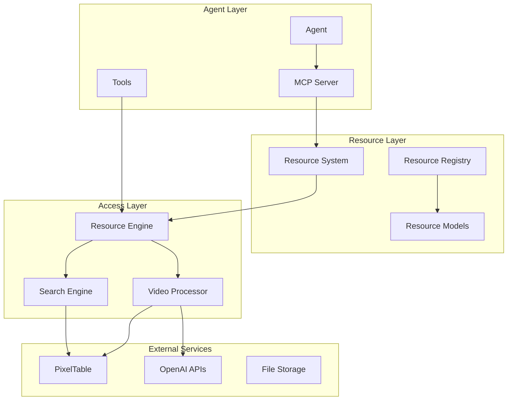
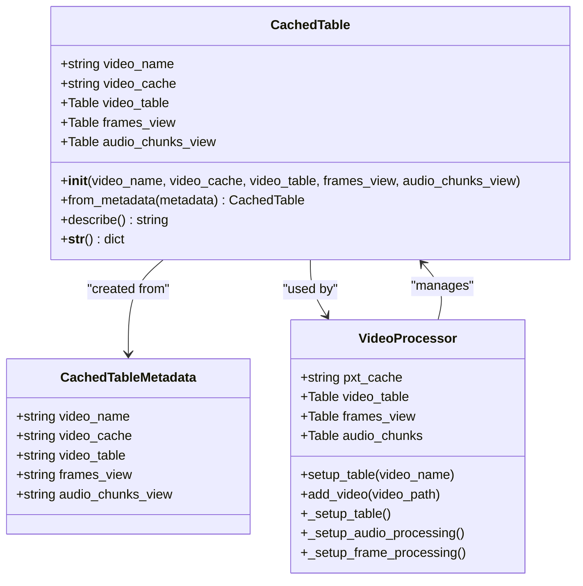
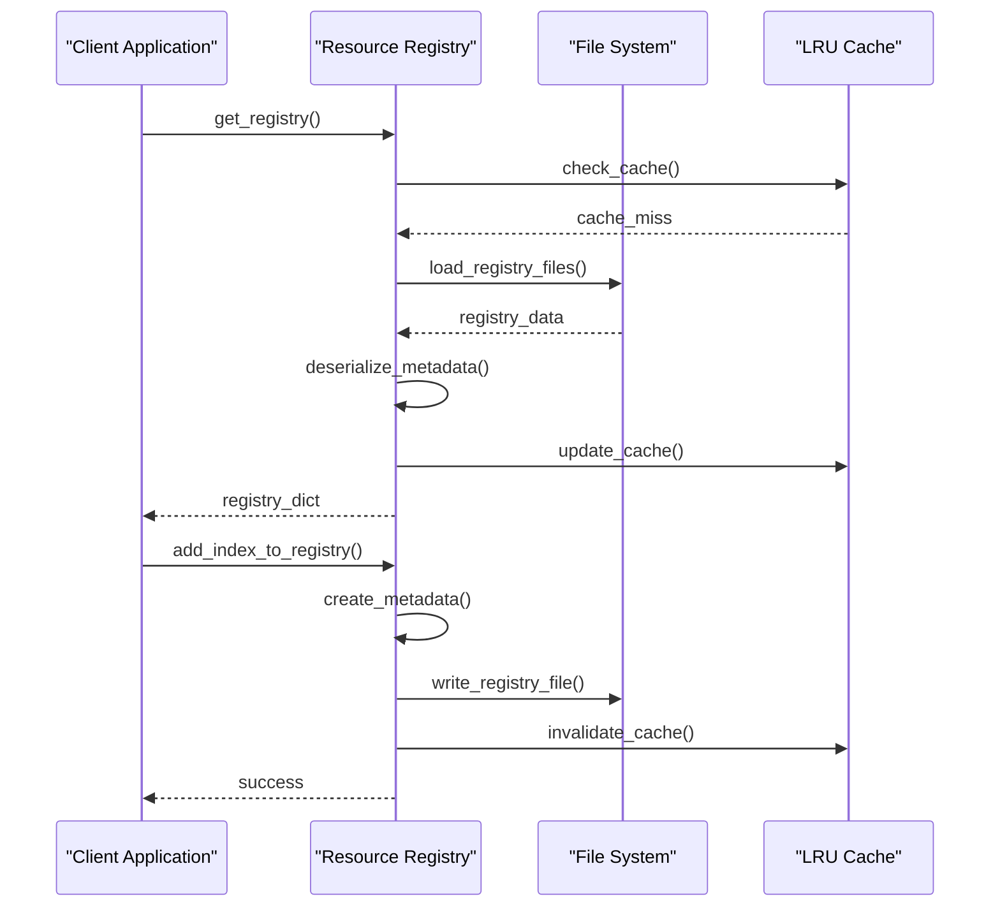
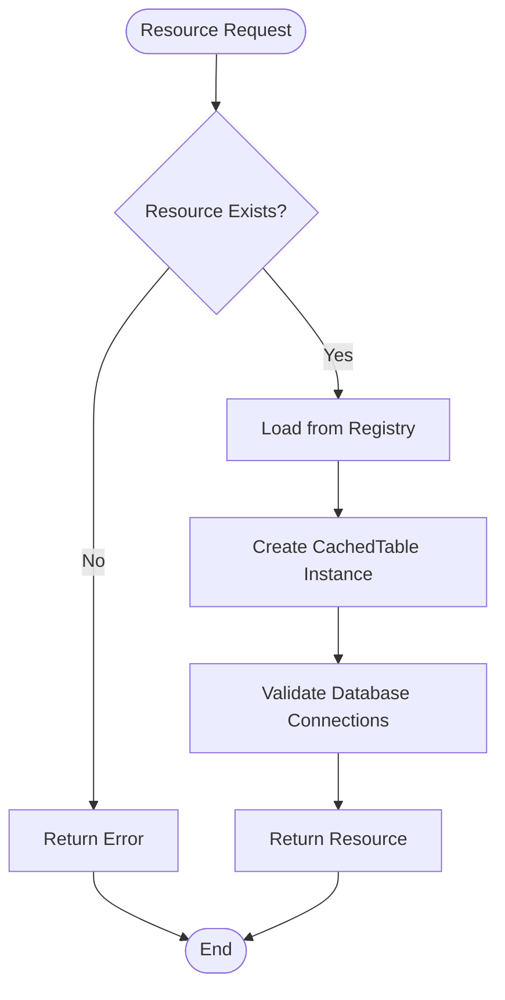
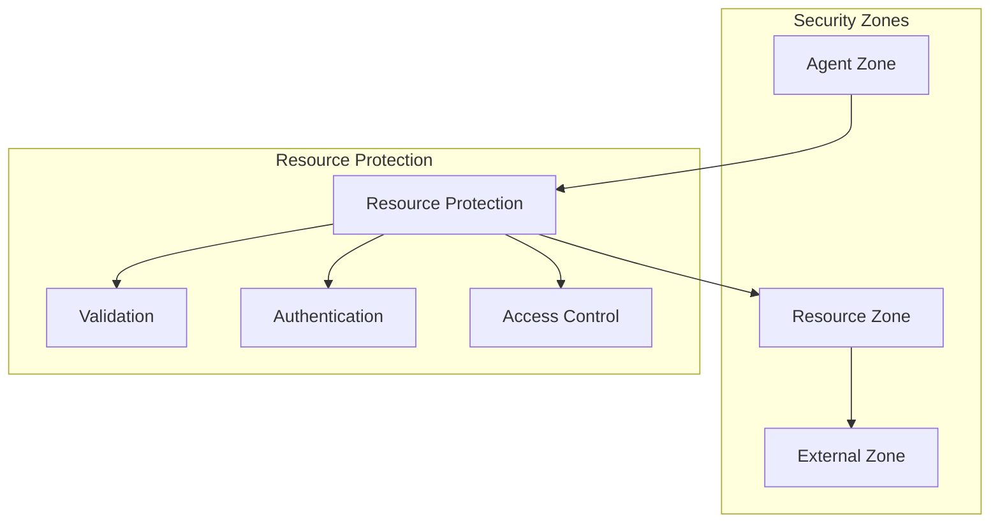
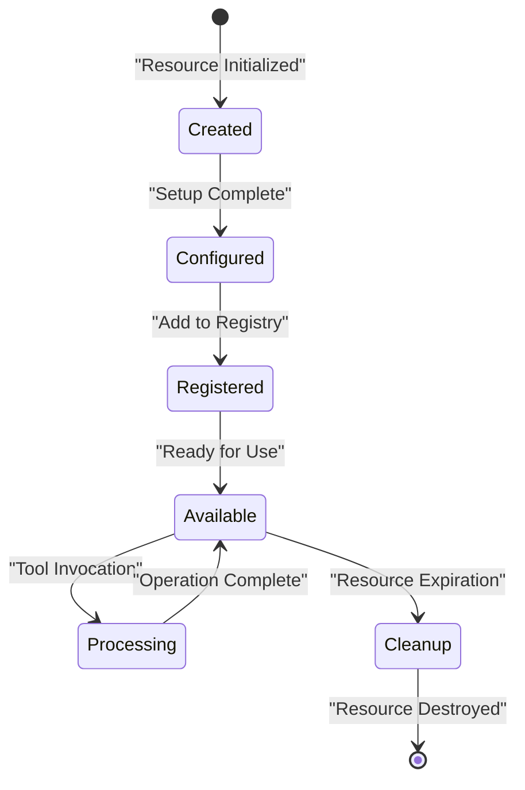
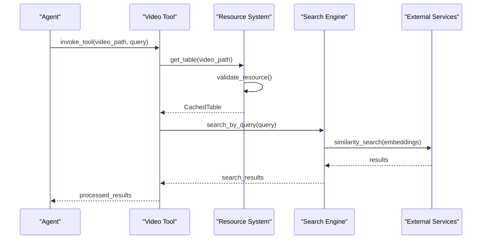

# Resource System

<cite>
**Referenced Files in This Document**
- [resources.py](file://vaas-mcp/src/vaas_mcp/resources.py)
- [registry.py](file://vaas-mcp/src/vaas_mcp/video/ingestion/registry.py)
- [models.py](file://vaas-mcp/src/vaas_mcp/video/ingestion/models.py)
- [video_processor.py](file://vaas-mcp/src/vaas_mcp/video/ingestion/video_processor.py)
- [video_search_engine.py](file://vaas-mcp/src/vaas_mcp/video/video_search_engine.py)
- [server.py](file://vaas-mcp/src/vaas_mcp/server.py)
- [tools.py](file://vaas-mcp/src/vaas_mcp/tools.py)
- [config.py](file://vaas-mcp/src/vaas_mcp/config.py)
- [constants.py](file://vaas-mcp/src/vaas_mcp/video/ingestion/constants.py)
- [prompts.py](file://vaas-mcp/src/vaas_mcp/prompts.py)
- [tools.py](file://vaas-mcp/src/vaas_mcp/video/ingestion/tools.py)
</cite>

## Table of Contents
1. [Introduction](#introduction)
2. [Resource System Architecture](#resource-system-architecture)
3. [Core Resource Types](#core-resource-types)
4. [Resource Registration and Management](#resource-registration-and-management)
5. [Resource Access Patterns](#resource-access-patterns)
6. [Security Model](#security-model)
7. [Resource Lifecycle Management](#resource-lifecycle-management)
8. [Integration with Tools and Prompts](#integration-with-tools-and-prompts)
9. [Common Issues and Solutions](#common-issues-and-solutions)
10. [Best Practices](#best-practices)
11. [Troubleshooting Guide](#troubleshooting-guide)

## Introduction

The vaas MCP Resource System provides agents with access to external data sources and services beyond traditional tool execution. At its core, the system manages video processing resources including processed video indexes, metadata stores, and various media processing capabilities. The resource system enables seamless integration between the MCP server and external services like PixelTable for video indexing, OpenAI APIs for embeddings and captions, and file storage systems.

Resources in this system represent persistent data structures that encapsulate processed video information, including frame embeddings, audio transcripts, and semantic indices. These resources are automatically managed through a registry system that tracks video indexes, handles caching, and provides efficient access patterns for video search operations.

## Resource System Architecture

The resource system follows a layered architecture that separates concerns between resource definition, registration, and access. The system is built around several key architectural components:



**Diagram sources**
- [server.py](file://vaas-mcp/src/vaas_mcp/server.py#L1-L97)
- [resources.py](file://vaas-mcp/src/vaas_mcp/resources.py#L1-L40)
- [registry.py](file://vaas-mcp/src/vaas_mcp/video/ingestion/registry.py#L1-L110)

The architecture consists of four primary layers:

1. **Resource Layer**: Defines the core resource types and their metadata
2. **Access Layer**: Provides mechanisms for accessing and manipulating resources
3. **External Services Layer**: Integrates with external systems like databases and APIs
4. **Agent Layer**: Enables agents to discover and utilize resources

**Section sources**
- [server.py](file://vaas-mcp/src/vaas_mcp/server.py#L1-L97)
- [resources.py](file://vaas-mcp/src/vaas_mcp/resources.py#L1-L40)

## Core Resource Types

The system primarily manages video-related resources, with the main resource type being the CachedTable. This resource encapsulates processed video information and provides access to various video processing capabilities.

### CachedTable Resource

The CachedTable is the central resource type that represents a processed video index. It maintains references to multiple data structures:



**Diagram sources**
- [models.py](file://vaas-mcp/src/vaas_mcp/video/ingestion/models.py#L15-L85)
- [video_processor.py](file://vaas-mcp/src/vaas_mcp/video/ingestion/video_processor.py#L20-L60)

### Resource Metadata Structure

Each resource is accompanied by metadata that defines its structure and configuration:

- **video_name**: Unique identifier for the video resource
- **video_cache**: Directory path for storing cached data
- **video_table**: Primary video table containing the original video
- **frames_view**: View containing processed video frames with embeddings
- **audio_chunks_view**: View containing audio chunks with transcriptions and embeddings

### Supported Resource Operations

The system supports several categories of resource operations:

1. **Listing Operations**: Retrieve available resources
2. **Information Operations**: Get detailed metadata about specific resources
3. **Search Operations**: Perform similarity searches within resources
4. **Processing Operations**: Transform and enhance video content

**Section sources**
- [models.py](file://vaas-mcp/src/vaas_mcp/video/ingestion/models.py#L15-L85)
- [resources.py](file://vaas-mcp/src/vaas_mcp/resources.py#L1-L40)

## Resource Registration and Management

The resource system uses a centralized registry to manage resource lifecycles and provide consistent access patterns. The registry serves as a global catalog of available resources and handles persistence of resource metadata.

### Registry Architecture



**Diagram sources**
- [registry.py](file://vaas-mcp/src/vaas_mcp/video/ingestion/registry.py#L15-L60)
- [registry.py](file://vaas-mcp/src/vaas_mcp/video/ingestion/registry.py#L65-L110)

### Resource Registration Process

The registration process involves several steps to ensure data consistency and proper resource availability:

1. **Metadata Creation**: Generate resource metadata including paths and identifiers
2. **Registry Update**: Add metadata to the global registry dictionary
3. **Persistence**: Write updated registry to disk with timestamped filename
4. **Caching**: Invalidate LRU cache to ensure fresh data retrieval

### Lazy Initialization Pattern

The system employs lazy initialization to optimize resource loading:

```python
@lru_cache(maxsize=1)
def get_registry() -> Dict[str, CachedTableMetadata]:
    """Get the global video index registry with caching."""
    global VIDEO_INDEXES_REGISTRY
    if not VIDEO_INDEXES_REGISTRY:
        # Load registry from disk only when needed
        registry_files = [
            f for f in os.listdir(cc.DEFAULT_CACHED_TABLES_REGISTRY_DIR)
            if f.startswith("registry_") and f.endswith(".json")
        ]
        # Load latest registry file
        latest_file = max(registry_files)
        # Deserialize and cache metadata
```

This pattern ensures that registry loading occurs only when resources are accessed, reducing startup overhead and memory usage.

**Section sources**
- [registry.py](file://vaas-mcp/src/vaas_mcp/video/ingestion/registry.py#L15-L60)
- [registry.py](file://vaas-mcp/src/vaas_mcp/video/ingestion/registry.py#L65-L110)

## Resource Access Patterns

The system provides multiple access patterns to accommodate different use cases and performance requirements. These patterns ensure efficient resource utilization while maintaining data consistency.

### Direct Resource Access

Direct access provides immediate access to resource data without intermediate processing:



**Diagram sources**
- [video_search_engine.py](file://vaas-mcp/src/vaas_mcp/video/video_search_engine.py#L15-L30)
- [registry.py](file://vaas-mcp/src/vaas_mcp/video/ingestion/registry.py#L95-L110)

### Resource Discovery Pattern

The discovery pattern enables agents to find available resources through standardized interfaces:

```python
def list_tables() -> Dict[str, str]:
    """List all video indexes currently available."""
    keys = list(get_registry().keys())
    if not keys:
        return None
    
    response = {
        "message": "Current processed videos",
        "indexes": keys,
    }
    return response
```

This pattern provides a standardized way for agents to discover available resources without requiring prior knowledge of resource locations or configurations.

### Resource Information Pattern

Detailed resource information is provided through structured metadata access:

```python
def table_info(table_name: str) -> str:
    """List information about a specific video index."""
    registry = get_registry()
    if table_name not in registry:
        return f"Video index '{table_name}' does not exist."
    
    table_metadata = registry[table_name]
    table_info = CachedTableMetadata(**table_metadata)
    table = CachedTable.from_metadata(table_info)
    return table.describe()
```

**Section sources**
- [resources.py](file://vaas-mcp/src/vaas_mcp/resources.py#L1-L40)
- [video_search_engine.py](file://vaas-mcp/src/vaas_mcp/video/video_search_engine.py#L15-L30)

## Security Model

The resource system implements a multi-layered security model that protects against unauthorized access, data corruption, and resource exhaustion. Security measures are integrated at multiple levels of the system architecture.

### Access Control Mechanisms

The system implements several access control mechanisms:

1. **Resource Validation**: Verify resource existence and accessibility before granting access
2. **Metadata Integrity**: Ensure resource metadata is properly validated and sanitized
3. **Connection Security**: Secure database connections and external service integrations
4. **Authentication Integration**: Leverage external authentication systems for resource access

### Resource Isolation

Resources are isolated to prevent cross-contamination and ensure data integrity:



### Authentication and Authorization

The system integrates with external authentication providers to ensure secure resource access:

- **OpenAI API Authentication**: Secure access to OpenAI services for embeddings and captions
- **Opik Integration**: Authentication for prompt management and versioning
- **Environment-Based Configuration**: Secure credential management through environment variables

**Section sources**
- [config.py](file://vaas-mcp/src/vaas_mcp/config.py#L1-L56)
- [prompts.py](file://vaas-mcp/src/vaas_mcp/prompts.py#L1-L109)

## Resource Lifecycle Management

Effective resource lifecycle management is crucial for maintaining system performance and preventing resource leaks. The system implements comprehensive lifecycle management that covers creation, usage, maintenance, and cleanup phases.

### Resource Creation Lifecycle



### Connection Pooling Strategy

The system implements intelligent connection pooling to optimize resource utilization:

1. **Database Connections**: Manage PixelTable connections efficiently
2. **API Connections**: Pool OpenAI and other external service connections
3. **File System Access**: Optimize file handle usage for cached data
4. **Memory Management**: Monitor and control memory usage for large video datasets

### Resource Cleanup and Maintenance

Automated cleanup processes ensure optimal resource utilization:

- **Registry Maintenance**: Periodic cleanup of stale registry entries
- **Cache Management**: Automatic cache invalidation and cleanup
- **Temporary File Cleanup**: Removal of temporary processing files
- **Connection Monitoring**: Detection and cleanup of abandoned connections

**Section sources**
- [video_processor.py](file://vaas-mcp/src/vaas_mcp/video/ingestion/video_processor.py#L20-L60)
- [registry.py](file://vaas-mcp/src/vaas_mcp/video/ingestion/registry.py#L65-L110)

## Integration with Tools and Prompts

The resource system seamlessly integrates with tools and prompts to provide comprehensive video processing capabilities. This integration enables agents to leverage resources effectively while maintaining clean separation of concerns.

### Tool Integration Architecture



**Diagram sources**
- [tools.py](file://vaas-mcp/src/vaas_mcp/tools.py#L15-L50)
- [video_search_engine.py](file://vaas-mcp/src/vaas_mcp/video/video_search_engine.py#L15-L50)

### Prompt Integration

The system integrates with dynamic prompt management through Opik:

```python
def routing_system_prompt() -> str:
    """Retrieve routing system prompt with fallback."""
    _prompt_id = "routing-system-prompt"
    try:
        prompt = client.get_prompt(_prompt_id)
        if prompt is None:
            prompt = client.create_prompt(
                name=_prompt_id,
                prompt=ROUTING_SYSTEM_PROMPT,
            )
        return prompt.prompt
    except Exception:
        return ROUTING_SYSTEM_PROMPT
```

This integration allows for dynamic prompt updates and versioning while maintaining backward compatibility.

### Tool Resource Binding

Tools are bound to resources through standardized interfaces:

- **Resource Discovery**: Tools can discover available resources dynamically
- **Resource Validation**: Automatic validation of resource availability before tool execution
- **Context Injection**: Resources are automatically injected into tool contexts
- **Error Handling**: Graceful degradation when resources are unavailable

**Section sources**
- [server.py](file://vaas-mcp/src/vaas_mcp/server.py#L15-L45)
- [tools.py](file://vaas-mcp/src/vaas_mcp/tools.py#L15-L50)
- [prompts.py](file://vaas-mcp/src/vaas_mcp/prompts.py#L40-L80)

## Common Issues and Solutions

Understanding common issues and their solutions helps developers maintain robust resource systems. This section covers typical problems encountered when working with the resource system and provides practical solutions.

### Resource Availability Issues

**Problem**: Resources not found or inaccessible
**Symptoms**: 
- Empty registry listings
- Resource not found errors
- Connection timeouts

**Solutions**:
1. Verify registry file permissions and accessibility
2. Check resource paths and directory existence
3. Validate environment configuration
4. Implement retry mechanisms for transient failures

### Memory Management Issues

**Problem**: Memory usage grows over time
**Symptoms**:
- Increasing memory consumption
- Out-of-memory errors
- Slow resource access

**Solutions**:
1. Implement proper resource cleanup
2. Use connection pooling to limit concurrent connections
3. Monitor cache sizes and implement eviction policies
4. Profile memory usage patterns

### Concurrency Problems

**Problem**: Race conditions and data inconsistencies
**Symptoms**:
- Inconsistent resource metadata
- Concurrent modification errors
- Registry corruption

**Solutions**:
1. Use atomic operations for registry updates
2. Implement proper locking mechanisms
3. Design idempotent resource operations
4. Add transaction support for critical operations

### Performance Optimization

**Problem**: Slow resource access and processing
**Symptoms**:
- High latency for resource operations
- Slow video processing
- Timeout errors

**Solutions**:
1. Implement caching strategies
2. Use asynchronous processing where appropriate
3. Optimize database queries and indexes
4. Parallelize resource operations

**Section sources**
- [video_processor.py](file://vaas-mcp/src/vaas_mcp/video/ingestion/video_processor.py#L150-L205)
- [registry.py](file://vaas-mcp/src/vaas_mcp/video/ingestion/registry.py#L15-L60)

## Best Practices

Following established best practices ensures reliable and maintainable resource systems. These practices have been developed through real-world usage and provide guidance for effective resource management.

### Resource Design Principles

1. **Single Responsibility**: Each resource should have a clear, focused purpose
2. **Immutable Metadata**: Resource metadata should be immutable after creation
3. **Lazy Loading**: Resources should be loaded on-demand to optimize performance
4. **Graceful Degradation**: Systems should handle missing or corrupted resources gracefully

### Implementation Guidelines

1. **Error Handling**: Implement comprehensive error handling for all resource operations
2. **Logging**: Add detailed logging for resource operations and debugging
3. **Testing**: Create comprehensive tests for resource creation, access, and cleanup
4. **Documentation**: Maintain clear documentation for resource interfaces and usage

### Performance Optimization

1. **Caching**: Implement appropriate caching strategies for frequently accessed resources
2. **Connection Management**: Use connection pooling and proper connection lifecycle management
3. **Batch Operations**: Group related operations to reduce overhead
4. **Monitoring**: Implement monitoring and alerting for resource system health

### Security Considerations

1. **Input Validation**: Validate all resource identifiers and paths
2. **Access Control**: Implement proper access controls for sensitive resources
3. **Audit Logging**: Log all resource access for security auditing
4. **Encryption**: Encrypt sensitive resource data at rest and in transit

## Troubleshooting Guide

This section provides systematic approaches to diagnosing and resolving common issues with the resource system.

### Diagnostic Procedures

**Registry Issues**:
1. Check registry file permissions and accessibility
2. Verify registry directory exists and is writable
3. Review registry file format and content
4. Test registry loading with manual file inspection

**Resource Access Issues**:
1. Verify resource paths and file existence
2. Check database connectivity and permissions
3. Validate resource metadata integrity
4. Test resource access with minimal examples

**Performance Issues**:
1. Profile resource access patterns
2. Monitor memory and CPU usage
3. Analyze database query performance
4. Check network connectivity and latency

### Common Error Patterns

**Resource Not Found**:
- Verify resource name spelling and case sensitivity
- Check registry file content and timestamps
- Ensure resource was properly registered
- Validate file system permissions

**Connection Failures**:
- Check external service availability
- Verify API keys and authentication
- Review network connectivity
- Test connection parameters

**Memory Issues**:
- Monitor resource lifecycle and cleanup
- Check for resource leaks in long-running processes
- Validate cache size limits and eviction policies
- Profile memory usage patterns

### Debugging Tools and Techniques

1. **Logging Configuration**: Enable debug logging for detailed diagnostics
2. **Registry Inspection**: Manually inspect registry files for corruption
3. **Resource Validation**: Create validation scripts for resource integrity
4. **Performance Profiling**: Use profiling tools to identify bottlenecks

**Section sources**
- [registry.py](file://vaas-mcp/src/vaas_mcp/video/ingestion/registry.py#L15-L60)
- [video_processor.py](file://vaas-mcp/src/vaas_mcp/video/ingestion/video_processor.py#L150-L205)