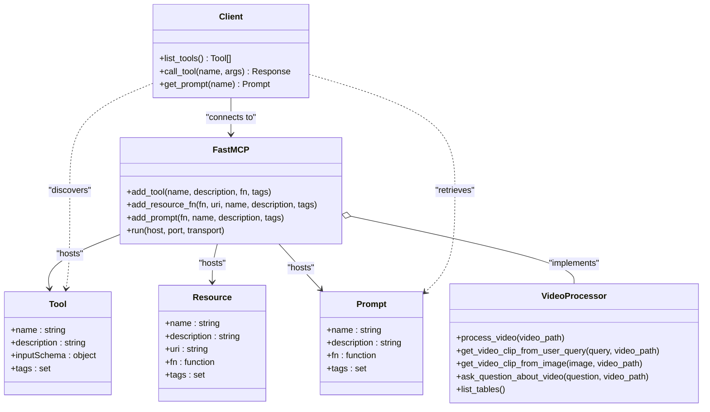
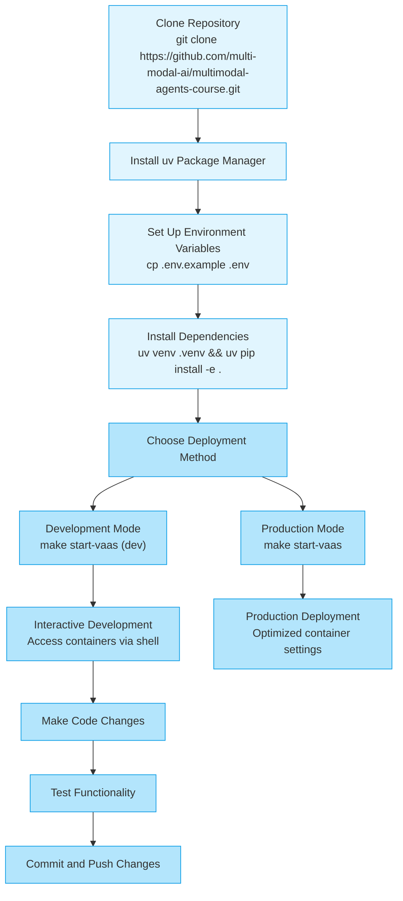
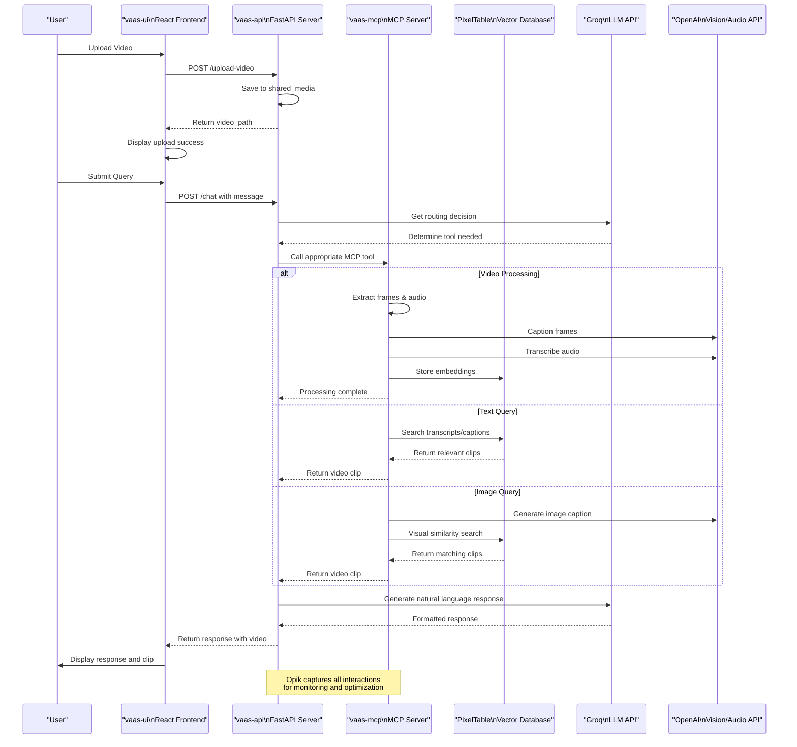

# System Overview

<cite>
**Referenced Files in This Document**   
- [GETTING_STARTED.md](file://GETTING_STARTED.md)
- [docker-compose.yml](file://docker-compose.yml)
- [vaas-api/README.md](file://vaas-api/README.md)
- [vaas-mcp/README.md](file://vaas-mcp/README.md)
- [vaas-ui/README.md](file://vaas-ui/README.md)
- [vaas-api/src/vaas_api/api.py](file://vaas-api/src/vaas_api/api.py)
- [vaas-mcp/src/vaas_mcp/server.py](file://vaas-mcp/src/vaas_mcp/server.py)
- [vaas-api/src/vaas_api/config.py](file://vaas-api/src/vaas_api/config.py)
- [vaas-mcp/src/vaas_mcp/config.py](file://vaas-mcp/src/vaas_mcp/config.py)
- [vaas-api/src/vaas_api/agent/base_agent.py](file://vaas-api/src/vaas_api/agent/base_agent.py)
- [Makefile](file://Makefile)
</cite>

## Table of Contents
1. [Introduction](#introduction)
2. [Core Components](#core-components)
3. [Architecture Overview](#architecture-overview)
4. [Model Context Protocol (MCP) Integration](#model-context-protocol-mcp-integration)
5. [Key Use Cases](#key-use-cases)
6. [Development Workflow](#development-workflow)
7. [External Dependencies](#external-dependencies)
8. [Service Orchestration](#service-orchestration)
9. [Data Flow and Processing](#data-flow-and-processing)
10. [Conclusion](#conclusion)

## Introduction
vaas is a full-stack AI application designed to enable natural language and image-based querying of video content. The system allows users to search, retrieve clips, and answer questions about video content through a conversational interface. Built as a multimodal agent system, vaas processes both text and visual inputs to provide intelligent responses based on video analysis. The architecture follows a microservices approach with three main components that work together through well-defined interfaces. This system is particularly useful for video content analysis, enabling users to find specific moments in videos without manually scrubbing through timelines. The application leverages advanced AI models for video understanding, making it accessible to users who want to interact with video content in a more intuitive way.

**Section sources**
- [GETTING_STARTED.md](file://GETTING_STARTED.md)

## Core Components
The vaas system consists of three primary components that work together to deliver multimodal video analysis capabilities. The vaas-api serves as the FastAPI backend that orchestrates the entire system, providing RESTful endpoints for the frontend and managing communication with the MCP server. This component acts as the central hub that coordinates requests between the user interface and the video processing services. The vaas-mcp component functions as the MCP (Model Context Protocol) server dedicated to video processing tasks, hosting tools, prompts, and resources needed for video analysis. It handles the heavy lifting of video ingestion, indexing, and retrieval operations. The vaas-ui component provides the React frontend interface that offers a chat-based user experience for interacting with the video processing agent. These three components are designed to work independently but are typically deployed together through Docker Compose for a complete end-to-end solution. Each component has its own technology stack and responsibilities, enabling separation of concerns and independent development.

**Section sources**
- [GETTING_STARTED.md](file://GETTING_STARTED.md)
- [vaas-api/README.md](file://vaas-api/README.md)
- [vaas-mcp/README.md](file://vaas-mcp/README.md)
- [vaas-ui/README.md](file://vaas-ui/README.md)

## Architecture Overview
The vaas system follows a client-server architecture with clear separation between presentation, application logic, and data processing layers. The React frontend (vaas-ui) communicates with the FastAPI backend (vaas-api) through REST APIs, which in turn interacts with the MCP server (vaas-mcp) for video processing capabilities. This layered architecture enables scalability and maintainability by isolating concerns across components. The system uses shared storage volumes for media files, allowing seamless data exchange between services without direct file system dependencies. Communication between components occurs primarily through HTTP-based APIs, with the vaas-api acting as an intermediary that translates frontend requests into MCP tool calls. The architecture supports both synchronous operations for immediate responses and asynchronous background tasks for long-running video processing operations. This design allows the system to handle computationally intensive video analysis tasks while maintaining responsive user interactions in the frontend interface.

```mermaid
graph TB
subgraph "Frontend"
UI[vaas-ui\nReact Application]
end
subgraph "Backend Services"
API[vaas-api\nFastAPI Server]
MCP[vaas-mcp\nMCP Server]
end
subgraph "External Services"
Groq[External\nGroq API]
OpenAI[External\nOpenAI API]
Opik[External\nOpik]
PixelTable[External\nPixelTable]
end
UI --> |HTTP Requests| API
API --> |MCP Client| MCP
API --> |API Calls| Groq
MCP --> |API Calls| OpenAI
MCP --> |Data Storage| PixelTable
API < --> |Monitoring &\nPrompt Management| Opik
MCP < --> |Monitoring &\nPrompt Management| Opik
style UI fill:#4A90E2,stroke:#333
style API fill:#50C878,stroke:#333
style MCP fill:#D4AF37,stroke:#333
style Groq fill:#FF6B6B,stroke:#333
style OpenAI fill:#FF6B6B,stroke:#333
style Opik fill:#9C27B0,stroke:#333
style PixelTable fill:#3498DB,stroke:#333
```

**Diagram sources**
- [docker-compose.yml](file://docker-compose.yml)
- [vaas-api/src/vaas_api/api.py](file://vaas-api/src/vaas_api/api.py)
- [vaas-mcp/src/vaas_mcp/server.py](file://vaas-mcp/src/vaas_mcp/server.py)

## Model Context Protocol (MCP) Integration
The Model Context Protocol (MCP) serves as the foundation for tool orchestration within the vaas system, enabling structured interaction between AI models and external tools. The vaas-mcp server implements MCP to expose video processing capabilities as discoverable tools that can be dynamically invoked by the agent. This protocol allows the system to maintain a clear separation between the reasoning component (agent) and execution components (tools), following the principle of separation of concerns in AI agent design. The MCP server hosts several key tools including video processing, clip retrieval based on queries, clip retrieval based on images, and question answering about video content. These tools are registered with metadata that describes their purpose, parameters, and capabilities, allowing the agent to understand when and how to use them appropriately. The protocol also supports resources and prompts, enabling versioned prompt management through Opik and access to system resources like available video indexes. This architecture allows for flexible tool composition and dynamic capability discovery, making the system adaptable to different video analysis scenarios.



**Diagram sources**
- [vaas-mcp/src/vaas_mcp/server.py](file://vaas-mcp/src/vaas_mcp/server.py)
- [vaas-api/src/vaas_api/agent/base_agent.py](file://vaas-api/src/vaas_api/agent/base_agent.py)

## Key Use Cases
The vaas system supports several key use cases centered around video content analysis and retrieval. Video search enables users to find specific moments in videos by describing what they're looking for in natural language, such as "show me when the character says 'pass the butter'." Clip retrieval allows users to extract specific video segments based on queries or visual examples, supporting both text-based and image-based searches. Question answering about video content lets users ask natural language questions about video content and receive relevant answers with associated video clips. The system can process both audio transcripts and visual elements to provide comprehensive responses. Image-based querying enables users to upload an image and find matching scenes in videos, useful for identifying specific visual moments without knowing exactly when they occur. These use cases are supported by the underlying MCP tools that handle video processing, similarity search, and content analysis. The system's architecture allows these capabilities to be accessed through a simple chat interface, making advanced video analysis accessible to non-technical users.

**Section sources**
- [vaas-mcp/src/vaas_mcp/server.py](file://vaas-mcp/src/vaas_mcp/server.py)
- [vaas-api/src/vaas_api/api.py](file://vaas-api/src/vaas_api/api.py)

## Development Workflow
The development workflow for vaas is designed to be simple and consistent across all components, leveraging Makefile commands for common operations. Developers start by cloning the repository and setting up uv as the Python package manager for both backend components. Each component has its own setup process involving virtual environment creation and dependency installation, but the overall pattern is consistent across vaas-api and vaas-mcp. The system uses Docker Compose for orchestration, with separate configuration files for development and production environments. The development workflow includes commands for building, starting, and stopping the entire system with a single command. For individual component development, the docker-compose.dev.yml file includes a sleep infinity command that keeps containers running for interactive development. This allows developers to enter containers, modify code, and test changes without restarting services. The workflow also supports standalone operation of components, enabling focused development and testing of specific system parts. Environment variables are managed through .env files, with example files provided for easy configuration.



**Diagram sources**
- [Makefile](file://Makefile)
- [docker-compose.yml](file://docker-compose.yml)
- [docker-compose.dev.yml](file://docker-compose.dev.yml)

## External Dependencies
The vaas system integrates with several external services to provide its multimodal capabilities. Groq provides high-performance LLM inference for the agent's reasoning and response generation, with specific models used for routing, tool use, and general responses. OpenAI's API is utilized by the MCP server for image captioning and audio transcription tasks, leveraging GPT models to extract semantic meaning from visual and audio content. Opik serves as the observability and prompt management platform, providing tracking for agent interactions and version control for system prompts. PixelTable functions as the vector database and indexing system for video content, storing embeddings and enabling similarity search across video frames, transcripts, and captions. These external dependencies are configured through environment variables, allowing for flexible deployment and easy credential management. The system's architecture isolates these dependencies behind well-defined interfaces, making it possible to substitute alternative services if needed. This approach ensures that the core functionality remains maintainable while benefiting from specialized external AI services.

**Section sources**
- [vaas-api/src/vaas_api/config.py](file://vaas-api/src/vaas_api/config.py)
- [vaas-mcp/src/vaas_mcp/config.py](file://vaas-mcp/src/vaas_mcp/config.py)

## Service Orchestration
The vaas system uses Docker Compose for service orchestration, defining three main services that work together in a coordinated manner. The vaas-mcp service runs on port 9090 and serves as the MCP server for video processing, with resource limits set to 4 CPUs and 4GB of memory to handle intensive video operations. The vaas-api service runs on port 8080 as the FastAPI backend, depending on the MCP server to ensure proper startup ordering. The vaas-ui service runs on port 3000, providing the React frontend interface that depends on both backend services. All services share a common network (agent-network) and a shared media volume for exchanging video files. This orchestration strategy ensures that services can communicate with each other using service names as hostnames, following Docker's internal DNS resolution. The compose configuration also includes volume mounts for caching and development tools, improving performance and developer experience. The system uses environment files for configuration, keeping sensitive credentials out of the codebase while allowing for easy customization.

```mermaid
graph TB
subgraph "Docker Compose Orchestration"
subgraph "Services"
MCP["vaas-mcp\nPort: 9090\nCPU: 4\nMemory: 4GB"]
API["vaas-api\nPort: 8080"]
UI["vaas-ui\nPort: 3000"]
end
subgraph "Network"
Network["agent-network\nInternal Communication"]
end
subgraph "Volumes"
Media["shared_media\nVideo Storage"]
Cache["~/.cache\nHugging Face Cache"]
VSCode["./.vscode\nDevelopment Tools"]
end
MCP --> Network
API --> Network
UI --> Network
API --> Media
MCP --> Media
UI --> Media
MCP --> Cache
MCP --> VSCode
API --> VSCode
style MCP fill:#FFD700,stroke:#333
style API fill:#32CD32,stroke:#333
style UI fill:#4169E1,stroke:#333
style Network fill:#87CEEB,stroke:#333
style Media fill:#98FB98,stroke:#333
style Cache fill:#98FB98,stroke:#333
style VSCode fill:#98FB98,stroke:#333
end
classDef service fill:#fff,stroke:#333,stroke-width:2px;
class MCP,API,UI service
```

**Diagram sources**
- [docker-compose.yml](file://docker-compose.yml)
- [docker-compose.dev.yml](file://docker-compose.dev.yml)

## Data Flow and Processing
The data flow in the vaas system follows a well-defined pattern from user input to processed output. When a user uploads a video through the UI, it is first sent to the vaas-api service which stores it in the shared_media volume and returns a path reference. The API then initiates video processing by calling the process_video tool on the vaas-mcp server, which performs frame extraction, audio transcription, and feature embedding. These processed elements are stored in PixelTable with appropriate indexes for efficient retrieval. When a user submits a query, the vaas-api agent uses Groq models to determine the appropriate MCP tool to call based on the input type (text or image). For text queries, the system may use transcript similarity search or caption-based search, while image queries trigger visual similarity search. The MCP server coordinates these searches across different modalities and returns relevant video clips. The response flows back through the API to the UI, where results are displayed in the chat interface. Throughout this process, Opik captures telemetry data for monitoring and prompt optimization. The architecture supports both synchronous responses for simple queries and asynchronous processing for resource-intensive operations.



**Diagram sources**
- [vaas-api/src/vaas_api/api.py](file://vaas-api/src/vaas_api/api.py)
- [vaas-mcp/src/vaas_mcp/server.py](file://vaas-mcp/src/vaas_mcp/server.py)
- [vaas-api/src/vaas_api/agent/base_agent.py](file://vaas-api/src/vaas_api/agent/base_agent.py)

## Conclusion
The vaas system represents a sophisticated full-stack AI application that enables natural language and image-based interaction with video content. By leveraging the Model Context Protocol, the architecture achieves a clean separation between reasoning and execution, allowing for flexible tool orchestration and multimodal processing. The three-component design (vaas-api, vaas-mcp, and vaas-ui) provides a scalable and maintainable foundation that can be extended with additional tools and capabilities. The integration of external services like Groq, OpenAI, Opik, and PixelTable enhances the system's functionality while maintaining clear boundaries between components. The Docker Compose orchestration simplifies deployment and ensures consistent behavior across development and production environments. For beginners, the system provides an accessible chat interface to complex video analysis capabilities, while experienced developers can appreciate the well-structured integration points and extensible architecture. The development workflow is streamlined through Makefile commands and containerization, lowering the barrier to contribution and customization. Overall, vaas demonstrates how modern AI agent patterns can be applied to solve practical problems in video content analysis.