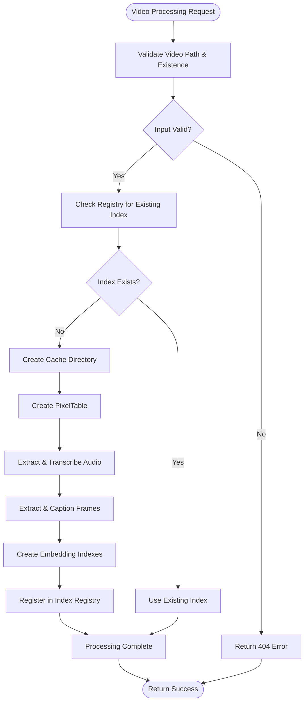
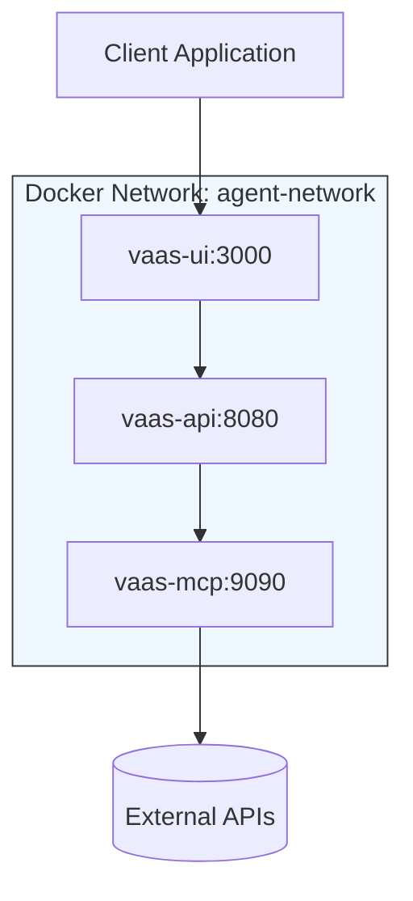

# Troubleshooting Guide

<cite>
**Referenced Files in This Document**   
- [docker-compose.yml](file://docker-compose.yml)
- [vaas-api/src/vaas_api/config.py](file://vaas-api/src/vaas_api/config.py)
- [vaas-mcp/src/vaas_mcp/config.py](file://vaas-mcp/src/vaas_mcp/config.py)
- [vaas-api/src/vaas_api/api.py](file://vaas-api/src/vaas_api/api.py)
- [vaas-mcp/src/vaas_mcp/server.py](file://vaas-mcp/src/vaas_mcp/server.py)
- [vaas-mcp/src/vaas_mcp/video/ingestion/video_processor.py](file://vaas-mcp/src/vaas_mcp/video/ingestion/video_processor.py)
- [vaas-mcp/src/vaas_mcp/video/ingestion/tools.py](file://vaas-mcp/src/vaas_mcp/video/ingestion/tools.py)
- [vaas-api/src/vaas_api/opik_utils.py](file://vaas-api/src/vaas_api/opik_utils.py)
- [vaas-mcp/src/vaas_mcp/opik_utils.py](file://vaas-mcp/src/vaas_mcp/opik_utils.py)
</cite>

## Table of Contents
1. [Introduction](#introduction)
2. [Startup Failures](#startup-failures)
3. [Video Processing Errors](#video-processing-errors)
4. [API Connectivity Issues](#api-connectivity-issues)
5. [Agent Response Problems](#agent-response-problems)
6. [UI Display Bugs](#ui-display-bugs)
7. [Logging and Observability](#logging-and-observability)
8. [Rate Limiting and Timeouts](#rate-limiting-and-timeouts)
9. [Decision Tree for Problem Isolation](#decision-tree-for-problem-isolation)
10. [Escalation Paths](#escalation-paths)

## Introduction
This troubleshooting guide provides comprehensive solutions for common issues encountered in the multimodal-agents-course system. The architecture consists of three main services: vaas-api (agent orchestration), vaas-mcp (video processing), and vaas-ui (frontend interface), coordinated through Docker Compose with shared volumes for media files and caching. This guide categorizes problems by component and provides diagnostic steps, root cause analysis, and resolution procedures.

## Startup Failures

### Service Fails to Start
**Symptoms**: Container exits immediately or fails to become healthy  
**Root Causes**: Missing environment variables, volume permission issues, port conflicts  
**Diagnostic Steps**:
1. Check container logs: `docker logs vaas-mcp`, `docker logs vaas-api`, `docker logs vaas-ui`
2. Verify environment files exist: `vaas-mcp/.env`, `vaas-api/.env`
3. Confirm required ports are available: 9090 (MCP), 8080 (API), 3000 (UI)

**Solutions**:
- Ensure `.env` files contain required variables (OPIK_API_KEY, OPENAI_API_KEY, GROQ_API_KEY)
- Fix shared volume permissions: `chmod -R 777 shared_media` if needed
- Resolve port conflicts by stopping conflicting processes or modifying docker-compose.yml
- Verify Docker has sufficient resources (4GB memory, 4 CPUs as specified in compose file)

**Section sources**
- [docker-compose.yml](file://docker-compose.yml#L1-L66)
- [vaas-api/src/vaas_api/config.py](file://vaas-api/src/vaas_api/config.py#L1-L42)
- [vaas-mcp/src/vaas_mcp/config.py](file://vaas-mcp/src/vaas_mcp/config.py#L1-L55)

## Video Processing Errors

### Video Processing Hangs
**Symptoms**: `/process-video` endpoint accepts request but never completes, high CPU usage  
**Root Causes**: Shared volume permission issues, corrupted video files, PyAV compatibility problems  
**Diagnostic Steps**:
1. Check vaas-mcp logs for video processing errors
2. Verify video file exists in shared_media volume
3. Test video file accessibility within container: `docker exec vaas-mcp ls -la /app/shared_media/`
4. Check if video needs re-encoding by examining PyAV errors

**Solutions**:
- Ensure proper permissions on shared_media volume
- Use `re_encode_video` tool to convert incompatible formats via FFmpeg
- Validate video file integrity before processing
- Monitor disk space in container: `docker exec vaas-mcp df -h`

### Video Index Creation Fails
**Symptoms**: `setup_table` fails, registry errors, missing cache directories  
**Root Causes**: Insufficient disk space, permission issues in cache directories, registry corruption  
**Diagnostic Steps**:
1. Examine VideoProcessor initialization logs
2. Check cache directory creation: `docker exec vaas-mcp ls -la /app/cache_*`
3. Verify registry state in `.records/records.json`

**Solutions**:
- Ensure adequate disk space for video processing (several GB per video)
- Fix directory permissions for cache paths
- Clear corrupted registry entries if needed
- Restart MCP server to reset registry state

**Diagram sources**
- [vaas-mcp/src/vaas_mcp/video/ingestion/video_processor.py](file://vaas-mcp/src/vaas_mcp/video/ingestion/video_processor.py#L69-L199)
- [vaas-mcp/src/vaas_mcp/video/ingestion/tools.py](file://vaas-mcp/src/vaas_mcp/video/ingestion/tools.py#L1-L154)

**Section sources**
- [vaas-mcp/src/vaas_mcp/video/ingestion/video_processor.py](file://vaas-mcp/src/vaas_mcp/video/ingestion/video_processor.py#L1-L199)
- [vaas-mcp/src/vaas_mcp/video/ingestion/tools.py](file://vaas-mcp/src/vaas_mcp/video/ingestion/tools.py#L1-L154)

## API Connectivity Issues

### API Endpoint Unreachable
**Symptoms**: Connection refused, timeout when calling API endpoints  
**Root Causes**: Service not running, network configuration issues, CORS misconfiguration  
**Diagnostic Steps**:
1. Verify vaas-api container is running: `docker ps | grep vaas-api`
2. Test API connectivity from within network: `docker exec vaas-ui curl -v http://vaas-api:8080/`
3. Check CORS configuration in api.py
4. Verify service dependencies in docker-compose.yml

**Solutions**:
- Ensure vaas-api container is healthy and listening on port 8080
- Confirm agent-network is properly created and services are attached
- Verify CORS settings allow required origins (currently set to allow all)
- Check that vaas-api depends on vaas-mcp in compose file

### MCP Server Connection Failure
**Symptoms**: "MCP server not found" errors, tool execution failures  
**Root Causes**: MCP service not running, incorrect MCP_SERVER URL, network isolation  
**Diagnostic Steps**:
1. Verify MCP server is running on port 9090
2. Check MCP_SERVER configuration in vaas-api/config.py
3. Test MCP endpoint connectivity: `curl http://localhost:9090/mcp`

**Solutions**:
- Ensure vaas-mcp container is running and healthy
- Verify MCP_SERVER URL is set to `http://vaas-mcp:9090/mcp` in API config
- Confirm both services are on agent-network as specified in compose file

**Diagram sources**
- [docker-compose.yml](file://docker-compose.yml#L1-L66)
- [vaas-api/src/vaas_api/config.py](file://vaas-api/src/vaas_api/config.py#L1-L42)
- [vaas-api/src/vaas_api/api.py](file://vaas-api/src/vaas_api/api.py#L1-L197)

**Section sources**
- [docker-compose.yml](file://docker-compose.yml#L1-L66)
- [vaas-api/src/vaas_api/api.py](file://vaas-api/src/vaas_api/api.py#L1-L197)
- [vaas-mcp/src/vaas_mcp/server.py](file://vaas-mcp/src/vaas_mcp/server.py#L1-L96)

## Agent Response Problems

### Tool Selection Errors
**Symptoms**: Agent fails to select appropriate tools, incorrect tool routing  
**Root Causes**: Invalid tool specifications, prompt engineering issues, Opik configuration problems  
**Diagnostic Steps**:
1. Check Opik traces for tool selection decisions
2. Validate tool specifications in vaas-mcp/server.py
3. Examine prompt configurations in prompts.py
4. Review Opik project settings and workspace configuration

**Solutions**:
- Verify all tools are properly registered with correct parameters
- Check Opik configuration for proper API key and project settings
- Validate prompt templates are correctly loaded and formatted
- Use Opik traces to analyze decision-making process

### Agent Memory Issues
**Symptoms**: Agent forgets context, inconsistent responses across conversations  
**Root Causes**: Memory reset failures, improper memory size configuration, state management bugs  
**Diagnostic Steps**:
1. Check AGENT_MEMORY_SIZE configuration
2. Verify memory reset functionality via `/reset-memory` endpoint
3. Examine agent state management in base_agent.py

**Solutions**:
- Adjust AGENT_MEMORY_SIZE in config.py based on requirements
- Ensure memory is properly reset between sessions
- Validate memory persistence across requests

**Section sources**
- [vaas-api/src/vaas_api/config.py](file://vaas-api/src/vaas_api/config.py#L1-L42)
- [vaas-mcp/src/vaas_mcp/server.py](file://vaas-mcp/src/vaas_mcp/server.py#L1-L96)
- [vaas-api/src/vaas_api/api.py](file://vaas-api/src/vaas_api/api.py#L1-L197)

## UI Display Bugs

### UI Fails to Load
**Symptoms**: Blank page, JavaScript errors, assets not loading  
**Root Causes**: API connectivity issues, CORS problems, build artifacts missing  
**Diagnostic Steps**:
1. Check browser developer console for errors
2. Verify vaas-ui container is running and serving on port 3000
3. Test API endpoint connectivity from browser
4. Examine nginx.conf configuration

**Solutions**:
- Ensure vaas-api is reachable from browser context
- Verify CORS settings allow the UI origin
- Check that UI build process completed successfully
- Confirm static assets are properly served

### Media Display Issues
**Symptoms**: Videos not playing, images not loading  
**Root Causes**: Shared volume mounting issues, incorrect media paths, permission problems  
**Diagnostic Steps**:
1. Verify shared_media volume is mounted in all containers
2. Check media file paths in responses
3. Test media serving endpoint: `/media/{filename}`

**Solutions**:
- Ensure shared_media volume is properly mounted in docker-compose.yml
- Verify media files are accessible in shared volume
- Check that file paths are correctly formatted in API responses

**Section sources**
- [docker-compose.yml](file://docker-compose.yml#L1-L66)
- [vaas-api/src/vaas_api/api.py](file://vaas-api/src/vaas_api/api.py#L1-L197)
- [vaas-ui/nginx.conf](file://vaas-ui/nginx.conf)

## Logging and Observability

### Using Opik for Request Tracing
**Configuration**:
- Both vaas-api and vaas-mcp configure Opik using OPIK_API_KEY and OPIK_PROJECT
- Opik is initialized in opik_utils.py during service startup
- Traces include tool usage, agent decisions, and processing steps

**Diagnostic Commands**:
- Monitor Opik dashboard for real-time request tracing
- Filter traces by project (vaas-api, vaas-mcp)
- Examine individual spans for tool execution details
- Analyze prompt versions and their performance

**Log Locations**:
- vaas-api: Container logs via `docker logs vaas-api`
- vaas-mcp: Container logs via `docker logs vaas-mcp`
- vaas-ui: Container logs via `docker logs vaas-ui`
- All services use loguru for structured logging with context binding

**Section sources**
- [vaas-api/src/vaas_api/opik_utils.py](file://vaas-api/src/vaas_api/opik_utils.py#L1-L43)
- [vaas-mcp/src/vaas_mcp/opik_utils.py](file://vaas-mcp/src/vaas_mcp/opik_utils.py#L1-L43)
- [vaas-api/src/vaas_api/api.py](file://vaas-api/src/vaas_api/api.py#L1-L197)

## Rate Limiting and Timeouts

### External API Rate Limiting
**Symptoms**: Intermittent failures with external APIs (OpenAI, Groq), 429 errors  
**Root Causes**: Exceeding API rate limits, insufficient retry logic, high concurrency  
**Diagnostic Steps**:
1. Check logs for rate limit error messages
2. Monitor API usage patterns
3. Examine retry logic in agent implementations

**Solutions**:
