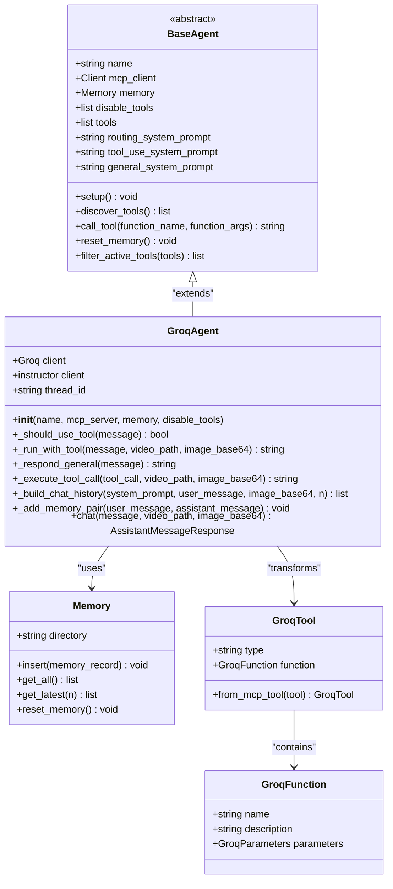
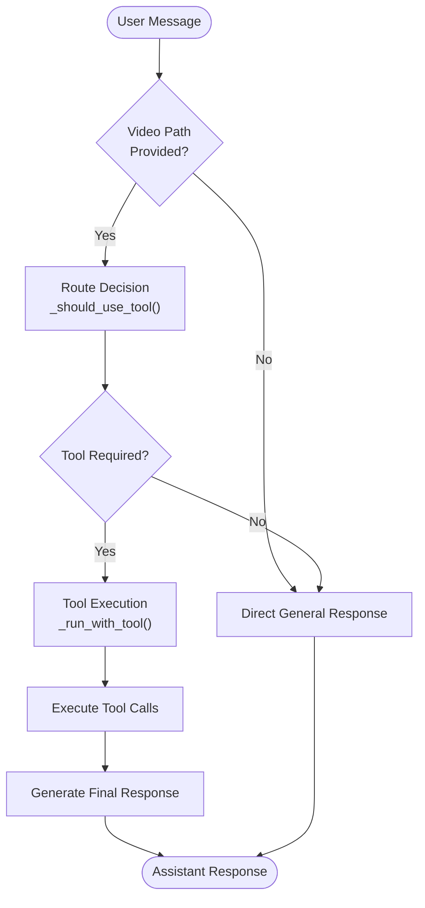
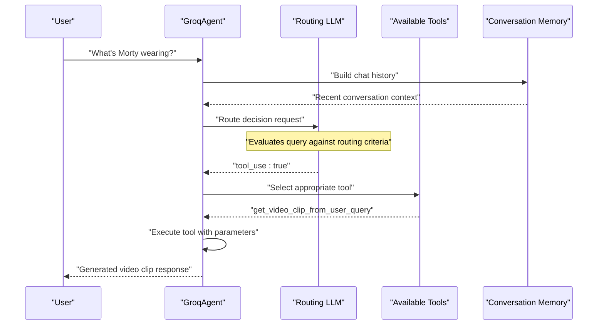
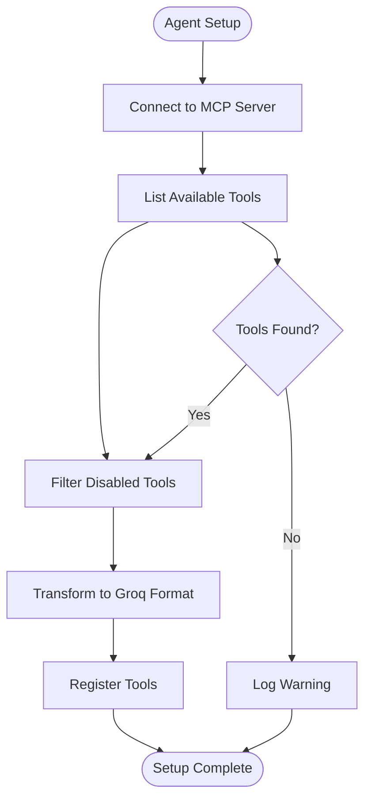
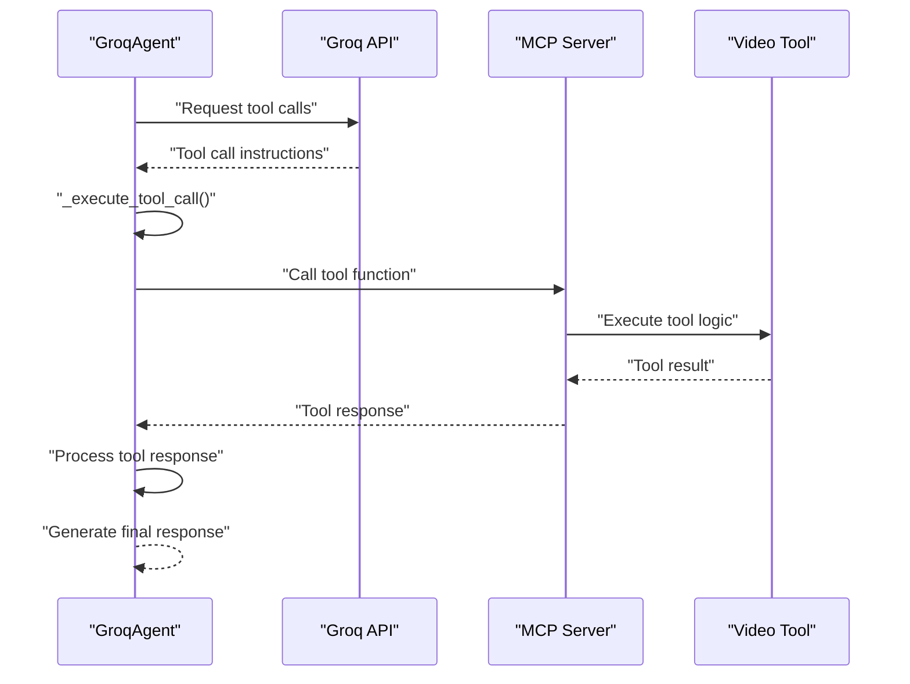
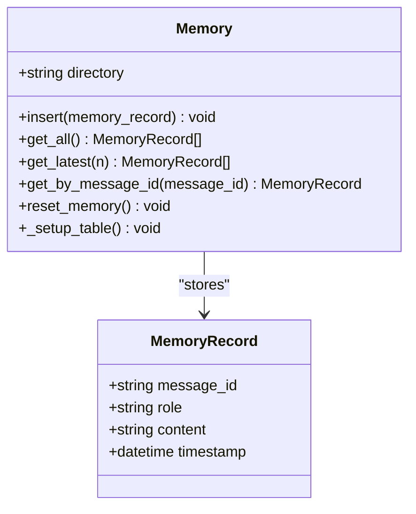

# Agent Playground Tutorial

<cite>
**Referenced Files in This Document**
- [2_agent_playground.ipynb](file://vaas-api/notebooks/2_agent_playground.ipynb)
- [groq_agent.py](file://vaas-api/src/vaas_api/agent/groq/groq_agent.py)
- [base_agent.py](file://vaas-api/src/vaas_api/agent/base_agent.py)
- [groq_tool.py](file://vaas-api/src/vaas_api/agent/groq/groq_tool.py)
- [models.py](file://vaas-api/src/vaas_api/models.py)
- [config.py](file://vaas-api/src/vaas_api/config.py)
- [prompts.py](file://vaas-mcp/src/vaas_mcp/prompts.py)
- [tools.py](file://vaas-mcp/src/vaas_mcp/tools.py)
- [memory.py](file://vaas-api/src/vaas_api/agent/memory.py)
</cite>

## Table of Contents
1. [Introduction](#introduction)
2. [Agent Architecture Overview](#agent-architecture-overview)
3. [GroqAgent Implementation](#groqagent-implementation)
4. [Decision-Making Process](#decision-making-process)
5. [Prompt Engineering](#prompt-engineering)
6. [Tool Discovery and Execution](#tool-discovery-and-execution)
7. [Memory Management](#memory-management)
8. [Interactive Examples](#interactive-examples)
9. [Customization Challenges](#customization-challenges)
10. [Troubleshooting Guide](#troubleshooting-guide)
11. [Conclusion](#conclusion)

## Introduction

The vaas system demonstrates sophisticated AI agent behavior through its GroqAgent implementation, which intelligently routes user queries between general conversational responses and specialized tool-based operations. This tutorial explores how the agent interprets user intent, makes routing decisions, and executes appropriate actions based on the context provided.

The agent playground notebook showcases the decision-making capabilities of the GroqAgent, demonstrating how it analyzes user queries to determine whether to provide direct responses or invoke specialized tools for video processing tasks. Through interactive examples, users can observe the agent's reasoning process and learn how to customize its behavior through prompt engineering.

## Agent Architecture Overview

The vaas system employs a modular agent architecture built around the BaseAgent abstraction, with GroqAgent serving as the primary implementation. This design enables flexible deployment across different LLM providers while maintaining consistent behavior patterns.



**Diagram sources**
- [base_agent.py](file://vaas-api/src/vaas_api/agent/base_agent.py#L6-L111)
- [groq_agent.py](file://vaas-api/src/vaas_api/agent/groq/groq_agent.py#L25-L237)
- [memory.py](file://vaas-api/src/vaas_api/agent/memory.py#L10-L51)
- [groq_tool.py](file://vaas-api/src/vaas_api/agent/groq/groq_tool.py#L1-L61)

The architecture separates concerns effectively:
- **BaseAgent**: Provides the foundation with MCP integration and memory management
- **GroqAgent**: Implements Groq-specific logic including tool selection and execution
- **Memory**: Handles conversation persistence using PixelTable
- **GroqTool**: Transforms MCP tools into Groq-compatible function definitions

**Section sources**
- [base_agent.py](file://vaas-api/src/vaas_api/agent/base_agent.py#L6-L111)
- [groq_agent.py](file://vaas-api/src/vaas_api/agent/groq/groq_agent.py#L25-L237)

## GroqAgent Implementation

The GroqAgent class serves as the central orchestrator for the vaas system, implementing sophisticated decision-making logic to route user queries appropriately. The agent maintains separate system prompts for different operational modes and manages tool discovery and execution.

### Initialization and Setup

The agent initialization process establishes connections to external services and prepares the agent for operation:

```python
agent = GroqAgent(
    name="my_test_agent",
    mcp_server="http://localhost:9090/mcp",
    disable_tools=["process_video"],
)
await agent.setup()
```

During setup, the agent performs several critical operations:
1. **Tool Discovery**: Connects to the MCP server to discover available tools
2. **Prompt Loading**: Retrieves system prompts for routing, tool use, and general conversation
3. **Client Initialization**: Sets up Groq clients with appropriate configurations

### Core Decision Logic

The agent's decision-making process revolves around the `_should_use_tool` method, which determines whether a user query requires tool invocation:



**Diagram sources**
- [groq_agent.py](file://vaas-api/src/vaas_api/agent/groq/groq_agent.py#L215-L237)

The routing decision is made through structured LLM inference using the RoutingResponseModel:

```python
response = self.instructor_client.chat.completions.create(
    model=settings.GROQ_ROUTING_MODEL,
    response_model=RoutingResponseModel,
    messages=messages,
    max_completion_tokens=20,
)
return response.tool_use
```

**Section sources**
- [groq_agent.py](file://vaas-api/src/vaas_api/agent/groq/groq_agent.py#L25-L237)
- [config.py](file://vaas-api/src/vaas_api/config.py#L10-L20)

## Decision-Making Process

The agent's decision-making process is the cornerstone of its intelligent behavior. This section explores how the agent analyzes user queries, evaluates context, and makes routing decisions.

### Routing Logic Architecture

The routing system operates through a multi-layered approach that considers various factors:



**Diagram sources**
- [groq_agent.py](file://vaas-api/src/vaas_api/agent/groq/groq_agent.py#L65-L75)
- [prompts.py](file://vaas-mcp/src/vaas_mcp/prompts.py#L10-L25)

### Context-Aware Decision Making

The agent considers multiple contextual factors when making routing decisions:

1. **Video Context**: Presence of video files triggers tool-based responses
2. **Image Context**: User-provided images influence tool selection
3. **Query Type**: Nature of the user's question determines appropriate action
4. **Previous Interactions**: Conversation history informs current decisions

### Tool Selection Criteria

When tool use is required, the agent employs sophisticated logic to select the optimal tool:

```python
# Tool selection logic from _run_with_tool method
if function_name == "get_video_clip_from_image":
    function_args["user_image"] = image_base64

try:
    return await self.call_tool(function_name, function_args)
except Exception as e:
    logger.error(f"Error executing tool {function_name}: {str(e)}")
    return f"Error executing tool {function_name}: {str(e)}"
```

**Section sources**
- [groq_agent.py](file://vaas-api/src/vaas_api/agent/groq/groq_agent.py#L65-L120)
- [tools.py](file://vaas-mcp/src/vaas_mcp/tools.py#L40-L105)

## Prompt Engineering

The effectiveness of the agent's decision-making relies heavily on carefully crafted prompts that guide the LLM's reasoning process. The vaas system employs three distinct prompt categories, each serving a specific purpose in the agent's workflow.

### Routing System Prompt

The routing prompt serves as the initial decision gate, determining whether user queries require tool-based responses:

```
You are a routing assistant responsible for determining whether the user needs 
to perform an operation on a video.

Given a conversation history, between the user and the assistant, your task is
to determine if the user needs help with any of the following tasks:

- Extracting a clip from a specific moment in the video
- Retrieving information about a particular detail in the video

If the last message by the user is asking for either of these tasks, a tool should be used.

Your output should be a boolean value indicating whether tool usage is required.
```

### Tool Use System Prompt

The tool use prompt provides comprehensive guidance for selecting and executing appropriate tools:

```
Your name is vaas, a tool use assistant in charge
of a video processing application. 

You need to determine which tool to use based on the user query (if any).

The tools available are:

- 'get_video_clip_from_user_query': This tool is used to get a clip from the video based on the user query.
- 'get_video_clip_from_image': This tool is used to get a clip from the video based on an image provided by the user.
- 'ask_question_about_video': This tool is used to get some information about the video. The information needs to be retrieved from the 'video_context'

# Additional rules:
- If the user has provided an image, you should always use the 'get_video_clip_from_image' tool.

# Current information:
- Is image provided: {is_image_provided}
```

### General System Prompt

The general prompt establishes the agent's personality and conversational style:

```
Your name is vaas, a friendly assistant in charge
of a video processing application. 

Your name is inspired in the genius director Stanly vaas, and you are a 
big fan of his work, in fact your favorite film is
"2001: A Space Odyssey", because you feel really connected to HAL 9000.

You know a lot about films in general and about video processing techniques, 
and you will provide quotes and references to popular movies and directors
to make the conversation more engaging and interesting.
```

### Prompt Variability and Adaptation

The prompts incorporate dynamic elements to adapt to different contexts:

```python
tool_use_system_prompt = self.tool_use_system_prompt.format(
    is_image_provided=bool(image_base64),
)
```

This dynamic formatting ensures the agent's reasoning remains contextually appropriate for each interaction.

**Section sources**
- [prompts.py](file://vaas-mcp/src/vaas_mcp/prompts.py#L10-L109)
- [groq_agent.py](file://vaas-api/src/vaas_api/agent/groq/groq_agent.py#L75-L85)

## Tool Discovery and Execution

The agent's ability to discover and execute tools is fundamental to its functionality. This section examines the tool discovery process, transformation pipeline, and execution mechanisms.

### Tool Discovery Process

The agent discovers available tools through the MCP (Model Context Protocol) server:



**Diagram sources**
- [base_agent.py](file://vaas-api/src/vaas_api/agent/base_agent.py#L60-L95)

### Tool Transformation Pipeline

The transformation process converts MCP tools into Groq-compatible function definitions:

```python
def transform_tool_definition(tool) -> dict:
    """Transform an MCP tool into a Groq tool definition dictionary."""
    return GroqTool.from_mcp_tool(tool).model_dump()
```

This transformation handles parameter schema conversion, type mapping, and metadata preservation.

### Tool Execution Workflow

When tools are selected for execution, the agent follows a structured workflow:



**Diagram sources**
- [groq_agent.py](file://vaas-api/src/vaas_api/agent/groq/groq_agent.py#L85-L120)
- [base_agent.py](file://vaas-api/src/vaas_api/agent/base_agent.py#L95-L105)

### Error Handling and Recovery

The agent implements robust error handling for tool execution failures:

```python
try:
    return await self.call_tool(function_name, function_args)
except Exception as e:
    logger.error(f"Error executing tool {function_name}: {str(e)}")
    return f"Error executing tool {function_name}: {str(e)}"
```

This ensures graceful degradation when tools encounter unexpected issues.

**Section sources**
- [base_agent.py](file://vaas-api/src/vaas_api/agent/base_agent.py#L60-L105)
- [groq_agent.py](file://vaas-api/src/vaas_api/agent/groq/groq_agent.py#L85-L120)
- [groq_tool.py](file://vaas-api/src/vaas_api/agent/groq/groq_tool.py#L50-L61)

## Memory Management

The agent's memory system provides persistent conversation context through PixelTable integration, enabling coherent multi-turn interactions and maintaining conversation history across sessions.

### Memory Architecture

The memory system consists of a structured table schema designed for efficient storage and retrieval:

```python
class MemoryRecord(BaseModel):
    message_id: str
    role: str
    content: str
    timestamp: datetime
```

### Storage and Retrieval Operations

The memory implementation supports various retrieval patterns:



**Diagram sources**
- [memory.py](file://vaas-api/src/vaas_api/agent/memory.py#L10-L51)

### Conversation Context Building

The agent builds conversation context by combining system prompts with recent memory entries:

```python
def _build_chat_history(
    self,
    system_prompt: str,
    user_message: str,
    image_base64: Optional[str] = None,
    n: int = settings.AGENT_MEMORY_SIZE,
) -> List[Dict[str, Any]]:
    history = [{"role": "system", "content": system_prompt}]
    history += [{"role": record.role, "content": record.content} for record in self.memory.get_latest(n)]
    
    user_content = (
        [
            {"type": "text", "text": user_message},
            {
                "type": "image_url",
                "image_url": {"url": f"data:image/jpeg;base64,{image_base64}"},
            },
        ]
        if image_base64
        else user_message
    )
    history.append({"role": "user", "content": user_content})
    return history
```

### Memory Size Configuration

The system allows configurable memory sizes through settings:

```python
AGENT_MEMORY_SIZE: int = 20
```

This setting controls how many conversation turns are maintained in the agent's context window.

**Section sources**
- [memory.py](file://vaas-api/src/vaas_api/agent/memory.py#L10-L51)
- [config.py](file://vaas-api/src/vaas_api/config.py#L25-L26)

## Interactive Examples

The agent playground notebook provides hands-on demonstrations of the agent's capabilities across various scenarios. These examples showcase different input types, tool interactions, and response patterns.

### Basic Interaction Example

The simplest interaction involves direct questions without video or image context:

```python
await agent.chat("What's your name?", None, None)
```

This demonstrates the agent's ability to provide general conversational responses using the general system prompt.

### Video-Based Tool Use

When videos are involved, the agent automatically engages tool-based processing:

```python
await agent.chat(
    "Can you tell me what's Morty wearing in the video?",
    "videos/pass_the_butter_rick_and_morty.mp4",
)
```

This example illustrates the agent's capability to:
1. Detect video context
2. Determine appropriate tool selection
3. Execute tool with relevant parameters
4. Generate context-aware responses

### Image-Based Interactions

The agent handles multimodal inputs by incorporating images into its decision-making:

```python
await agent.chat(
    "Can you describe me this image?",
    "videos/pass_the_butter_rick_and_morty.mp4",
    image_base64,
)
```

### Advanced Tool Combinations

Complex interactions demonstrate the agent's ability to combine multiple modalities:

```python
await agent.chat(
    "Give me the clip where this image appears.",
    "videos/pass_the_butter_rick_and_morty.mp4",
    image_base64,
)
```

This showcases the agent's sophisticated understanding of cross-modal relationships between text queries and visual content.

### Response Validation and Tracing

The agent implements response validation and tracing for enhanced reliability:

```python
if isinstance(followup_response, VideoClipResponseModel):
    try:
        logger.info("Validating VideoClip response")
        self.validate_video_clip_response(followup_response, tool_response)
        
        logger.info(f"Tracing image from trimmed clip: {followup_response.clip_path}")
        first_image_path = tools.sample_first_frame(followup_response.clip_path)
        opik_context.update_current_trace(
            attachments=[
                Attachment(
                    data=first_image_path,
                    content_type="image/png",
                )
            ]
        )
    except ValueError as e:
        logger.error(f"Failed to sample first frame from video: {e}")
```

**Section sources**
- [2_agent_playground.ipynb](file://vaas-api/notebooks/2_agent_playground.ipynb#L1-L218)
- [groq_agent.py](file://vaas-api/src/vaas_api/agent/groq/groq_agent.py#L120-L170)

## Customization Challenges

This section presents practical challenges for users to deepen their understanding of the agent's behavior and customization capabilities through prompt engineering and configuration modifications.

### Challenge 1: Enhancing Routing Accuracy

**Objective**: Improve the agent's ability to distinguish between general and tool-based queries.

**Approach**: Modify the routing system prompt to include more nuanced criteria:

```python
# Enhanced routing prompt
enhanced_routing_prompt = """
You are a routing assistant responsible for determining whether the user needs 
to perform an operation on a video.

Consider these factors when making routing decisions:

1. **Specificity**: Queries asking for specific video moments, scenes, or details
2. **Action Requirement**: Requests for video extraction, analysis, or processing
3. **Context Clues**: Mentions of video attributes, timestamps, or visual elements
4. **Tool Availability**: Whether the query aligns with available tool capabilities

If the user's query requires any of these operations, use a tool:
- Extracting specific clips from videos
- Analyzing video content for particular details
- Processing video files for search operations

Otherwise, provide a general response:
- General questions about video content
- Conversational topics unrelated to video processing
- Requests for information about video processing itself
"""
```

### Challenge 2: Creating Domain-Specific Prompts

**Objective**: Adapt the agent for different domains by customizing system prompts.

**Implementation**: Develop specialized prompts for various use cases:

```python
# Academic research prompt
academic_prompt = """
You are an academic assistant specializing in video analysis for research purposes.
Your expertise includes film studies, media theory, and video processing techniques.
Provide detailed analyses with scholarly references and methodological approaches.
Focus on academic rigor while maintaining accessibility for students and researchers.
"""

# Creative writing prompt
creative_prompt = """
You are a creative writing assistant helping authors analyze video content for storytelling inspiration.
Your expertise includes narrative structure, character development, and cinematic techniques.
Provide creative insights and suggest ways to incorporate video elements into written works.
Emphasize artistic interpretation and imaginative connections.
"""
```

### Challenge 3: Implementing Custom Tools

**Objective**: Extend the agent's capabilities by adding new tools and integrating them into the workflow.

**Implementation Steps**:

1. **Define Tool Schema**: Create input/output schemas for new tools
2. **Implement Tool Logic**: Develop the core functionality
3. **Integrate with MCP**: Add tool registration to the MCP server
4. **Update Agent Prompts**: Modify prompts to include new tool capabilities

```python
# Example custom tool implementation
def analyze_video_sentiment(video_path: str, user_query: str) -> str:
    """Analyze sentiment expressed in video content."""
    search_engine = VideoSearchEngine(video_path)
    sentiment_analysis = search_engine.analyze_sentiment(user_query)
    return f"Sentiment analysis: {sentiment_analysis}"

# Tool registration
mcp.add_tool(
    name="analyze_video_sentiment",
    description="Analyze sentiment expressed in video content",
    fn=analyze_video_sentiment,
    tags={"analysis", "sentiment", "video"},
)
```

### Challenge 4: Optimizing Tool Selection Logic

**Objective**: Improve the agent's tool selection accuracy through enhanced decision logic.

**Implementation**: Develop a scoring system for tool selection:

```python
def score_tool_candidates(query: str, tools: list) -> dict:
    """Score tools based on query relevance."""
    scores = {}
    for tool in tools:
        relevance_score = calculate_relevance_score(query, tool)
        complexity_score = estimate_complexity(tool)
        scores[tool.name] = relevance_score * (1 + complexity_score)
    return scores

def calculate_relevance_score(query: str, tool: Tool) -> float:
    """Calculate how relevant a tool is to the user query."""
    tool_keywords = set(tool.description.lower().split())
    query_keywords = set(query.lower().split())
    overlap = len(tool_keywords.intersection(query_keywords))
    return overlap / max(len(tool_keywords), 1)
```

### Challenge 5: Creating Multi-Modal Response Generation

**Objective**: Enable the agent to generate richer, multi-modal responses.

**Implementation**: Extend response models to support multimedia content:

```python
class MultimediaResponseModel(BaseModel):
    message: str = Field(description="Text response to the user")
    clip_path: str | None = Field(description="Optional video clip path")
    image_description: str | None = Field(description="Optional image description")
    audio_summary: str | None = Field(description="Optional audio content summary")
```

**Section sources**
- [prompts.py](file://vaas-mcp/src/vaas_mcp/prompts.py#L10-L109)
- [tools.py](file://vaas-mcp/src/vaas_mcp/tools.py#L1-L105)
- [models.py](file://vaas-api/src/vaas_api/models.py#L30-L54)

## Troubleshooting Guide

This section addresses common issues encountered when working with the agent playground and provides solutions for typical problems.

### Common Issues and Solutions

#### Issue 1: Agent Not Detecting Video Context

**Symptoms**: Agent provides general responses to video-related queries.

**Causes**:
- Video file not accessible or invalid path
- Agent not properly initialized with video context
- Tool discovery failure

**Solutions**:
```python
# Verify video file accessibility
import os
video_path = "videos/pass_the_butter_rick_and_morty.mp4"
if not os.path.exists(video_path):
    print(f"Video file not found: {video_path}")
    
# Check agent initialization
agent = GroqAgent(
    name="test_agent",
    mcp_server="http://localhost:9090/mcp",
    disable_tools=[]  # Ensure no tools are disabled
)
await agent.setup()

# Verify tool discovery
print(f"Available tools: {[tool.name for tool in agent.tools]}")
```

#### Issue 2: Tool Execution Failures

**Symptoms**: Agent attempts tool execution but encounters errors.

**Causes**:
- Tool not properly registered with MCP server
- Invalid tool parameters
- External service connectivity issues

**Solutions**:
```python
# Test individual tool execution
async def test_tool_execution():
    async with agent.mcp_client as client:
        try:
            result = await client.call_tool("get_video_clip_from_user_query", {
                "video_path": "test_video.mp4",
                "user_query": "test query"
            })
            print(f"Tool execution successful: {result}")
        except Exception as e:
            print(f"Tool execution failed: {e}")
```

#### Issue 3: Memory Persistence Problems

**Symptoms**: Conversation history not maintained across sessions.

**Causes**:
- Memory directory permissions issues
- PixelTable configuration problems
- Memory reset during agent lifecycle

**Solutions**:
```python
# Verify memory directory
import os
memory_dir = f"agents/{agent.name}/memory"
if not os.path.exists(memory_dir):
    os.makedirs(memory_dir, exist_ok=True)

# Test memory operations
agent.memory.insert(MemoryRecord(
    message_id="test",
    role="user",
    content="test message",
    timestamp=datetime.now()
))

# Verify memory retrieval
latest_messages = agent.memory.get_latest(5)
print(f"Retrieved {len(latest_messages)} messages")
```

#### Issue 4: Prompt Loading Failures

**Symptoms**: Agent uses hardcoded prompts instead of loaded ones.

**Causes**:
- Opik connection issues
- Prompt ID mismatches
- Authentication problems

**Solutions**:
```python
# Test prompt loading
async def test_prompt_loading():
    try:
        routing_prompt = await agent._get_routing_system_prompt()
        print(f"Routing prompt loaded successfully: {routing_prompt[:100]}...")
        
        tool_prompt = await agent._get_tool_use_system_prompt()
        print(f"Tool use prompt loaded successfully: {tool_prompt[:100]}...")
        
        general_prompt = await agent._get_general_system_prompt()
        print(f"General prompt loaded successfully: {general_prompt[:100]}...")
    except Exception as e:
        print(f"Prompt loading failed: {e}")
```

### Debugging Techniques

#### Enable Detailed Logging

```python
import logging
logging.getLogger("vaas_api").setLevel(logging.DEBUG)
```

#### Monitor Tool Execution

```python
# Add logging to tool execution
async def _execute_tool_call(self, tool_call, video_path, image_base64=None):
    logger.info(f"Executing tool: {tool_call.function.name}")
    logger.info(f"Tool arguments: {tool_call.function.arguments}")
    
    try:
        result = await self.call_tool(tool_call.function.name, json.loads(tool_call.function.arguments))
        logger.info(f"Tool execution successful: {result[:100]}...")
        return result
    except Exception as e:
        logger.error(f"Tool execution failed: {e}")
        raise
```

#### Validate Response Formats

```python
# Add response validation
def validate_response_format(response):
    if isinstance(response, VideoClipResponseModel):
        assert response.clip_path, "Video clip path missing"
        assert os.path.exists(response.clip_path), f"Clip file not found: {response.clip_path}"
    elif isinstance(response, GeneralResponseModel):
        assert response.message, "Message content missing"
    return True
```

**Section sources**
- [groq_agent.py](file://vaas-api/src/vaas_api/agent/groq/groq_agent.py#L215-L237)
- [base_agent.py](file://vaas-api/src/vaas_api/agent/base_agent.py#L38-L73)
- [memory.py](file://vaas-api/src/vaas_api/agent/memory.py#L10-L51)

## Conclusion

The vaas agent playground demonstrates sophisticated AI agent behavior through its GroqAgent implementation, showcasing intelligent decision-making, context-aware routing, and seamless tool integration. The system's modular architecture enables flexible deployment while maintaining consistent behavior patterns across different use cases.

Key takeaways from this tutorial include:

1. **Intelligent Routing**: The agent's ability to distinguish between general conversations and tool-based operations based on query characteristics and context.

2. **Prompt Engineering**: The critical role of carefully crafted prompts in guiding the agent's reasoning process and ensuring appropriate behavior.

3. **Tool Integration**: The seamless integration of specialized tools through the MCP protocol, enabling powerful video processing capabilities.

4. **Memory Management**: Persistent conversation context that enhances coherence and personalization across multi-turn interactions.

5. **Extensibility**: The modular design allows for easy customization and extension through prompt modification, tool addition, and behavioral adaptation.

The agent playground serves as both a demonstration of current capabilities and a foundation for future enhancements. Users can experiment with different configurations, explore edge cases, and develop customizations that meet specific requirements through the provided challenges and troubleshooting guidance.

Future developments could include enhanced multimodal capabilities, improved tool selection algorithms, expanded domain-specific adaptations, and advanced conversation management features. The solid architectural foundation ensures that such enhancements can be integrated seamlessly while maintaining system stability and performance.