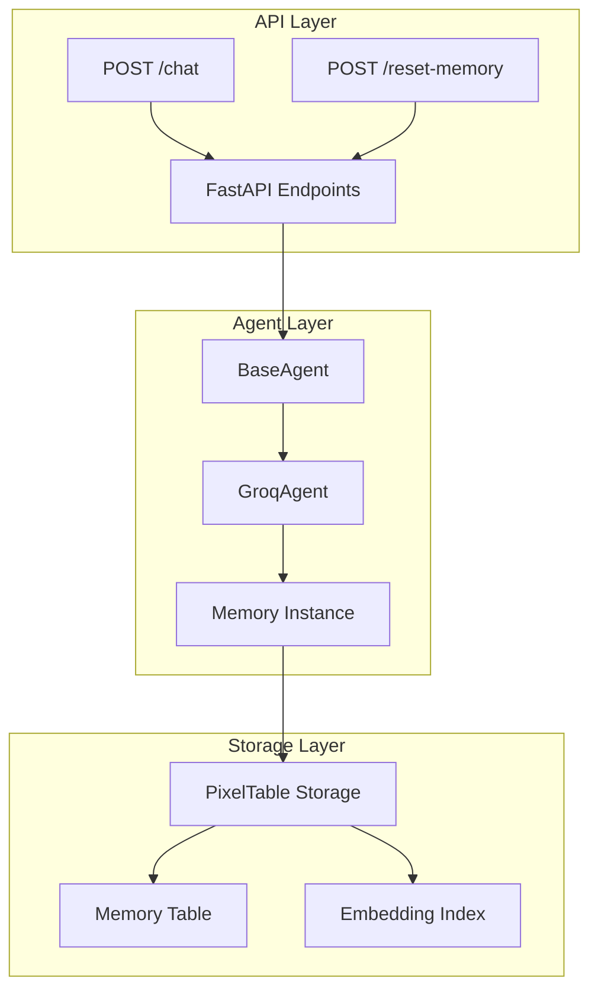
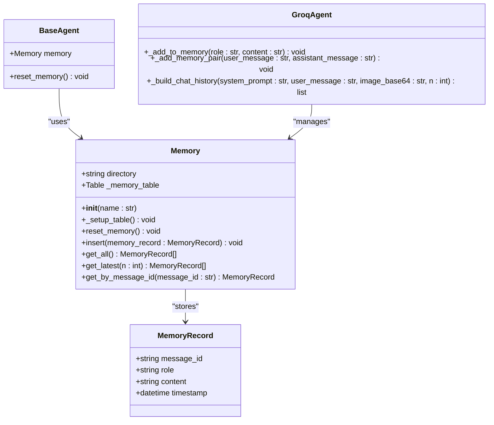
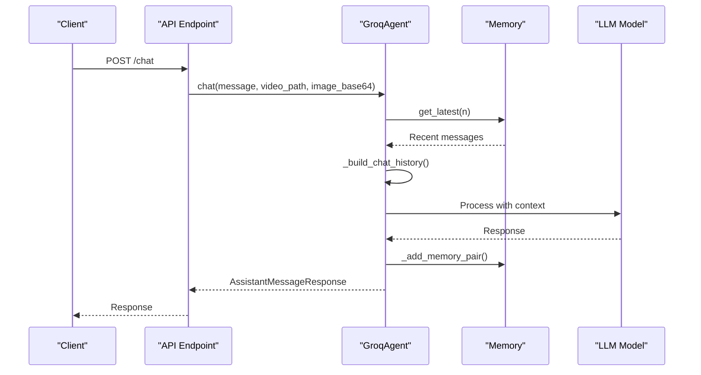
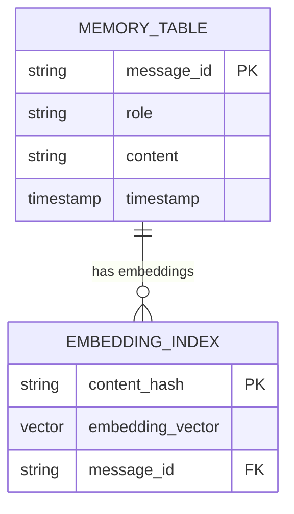

# Memory Playground Tutorial

<cite>
**Referenced Files in This Document**
- [3_memory_playground.ipynb](file://vaas-api/notebooks/3_memory_playground.ipynb)
- [memory.py](file://vaas-api/src/vaas_api/agent/memory.py)
- [base_agent.py](file://vaas-api/src/vaas_api/agent/base_agent.py)
- [groq_agent.py](file://vaas-api/src/vaas_api/agent/groq/groq_agent.py)
- [api.py](file://vaas-api/src/vaas_api/api.py)
- [models.py](file://vaas-api/src/vaas_api/models.py)
- [config.py](file://vaas-api/src/vaas_api/config.py)
- [README.md](file://vaas-api/README.md)
</cite>

## Table of Contents
1. [Introduction](#introduction)
2. [Understanding Conversation Memory](#understanding-conversation-memory)
3. [Memory Architecture Overview](#memory-architecture-overview)
4. [Core Memory Components](#core-memory-components)
5. [Memory Implementation Details](#memory-implementation-details)
6. [API Integration](#api-integration)
7. [Practical Memory Exercises](#practical-memory-exercises)
8. [Memory Persistence and Retrieval](#memory-persistence-and-retrieval)
9. [Advanced Memory Management](#advanced-memory-management)
10. [Troubleshooting Memory Issues](#troubleshooting-memory-issues)
11. [Best Practices](#best-practices)
12. [Conclusion](#conclusion)

## Introduction

Conversation memory is a fundamental aspect of building intelligent agents that can maintain context across multi-turn interactions. In the vaas system, memory management ensures that agents can remember previous interactions, understand user preferences, and provide coherent responses throughout conversations. This tutorial explores how the vaas system implements conversation memory through the Memory class, demonstrates practical usage patterns, and provides hands-on exercises for mastering memory management.

The vaas system uses PixelTable as its underlying storage mechanism, providing persistent, searchable, and embeddable memory storage. This approach enables sophisticated memory operations including semantic search, embedding-based retrieval, and structured data management.

## Understanding Conversation Memory

### What is Conversation Memory?

Conversation memory refers to the ability of an AI agent to maintain context across multiple turns in a dialogue. Unlike stateless systems that treat each interaction independently, memory-enabled agents can:

- **Maintain Context**: Remember previous messages and use them to inform current responses
- **Track User Preferences**: Store and recall user-specific information
- **Enable Continuity**: Provide coherent responses that build upon prior interactions
- **Support Multi-modal Conversations**: Handle text, images, and videos within the same memory context

### Importance in Multimodal Conversations

In multimodal environments where users can provide text, images, and videos, memory becomes crucial for:

- **Contextual Understanding**: Connecting visual and textual information across turns
- **Personalization**: Tailoring responses based on past interactions
- **Efficiency**: Avoiding repetitive questions and maintaining conversation flow
- **User Experience**: Creating natural, human-like interactions

## Memory Architecture Overview

The vaas memory system follows a layered architecture that separates concerns and provides flexibility for different use cases.



**Diagram sources**
- [api.py](file://vaas-api/src/vaas_api/api.py#L80-L120)
- [base_agent.py](file://vaas-api/src/vaas_api/agent/base_agent.py#L10-L30)
- [memory.py](file://vaas-api/src/vaas_api/agent/memory.py#L15-L25)

## Core Memory Components

### MemoryRecord Class

The `MemoryRecord` class defines the structure of individual memory entries, ensuring type safety and consistency across the system.

```python
class MemoryRecord(BaseModel):
    message_id: str
    role: str
    content: str
    timestamp: datetime
```

Each memory record contains:
- **message_id**: Unique identifier for tracking individual messages
- **role**: Either "user" or "assistant" to distinguish speakers
- **content**: The actual message content
- **timestamp**: When the message was recorded

### Memory Class

The `Memory` class provides the core functionality for managing conversation history.



**Diagram sources**
- [memory.py](file://vaas-api/src/vaas_api/agent/memory.py#L7-L12)
- [memory.py](file://vaas-api/src/vaas_api/agent/memory.py#L15-L50)
- [base_agent.py](file://vaas-api/src/vaas_api/agent/base_agent.py#L10-L25)
- [groq_agent.py](file://vaas-api/src/vaas_api/agent/groq/groq_agent.py#L150-L180)

**Section sources**
- [memory.py](file://vaas-api/src/vaas_api/agent/memory.py#L7-L50)

## Memory Implementation Details

### Initialization and Setup

The Memory class automatically sets up its storage infrastructure during initialization:

```python
def __init__(self, name: str):
    self.directory = name
    pxt.create_dir(self.directory, if_exists="replace_force")
    self._setup_table()
    self._memory_table = pxt.get_table(f"{self.directory}.memory")
```

This creates a dedicated directory for the agent's memory and establishes the underlying table structure.

### Memory Operations

#### Inserting Messages

The `insert()` method adds new messages to the memory:

```python
def insert(self, memory_record: MemoryRecord):
    self._memory_table.insert([memory_record.dict()])
```

#### Retrieving Memory

Multiple retrieval methods provide flexibility for different use cases:

```python
def get_all(self) -> list[MemoryRecord]:
    return [MemoryRecord(**record) for record in self._memory_table.collect()]

def get_latest(self, n: int) -> list[MemoryRecord]:
    return self.get_all()[-n:]

def get_by_message_id(self, message_id: str) -> MemoryRecord:
    return self._memory_table.where(self._memory_table.message_id == message_id).collect()[0]
```

#### Memory Reset

The `reset_memory()` method provides a clean slate for new conversations:

```python
def reset_memory(self):
    logger.info(f"Resetting memory: {self.directory}")
    pxt.drop_dir(self.directory, if_not_exists="ignore", force=True)
```

**Section sources**
- [memory.py](file://vaas-api/src/vaas_api/agent/memory.py#L15-L50)

## API Integration

### Memory Endpoints

The vaas API exposes two primary endpoints for memory management:

#### POST /reset-memory

Resets the agent's memory, clearing all stored conversation history:

```python
@app.post("/reset-memory")
async def reset_memory(fastapi_request: Request):
    agent = fastapi_request.app.state.agent
    agent.reset_memory()
    return ResetMemoryResponse(message="Memory reset successfully")
```

#### POST /chat

Processes user messages while maintaining memory continuity:

```python
@app.post("/chat", response_model=AssistantMessageResponse)
async def chat(request: UserMessageRequest, fastapi_request: Request):
    agent = fastapi_request.app.state.agent
    await agent.setup()
    
    try:
        response = await agent.chat(request.message, request.video_path, request.image_base64)
        return response
    except Exception as e:
        raise HTTPException(status_code=500, detail=str(e))
```

### Agent Memory Integration

The GroqAgent integrates memory seamlessly into its chat workflow:



**Diagram sources**
- [api.py](file://vaas-api/src/vaas_api/api.py#L80-L100)
- [groq_agent.py](file://vaas-api/src/vaas_api/agent/groq/groq_agent.py#L200-L236)

**Section sources**
- [api.py](file://vaas-api/src/vaas_api/api.py#L80-L120)
- [groq_agent.py](file://vaas-api/src/vaas_api/agent/groq/groq_agent.py#L200-L236)

## Practical Memory Exercises

### Exercise 1: Simulating Multi-turn Conversations

Let's create a simulation that demonstrates how memory maintains context across multiple turns:

```python
# Initialize the agent with memory
from vaas_api.agent.groq.groq_agent import GroqAgent
from vaas_api.agent.memory import MemoryRecord
from datetime import datetime
import uuid

# Create agent instance
agent = GroqAgent(name="test_agent", mcp_server="http://localhost:9090/mcp")

# Simulate a multi-turn conversation
conversation_history = [
    {"role": "user", "content": "Hello, I need help organizing my schedule."},
    {"role": "assistant", "content": "Of course! I'd be happy to help you organize your schedule."},
    {"role": "user", "content": "Can you help me set reminders and draft emails?"},
    {"role": "assistant", "content": "I can definitely help with setting reminders and drafting emails."},
    {"role": "user", "content": "What's the best way to prioritize my tasks?"},
    {"role": "assistant", "content": "Let's break down your tasks by urgency and importance..."}
]

# Process each turn and track memory growth
print("Processing conversation turns...")
for i, turn in enumerate(conversation_history):
    print(f"\nTurn {i+1}: {turn['role']}")
    print(f"Content: {turn['content'][:50]}...")
    
    # Add to memory manually for demonstration
    agent._add_to_memory(turn['role'], turn['content'])
    
    # Check memory size
    memory_records = agent.memory.get_all()
    print(f"Memory size: {len(memory_records)} records")
    
    # Show latest messages
    latest = agent.memory.get_latest(3)
    print(f"Latest messages: {[rec.content[:30]+'...' for rec in latest]}")
```

### Exercise 2: Memory Leakage Debugging

Create a script to detect and prevent memory leakage:

```python
def detect_memory_leak(agent, max_messages=50):
    """Detect potential memory leaks by monitoring message count growth"""
    memory_records = agent.memory.get_all()
    message_count = len(memory_records)
    
    if message_count > max_messages:
        print(f"WARNING: High memory usage detected ({message_count} messages)")
        print("Consider resetting memory or implementing cleanup strategies")
        
        # Suggest cleanup
        if message_count > max_messages * 2:
            print("Memory usage is critically high - resetting memory")
            agent.reset_memory()
        elif message_count > max_messages * 1.5:
            print("Memory usage is high - keeping only recent messages")
            # Keep only recent messages
            recent_messages = memory_records[-max_messages:]
            agent.reset_memory()
            for record in recent_messages:
                agent.memory.insert(record)
    
    return message_count

# Test memory leak detection
detect_memory_leak(agent)
```

### Exercise 3: Memory Persistence Simulation

Simulate long-running conversations to test persistence:

```python
import time
import random

def simulate_long_conversation(agent, duration_minutes=5):
    """Simulate a long conversation to test memory persistence"""
    start_time = time.time()
    end_time = start_time + (duration_minutes * 60)
    
    # Random conversation topics
    topics = [
        "schedule management", "email drafting", "task prioritization", 
        "reminder setup", "calendar integration", "productivity tips"
    ]
    
    while time.time() < end_time:
        # Generate random message
        topic = random.choice(topics)
        turn_number = len(agent.memory.get_all()) // 2 + 1
        
        user_message = f"I need help with {topic}. Can you assist me?"
        assistant_response = f"I can help you with {topic}. Here's what we can do..."
        
        # Add to memory
        agent._add_memory_pair(user_message, assistant_response)
        
        # Log progress
        if turn_number % 5 == 0:
            print(f"Turn {turn_number}: Memory size {len(agent.memory.get_all())}")
        
        # Simulate conversation pace
        time.sleep(random.uniform(2, 5))

# Run simulation
simulate_long_conversation(agent, duration_minutes=1)
```

## Memory Persistence and Retrieval

### PixelTable Storage Architecture

The vaas system uses PixelTable for robust memory storage with advanced features:



**Diagram sources**
- [memory.py](file://vaas-api/src/vaas_api/agent/memory.py#L20-L30)

### Advanced Retrieval Patterns

#### Semantic Search Integration

While the current implementation focuses on chronological retrieval, the underlying PixelTable structure supports semantic search:

```python
# Example of embedding-based retrieval (future enhancement)
def semantic_search_memory(agent, query, top_k=5):
    """Retrieve semantically similar memories (conceptual implementation)"""
    # This would use the embedding index for semantic similarity
    # Currently implemented in the notebook but not in production
    pass
```

#### Memory Filtering Strategies

Different retrieval strategies serve various use cases:

```python
def get_context_for_llm(agent, system_prompt, user_message, max_tokens=4000):
    """Build optimal context window for LLM processing"""
    memory_records = agent.memory.get_latest(settings.AGENT_MEMORY_SIZE)
    
    # Calculate token usage and trim if necessary
    context_size = sum(len(rec.content.split()) for rec in memory_records)
    
    if context_size > max_tokens:
        # Keep only most recent messages that fit
        filtered_records = []
        current_size = 0
        
        for record in reversed(memory_records):
            record_size = len(record.content.split())
            if current_size + record_size <= max_tokens:
                filtered_records.insert(0, record)
                current_size += record_size
            else:
                break
                
        return filtered_records
    else:
        return memory_records
```

**Section sources**
- [3_memory_playground.ipynb](file://vaas-api/notebooks/3_memory_playground.ipynb#L1-L60)
- [memory.py](file://vaas-api/src/vaas_api/agent/memory.py#L35-L50)

## Advanced Memory Management

### Memory Size Configuration

The system allows configurable memory sizes through settings:

```python
# From config.py
AGENT_MEMORY_SIZE: int = 20  # Number of recent messages to keep
```

### Memory Optimization Strategies

#### Message Compression

Implement message compression for long conversations:

```python
def compress_memory_record(content, max_length=1000):
    """Compress long messages for memory efficiency"""
    if len(content) <= max_length:
        return content
    
    # Keep first part and add summary
    compressed = content[:max_length//2] + "... [TRUNCATED]"
    return compressed
```

#### Memory Cleanup Policies

Implement automated cleanup policies:

```python
class MemoryManager:
    def __init__(self, agent, max_messages=100, cleanup_threshold=0.8):
        self.agent = agent
        self.max_messages = max_messages
        self.cleanup_threshold = cleanup_threshold
    
    def auto_cleanup(self):
        """Automatically clean up memory based on thresholds"""
        total_messages = len(self.agent.memory.get_all())
        
        if total_messages > self.max_messages * self.cleanup_threshold:
            # Keep only recent messages
            recent_messages = self.agent.memory.get_latest(self.max_messages)
            self.agent.reset_memory()
            
            # Re-add recent messages
            for record in recent_messages:
                self.agent.memory.insert(record)
            
            print(f"Cleaned memory: {total_messages} -> {len(recent_messages)} messages")
```

### Memory Security Considerations

#### Data Protection

Implement data protection measures for sensitive conversations:

```python
def sanitize_memory_content(content):
    """Remove sensitive information from memory content"""
    # Remove personal identifiers
    # Remove financial information
    # Remove confidential data
    return content

def secure_add_to_memory(agent, role, content):
    """Add memory with security sanitization"""
    sanitized_content = sanitize_memory_content(content)
    agent._add_to_memory(role, sanitized_content)
```

## Troubleshooting Memory Issues

### Common Memory Problems

#### Memory Growth Issues

**Problem**: Memory grows uncontrollably over time
**Solution**: Implement automatic cleanup and size limits

```python
def monitor_memory_growth(agent, threshold=50):
    """Monitor memory growth and trigger cleanup"""
    memory_records = agent.memory.get_all()
    
    if len(memory_records) > threshold:
        # Implement exponential backoff for cleanup
        if len(memory_records) > threshold * 2:
            # Aggressive cleanup
            agent.reset_memory()
            print("Aggressive memory cleanup triggered")
        else:
            # Conservative cleanup
            recent = memory_records[-threshold//2:]
            agent.reset_memory()
            for record in recent:
                agent.memory.insert(record)
            print(f"Conservative cleanup: {len(memory_records)} -> {len(recent)} messages")
```

#### Memory Corruption

**Problem**: Memory records become corrupted or inconsistent
**Solution**: Implement validation and recovery mechanisms

```python
def validate_memory_integrity(agent):
    """Validate memory integrity and fix inconsistencies"""
    memory_records = agent.memory.get_all()
    valid_records = []
    
    for record in memory_records:
        try:
            # Validate required fields
            assert record.message_id, "Missing message_id"
            assert record.role in ["user", "assistant"], "Invalid role"
            assert record.content, "Missing content"
            assert record.timestamp, "Missing timestamp"
            
            valid_records.append(record)
        except AssertionError as e:
            print(f"Invalid record found: {e}")
    
    # Replace with valid records only
    agent.reset_memory()
    for record in valid_records:
        agent.memory.insert(record)
    
    print(f"Memory validation complete: {len(valid_records)} valid records")
```

### Debugging Tools

#### Memory Inspection Utilities

```python
def inspect_memory(agent, verbose=False):
    """Inspect memory contents and statistics"""
    memory_records = agent.memory.get_all()
    
    print(f"Memory Statistics:")
    print(f"Total records: {len(memory_records)}")
    
    # Count by role
    user_count = sum(1 for rec in memory_records if rec.role == "user")
    assistant_count = sum(1 for rec in memory_records if rec.role == "assistant")
    print(f"User messages: {user_count}")
    print(f"Assistant messages: {assistant_count}")
    
    if verbose:
        print("\nRecent messages:")
        for record in memory_records[-5:]:
            print(f"  [{record.role}] {record.content[:50]}...")
    
    return memory_records
```

#### Performance Monitoring

```python
import time
from functools import wraps

def monitor_memory_performance(func):
    """Decorator to monitor memory operation performance"""
    @wraps(func)
    def wrapper(*args, **kwargs):
        start_time = time.time()
        result = func(*args, **kwargs)
        end_time = time.time()
        
        print(f"{func.__name__} took {end_time - start_time:.3f}s")
        return result
    return wrapper

# Apply to memory operations
@monitor_memory_performance
def monitored_insert(agent, record):
    agent.memory.insert(record)
```

## Best Practices

### Memory Design Principles

#### 1. Principle of Least Surprise
- Memory operations should behave predictably
- Clear separation between different memory operations
- Consistent naming conventions across the system

#### 2. Resource Efficiency
- Implement appropriate memory limits
- Use lazy loading for large memory datasets
- Clean up unused memory promptly

#### 3. Data Integrity
- Validate memory records before insertion
- Implement backup and recovery mechanisms
- Track memory modifications for audit trails

### Implementation Guidelines

#### Memory Record Creation

```python
def create_memory_record(role, content, message_id=None):
    """Create a properly formatted memory record"""
    return MemoryRecord(
        message_id=message_id or str(uuid.uuid4()),
        role=role,
        content=content,
        timestamp=datetime.now()
    )
```

#### Memory Operation Patterns

```python
class MemoryOperations:
    @staticmethod
    def safe_insert(agent, role, content):
        """Safe memory insertion with validation"""
        try:
            record = create_memory_record(role, content)
            agent.memory.insert(record)
            return True
        except Exception as e:
            print(f"Memory insertion failed: {e}")
            return False
    
    @staticmethod
    def batch_insert(agent, messages):
        """Batch insert multiple messages efficiently"""
        records = [create_memory_record(msg['role'], msg['content']) for msg in messages]
        agent.memory.insert(records)
```

### Testing Memory Functionality

#### Unit Tests

```python
import pytest
from unittest.mock import Mock

def test_memory_basic_operations():
    """Test basic memory operations"""
    agent = Mock()
    agent.memory = Mock()
    
    # Test insert
    record = create_memory_record("user", "test message")
    MemoryOperations.safe_insert(agent, "user", "test message")
    agent.memory.insert.assert_called_once_with([record.dict()])
    
    # Test retrieval
    agent.memory.get_all.return_value = [record.dict()]
    records = agent.memory.get_all()
    assert len(records) == 1
    assert records[0]["content"] == "test message"
```

#### Integration Tests

```python
def test_memory_integration():
    """Test memory integration with agent"""
    agent = GroqAgent(name="test", mcp_server="mock")
    
    # Test conversation flow
    initial_memory_size = len(agent.memory.get_all())
    
    # Add a conversation pair
    user_msg = "Help me organize my schedule"
    agent._add_memory_pair(user_msg, "Sure, I can help with that")
    
    final_memory_size = len(agent.memory.get_all())
    assert final_memory_size == initial_memory_size + 2  # One for user, one for assistant
```

## Conclusion

The vaas memory system provides a robust foundation for maintaining conversation context in multimodal AI applications. Through the Memory class and its integration with the GroqAgent, the system offers:

- **Persistent Storage**: Using PixelTable for reliable, scalable memory storage
- **Flexible Retrieval**: Multiple methods for accessing memory based on different use cases
- **Seamless Integration**: Clean API endpoints for memory management
- **Extensibility**: Architecture that supports future enhancements like semantic search

Key takeaways for developers working with the vaas memory system:

1. **Understand the Memory Lifecycle**: From initialization through cleanup
2. **Implement Proper Monitoring**: Track memory usage and detect potential issues
3. **Follow Best Practices**: Use validation, batching, and resource management
4. **Plan for Scale**: Consider memory limits and cleanup strategies early

The memory playground exercises provide practical experience with real-world scenarios, helping developers master conversation memory management and build more sophisticated AI applications. Whether you're debugging memory issues, optimizing performance, or implementing new features, the vaas memory system offers the tools and patterns needed for success.

By following the guidelines and best practices outlined in this tutorial, you can leverage conversation memory to create more engaging, personalized, and effective AI interactions that truly enhance the user experience.