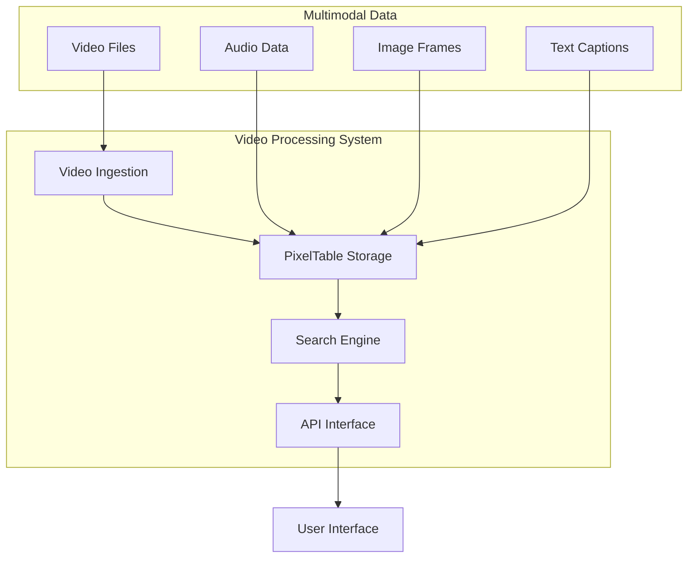
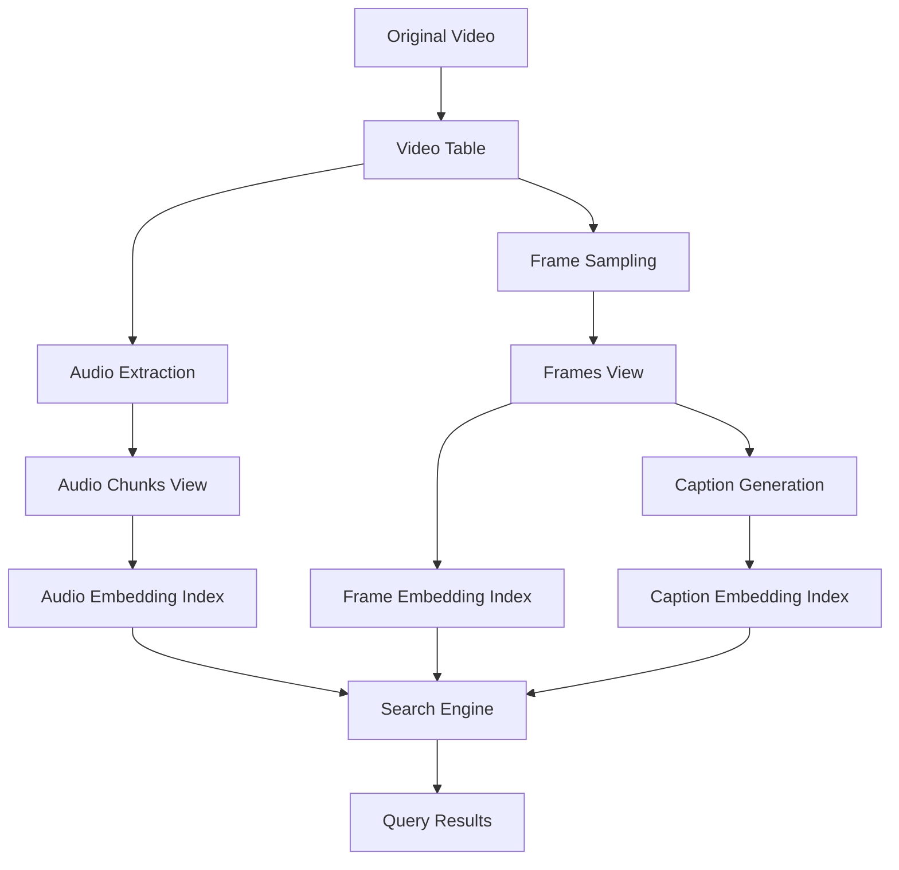
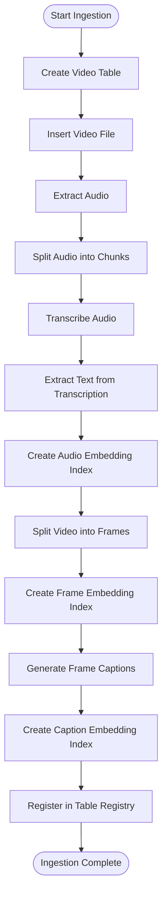
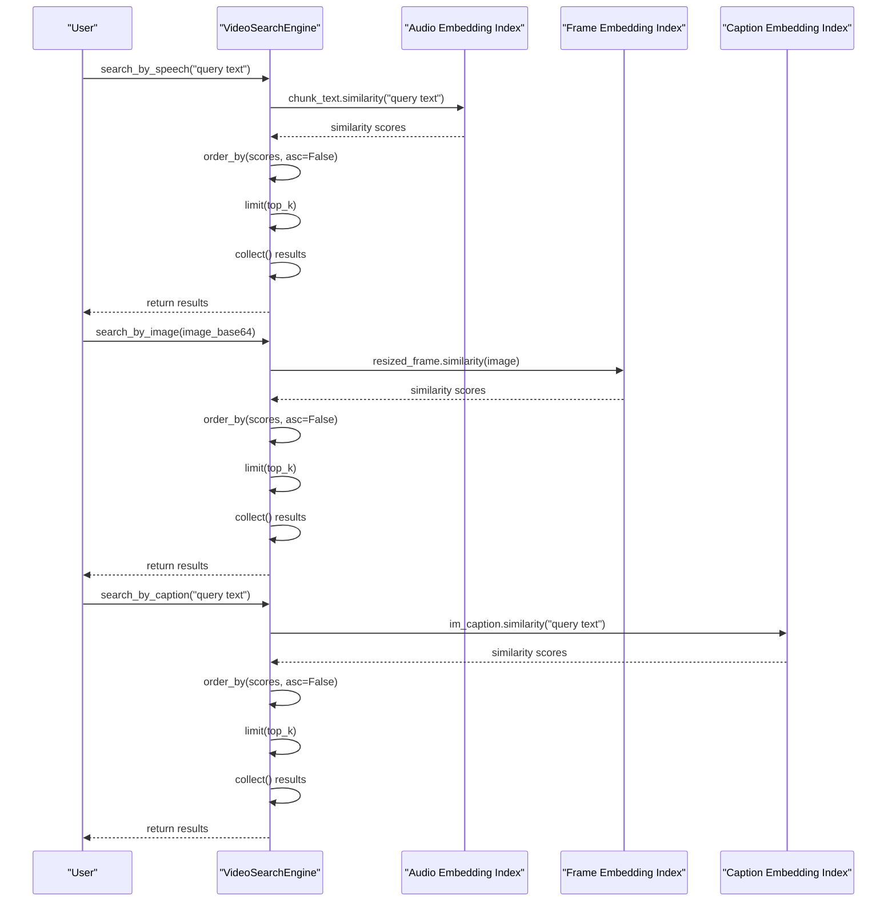
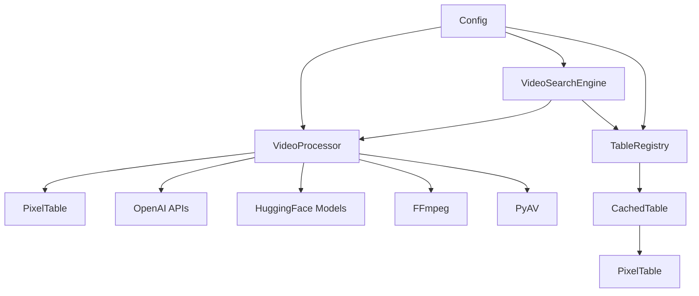

# PixelTable Basics Tutorial

<cite>
**Referenced Files in This Document**   
- [video_ingestion_process.ipynb](file://vaas-mcp/notebooks/video_ingestion_process.ipynb)
- [video_processor.py](file://vaas-mcp/src/vaas_mcp/video/ingestion/video_processor.py)
- [functions.py](file://vaas-mcp/src/vaas_mcp/video/ingestion/functions.py)
- [tools.py](file://vaas-mcp/src/vaas_mcp/video/ingestion/tools.py)
- [registry.py](file://vaas-mcp/src/vaas_mcp/video/ingestion/registry.py)
- [models.py](file://vaas-mcp/src/vaas_mcp/video/ingestion/models.py)
- [config.py](file://vaas-mcp/src/vaas_mcp/config.py)
- [video_search_engine.py](file://vaas-mcp/src/vaas_mcp/video/video_search_engine.py)
</cite>

## Table of Contents
1. [Introduction](#introduction)
2. [Project Structure](#project-structure)
3. [Core Components](#core-components)
4. [Architecture Overview](#architecture-overview)
5. [Detailed Component Analysis](#detailed-component-analysis)
6. [Dependency Analysis](#dependency-analysis)
7. [Performance Considerations](#performance-considerations)
8. [Troubleshooting Guide](#troubleshooting-guide)
9. [Conclusion](#conclusion)

## Introduction
This educational guide teaches users how PixelTable is used for video data management in the vaas system. The guide explains how PixelTable enables efficient storage, querying, and retrieval of multimodal video data (frames, audio, captions). It demonstrates table creation, data insertion, and query execution with real code examples. The guide also discusses schema design choices and performance considerations when working with large video datasets, showing how PixelTable integrates with the video search engine to support image-based and text-based queries.

## Project Structure
The vaas system is organized into several key components that work together to process and search video content. The core video processing functionality is located in the vaas-mcp module, which contains the video ingestion pipeline and search engine. The system uses PixelTable as the underlying data management system for storing and querying multimodal video data.



**Diagram sources**
- [video_processor.py](file://vaas-mcp/src/vaas_mcp/video/ingestion/video_processor.py)
- [video_search_engine.py](file://vaas-mcp/src/vaas_mcp/video/video_search_engine.py)

**Section sources**
- [video_processor.py](file://vaas-mcp/src/vaas_mcp/video/ingestion/video_processor.py)
- [video_search_engine.py](file://vaas-mcp/src/vaas_mcp/video/video_search_engine.py)

## Core Components
The PixelTable system in vaas consists of several core components that work together to manage video data. These include the VideoProcessor class for handling video ingestion, the registry system for managing video indexes, and the VideoSearchEngine for querying video content. The system uses computed columns and embedding indexes to enable efficient multimodal search across video, audio, and text data.

**Section sources**
- [video_processor.py](file://vaas-mcp/src/vaas_mcp/video/ingestion/video_processor.py)
- [video_search_engine.py](file://vaas-mcp/src/vaas_mcp/video/video_search_engine.py)
- [registry.py](file://vaas-mcp/src/vaas_mcp/video/ingestion/registry.py)

## Architecture Overview
The PixelTable architecture in vaas follows a pipeline approach for video data management. When a video is ingested, it's first stored in a base table, then processed to extract audio and video frames. These elements are stored in views that are derived from the original video table using iterators. Embedding indexes are created for audio transcriptions, video frames, and frame captions, enabling efficient similarity search across modalities.



**Diagram sources**
- [video_processor.py](file://vaas-mcp/src/vaas_mcp/video/ingestion/video_processor.py)
- [video_search_engine.py](file://vaas-mcp/src/vaas_mcp/video/video_search_engine.py)

## Detailed Component Analysis

### Video Ingestion Pipeline
The video ingestion pipeline in vaas uses PixelTable to create a comprehensive multimodal representation of video content. The process begins with creating a video table to store the original video file, then proceeds through several stages of processing to extract and index different modalities.

#### Video Table Creation


**Diagram sources**
- [video_processor.py](file://vaas-mcp/src/vaas_mcp/video/ingestion/video_processor.py)
- [functions.py](file://vaas-mcp/src/vaas_mcp/video/ingestion/functions.py)

**Section sources**
- [video_processor.py](file://vaas-mcp/src/vaas_mcp/video/ingestion/video_processor.py)
- [functions.py](file://vaas-mcp/src/vaas_mcp/video/ingestion/functions.py)

### Data Schema Design
The schema design in PixelTable is optimized for multimodal video search. The system uses a base video table with computed columns and derived views to represent different aspects of the video content. This approach allows for efficient storage while enabling rich querying capabilities across modalities.

#### Schema Relationships
```mermaid
classDiagram
class VideoTable {
+video : Video
+audio_extract : Audio
}
class AudioChunksView {
+audio_chunk : Audio
+start_time_sec : float
+end_time_sec : float
+transcription : Json
+chunk_text : string
}
class FramesView {
+frame : Image
+pos_msec : int
+resized_frame : Image
+im_caption : string
}
VideoTable --> AudioChunksView : "iterator : AudioSplitter"
VideoTable --> FramesView : "iterator : FrameIterator"
AudioChunksView --> "audio_embedding_index" : "string_embed"
FramesView --> "frame_embedding_index" : "image_embed"
FramesView --> "caption_embedding_index" : "string_embed"
```

**Diagram sources**
- [video_processor.py](file://vaas-mcp/src/vaas_mcp/video/ingestion/video_processor.py)
- [models.py](file://vaas-mcp/src/vaas_mcp/video/ingestion/models.py)

**Section sources**
- [video_processor.py](file://vaas-mcp/src/vaas_mcp/video/ingestion/video_processor.py)
- [models.py](file://vaas-mcp/src/vaas_mcp/video/ingestion/models.py)

### Query Execution Process
The query execution process in PixelTable enables efficient multimodal search through the use of embedding indexes. When a query is received, the system computes similarity scores between the query and indexed content, then returns the most relevant results with their associated metadata.

#### Query Flow


**Diagram sources**
- [video_search_engine.py](file://vaas-mcp/src/vaas_mcp/video/video_search_engine.py)
- [video_processor.py](file://vaas-mcp/src/vaas_mcp/video/ingestion/video_processor.py)

**Section sources**
- [video_search_engine.py](file://vaas-mcp/src/vaas_mcp/video/video_search_engine.py)

## Dependency Analysis
The PixelTable implementation in vaas has a well-defined dependency structure that enables modular video processing and search functionality. The system components are organized to separate concerns while maintaining efficient data flow between processing stages.



**Diagram sources**
- [video_processor.py](file://vaas-mcp/src/vaas_mcp/video/ingestion/video_processor.py)
- [video_search_engine.py](file://vaas-mcp/src/vaas_mcp/video/video_search_engine.py)
- [registry.py](file://vaas-mcp/src/vaas_mcp/video/ingestion/registry.py)
- [config.py](file://vaas-mcp/src/vaas_mcp/config.py)

**Section sources**
- [video_processor.py](file://vaas-mcp/src/vaas_mcp/video/ingestion/video_processor.py)
- [video_search_engine.py](file://vaas-mcp/src/vaas_mcp/video/video_search_engine.py)
- [registry.py](file://vaas-mcp/src/vaas_mcp/video/ingestion/registry.py)
- [config.py](file://vaas-mcp/src/vaas_mcp/config.py)

## Performance Considerations
When working with large video datasets in PixelTable, several performance considerations are important. The system uses frame sampling at a configurable FPS (default 45 frames) to balance detail with storage efficiency. Audio is chunked into segments of configurable length (default 10 seconds) with overlap to ensure continuity. Images are resized to a standard dimension (1024x768) before processing to maintain consistent performance across different video resolutions.

The use of embedding indexes with models like CLIP (openai/clip-vit-base-patch32) and text-embedding-3-small enables efficient similarity search while maintaining high accuracy. The system also implements caching through the registry system, allowing video indexes to be reused without reprocessing.

**Section sources**
- [config.py](file://vaas-mcp/src/vaas_mcp/config.py)
- [video_processor.py](file://vaas-mcp/src/vaas_mcp/video/ingestion/video_processor.py)

## Troubleshooting Guide
When working with the PixelTable video processing system, several common issues may arise. Video compatibility issues can occur when input videos are not properly encoded for PyAV processing; the system includes a re_encode_video function that uses FFmpeg to address this. Memory issues may occur with large videos, which can be mitigated by adjusting the frame sampling rate or audio chunk length in the configuration.

For search functionality, ensure that embedding indexes have been properly created before querying. If search results are not as expected, verify that the appropriate indexes (audio, frame, or caption) have been created and are being used correctly in the query.

**Section sources**
- [tools.py](file://vaas-mcp/src/vaas_mcp/video/ingestion/tools.py)
- [video_processor.py](file://vaas-mcp/src/vaas_mcp/video/ingestion/video_processor.py)
- [video_search_engine.py](file://vaas-mcp/src/vaas_mcp/video/video_search_engine.py)

## Conclusion
PixelTable provides a powerful foundation for video data management in the vaas system, enabling efficient storage, processing, and retrieval of multimodal content. By leveraging computed columns, iterators, and embedding indexes, the system can handle complex video analysis tasks while maintaining high performance. The integration with external services like OpenAI and HuggingFace allows for sophisticated multimodal search capabilities, making it possible to find video content using text, image, or speech queries. This tutorial has demonstrated the core concepts and implementation details needed to work with PixelTable for video data management.