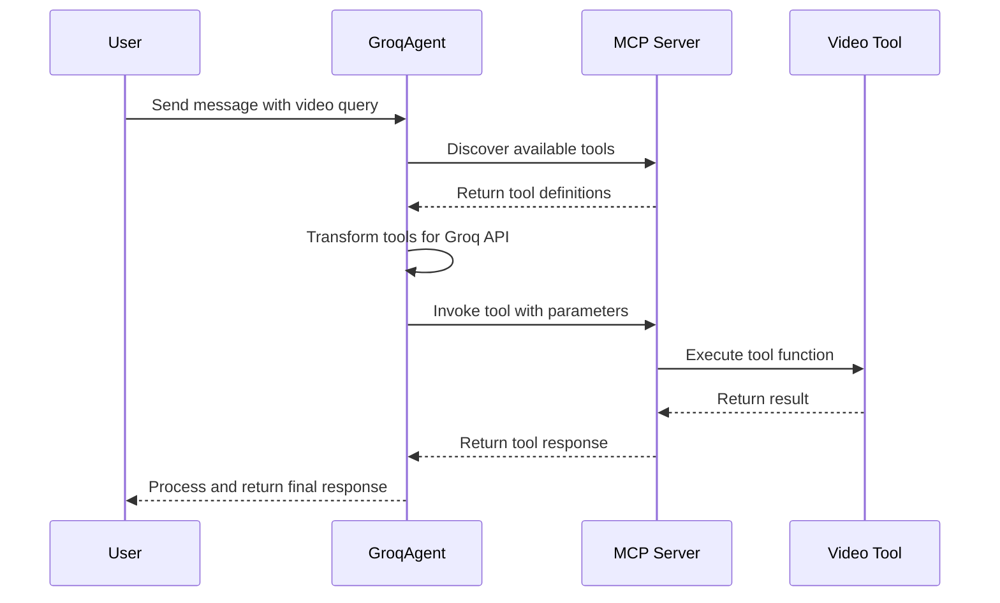
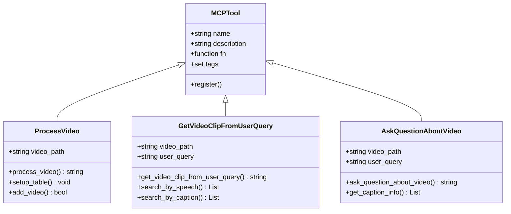
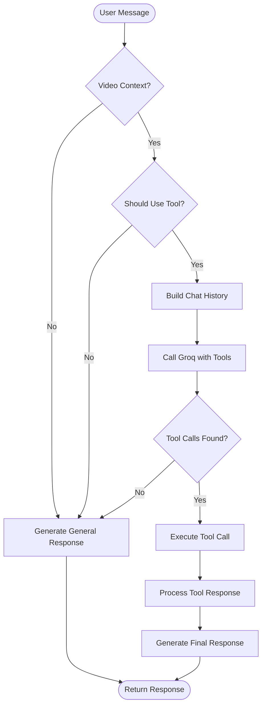
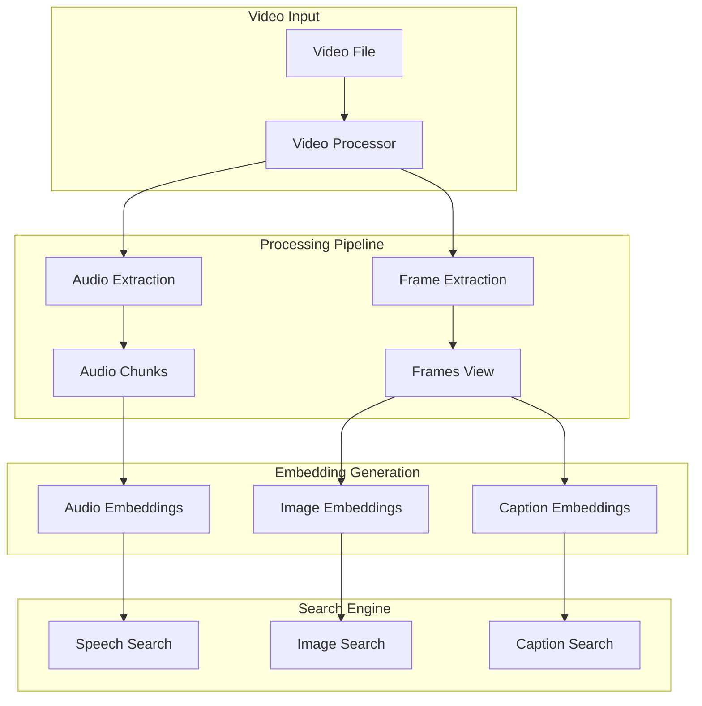

# Tool Use Playground Tutorial

<cite>
**Referenced Files in This Document**
- [1_tool_use_playground.ipynb](file://vaas-api/notebooks/1_tool_use_playground.ipynb)
- [server.py](file://vaas-mcp/src/vaas_mcp/server.py)
- [tools.py](file://vaas-mcp/src/vaas_mcp/tools.py)
- [groq_agent.py](file://vaas-api/src/vaas_api/agent/groq/groq_agent.py)
- [groq_tool.py](file://vaas-api/src/vaas_api/agent/groq/groq_tool.py)
- [video_processor.py](file://vaas-mcp/src/vaas_mcp/video/ingestion/video_processor.py)
- [video_search_engine.py](file://vaas-mcp/src/vaas_mcp/video/video_search_engine.py)
- [tools.py](file://vaas-mcp/src/vaas_mcp/video/ingestion/tools.py)
- [config.py](file://vaas-mcp/src/vaas_mcp/config.py)
- [api.py](file://vaas-api/src/vaas_api/api.py)
</cite>

## Table of Contents
1. [Introduction](#introduction)
2. [Understanding Tool Calling in vaas](#understanding-tool-calling-in-vaas)
3. [Setting Up the Environment](#setting-up-the-environment)
4. [Tool Discovery and Registration](#tool-discovery-and-registration)
5. [Transforming Tools for Groq API](#transforming-tools-for-groq-api)
6. [Agent Tool Invocation Process](#agent-tool-invocation-process)
7. [Practical Examples](#practical-examples)
8. [Tool Architecture Overview](#tool-architecture-overview)
9. [Exercises and Challenges](#exercises-and-challenges)
10. [Best Practices and Troubleshooting](#best-practices-and-troubleshooting)

## Introduction

The vaas system demonstrates advanced tool calling capabilities within multimodal agent workflows. This tutorial focuses on the "Tool Use Playground" notebook (`1_tool_use_playground.ipynb`) which serves as an educational introduction to how tools are discovered, transformed, and invoked within the vaas architecture.

Tool calling is a fundamental concept in modern AI agents, allowing them to interact with external systems and perform specialized tasks. In vaas, tools enable the agent to process videos, extract clips, and answer questions about video content through a sophisticated Multi-Modal Communication Protocol (MCP) server.

## Understanding Tool Calling in vaas

### What Are Tools in Agent Workflows?

Tools in agent workflows represent specialized functions that extend the agent's capabilities beyond its built-in knowledge. They allow the agent to:

- **Interact with external systems**: Access databases, APIs, and file systems
- **Perform complex computations**: Handle tasks requiring specialized algorithms
- **Access real-world data**: Retrieve information from external sources
- **Execute actions**: Perform operations like file manipulation or system commands

### How Tools Work in vaas

The vaas system implements a two-tier tool architecture:

1. **MCP Server Layer**: Manages tool registration, discovery, and execution
2. **Agent Layer**: Handles tool invocation, parameter transformation, and response processing



**Diagram sources**
- [groq_agent.py](file://vaas-api/src/vaas_api/agent/groq/groq_agent.py#L1-L50)
- [server.py](file://vaas-mcp/src/vaas_mcp/server.py#L1-L30)

## Setting Up the Environment

### Prerequisites

Before working with the tool use playground, ensure you have:

1. **MCP Server Running**: The MCP server must be active on port 9090
2. **Environment Variables Configured**: Proper API keys and configurations
3. **Video Files Available**: Sample videos for testing tool functionality

### Environment Setup

```python
import os
from dotenv import load_dotenv
from fastmcp.client import Client

# Load environment variables
load_dotenv()

# Initialize MCP client
mcp_client = Client("http://127.0.0.1:9090/mcp")

# Verify connection
async with mcp_client:
    mcp_tools = await mcp_client.list_tools()
```

**Section sources**
- [1_tool_use_playground.ipynb](file://vaas-api/notebooks/1_tool_use_playground.ipynb#L1-L20)

## Tool Discovery and Registration

### MCP Server Tool Registration

The MCP server automatically registers tools during initialization. Here's how tools are added to the server:

```python
def add_mcp_tools(mcp: FastMCP):
    mcp.add_tool(
        name="process_video",
        description="Process a video file and prepare it for searching.",
        fn=process_video,
        tags={"video", "process"},
    )

    mcp.add_tool(
        name="get_video_clip_from_user_query",
        description="Use this tool to get a video clip from a video file based on a user query or question.",
        fn=get_video_clip_from_user_query,
        tags={"video", "clip", "query", "question"},
    )
```

### Available Tools in vaas

The system provides four primary tools:

1. **`process_video`**: Prepares video files for search operations
2. **`get_video_clip_from_user_query`**: Extracts video clips based on text queries
3. **`get_video_clip_from_image`**: Extracts clips based on image similarity
4. **`ask_question_about_video`**: Answers questions about video content



**Diagram sources**
- [server.py](file://vaas-mcp/src/vaas_mcp/server.py#L15-L45)
- [tools.py](file://vaas-mcp/src/vaas_mcp/tools.py#L15-L80)

**Section sources**
- [server.py](file://vaas-mcp/src/vaas_mcp/server.py#L15-L50)

## Transforming Tools for Groq API

### Tool Schema Transformation

The Groq API requires tools in a specific format. The system transforms MCP tool definitions into Groq-compatible tool definitions:

```python
def transform_tool_definition(tool: Tool) -> dict:
    return {
        "type": "function",
        "function": {
            "name": tool.name,
            "description": tool.description,
            "parameters": transform_schema_to_parameters(tool.inputSchema),
        },
    }

def transform_schema_to_parameters(schema: dict) -> dict:
    properties = {}
    
    for field_name, field_info in schema["properties"].items():
        properties[field_name] = {
            "type": field_info["type"],
            "description": field_info["title"],
        }
        if "default" in field_info:
            properties[field_name]["default"] = field_info["default"]
    
    return {
        "type": "object",
        "properties": properties,
        "required": schema.get("required"),
    }
```

### Tool Definition Structure

Each tool follows this structure:

```python
{
    "type": "function",
    "function": {
        "name": "tool_name",
        "description": "Tool description",
        "parameters": {
            "type": "object",
            "properties": {
                "parameter_name": {
                    "type": "string",
                    "description": "Parameter description"
                }
            },
            "required": ["parameter_name"]
        }
    }
}
```

**Section sources**
- [1_tool_use_playground.ipynb](file://vaas-api/notebooks/1_tool_use_playground.ipynb#L30-L80)
- [groq_tool.py](file://vaas-api/src/vaas_api/agent/groq/groq_tool.py#L40-L60)

## Agent Tool Invocation Process

### Tool Selection and Execution

The GroqAgent determines when to use tools based on the user's query and the presence of video context:

```python
def _should_use_tool(self, message: str) -> bool:
    messages = [
        {"role": "system", "content": self.routing_system_prompt},
        {"role": "user", "content": message},
    ]
    response = self.instructor_client.chat.completions.create(
        model=settings.GROQ_ROUTING_MODEL,
        response_model=RoutingResponseModel,
        messages=messages,
        max_completion_tokens=20,
    )
    return response.tool_use
```

### Tool Execution Workflow



**Diagram sources**
- [groq_agent.py](file://vaas-api/src/vaas_api/agent/groq/groq_agent.py#L120-L180)

### Tool Parameter Handling

The agent handles different types of tool parameters:

```python
async def _execute_tool_call(self, tool_call: Any, video_path: str, image_base64: str | None = None) -> str:
    function_name = tool_call.function.name
    function_args = json.loads(tool_call.function.arguments)
    
    function_args["video_path"] = video_path
    
    if function_name == "get_video_clip_from_image":
        function_args["user_image"] = image_base64
    
    logger.info(f"Executing tool: {function_name}")
    
    try:
        return await self.call_tool(function_name, function_args)
    except Exception as e:
        logger.error(f"Error executing tool {function_name}: {str(e)}")
        return f"Error executing tool {function_name}: {str(e)}"
```

**Section sources**
- [groq_agent.py](file://vaas-api/src/vaas_api/agent/groq/groq_agent.py#L80-L120)

## Practical Examples

### Example 1: Getting a Video Clip from Text Query

```python
# Step 1: Define the query and video path
query = "Rick says Pass the butter"
video_path = "./videos/pass_the_butter_rick_and_morty.mp4"

# Step 2: Prepare the message history
messages = [
    {
        "role": "system",
        "content": f"You are vaas, a video processing assistant. The current video name is: {video_path}",
    },
    {
        "role": "user",
        "content": f"I want to get the clip of the video where {query}, please",
    },
]

# Step 3: Call Groq with tools enabled
response = groq_client.chat.completions.create(
    model=MODEL,
    messages=messages,
    stream=False,
    tools=tools,
    tool_choice="auto",
    max_completion_tokens=4096,
)

# Step 4: Extract and execute the tool call
tool_calls = response.choices[0].message.tool_calls
tool_call = tool_calls[0]

# Step 5: Transform arguments and call the tool
inputs = json.loads(tool_call.function.arguments)
inputs["user_query"] = query
inputs["video_path"] = video_path

async with mcp_client:
    result = await mcp_client.call_tool("get_video_clip_from_user_query", inputs)
    print(result)
```

### Example 2: Asking Questions About Video Content

```python
# Step 1: Define the question
question = "What is Rick saying in this video?"

# Step 2: Prepare the message
messages = [
    {
        "role": "system",
        "content": f"You are vaas, a video processing assistant. The current video name is: {video_path}",
    },
    {
        "role": "user",
        "content": question,
    },
]

# Step 3: Call the agent
response = groq_client.chat.completions.create(
    model=MODEL,
    messages=messages,
    stream=False,
    tools=tools,
    tool_choice="auto",
    max_completion_tokens=4096,
)

# Step 4: Process the response
if response.choices[0].message.tool_calls:
    tool_call = response.choices[0].message.tool_calls[0]
    if tool_call.function.name == "ask_question_about_video":
        inputs = json.loads(tool_call.function.arguments)
        inputs["video_path"] = video_path
        
        async with mcp_client:
            result = await mcp_client.call_tool("ask_question_about_video", inputs)
            print(json.loads(result[0].text))
```

**Section sources**
- [1_tool_use_playground.ipynb](file://vaas-api/notebooks/1_tool_use_playground.ipynb#L100-L200)

## Tool Architecture Overview

### Video Processing Pipeline

The tool system integrates with a sophisticated video processing pipeline:



**Diagram sources**
- [video_processor.py](file://vaas-mcp/src/vaas_mcp/video/ingestion/video_processor.py#L50-L150)
- [video_search_engine.py](file://vaas-mcp/src/vaas_mcp/video/video_search_engine.py#L20-L80)

### Tool Implementation Details

Each tool implements specific functionality:

#### `process_video` Tool
- **Purpose**: Prepares video files for search operations
- **Process**: Creates PixelTable indexes, extracts audio, generates embeddings
- **Output**: Success/failure status

#### `get_video_clip_from_user_query` Tool
- **Purpose**: Extracts video clips based on text queries
- **Process**: Searches speech and caption similarity, selects best match
- **Output**: Path to extracted video clip

#### `ask_question_about_video` Tool
- **Purpose**: Answers questions about video content
- **Process**: Searches relevant captions, concatenates results
- **Output**: Concatenated relevant captions

**Section sources**
- [tools.py](file://vaas-mcp/src/vaas_mcp/tools.py#L15-L105)
- [video_processor.py](file://vaas-mcp/src/vaas_mcp/video/ingestion/video_processor.py#L20-L50)

## Exercises and Challenges

### Exercise 1: Modify Tool Inputs

Try modifying the tool inputs to explore different scenarios:

```python
# Challenge: Experiment with different query types
queries = [
    "Rick says Pass the butter",
    "Morty looks surprised",
    "Rick laughs",
    "Both characters talking"
]

for query in queries:
    inputs = {
        "user_query": query,
        "video_path": "./videos/pass_the_butter_rick_and_morty.mp4"
    }
    
    async with mcp_client:
        result = await mcp_client.call_tool("get_video_clip_from_user_query", inputs)
        print(f"Query: {query}")
        print(f"Result: {result}")
```

### Exercise 2: Chain Multiple Tool Calls

Create a workflow that chains multiple tool calls:

```python
# Challenge: Chain tool calls to create a comprehensive video analysis
async def analyze_video_workflow(video_path: str, query: str):
    # Step 1: Process the video
    async with mcp_client:
        process_result = await mcp_client.call_tool("process_video", {"video_path": video_path})
        print(f"Video processed: {process_result}")
        
        # Step 2: Get video clip
        clip_inputs = {
            "user_query": query,
            "video_path": video_path
        }
        clip_result = await mcp_client.call_tool("get_video_clip_from_user_query", clip_inputs)
        print(f"Video clip extracted: {clip_result}")
        
        # Step 3: Ask questions about the clip
        question_inputs = {
            "user_query": f"What happens in this clip?",
            "video_path": video_path
        }
        question_result = await mcp_client.call_tool("ask_question_about_video", question_inputs)
        print(f"Questions answered: {question_result}")
        
        return {
            "clip_path": clip_result,
            "questions_answered": question_result
        }

# Run the workflow
workflow_result = await analyze_video_workflow(
    "./videos/pass_the_butter_rick_and_morty.mp4",
    "Rick says Pass the butter"
)
```

### Exercise 3: Implement Custom Tool

Create a custom tool that extends the existing functionality:

```python
# Challenge: Implement a tool to summarize video content
def summarize_video_content(video_path: str, query: str) -> str:
    """Summarize the content of a video based on a query."""
    # Step 1: Get relevant clips
    search_engine = VideoSearchEngine(video_path)
    clips = search_engine.search_by_speech(query, top_k=3)
    
    # Step 2: Get captions for each clip
    captions = []
    for clip in clips:
        caption_info = search_engine.get_caption_info(query, top_k=1)
        captions.extend([entry["caption"] for entry in caption_info])
    
    # Step 3: Generate summary
    summary = f"Based on the query '{query}', here's what happens in the video:\n\n"
    summary += "\n".join(captions)
    
    return summary

# Register the tool
mcp.add_tool(
    name="summarize_video_content",
    description="Summarize the content of a video based on a query.",
    fn=summarize_video_content,
    tags={"video", "summary", "analysis"}
)
```

## Best Practices and Troubleshooting

### Best Practices for Tool Use

1. **Clear Query Formulation**: Provide specific, well-formed queries for better results
2. **Video Preparation**: Always process videos before querying to ensure optimal performance
3. **Parameter Validation**: Validate tool parameters before execution
4. **Error Handling**: Implement robust error handling for tool failures
5. **Resource Management**: Clean up temporary files and resources after processing

### Common Issues and Solutions

#### Issue 1: Tool Not Found
```python
# Problem: Tool not available in the tool list
try:
    tools = await mcp_client.list_tools()
    if "get_video_clip_from_user_query" not in [tool.name for tool in tools]:
        print("Tool not found - check MCP server configuration")
except Exception as e:
    print(f"MCP connection error: {e}")
```

#### Issue 2: Video Processing Failures
```python
# Problem: Video file not found or incompatible format
def validate_video_file(video_path: str) -> bool:
    """Validate video file before processing."""
    if not os.path.exists(video_path):
        raise FileNotFoundError(f"Video file not found: {video_path}")
    
    # Check file extension
    if not video_path.lower().endswith(('.mp4', '.avi', '.mov')):
        raise ValueError(f"Unsupported video format: {video_path}")
    
    return True

# Solution: Pre-validate video files
try:
    validate_video_file("./videos/sample.mp4")
    # Proceed with processing
except Exception as e:
    print(f"Validation failed: {e}")
```

#### Issue 3: Tool Execution Errors
```python
# Problem: Tool execution fails due to missing dependencies
async def safe_tool_execution(tool_name: str, inputs: dict):
    """Safely execute a tool with error handling."""
    try:
        async with mcp_client:
            result = await mcp_client.call_tool(tool_name, inputs)
            return result
    except Exception as e:
        logger.error(f"Tool execution failed: {tool_name}, Error: {str(e)}")
        
        # Provide fallback or alternative approach
        if tool_name == "get_video_clip_from_user_query":
            # Try alternative search method
            return await fallback_search_method(inputs)
        else:
            return f"Tool execution failed: {str(e)}"

# Solution: Implement fallback mechanisms
result = await safe_tool_execution("get_video_clip_from_user_query", inputs)
```

### Performance Optimization Tips

1. **Batch Operations**: Group multiple tool calls when possible
2. **Caching**: Cache frequently accessed video data
3. **Parallel Processing**: Use async operations for concurrent tool execution
4. **Resource Limits**: Monitor memory and CPU usage during processing
5. **Connection Pooling**: Reuse MCP client connections when appropriate

**Section sources**
- [groq_agent.py](file://vaas-api/src/vaas_api/agent/groq/groq_agent.py#L180-L237)
- [tools.py](file://vaas-mcp/src/vaas_mcp/tools.py#L80-L105)

## Conclusion

The vaas tool use playground provides a comprehensive introduction to how tools are integrated into multimodal agent workflows. Through this tutorial, you've learned:

- **Tool Discovery**: How tools are registered and made available to agents
- **Transformation Process**: How MCP tools are converted to Groq API format
- **Invocation Mechanism**: How agents decide when to use tools and how to execute them
- **Practical Applications**: Real-world examples of video processing and analysis
- **Architectural Understanding**: The underlying pipeline that powers tool functionality

The tool calling system in vaas demonstrates how modern AI agents can extend their capabilities through well-designed interfaces that separate concerns between tool management (MCP server) and agent intelligence (GroqAgent). This architecture enables scalable, maintainable systems that can easily incorporate new tools and functionalities.

As you continue exploring the vaas system, consider how these patterns can be applied to other domains and how the tool ecosystem can be expanded to support additional capabilities beyond video processing.