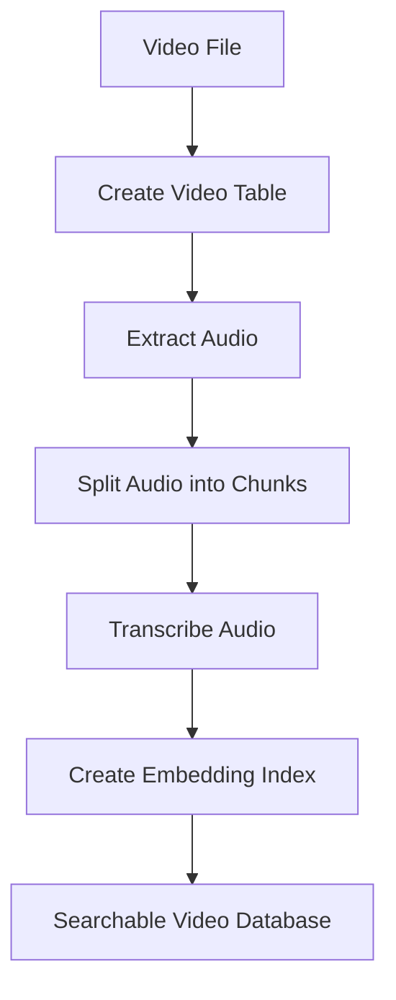

# Tutorials and Examples

<cite>
**Referenced Files in This Document**   
- [1_tool_use_playground.ipynb](file://vaas-api/notebooks/1_tool_use_playground.ipynb)
- [2_agent_playground.ipynb](file://vaas-api/notebooks/2_agent_playground.ipynb)
- [3_memory_playground.ipynb](file://vaas-api/notebooks/3_memory_playground.ipynb)
- [video_ingestion_process.ipynb](file://vaas-mcp/notebooks/video_ingestion_process.ipynb)
- [T1_pixeltable_basics.ipynb](file://tutorials/T1_pixeltable_basics.ipynb)
- [groq_agent.py](file://vaas-api/src/vaas_api/agent/groq/groq_agent.py)
- [video_processor.py](file://vaas-mcp/src/vaas_mcp/video/ingestion/video_processor.py)
- [models.py](file://vaas-api/src/vaas_api/models.py)
- [tools.py](file://vaas-api/src/vaas_api/tools.py)
</cite>

## Table of Contents
1. [Introduction](#introduction)
2. [Tool Use Playground](#tool-use-playground)
3. [Agent Playground](#agent-playground)
4. [Memory Playground](#memory-playground)
5. [Video Ingestion Process](#video-ingestion-process)
6. [PixelTable Basics](#pixeltable-basics)
7. [Conclusion](#conclusion)

## Introduction
This tutorial series provides hands-on guidance for working with the vaas multimodal agent system. The tutorials are designed to help users understand and implement key components of the system, including tool calling, agent decision making, memory management, video processing, and data management with PixelTable. Each tutorial builds on the previous one, offering a progressive learning path from basic concepts to advanced implementations.

The vaas system consists of three main components: the MCP Server for tool management, the MCP Agent with its API for processing requests, and the UI for user interaction. These tutorials focus on the backend functionality, enabling users to understand how the system processes video content, manages conversation state, and makes intelligent decisions using large language models.

**Section sources**
- [GETTING_STARTED.md](file://GETTING_STARTED.md#L1-L57)

## Tool Use Playground

This tutorial demonstrates how the vaas system enables tool calling through the Groq API. The process begins by connecting to the MCP server to retrieve available tools, then transforming these tools into a format compatible with the LLM.

The tutorial shows how to:
- Connect to the MCP server using the FastMCP client
- Retrieve and list available tools
- Transform tool definitions from MCP format to Groq-compatible format
- Use the transformed tools in chat completions
- Handle tool responses and generate appropriate outputs

Key learning objectives:
- Understand the tool calling mechanism in multimodal agents
- Learn how to interface between different API formats
- Practice working with LLM tool integration
- Implement video processing requests through tool calls

Expected outcomes:
- Ability to configure and use tool calling with Groq API
- Understanding of tool schema transformation
- Skills to implement tool-based interactions in agent systems

The tutorial uses a video processing scenario where users can request clips based on spoken phrases, demonstrating practical applications of tool calling in multimedia contexts.

**Section sources**
- [1_tool_use_playground.ipynb](file://vaas-api/notebooks/1_tool_use_playground.ipynb#L1-L316)
- [groq_agent.py](file://vaas-api/src/vaas_api/agent/groq/groq_agent.py#L1-L237)

## Agent Playground

This tutorial explores agent decision-making processes in the vaas system. It demonstrates how the GroqAgent class handles various types of user interactions, including text-only queries, video-based questions, and image-assisted requests.

The tutorial covers:
- Agent initialization and setup
- Handling different message types (text, video, images)
- Decision making for tool usage
- Processing video content to answer user questions
- Working with image inputs alongside video context

Key learning objectives:
- Understand the agent architecture and its components
- Learn how agents decide when to use tools
- Practice implementing multimodal input handling
- Explore agent memory and context management
- Implement image and video processing workflows

Expected outcomes:
- Ability to create and configure custom agents
- Skills to handle multimodal inputs (text, video, images)
- Understanding of agent decision logic
- Capability to extend agent functionality with new tools

The tutorial demonstrates various scenarios, including asking about character appearances in videos, processing user-provided images, and retrieving video clips based on visual content, showcasing the agent's versatility in handling complex multimodal requests.

**Section sources**
- [2_agent_playground.ipynb](file://vaas-api/notebooks/2_agent_playground.ipynb#L1-L218)
- [groq_agent.py](file://vaas-api/src/vaas_api/agent/groq/groq_agent.py#L1-L237)

## Memory Playground

This tutorial focuses on conversation state management using PixelTable for both short-term and long-term memory storage. It demonstrates how to create and manage memory tables, insert conversation records, and implement embedding indexes for semantic search.

The tutorial covers:
- Creating directories and tables in PixelTable
- Defining memory record schemas
- Inserting conversation history into memory tables
- Implementing embedding indexes for semantic search
- Managing memory lifecycle and cleanup

Key learning objectives:
- Understand conversation memory architecture
- Learn to implement short-term memory storage
- Practice creating embedding indexes for long-term memory
- Explore semantic search capabilities in conversation history
- Implement memory management patterns

Expected outcomes:
- Ability to design and implement conversation memory systems
- Skills to work with PixelTable for data storage
- Understanding of embedding-based semantic search
- Capability to manage conversation context across sessions

The tutorial uses a structured approach to memory management, showing how conversation records are stored with metadata like message ID, role, content, and timestamp, enabling sophisticated context handling in agent systems.

**Section sources**
- [3_memory_playground.ipynb](file://vaas-api/notebooks/3_memory_playground.ipynb#L1-L157)
- [groq_agent.py](file://vaas-api/src/vaas_api/agent/memory.py#L1-L100)

## Video Ingestion Process

This tutorial walks through the complete video processing pipeline implemented using PixelTable. It demonstrates how raw video files are transformed into searchable, analyzable data through a series of processing steps.

The tutorial covers:
- Creating video tables and inserting video files
- Extracting audio from video content
- Splitting audio into manageable chunks
- Transcribing audio using GPT-4o Mini
- Creating computed columns and views
- Implementing embedding indexes for search

Key learning objectives:
- Understand video processing pipeline architecture
- Learn to extract and process audio from video
- Practice implementing audio chunking algorithms
- Implement transcription workflows
- Create searchable video indexes

Expected outcomes:
- Ability to design and implement video processing pipelines
- Skills to work with PixelTable iterators and functions
- Understanding of audio-video synchronization
- Capability to create searchable multimedia databases

The tutorial follows a step-by-step approach, starting with video ingestion and progressing through audio extraction, chunking, transcription, and indexing, providing a comprehensive understanding of the entire video processing workflow.

**Diagram sources**
- [video_ingestion_process.ipynb](file://vaas-mcp/notebooks/video_ingestion_process.ipynb#L1-L765)
- [video_processor.py](file://vaas-mcp/src/vaas_mcp/video/ingestion/video_processor.py#L1-L205)

**Section sources**
- [video_ingestion_process.ipynb](file://vaas-mcp/notebooks/video_ingestion_process.ipynb#L1-L765)
- [video_processor.py](file://vaas-mcp/src/vaas_mcp/video/ingestion/video_processor.py#L1-L205)

## PixelTable Basics

This tutorial teaches the fundamentals of video data management using PixelTable, a specialized database system for multimedia content. It covers the core concepts and operations needed to work effectively with video data in the vaas system.

The tutorial covers:
- Setting up PixelTable directories and tables
- Defining video schemas
- Inserting and managing video data
- Creating computed columns for derived data
- Working with views and iterators
- Implementing embedding indexes for similarity search

Key learning objectives:
- Understand PixelTable architecture and data model
- Learn to create and manage video tables
- Practice implementing computed columns
- Explore view creation and management
- Implement embedding-based search capabilities

Expected outcomes:
- Ability to design and implement video data schemas
- Skills to work with PixelTable's iterator system
- Understanding of computed column mechanics
- Capability to create efficient video search systems

The tutorial provides foundational knowledge for working with multimedia databases, focusing on the practical aspects of video data management that are essential for building intelligent video processing applications.

**Section sources**
- [T1_pixeltable_basics.ipynb](file://tutorials/T1_pixeltable_basics.ipynb#L1-L11)
- [video_processor.py](file://vaas-mcp/src/vaas_mcp/video/ingestion/video_processor.py#L1-L205)

## Conclusion
This tutorial series has provided comprehensive guidance on the key components of the vaas multimodal agent system. From tool calling and agent decision making to memory management and video processing, these tutorials offer a complete learning path for developers and researchers working with multimodal AI systems.

The tutorials demonstrate how to:
- Integrate different API formats for tool calling
- Implement intelligent agent decision making
- Manage conversation state effectively
- Process video content through structured pipelines
- Store and query multimedia data efficiently

By following these tutorials, users gain practical experience with the complete workflow of a multimodal agent system, from initial setup to advanced implementations. The skills learned can be applied to build sophisticated AI applications that process and understand multiple forms of media in context-aware ways.

For further exploration, users are encouraged to experiment with the provided notebooks, modify the code to implement new features, and explore the API reference documentation for additional capabilities.

**Section sources**
- [1_tool_use_playground.ipynb](file://vaas-api/notebooks/1_tool_use_playground.ipynb#L1-L316)
- [2_agent_playground.ipynb](file://vaas-api/notebooks/2_agent_playground.ipynb#L1-L218)
- [3_memory_playground.ipynb](file://vaas-api/notebooks/3_memory_playground.ipynb#L1-L157)
- [video_ingestion_process.ipynb](file://vaas-mcp/notebooks/video_ingestion_process.ipynb#L1-L765)
- [T1_pixeltable_basics.ipynb](file://tutorials/T1_pixeltable_basics.ipynb#L1-L11)