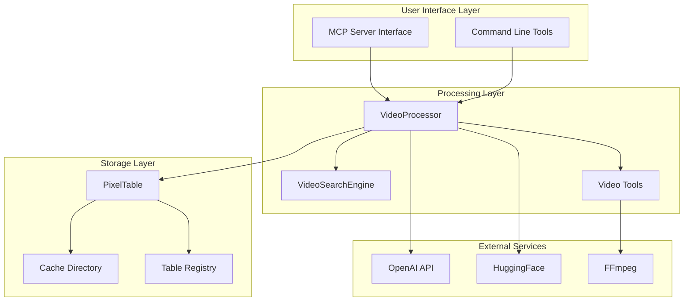
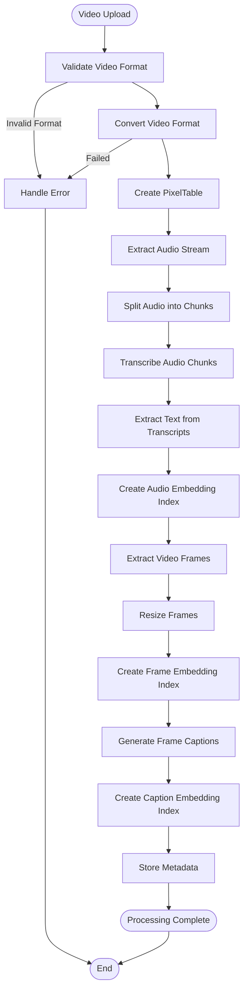
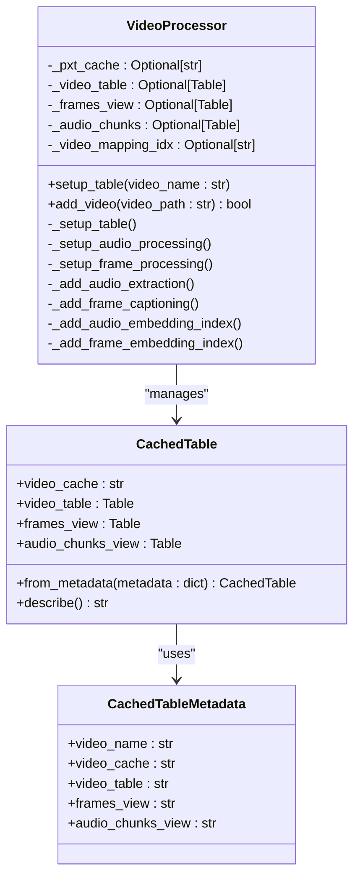
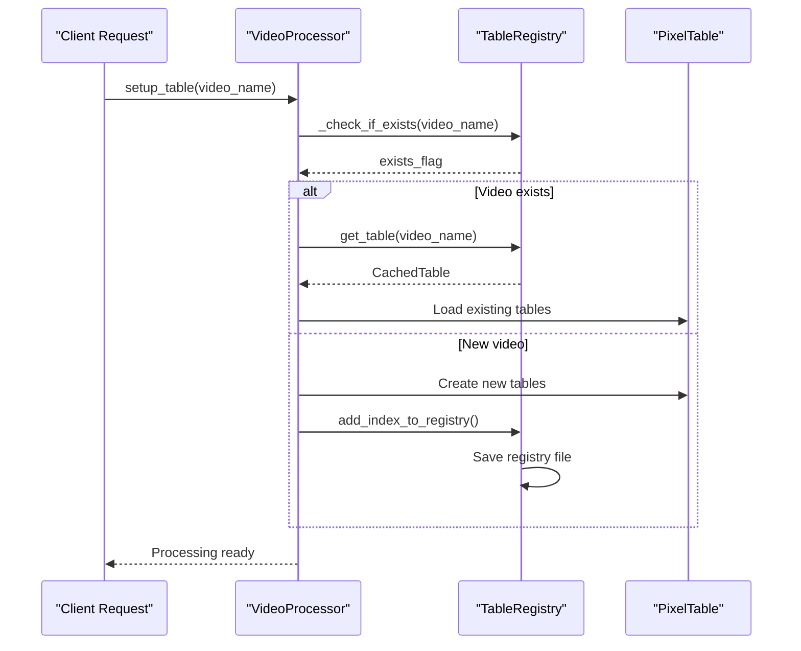
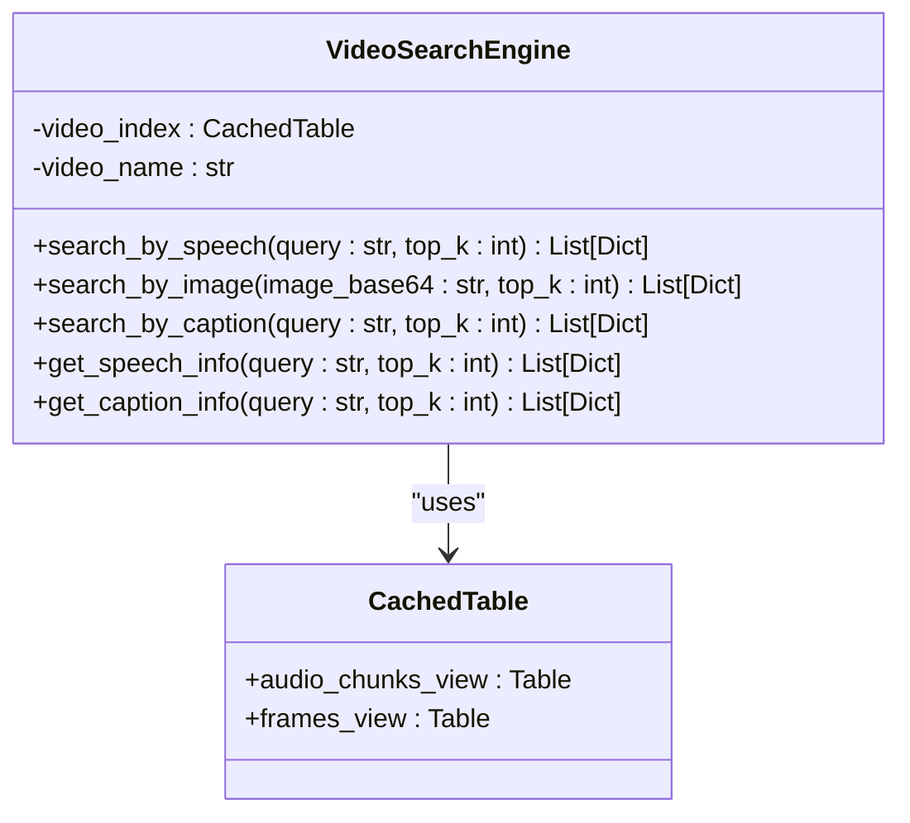
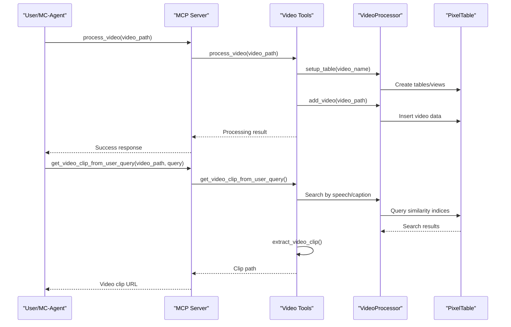

# Video Ingestion Process Tutorial

<cite>
**Referenced Files in This Document**
- [video_ingestion_process.ipynb](file://vaas-mcp/notebooks/video_ingestion_process.ipynb)
- [video_processor.py](file://vaas-mcp/src/vaas_mcp/video/ingestion/video_processor.py)
- [models.py](file://vaas-mcp/src/vaas_mcp/video/ingestion/models.py)
- [registry.py](file://vaas-mcp/src/vaas_mcp/video/ingestion/registry.py)
- [functions.py](file://vaas-mcp/src/vaas_mcp/video/ingestion/functions.py)
- [tools.py](file://vaas-mcp/src/vaas_mcp/video/ingestion/tools.py)
- [server.py](file://vaas-mcp/src/vaas_mcp/server.py)
- [tools.py](file://vaas-mcp/src/vaas_mcp/tools.py)
- [video_search_engine.py](file://vaas-mcp/src/vaas_mcp/video/video_search_engine.py)
- [config.py](file://vaas-mcp/src/vaas_mcp/config.py)
- [constants.py](file://vaas-mcp/src/vaas_mcp/video/ingestion/constants.py)
- [Makefile](file://vaas-mcp/Makefile)
</cite>

## Table of Contents
1. [Introduction](#introduction)
2. [System Architecture Overview](#system-architecture-overview)
3. [Video Ingestion Pipeline](#video-ingestion-pipeline)
4. [Core Components Analysis](#core-components-analysis)
5. [Integration with MCP Server](#integration-with-mcp-server)
6. [Hands-On Tutorial](#hands-on-tutorial)
7. [Debugging and Troubleshooting](#debugging-and-troubleshooting)
8. [Performance Considerations](#performance-considerations)
9. [Best Practices](#best-practices)
10. [Conclusion](#conclusion)

## Introduction

The vaas-MCP video ingestion process is a sophisticated pipeline designed to transform raw video files into searchable multimedia content. This tutorial provides a comprehensive walkthrough of the entire video processing workflow, from initial upload to final indexing via PixelTable. The system leverages advanced technologies including OpenAI's GPT models for transcription and captioning, CLIP embeddings for visual similarity, and a robust caching mechanism for efficient content retrieval.

The video ingestion process is orchestrated by the `VideoProcessor` class, which manages the complete lifecycle of video content transformation. Through this tutorial, you'll learn how to process videos, understand the underlying data structures, and integrate with the MCP server for intelligent video search capabilities.

## System Architecture Overview

The video ingestion system follows a modular architecture that separates concerns across multiple layers:



**Diagram sources**
- [server.py](file://vaas-mcp/src/vaas_mcp/server.py#L1-L97)
- [video_processor.py](file://vaas-mcp/src/vaas_mcp/video/ingestion/video_processor.py#L1-L205)
- [video_search_engine.py](file://vaas-mcp/src/vaas_mcp/video/video_search_engine.py#L1-L168)

The architecture consists of four main layers:

1. **User Interface Layer**: Provides access to video processing capabilities through MCP server and CLI tools
2. **Processing Layer**: Contains the core video processing logic and search engines
3. **Storage Layer**: Manages data persistence using PixelTable and maintains registry information
4. **External Services**: Integrates with AI services for transcription, captioning, and embeddings

**Section sources**
- [server.py](file://vaas-mcp/src/vaas_mcp/server.py#L1-L97)
- [video_processor.py](file://vaas-mcp/src/vaas_mcp/video/ingestion/video_processor.py#L1-L205)

## Video Ingestion Pipeline

The video ingestion process follows a structured pipeline that transforms raw video content into searchable multimedia assets. Here's the complete workflow:



**Diagram sources**
- [video_processor.py](file://vaas-mcp/src/vaas_mcp/video/ingestion/video_processor.py#L40-L205)
- [video_ingestion_process.ipynb](file://vaas-mcp/notebooks/video_ingestion_process.ipynb#L1-L765)

### Stage 1: Video Upload and Validation

The ingestion process begins when a video file is uploaded to the system. The `VideoProcessor` validates the video format and ensures compatibility with the processing pipeline.

### Stage 2: Audio Extraction and Processing

The system extracts the audio stream from the video using FFmpeg and creates a dedicated audio processing pipeline. Audio chunks are created with configurable duration and overlap settings.

### Stage 3: Frame Extraction and Processing

Video frames are extracted at configurable intervals (FPS) and processed for visual similarity analysis. Frames undergo resizing to optimize computational efficiency.

### Stage 4: Caption Generation

Each frame receives automatic caption generation using OpenAI's GPT-4o-mini model, providing textual descriptions of visual content.

### Stage 5: Index Creation

Multiple embedding indices are created for different modalities:
- Audio transcript similarity
- Visual frame similarity  
- Caption text similarity

**Section sources**
- [video_processor.py](file://vaas-mcp/src/vaas_mcp/video/ingestion/video_processor.py#L40-L205)
- [video_ingestion_process.ipynb](file://vaas-mcp/notebooks/video_ingestion_process.ipynb#L1-L765)

## Core Components Analysis

### VideoProcessor Class

The `VideoProcessor` is the central orchestrator of the video ingestion pipeline. It manages the complete lifecycle of video processing and maintains state across different processing stages.



**Diagram sources**
- [video_processor.py](file://vaas-mcp/src/vaas_mcp/video/ingestion/video_processor.py#L20-L205)
- [models.py](file://vaas-mcp/src/vaas_mcp/video/ingestion/models.py#L15-L119)

The VideoProcessor implements several key methods:

- **setup_table()**: Initializes the video processing pipeline and creates necessary tables/views
- **add_video()**: Adds a new video to the processing queue and handles re-encoding if necessary
- **_setup_audio_processing()**: Orchestrates audio-related processing steps
- **_setup_frame_processing()**: Manages frame extraction and captioning

### Table Registry System

The registry system maintains persistent storage of processed video metadata and allows for efficient lookup of previously processed videos.



**Diagram sources**
- [video_processor.py](file://vaas-mcp/src/vaas_mcp/video/ingestion/video_processor.py#L40-L60)
- [registry.py](file://vaas-mcp/src/vaas_mcp/video/ingestion/registry.py#L1-L110)

### Video Search Engine

The `VideoSearchEngine` provides multimodal search capabilities across different video processing artifacts:



**Diagram sources**
- [video_search_engine.py](file://vaas-mcp/src/vaas_mcp/video/video_search_engine.py#L10-L168)

**Section sources**
- [video_processor.py](file://vaas-mcp/src/vaas_mcp/video/ingestion/video_processor.py#L20-L205)
- [models.py](file://vaas-mcp/src/vaas_mcp/video/ingestion/models.py#L15-L119)
- [registry.py](file://vaas-mcp/src/vaas_mcp/video/ingestion/registry.py#L1-L110)
- [video_search_engine.py](file://vaas-mcp/src/vaas_mcp/video/video_search_engine.py#L10-L168)

## Integration with MCP Server

The video ingestion system integrates seamlessly with the MCP (Model Context Protocol) server, providing intelligent video processing capabilities through standardized tool interfaces.



**Diagram sources**
- [server.py](file://vaas-mcp/src/vaas_mcp/server.py#L10-L35)
- [tools.py](file://vaas-mcp/src/vaas_mcp/tools.py#L15-L105)

### Available MCP Tools

The system exposes several key tools through the MCP interface:

1. **process_video**: Processes a video file and prepares it for searching
2. **get_video_clip_from_user_query**: Retrieves video clips based on text queries
3. **get_video_clip_from_image**: Finds clips based on visual similarity
4. **ask_question_about_video**: Answers questions using video content

### Tool Implementation Details

Each tool integrates with the underlying video processing infrastructure:

```python
# Example tool implementation
def process_video(video_path: str) -> str:
    """Process a video file and prepare it for searching."""
    exists = video_processor._check_if_exists(video_path)
    if exists:
        logger.info(f"Video index for '{video_path}' already exists")
        return False
    
    video_processor.setup_table(video_name=video_path)
    is_done = video_processor.add_video(video_path=video_path)
    return is_done
```

**Section sources**
- [server.py](file://vaas-mcp/src/vaas_mcp/server.py#L10-L35)
- [tools.py](file://vaas-mcp/src/vaas_mcp/tools.py#L15-L105)

## Hands-On Tutorial

### Prerequisites

Before starting, ensure you have:
- Python 3.8+
- Docker installed
- OpenAI API key configured
- FFmpeg installed

### Step 1: Setup Environment

First, configure your environment by creating a `.env` file:

```bash
# .env file
OPENAI_API_KEY=your_openai_api_key
OPIK_API_KEY=your_opik_api_key
```

### Step 2: Process a Video

Run the MCP server:

```bash
cd vaas-mcp
make start-vaas-mcp
```

Then process a video using the MCP interface:

```python
# Using the MCP client
client = MCPClient("ws://localhost:9090")
await client.call_tool("process_video", {"video_path": "/path/to/video.mp4"})
```

### Step 3: Interactive Processing

For interactive processing, use the Jupyter notebook:

```python
# From the notebook
video_path = "./data/sample_video.mp4"
video_processor = VideoProcessor()
video_processor.setup_table(video_name=video_path)
video_processor.add_video(video_path=video_path)
```

### Step 4: Search Capabilities

Once processing is complete, utilize the search capabilities:

```python
# Search by speech
search_engine = VideoSearchEngine(video_path)
results = search_engine.search_by_speech("important topic", top_k=3)

# Search by image
with open("query_image.jpg", "rb") as f:
    image_data = base64.b64encode(f.read()).decode("utf-8")
results = search_engine.search_by_image(image_data, top_k=3)
```

### Sample Videos for Practice

The system includes sample videos for testing:

- `pass_the_butter_rick_and_morty.mp4`: A classic Rick and Morty scene
- `sample_conversation.mp4`: A demonstration of conversation processing
- `presentation_demo.mp4`: A presentation-style video

**Section sources**
- [video_ingestion_process.ipynb](file://vaas-mcp/notebooks/video_ingestion_process.ipynb#L1-L765)
- [Makefile](file://vaas-mcp/Makefile#L15-L25)

## Debugging and Troubleshooting

### Common Issues and Solutions

#### Video Format Compatibility

**Problem**: Videos fail to process due to unsupported formats
**Solution**: Use the built-in video conversion tool:

```bash
make fix-video input=/path/to/input.mp4 output=/path/to/output.mp4
```

#### Memory Issues

**Problem**: Large videos cause memory exhaustion
**Solution**: Adjust processing parameters in the configuration:

```python
# Reduce frame sampling rate
settings.SPLIT_FRAMES_COUNT = 10  # From default 45
```

#### API Rate Limits

**Problem**: OpenAI API rate limits exceeded
**Solution**: Implement retry logic and adjust request frequency:

```python
# Configure in settings
settings.AUDIO_TRANSCRIPT_MODEL = "gpt-4o-mini"  # More cost-effective
```

### Debug Mode

Enable debug logging for detailed processing information:

```python
import loguru
loguru.logger.level("DEBUG")
```

### Error Recovery

The system implements several error recovery mechanisms:

1. **Automatic Retry**: Failed operations are automatically retried
2. **Fallback Processing**: Alternative processing methods when primary fails
3. **Partial Results**: Continue processing even if some steps fail

**Section sources**
- [tools.py](file://vaas-mcp/src/vaas_mcp/video/ingestion/tools.py#L120-L155)
- [config.py](file://vaas-mcp/src/vaas_mcp/config.py#L1-L56)

## Performance Considerations

### Processing Optimization

The video ingestion system implements several optimization strategies:

1. **Parallel Processing**: Multiple processing steps run concurrently
2. **Caching**: Intermediate results are cached to avoid recomputation
3. **Lazy Loading**: Tables and views are loaded only when needed
4. **Batch Operations**: Multiple operations are batched for efficiency

### Resource Management

Key resource management strategies:

- **Memory Usage**: Configurable frame sizes and processing intervals
- **Disk Space**: Automatic cleanup of temporary files
- **Network Bandwidth**: Optimized API calls with compression
- **Compute Resources**: Efficient embedding calculations

### Scaling Considerations

For large-scale deployments:

- **Horizontal Scaling**: Multiple instances can process different videos
- **Load Balancing**: Distribute processing requests across instances
- **Queue Management**: Implement message queues for batch processing
- **Monitoring**: Track processing metrics and system health

## Best Practices

### Video Preparation

1. **Format Standards**: Use MP4 containers with H.264/H.265 codecs
2. **Resolution Guidelines**: Optimal resolution depends on use case
3. **Duration Limits**: Consider processing time for long videos
4. **Quality Settings**: Balance quality vs. processing speed

### Configuration Tuning

Customize settings based on your requirements:

```python
# Audio processing
settings.AUDIO_CHUNK_LENGTH = 15  # Increase for longer segments
settings.AUDIO_OVERLAP_SECONDS = 2  # More overlap for continuity

# Frame processing
settings.SPLIT_FRAMES_COUNT = 30  # Adjust based on motion
settings.IMAGE_RESIZE_WIDTH = 800  # Reduce for faster processing

# Search parameters
settings.VIDEO_CLIP_SPEECH_SEARCH_TOP_K = 5  # More results
settings.DELTA_SECONDS_FRAME_INTERVAL = 3.0  # Smaller windows
```

### Monitoring and Maintenance

1. **Log Monitoring**: Regular review of processing logs
2. **Resource Tracking**: Monitor disk space and memory usage
3. **Performance Metrics**: Track processing times and success rates
4. **Backup Strategy**: Regular backup of processed video metadata

### Security Considerations

1. **File Validation**: Verify video file integrity before processing
2. **Access Control**: Restrict access to sensitive video content
3. **Data Encryption**: Encrypt stored video data and metadata
4. **API Security**: Secure API endpoints and rate limiting

## Conclusion

The vaas-MCP video ingestion process represents a sophisticated approach to transforming raw video content into searchable multimedia assets. Through this tutorial, you've learned about:

- The complete video processing pipeline from upload to indexing
- The role of the VideoProcessor in orchestrating the ingestion workflow
- Integration with the MCP server for intelligent video search capabilities
- Practical implementation using both programmatic and interactive approaches
- Debugging techniques and performance optimization strategies

The system's modular architecture enables flexible deployment across various use cases, from individual research projects to enterprise-scale video processing platforms. By leveraging advanced AI services and efficient data structures, the system provides powerful capabilities for video content discovery and analysis.

Future enhancements could include support for additional video formats, improved real-time processing capabilities, and expanded multimodal search options. The foundation established by this tutorial provides a solid base for extending and customizing the video ingestion process to meet specific requirements.